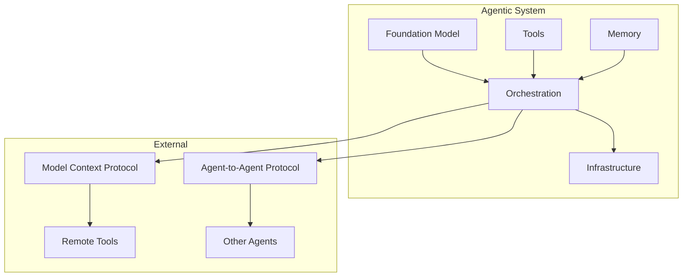
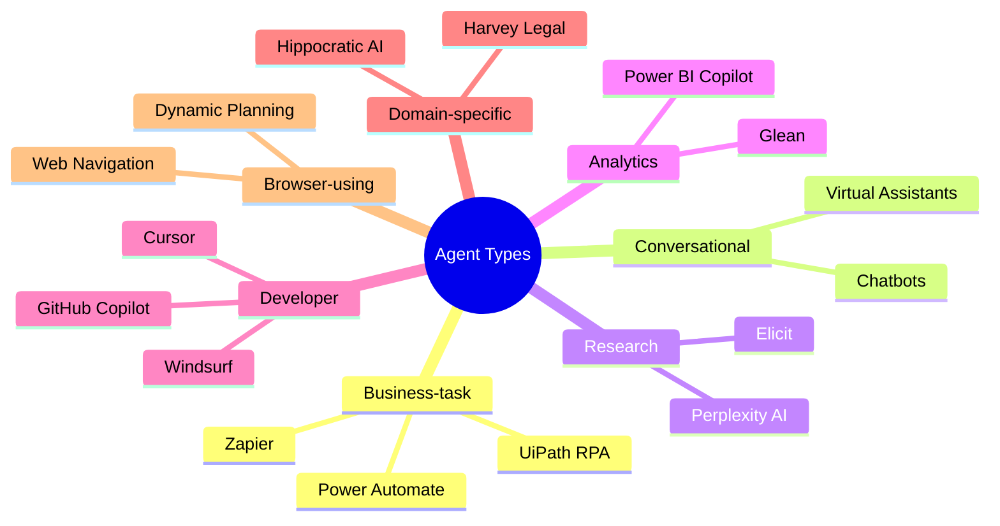
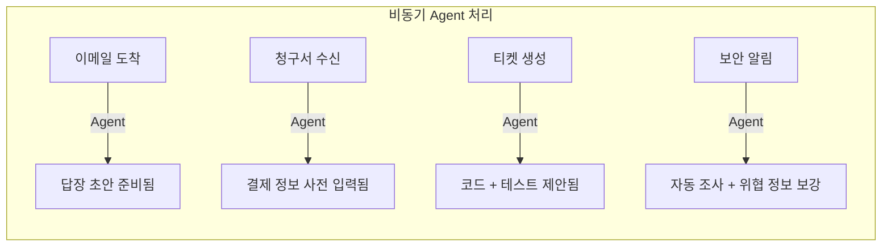
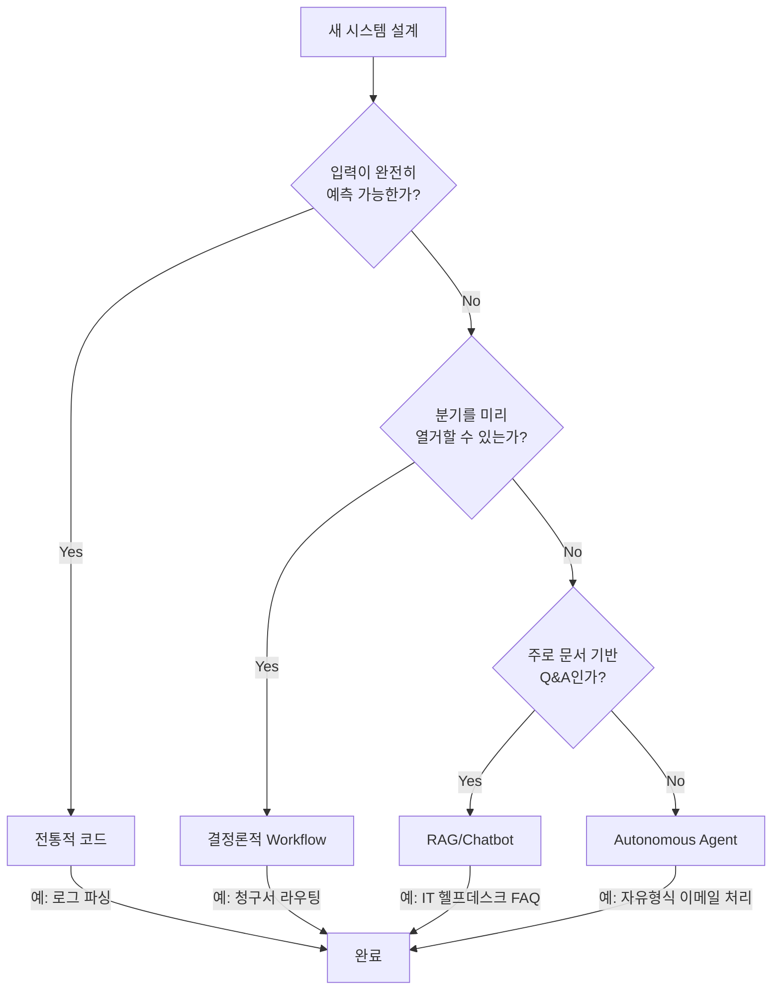
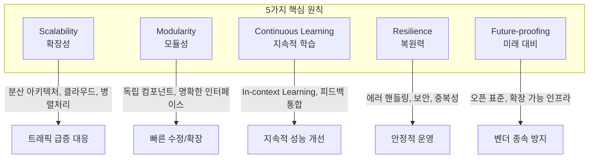

# Chapter 1. Introduction to Agents

## 핵심 요약

> Autonomous Agent는 독립적으로 추론하고, 의사결정을 내리며, 동적 환경에서 효과적으로 상호작용하는 지능형 소프트웨어 시스템이다. Foundation Model의 발전으로 구조화된 함수 호출과 도구 사용이 가능해졌으며, 이를 통해 실질적인 작업 수행이 가능한 Agentic System 구축이 현실화되었다.

**핵심 키워드**: `Autonomous Agent`, `Foundation Model`, `Agentic System`, `Tool Use`, `Orchestration Framework`

---

## 학습 목표

이 챕터를 학습한 후 다음을 이해할 수 있어야 한다:

- [ ] AI Agent의 정의와 진정한 자율성의 기준
- [ ] Foundation Model이 Agent에 제공하는 핵심 역량
- [ ] 7가지 Agent 유형과 각각의 특성
- [ ] 모델 선택 시 고려해야 할 요소
- [ ] Workflow vs Agent 선택 기준
- [ ] 효과적인 Agentic System 구축 원칙
- [ ] 주요 Agentic Framework 비교

---

## 본문 정리

### 1. AI Agent 정의

#### Agent의 본질
```
진정한 Agent의 핵심 테스트:
"정적 스크립트를 따르는 것이 아닌, 실제 의사결정을 수행하는가?"
```

**Agency는 스펙트럼으로 존재:**

| 특성 | 낮은 자율성 | 높은 자율성 |
|------|------------|------------|
| 실행 방식 | 결정론적 스크립트 | 맥락 기반 추론 |
| 적응력 | 고정된 워크플로우 | 동적 적응 |
| 의사결정 | 사전 프로그래밍 | 실시간 판단 |

#### Agentic System 구성요소



---

### 2. Pretraining Revolution

#### 전통적 ML vs Foundation Model

| 관점 | 전통적 ML | Foundation Model |
|------|----------|------------------|
| 데이터 | 개별 수집/정제 필요 | 대규모 사전학습 완료 |
| 작업 범위 | 단일 태스크 | 다양한 태스크 적응 |
| 배포 | 직접 학습/호스팅 | API 호출 |
| 비용/복잡도 | 높음 | 낮음 |

#### Foundation Model의 Agent 역량

**기본 역량:**
- **Natural Language Understanding**: 사용자 입력의 직관적 해석
- **Context-aware Interaction**: 확장된 상호작용에서 맥락 유지
- **Structured Content Generation**: 텍스트, 코드, 구조화된 출력 생성

**고급 역량:**
- **Contextual Interpretation & Decision Making**: 모호한 상황 탐색
- **Tool Use**: 정보 검색 및 액션 수행을 위한 외부 소프트웨어 호출
- **Adaptive Planning**: 복잡한 다단계 작업 자율 계획/실행
- **Information Summarization**: 문서 요약 및 핵심 인사이트 추출
- **Code Generation**: 코드 작성, 실행, 유닛 테스트 생성
- **Multimodal Synthesis**: 이미지, 오디오, 비디오 데이터 분석

---

### 3. Agent 유형 분류

#### 7가지 핵심 Agent 유형



| Agent 유형 | 주요 기능 | 대표 사례 |
|-----------|---------|----------|
| **Business-task** | 사전 정의된 워크플로우 자동화 | UiPath, Power Automate, Zapier |
| **Conversational** | 자연어 대화 인터페이스 | 고객 지원 챗봇 |
| **Research** | 정보 수집, 합성, 요약 | Perplexity AI, Elicit |
| **Analytics** | 데이터셋 해석 및 인사이트 생성 | Power BI Copilot, Glean |
| **Developer** | 코드 생성, 리팩토링, 설명 | Cursor, Windsurf, GitHub Copilot |
| **Domain-specific** | 전문 도메인 특화 | Harvey(법률), Hippocratic AI(의료) |
| **Browser-using** | 웹사이트 탐색 및 상호작용 | 동적 계획 기반 브라우저 자동화 |

#### 신흥 Agent 유형
- **Voice Agents**: 음성 이해/생성 기반 대화 자동화
- **Video Agents**: 아바타 기반 비디오 응답, 맞춤형 비디오 상호작용

---

### 4. Model Selection

#### HELM 벤치마크 (2025년 8월)

| 모델 | 평균 점수 | MMLU-Pro | GPQA | IFEval | WildBench |
|------|----------|----------|------|--------|-----------|
| GPT-5 mini | **0.819** | 0.835 | 0.756 | 0.927 | 0.855 |
| o4-mini | 0.812 | 0.820 | 0.735 | 0.929 | 0.854 |
| o3 | 0.811 | 0.859 | 0.753 | 0.869 | 0.861 |
| GPT-5 | 0.807 | 0.863 | 0.791 | 0.875 | 0.857 |
| Qwen3 235B | 0.798 | 0.844 | 0.726 | 0.835 | 0.866 |
| Claude 4 Opus | 0.780 | 0.875 | 0.709 | 0.849 | 0.852 |

#### 모델 선택 전략

```
🎯 핵심 인사이트:
"미래는 거의 확실히 멀티모델이다.
지금 유연성을 설계하면 나중에 보상받는다."
```

**권장 접근법:**
1. **시작점**: OpenAI/Anthropic의 최신 범용 모델 사용
2. **최적화**: 소형 모델 실험, Fine-tuning, Retrieval 추가
3. **자동화**: 쿼리 복잡도에 따른 동적 모델 라우팅

---

### 5. 동기 vs 비동기 작업

#### 패러다임 전환

| 관점 | 동기식 (전통) | 비동기식 (Agent) |
|------|-------------|-----------------|
| 실행 | 순차적, 블로킹 | 병렬, 논블로킹 |
| 효율성 | 유휴 시간 발생 | 리소스 최적화 |
| 적응성 | 정적 | 동적 우선순위 조정 |

#### 실제 적용 예시



**역할 전환**: Task Executor → Task Manager
- 반복적/기계적 작업 → Agent 처리
- 전략적 감독, 검토, 고가치 의사결정 → 인간

---

### 6. Workflow vs Agent 선택 가이드

#### 의사결정 매트릭스



#### 특성 비교

| 특성 | 전통적 코드 | Workflow | Autonomous Agent |
|------|-----------|----------|------------------|
| **입력 구조** | 완전 예측 가능 | 유한 분기 | 비구조적/신규 |
| **설명 가능성** | 완전 투명 | 분기별 감사 추적 | 블랙박스 (추가 도구 필요) |
| **지연시간** | 초저지연 | 중간 | 높음 |
| **적응/학습** | 없음 | 제한적 | 높음 (피드백 학습) |

#### 선택 기준 질문

1. 입력이 비구조적이거나 예측 불가능한가?
2. 중간 결과에 따른 다단계 계획이 필요한가?
3. 문서 검색 시스템으로 충분한가, 자율 결정/행동이 필요한가?
4. 최소한의 인간 개입으로 자기 개선이 필요한가?
5. Foundation Model의 지연시간과 유지보수 부담을 감당할 수 있는가?

---

### 7. 효과적인 Agentic System 구축 원칙



| 원칙 | 설명 | 실패 시 문제 |
|------|------|-------------|
| **Scalability** | 분산 아키텍처, 병렬 처리 | 트래픽 급증 시 크래시/행 |
| **Modularity** | 독립적, 교체 가능한 컴포넌트 | 작은 수정에도 전체 재배포 |
| **Continuous Learning** | 피드백 기반 행동 개선 | 동일한 실수 반복 |
| **Resilience** | 에러, 보안 위협, 타임아웃 처리 | API 실패 시 전체 크래시 |
| **Future-proofing** | 오픈 표준, 확장 가능 인프라 | 모델 전환 시 고통 |

---

### 8. 조직적 성공 전략

#### 균형 잡힌 접근법

```
실험의 자유 ←→ 확장성/일관성을 위한 정렬
```

**단계별 전략:**
1. **초기**: 다양한 아키텍처, 워크플로우, 모델 자유롭게 탐색
2. **성숙**: 부서/기능 영역별 "One Standard per Large Group" 적용
3. **공유**: 성공/실패 사례 내부 포럼, 공유 저장소, 문서화

**핵심 원칙:**
- 벤더 종속 방지 (OpenAPI 등 오픈 표준 채택)
- 모듈식 시스템 설계
- 가벼운 거버넌스 (엄격한 명령보다 가이드 원칙)

---

### 9. Agentic Framework 비교

| Framework | 강점 | 트레이드오프 | 적합한 경우 |
|-----------|------|-------------|------------|
| **LangGraph** | 모듈식 오케스트레이션, DAG 기반, 비동기 워크플로우, 재시도 지원 | 고급 계획/메모리는 커스텀 로직 필요 | 단일 또는 경량 멀티에이전트 시스템 |
| **AutoGen** | 강력한 멀티에이전트 오케스트레이션, 동적 역할 할당 | 단순 사례에 복잡할 수 있음 | 멀티에이전트 대화 시스템 |
| **CrewAI** | 쉬운 학습/사용, 빠른 프로토타이핑 | 커스터마이징 제한, 복잡한 워크플로우에 미성숙 | 빠른 시작, 어시스턴트/지원 에이전트 |
| **OpenAI Agents SDK** | OpenAI 생태계 통합, 보안, 함수 호출/메모리 프리미티브 | OpenAI 인프라에 종속 | OpenAI API 기반 빠른 개발 |

```mermaid
quadrantChart
    title Framework 선택 가이드
    x-axis 단순함 --> 복잡함
    y-axis 단일 에이전트 --> 멀티 에이전트
    quadrant-1 AutoGen
    quadrant-2 LangGraph (Production)
    quadrant-3 CrewAI, OpenAI SDK
    quadrant-4 LangGraph (Simple)
```

**책의 선택**: LangGraph - 직관적이면서도 강력한 접근 방식

---

### 10. 실용적 적용 사례 (7가지 예제 Agent)

| Agent | 기능 |
|-------|------|
| **Customer Support** | 문의 처리, 환불, 주문 업데이트, 에스컬레이션 |
| **Financial Services** | 계정 관리, 대출 처리, 사기 조사, 포트폴리오 리밸런싱 |
| **Healthcare Intake/Triage** | 환자 등록, 보험 확인, 증상 평가, 예약 관리 |
| **IT Help Desk** | 사용자 접근 관리, 문제 해결, 소프트웨어 배포, 보안 대응 |
| **Legal Document Review** | 계약 검토, 법률 조사, 컴플라이언스 평가 |
| **SOC Analyst** | 보안 알림 조사, 위협 정보 수집, 인시던트 분류 |
| **Supply Chain/Logistics** | 재고 최적화, 배송 추적, 수요 예측, 중단 관리 |

---

## 심화 학습

### 핵심 프로토콜

1. **Model Context Protocol (MCP)** - Chapter 4에서 상세 다룸
   - Agent가 원격 도구 사용 가능하게 함

2. **Agent-to-Agent Protocol (A2A)** - Chapter 8에서 상세 다룸
   - Agent 간 협업을 통한 문제 해결

### 추가 탐구 주제

- **Distillation, Quantization**: 소형 모델의 성능 향상 기법
- **Synthetic Data Generation**: 컴팩트 모델 학습용 데이터 생성
- **Dynamic Test-time Optimization**: 자동 모델 선택/라우팅

---

## 실무 적용 포인트

### 즉시 적용 가능한 인사이트

1. **모델 선택 시작점**
   ```
   1단계: OpenAI/Anthropic 최신 범용 모델로 시작
   2단계: 성능/비용 최적화가 필요하면 소형 모델 실험
   3단계: 멀티모델 라우팅 고려
   ```

2. **Agent vs Workflow 결정 체크리스트**
   - [ ] 입력이 비구조적/예측 불가능 → Agent
   - [ ] 다단계 동적 계획 필요 → Agent
   - [ ] 문서 Q&A 중심 → RAG
   - [ ] 유한 분기 열거 가능 → Workflow
   - [ ] 완전 예측 가능 입력 → 코드

3. **Framework 빠른 선택**
   - 빠른 프로토타입 → CrewAI / OpenAI SDK
   - 프로덕션 단일 에이전트 → LangGraph
   - 멀티에이전트 협업 → AutoGen

### 주의사항

- Agent라는 용어의 희석: 진정한 자율성 vs 결정론적 스크립트 구분 필요
- 조기 표준화 위험: 탐색 단계에서는 자유로운 실험 장려
- 벤더 종속: 오픈 표준과 모듈식 설계로 미래 대비

---

## 핵심 개념 체크리스트

### 필수 용어

| 용어 | 정의 |
|------|------|
| **Autonomous Agent** | 독립적으로 추론, 의사결정, 행동하는 지능형 시스템 |
| **Agentic System** | Agent 실행을 지원하는 전체 기능 (도구, 메모리, FM, 오케스트레이션, 인프라) |
| **Foundation Model** | 대규모 데이터로 사전학습된 범용 생성 모델 |
| **Tool Use** | Agent가 외부 소프트웨어를 호출해 정보 검색/액션 수행 |
| **Orchestration** | Agent의 워크플로우와 도구 호출 조정 |
| **MCP** | Model Context Protocol - 원격 도구 사용 프로토콜 |
| **A2A** | Agent-to-Agent Protocol - 에이전트 간 협업 프로토콜 |

### 이해도 점검 질문

1. 진정한 Agent와 단순 스크립트의 차이점은?
2. Foundation Model이 Agent에 제공하는 7가지 고급 역량을 나열하시오.
3. Workflow 대신 Agent를 선택해야 하는 조건 3가지는?
4. Agentic System 구축의 5가지 원칙과 각각의 실패 시나리오는?
5. LangGraph vs AutoGen vs CrewAI의 핵심 차이점은?

---

## 참고 자료

### 공식 리소스
- [책 공식 GitHub Repository](https://github.com/) - 7가지 예제 Agent 및 평가 시스템
- [HELM Benchmark](https://crfm.stanford.edu/helm/) - 모델 성능 비교

### Framework 문서
- [LangGraph Documentation](https://langchain-ai.github.io/langgraph/)
- [AutoGen Documentation](https://microsoft.github.io/autogen/)
- [CrewAI Documentation](https://docs.crewai.com/)
- [OpenAI Agents SDK](https://platform.openai.com/)

### 관련 챕터
- Chapter 4: Model Context Protocol (MCP) 상세
- Chapter 8: Agent-to-Agent Protocol 상세
