# Chapter 2. Designing Agent Systems

## 핵심 요약

> Agent 시스템 설계는 거창한 설계 문서가 아닌 **구체적인 문제**에서 시작한다. 성공적인 Agent는 명확하게 범위가 정의된 작업(tractable slice)을 선택하고, Core Component(모델, 도구, 메모리, 오케스트레이션)를 효과적으로 조합하며, 반복적 설계와 실제 환경 테스트를 통해 지속적으로 개선된다.

**핵심 키워드**: `Tractable Slice`, `Core Components`, `Design Trade-offs`, `Single/Multi-agent Architecture`, `Iterative Design`

---

## 학습 목표

이 챕터를 학습한 후 다음을 이해할 수 있어야 한다:

- [ ] 첫 Agent 시스템 구축 방법과 적절한 scope 설정
- [ ] Agent의 4가지 Core Component와 각각의 역할
- [ ] 모델 선택 시 고려해야 할 요소 (크기, 비용, 성능)
- [ ] 도구 설계의 3가지 유형 (Local, API, MCP)
- [ ] 메모리의 유형과 관리 전략
- [ ] 설계 시 Trade-off (성능, 확장성, 신뢰성, 비용)
- [ ] Single-agent vs Multi-agent 아키텍처 선택 기준
- [ ] 반복적 설계, 평가 전략, 실제 환경 테스트 모범 사례

---

## 본문 정리

### 1. 첫 Agent 시스템 구축

#### 문제 정의: Ecommerce 고객 지원

```
📧 일일 수백 건의 고객 이메일:
- 환불 요청 (broken mug)
- 주문 취소 (unshipped order)
- 배송 주소 변경

💡 핵심 인사이트:
"인간이 키를 누르고 버튼을 클릭하며 규칙을 따르는 패턴은
Foundation Model 기반 시스템으로 수행할 수 있다"
```

#### Scope 설정의 균형

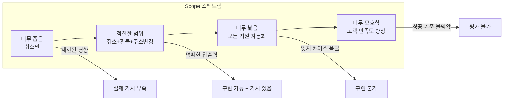

#### 최소 Agent 코드 예시

```python
from langchain.tools import tool
from langchain_openai.chat_models import ChatOpenAI
from langgraph.graph import StateGraph

# 1) 비즈니스 도구 정의
@tool
def cancel_order(order_id: str) -> str:
    """Cancel an order that hasn't shipped."""
    return f"Order {order_id} has been cancelled."

# 2) Agent "두뇌": LLM 호출 → 도구 실행 → LLM 재호출
def call_model(state):
    msgs = state["messages"]
    order = state.get("order", {"order_id": "UNKNOWN"})

    prompt = f'''You are an ecommerce support agent.
        ORDER ID: {order['order_id']}
        If the customer asks to cancel, call cancel_order(order_id)...'''

    # 1차 LLM: 도구 호출 결정
    first = ChatOpenAI(model="gpt-5", temperature=0)(...)

    if getattr(first, "tool_calls", None):
        # 도구 실행
        result = cancel_order(**tc["args"])
        # 2차 LLM: 최종 확인 메시지 생성
        second = ChatOpenAI(model="gpt-5", temperature=0)(...)

    return {"messages": out}

# 3) StateGraph로 연결
graph = StateGraph({"order": None, "messages": []})
graph.add_node("assistant", call_model)
```

#### 평가의 중요성

```python
# 최소 평가 체크
assert any("cancel_order" in str(m.content) for m in result["messages"]),
    "Cancel order tool not called"
assert any("cancelled" in m.content.lower() for m in result["messages"]),
    "Confirmation message missing"
```

> **"테스트되지 않은 Agent는 신뢰할 수 없는 Agent이다"**

---

### 2. Core Components of Agent Systems

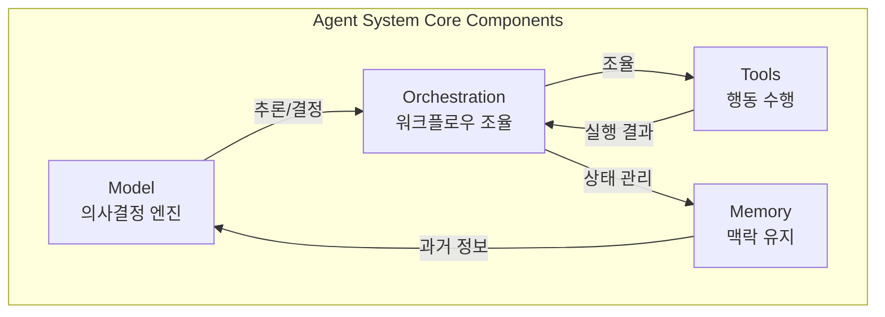

---

### 3. Model Selection

#### 모델 선택 결정 요소

| 요소 | 대형 모델 (GPT-5, Claude Opus) | 소형 모델 (Phi-4, ModernBERT) |
|------|------------------------------|------------------------------|
| **적합 태스크** | 개방형, 모호함, 다단계 추론 | 잘 정의된, 반복적 태스크 |
| **장점** | 일반화, 유연성, 창의성 | 빠른 응답, 저비용, 로컬 실행 |
| **단점** | 높은 비용, 높은 지연시간 | 제한된 복잡도 처리 |
| **인프라** | 클라우드 필수 | 로컬 하드웨어 가능 |

#### Open Weight 모델 비교 (MMLU 기준)

| 모델 | 관리자 | MMLU | 파라미터 | VRAM | 필요 하드웨어 |
|------|--------|------|----------|------|--------------|
| Llama 3.1 Instruct | Meta | 56.1 | 8B | 20GB | RTX 3090 |
| Gemma 2 | Google | 72.1 | 9B | 22.5GB | RTX 3090 |
| Phi-3 | Microsoft | 77.5 | 14.7B | 29.4GB | A100 |
| Qwen1.5 | Alibaba | 74.4 | 32B | 60GB | A100 |
| Llama 3 | Meta | 79.3 | 70B | 160GB | 4×A100 |

```
💡 핵심 인사이트:
- ~14B 파라미터까지: 소비자급 GPU (RTX 3090, 24GB)로 실행 가능
- 그 이상: 서버급 GPU (A100 40/80GB) 필요
```

#### 대형 모델 비용 비교

| 모델 | MMLU | 입력 토큰 상대 가격 | 출력 토큰 상대 가격 |
|------|------|-------------------|-------------------|
| DeepSeek-v3 | 87.2 | 2.75× | 3.65× |
| Claude 4 Opus | 86.5 | 75× | 125× |
| Gemini 2.5 Pro | 86.2 | 12.5× | 25× |
| Llama 3.1 405B | 84.5 | 1× (기준) | 1× (기준) |
| o4-mini | 83.2 | 5.5× | 7.33× |

> **성능 ≠ 가격**: 벤치마크 성능이 가격과 직접 상관관계가 없음

#### 모델 선택 전략

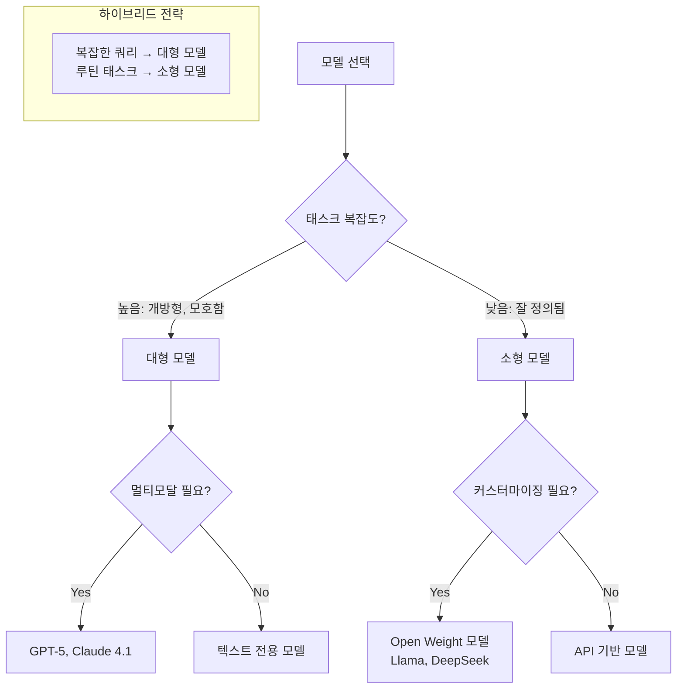

---

### 4. Tools (도구)

#### 도구의 3가지 유형

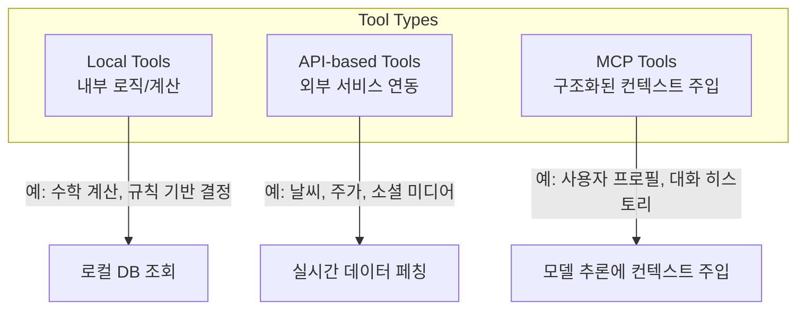

| 유형 | 설명 | 예시 |
|------|------|------|
| **Local Tools** | 외부 의존성 없이 내부 로직으로 수행 | 수학 계산, 로컬 DB 조회, 규칙 기반 결정 |
| **API-based Tools** | 외부 서비스/데이터 소스와 상호작용 | 날씨 데이터, 주가, 소셜 미디어 |
| **MCP Tools** | Model Context Protocol로 구조화된 컨텍스트 주입 | 사용자 프로필, 대화 히스토리, 실시간 상태 |

#### 도구 설계 원칙

```
✅ 모듈성 (Modularity):
- 각 도구는 독립적인 모듈로 설계
- 쉽게 통합/교체 가능
- 시스템 전체 재설계 없이 확장 가능

예: 고객 서비스 챗봇
- 초기: 단순 쿼리 처리 도구
- 나중: 분쟁 해결, 고급 트러블슈팅 도구 추가
```

---

### 5. Memory (메모리)

#### 메모리 유형 비교

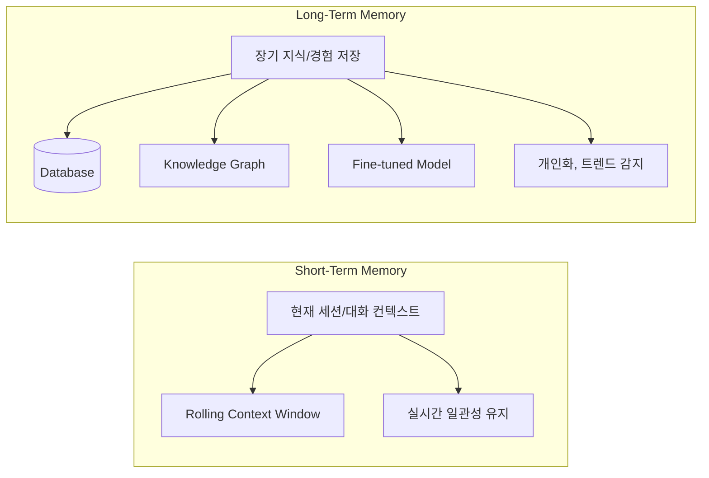

| 메모리 유형 | 목적 | 구현 방법 | 예시 |
|------------|------|----------|------|
| **Short-Term** | 현재 태스크/대화의 맥락 유지 | Rolling Context Window | 세션 내 이전 쿼리 기억 |
| **Long-Term** | 장기 지식, 사용자 선호도 저장 | DB, Knowledge Graph, Fine-tuning | 환자 바이탈 사인 히스토리 |

#### 메모리 관리 전략

```
📊 효과적인 메모리 관리:
1. 관련 vs 비관련 데이터 구분
2. 빠른 검색을 위한 인덱싱
3. 오래된/불필요한 정보 "망각"
4. 최신 데이터 우선순위화

예: 이커머스 추천 Agent
- 사용자 선호도, 구매 히스토리 저장 (Long-Term)
- 최근 데이터 우선순위화 (선호도 변화 반영)
```

---

### 6. Orchestration (오케스트레이션)

> **오케스트레이션**: 개별 역량을 End-to-End 솔루션으로 전환하는 로직

#### 오케스트레이션의 핵심 기능

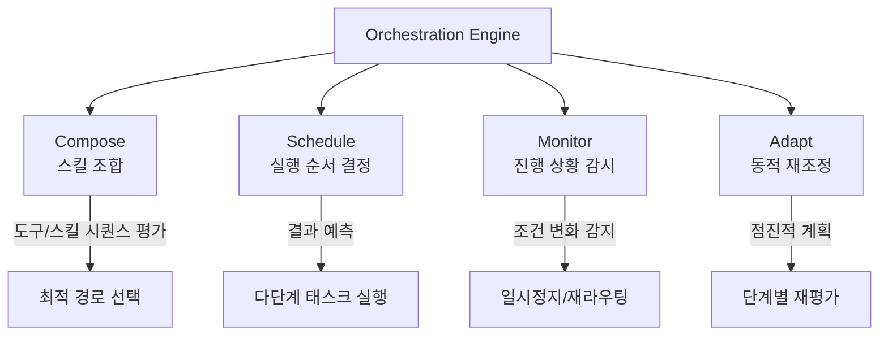

**핵심 역할:**
- 가능한 도구/스킬 호출 시퀀스 평가
- 결과 예측 및 최적 경로 선택
- 실시간 진행 상황 및 환경 모니터링
- 조건 변화 시 워크플로우 일시정지/재라우팅

---

### 7. Design Trade-offs

#### 4가지 주요 Trade-off

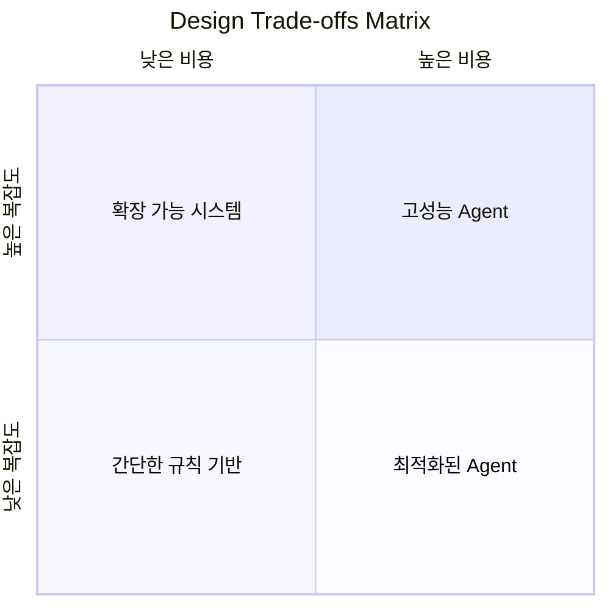

#### 1) Performance: 속도 vs 정확도

| 시나리오 | 우선순위 | 예시 |
|---------|---------|------|
| 실시간 환경 | 속도 > 정확도 | 자율주행, 트레이딩 |
| 정밀 분석 | 정확도 > 속도 | 법률 분석, 의료 진단 |
| 하이브리드 | 빠른 초기 응답 + 정밀 후속 | 추천 시스템, 진단 |

#### 2) Scalability: GPU 리소스 관리

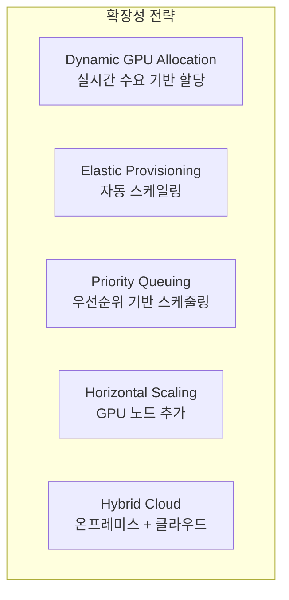

**핵심 전략:**
- **Dynamic GPU Allocation**: 실시간 수요 기반 GPU 할당
- **Async Task Execution**: 병렬 처리로 유휴 시간 최소화
- **Load Balancing**: GPU 간 작업 분산
- **Hybrid Cloud**: 피크 수요 시 클라우드 버스트 스케일링

#### 3) Reliability: 일관성 및 견고성

```
🛡️ 신뢰성 확보 전략:

1. Fault Tolerance (장애 허용)
   - 에러/예외 상황에서 우아한 복구
   - 중복성: 핵심 컴포넌트 복제

2. Extensive Testing
   - 유닛, 통합, 시뮬레이션 테스트
   - 엣지 케이스, 적대적 조건 커버

3. Monitoring & Feedback Loops
   - 프로덕션 환경 지속 모니터링
   - 이상 감지 및 행동 조정
```

#### 4) Costs: 개발 및 운영 비용

| 비용 유형 | 구성 요소 | 최적화 전략 |
|----------|----------|------------|
| **Development** | 데이터, 전문 인력, 테스트 인프라 | Lean 모델, 오픈소스 활용 |
| **Operational** | 컴퓨팅 파워, 데이터 저장, 유지보수 | 클라우드 리소스, 효율적 모델 |

```
💰 비용 최적화 전략:
1. Lean Models: 단순 태스크엔 단순 모델
2. Cloud-based Resources: Pay-as-you-go
3. Open Source: 라이브러리/프레임워크 활용
```

---

### 8. Architecture Design Patterns

#### Single-Agent vs Multi-Agent

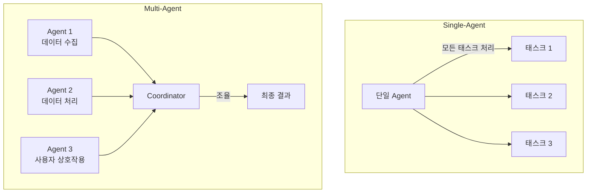

#### 아키텍처 비교

| 특성 | Single-Agent | Multi-Agent |
|------|-------------|-------------|
| **복잡도** | 낮음 | 높음 |
| **설계 용이성** | 쉬움 | 어려움 |
| **적합 태스크** | 잘 정의된, 좁은 범위 | 복잡한, 분산된 |
| **확장성** | 제한적 | 높음 |
| **협업** | 해당 없음 | 전문화된 역할 분담 |
| **내결함성** | 단일 실패점 | 중복성/복원력 |
| **효율성** | 높음 | 낮을 수 있음 (토큰 소비 증가) |

#### Multi-Agent의 장점과 도전

**장점:**
- 협업 및 전문화 (각 Agent가 특정 영역 담당)
- 병렬 처리 (동시 다중 태스크)
- 확장성 (Agent 추가로 워크로드 분산)
- 중복성/복원력 (단일 Agent 실패 시 다른 Agent 계속)

**도전:**
- 조율 및 통신 복잡성
- 설계/개발/유지보수 어려움
- 토큰 소비 증가로 효율성 저하 가능

#### 아키텍처 선택 가이드

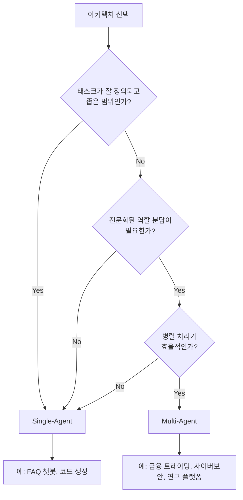

---

### 9. Best Practices

#### 1) Iterative Design (반복적 설계)

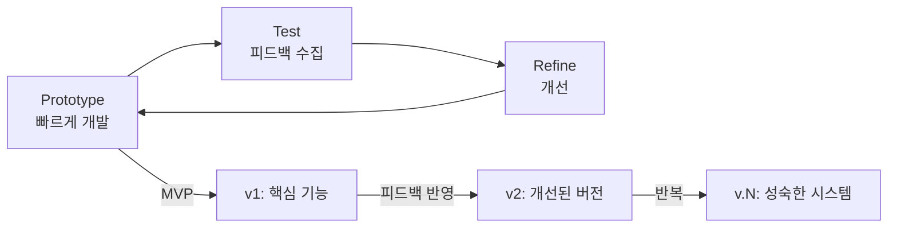

**핵심 원칙:**
- **빠른 프로토타입**: 완벽함보다 작동하는 것 우선
- **피드백 수집**: 매 이터레이션 후 사용자/이해관계자 피드백
- **반복 개선**: 피드백 기반으로 우선순위 결정 및 개선

#### 2) Evaluation Strategy (평가 전략)

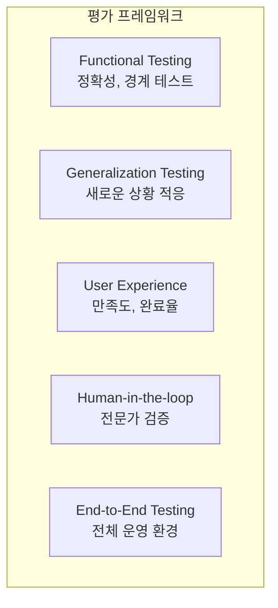

**평가 차원:**

| 차원 | 측정 항목 | 방법 |
|------|----------|------|
| **Functional** | 정확성, 경계 조건 | 유닛 테스트, 도메인 메트릭 |
| **Generalization** | 새 태스크 적응 | 도메인 외 테스트 |
| **User Experience** | NPS, CSAT, 완료율 | 사용자 피드백, 로그 분석 |
| **Human Validation** | 전문가 검토 | 샘플 출력 검증 |

#### 3) Real-World Testing (실제 환경 테스트)

```
🌍 실제 환경 테스트가 중요한 이유:
1. 실제 세계의 복잡성과 예측 불가능성 노출
2. 설계/테스트 단계에서 놓친 엣지 케이스 발견
3. 고부하 상황에서의 성능 평가
```

**실행 전략:**
1. **단계적 배포**: 소규모 → 전체 배포
2. **행동 모니터링**: KPI 추적 (응답 시간, 정확도, 만족도)
3. **사용자 피드백 수집**: 실시간 상호작용 피드백
4. **인사이트 기반 반복**: 발견 사항을 개발 사이클에 반영

---

## 심화 학습

### 관련 챕터 참조

| 주제 | 상세 챕터 |
|------|----------|
| Model Context Protocol (MCP) | Chapter 4 |
| Orchestration 패턴 | Chapter 5 |
| Memory 상세 | Chapter 6 |
| Multi-agent 아키텍처 | Chapter 8 |
| 측정 및 검증 | Chapter 9 |

### 추가 탐구 주제

- **Dynamic Model Routing**: 쿼리 복잡도에 따른 자동 모델 선택
- **Quantization & Distillation**: 소형 모델 성능 향상 기법
- **HELM Benchmark**: Stanford의 언어 모델 평가 프레임워크

---

## 실무 적용 포인트

### 즉시 적용 가능한 인사이트

#### 1. Scope 설정 체크리스트

```
✅ 좋은 Scope:
- [ ] 명확한 입력 (고객 메시지 + 주문 기록)
- [ ] 구조화된 출력 (도구 호출 + 확인 메시지)
- [ ] 긴밀한 피드백 루프 (테스트 가능)
- [ ] 구체적 성공 기준 (측정 가능)

❌ 피해야 할 Scope:
- 너무 좁음: 실제 영향 제한
- 너무 넓음: 엣지 케이스 폭발
- 너무 모호함: 성공 측정 불가
```

#### 2. 모델 선택 빠른 가이드

```python
# 의사결정 트리
if task.complexity == "high" and task.requires_creativity:
    model = "GPT-5 / Claude 4 Opus"
elif task.latency_critical or task.cost_sensitive:
    model = "소형 모델 (Phi-4, Gemma 2)"
elif task.requires_customization:
    model = "Open Weight (Llama, DeepSeek)"
else:
    model = "API 기반 범용 모델"
```

#### 3. 아키텍처 선택 빠른 가이드

```
Single-Agent 선택:
- 잘 정의된 태스크
- 단일 도메인
- 빠른 개발 필요

Multi-Agent 선택:
- 전문화된 역할 필요
- 병렬 처리 이점
- 복잡한 조율 가치 > 오버헤드
```

### 주의사항

- **과도한 최적화 방지**: 마진 이득을 위한 과도한 모델 선택 노력
- **토큰 효율성**: Multi-agent는 통신으로 인한 토큰 소비 증가
- **단계적 접근**: 거창한 설계보다 작동하는 MVP 우선

---

## 핵심 개념 체크리스트

### 필수 용어

| 용어 | 정의 |
|------|------|
| **Tractable Slice** | 구현 가능하고 가치 있는 명확한 범위의 문제 조각 |
| **Core Components** | Agent의 4가지 핵심 요소 (Model, Tools, Memory, Orchestration) |
| **Local Tools** | 외부 의존성 없이 내부 로직으로 수행하는 도구 |
| **API-based Tools** | 외부 서비스와 상호작용하는 도구 |
| **MCP Tools** | Model Context Protocol로 구조화된 컨텍스트를 주입하는 도구 |
| **Short-Term Memory** | 현재 세션/대화 맥락을 유지하는 메모리 |
| **Long-Term Memory** | 장기 지식/경험을 저장하는 메모리 |
| **Orchestration** | 스킬/도구를 조합하고 워크플로우를 조율하는 로직 |
| **Single-Agent** | 단일 Agent가 모든 태스크를 처리하는 아키텍처 |
| **Multi-Agent** | 여러 Agent가 협업하는 아키텍처 |
| **Iterative Design** | 점진적 프로토타입과 피드백 기반 개선 방법론 |

### 이해도 점검 질문

1. 적절한 Agent scope를 설정할 때 고려해야 할 3가지 기준은?
2. 도구의 3가지 유형(Local, API, MCP)의 차이점과 적합한 사용 시나리오는?
3. Short-Term Memory와 Long-Term Memory의 구현 방법과 사용 사례는?
4. Single-Agent 대신 Multi-Agent 아키텍처를 선택해야 하는 조건은?
5. 반복적 설계의 3단계(Prototype, Test, Refine)에서 각 단계의 핵심 활동은?

---

## 참고 자료

### 벤치마크 및 평가
- [Stanford HELM](https://crfm.stanford.edu/helm/) - Holistic Evaluation of Language Models
- [MMLU Benchmark](https://github.com/hendrycks/test) - Massive Multitask Language Understanding

### 프레임워크
- [LangGraph](https://langchain-ai.github.io/langgraph/) - 본 책의 주요 프레임워크
- [LangChain](https://python.langchain.com/) - Tool 및 Chain 관리

### 관련 챕터
- Chapter 4: Model Context Protocol (MCP) 상세
- Chapter 5: Orchestration 패턴 및 아키텍처
- Chapter 6: Memory 상세
- Chapter 8: Multi-agent 아키텍처
- Chapter 9: 측정 및 검증 프레임워크
