# Chapter 3. User Experience Design for Agentic Systems

## 핵심 요약

> Agent 시스템의 성공은 기술적 역량만큼이나 **사용자 경험(UX)**에 달려 있다. 효과적인 Agent UX는 상호작용 모달리티(텍스트, GUI, 음성, 비디오) 선택, 자율성 수준 조절(Autonomy Slider), 맥락 유지, 기능/한계/불확실성의 명확한 소통, 그리고 신뢰 구축을 통해 사용자가 Agent를 믿고 의존할 수 있는 경험을 만든다.

**핵심 키워드**: `Interaction Modalities`, `Autonomy Slider`, `Context Retention`, `Graceful Failure`, `Trust & Transparency`

---

## 학습 목표

이 챕터를 학습한 후 다음을 이해할 수 있어야 한다:

- [ ] 4가지 상호작용 모달리티(Text, GUI, Voice, Video)의 강점과 한계
- [ ] Autonomy Slider 개념과 Manual/Ask/Agent 모드 설계
- [ ] 동기식 vs 비동기식 Agent 경험의 설계 원칙
- [ ] 맥락 유지 및 개인화 전략
- [ ] Agent 기능과 한계를 효과적으로 전달하는 방법
- [ ] 신뢰 구축을 위한 예측 가능성과 투명성 설계
- [ ] 우아한 실패(Graceful Failure) 처리 방법

---

## 본문 정리

### 1. Interaction Modalities (상호작용 모달리티)

#### 4가지 모달리티 비교

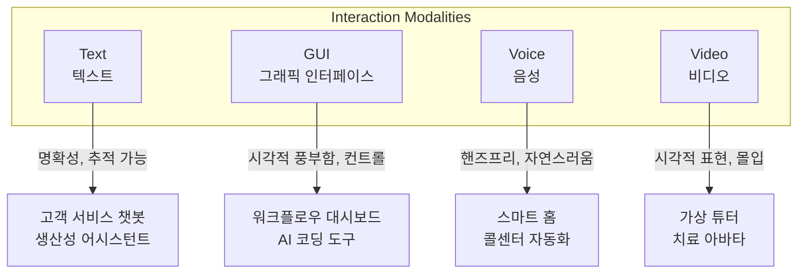

| 모달리티 | 보편성 | 이상적 상황 | 예시 |
|---------|-------|------------|------|
| **Text** | 매우 흔함 | 명확한, 비동기, 검색 가능한 커뮤니케이션 | 고객 서비스 챗봇, 생산성 어시스턴트 |
| **GUI** | 흔함 | 시각적 구조, 맥락 관리, 다단계 워크플로우 | 워크플로우 대시보드, Cursor 같은 AI IDE |
| **Voice** | 덜 흔함 | 핸즈프리 상호작용, 자연스러운 대화 | Siri, Alexa, 콜센터 자동화 |
| **Video** | 드묾 | 시각적 시연, 풍부한 표현, 몰입형 학습 | 가상 튜터, 치료 아바타, 인터랙티브 학습 |

---

### 2. Text-Based Interfaces (텍스트 기반)

#### 강점
- **동기/비동기 지원**: 실시간 대화 + 나중에 돌아와서 재개
- **추적 가능한 기록**: 투명성, 책임성, 문제 해결 용이
- **AI 터미널 르네상스**: Warp, Claude Code, Gemini CLI

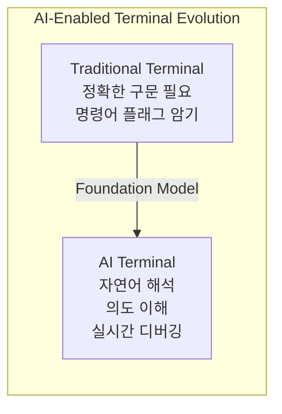

#### 핵심 한계: 발견 가능성 (Discoverability)

```
❌ 문제:
- 사용자가 Agent가 무엇을 할 수 있는지 모름
- GUI의 버튼/메뉴와 달리 시각적 단서 없음
- 지원되지 않는 요청 시 혼란

✅ 해결책:
- 온보딩 메시지로 기능 소개
- "How can I help you?" + "I can help you cancel orders,
   check delivery status, or update your account details."
- 동적 제안으로 가능한 액션 힌트
```

#### 텍스트 Agent 설계 원칙

| 원칙 | 설명 |
|------|------|
| **명확성/간결성** | 과도한 전문 용어, 장황한 설명 피하기 |
| **맥락 유지** | 다중 턴 대화에서 사용자가 반복하지 않도록 |
| **우아한 에러 처리** | 명확한 에러 메시지, 대안 제안, 인간 에스컬레이션 |
| **턴테이킹 관리** | 언제 질문하고 언제 기다릴지 자연스럽게 |

---

### 3. Graphical Interfaces (그래픽 인터페이스)

#### 강점
- **시각적 정보 표현**: 복잡한 데이터, 상태 업데이트를 직관적으로
- **인지 부하 감소**: 진행 바, 색상 코딩, 알림 아이콘
- **시각적 오케스트레이션**: LangSmith, n8n, AutoGen의 워크플로우 시각화

#### Generative UI: 새로운 프론티어

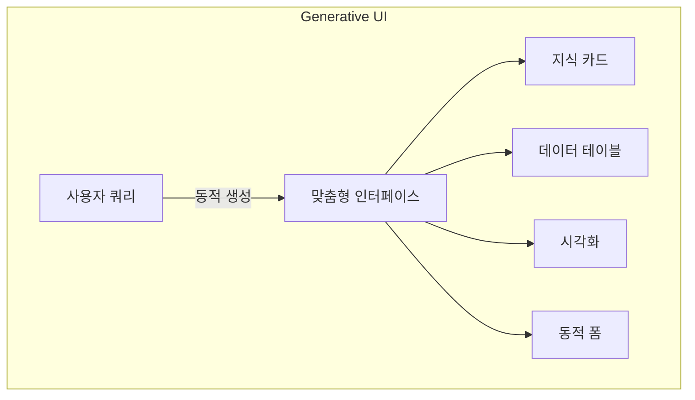

**예시:**
- Perplexity AI: 질문에 맞춘 구조화된 지식 카드, 참조 목록
- AI 코딩 코파일럿: 사용자 의도 기반 폼, 설정 파일, UI 컴포넌트 생성

#### GUI 설계 고려사항

| 도전 | 해결책 |
|------|--------|
| 제한된 화면 공간 | 정보 우선순위화, 핵심 정보 먼저 |
| 반응성 기대 | 실시간 업데이트, 부드러운 전환 |
| 디바이스 적응 | 데스크톱/태블릿/모바일 일관성 |
| 자동화 vs 제어 균형 | 버튼으로 사용자 승인 옵션 제공 |

#### 미래 방향

> **"문서, 스프레드시트, 슬라이드 덱 중심의 미래가 아니라, 의사결정, 분석, 창작을 위한 인터랙티브 Agent 기반 인터페이스의 미래"**

적용 분야: 변호사, 회계사, 보험 전문가, 프로덕트 매니저, 지식 근로자

---

### 4. Speech and Voice Interfaces (음성 인터페이스)

#### 기술 발전

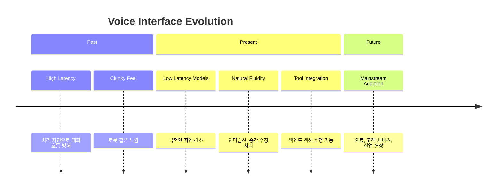

#### 핵심 설계 요소: 인터럽션 처리

```python
# Voice Agent에서 인터럽션 처리 예시
# 사용자가 말하기 시작하면 → 어시스턴트 음성 즉시 중단

if msg["type"] == "input_audio_buffer.speech_started" and last_assistant_item:
    await openai_ws.send(json.dumps({
        "type": "conversation.item.truncate",
        "item_id": last_assistant_item,
        "content_index": 0,
        "audio_end_ms": 0   # 즉시 중단
    }))
```

**인터럽션이 중요한 이유:**
- 인간 대화는 선형적 독백이 아님
- 사용자가 중간에 명확화, 방향 전환, 수정 가능해야 함
- 자연스러운 느낌 + 신뢰 구축

#### 음성 vs 텍스트 처리 속도

| 형태 | 속도 | 적합한 상황 |
|------|------|------------|
| 말하기 | 150-180 WPM | 핸즈프리, 간단한 쿼리, 액션 중심 |
| 읽기 | 250-300 WPM | 밀도 높은 정보, 빠른 이해 |
| 스키밍 | 500+ WPM | 복잡한 의사결정, 비교 분석 |

---

### 5. Video-Based Interfaces (비디오 인터페이스)

#### 특성

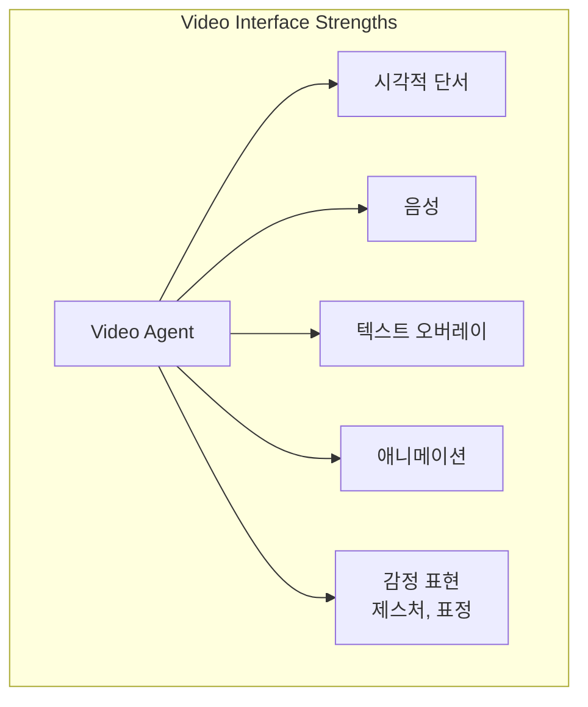

**활용 분야:** 원격 의료, 교육, 원격 협업, 인터랙티브 엔터테인먼트

#### 도전 과제

| 도전 | 설명 |
|------|------|
| **기술적 요구** | 높은 처리 능력, 대역폭 필요 |
| **Uncanny Valley** | 표정/제스처/립싱크가 약간 어색하면 불편함 |
| **프라이버시** | 시각 데이터 공유에 대한 불안감 |

---

### 6. Combining Modalities (모달리티 결합)

#### 원활한 모달리티 전환

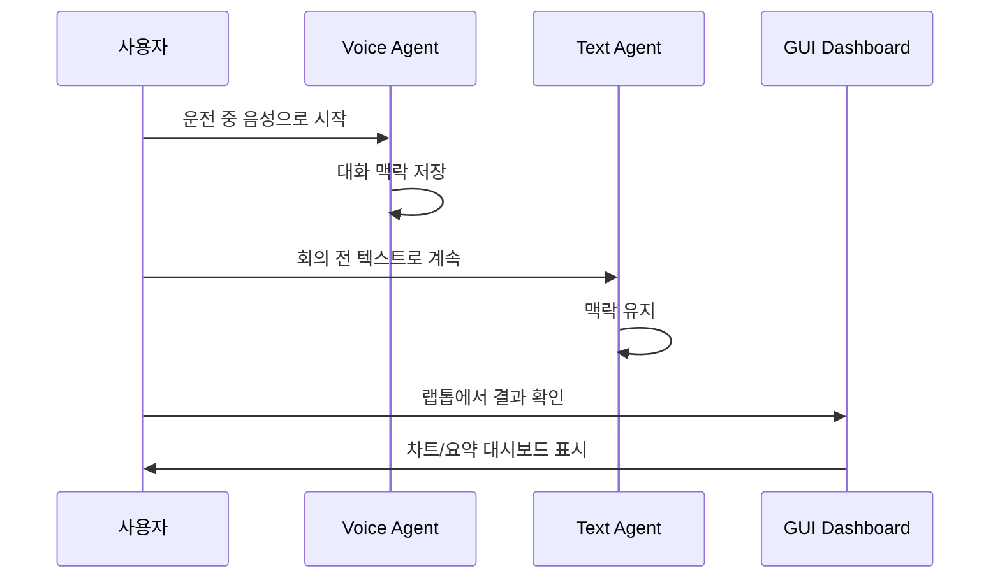

**핵심 요구사항:**
- 상태 관리 및 맥락 지속성
- 각 모달리티에 맞는 커뮤니케이션 스타일 적응
- 간결한 음성 요약 vs 상세한 텍스트 출력

> **"최고의 제품은 기술적 정교함을 보여주는 것이 아니라, 기술을 사용해 우아하고 방해 없이 인간 역량을 증폭시키는 것이다."**

---

### 7. The Autonomy Slider (자율성 슬라이더)

#### 개념: Andrej Karpathy의 프레임워크

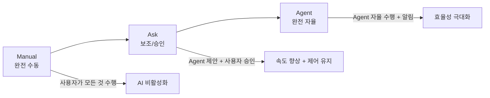

#### 예시: AI 코딩 도구

| 모드 | 동작 |
|------|------|
| **Manual** | 개발자가 모든 코드 직접 작성, AI 제안 없음 |
| **Ask** | Agent가 코드 완성/리팩토링 제안, 개발자가 검토/승인 |
| **Agent** | Agent가 표준 리팩토링, 린터 오류 수정, 보일러플레이트 자동 수행 |

#### 예시: 고객 지원

| 모드 | 동작 |
|------|------|
| **Manual** | 인간 상담원이 모든 쿼리 처리, AI 비활성화 |
| **Ask** | Agent가 답변 초안/정책 참조 제안, 상담원이 검토/수정/승인 |
| **Agent** | 비밀번호 리셋, 주문 추적 등 루틴 쿼리 자율 처리, 복잡한 이슈만 에스컬레이션 |

#### Autonomy Slider 설계 원칙

```
1. 자율성 수준을 명확하게 노출
   - "Manual", "Assist", "Auto" 직관적 레이블

2. 원활한 전환 가능
   - 토글/슬라이더로 쉽게 모드 변경

3. 각 수준에서 예측 가능한 동작
   - 부분 자동화: 명시적 승인 필요
   - 완전 자율: 상태 업데이트 + 개입 옵션

4. 각 수준의 위험/이점 소통
   - 중요 태스크: 완전 자율 전 명시적 확인

5. 신뢰와 역량에 따라 자율성 적응
   - 10회 성공 사용 후 → "더 빠른 Assist 모드 사용해보시겠어요?"
```

> **"Autonomy Slider는 단순 기능이 아닌 신뢰 구축 메커니즘이다."**

---

### 8. Synchronous vs Asynchronous Experiences

#### 비교

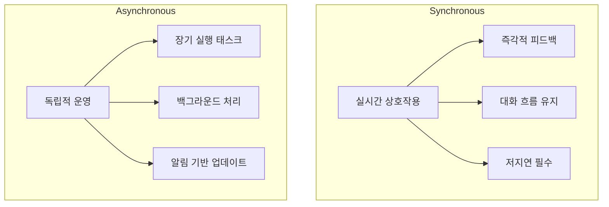

| 특성 | 동기식 | 비동기식 |
|------|--------|---------|
| **응답 시간** | 즉각적 | 유연함 |
| **사용자 주의** | 지속적 | 간헐적 |
| **적합 태스크** | 라이브 의사결정, 채팅 | 보고서 생성, 모니터링 |
| **핵심 요구** | 저지연, 맥락 인식 | 상태 투명성, 알림 |

#### 동기식 경험 설계 원칙

- **명확성과 간결성**: 장황한 설명 피하기
- **턴테이킹 관리**: 자연스러운 대화 흐름
- **시각적 단서**: 타이핑 인디케이터, 진행 스피너
- **우아한 에러 복구**: 명확화 질문 or 부드러운 리디렉션

#### 비동기식 경험 설계 원칙

- **태스크 상태/결과 명확 소통**: "처리 시작", "예상 완료 시간", "완료 요약"
- **맥락 관리**: 긴 지연 후에도 히스토리 참조
- **기대 관리**: 명확한 타임라인, 진행 인디케이터, 후속 알림

#### 선제적 vs 방해적 Agent 행동 균형

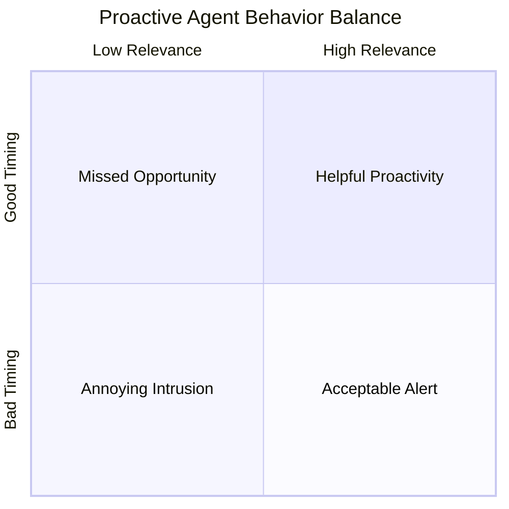

**균형 전략:**
- 사용자의 현재 초점, 긴급도, 선호도 이해
- 알림 빈도, 채널, 에스컬레이션 임계값 사용자 제어
- 진정한 가치를 추가하는 관련 알림만

---

### 9. Context Retention and Continuity (맥락 유지)

#### 맥락 관리가 UX인 이유

```
맥락 = 사용자 경험

Agent가 기억하고, 적응하고, 응답하는 방식이
인간 중심적이고 지원적인지 vs 상태 없고 기계적인지 결정
```

#### 구현 접근법

| 접근법 | 장점 | 단점 |
|--------|------|------|
| **Client-side** | 세션 내 빠름 | 디바이스/로그인 간 연속성 없음 |
| **Server-side** | 장기 메모리, 크로스 디바이스 | 지연, 프라이버시 고려 |
| **Hybrid** | 최적 균형 | 구현 복잡성 |

#### Short-Term vs Long-Term Memory

| 유형 | 용도 | 구현 |
|------|------|------|
| **Short-Term** | 현재 세션 내 세부사항 | 세션 식별자, 롤링 윈도우 |
| **Long-Term** | 선호도, 과거 상호작용, 사용자 패턴 | DB, 분산 캐시 |

#### 개인화 형태

- **선호도 유지**: 알림 설정, 자주 선택하는 옵션
- **행동 적응**: 관찰된 패턴에 따른 응답 스타일 조정
- **선제적 지원**: 과거 행동 기반 제안 예측

> **"최고의 개인화는 보이지 않지만 영향력 있다. Agent가 눈에 띄게 조정하지 않고도 사용자 경험을 미묘하게 개선하는 것."**

---

### 10. Communicating Agent Capabilities (기능 전달)

#### 발견 가능성 향상 전략

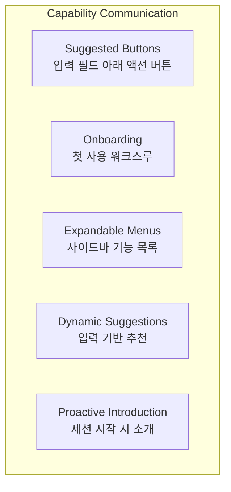

#### 예시 패턴

**세션 시작 시:**
```
"Hi, I can help you generate content, analyze data,
or summarize documents. What would you like to do today?"
```

**기능 외 요청 시:**
```
"I can't process payments directly, but I can update
your billing preferences or connect you with an agent who can assist."
```

#### 설계 원칙

| 원칙 | 설명 |
|------|------|
| **점진적 공개** | 핵심 기능 먼저, 고급 기능은 사용자 익숙해진 후 |
| **맥락적 관련성** | 현재 입력, 히스토리, 워크플로우 단계 기반 액션 표시 |
| **시각적 그룹화** | 메뉴/제안 액션 내 명확한 계층 구조 |
| **모달리티 적응** | 텍스트: 빠른 응답 버튼, GUI: 메뉴/툴팁, 음성: 짧은 우선순위 옵션 |

---

### 11. Communicating Confidence and Uncertainty (신뢰도 전달)

#### 불확실성 표현 방법

| 방법 | 예시 |
|------|------|
| **명시적 진술** | "I'm 90% certain this is the correct answer." |
| **시각적 단서** | 아이콘, 색상 코딩 알림, 신뢰도 미터 |
| **행동 조정** | 신뢰도 낮을 때 확정적 추천 대신 제안 제공 |

#### 균형 잡기

```
⚠️ 과도한 자신감:
신뢰도 높을 때 틀리면 → 신뢰 급락

⚠️ 과도한 헤지:
낮은 위험 상호작용에서 → 망설이거나 불신 느낌
```

---

### 12. Asking for Guidance and Input (안내 요청)

#### 모호함 처리 전략

```python
# 좋은 예: 명확화 질문
사용자: "Book me a ticket to Chicago"
Agent: "Would you like a one-way or round-trip ticket,
        and do you have preferred travel dates?"

# 나쁜 예: 가정하고 진행
사용자: "Book me a ticket to Chicago"
Agent: [임의로 편도, 오늘 날짜로 예약]
```

#### 안내 요청 원칙

| 원칙 | 설명 |
|------|------|
| **명확하고 정중한 질문** | 로봇적/반복적 표현 피하기 |
| **맥락 참조** | 이전에 답한 부분은 다시 묻지 않기 |
| **이유 투명화** | "정확하게 진행하려면 조금 더 정보가 필요합니다" |
| **질문 순서화** | 한 번에 너무 많은 질문 피하기, 가장 중요한 모호성부터 |

---

### 13. Failing Gracefully (우아한 실패)

#### 우아한 실패의 핵심 요소

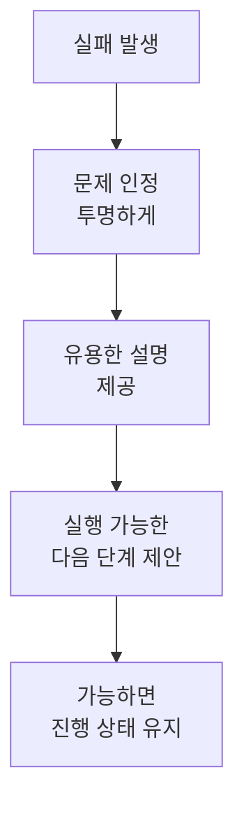

#### 실패 처리 패턴

| 상황 | 좋은 응답 |
|------|----------|
| **정보 못 찾음** | "정보를 찾지 못했습니다. 인간 담당자에게 에스컬레이션할까요?" |
| **이해 못함 (음성)** | "이해하기 어렵습니다. 다르게 표현하시거나 텍스트로 입력해 주세요." |
| **처리 오류** | "죄송합니다, 요청 처리 중 문제가 발생했습니다. 다시 시도하거나 도움을 드릴 다른 분께 연결해 드릴까요?" |

#### 실패 처리 원칙

1. **사전 예측**: 일반적 실패 지점에 대한 사전 정의된 폴백
2. **상태 보존**: 다단계 태스크에서 처음부터 다시 시작 방지
3. **공감적 언어**: 차갑거나 기술적인 에러 메시지 피하기
4. **해결 경로 제공**: 문제 해결 단계, 인간 에스컬레이션, 대안 리소스
5. **실패에서 학습**: 로깅, 반복 이슈 분석, 개발 사이클에 피드백

---

### 14. Trust in Interaction Design (신뢰 구축)

#### 신뢰 구축 공식

> **"신뢰는 방울로 얻고 양동이로 잃는다."**

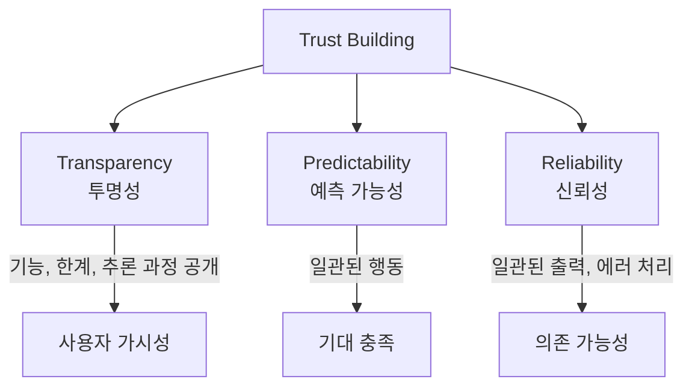

#### 투명성 원칙

- Agent가 할 수 있는 것/없는 것 명확히 전달
- 결정 이유 설명 (추천 도출 방법, 요청 거절 이유)
- 불필요한 세부사항 없이 충분한 인사이트 제공

#### 예측 가능성과 신뢰성

| 요소 | 설명 |
|------|------|
| **일관된 출력** | 같은 조건, 같은 질문 → 같은 응답 |
| **엣지 케이스 처리** | 불완전 데이터, 상충 지시 → 예측 가능한 응답 |
| **시스템 복원력** | 에러 복구, 인터럽션 간 상태 유지, 연쇄 실패 방지 |
| **기대 충족** | 주장한 태스크는 반드시 수행 |

---

## 심화 학습

### 관련 챕터 참조

| 주제 | 상세 챕터 |
|------|----------|
| Tool Use | Chapter 4 |
| Memory 상세 | Chapter 6 |

### 추가 탐구 주제

- **Generative UI**: 동적으로 생성되는 사용자 인터페이스
- **OpenAI Realtime Voice API**: 저지연 음성 상호작용
- **Multimodal Architecture**: 여러 모달리티 통합 설계

---

## 실무 적용 포인트

### Agent UX 체크리스트

```
✅ 기능 명확히 전달
   - [ ] 온보딩, 제안, 버튼으로 Agent가 할 수 있는 것 표시

✅ 모달리티 신중하게 결합
   - [ ] 텍스트, GUI, 음성, 비디오를 태스크와 사용자 맥락에 맞춰 정렬

✅ 맥락 신중하게 유지
   - [ ] 관련 대화 상태 유지, 프라이버시 침해/메모리 과부하 없이

✅ 에러 우아하게 처리
   - [ ] 요청 충족 못할 때 명확하고 정중한 폴백 제공

✅ 신뢰 구축
   - [ ] 한계, 신뢰도, 추론에 대해 투명하게
```

### Autonomy Slider 구현 가이드

```
1단계: 세 가지 모드 정의
- Manual: 사용자 완전 제어
- Ask: Agent 제안 + 사용자 승인
- Agent: 자율 수행 + 알림

2단계: UI에 명확한 토글/슬라이더 제공

3단계: 각 모드에서 예측 가능한 동작 보장

4단계: 사용자 신뢰도에 따른 점진적 자율성 증가 제안
```

### 모달리티 선택 가이드

```
텍스트:
- 명확한 커뮤니케이션, 검색 가능, 비동기 OK

GUI:
- 시각적 구조, 다단계 워크플로우, 복잡한 데이터

음성:
- 핸즈프리, 간단한 쿼리, 액션 중심

비디오:
- 시각적 시연, 감정 표현, 몰입형 학습
```

---

## 핵심 개념 체크리스트

### 필수 용어

| 용어 | 정의 |
|------|------|
| **Interaction Modality** | 사용자-Agent 상호작용 채널 (텍스트, GUI, 음성, 비디오) |
| **Autonomy Slider** | 사용자가 Agent 자율성 수준을 조절하는 메커니즘 |
| **Discoverability** | 사용자가 Agent 기능을 발견할 수 있는 정도 |
| **Generative UI** | 사용자 쿼리에 따라 동적으로 생성되는 인터페이스 |
| **Context Retention** | 상호작용 간 맥락 유지 능력 |
| **Graceful Failure** | 실패 시 투명하게 인정하고 대안 제시하는 처리 방식 |
| **Proactivity** | Agent가 선제적으로 사용자에게 알림/제안하는 것 |
| **Synchronous Experience** | 실시간 즉각적 상호작용 |
| **Asynchronous Experience** | 독립적, 간헐적 상호작용 |

### 이해도 점검 질문

1. 4가지 상호작용 모달리티 각각의 이상적 사용 상황은?
2. Autonomy Slider의 3가지 모드(Manual/Ask/Agent)의 차이점과 신뢰 구축에 미치는 영향은?
3. 텍스트 기반 인터페이스의 발견 가능성 문제를 해결하는 방법 3가지는?
4. 동기식과 비동기식 Agent 경험의 설계 원칙 차이는?
5. 우아한 실패의 5가지 핵심 원칙은?

---

## 참고 자료

### 도구 및 프레임워크
- [Warp Terminal](https://www.warp.dev/) - AI-enabled terminal
- [Cursor](https://cursor.sh/) - AI coding IDE
- [n8n](https://n8n.io/) - Visual workflow automation

### API 및 프로토콜
- [OpenAI Realtime Voice API](https://platform.openai.com/docs/guides/realtime) - 저지연 음성 상호작용

### 관련 챕터
- Chapter 4: Tool Use - 채팅봇에서 실제 작업 수행 시스템으로
- Chapter 6: Memory - 맥락 유지 상세
