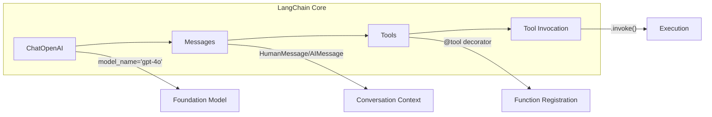
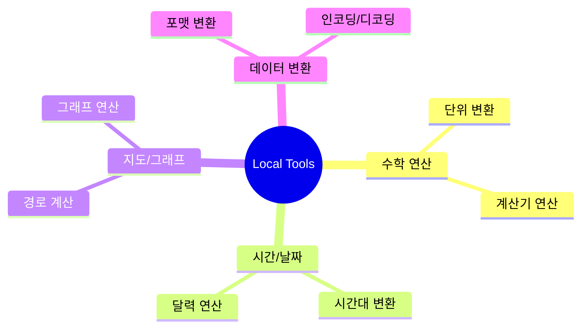
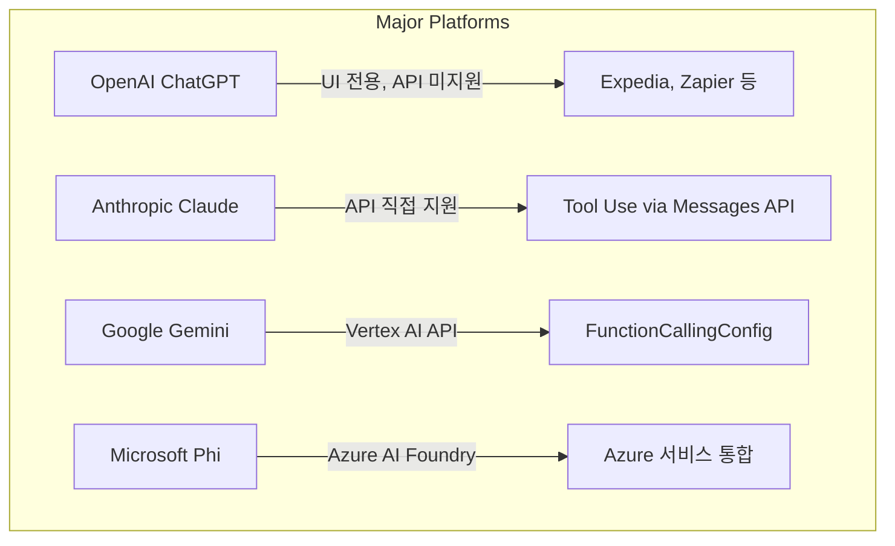
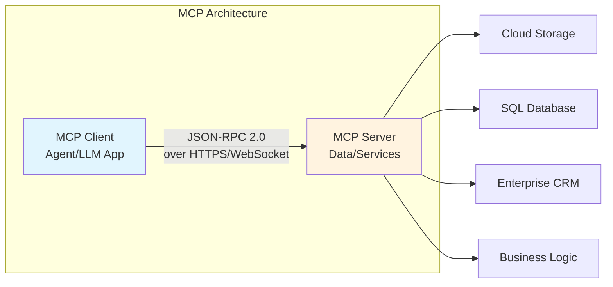
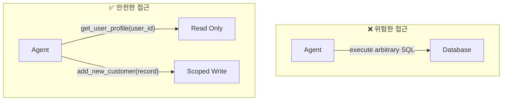
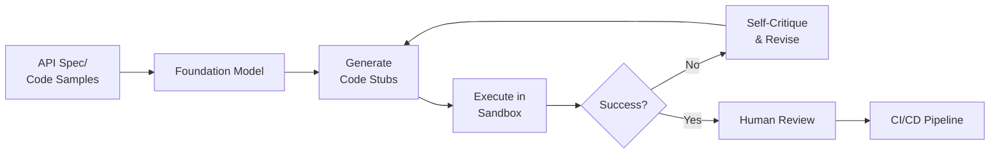
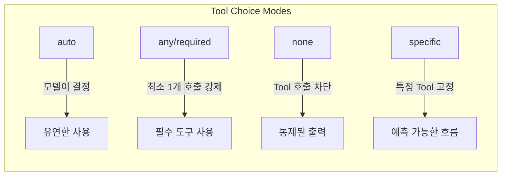
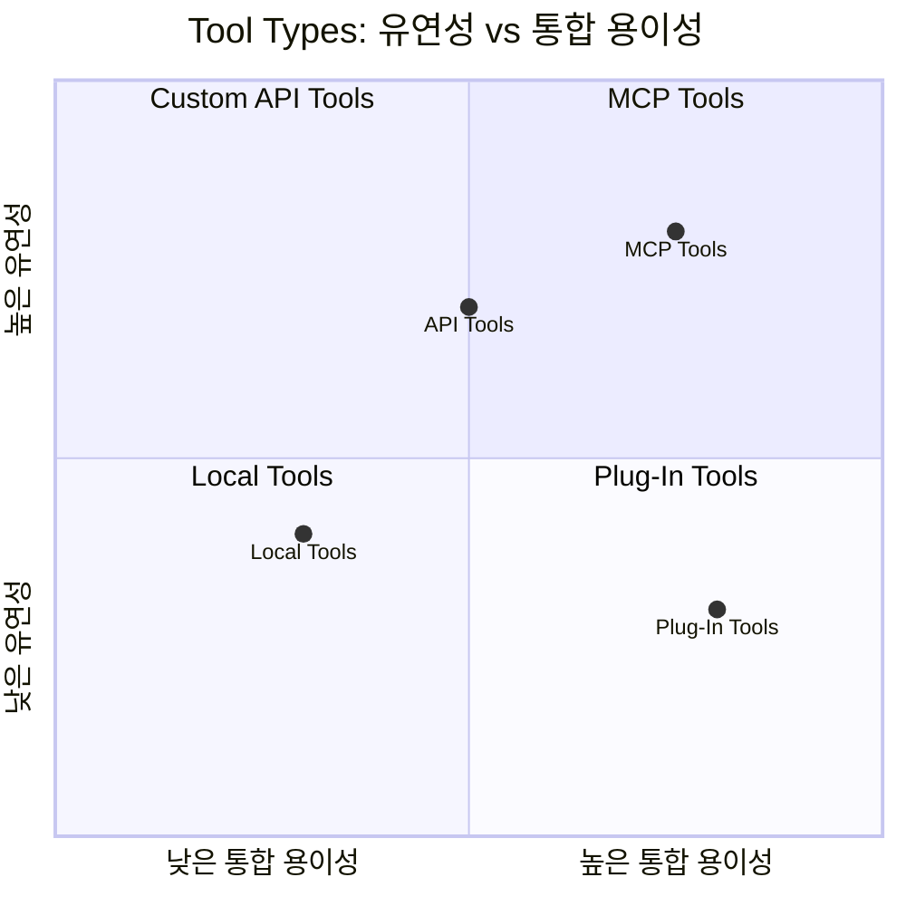
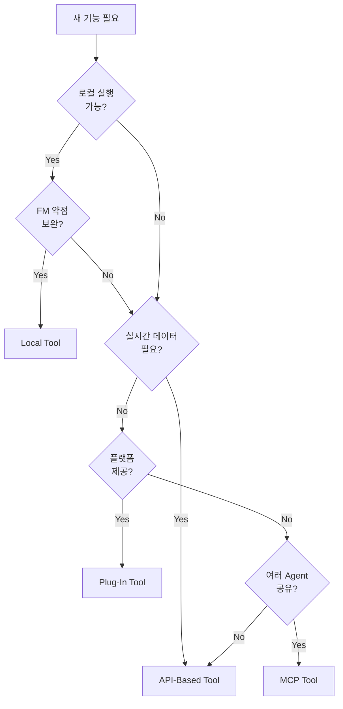

# Chapter 4. Tool Use

## 핵심 요약

> **Tool은 AI Agent가 정보를 검색하고, 작업을 수행하며, 환경과 상호작용할 수 있게 하는 핵심 구성 요소다.**

이 장에서는 AI Agent의 Tool 설계, 개발, 배포에 대해 다룬다. Tool은 단순한 단일 작업부터 고급 추론이 필요한 복잡한 다단계 작업까지 다양하다. 의사가 환자를 진단하고 치료하기 위해 다양한 도구가 필요하듯이, AI Agent도 다양한 작업을 효과적으로 처리하기 위해 도구 레퍼토리가 필요하다.

### Tool의 4가지 유형

```
┌─────────────────────────────────────────────────────────────────┐
│                        Tool Types                                │
├─────────────┬─────────────┬─────────────┬─────────────────────────┤
│ Local Tools │ API-Based   │ Plug-In     │ MCP Tools              │
│             │ Tools       │ Tools       │                        │
├─────────────┼─────────────┼─────────────┼─────────────────────────┤
│ 로컬 실행   │ 외부 서비스  │ 플랫폼 제공  │ 표준화된 프로토콜      │
│ 규칙 기반   │ 실시간 데이터│ 모듈형 통합  │ 상호운용성             │
│ 예측 가능   │ 확장성      │ 빠른 배포    │ 재사용성               │
└─────────────┴─────────────┴─────────────┴─────────────────────────┘
```

---

## 학습 목표

이 장을 학습한 후 다음을 할 수 있어야 한다:

- [ ] LangChain의 핵심 개념(ChatOpenAI, messages, tools, bind_tools)을 이해하고 활용
- [ ] Local Tool을 설계하고 Foundation Model에 바인딩
- [ ] API-Based Tool을 구현하여 외부 서비스와 통합
- [ ] Model Context Protocol(MCP)의 아키텍처와 동작 원리 이해
- [ ] Stateful Tool의 보안 위험과 완화 전략 적용
- [ ] Tool Use Configuration을 통한 모델 동작 제어

---

## 본문 정리

### 1. LangChain 기초 (LangChain Fundamentals)

LangChain은 Foundation Model과 Tool을 연결하는 핵심 프레임워크다.

#### 핵심 구성 요소



#### 기본 사용 패턴

```python
from langchain_openai import ChatOpenAI
from langchain_core.messages import HumanMessage
from langchain_core.tools import tool

# 1. Foundation Model 초기화
llm = ChatOpenAI(model_name="gpt-4o")

# 2. Tool 정의 (@tool 데코레이터 사용)
@tool
def add_numbers(x: int, y: int) -> int:
    """Adds two numbers and returns the sum."""
    return x + y

# 3. Tool을 Model에 바인딩
llm_with_tools = llm.bind_tools([add_numbers])

# 4. 메시지로 Model 호출
messages = [HumanMessage("What is 5 + 3?")]
ai_msg = llm_with_tools.invoke(messages)

# 5. Tool 호출 실행
for tool_call in ai_msg.tool_calls:
    tool_response = add_numbers.invoke(tool_call)
```

#### Message Types

| Type | 역할 | 용도 |
|------|------|------|
| `HumanMessage` | 사용자 입력 | 사용자 질문/요청 전달 |
| `AIMessage` | 모델 응답 | 모델의 답변/tool call 포함 |

---

### 2. Local Tools (로컬 도구)

로컬에서 실행되며, 미리 정의된 규칙과 로직을 기반으로 하는 도구다.

#### 특징

| 장점 | 단점 |
|------|------|
| 정밀성과 예측 가능성 | 확장성 제한 (Scalability) |
| 간단한 구현과 수정 | 중복 (Duplication) |
| Agent와 함께 배포 | 유지보수 비용 (Maintenance) |
| FM 약점 보완 (수학, 시간대 등) | 재배포 필요 |

#### Tool Metadata의 중요성

> **모델은 Tool의 메타데이터(이름, 설명, 스키마)를 보고 어떤 Tool을 호출할지 결정한다.**

```
✅ 좋은 예:
   - 이름: "multiply" (정확하고 좁은 범위)
   - 설명: "Multiply 'x' times 'y'." (명확하고 구체적)
   - 스키마: x: float, y: float -> float (엄격한 타입)

❌ 나쁜 예:
   - 이름: "calculate" (너무 일반적)
   - 설명: "Performs calculations" (모호함)
   - 스키마: 미정의 (혼란 유발)
```

#### 계산기 Tool 예제

```python
from langchain_core.tools import tool
from langchain_openai import ChatOpenAI

@tool
def multiply(x: float, y: float) -> float:
    """Multiply 'x' times 'y'."""
    return x * y

@tool
def exponentiate(x: float, y: float) -> float:
    """Raise 'x' to the 'y'."""
    return x**y

@tool
def add(x: float, y: float) -> float:
    """Add 'x' and 'y'."""
    return x + y

# Tool 바인딩
tools = [multiply, exponentiate, add]
llm = ChatOpenAI(model_name="gpt-4o", temperature=0)
llm_with_tools = llm.bind_tools(tools)

# 질의 및 실행
query = "What is 393 * 12.25? Also, what is 11 + 49?"
messages = [HumanMessage(query)]
ai_msg = llm_with_tools.invoke(messages)

# Tool 호출 처리
for tool_call in ai_msg.tool_calls:
    selected_tool = {"add": add, "multiply": multiply,
                     "exponentiate": exponentiate}[tool_call["name"].lower()]
    tool_msg = selected_tool.invoke(tool_call)
    messages.append(tool_msg)

# 결과: multiply {'x': 393, 'y': 12.25} → 4814.25
#       add {'x': 11, 'y': 49} → 60.0
```

#### Local Tool 적합 영역



---

### 3. API-Based Tools (API 기반 도구)

외부 서비스와 통신하여 Agent의 기능을 확장하는 도구다.

#### 주요 이점

| 이점 | 설명 |
|------|------|
| **기능 확장** | 날씨, 주식, 번역 등 다양한 외부 서비스 통합 |
| **실시간 데이터** | 최신 정보 접근 (금융 거래, 긴급 대응 등) |
| **리소스 효율** | 복잡한 연산을 외부에서 처리 |
| **모델 재훈련 불필요** | API 연동만으로 기능 추가 |

#### Wikipedia API Tool 예제

```python
from langchain_openai import ChatOpenAI
from langchain_community.tools import WikipediaQueryRun
from langchain_community.utilities import WikipediaAPIWrapper
from langchain_core.messages import HumanMessage

# Wikipedia API 래퍼 설정
api_wrapper = WikipediaAPIWrapper(top_k_results=1, doc_content_chars_max=300)
tool = WikipediaQueryRun(api_wrapper=api_wrapper)

# Model에 Tool 바인딩
llm = ChatOpenAI(model_name="gpt-4o", temperature=0)
llm_with_tools = llm.bind_tools([tool])

# 질의 실행
messages = [HumanMessage("What was the most impressive thing about Buzz Aldrin?")]
ai_msg = llm_with_tools.invoke(messages)

# Tool 호출 및 응답 처리
for tool_call in ai_msg.tool_calls:
    tool_msg = tool.invoke(tool_call)
    messages.append(tool_msg)

# 결과: Wikipedia에서 "Buzz Aldrin" 검색 후 응답 생성
```

#### Stock API Tool 예제

```python
import requests
from langchain_core.tools import tool

@tool
def get_stock_price(ticker: str) -> float:
    """Get the stock price for the stock exchange ticker for the company."""
    api_url = f"https://api.example.com/stocks/{ticker}"
    response = requests.get(api_url)
    if response.status_code == 200:
        data = response.json()
        return data["price"]
    else:
        raise ValueError(f"Failed to fetch stock price for {ticker}")

# 사용: "What is the stock price of Apple?"
# → Model이 ticker="AAPL"로 tool 호출
```

#### API Tool 설계 원칙

```
┌─────────────────────────────────────────────────────────────┐
│                   API Tool Best Practices                    │
├──────────────┬──────────────────────────────────────────────┤
│ 신뢰성       │ 외부 서비스 다운 시 fallback/에러 메시지      │
├──────────────┼──────────────────────────────────────────────┤
│ 보안         │ HTTPS, 강력한 인증 (특히 민감 데이터)         │
├──────────────┼──────────────────────────────────────────────┤
│ Rate Limit   │ API 호출 제한 관리로 중단 방지               │
├──────────────┼──────────────────────────────────────────────┤
│ 데이터 프라이버시 │ 사용자 데이터 익명화/난독화              │
├──────────────┼──────────────────────────────────────────────┤
│ 에러 처리    │ 네트워크 오류, 잘못된 응답에서 복구           │
├──────────────┼──────────────────────────────────────────────┤
│ 대안 고려    │ 여러 Provider로 신뢰성 향상                   │
└──────────────┴──────────────────────────────────────────────┘
```

---

### 4. Plug-In Tools (플러그인 도구)

플랫폼이 제공하는 모듈형 도구로, 최소한의 커스터마이징으로 통합 가능하다.

#### 플랫폼별 Plug-In 생태계



| 플랫폼 | API 접근 | 특징 |
|--------|----------|------|
| **OpenAI ChatGPT** | UI 전용 (API 미지원) | 풍부한 플러그인 생태계 |
| **Anthropic Claude** | API 직접 지원 | Amazon Bedrock, Vertex AI 호환 |
| **Google Gemini** | Vertex AI API | FunctionCallingConfig로 선언 |
| **Microsoft Phi** | Azure AI Foundry | Azure 서비스와 긴밀한 통합 |

#### 장단점

| 장점 | 단점 |
|------|------|
| 최소한의 개발로 빠른 통합 | 커스터마이징 제한 |
| 기존 워크플로우에 쉽게 추가 | 범용 설계로 특정 요구에 부적합할 수 있음 |
| 지속적인 카탈로그 확장 | 플랫폼 종속성 |

#### 오픈소스 생태계

- **Hugging Face Transformers**: NLP 작업용 사전 훈련 모델 및 도구
- **Glama.ai, mcp.so**: MCP 서버 검색 및 발견 플랫폼
- 커뮤니티 기여로 지속적인 도구 확장

---

### 5. Model Context Protocol (MCP)

MCP는 LLM을 외부 시스템에 연결하는 개방형 표준으로, **"AI를 위한 USB-C 포트"**라고 할 수 있다.

#### MCP 아키텍처



#### 핵심 개념

| 구성요소 | 역할 | 설명 |
|----------|------|------|
| **MCP Server** | 데이터/서비스 노출 | JSON-RPC 2.0 인터페이스로 외부 시스템 래핑 |
| **MCP Client** | 서비스 소비 | JSON-RPC 요청 전송, 구조화된 응답 수신 |
| **Method Catalog** | 기능 목록 | 서버가 제공하는 메서드와 스키마 광고 |

#### MCP의 이점

```
Before MCP:
┌──────────────────────────────────────────────────┐
│  Agent A ──→ Custom Adapter 1 ──→ Service 1     │
│  Agent A ──→ Custom Adapter 2 ──→ Service 2     │
│  Agent B ──→ Custom Adapter 1 ──→ Service 1     │
│  Agent B ──→ Custom Adapter 3 ──→ Service 3     │
│                 ↓                                │
│     Brittle, Error-prone, Hard to maintain      │
└──────────────────────────────────────────────────┘

After MCP:
┌──────────────────────────────────────────────────┐
│  Agent A ──┐                                     │
│            ├──→ MCP Protocol ──→ Service 1       │
│  Agent B ──┘                      Service 2      │
│                                   Service 3      │
│                 ↓                                │
│     Uniform Interface, Reusable, Scalable       │
└──────────────────────────────────────────────────┘
```

#### MCP 구현 예제

```python
from typing import Any, Sequence, TypedDict
from langchain_core.tools import Tool

class AgentState(TypedDict):
    messages: Sequence[Any]

# MCP 클라이언트 설정
mcp_client = MultiServerMCPClient({
    "math": {
        "command": "python3",
        "args": ["src/common/mcp/MCP_weather_server.py"],
        "transport": "stdio",  # Subprocess → STDIO JSON-RPC
    },
    "weather": {
        "url": "http://localhost:8000/mcp",
        "transport": "streamable_http",  # HTTP → JSON-RPC
    },
})

async def call_mcp_tools(state: AgentState) -> dict[str, Any]:
    messages = state["messages"]
    last_msg = messages[-1].content.lower()

    # MCP tools 가져오기
    MCP_TOOLS = await mcp_client.get_tools()

    # 간단한 휴리스틱으로 tool 선택
    if any(token in last_msg for token in ["+", "-", "*", "/"]):
        tool_name = "math"
    elif "weather" in last_msg:
        tool_name = "weather"
    else:
        return {"messages": [{"role": "assistant",
                             "content": "Sorry, I can only answer math or weather queries."}]}

    # Tool 실행
    tool_obj = next(t for t in MCP_TOOLS if t.name == tool_name)
    mcp_result = await tool_obj.arun(messages[-1].content)

    return {"messages": [{"role": "assistant", "content": mcp_result}]}
```

#### MCP 보안 고려사항

> ⚠️ **주의**: MCP는 아직 인증, 접근 제어, 공격 벡터에 대한 보안 문제가 완전히 해결되지 않았다.

| 보안 영역 | 현재 상태 | 권장 조치 |
|-----------|-----------|-----------|
| 인증 | 표준화 미완료 | 추가 네트워크 정책/프록시 레이어 |
| 접근 제어 | RBAC 미지원 | 역할 기반 접근 제어 직접 구현 |
| 페이로드 검증 | 제한적 | 입력 검증 레이어 추가 |
| 감사 로그 | 선택적 | 모든 호출 로깅 구현 |

---

### 6. Stateful Tools (상태 유지 도구)

지속적인 상태(데이터베이스, 파일 시스템 등)와 상호작용하는 도구로, 특별한 보안 고려가 필요하다.

#### 위험 사례

> **실제 사례**: AI Agent가 데이터베이스 성능을 "최적화"하려다 프로덕션 테이블의 절반을 삭제하여 중요 레코드를 영구 삭제했다.

#### Least Privilege 원칙



#### 보안 전략

| 전략 | 설명 |
|------|------|
| **좁은 범위의 Tool 등록** | 임의 SQL 대신 특정 쿼리/프로시저만 노출 |
| **최소 권한** | 읽기 전용 접근에는 쓰기/삭제 권한 부여 금지 |
| **입력 검증** | DROP, ALTER 등 위험한 패턴 거부 |
| **Prepared Statements** | SQL Injection 방지 |
| **로깅** | 모든 tool 호출 기록 (포렌식 분석용) |
| **실시간 경고** | 비정상적인 패턴 (대량 삭제 등) 감지 |

---

### 7. Automated Tool Development (자동화된 도구 개발)

Foundation Model이 직접 Tool을 생성하는 기술이다.

#### Foundation Models as Tool Makers



#### 장단점

| 장점 | 단점 |
|------|------|
| 개발 시간 대폭 단축 | 품질 관리 어려움 |
| 자동 적응 및 기능 확장 | 보안 위험 |
| 반복적 자기 개선 | 반복성 부족 (Repeatability) |
| | 리소스 소비 |

#### Real-Time Code Generation

| 장점 | 주의사항 |
|------|----------|
| 새로운 작업에 빠르게 적응 | 품질 검증 필수 |
| 즉각적인 문제 해결 | 보안 취약점 가능성 |
| 지속적인 도구 개선 | 예측 불가능한 결과 |

---

### 8. Tool Use Configuration (도구 사용 설정)

Foundation Model API는 `tool-choice` 파라미터로 Tool 사용을 제어할 수 있다.

#### Tool Choice 옵션



| 모드 | 동작 | 사용 사례 |
|------|------|----------|
| `auto` | 모델이 context 기반 결정 | 일반적인 사용 |
| `any`/`required` | 최소 1개 tool 호출 강제 | Tool 출력이 필수인 경우 |
| `none` | 모든 tool 호출 차단 | 통제된 출력, 테스트 환경 |
| `specific` | 특정 tool 고정 | 예측 가능한 워크플로우 |

#### Fallback 및 후처리 전략

```
모델 응답 후 검증 체크리스트:
┌──────────────────────────────────────────────────┐
│ 1. ✅ 올바른 Tool 호출 여부                       │
│ 2. ✅ 유효한 JSON 출력 여부                       │
│ 3. ✅ 런타임 오류 없음 여부                       │
├──────────────────────────────────────────────────┤
│ 실패 시 대응:                                     │
│ • Tool 누락 → 자동 트리거                         │
│ • 잘못된 JSON → 모델에 수정 프롬프트              │
│ • 일시적 실패 → 지수 백오프로 재시도              │
│ • 지속 실패 → 백업 모델/캐시 데이터/안전한 기본값 │
└──────────────────────────────────────────────────┘
```

---

## 심화 학습

### Tool Types 비교 매트릭스



### MCP vs 전통적 통합 방식

| 측면 | 전통적 커스텀 어댑터 | MCP |
|------|---------------------|-----|
| **개발 비용** | 서비스당 별도 구현 | 한 번 구현, 여러 Agent 재사용 |
| **유지보수** | 각 어댑터 개별 업데이트 | 서버 업데이트로 자동 반영 |
| **상호운용성** | 제한적 | 표준 프로토콜로 보장 |
| **발견 가능성** | 문서 의존 | Method Catalog 자동 광고 |
| **보안** | 구현별 상이 | 표준화 진행 중 |

### Tool 설계 체크리스트

```
Tool 등록 전 확인사항:
□ 이름이 정확하고 좁은 범위인가?
□ 설명이 명확하고 다른 Tool과 구별되는가?
□ 입/출력 스키마가 엄격하게 정의되었는가?
□ 에러 처리가 적절한가?
□ 보안 고려사항이 반영되었는가?
□ 로깅이 구현되었는가?
```

---

## 실무 적용 포인트

### 1. Tool 선택 가이드



### 2. 보안 우선순위

```
🔴 Critical (반드시 적용):
   • Least Privilege 원칙
   • 입력 검증 및 Prepared Statements
   • HTTPS 및 강력한 인증

🟡 Important (권장):
   • 모든 Tool 호출 로깅
   • 비정상 패턴 실시간 경고
   • Rate Limit 관리

🟢 Recommended (가능하면):
   • 여러 Provider 대안 구성
   • 정기적인 보안 감사
```

### 3. 프로덕션 배포 고려사항

| 영역 | 권장 사항 |
|------|----------|
| **Fallback** | 외부 서비스 다운 시 대체 경로 |
| **Retry** | 지수 백오프로 일시적 실패 처리 |
| **Timeout** | 적절한 타임아웃 설정 |
| **Circuit Breaker** | 연속 실패 시 빠른 실패 |
| **Monitoring** | 성능 메트릭 및 오류율 추적 |

---

## 핵심 개념 체크리스트

### LangChain 기초
- [ ] `ChatOpenAI`, `HumanMessage`, `AIMessage` 역할 이해
- [ ] `@tool` 데코레이터로 함수 등록
- [ ] `.bind_tools()`로 Model에 Tool 바인딩
- [ ] `.invoke()`로 Model 호출 및 Tool 실행

### Tool Types
- [ ] Local Tools: 정밀성, FM 약점 보완
- [ ] API-Based Tools: 실시간 데이터, 외부 서비스 통합
- [ ] Plug-In Tools: 플랫폼 제공, 빠른 통합
- [ ] MCP Tools: 표준화된 프로토콜, 재사용성

### MCP
- [ ] MCP Server와 Client 역할
- [ ] JSON-RPC 2.0 프로토콜
- [ ] Method Catalog 개념
- [ ] 보안 고려사항 (인증, 접근 제어, 감사)

### 보안
- [ ] Least Privilege 원칙
- [ ] 입력 검증 및 SQL Injection 방지
- [ ] 좁은 범위의 Tool 등록
- [ ] 로깅 및 실시간 모니터링

### Tool Configuration
- [ ] auto, any/required, none, specific 모드
- [ ] Fallback 전략
- [ ] 검증 및 후처리 파이프라인

---

## 참고 자료

### 공식 문서
- [LangChain Tools Documentation](https://python.langchain.com/docs/modules/agents/tools/)
- [Model Context Protocol Specification](https://modelcontextprotocol.io/)
- [OWASP GenAI Security Project](https://owasp.org/www-project-machine-learning-security-top-10/)

### MCP 서버 레지스트리
- [Glama.ai](https://glama.ai/)
- [mcp.so](https://mcp.so/)

### 플랫폼별 Tool 문서
- [OpenAI Function Calling](https://platform.openai.com/docs/guides/function-calling)
- [Anthropic Tool Use](https://docs.anthropic.com/claude/docs/tool-use)
- [Google Gemini Function Calling](https://ai.google.dev/docs/function_calling)
- [Azure AI Foundry](https://azure.microsoft.com/en-us/products/ai-foundry)

---

## 다음 장 미리보기

> **Chapter 5: Orchestration** - Tool들을 시퀀스로 조직하여 복잡한 작업을 수행하는 프로세스를 다룬다. Agent가 계획을 세우고, Tool을 선택하고 파라미터화하며, 이 조각들을 조합하여 유용한 작업을 수행하는 방법을 학습한다.
