# Chapter 5. Orchestration

## 핵심 요약

> **Orchestration은 Agent가 보유한 Tool들을 조율하여 실제 작업을 수행하는 핵심 로직이다.**

Orchestration은 단순히 어떤 Tool을 언제 호출할지 결정하는 것을 넘어, 각 모델 호출에 적절한 Context를 구성하여 효과적이고 근거 있는 행동을 보장하는 것이다. 단순한 작업은 하나의 Tool과 최소한의 Context만 필요하지만, 복잡한 워크플로우는 신중한 계획, 메모리 검색, 동적 Context 조립이 필요하다.

### Orchestration의 역할

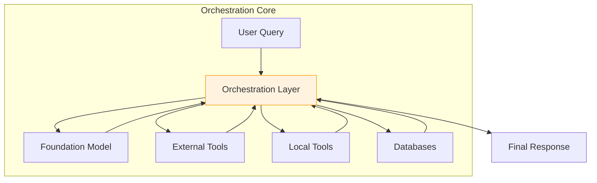

---

## 학습 목표

이 장을 학습한 후 다음을 할 수 있어야 한다:

- [ ] 6가지 Agent 유형(Reflex, ReAct, Planner-Executor, Query-Decomposition, Reflection, Deep Research)의 특성과 적용 사례 이해
- [ ] 3가지 Tool Selection 전략(Standard, Semantic, Hierarchical)을 구현하고 선택
- [ ] Tool Topology(Single, Parallel, Chains, Graphs)에 따른 실행 패턴 설계
- [ ] Context Engineering을 통한 효과적인 Context 구성
- [ ] 사용 사례에 적합한 Orchestration 전략 선택

---

## 본문 정리

### 1. Agent Types (에이전트 유형)

각 Agent 유형은 추론, 계획, 행동에 대한 고유한 접근 방식을 가지며, 작업 분해 및 실행 방식에 영향을 미친다.

#### Agent 유형 스펙트럼

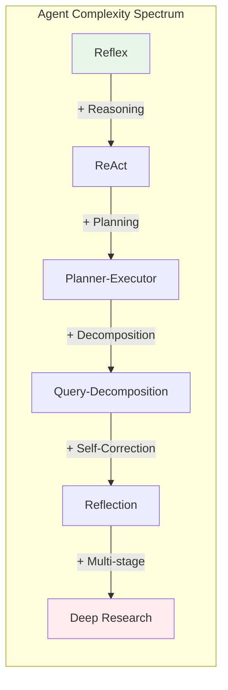

#### 1.1 Reflex Agents (반사 에이전트)

입력에서 행동으로 직접 매핑하며, 내부 추론 과정이 없다.

| 특성 | 설명 |
|------|------|
| **동작 방식** | "if-condition, then-action" 규칙 |
| **응답 시간** | 밀리초 단위 |
| **장점** | 예측 가능한 성능, 최소 지연 |
| **단점** | 다단계 추론 불가 |
| **적용 사례** | 키워드 라우팅, 단일 단계 데이터 조회 |

#### 1.2 ReAct Agents (추론-행동 에이전트)

**Reasoning**과 **Action**을 반복적으로 인터리브한다.

```
ReAct Loop:
┌─────────────────────────────────────────────┐
│ 1. Thought (생각) → 2. Action (행동)        │
│         ↑                    ↓              │
│ 4. Repeat (반복) ← 3. Observation (관찰)    │
└─────────────────────────────────────────────┘
```

| 변형 | 설명 |
|------|------|
| **ZERO_SHOT_REACT_DESCRIPTION** | 단일 프롬프트에 도구와 지침 제시, 예시 없이 추론 |
| **CHAT_ZERO_SHOT_REACT_DESCRIPTION** | 대화 이력을 포함하여 다음 행동 결정 |

**장점**: 유연한 적응, 디버깅 용이 (chain of thought)
**단점**: 추가 지연 및 API 비용

#### 1.3 Planner-Executor Agents (계획-실행 에이전트)

작업을 두 단계로 분리한다:
1. **Planning**: 다단계 계획 생성
2. **Execution**: 각 계획 단계 실행

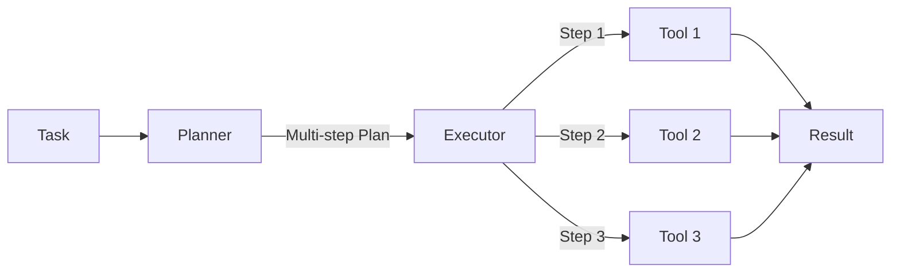

**장점**:
- 명확한 작업 분해
- 디버깅 용이 (계획 검사 가능)
- 비용 효율 (실행에 작은 모델 사용 가능)

#### 1.4 Query-Decomposition Agents (질의 분해 에이전트)

복잡한 질문을 하위 질문으로 반복적으로 분해한다.

```
SELF_ASK_WITH_SEARCH 예시:

질문: "X와 Y 중 누가 더 오래 살았나?"

1. Self-ask: "X의 수명은?" → 검색 도구 호출
2. Self-ask: "Y의 수명은?" → 검색 도구 호출
3. 종합: "X는 85년, Y는 90년, 따라서 Y가 더 오래 살았음"
```

**적용 사례**: 외부 지식 검색이 필요한 연구, 사실 기반 Q&A

#### 1.5 Reflection Agents (성찰 에이전트)

ReAct를 확장하여 과거 단계를 검토하고 오류를 수정한다.

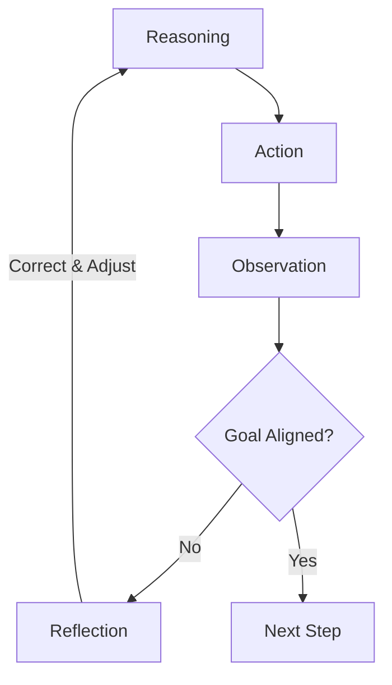

**ReflAct Framework**: 목표 상태 성찰에 추론을 지속적으로 근거

**적용 사례**: 고위험 워크플로우 (금융 거래, 의료 진단, 긴급 대응)

#### 1.6 Deep Research Agents (심층 연구 에이전트)

광범위한 외부 지식 수집, 가설 검증, 종합이 필요한 복잡한 조사에 특화

```
Deep Research Cycle:
1. Plan: 전체 연구 의제 수립
2. Decompose: 각 하위 주제를 구체적 쿼리로 분해
3. Invoke: 도구 호출 (학술 검색 API, 도메인 DB 등)
4. Reflect: 결과의 관련성과 신뢰성 검토
5. Synthesize: 통찰을 보고서로 종합
```

**장점**: 복잡한 다단계 조사 처리, 적응적, 감사 가능한 방법론
**단점**: 높은 비용, 긴 지연, 외부 데이터 소스 의존

#### Agent 유형 비교표

| Agent 유형 | 강점 | 약점 | 최적 사용 사례 |
|------------|------|------|----------------|
| **Reflex** | 밀리초 응답 | 다단계 추론 불가 | 키워드 라우팅, 단순 조회 |
| **ReAct** | 유연한 적응 | 높은 지연/비용 | 탐색적 워크플로우, 문제 해결 |
| **Plan-Execute** | 명확한 작업 분해 | 계획 오버헤드 | 복잡한 다단계 프로세스 |
| **Query-Decomposition** | 근거 있는 검색 정확도 | 다중 도구 호출 | 연구, 사실 기반 Q&A |
| **Reflection** | 조기 오류 감지 | 추가 연산/지연 | 고위험, 안전 중요 작업 |
| **Deep Research** | 다단계 적응적 조사 | 매우 높은 비용/지연 | 장기 문헌 검토 |

---

### 2. Tool Selection (도구 선택)

도구 선택은 고급 계획의 기반이 된다.

#### Tool Selection 전략 비교

```mermaid
quadrantChart
    title Tool Selection: 정확도 vs 확장성
    x-axis 낮은 확장성 --> 높은 확장성
    y-axis 낮은 정확도 --> 높은 정확도
    quadrant-1 Hierarchical
    quadrant-2 Standard (소규모)
    quadrant-3 Standard (대규모)
    quadrant-4 Semantic

    Standard Small: [0.3, 0.8]
    Standard Large: [0.3, 0.4]
    Semantic: [0.75, 0.6]
    Hierarchical: [0.7, 0.85]
```

| 기법 | 장점 | 단점 |
|------|------|------|
| **Standard** | 구현 간단 | 많은 도구에서 확장 불량 |
| **Semantic** | 대규모 도구에 확장성 | 의미적 충돌로 정확도 저하 가능 |
| **Hierarchical** | 대규모 확장성, 높은 정확도 | 다중 FM 호출로 느림 |

#### 2.1 Standard Tool Selection

가장 단순한 접근 방식으로, 도구 정의와 설명을 Foundation Model에 제공하고 적절한 도구를 선택하게 한다.

```python
from langchain_core.tools import tool
from langchain_openai import ChatOpenAI

@tool
def query_wolfram_alpha(expression: str) -> str:
    """Query Wolfram Alpha to compute expressions or retrieve information."""
    # API 호출 로직
    pass

@tool
def send_slack_message(channel: str, message: str) -> str:
    """Send a message to a specified Slack channel."""
    # API 호출 로직
    pass

# Model에 Tool 바인딩
llm = ChatOpenAI(model_name="gpt-4o")
llm_with_tools = llm.bind_tools([query_wolfram_alpha, send_slack_message])

# 호출
messages = [HumanMessage("What is the stock price of Apple?")]
ai_msg = llm_with_tools.invoke(messages)
```

**Tool Description 작성 원칙**:

```
✅ 좋은 Tool 설명:
   - 이름: calculate_sum (정확하고 구체적)
   - 설명: "Returns the sum of two numbers" (명확한 목적)
   - 예시: 입력/출력 예제 포함
   - 제약: "x and y must be integers between 0 and 1,000"

❌ 나쁜 Tool 설명:
   - 이름: process_numbers (모호함)
   - 설명: "Performs calculations" (일반적)
   - 제약: 미정의
```

#### 2.2 Semantic Tool Selection

의미적 표현을 사용하여 도구를 인덱싱하고 검색한다.

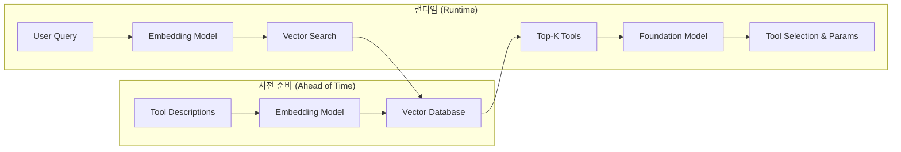

**구현 예제**:

```python
from langchain_openai import OpenAIEmbeddings
import faiss
import numpy as np

# Tool 임베딩 생성
embeddings = OpenAIEmbeddings()
tool_descriptions = {
    "query_wolfram_alpha": "Use Wolfram Alpha to compute mathematical expressions",
    "trigger_zapier_webhook": "Trigger a Zapier webhook for automated workflows",
    "send_slack_message": "Send messages to Slack channels"
}

# FAISS 인덱스 구축
tool_embeddings = [embeddings.embed_text(desc) for desc in tool_descriptions.values()]
dimension = len(tool_embeddings[0])
index = faiss.IndexFlatL2(dimension)
index.add(np.array(tool_embeddings).astype('float32'))

# 쿼리 시 Tool 검색
def select_tool(query: str, top_k: int = 1):
    query_embedding = embeddings.embed_text(query).astype('float32')
    D, I = index.search(query_embedding.reshape(1, -1), top_k)
    return [list(tool_descriptions.keys())[idx] for idx in I[0]]
```

#### 2.3 Hierarchical Tool Selection

도구를 그룹으로 조직하고 2단계 선택을 수행한다.

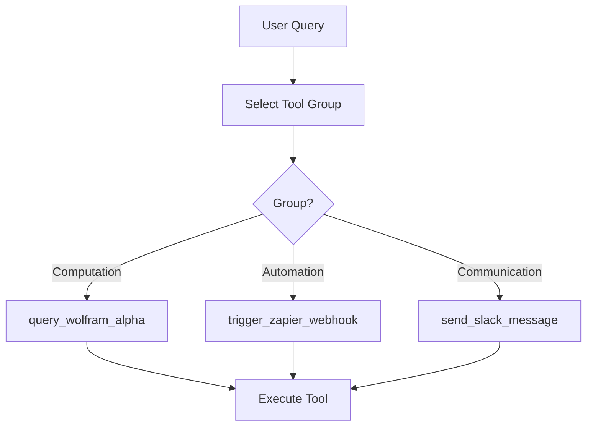

**Tool 그룹 정의**:

```python
tool_groups = {
    "Computation": {
        "description": "Tools for mathematical computations and data analysis",
        "tools": [query_wolfram_alpha]
    },
    "Automation": {
        "description": "Tools that automate workflows and integrate services",
        "tools": [trigger_zapier_webhook]
    },
    "Communication": {
        "description": "Tools that facilitate communication and messaging",
        "tools": [send_slack_message]
    }
}

def select_group_llm(query: str) -> str:
    prompt = f"Select the most appropriate tool group for: '{query}'\n"
    prompt += "Options: Computation, Automation, Communication"
    response = llm([HumanMessage(content=prompt)])
    return response.content.strip()

def select_tool_llm(query: str, group_name: str) -> str:
    prompt = f"Based on query: '{query}', select tool from group '{group_name}'"
    response = llm([HumanMessage(content=prompt)])
    return response.content.strip()
```

**권장 사용**: 도구 수가 많고 의미적으로 유사한 도구가 많을 때

---

### 3. Tool Execution (도구 실행)

#### Parametrization (파라미터화)

도구 실행을 안내할 파라미터를 정의하고 설정하는 과정이다.

```
Parametrization Process:
┌─────────────────────────────────────────────────┐
│ 1. Tool Definition에서 파라미터 스키마 추출      │
│ 2. 현재 Agent 상태를 Context에 포함             │
│ 3. 추가 Context (현재 시간, 사용자 위치 등) 주입 │
│ 4. FM이 적절한 데이터 타입으로 파라미터 채움     │
│ 5. 기본 파서로 입력 유효성 검증                 │
│ 6. 검증 실패 시 FM에 수정 지시                  │
└─────────────────────────────────────────────────┘
```

#### Execution 고려사항

| 항목 | 설명 |
|------|------|
| **로컬 vs 원격** | 일부 도구는 로컬, 일부는 API로 원격 실행 |
| **외부 통합** | API, 데이터베이스, 기타 도구와 상호작용 |
| **Timeout/Retry** | 지연 및 성능 요구사항에 맞게 조정 |

---

### 4. Tool Topologies (도구 토폴로지)

도구의 실행 패턴을 정의한다.

#### 토폴로지 복잡도 스펙트럼

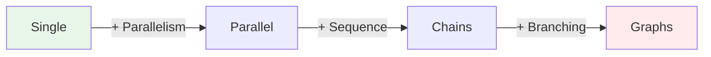

#### 4.1 Single Tool Execution

가장 단순한 형태로, 정확히 하나의 도구를 실행한다.

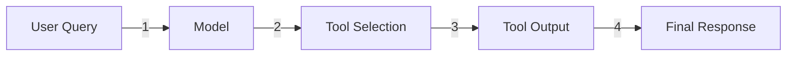

**예시: 날씨 조회**

```
User: "What's the weather in NYC?"
       ↓
Model: Select weather_tool(city="New York City")
       ↓
Tool Output: {"temp": 72, "conditions": "Sunny"}
       ↓
Response: "It's currently 72°F and sunny in NYC."
```

#### 4.2 Parallel Tool Execution

여러 도구를 병렬로 실행하여 지연 없이 종합적인 정보를 수집한다.

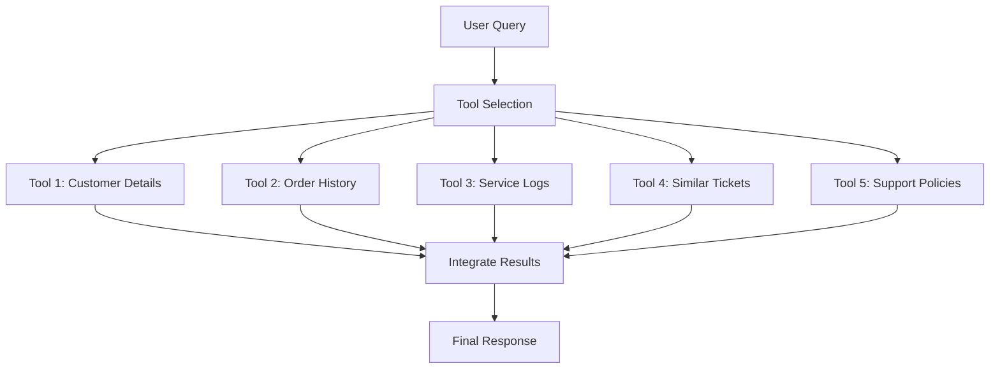

**구현 패턴**:
1. Semantic Tool Selection으로 최대 N개 후보 검색
2. FM으로 필요한 도구만 필터링
3. 선택된 도구들을 독립적으로 파라미터화 및 실행
4. 모든 결과를 FM에 전달하여 최종 응답 생성

#### 4.3 Chains (체인)

순차적으로 실행되며, 각 행동이 이전 행동의 완료에 의존한다.

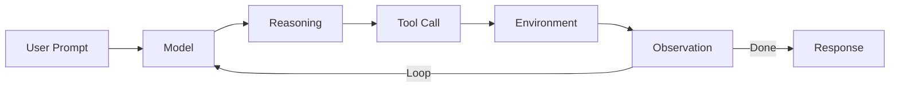

**LCEL (LangChain Expression Language) 구현**:

```python
from langchain_core.runnables import RunnableLambda
from langchain.chat_models import ChatOpenAI
from langchain_core.prompts import PromptTemplate

llm = RunnableLambda.from_callable(
    ChatOpenAI(model_name="gpt-4", temperature=0).generate
)
prompt = RunnableLambda.from_callable(
    lambda text: PromptTemplate.from_template(text)
        .format_prompt({"input": text}).to_messages()
)

# LCEL 체인 (파이프 연산자 사용)
chain = prompt | llm

result = chain.invoke("What is the capital of France?")
```

**권장**: 체인 최대 길이 설정 (오류 누적 방지)

#### 4.4 Graphs (그래프)

복잡한 비선형 흐름을 모델링하며, 조건부 엣지와 통합 엣지를 지원한다.

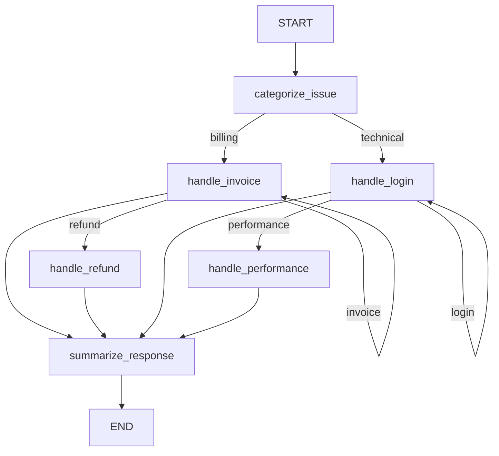

**LangGraph 구현**:

```python
from langgraph.graph import StateGraph, START, END

# 노드 정의
def categorize_issue(state: dict) -> dict:
    # 이슈 분류 로직
    return {**state, "issue_type": "billing"}

def handle_invoice(state: dict) -> dict:
    return {**state, "step_result": "Invoice details fetched"}

def summarize_response(state: dict) -> dict:
    return {**state, "response": "Summary generated"}

# 그래프 구축
graph = StateGraph()
graph.add_edge(START, categorize_issue)

# 조건부 엣지
def top_router(state):
    return "billing" if state["issue_type"] == "billing" else "technical"

graph.add_conditional_edges(
    categorize_issue,
    top_router,
    mapping={"billing": handle_invoice, "technical": handle_login}
)

# 통합 엣지
graph.add_edge(handle_invoice, summarize_response)
graph.add_edge(summarize_response, END)

# 실행
result = graph.run({"user_message": "Help with invoice"}, max_depth=5)
```

#### 토폴로지 선택 가이드

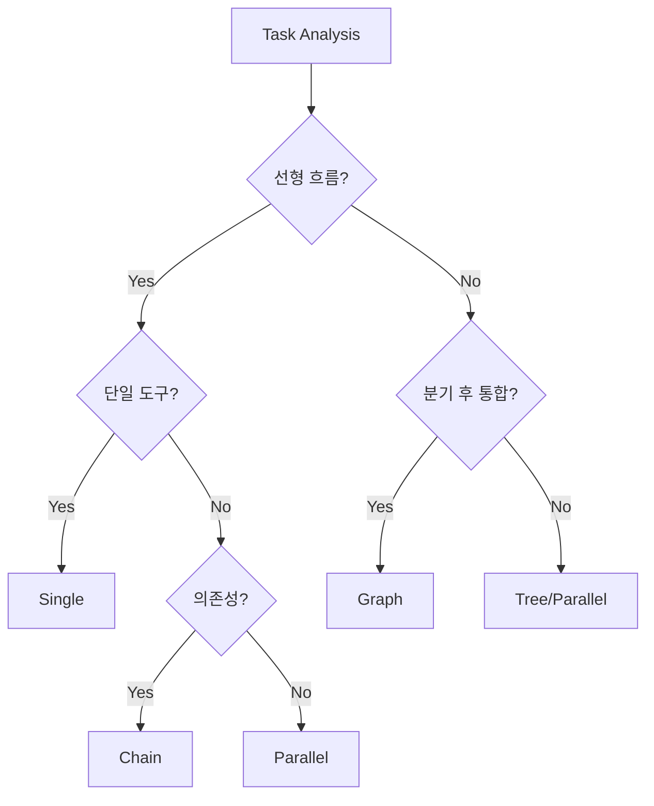

---

### 5. Context Engineering (컨텍스트 엔지니어링)

Orchestration의 핵심 구성 요소로, 각 단계에 적절한 정보와 지침을 제공한다.

#### Context Engineering vs Prompt Engineering

| 측면 | Prompt Engineering | Context Engineering |
|------|-------------------|---------------------|
| **초점** | 효과적인 지침 작성 | 동적 입력 조립 |
| **범위** | 단일 프롬프트 | 전체 워크플로우 |
| **구성요소** | 지침, 예시 | 사용자 입력, 검색된 지식, 워크플로우 상태, 시스템 프롬프트 |

#### Context 구성 요소

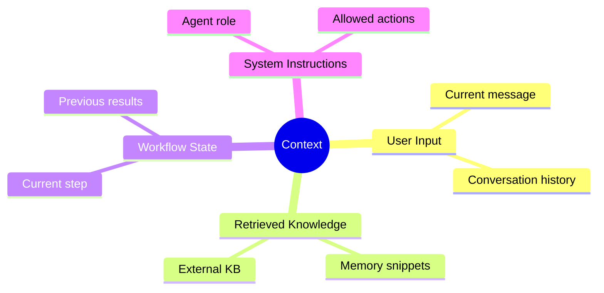

#### Context Engineering 핵심 원칙

| 원칙 | 설명 |
|------|------|
| **관련성 우선** | 관련 정보만 검색, 무분별한 텍스트 추가 금지 |
| **명확성 유지** | MCP 같은 구조화된 포맷/스키마 사용 |
| **요약 기법** | 긴 이력을 핵심 보존하며 압축 |
| **동적 조립** | 각 추론 단계에서 목표/단계/입력 반영 |

#### 실무 예시: 이커머스 지원 Agent

```
Context 구성:
┌─────────────────────────────────────────────────┐
│ [System Prompt]                                 │
│ - 역할: 이커머스 고객 지원                        │
│ - 허용된 행동: 주문 조회, 환불 처리 등            │
├─────────────────────────────────────────────────┤
│ [User Message]                                  │
│ "주문 #12345 환불해주세요"                       │
├─────────────────────────────────────────────────┤
│ [Retrieved Context]                             │
│ - 주문 기록 요약                                 │
│ - 적용 가능한 환불 정책                          │
│ - 이전 관련 대화 요약                            │
├─────────────────────────────────────────────────┤
│ [Workflow State]                                │
│ - 현재 단계: 주문 확인                           │
│ - 이전 도구 결과: [order_details_json]           │
└─────────────────────────────────────────────────┘
```

---

## 심화 학습

### Agent 선택 의사결정 트리

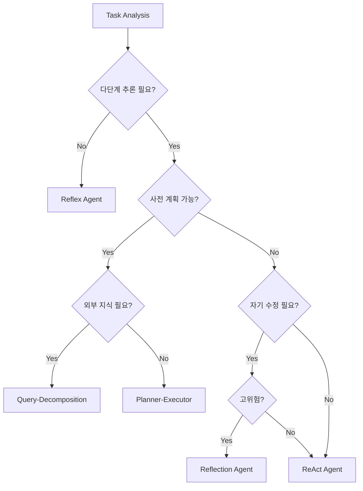

### Tool Topology 비교

| 토폴로지 | FM 호출 수 | 지연 | 복잡도 | 적용 사례 |
|----------|-----------|------|--------|----------|
| **Single** | 2 | 최저 | 최저 | 단일 작업 |
| **Parallel** | 2 + N | 낮음 | 낮음 | 다중 소스 수집 |
| **Chain** | 2 × Steps | 중간 | 중간 | 순차적 워크플로우 |
| **Graph** | 높음 | 높음 | 높음 | 복잡한 분기/통합 |

### Latency vs Accuracy 트레이드오프

```
High Accuracy
    ↑
    │   Deep Research
    │       ▲
    │   Reflection
    │       ▲
    │   Planner-Executor
    │       ▲
    │   ReAct
    │       ▲
    │   Reflex
    │
    └────────────────────→ High Latency
```

---

## 실무 적용 포인트

### 1. Orchestration 설계 Best Practices

```
1️⃣ 요구사항 분석
   • 지연(Latency) 요구사항 파악
   • 정확도(Accuracy) 요구사항 파악
   • 두 요소 간 트레이드오프 고려

2️⃣ 작업 복잡도 평가
   • 일반적으로 필요한 행동 수 결정
   • 행동 수가 많을수록 복잡한 계획 필요

3️⃣ 적응성 평가
   • 이전 행동 결과에 따른 계획 변경 필요 여부
   • 점진적 계획 조정이 필요하면 적응형 기법 고려

4️⃣ 테스트 설계
   • 대표적인 테스트 케이스 설계
   • 다양한 계획 접근법 평가
   • 사용 사례에 최적인 접근법 식별

5️⃣ 단순성 원칙
   • 요구사항을 충족하는 가장 단순한 접근법 선택
   • 작게 시작하고 필요에 따라 복잡도 증가
```

### 2. Tool Selection 전략 선택

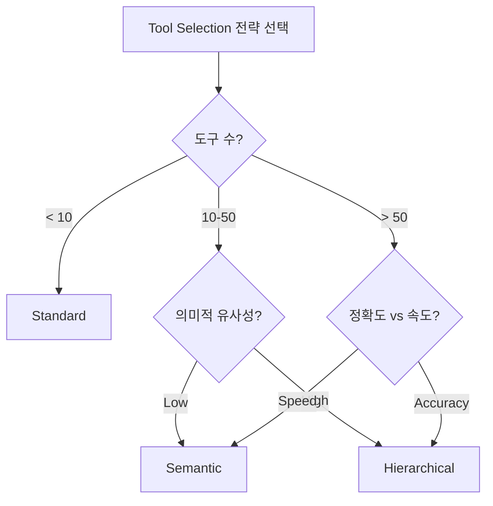

### 3. Graph 토폴로지 주의사항

```
⚠️ Graph 사용 시 주의:
□ 깊이(depth)와 분기 계수(branching factor) 제한
□ 각 라우터에 대한 유닛 테스트 작성
□ LangGraph 내장 추적으로 모든 경로가 종료 노드로 도달하는지 검증
□ 사이클, 도달 불가 노드, 상태 병합 충돌 관리

💡 권장:
• 종이에 먼저 토폴로지 스케치
• 각 노드에 도구/논리 단계 레이블
• 허용된 전환에 화살표 그리기
• 분기가 재합류하는 지점 강조
```

### 4. Context Engineering 체크리스트

```
Context 구성 시:
□ 현재 사용자 입력 포함
□ 관련 메모리/외부 지식 검색
□ 이전 대화 요약 (토큰 효율적)
□ 에이전트 역할 정의하는 시스템 지침
□ 현재 워크플로우 상태
□ 이전 도구 호출 결과 (해당 시)
```

---

## 핵심 개념 체크리스트

### Agent Types
- [ ] Reflex: 직접 입력→행동 매핑, 밀리초 응답
- [ ] ReAct: Reasoning + Action 인터리브, 유연한 적응
- [ ] Planner-Executor: Planning과 Execution 분리
- [ ] Query-Decomposition: 복잡한 질문을 하위 질문으로 분해
- [ ] Reflection: 자기 검토 및 오류 수정
- [ ] Deep Research: 다단계 적응적 조사

### Tool Selection
- [ ] Standard: 간단, 소규모 도구셋에 적합
- [ ] Semantic: 임베딩 기반 검색, 확장성 우수
- [ ] Hierarchical: 그룹화, 높은 정확도, 느림

### Tool Topologies
- [ ] Single: 하나의 도구, 최소 지연
- [ ] Parallel: 여러 도구 병렬 실행
- [ ] Chains: 순차적 의존성 있는 실행
- [ ] Graphs: 조건부 분기 및 통합

### Context Engineering
- [ ] 관련성 우선
- [ ] 명확한 구조화 (MCP 등)
- [ ] 요약을 통한 토큰 효율성
- [ ] 동적 조립

---

## 참고 자료

### 공식 문서
- [LangChain LCEL Documentation](https://python.langchain.com/docs/expression_language/)
- [LangGraph Documentation](https://langchain-ai.github.io/langgraph/)
- [FAISS Vector Store](https://faiss.ai/)

### 관련 논문
- [ReAct: Synergizing Reasoning and Acting in Language Models](https://arxiv.org/abs/2210.03629)
- [ReflAct: Goal-State Reflection for Agents](https://arxiv.org/abs/2403.00001)

### 프레임워크
- [LangChain](https://github.com/langchain-ai/langchain)
- [LangGraph](https://github.com/langchain-ai/langgraph)

---

## 다음 장 미리보기

> **Chapter 6: Memory** - Agent의 기능을 더욱 향상시키는 메모리를 탐구한다. 지식 회상, 상호작용 간 컨텍스트 유지, 더 지능적이고 개인화된 작업 수행을 가능하게 하는 방법을 학습한다.
