# Chapter 6. Knowledge and Memory

## 핵심 요약

> **Knowledge와 Memory는 Agent의 Context를 풍부하게 하는 두 가지 상호 보완적이지만 구별되는 방법이다.**

- **Knowledge**: RAG를 통해 생성 시점에 사실적/도메인 특화 콘텐츠를 가져온다 (기술 스펙, 정책 문서, 제품 카탈로그 등)
- **Memory**: Agent의 이력을 캡처한다 (이전 사용자 대화, 도구 출력, 상태 업데이트)

Memory는 Context Engineering의 기반이 되며, Knowledge가 저장되는 곳이다. Context Engineering은 그 Knowledge를 활용하여 지능적인 행동을 생성하는 방법이다.

### Knowledge vs Memory

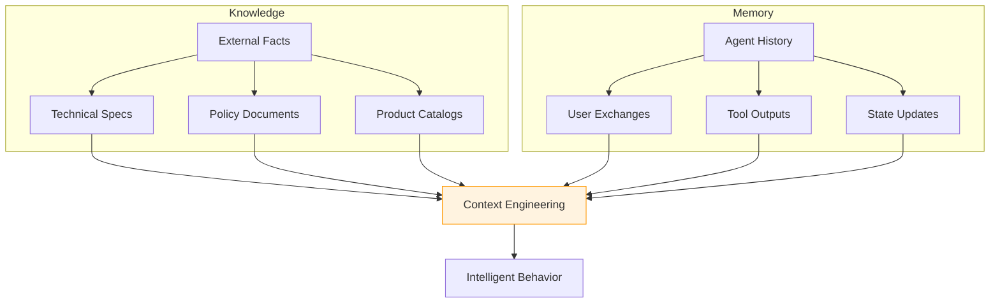

---

## 학습 목표

이 장을 학습한 후 다음을 할 수 있어야 한다:

- [ ] Context Window 관리 전략 이해 및 구현
- [ ] Full-Text Search (BM25)와 Semantic Search의 차이점 파악
- [ ] Vector Store를 활용한 Semantic Memory 구현
- [ ] RAG (Retrieval-Augmented Generation) 파이프라인 설계
- [ ] Knowledge Graph 구축 및 GraphRAG 적용
- [ ] 동적 Knowledge Graph의 장단점 평가

---

## 본문 정리

### 1. Context Window 관리

Context Window는 Foundation Model에 단일 호출로 전달되는 정보이며, 해당 요청의 작업 메모리 역할을 한다.

#### Context Length 발전

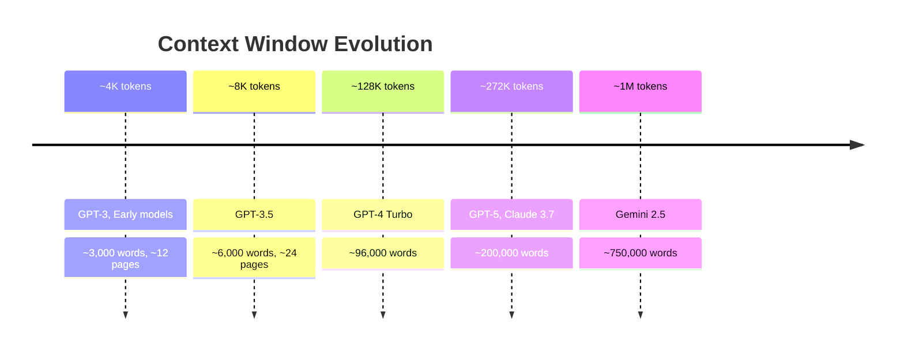

> **참고**: 1 token ≈ ¾ word ≈ 4 characters (영어 기준)

#### Rolling Context Window

가장 단순한 접근법으로, 상호작용이 진행됨에 따라 전체 대화를 Context Window에 포함하고, 가득 차면 가장 오래된 부분을 제거한다 (FIFO).

```python
from langchain_openai import ChatOpenAI
from langgraph.graph import StateGraph, MessagesState, START

llm = ChatOpenAI(model="gpt-5")

def call_model(state: MessagesState):
    response = llm.invoke(state["messages"])
    return {"messages": response}

builder = StateGraph(MessagesState)
builder.add_node("call_model", call_model)
builder.add_edge(START, "call_model")
graph = builder.compile()

# 세션 간 상태 유지 실패 예시
input_message = {"type": "user", "content": "hi! I'm bob"}
graph.stream({"messages": [input_message]}, stream_mode="values")

input_message = {"type": "user", "content": "what's my name?"}
# → 이전 메시지가 유지되지 않으면 이름을 모름
```

| 장점 | 단점 |
|------|------|
| 구현 간단 | 중요한 정보도 오래되면 손실 |
| 낮은 복잡도 | 긴 프롬프트/응답 시 빠르게 손실 |
| 많은 사용 사례에 적합 | 관련성과 무관하게 제거 |

**Best Practice**: 중요한 Context는 프롬프트 끝 부분에 배치하여 모델이 활용할 가능성을 높임

---

### 2. Traditional Full-Text Search

키워드 기반 검색으로, Inverted Index와 BM25 스코어링을 사용한다.

#### Inverted Index

```
Text Processing Pipeline:
┌──────────────────────────────────────────────────┐
│ 1. Tokenization: 텍스트를 토큰으로 분리           │
│ 2. Normalization: 소문자 변환, 어간 추출          │
│ 3. Stop-word Removal: 불용어 제거                │
│ 4. Indexing: 각 용어 → 해당 문서/청크 매핑        │
└──────────────────────────────────────────────────┘
```

#### BM25 Scoring

```
BM25 가중치 요소:
• Term Frequency (TF): 쿼리 용어가 문서에 나타나는 빈도
• Inverse Document Frequency (IDF): 용어가 전체 코퍼스에서 얼마나 희귀한지
• Document Length Normalization: 지나치게 긴/짧은 청크 패널티
```

#### 구현 예제

```python
from rank_bm25 import BM25Okapi
from typing import List

# 코퍼스 정의
corpus: List[List[str]] = [
    "Agent J is the fresh recruit with attitude".split(),
    "Agent K has years of MIB experience and a cool neuralyzer".split(),
    "The galaxy is saved by two Agents in black suits".split(),
]

# BM25 인덱스 구축
bm25 = BM25Okapi(corpus)

# 검색 수행
query = "Who is a recruit?".split()
top_n = bm25.get_top_n(query, corpus, n=2)

print("Query:", " ".join(query))
print("Top matching lines:")
for line in top_n:
    print(" •", " ".join(line))
```

| 장점 | 단점 |
|------|------|
| 정확한 용어 검색에 탁월 | 의미적 유사성 놓침 |
| 빠른 조회 속도 | 패러프레이즈 처리 불가 |
| 성숙한 기술 | 개념적 연결 누락 |

---

### 3. Semantic Memory and Vector Stores

키워드가 아닌 의미(Meaning)를 기반으로 검색한다.

#### Semantic Search 원리

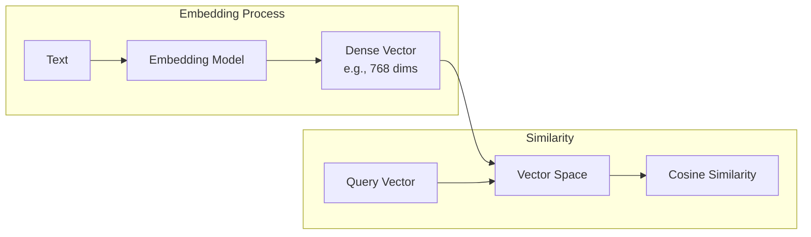

#### Embedding Models 발전

| 모델 | 특징 |
|------|------|
| **Word2Vec** | 단어 수준 임베딩, 문맥 기반 |
| **GloVe** | 전역 단어 동시 발생 통계 |
| **BERT** | 양방향 문맥 인코딩 |
| **LLM-based** | 대규모 데이터, 더 큰 모델 |

#### Vector Store 종류

| Store | 설명 |
|-------|------|
| **FAISS** | Facebook AI Similarity Search |
| **Annoy** | Approximate Nearest Neighbors Oh Yeah |
| **VectorDB** | 일반 벡터 데이터베이스 |
| **Pinecone** | 관리형 벡터 DB |
| **Weaviate** | 오픈소스 벡터 검색 엔진 |

#### 구현 예제

```python
from vectordb import Memory
from langchain_openai import ChatOpenAI
from langgraph.graph import StateGraph, MessagesState, START

# 메모리 초기화
memory = Memory(chunking_strategy={
    'mode': 'sliding_window',
    'window_size': 128,
    'overlap': 16
})

# 텍스트 저장
text = """
Machine learning is a method of data analysis that automates
analytical model building...
"""
metadata = {
    "title": "Introduction to Machine Learning",
    "url": "https://example.com/ml-intro"
}
memory.save(text, metadata)

# 검색
query = "What is the relationship between AI and machine learning?"
results = memory.search(query, top_n=3)
```

---

### 4. Retrieval-Augmented Generation (RAG)

검색 기반 방법과 생성 모델의 강점을 결합한다.

#### RAG 파이프라인

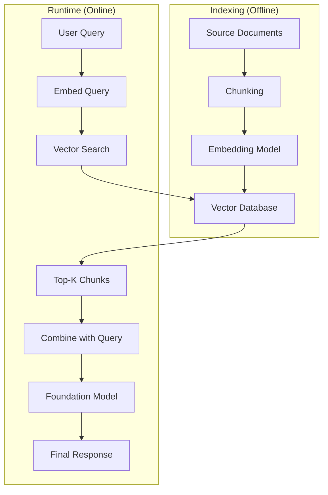

#### Indexing Phase

```
1. 문서 수집: 유용할 수 있는 문서 세트 준비
2. Chunking: 문서를 작은 청크로 분할
3. Embedding: 각 청크를 인코더 모델로 임베딩
4. Indexing: 벡터 데이터베이스에 저장
```

#### Runtime Phase

```
1. Query Embedding: 사용자 쿼리를 동일 모델로 임베딩
2. Retrieval: 벡터 DB에서 가장 유사한 청크 검색
3. Augmentation: 검색된 정보를 쿼리와 결합
4. Generation: FM이 컨텍스트를 사용해 응답 생성
```

#### RAG의 가치

| 이점 | 설명 |
|------|------|
| **사실 기반** | 검증 가능한 외부 정보 제공 |
| **도메인 특화** | 회사/도메인 특정 정보 통합 |
| **최신 정보** | 모델 훈련 이후 정보도 접근 |
| **환각 감소** | 근거 있는 응답 생성 |

---

### 5. Semantic Experience Memory

매 세션마다 백지 상태에서 시작하는 문제와 긴 작업의 컨텍스트 손실 문제를 해결한다.

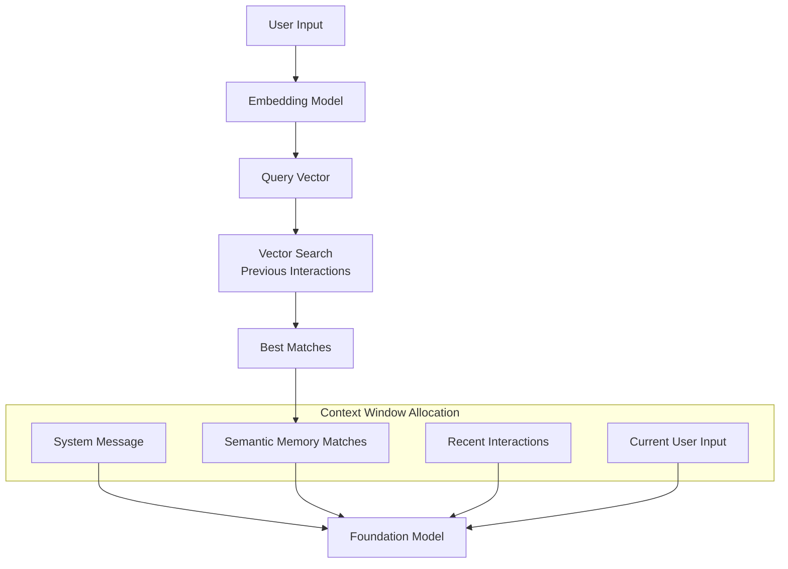

**장점**: 축적된 경험을 기반으로 더 적응적이고 개인화된 행동 가능

---

### 6. GraphRAG

Knowledge Graph를 활용한 고급 RAG로, 복잡한 상호관계와 종속성을 처리한다.

#### Baseline RAG의 한계

```
Baseline RAG가 실패하는 경우:
• 여러 문서에 흩어진 정보 연결 ("점 연결하기")
• 데이터셋 전체의 상위 수준 의미 테마 요약
• 크고, 지저분하거나 서사적으로 구성된 데이터셋
```

**예시**: "Geoffrey Hinton이 무엇을 했나요?" - 단일 청크에 포괄적인 정보가 없으면 실패

#### GraphRAG 아키텍처

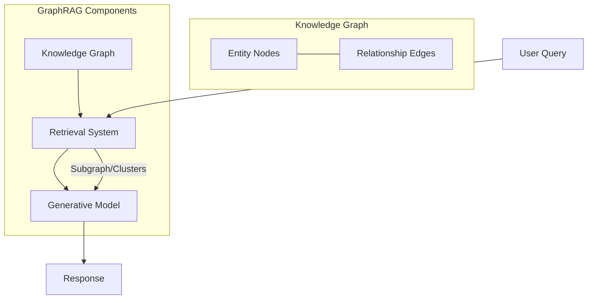

#### GraphRAG의 3가지 구성요소

| 구성요소 | 역할 |
|----------|------|
| **Knowledge Graph** | 엔티티(노드)와 관계(엣지)를 그래프 형식으로 저장 |
| **Retrieval System** | 그래프 DB를 효율적으로 쿼리하여 관련 서브그래프 추출 |
| **Generative Model** | 검색된 그래프 정보를 종합하여 응답 생성 |

#### GraphRAG CLI 사용

```bash
# 설치
pip install graphrag

# 프로젝트 초기화
mkdir -p ./ragtest/input
curl https://www.gutenberg.org/ebooks/103.txt.utf-8 -o ./ragtest/input/book.txt
graphrag init --root ./ragtest

# 인덱싱
graphrag index --root ./ragtest

# Global Query (전체 테마)
graphrag query \
    --root ./ragtest \
    --method global \
    --query "What are the key themes in this novel?"

# Local Query (특정 엔티티)
graphrag query \
    --root ./ragtest \
    --method local \
    --query "Who is Phileas Fogg and what motivates his journey?"
```

---

### 7. Knowledge Graph 구축

#### 구축 단계

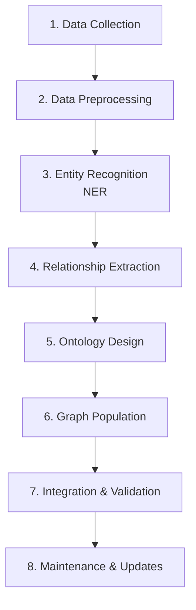

#### 각 단계 설명

| 단계 | 설명 |
|------|------|
| **1. Data Collection** | DB, 문서, 웹사이트 등에서 데이터 수집 |
| **2. Data Preprocessing** | 정제, 오류 수정, 포맷 표준화 |
| **3. Entity Recognition** | NER로 핵심 엔티티 식별 (사람, 장소, 조직 등) |
| **4. Relationship Extraction** | 엔티티 간 관계 추출 |
| **5. Ontology Design** | 엔티티 타입과 관계 타입의 스키마 정의 |
| **6. Graph Population** | 노드와 엣지를 그래프 DB에 생성 |
| **7. Integration & Validation** | 기존 시스템 연동, 정확성 검증 |
| **8. Maintenance** | 정기적 업데이트 및 유지보수 |

#### Semantic Triple 추출

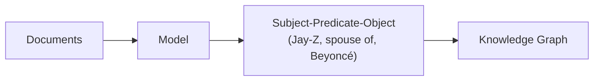

#### Neo4j Cypher 구현

```cypher
// 노드 생성
CREATE (:Concept {name: 'Artificial Intelligence'});
CREATE (:Concept {name: 'Machine Learning'});
CREATE (:Concept {name: 'Deep Learning'});
CREATE (:Tool {name: 'TensorFlow', creator: 'Google'});
CREATE (:Model {name: 'BERT', year: 2018});

// 관계 생성
MATCH
  (ai:Concept {name:'Artificial Intelligence'}),
  (ml:Concept {name:'Machine Learning'})
CREATE (ml)-[:SUBSET_OF]->(ai);

MATCH
  (ml:Concept {name:'Machine Learning'}),
  (dl:Concept {name:'Deep Learning'})
CREATE (dl)-[:SUBSET_OF]->(ml);

MATCH
  (tensorflow:Tool {name:'TensorFlow'}),
  (nn:Concept {name:'Neural Networks'})
CREATE (tensorflow)-[:IMPLEMENTS]->(nn);

// 멀티홉 쿼리
MATCH path = shortestPath(
  (concept1:Concept {name: 'Natural Language Processing'})-[*]-
  (concept2:Concept {name: 'Deep Learning'})
)
RETURN path;

// 특정 조건 쿼리
MATCH (model:Model)-[:BUILT_WITH]->(tool:Tool {name: 'TensorFlow'})
RETURN model.name AS model, model.year AS year;
```

#### Neo4j 프로덕션 배포

| 특성 | 설명 |
|------|------|
| **Index-free Adjacency** | 수십억 노드에서도 일정한 탐색 성능 |
| **Enterprise/AuraDB** | 클러스터링, 장애 허용, ACID 준수 |
| **Multi-region** | 글로벌 배포 지원 |

---

### 8. Dynamic Knowledge Graphs

실시간으로 지속적으로 업데이트되는 Knowledge Graph이다.

#### 장점

| 장점 | 설명 |
|------|------|
| **실시간 처리** | 뉴스, 소셜 미디어, 라이브 모니터링에 적합 |
| **적응적 학습** | 수동 업데이트/재훈련 없이 새 데이터 학습 |
| **빠른 의사결정** | 최신 정보 기반 신속한 결정 |
| **유연한 추론** | 벡터 스토어보다 풍부한 컨텍스트 |

#### 단점

| 단점 | 완화 전략 |
|------|----------|
| **유지보수 복잡성** | 자동화된 검증 메커니즘 구현 |
| **리소스 집약** | 분산 DB, 클라우드 컴퓨팅 활용 |
| **보안/프라이버시** | 암호화, 접근 제어, 익명화 |
| **과의존 위험** | 중요 결정에 인간 감독 유지 |

#### Long Context vs RAG 트레이드오프

```
Long Context (1M tokens):
├─ 장점: 파이프라인 단순화, 전체 문서 로드 가능
├─ 단점: 높은 연산 비용, 지연, 정확도 불확실
└─ 권장: 하이브리드 아키텍처 (Extended Context + Selective Retrieval)
```

---

### 9. Note-Taking 기법

질문에 답하기 전에 입력 컨텍스트에 대한 노트를 생성하도록 FM을 프롬프트한다.

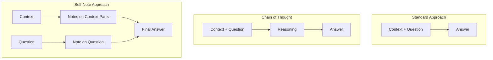

**효과**: 여러 추론 및 평가 작업에서 좋은 결과를 보임

---

## 심화 학습

### Memory 접근법 비교

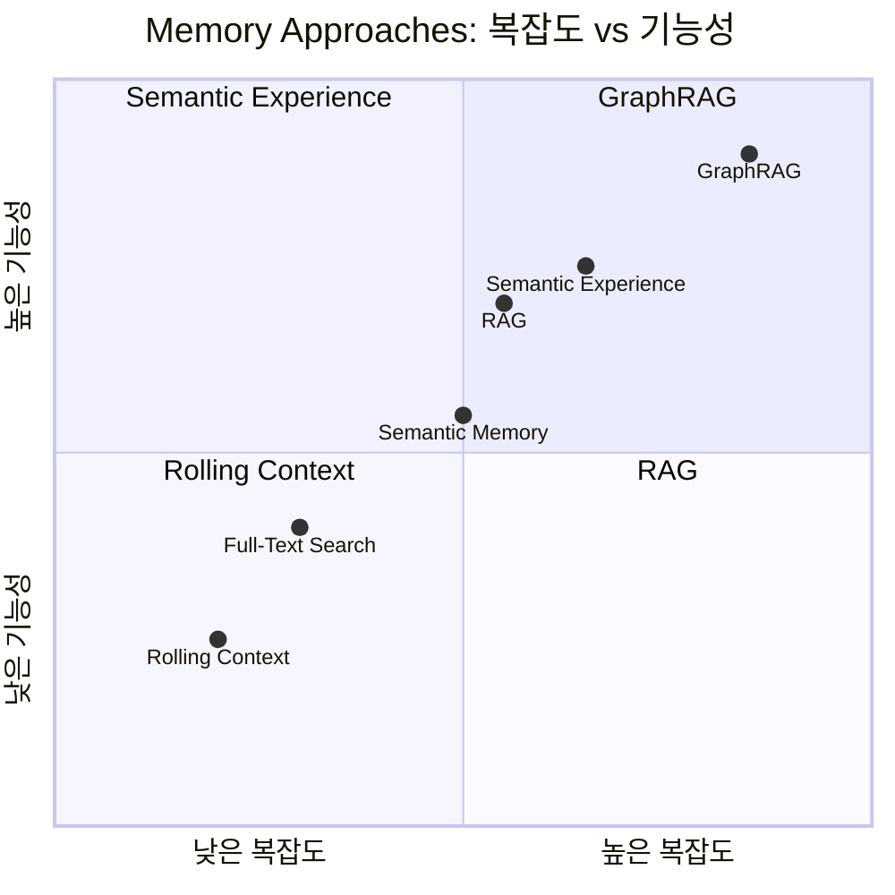

### 검색 방식 비교

| 방식 | 강점 | 약점 | 적용 사례 |
|------|------|------|----------|
| **Full-Text (BM25)** | 정확한 키워드 매칭 | 의미적 유사성 누락 | 정확한 용어 검색 |
| **Semantic** | 의미 기반 검색 | 정확한 매칭 약함 | 개념적 질문 |
| **Hybrid** | 두 방식 결합 | 복잡한 구현 | 균형 잡힌 검색 |
| **GraphRAG** | 멀티홉 추론 | 높은 복잡도/비용 | 관계 기반 질문 |

### RAG vs GraphRAG

| 측면 | RAG | GraphRAG |
|------|-----|----------|
| **데이터 구조** | 청크 + 벡터 | 노드 + 엣지 |
| **검색 방식** | 유사도 검색 | 그래프 탐색 |
| **멀티홉 추론** | 제한적 | 네이티브 지원 |
| **관계 표현** | 암시적 | 명시적 |
| **구축 비용** | 낮음 | 높음 |
| **적합 사례** | 단순 Q&A | 복잡한 관계 질문 |

---

## 실무 적용 포인트

### 1. Memory 전략 선택 가이드

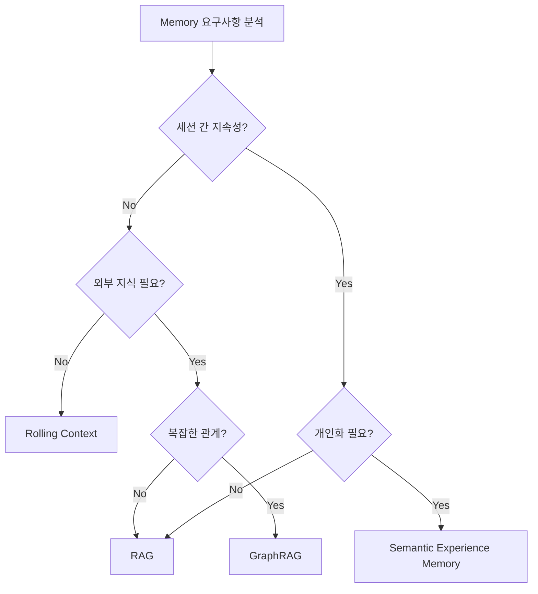

### 2. RAG 구현 체크리스트

```
Indexing Phase:
□ 문서 수집 및 품질 검토
□ 적절한 청크 크기 결정 (128-512 tokens 권장)
□ 청크 간 오버랩 설정 (10-20%)
□ 임베딩 모델 선택 (도메인 적합성)
□ 벡터 DB 선택 및 인덱스 구성

Runtime Phase:
□ 쿼리 전처리 (정규화, 확장)
□ Top-K 파라미터 튜닝
□ 검색 결과 필터링/리랭킹
□ 프롬프트 템플릿 최적화
□ 응답 품질 모니터링
```

### 3. Knowledge Graph 구축 고려사항

```
프로토타입 → 프로덕션 전환 시:
□ 스키마/온톨로지 확정
□ 데이터 품질 검증 파이프라인
□ 엔티티 중복 제거 (Entity Resolution)
□ 인덱싱 전략 최적화
□ 클러스터링 및 샤딩 계획
□ 백업 및 복구 절차
□ 모니터링 및 알림 설정
```

### 4. Context Window 최적화

```
Context Window 할당 전략:
┌─────────────────────────────────────────────────┐
│ Priority 1: System Instructions (필수)          │
│ Priority 2: Current User Input (필수)           │
│ Priority 3: Retrieved Context (가변)            │
│ Priority 4: Recent History (가변)               │
│ Priority 5: Semantic Memory (선택)              │
└─────────────────────────────────────────────────┘

💡 중요한 정보는 프롬프트 끝에 배치
💡 관련성 높은 정보만 포함 (토큰 효율)
```

---

## 핵심 개념 체크리스트

### Context Window
- [ ] Token 개념 (1 token ≈ ¾ word ≈ 4 characters)
- [ ] Rolling Context Window (FIFO)
- [ ] Context Length 발전 (4K → 1M)

### Full-Text Search
- [ ] Inverted Index
- [ ] BM25 Scoring (TF, IDF, Length Normalization)
- [ ] rank_bm25 라이브러리

### Semantic Memory
- [ ] Embeddings (Word2Vec, GloVe, BERT)
- [ ] Vector Stores (FAISS, Annoy, Pinecone)
- [ ] Cosine Similarity 검색

### RAG
- [ ] Indexing Phase (Chunking → Embedding → Storing)
- [ ] Runtime Phase (Query → Retrieve → Generate)
- [ ] Semantic Experience Memory

### GraphRAG
- [ ] Knowledge Graph (Nodes, Edges, Ontology)
- [ ] Semantic Triple (Subject-Predicate-Object)
- [ ] Neo4j Cypher 기본 문법
- [ ] GraphRAG CLI 사용

### Advanced
- [ ] Dynamic Knowledge Graphs 장단점
- [ ] Long Context vs RAG 트레이드오프
- [ ] Note-Taking 기법

---

## 참고 자료

### 공식 문서
- [LangGraph Documentation](https://langchain-ai.github.io/langgraph/)
- [Neo4j Documentation](https://neo4j.com/docs/)
- [Microsoft GraphRAG](https://github.com/microsoft/graphrag)

### Vector Stores
- [FAISS](https://faiss.ai/)
- [Pinecone](https://www.pinecone.io/)
- [Weaviate](https://weaviate.io/)

### Embedding Models
- [OpenAI Embeddings](https://platform.openai.com/docs/guides/embeddings)
- [Sentence Transformers](https://www.sbert.net/)
- [Cohere Embed](https://cohere.ai/embed)

### 관련 논문
- Lanchantin et al., "Learning to Reason and Memorize with Self-Notes", arXiv, 2023

### GraphRAG 리소스
- [Glama.ai](https://glama.ai/) - MCP 서버 검색
- [mcp.so](https://mcp.so/) - MCP 서버 레지스트리

---

## 다음 장 미리보기

> **Chapter 7: Learning from Experience** - Agent가 경험으로부터 학습하여 시간이 지남에 따라 자동으로 개선되는 방법을 탐구한다.
