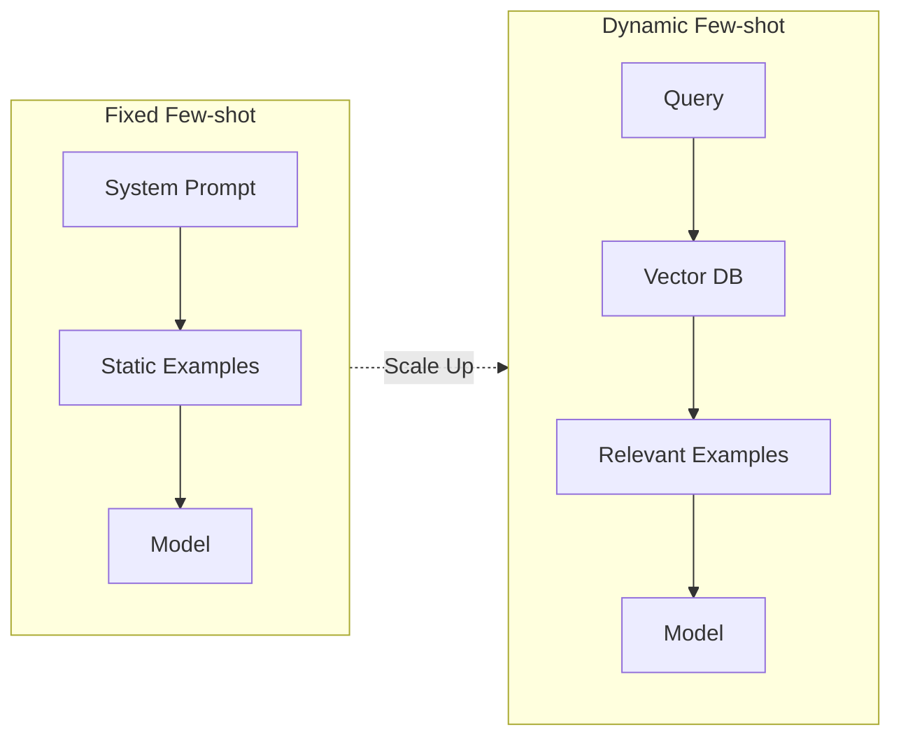
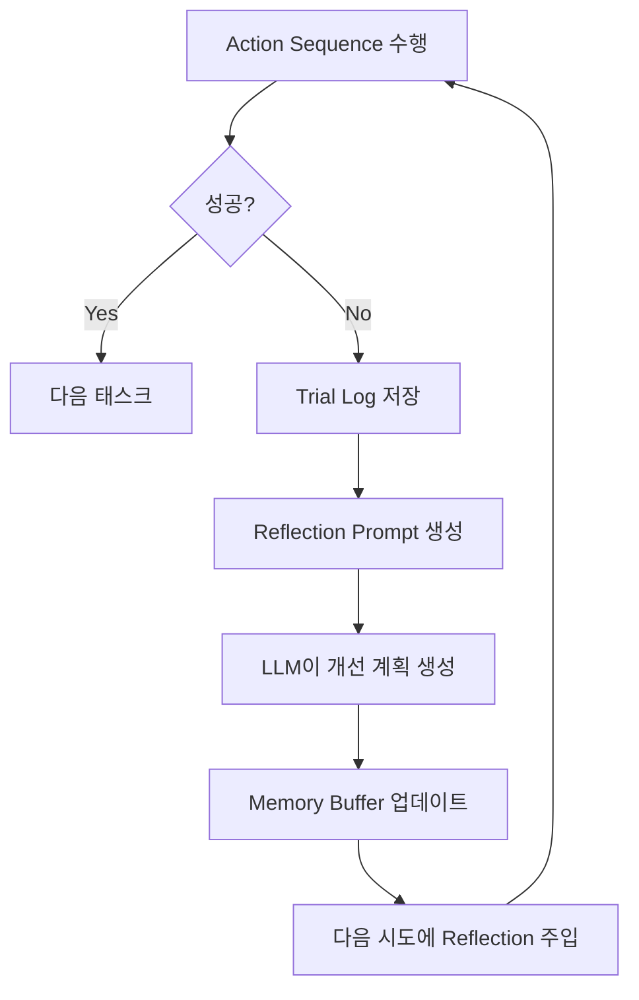
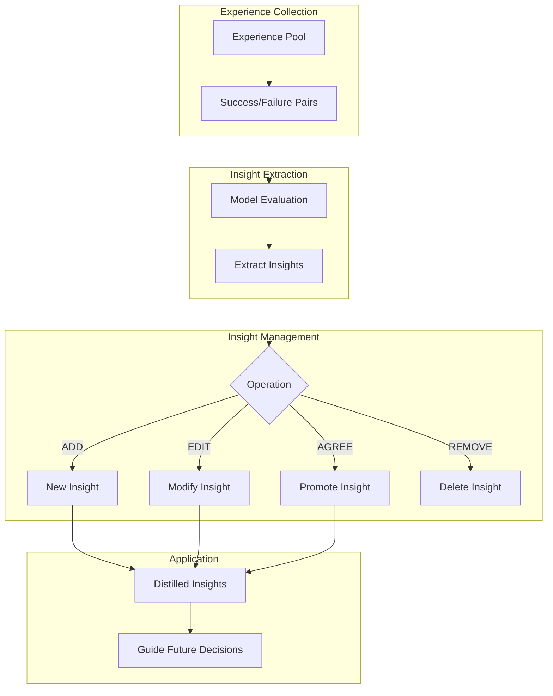
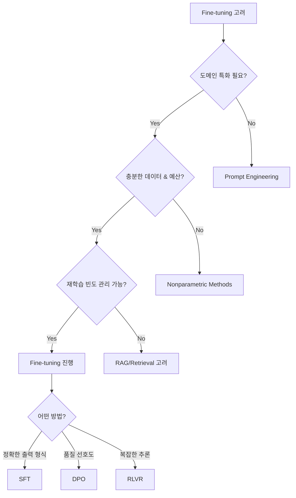
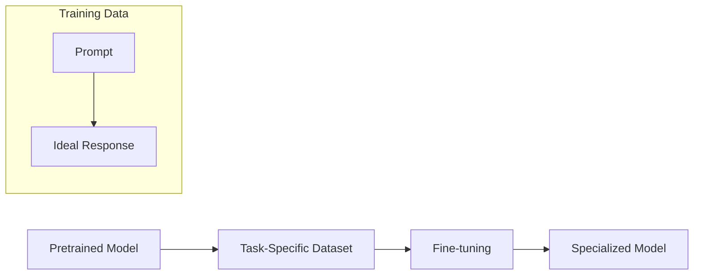
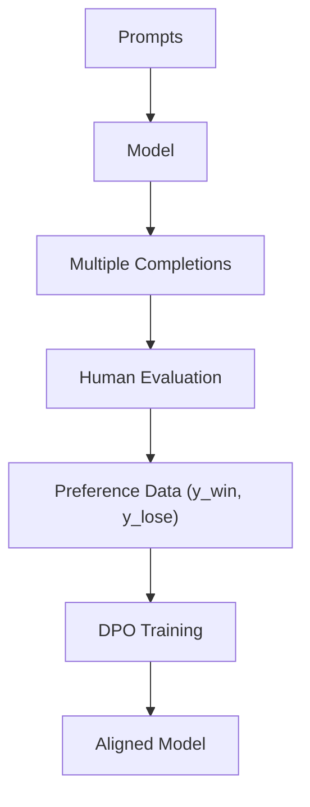
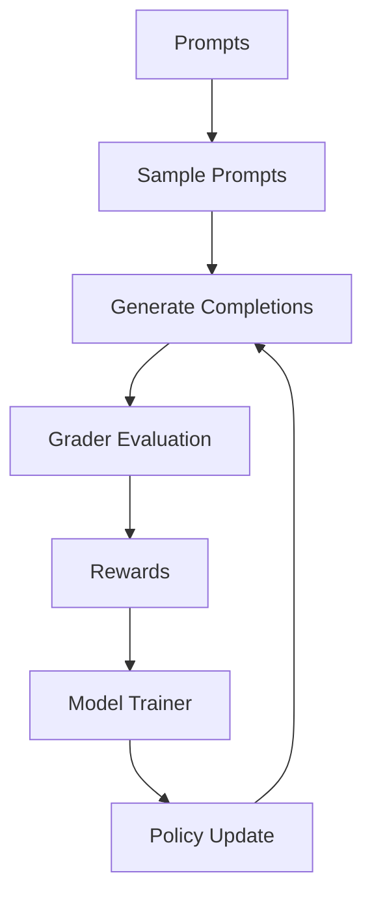
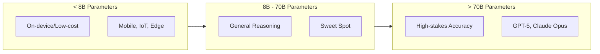
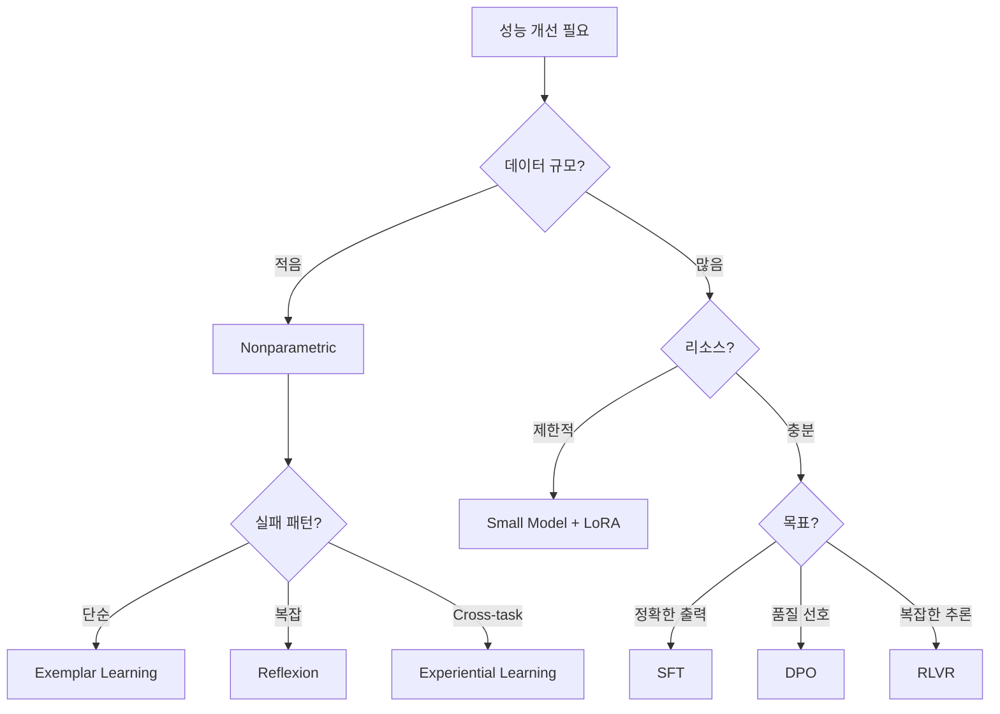

# Chapter 7: Learning in Agentic Systems

## 핵심 요약

Agent 시스템에 학습 능력을 추가하면 시간이 지남에 따라 성능이 자동으로 개선된다. 학습 방식은 크게 두 가지로 나뉜다:
- **Nonparametric Learning**: 모델 파라미터 변경 없이 경험으로부터 학습
- **Parametric Learning**: 모델 가중치를 직접 fine-tuning하여 학습

학습 기능 구현은 추가적인 설계, 평가, 모니터링이 필요하므로 모든 에이전트에 필수는 아니다. 애플리케이션 요구사항에 따라 투자 가치를 판단해야 한다.

---

## 학습 목표

이 챕터를 학습한 후 다음을 할 수 있어야 한다:

1. **Nonparametric vs Parametric Learning 구분**: 각 접근법의 특성과 적용 시나리오 이해
2. **Reflexion 패턴 구현**: 자기 비판을 통한 전략 개선 메커니즘 구축
3. **Experiential Learning 설계**: 인사이트 추출 및 동적 규칙 관리 시스템 구현
4. **Fine-tuning 기법 선택**: SFT, DPO, RLVR 중 적절한 방법 판단
5. **Small Model 활용 전략**: 리소스 효율적인 모델 선택 및 배포

---

## 본문 정리

### 1. Learning의 정의와 필요성

```
Learning = 환경과의 상호작용을 통해 Agentic System의 성능을 개선하는 과정
```

**학습이 제공하는 가치**:
- 변화하는 조건에 적응
- 전략을 지속적으로 개선
- 전반적인 효과성 향상

**투자 판단 기준**:
| 고려 요소 | 설명 |
|-----------|------|
| 설계 복잡도 | 추가적인 아키텍처 설계 필요 |
| 평가 비용 | 성능 측정 및 피드백 수집 비용 |
| 모니터링 부담 | 지속적인 품질 모니터링 필요 |
| ROI | 투자 대비 성능 개선 효과 |

---

### 2. Nonparametric Learning

모델 파라미터를 변경하지 않고 성능을 개선하는 기법들.

#### 2.1 Exemplar Learning (예제 기반 학습)

가장 단순한 형태의 학습. 성공적인 실행 예제를 저장하고 few-shot learning에 활용.



**Fixed vs Dynamic Example Selection**:

| 방식 | 장점 | 단점 |
|------|------|------|
| Fixed | 단순함, 일관성 | 비용 증가, 관련성 부족 |
| Dynamic | 상황별 최적화, 확장성 | 복잡성, 검색 오버헤드 |

**구현 패턴**:
```python
# Case-Based Reasoning 패턴
class ExperienceBank:
    def __init__(self):
        self.cases = []  # (problem, solution, outcome)

    def store_case(self, problem, solution, outcome):
        self.cases.append({
            "problem": problem,
            "solution": solution,
            "outcome": outcome
        })

    def retrieve_similar(self, new_problem, top_k=3):
        # 유사도 기반 검색 (text/semantic retrieval)
        return sorted(
            self.cases,
            key=lambda c: similarity(c["problem"], new_problem),
            reverse=True
        )[:top_k]

    def adapt_solution(self, similar_cases, new_problem):
        # 과거 솔루션을 새 상황에 맞게 조정
        return adapted_solution
```

#### 2.2 Reflexion (자기 성찰 학습)

실패 후 자기 비판을 통해 전략을 개선하는 패턴.



**Reflexion Loop 단계**:
1. **Action Sequence 수행**: 일반적인 prompt-driven planning
2. **Trial 로깅**: 모든 단계를 persistent storage에 기록
3. **Reflection 생성**: 실패 시 "무엇이 잘못되었는가?" 분석
4. **Memory 업데이트**: 새로운 reflection을 memory structure에 저장
5. **Reflection 주입**: 다음 시도 시 이전 reflections를 prompt에 포함

**Reflexion Prompt 템플릿**:
```python
reflexion_prompt = f"""You will be given the history of a past experience in
which you were placed in an environment and given a task to complete. You
were unsuccessful in completing the task. Do not summarize your environment,
but rather think about the strategy and path you took to attempt to complete
the task. Devise a concise, new plan of action that accounts for your mistake
with reference to specific actions that you should have taken.

Instruction:
{original_task}

{action_observation_transcript}

STATUS: FAIL

Plan:
"""
```

**핵심 구현 코드**:
```python
from langgraph.graph import StateGraph, MessagesState, START
from langchain_openai import ChatOpenAI
from langchain_core.messages import HumanMessage

llm = ChatOpenAI(model="gpt-4")
reflections = []

def call_model(state: MessagesState):
    response = llm.invoke(state["messages"])
    return {"messages": response}

def _generate_reflection_query(trial_log: str, recent_reflections: List[str]):
    history = "\n\n".join(recent_reflections)
    return f'''{history}
        {trial_log}
        Based on the above, what plan would you follow next? Plan:'''

def update_memory(trial_log_path: str, env_configs: List[Dict[str, Any]]):
    with open(trial_log_path, 'r') as f:
        full_log = f.read()

    env_logs = full_log.split('#####\n\n#####')
    for i, env in enumerate(env_configs):
        if not env['is_success'] and not env['skip']:
            memory = env['memory'][-3:] if len(env['memory']) > 3 else env['memory']
            reflection_query = _generate_reflection_query(env_logs[i], memory)
            reflection = get_completion(reflection_query)
            env_configs[i]['memory'] += [reflection]

# LangGraph 구성
builder = StateGraph(MessagesState)
builder.add_node("reflexion", call_model)
builder.add_edge(START, "reflexion")
graph = builder.compile()
```

**Reflexion의 장점**:
- 모델 가중치 변경 불필요
- 수치적 피드백과 자유형 코멘트 모두 수용
- 코드 디버깅부터 복잡한 추론까지 다양한 태스크에 적용 가능

#### 2.3 Experiential Learning (경험적 학습)

Reflexion을 확장하여 cross-task learning을 가능하게 함.



**Insight 관리 연산자**:
| 연산자 | 설명 | 형식 |
|--------|------|------|
| AGREE | 기존 규칙이 강하게 관련됨 | `AGREE <번호>: <규칙>` |
| REMOVE | 모순되거나 중복된 규칙 제거 | `REMOVE <번호>: <규칙>` |
| EDIT | 일반화되지 않은 규칙 수정 | `EDIT <번호>: <새 규칙>` |
| ADD | 새로운 고유 규칙 추가 | `ADD <번호>: <새 규칙>` |

**InsightAgent 구현**:
```python
class InsightAgent:
    def __init__(self):
        self.insights = []
        self.promoted_insights = []
        self.demoted_insights = []
        self.reflections = []

    def generate_insight(self, observation):
        messages = [HumanMessage(content=f'''Generate an insightful analysis
            based on the following observation: '{observation}'''')]

        builder = StateGraph(MessagesState)
        builder.add_node("generate_insight", call_model)
        builder.add_edge(START, "generate_insight")
        graph = builder.compile()

        result = graph.invoke({"messages": messages})
        generated_insight = result["messages"][-1].content
        self.insights.append(generated_insight)
        return generated_insight

    def promote_insight(self, insight):
        if insight in self.insights:
            self.insights.remove(insight)
            self.promoted_insights.append(insight)

    def demote_insight(self, insight):
        if insight in self.promoted_insights:
            self.promoted_insights.remove(insight)
            self.demoted_insights.append(insight)

    def edit_insight(self, old_insight, new_insight):
        for lst in [self.insights, self.promoted_insights, self.demoted_insights]:
            if old_insight in lst:
                lst[lst.index(old_insight)] = new_insight
                return

    def reflect(self, reflexion_prompt):
        # LangGraph를 통한 reflection 생성
        ...
```

**사용 예시**:
```python
agent = InsightAgent()

reports = [
    ("Website traffic rose by 15%, but bounce rate jumped from 40% to 55%.", False),
    ("Email open rates improved to 25%, exceeding our 20% goal.", True),
    ("Cart abandonment increased from 60% to 68%, missing the 50% target.", False),
]

for text, hit_target in reports:
    insight = agent.generate_insight(text)
    if hit_target:
        agent.promote_insight(insight)
    else:
        agent.demote_insight(insight)

# 인사이트 정제
if agent.promoted_insights:
    original = agent.promoted_insights[0]
    agent.edit_insight(original, f"Refined: {original} - Investigate landing-page UX")

# 전략 반영
agent.reflect(f"Based on our promoted insights, suggest one high-impact experiment: {agent.promoted_insights}")
```

**Experiential Learning의 장점**:
- Cross-task learning 가능
- 비정상 환경(nonstationary environments)에 점진적 적응
- 인사이트의 동적 관리 (승급/강등/수정/제거)

---

### 3. Parametric Learning: Fine-Tuning

모델 파라미터를 직접 조정하여 특정 태스크 성능을 개선.

#### 3.1 Fine-Tuning 결정 기준



**Fine-tuning이 적합한 경우**:
| 시나리오 | 설명 |
|----------|------|
| 도메인 특화 필수 | 조직 전문용어, 스타일 가이드, 민감한 콘텐츠 |
| 일관된 톤/포맷 | 금융 공시, 법적 면책조항 등 정확한 템플릿 |
| 정밀한 Tool/API 호출 | 의료 용량, 거래 API 등 오류 허용 불가 |
| 충분한 데이터 & 예산 | 수백~수천 개의 큐레이션된 예제 확보 |
| 관리 가능한 재학습 주기 | 버전 관리, 재학습 스케줄 유지 가능 |

**Fine-tuning을 피해야 할 경우**:
- 빠른 프로토타이핑 또는 저용량 사용
- 모델 진화로 인해 노력이 무효화될 수 있음
- 리소스 제약 (GPU, 어노테이션 비용, 추론 속도)

#### 3.2 Fine-Tuning 방법 비교

| 방법 | 작동 방식 | 적합한 용도 |
|------|-----------|-------------|
| **SFT** | (prompt, ideal-response) 쌍으로 학습 | 분류, 구조화된 출력, 지시 실패 수정 |
| **Vision Fine-tuning** | image-label 쌍으로 시각 입력 학습 | 이미지 분류, 멀티모달 지시 강건성 |
| **DPO** | "good" vs "bad" 응답 쌍으로 선호도 학습 | 요약 품질, 톤/스타일 제어 |
| **RLVR** | expert grader 점수로 정책 최적화 | 복잡한 추론, 도메인 특화 (법률, 의료) |

#### 3.3 Supervised Fine-Tuning (SFT)



**Function Calling Fine-tuning 예제**:
```python
def build_preprocess_fn(tokenizer):
    """Raw samples를 tokenized prompts로 변환"""
    def _preprocess(sample):
        messages = sample["messages"].copy()
        _merge_system_into_first_user(messages)
        prompt = tokenizer.apply_chat_template(messages, tokenize=False)
        return {"text": prompt}
    return _preprocess

def build_tokenizer(model_name: str):
    tokenizer = AutoTokenizer.from_pretrained(
        model_name,
        pad_token=ChatmlSpecialTokens.pad_token.value,
        additional_special_tokens=ChatmlSpecialTokens.list(),
    )
    tokenizer.chat_template = CHAT_TEMPLATE
    return tokenizer

def build_model(model_name: str, tokenizer, load_4bit: bool = False):
    kwargs = {
        "attn_implementation": "eager",
        "device_map": "auto",
    }
    kwargs["quantization_config"] = BitsAndBytesConfig(
        load_in_4bit=True,
        bnb_4bit_compute_dtype=torch.bfloat16,
        bnb_4bit_quant_type="nf4",
        bnb_4bit_use_double_quant=True,
    )
    model = AutoModelForCausalLM.from_pretrained(model_name, **kwargs)
    model.resize_token_embeddings(len(tokenizer))
    return model
```

**SFT Training 설정**:
```python
def train(model, tokenizer, dataset, peft_cfg, output_dir,
          epochs=1, lr=1e-4, batch_size=1, grad_accum=4, max_seq_len=1500):

    train_args = SFTConfig(
        output_dir=output_dir,
        per_device_train_batch_size=batch_size,
        gradient_accumulation_steps=grad_accum,
        learning_rate=lr,
        num_train_epochs=epochs,
        max_grad_norm=1.0,
        warmup_ratio=0.1,
        lr_scheduler_type="cosine",
        bf16=True,
        gradient_checkpointing=True,
        packing=True,
        max_seq_length=max_seq_len,
    )

    trainer = SFTTrainer(
        model=model,
        args=train_args,
        train_dataset=dataset["train"],
        eval_dataset=dataset["test"],
        processing_class=tokenizer,
        peft_config=peft_cfg,
    )

    trainer.train()
    trainer.save_model()
    return trainer
```

**Special Tokens 활용**:
```
<think>...</think>  → 모델의 내부 추론
<tool_call>...</tool_call>  → API 호출 액션
```

#### 3.4 Direct Preference Optimization (DPO)



**DPO 구현 예제**:
```python
import torch
from datasets import load_dataset
from transformers import AutoTokenizer, AutoModelForCausalLM, BitsAndBytesConfig
from peft import LoraConfig, get_peft_model
from trl import DPOConfig, DPOTrainer

BASE_SFT_CKPT = "microsoft/Phi-3-mini-4k-instruct"
DPO_DATA = "training_data/dpo_it_help_desk_training_data.jsonl"
OUTPUT_DIR = "phi3-mini-helpdesk-dpo"

# Model + Tokenizer
tok = AutoTokenizer.from_pretrained(BASE_SFT_CKPT, padding_side="right")

bnb_config = BitsAndBytesConfig(
    load_in_4bit=True,
    bnb_4bit_use_double_quant=True,
    bnb_4bit_compute_dtype=torch.bfloat16
)

base = AutoModelForCausalLM.from_pretrained(
    BASE_SFT_CKPT,
    device_map="auto",
    torch_dtype=torch.bfloat16,
    quantization_config=bnb_config
)

lora_cfg = LoraConfig(
    r=8,
    lora_alpha=16,
    lora_dropout=0.05,
    target_modules=["q_proj", "k_proj", "v_proj", "o_proj",
                    "gate_proj", "up_proj", "down_proj"],
    bias="none",
    task_type="CAUSAL_LM",
)
model = get_peft_model(base, lora_cfg)

# Dataset: {"prompt": ..., "chosen": ..., "rejected": ...}
dataset = load_dataset("json", data_files=DPO_DATA, split="train")

# DPO Configuration
dpo_args = DPOConfig(
    output_dir=OUTPUT_DIR,
    per_device_train_batch_size=4,
    gradient_accumulation_steps=4,
    learning_rate=5e-6,
    num_train_epochs=3.0,
    bf16=True,
    beta=0.1,  # 선호도 강도 조절
    loss_type="sigmoid",
    max_prompt_length=4096,
    max_completion_length=4096,
    reference_free=True,
)

trainer = DPOTrainer(model, ref_model=None, args=dpo_args, train_dataset=dataset)
trainer.train()
trainer.save_model()
```

**DPO의 특징**:
- 단순 복제가 아닌 선호도 판단 학습
- 추론 시 고품질 완성물 선택 능력 향상
- SFT에 선호도 학습 차원 추가

#### 3.5 Reinforcement Learning with Verifiable Rewards (RLVR)



**RLVR의 특징**:
- 측정 가능한 모든 신호에 대해 최적화 가능
- 관찰된 예제를 넘어 일반화 (value prediction)
- 자동화된 grading 또는 scalable human evaluation에 적합

**적용 가능 영역**:
- 요약 품질
- Tool call 정확성
- Knowledge retrieval 사실성
- Safety constraint 준수

---

### 4. Small Models의 가능성

#### 4.1 Small Model의 장점

| 장점 | 설명 |
|------|------|
| **리소스 효율성** | 낮은 GPU 요구사항, 빠른 추론 |
| **해석 가능성** | 적은 레이어로 의사결정 과정 분석 용이 |
| **Agile 개발** | 빠른 iteration, 잦은 업데이트 |
| **접근성** | 오픈소스 (Llama, Phi), 낮은 비용 |
| **지속가능성** | 적은 에너지 소비, 친환경 AI |

#### 4.2 Model Size별 Trade-off



#### 4.3 Benchmark 리소스

최신 모델 성능을 추적하기 위한 리더보드:

| 리소스 | 설명 |
|--------|------|
| **Stanford HELM** | MMLU, GPQA, IFEval 등 라이브 점수 |
| **Papers With Code** | 벤치마크 집계, 다운로드 가능한 artifacts |
| **Hugging Face Evaluation** | GSM8K, HumanEval 등 API 제공 |
| **BigBench Leaderboard** | BBH suite 성능 추적 |

**2025년 초 벤치마크 현황**:
- DeepSeek-v3, Llama 3.1 Instruct Turbo (70B): MMLU 66%+
- Gemini 2.0 Flash-Lite (8B): MMLU 64%
- Phi-3-mini (3.8B): PaLM 540B와 동등한 60% MMLU (142× 크기 감소)

---

### 5. 학습 방법 선택 가이드



**의사결정 체크리스트**:

| 질문 | Yes → | No → |
|------|-------|------|
| 예제 수가 1000개 미만? | Nonparametric | Fine-tuning 고려 |
| 실시간 적응 필요? | Nonparametric | Fine-tuning |
| 도메인 특화 필수? | Fine-tuning | Prompt Engineering |
| GPU 리소스 제한? | Small Model + LoRA | Large Model |
| 잦은 재학습 예상? | Nonparametric | Fine-tuning |

---

## 심화 학습

### Reflexion vs Experiential Learning 상세 비교

| 측면 | Reflexion | Experiential Learning |
|------|-----------|----------------------|
| 범위 | 단일 태스크 내 개선 | Cross-task 학습 |
| 메모리 구조 | Linear memory buffer | Hierarchical insight bank |
| 인사이트 관리 | 순차적 축적 | 동적 승급/강등/수정 |
| 환경 적응 | 제한적 | Nonstationary 환경 적응 |
| 구현 복잡도 | 낮음 | 중간 |

### LoRA (Low-Rank Adaptation) 개요

```python
lora_cfg = LoraConfig(
    r=8,                    # Rank (낮을수록 효율적)
    lora_alpha=16,          # Scaling factor
    lora_dropout=0.05,      # Regularization
    target_modules=[        # 적용할 모듈
        "q_proj", "k_proj", "v_proj", "o_proj",
        "gate_proj", "up_proj", "down_proj"
    ],
    bias="none",
    task_type="CAUSAL_LM",
)
```

**LoRA의 장점**:
- 전체 파라미터의 일부만 학습 → 메모리 효율
- 기존 지식 유지하면서 특화
- 빠른 학습 및 배포

---

## 실무 적용 포인트

### 1. 단계별 적용 전략

```
Phase 1: Prompt Engineering
    ↓ (성능 부족 시)
Phase 2: Nonparametric Learning (Exemplar → Reflexion → ExpeL)
    ↓ (데이터 충분 & 리소스 확보 시)
Phase 3: Fine-tuning (SFT → DPO → RLVR)
```

### 2. Reflexion 실무 구현 팁

```python
# Memory buffer 크기 제한
MAX_REFLECTIONS = 3

def get_recent_reflections(memory, max_count=MAX_REFLECTIONS):
    return memory[-max_count:] if len(memory) > max_count else memory

# Reflection 품질 검증
def validate_reflection(reflection):
    required_elements = ["what went wrong", "next steps", "specific actions"]
    return all(elem.lower() in reflection.lower() for elem in required_elements)
```

### 3. Fine-tuning 비용 최적화

| 최적화 기법 | 효과 |
|-------------|------|
| LoRA/QLoRA | 메모리 10-20% 사용 |
| 4-bit Quantization | 추가 메모리 절감 |
| Gradient Checkpointing | 메모리-속도 트레이드오프 |
| Packing | 배치 효율성 향상 |

### 4. 모니터링 지표

```python
learning_metrics = {
    # Nonparametric
    "exemplar_hit_rate": "검색된 예제의 성공률",
    "reflection_improvement": "reflection 후 성공률 변화",
    "insight_promotion_rate": "승급된 인사이트 비율",

    # Parametric
    "validation_loss": "검증 세트 손실",
    "task_accuracy": "태스크별 정확도",
    "latency_change": "추론 지연 시간 변화",
}
```

---

## 핵심 개념 체크리스트

### Nonparametric Learning
- [ ] Exemplar Learning의 Fixed vs Dynamic 방식 구분
- [ ] Reflexion loop의 5단계 이해
- [ ] Experiential Learning의 AGREE/REMOVE/EDIT/ADD 연산자
- [ ] Memory buffer 관리 전략

### Parametric Learning
- [ ] Fine-tuning 결정 기준 (도메인, 데이터, 리소스)
- [ ] SFT, DPO, RLVR의 차이점과 적용 시나리오
- [ ] LoRA adapter 개념과 설정
- [ ] Special tokens (`<think>`, `<tool_call>`) 활용

### Small Models
- [ ] Large vs Small model의 trade-off
- [ ] 오픈소스 모델 활용 (Llama, Phi, DeepSeek)
- [ ] 벤치마크 리더보드 활용법

### 통합 전략
- [ ] Nonparametric → Parametric 전환 시점 판단
- [ ] 비용-성능 최적화 전략
- [ ] 지속적 학습 파이프라인 설계

---

## 참고 자료

### 논문
- **Reflexion**: "Reflexion: Language Agents with Verbal Reinforcement Learning" (Shinn et al., 2023)
- **ExpeL**: "ExpeL: LLM Agents Are Experiential Learners" (Zhao et al., 2024)
- **DPO**: "Direct Preference Optimization: Your Language Model is Secretly a Reward Model" (Rafailov et al., 2023)
- **LoRA**: "LoRA: Low-Rank Adaptation of Large Language Models" (Hu et al., 2021)

### 라이브러리
- **TRL (Transformer Reinforcement Learning)**: Hugging Face의 RLHF 라이브러리
- **PEFT**: Parameter-Efficient Fine-Tuning 라이브러리
- **LangGraph**: Agent workflow orchestration

### 벤치마크
- [Stanford HELM](https://crfm.stanford.edu/helm/)
- [Papers With Code](https://paperswithcode.com/)
- [Hugging Face Evaluation](https://huggingface.co/docs/evaluate/)
- [BigBench](https://github.com/google/BIG-bench)

### 다음 챕터 예고
> **Chapter 8**: 실제 프로덕션 환경에서 Agent 시스템을 배포하고 운영하는 방법을 다룬다.
