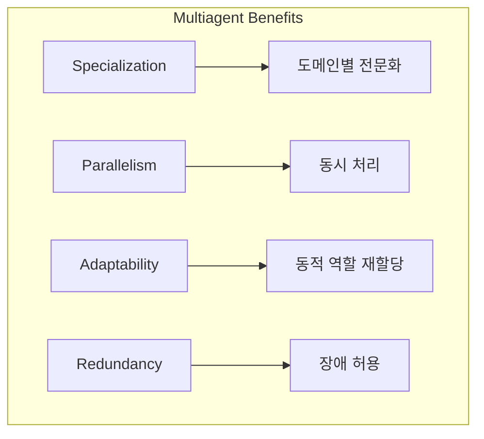
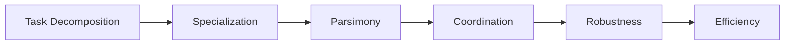
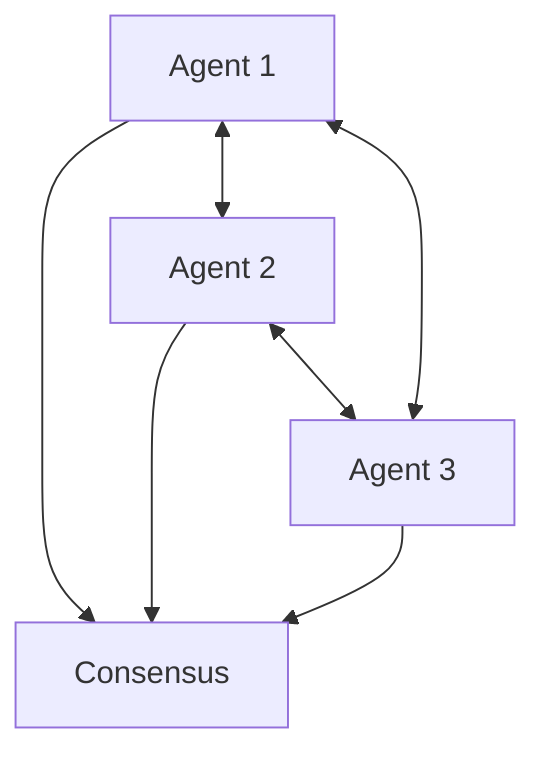
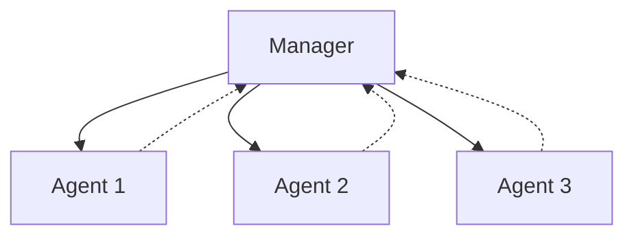
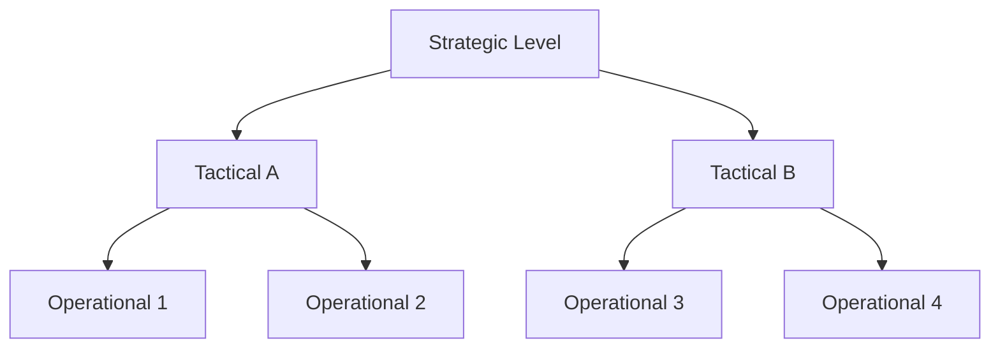
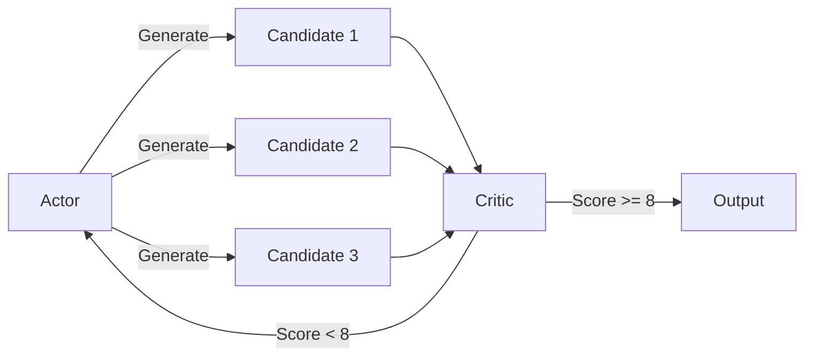
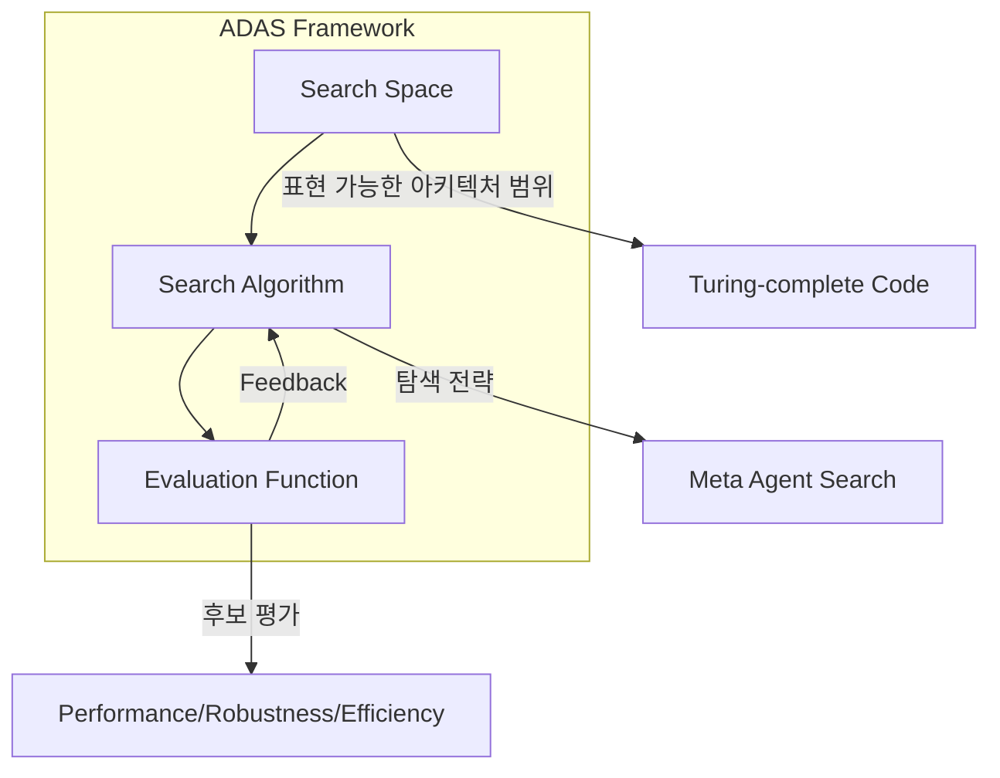
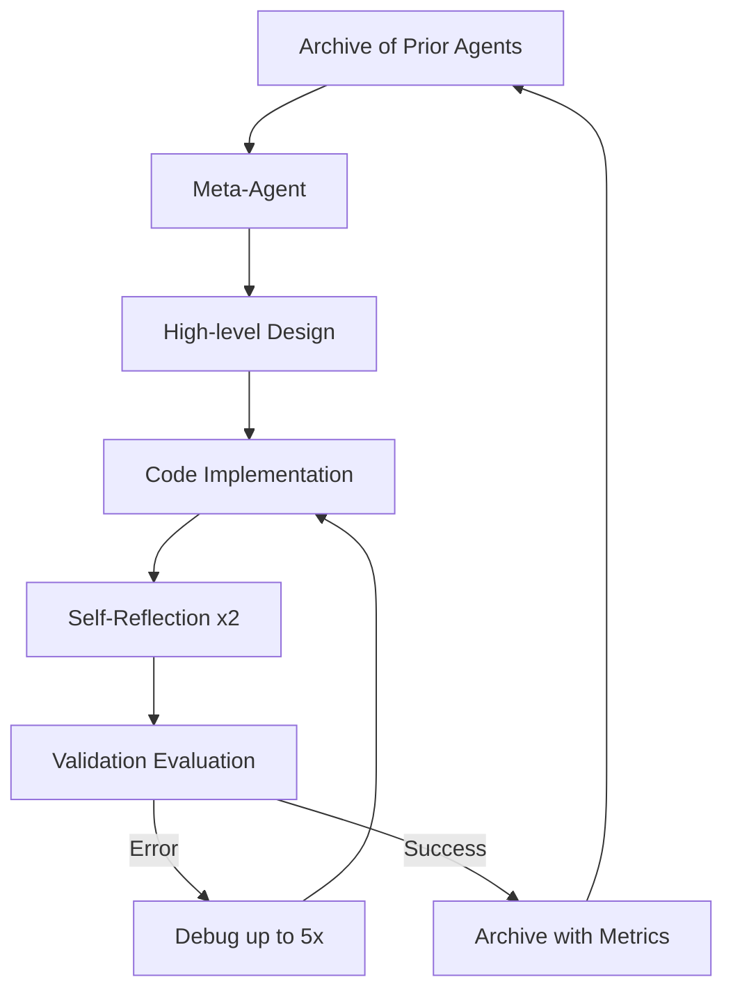
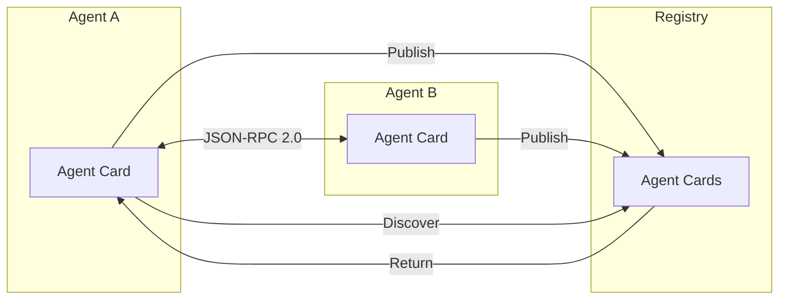
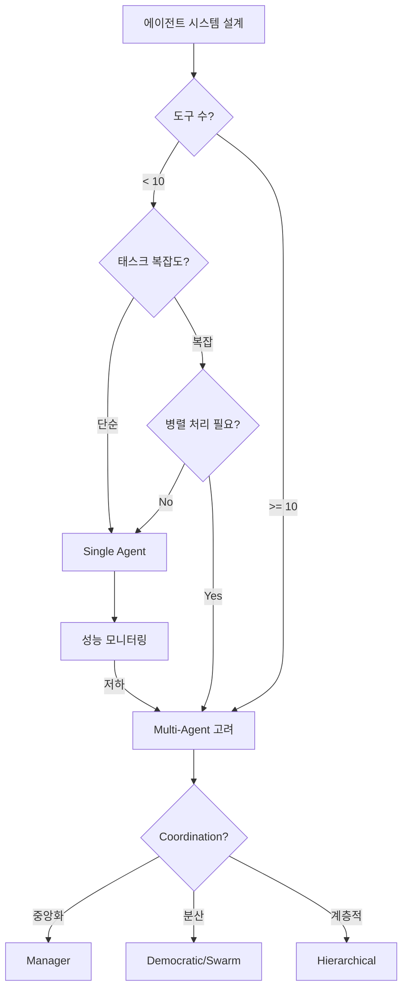

# Chapter 8: From One Agent to Many

## 핵심 요약

대부분의 에이전트 시스템은 단일 에이전트로 시작하지만, 도구 수 증가와 문제 범위 확장에 따라 멀티에이전트 패턴이 성능과 신뢰성을 향상시킬 수 있다. 소프트웨어 아키텍처의 원칙(모놀리스 분해, 관심사 분리)이 AI 에이전트 시스템에도 동일하게 적용된다. 시스템이 확장됨에 따라 독립적으로 검증, 테스트, 통합, 재사용할 수 있는 작은 에이전트로 분해해야 한다.

---

## 학습 목표

이 챕터를 학습한 후 다음을 할 수 있어야 한다:

1. **Single vs Multi Agent 판단**: 적절한 에이전트 수와 구성 결정
2. **Coordination 전략 선택**: Democratic, Manager, Hierarchical, Actor-Critic 비교
3. **ADAS 이해**: Meta Agent Search를 통한 자동화된 에이전트 설계
4. **통신 아키텍처 설계**: A2A Protocol, Message Broker, Actor Framework 활용
5. **상태 관리 전략**: 분산 시스템에서의 지속성과 복구

---

## 본문 정리

### 1. 에이전트 수 결정 (How Many Agents?)

```
원칙: 단순하게 시작하고, 성능 향상이 필요할 때만 복잡성 추가
```

#### 1.1 Single-Agent 시나리오

**적합한 경우**:
| 조건 | 설명 |
|------|------|
| 중간 난이도 태스크 | 복잡하지 않은 단일 도메인 작업 |
| 제한된 도구 수 | 10개 미만의 도구 집합 |
| 낮은 환경 복잡도 | 단순한 상호작용 패턴 |
| 지연 시간 중요 | 빠른 응답이 필수인 경우 |

**장점**:
- **Simplicity**: 구현 및 관리 용이
- **Lower resource**: 계산 오버헤드 감소
- **Latency**: 사용자에게 빠른 응답

**Single Agent 예제 (Supply Chain)**:
```python
from langchain.tools import tool
from langgraph.graph import StateGraph, END

# 16개 도구 정의
@tool
def manage_inventory(sku: str = None, **kwargs) -> str:
    """Manage inventory levels, stock replenishment, audits."""
    return "inventory_management_initiated"

@tool
def track_shipments(origin: str = None, **kwargs) -> str:
    """Track shipment status, delays, and coordinate delivery."""
    return "shipment_tracking_updated"

@tool
def forecast_demand(season: str = None, **kwargs) -> str:
    """Analyze demand patterns and create forecasting models."""
    return "demand_forecast_generated"

# ... 13개 추가 도구

TOOLS = [manage_inventory, track_shipments, forecast_demand, ...]

llm = ChatOpenAI(model="gpt-4o", temperature=0.0).bind_tools(TOOLS)

class AgentState(TypedDict):
    operation: Optional[dict]
    messages: Annotated[Sequence[BaseMessage], operator.add]

def call_model(state: AgentState):
    system_prompt = """You are a Supply Chain & Logistics professional.
    Your expertise covers:
    - Inventory management and demand forecasting
    - Transportation and shipping optimization
    - Supplier relationship management
    ..."""

    full = [SystemMessage(content=system_prompt)] + state["messages"]
    response = llm.invoke(full)
    # Tool call 처리
    ...
    return {"messages": messages}

def construct_graph():
    g = StateGraph(AgentState)
    g.add_node("assistant", call_model)
    g.set_entry_point("assistant")
    return g.compile()
```

**한계**: 도구 수가 증가하면 선택 정확도 저하

#### 1.2 Multi-Agent 시나리오

**적합한 경우**:
- 복잡한 태스크와 다양한 도구셋 필요
- 병렬 처리 요구
- 동적 환경 적응 필요

**핵심 장점**:



**Multi-Agent 예제 (Supply Chain 분해)**:

```python
# 도구를 3개 전문 에이전트로 분해
INVENTORY_TOOLS = [manage_inventory, optimize_warehouse, forecast_demand,
                   manage_quality, scale_operations, optimize_costs,
                   send_logistics_response]

TRANSPORTATION_TOOLS = [track_shipments, arrange_shipping,
                        coordinate_operations, manage_special_handling,
                        process_returns, optimize_delivery,
                        manage_disruption, send_logistics_response]

SUPPLIER_TOOLS = [evaluate_suppliers, handle_compliance,
                  send_logistics_response]

# 전문 LLM 바인딩
inventory_llm = llm.bind_tools(INVENTORY_TOOLS)
transportation_llm = llm.bind_tools(TRANSPORTATION_TOOLS)
supplier_llm = llm.bind_tools(SUPPLIER_TOOLS)

# Supervisor Node: 적절한 전문가에게 라우팅
def supervisor_node(state: AgentState):
    supervisor_prompt = """You are a supervisor coordinating specialists.
    Team members:
    - inventory: Handles inventory, forecasting, warehouse, costs
    - transportation: Handles shipping, delivery, disruptions
    - supplier: Handles supplier evaluation and compliance

    Select ONE team member. Output ONLY the name."""

    response = llm.invoke([SystemMessage(content=supervisor_prompt)]
                          + state["messages"])
    return {"messages": [response]}

# Specialist Node Template
def specialist_node(state, specialist_llm, system_prompt):
    full = [SystemMessage(content=system_prompt)] + state["messages"]
    response = specialist_llm.invoke(full)
    # Tool 호출 처리...
    return {"messages": messages}

# Graph 구성
def construct_graph():
    g = StateGraph(AgentState)
    g.add_node("supervisor", supervisor_node)
    g.add_node("inventory", inventory_node)
    g.add_node("transportation", transportation_node)
    g.add_node("supplier", supplier_node)

    g.set_entry_point("supervisor")
    g.add_conditional_edges("supervisor", route_to_specialist,
        {"inventory": "inventory",
         "transportation": "transportation",
         "supplier": "supplier"})

    g.add_edge("inventory", END)
    g.add_edge("transportation", END)
    g.add_edge("supplier", END)

    return g.compile()
```

#### 1.3 Swarms (스웜)

자연의 분산 시스템(새 떼, 물고기 무리, 개미 군집)에서 영감을 받은 접근법.

**특징**:
| 특징 | 설명 |
|------|------|
| Decentralization | 중앙 제어 없이 자기 조직화 |
| Local Interactions | 간단한 로컬 규칙으로 복잡한 행동 창발 |
| Scalability | 수백~수천 에이전트로 확장 가능 |
| Robustness | 단일 실패 지점 없음 |

**적합한 시나리오**:
- 대규모 데이터 탐색
- 다중 소스 리서치
- 분산 의사결정
- 엣지 컴퓨팅, 센서 네트워크

---

### 2. 에이전트 추가 원칙



| 원칙 | 설명 |
|------|------|
| **Task Decomposition** | 복잡한 태스크를 관리 가능한 하위 태스크로 분해 |
| **Specialization** | 각 에이전트에 강점에 맞는 역할 할당 |
| **Parsimony** | 필요한 최소 에이전트만 추가 (복잡성 최소화) |
| **Coordination** | 효율적 정보 공유와 충돌 해결 메커니즘 |
| **Robustness** | 장애 허용을 위한 중복성 내장 |
| **Efficiency** | 에이전트 추가의 비용-편익 분석 |

---

### 3. Multiagent Coordination 전략

#### 3.1 Democratic Coordination



**특징**:
- 모든 에이전트에 동등한 의사결정 권한
- 분산 제어, 단일 리더 없음
- 합의 기반 의사결정

**장점**: 견고성 (단일 실패 지점 없음), 유연성, 공정성
**단점**: 통신 오버헤드, 느린 의사결정, 구현 복잡성

**적합**: 분산 센서 네트워크, 협력 로봇

#### 3.2 Manager Coordination



**특징**:
- 중앙화된 관리자 에이전트
- 관리자가 태스크 분배, 충돌 해결
- 간소화된 통신 경로

**장점**: 효율적 의사결정, 명확한 책임 할당
**단점**: 단일 실패 지점, 확장성 제한, 적응성 감소

**적합**: 제조 시스템, 고객 지원 센터

#### 3.3 Hierarchical Coordination



**특징**:
- 다중 계층 조직
- 상위 레벨: 전략적 결정
- 하위 레벨: 전술적 실행

**장점**: 확장성, 중복성, 명확한 권한 라인
**단점**: 설계 복잡성, 통신 지연

**적합**: 공급망 관리, 군사 작전

#### 3.4 Actor-Critic Approaches



**특징**:
- Actor: 후보 출력 생성
- Critic: 품질 게이트로 수락/거부
- 반복적 개선 (test-time compute)

**구현 예제**:
```python
def actor_node(state: AgentState):
    actor_prompt = '''Generate 3 candidate supply chain plans
        as JSON list: [{'plan': 'description', 'tools': [...]}]'''
    response = llm.invoke([SystemMessage(content=actor_prompt)]
                          + state["messages"])
    state["candidates"] = json.loads(response.content)
    return state

def critic_node(state: AgentState):
    candidates = state["candidates"]
    critic_prompt = f'''Score candidates {candidates} on scale 1-10
        for feasibility, cost, risk.
        Select best if > 8, else request regeneration.'''
    response = llm.invoke([SystemMessage(content=critic_prompt)]
                          + state["messages"])
    eval = json.loads(response.content)

    if eval['best_score'] > 8:
        # Execute winning plan
        return {"messages": history + execution_messages}
    else:
        # Iterate with feedback
        return {"messages": history +
                [AIMessage(content="Regenerate: " + eval['feedback'])]}

def construct_actor_critic_graph():
    g = StateGraph(AgentState)
    g.add_node("actor", actor_node)
    g.add_node("critic", critic_node)

    g.set_entry_point("actor")
    g.add_edge("actor", "critic")
    g.add_conditional_edges("critic",
        lambda s: "actor" if "regenerate" in s["messages"][-1].content.lower()
                  else END)

    return g.compile()
```

**적합한 경우**:
- 명확한 평가 루브릭/체크리스트 존재
- 추가 생성 비용이 품질 향상 대비 수용 가능
- 생성 태스크에서 단일 시도가 자주 부족

---

### 4. ADAS (Automated Design of Agentic Systems)

#### 4.1 개요

수동 설계에서 자동화된 자기 설계/평가/개선 시스템으로의 전환.



**핵심 아이디어**:
- Meta Agent가 자동으로 에이전트 시스템 설계
- 코드 기반 에이전트 정의 (Turing-complete)
- 진화적 개선 프로세스

#### 4.2 Meta Agent Search (MAS) 알고리즘



**MAS 구현**:
```python
class LLMAgentBase:
    def __init__(self, output_fields: list, agent_name: str,
                 role='helpful assistant', model='gpt-4o', temperature=0.5):
        self.output_fields = output_fields
        self.agent_name = agent_name
        self.role = role
        self.model = model
        self.temperature = temperature
        self.id = random_id()

    def generate_prompt(self, input_infos, instruction, output_description):
        system_prompt = f"You are a {self.role}.\n\n" + \
                        FORMAT_INST(output_description)
        prompt = ''  # Build from inputs + instruction
        return system_prompt, prompt

    def query(self, input_infos: list, instruction, output_description,
              iteration_idx=-1):
        system_prompt, prompt = self.generate_prompt(...)
        response_json = get_json_response_from_gpt(prompt, self.model,
                                                    system_prompt)
        output_infos = [Info(key, self.__repr__(), value, iteration_idx)
                        for key, value in response_json.items()]
        return output_infos
```

**Search Loop**:
```python
def search(args, task):
    archive = task.get_init_archive()

    for n in range(args.n_generation):
        # Generate from archive
        msg_list = [{"role": "system", "content": system_prompt},
                    {"role": "user", "content": prompt}]
        next_solution = get_json_response_from_gpt_reflect(msg_list, args.model)

        # Reflexion refinement
        next_solution = reflect_and_refine(msg_list,
                                           task.get_reflexion_prompt())

        # Evaluate and debug
        acc_list = evaluate_forward_fn(args, next_solution["code"], task)
        next_solution['fitness'] = bootstrap_confidence_interval(acc_list)
        archive.append(next_solution)

def evaluate_forward_fn(args, forward_str, task):
    exec(forward_str, globals(), namespace)
    func = namespace['forward']
    data = task.load_data(SEARCHING_MODE)
    task_queue = task.prepare_task_queue(data)

    with ThreadPoolExecutor() as executor:
        acc_list = list(executor.map(process_item, task_queue))
    return acc_list
```

#### 4.3 MAS 결과

| Benchmark | MAS 성능 | 비교 대상 | 개선 |
|-----------|----------|-----------|------|
| ARC | Best | CoT, Self-Refine | 상회 |
| DROP (F1) | 79.4 ± 0.8 | Role Assignment | +13.6 |
| MGSM | 53.4% ± 3.5 | LLM-Debate | +14.4% |
| MMLU | 69.6% ± 3.2 | OPRO | +2% |
| GPQA | 34.6% ± 3.2 | OPRO | +1.7% |

**핵심 발견**: Cross-domain transfer 강건함 (ARC → MMLU), 모델 전환 시에도 성능 유지 (GPT-3.5 → GPT-4)

---

### 5. Communication Techniques

#### 5.1 Local vs Distributed Communication

| 환경 | 방식 | 특징 |
|------|------|------|
| Local | 직접 함수 호출, 공유 메모리 | 단순, 효율적 |
| Distributed | 명시적, 비동기, 장애 허용 | 확장 가능, 복잡 |

#### 5.2 A2A (Agent-to-Agent) Protocol

Google이 도입한 에이전트 간 표준화된 통신 프로토콜.



**Agent Card 예제**:
```python
agent_card = {
    "identity": "SummarizerAgent",
    "capabilities": ["summarizeText"],
    "schemas": {
        "summarizeText": {
            "input": {"text": "string"},
            "output": {"summary": "string"}
        }
    },
    "endpoint": "http://localhost:8000/api",
    "auth_methods": ["none"],  # OAuth2, API keys in production
    "version": "1.0"
}
```

**Client-side Discovery & Request**:
```python
import requests
import json

# Discover Agent Card
card_url = 'http://localhost:8000/.well-known/agent.json'
response = requests.get(card_url)
agent_card = response.json()

# Handshake
if agent_card['version'] != '1.0':
    raise ValueError("Incompatible version")
if "summarizeText" not in agent_card['capabilities']:
    raise ValueError("Capability not supported")

# JSON-RPC Request
rpc_request = {
    "jsonrpc": "2.0",
    "method": "summarizeText",
    "params": {"text": "Long text for summarization..."},
    "id": 123
}
response = requests.post(agent_card['endpoint'], json=rpc_request)
rpc_response = response.json()
```

**Server-side Handler**:
```python
from openai import OpenAI

# In do_POST handler
rpc_request = json.loads(post_data)

if rpc_request.get('jsonrpc') == '2.0' and \
   rpc_request['method'] == 'summarizeText':
    text = rpc_request['params']['text']

    # LLM Summarization
    client = OpenAI()
    llm_response = client.chat.completions.create(
        model="gpt-4o",
        messages=[
            {"role": "system", "content": "Provide concise summaries."},
            {"role": "user", "content": f"Summarize: {text}"}
        ],
        max_tokens=150
    )
    summary = llm_response.choices[0].message.content.strip()

    response = {
        "jsonrpc": "2.0",
        "result": {"summary": summary},
        "id": rpc_request['id']
    }
```

#### 5.3 Message Brokers & Event Buses

| 브로커 | 특징 | 적합한 용도 |
|--------|------|-------------|
| **Apache Kafka** | 고처리량, 내구성, 파티셔닝 | 로그 기반, 재생 가능한 이벤트 |
| **Redis Stream** | 저지연, 메모리 기반 | 프로토타이핑, 빠른 통신 |
| **NATS** | 경량, 실시간 | 마이크로서비스, 엣지 환경 |
| **RabbitMQ** | 낮은 처리량, 간단 배포 | 단순한 비동기 통신 |

**Redis Stream 예제**:
```python
import redis
import json
import uuid

# Supervisor publishes task
def supervisor_publish(operation: dict, messages):
    r = redis.Redis(host='localhost', port=6379)
    task_id = str(uuid.uuid4())
    task_message = {
        'task_id': task_id,
        'agent': agent_name,
        'operation': operation,
        'messages': serialize_messages(messages)
    }
    r.xadd('supply-chain-tasks', {'data': json.dumps(task_message)})
    return task_id

# Specialist consumer
def inventory_consumer():
    r = redis.Redis(host='localhost', port=6379)
    last_id = '0'

    while True:
        msgs = r.xread({'supply-chain-tasks': last_id}, count=1, block=5000)
        if msgs:
            stream, entries = msgs[0]
            for entry_id, entry_data in entries:
                task = json.loads(entry_data[b'data'])
                if task['agent'] == 'inventory':
                    # Process and respond
                    result = process_task(task)
                    r.xadd('supply-chain-responses',
                           {'data': json.dumps(result)})
                last_id = entry_id
```

#### 5.4 Actor Frameworks

| 프레임워크 | 언어 | 특징 |
|------------|------|------|
| **Ray** | Python | 분산 컴퓨팅, `@ray.remote` 데코레이터 |
| **Orleans** | .NET | Virtual Actor, 자동 생명주기 관리 |
| **Akka** | JVM | 고성능, 클러스터링, 샤딩 |

**Ray Actor 예제**:
```python
import ray

@ray.remote
class SpecialistActor:
    def __init__(self, name: str, specialist_llm, tools: list,
                 system_prompt: str):
        self.name = name
        self.llm = specialist_llm
        self.tools = {t.name: t for t in tools}
        self.prompt = system_prompt
        self.internal_state = {}

    def process_task(self, operation: dict, messages):
        full_prompt = self.prompt + f"\n\nOPERATION: {json.dumps(operation)}"
        full = [SystemMessage(content=full_prompt)] + messages

        response = self.llm.invoke(full)
        result_messages = [response]

        # Tool call 처리
        if hasattr(response, "tool_calls"):
            for tc in response.tool_calls:
                fn = self.tools.get(tc['name'])
                if fn:
                    out = fn.invoke(tc["args"])
                    result_messages.append(ToolMessage(content=str(out),
                                                       tool_call_id=tc["id"]))

        # State 업데이트
        self.internal_state[str(len(self.internal_state) + 1)] = {
            "status": "processed", "timestamp": time.time()
        }

        return {"messages": result_messages}

    def get_state(self):
        return self.internal_state

@ray.remote
class SessionManager:
    def __init__(self):
        self.sessions = {}

    def get_or_create_actor(self, session_id, agent_name, llm, tools, prompt):
        if session_id not in self.sessions:
            self.sessions[session_id] = {}
        if agent_name not in self.sessions[session_id]:
            actor = SpecialistActor.remote(agent_name, llm, tools, prompt)
            self.sessions[session_id][agent_name] = actor
        return self.sessions[session_id][agent_name]
```

#### 5.5 Orchestration & Workflow Engines

**Temporal 예제**:
```python
from datetime import timedelta
from temporalio import workflow
from temporalio.common import RetryPolicy

@workflow.defn
class SupplyChainWorkflow:
    @workflow.run
    async def run(self, operation: dict, initial_messages: list) -> dict:
        # Step 1: Inventory with retry
        inventory_result = await workflow.execute_activity(
            "inventory_activity",
            {"operation": operation, "messages": initial_messages},
            start_to_close_timeout=timedelta(seconds=30),
            retry_policy=RetryPolicy(maximum_attempts=3)
        )

        # Step 2: Transportation
        updated_messages = initial_messages + inventory_result["messages"]
        transportation_result = await workflow.execute_activity(
            "transportation_activity",
            {"operation": operation, "messages": updated_messages},
            start_to_close_timeout=timedelta(seconds=30),
            retry_policy=RetryPolicy(maximum_attempts=3)
        )

        # Step 3: Supplier compliance
        final_messages = updated_messages + transportation_result["messages"]
        supplier_result = await workflow.execute_activity(
            "supplier_activity",
            {"operation": operation, "messages": final_messages},
            start_to_close_timeout=timedelta(seconds=30),
            retry_policy=RetryPolicy(maximum_attempts=3)
        )

        return {
            "inventory": inventory_result,
            "transportation": transportation_result,
            "supplier": supplier_result
        }
```

---

### 6. State Management & Persistence

#### 6.1 Storage Options 비교

| 접근법 | 장점 | 단점 | 적합한 용도 |
|--------|------|------|-------------|
| **Relational DB** (PostgreSQL/Redis) | 유연, 쿼리 가능, 비용 효율 | 수동 관리, 불일치 가능 | 커스텀 고쿼리 시스템 |
| **Vector Stores** (Pinecone) | 시맨틱 검색, 확장성 | 높은 비용, 전문 설정 | 지식 집약 에이전트 |
| **Object Storage** (S3) | 저렴, 내구성, 대용량 | 느린 접근, 인덱싱 없음 | 아카이브 출력물 |
| **Workflow Frameworks** (Temporal) | 자동 복구, 낮은 보일러플레이트 | 프레임워크 종속 | 장기 실행 워크플로우 |

#### 6.2 Memory 유형별 전략

| Memory 유형 | 설명 | 저장 전략 |
|-------------|------|-----------|
| **Episodic** | 단기, 태스크 특화 | 인메모리/일시적 |
| **Semantic** | 장기 지식 | 내구성 + 검색/벡터 인덱싱 |
| **Workflow Durability** | 중간 실패 복원 | Temporal/Orleans 체크포인트 |

---

### 7. Coordination Techniques 종합 비교

| 접근법 | 핵심 개념 | 장점 | 도전 과제 | 사용 사례 |
|--------|-----------|------|-----------|-----------|
| **Single Container** | 모놀리식, 동기 호출, 인메모리 | 단순, 저지연, 쉬운 프로토타이핑 | 단일 실패점, 확장성 부족 | 기본 프로토타입 |
| **A2A Protocol** | Agent Card, JSON-RPC 2.0 | 상호운용성, 모듈성 | 초기 단계, 보안 갭 | 동적 에코시스템 협업 |
| **Message Brokers** | Pub/Sub (Kafka, Redis, NATS) | 느슨한 결합, 확장성, 재생 가능 | 최종 일관성, 복잡한 에러 처리 | 분산 태스크 라우팅 |
| **Actor Frameworks** | 상태 있는 액터, 순차 메시지 처리 | 통합 상태/동작, 자동 복구 | 인프라 투자, 프레임워크 종속 | 세션별 격리 에이전트 |

---

## 심화 학습

### Single vs Multi Agent 결정 트리



### ADAS vs 수동 설계 비교

| 측면 | 수동 설계 | ADAS |
|------|-----------|------|
| 유연성 | 제한적 (인간 상상력) | 무한 (Turing-complete) |
| 개발 속도 | 느림 | 자동화로 빠름 |
| 일반화 | 도메인 특화 | Cross-domain 전이 |
| 해석 가능성 | 높음 | 낮을 수 있음 |
| 안전성 | 통제 가능 | 윤리적 고려 필요 |

---

## 실무 적용 포인트

### 1. 단계별 확장 전략

```
Phase 1: Single Agent Prototype
    ↓ (도구 > 10 또는 성능 저하)
Phase 2: Semantic Tool Selection (Vector DB)
    ↓ (여전히 부족)
Phase 3: Multi-Agent Decomposition
    ↓ (규모 확장)
Phase 4: Distributed Communication (Broker/Actor)
```

### 2. Coordination 선택 가이드

```python
def choose_coordination(requirements):
    if requirements.get("fairness") and requirements.get("no_single_failure"):
        return "Democratic"
    elif requirements.get("efficiency") and requirements.get("clear_hierarchy"):
        return "Manager"
    elif requirements.get("scalability") and requirements.get("multi_tier"):
        return "Hierarchical"
    elif requirements.get("quality_iteration"):
        return "Actor-Critic"
    else:
        return "Start with Manager, evolve as needed"
```

### 3. Message Broker 선택

| 요구사항 | 추천 브로커 |
|----------|-------------|
| 프로토타이핑, 저지연 | Redis Stream |
| 이벤트 재생, 내구성 | Kafka |
| 실시간, 엣지 | NATS |
| 단순 비동기 | RabbitMQ |

### 4. 모니터링 지표

```python
multiagent_metrics = {
    "coordination": {
        "routing_accuracy": "Supervisor의 올바른 라우팅 비율",
        "consensus_time": "합의 도달 시간 (Democratic)",
        "conflict_rate": "에이전트 간 충돌 빈도",
    },
    "communication": {
        "message_latency": "메시지 전달 지연",
        "broker_throughput": "초당 메시지 처리량",
        "retry_rate": "재시도 비율",
    },
    "performance": {
        "task_completion_time": "태스크 완료 시간",
        "parallel_utilization": "병렬 처리 활용률",
        "agent_idle_time": "에이전트 유휴 시간",
    }
}
```

---

## 핵심 개념 체크리스트

### Agent 수 결정
- [ ] Single Agent의 장단점 이해
- [ ] Multi-Agent 전환 기준 (도구 수, 복잡도, 병렬 처리)
- [ ] Swarm의 특성과 적용 시나리오

### Coordination 전략
- [ ] Democratic, Manager, Hierarchical, Actor-Critic 비교
- [ ] 각 전략의 장단점과 적합한 시나리오
- [ ] Supervisor-Specialist 패턴 구현

### ADAS
- [ ] Meta Agent Search 알고리즘 이해
- [ ] Search Space, Search Algorithm, Evaluation Function
- [ ] Cross-domain transfer 개념

### Communication
- [ ] A2A Protocol (Agent Card, JSON-RPC)
- [ ] Message Broker 종류와 선택 기준
- [ ] Actor Framework (Ray, Orleans, Akka)
- [ ] Workflow Engine (Temporal)

### State Management
- [ ] Episodic vs Semantic Memory
- [ ] Storage 옵션 비교
- [ ] Workflow Durability

---

## 참고 자료

### 논문
- **ADAS**: Shengran Hu et al., "Automated Design of Agentic Systems" (ICLR 2025)
- **A2A Protocol**: Google Cloud AI (2024)

### 프레임워크
- **LangGraph**: Agent workflow orchestration
- **Ray**: Distributed Python computing
- **Orleans**: .NET Virtual Actor framework
- **Akka**: JVM Actor system
- **Temporal**: Durable workflow execution

### 메시지 브로커
- Apache Kafka
- Redis Stream
- NATS
- RabbitMQ

### 다음 챕터 예고
> **Chapter 9**: 프로덕션 환경에서 에이전트 시스템의 평가, 모니터링, 운영 방법을 다룬다.
