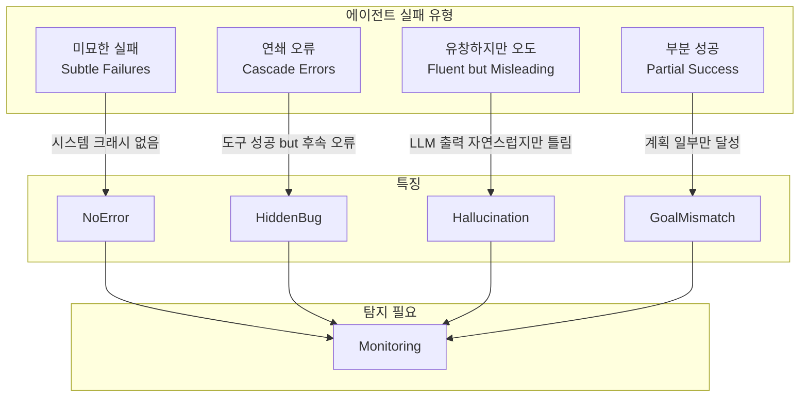
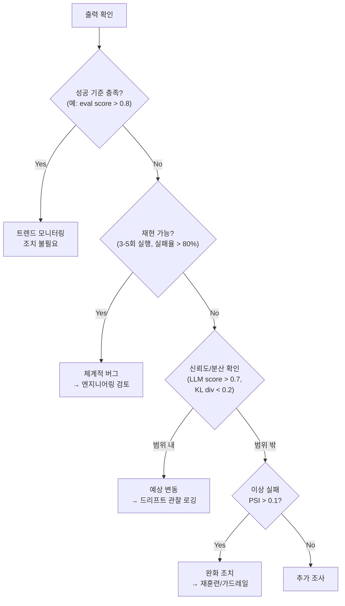
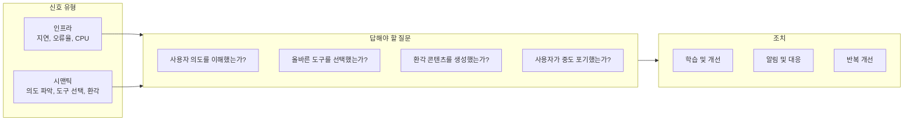
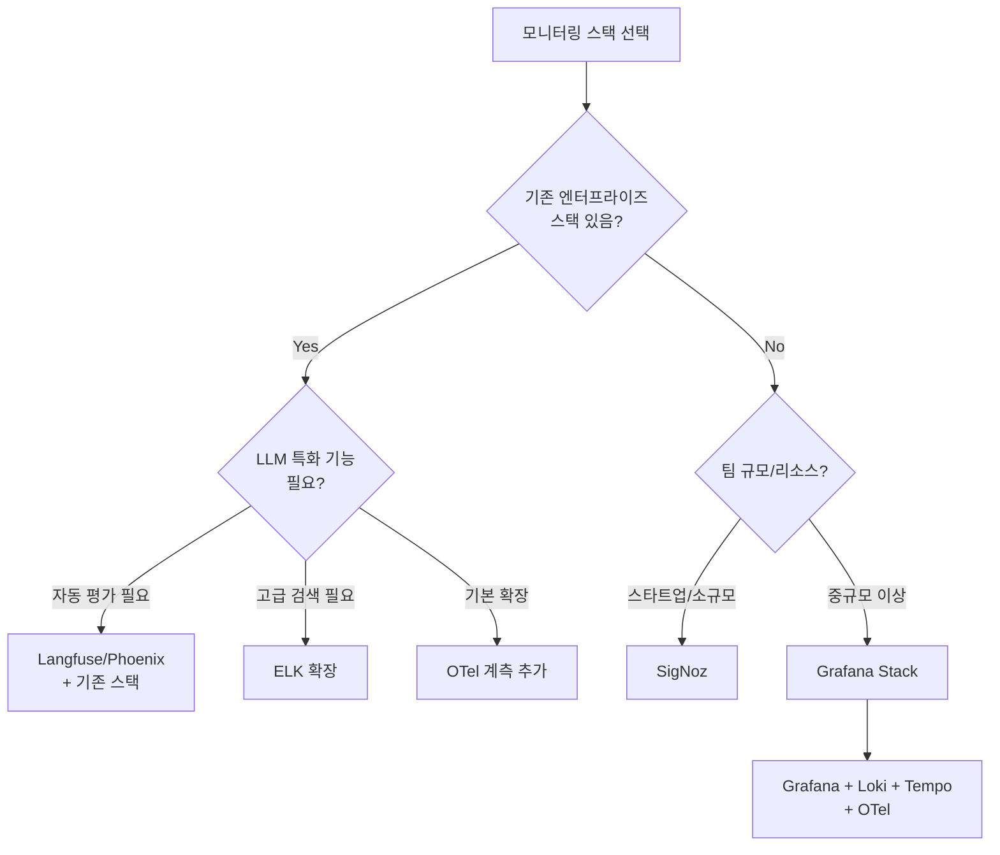
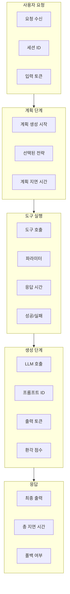
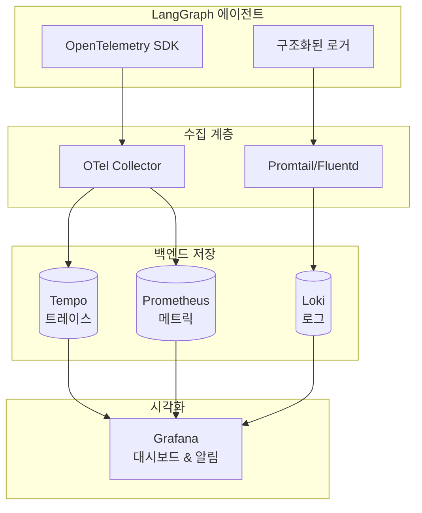
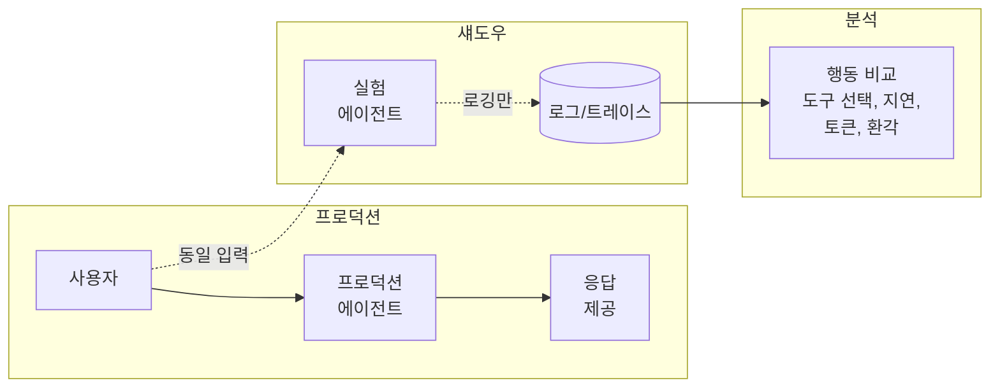
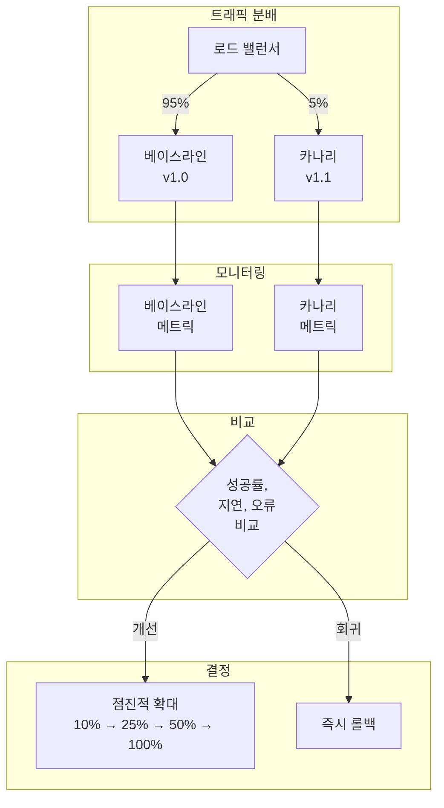
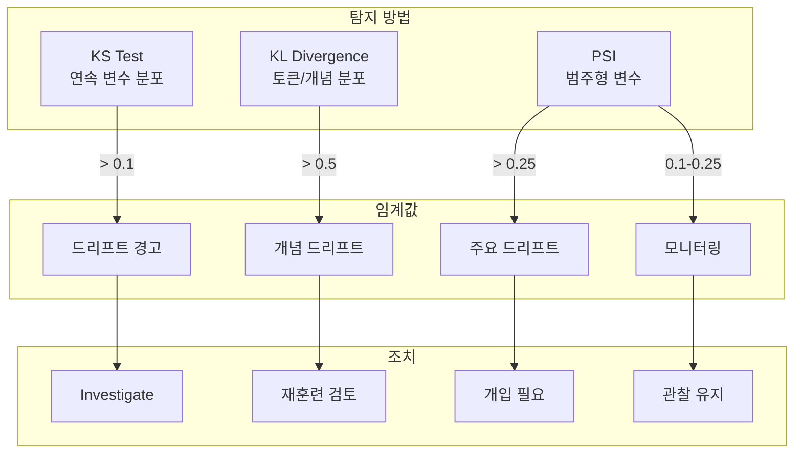
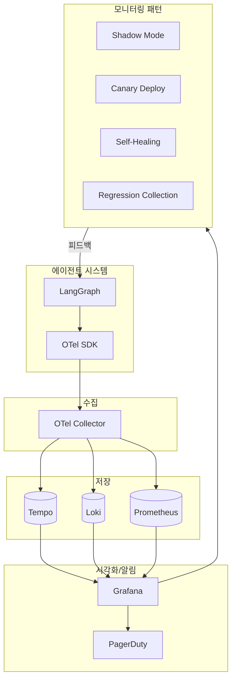

# Chapter 10: Monitoring in Production

## 핵심 요약

에이전트 시스템의 배포는 절반에 불과하며, 진정한 도전은 프로덕션 환경에서 시작된다. 전통적인 소프트웨어와 달리 에이전트는 확률적(probabilistic)으로 동작하며, Foundation Model에 의존하고, 무한한 사용자 입력에 응답한다. 모니터링은 단순한 문제 탐지를 넘어 학습과 반복의 핵심 피드백 루프가 된다. OpenTelemetry, Loki, Tempo, Grafana로 구성된 오픈소스 스택을 통해 에이전트의 런타임 이벤트를 계측하고, 시각화하며, 알림을 설정하여 지속적인 개선을 가능하게 한다.

---

## 학습 목표

이 챕터를 학습한 후 다음을 할 수 있어야 한다:

1. **모니터링 전략 수립**: 에이전트 시스템의 고유한 모니터링 요구사항 이해
2. **모니터링 스택 선택**: Grafana, ELK, Phoenix, SigNoz, Langfuse 비교 및 선택
3. **OTel 계측**: LangGraph 에이전트에 OpenTelemetry 통합
4. **시각화 및 알림**: Grafana 대시보드 구축과 알림 설정
5. **모니터링 패턴 적용**: Shadow Mode, Canary, Self-Healing 패턴 구현
6. **분포 변화 탐지**: KS 테스트, KL Divergence, PSI를 통한 드리프트 감지

---

## 본문 정리

### 1. 모니터링이 학습인 이유 (Monitoring Is How You Learn)

```
원칙: 모니터링은 문제 탐지를 넘어 피드백 루프의 핵심
```

#### 1.1 에이전트 실패의 특성



#### 1.2 실패 vs 예상 변동 구분



#### 1.3 모니터링의 다층적 역할



---

### 2. 메트릭 분류 (Taxonomy of Metrics)

```
핵심: 수집할 메트릭을 계층별로 정의하여 의미 있는 변화 탐지
```

#### 2.1 인프라 메트릭

| 메트릭 | 목적 | 예시 조치 |
|--------|------|-----------|
| CPU/메모리 사용량 | 시스템 건강 및 스케일링 압력 | 오토스케일 또는 메모리 집약 도구 최적화 |
| 가용성 | 서비스 가용성 및 장애 복구 추적 | 인시던트 대응 트리거 |
| 요청 지연 (P50, P95, P99) | 부하 시 응답성 보장 | 캐싱 또는 재시도 로직 튜닝 |

#### 2.2 워크플로우 메트릭

| 메트릭 | 목적 | 예시 조치 |
|--------|------|-----------|
| 태스크 성공률 | 에이전트가 의도된 워크플로우 완료 빈도 | 실패 조사 또는 프롬프트 업데이트 |
| 토큰 사용량 | 워크플로우 수준 토큰 소비 측정 | 급격한 증감은 이슈 지표 |
| 도구 호출 성공/실패율 | 통합 저하 또는 도구 오용 탐지 | 래퍼 패치 또는 자동 폴백 |
| Rate Limit 초과 | 도구 호출 제한 초과 추적 | 제한 조정 또는 호출 빈도 조절 |
| 재시도 빈도 | 계획 또는 도구의 불안정성 식별 | 재시도 디바운스 또는 계획 로직 개선 |
| 폴백 빈도 | 주 워크플로우 실패 표면화 | 견고성 향상 또는 인간 에스컬레이션 |

#### 2.3 출력 품질 메트릭

| 메트릭 | 목적 | 예시 조치 |
|--------|------|-----------|
| 토큰 사용량 (입/출력) | 장황함, 비용, 생성 효율성 추적 | 긴 프롬프트 정리 또는 모델 티어 전환 |
| 환각 지표 | 생성 콘텐츠의 시맨틱 정확도 측정 | 그라운딩 또는 LLM 비평 단계 도입 |
| 베이스라인 대비 임베딩 드리프트 | 사용자 입력 또는 태스크 프레이밍 분포 변화 탐지 | 워크플로우 조정 또는 모델 파인튜닝 |

#### 2.4 사용자 피드백 메트릭

| 메트릭 | 목적 | 예시 조치 |
|--------|------|-----------|
| 재질의/재표현 비율 | 첫 시도에 이해되었는지 측정 | 의도 분류 개선 |
| 태스크 포기율 | 사용자 혼란 또는 좌절 워크플로우 식별 | 흐름 단순화 또는 명확화 프롬프트 추가 |
| 명시적 평가 (👍/👎) | 시스템 유용성에 대한 정성 평가 수집 | 평가용 출력 분류에 활용 |

---

### 3. 모니터링 스택 비교 (Monitoring Stacks)

```
원칙: 기존 스택 확장을 우선, 특수 요구사항 시 전문 도구 선택
```

#### 3.1 스택 비교표

| 스택 | 핵심 강점 | 최적 용도 | 트레이드오프 |
|------|-----------|-----------|--------------|
| **Grafana + Loki/Tempo** | 조합성 및 시각화 | 엔터프라이즈 운영 | 관리할 컴포넌트 다수 |
| **ELK Stack** | 고급 검색/분석 | 대규모 로그 | 리소스 사용량 높음 |
| **Arize Phoenix** | 트레이싱 및 디버깅 | 개발 반복 | 프로덕션 스케일 제한 |
| **SigNoz** | 통합 및 경량화 | 스타트업/ML 팀 | 확장성 낮음 |
| **Langfuse** | FM/에이전트 특화 평가 | 시맨틱 모니터링 | 인프라 커버리지 좁음 |

#### 3.2 스택 선택 의사결정 트리



---

### 4. OpenTelemetry 계측 (OTel Instrumentation)

```
핵심: 에이전트 런타임에 고품질 신호를 직접 임베딩
```

#### 4.1 LangGraph 노드 계측

```python
from opentelemetry import trace
from opentelemetry.sdk.trace import TracerProvider
from opentelemetry.sdk.trace.export import BatchSpanProcessor
from opentelemetry.exporter.otlp.proto.grpc.trace_exporter import OTLPSpanExporter

# 트레이서 초기화
trace.set_tracer_provider(TracerProvider())
tracer = trace.get_tracer("agent")

# OTLP 익스포터 설정 (Tempo로 전송)
otlp_exporter = OTLPSpanExporter(endpoint="http://tempo:4317")
trace.get_tracer_provider().add_span_processor(
    BatchSpanProcessor(otlp_exporter)
)

async def call_tool_node(context):
    """도구 호출 노드 with 트레이싱"""
    with tracer.start_as_current_span("call_tool", attributes={
        "tool.name": context.tool_name,
        "tool.method": context.method,
        "input_tokens": context.token_usage.input,
        "output_tokens": context.token_usage.output,
        "user.session_id": context.session_id,
        "agent.version": context.agent_version,
    }) as span:
        try:
            result = await call_tool(context)
            span.set_attribute("tool.success", True)
            span.set_attribute("tool.latency_ms", result.latency_ms)
            return result
        except Exception as e:
            span.set_attribute("tool.success", False)
            span.set_attribute("tool.error", str(e))
            span.record_exception(e)
            raise
```

#### 4.2 계층별 계측 포인트



#### 4.3 구조화된 로깅

```python
import json
import logging
from opentelemetry import trace

# 구조화된 로거 설정
class StructuredLogger:
    def __init__(self, name: str):
        self.logger = logging.getLogger(name)
        self.tracer = trace.get_tracer(name)

    def log_event(self, event_type: str, data: dict):
        """트레이스 ID와 함께 구조화된 로그 이벤트 기록"""
        span = trace.get_current_span()
        trace_id = span.get_span_context().trace_id if span else None

        log_entry = {
            "event_type": event_type,
            "trace_id": format(trace_id, '032x') if trace_id else None,
            "timestamp": datetime.utcnow().isoformat(),
            **data
        }

        self.logger.info(json.dumps(log_entry))

# 사용 예시
logger = StructuredLogger("agent")

async def planning_node(context):
    logger.log_event("planning_start", {
        "session_id": context.session_id,
        "user_intent": context.detected_intent,
        "available_tools": len(context.tools)
    })

    plan = await generate_plan(context)

    logger.log_event("planning_complete", {
        "session_id": context.session_id,
        "plan_steps": len(plan.steps),
        "selected_tools": [s.tool for s in plan.steps],
        "planning_latency_ms": plan.latency_ms
    })

    return plan
```

---

### 5. Tempo, Loki, Grafana 통합

```
아키텍처: OTel → Tempo(트레이스) + Loki(로그) → Grafana(시각화/알림)
```

#### 5.1 통합 아키텍처



#### 5.2 Grafana 대시보드 패널 예시

```
┌─────────────────────────────────────────────────────────────┐
│                   Agent Observability Dashboard              │
├─────────────────────┬─────────────────────┬─────────────────┤
│   Request Rate      │   Success Rate      │   Avg Latency   │
│   ▓▓▓▓▓▓▓░░░ 850/m │   ▓▓▓▓▓▓▓▓░░ 94.2% │   ▓▓▓▓░░ 1.2s  │
├─────────────────────┴─────────────────────┴─────────────────┤
│                     Token Usage Over Time                    │
│  Input: ━━━━━━━━━━━━━━━━━━━━━━━━━━━━━━━━━━━━━━━━━━━━━━━   │
│  Output: ━━━━━━━━━━━━━━━━━━━━━━━━━━━━━━━━━━━━━━━━━━━━━━   │
├─────────────────────────────────────────────────────────────┤
│  Tool Call Distribution    │  Hallucination Rate           │
│  refund_tool:    ▓▓▓▓ 40% │  ▓░░░░░░░░░ 3.2%              │
│  search_tool:    ▓▓▓  30% │  Target: < 5%                  │
│  update_tool:    ▓▓   20% │                                │
│  other:          ▓    10% │                                │
├─────────────────────────────────────────────────────────────┤
│                    P95 Latency by Component                  │
│  Planning:     ▓▓▓▓▓▓░░░░ 650ms                            │
│  Tool Call:    ▓▓▓▓░░░░░░ 420ms                            │
│  Generation:   ▓▓▓▓▓▓▓░░░ 780ms                            │
└─────────────────────────────────────────────────────────────┘
```

#### 5.3 알림 설정

```python
# Grafana 알림 규칙 (YAML 형식)
alert_rules = """
groups:
  - name: agent_alerts
    rules:
      # 환각률 알림
      - alert: HighHallucinationRate
        expr: |
          sum(rate(agent_hallucination_total[30m])) /
          sum(rate(agent_responses_total[30m])) > 0.05
        for: 5m
        labels:
          severity: warning
        annotations:
          summary: "환각률 5% 초과"
          description: "최근 30분 환각률: {{ $value | humanizePercentage }}"

      # 재시도 루프 알림
      - alert: ExcessiveRetries
        expr: |
          sum by (session_id) (agent_retries_total) > 3
        for: 1m
        labels:
          severity: critical
        annotations:
          summary: "세션 내 재시도 3회 초과"

      # 도구 응답 지연 알림
      - alert: ToolLatencySpike
        expr: |
          histogram_quantile(0.95,
            rate(tool_call_duration_seconds_bucket[5m])
          ) > 2.0
        for: 5m
        labels:
          severity: warning
        annotations:
          summary: "도구 P95 지연 50% 이상 증가"
"""
```

---

### 6. 모니터링 패턴 (Monitoring Patterns)

```
원칙: 확률적 시스템의 변경 사항을 안전하게 배포
```

#### 6.1 Shadow Mode



**구현**:
```python
async def shadow_mode_handler(request):
    """Shadow Mode: 실험 에이전트 병렬 실행 (응답 미제공)"""
    # 공유 요청 ID
    request_id = str(uuid.uuid4())

    # 프로덕션 에이전트 실행
    prod_task = asyncio.create_task(
        production_agent.invoke(request, trace_id=request_id)
    )

    # 섀도우 에이전트 실행 (로깅만)
    shadow_task = asyncio.create_task(
        shadow_agent.invoke(
            request,
            trace_id=request_id,
            shadow=True  # 응답 미제공 플래그
        )
    )

    # 프로덕션 응답만 반환
    prod_response = await prod_task

    # 섀도우 결과는 백그라운드에서 로깅
    asyncio.create_task(log_shadow_comparison(
        request_id,
        prod_response,
        shadow_task
    ))

    return prod_response
```

#### 6.2 Canary Deployments



#### 6.3 Regression Trace Collection

```python
class RegressionTraceCollector:
    """실패 트레이스를 테스트 케이스로 변환"""

    def __init__(self, tempo_client, test_suite_path: str):
        self.tempo = tempo_client
        self.test_suite_path = test_suite_path

    async def collect_failure_traces(
        self,
        time_window: timedelta = timedelta(hours=24)
    ):
        """실패 트레이스 수집 및 테스트 케이스 생성"""
        # Tempo에서 실패 트레이스 조회
        failed_traces = await self.tempo.query(
            query='status="error"',
            start=datetime.now() - time_window
        )

        new_test_cases = []
        for trace in failed_traces:
            test_case = self._trace_to_test_case(trace)
            new_test_cases.append(test_case)

            # 테스트 스위트에 추가
            self._append_to_test_suite(test_case)

        return new_test_cases

    def _trace_to_test_case(self, trace) -> dict:
        """트레이스를 테스트 케이스로 변환"""
        return {
            "id": f"regression_{trace.trace_id}",
            "source": "production_failure",
            "timestamp": trace.start_time,
            "input": {
                "user_message": trace.attributes.get("user.message"),
                "context": trace.attributes.get("context")
            },
            "expected": {
                # 실패를 재현하기 위한 기대값
                "should_not_fail": True,
                "error_type": trace.attributes.get("error.type")
            },
            "metadata": {
                "original_trace_id": trace.trace_id,
                "failure_reason": trace.attributes.get("error.message")
            }
        }

    async def collect_golden_traces(self):
        """성공적인 복잡한 케이스를 골든 패스로 저장"""
        golden_traces = await self.tempo.query(
            query='status="success" AND complexity="high"',
            start=datetime.now() - timedelta(days=7)
        )

        for trace in golden_traces:
            golden_case = self._trace_to_golden_case(trace)
            self._append_to_golden_suite(golden_case)
```

#### 6.4 Self-Healing Agents

```python
class SelfHealingAgent:
    """자기 치유 에이전트: 텔레메트리 기반 폴백"""

    def __init__(self, graph, metrics_client):
        self.graph = graph
        self.metrics = metrics_client
        self.fallback_thresholds = {
            "tool_failure_rate": 0.3,
            "latency_spike": 2.0,  # 배수
            "hallucination_score": 0.7
        }

    async def invoke_with_healing(self, request):
        """텔레메트리 기반 자기 치유 실행"""
        # 현재 메트릭 확인
        current_metrics = await self.metrics.get_recent(window="5m")

        # 도구 실패율 체크
        if current_metrics["tool_failure_rate"] > self.fallback_thresholds["tool_failure_rate"]:
            logger.warning("Tool failure rate high, using simplified plan")
            return await self._execute_simplified_plan(request)

        # 지연 스파이크 체크
        if current_metrics["latency_ratio"] > self.fallback_thresholds["latency_spike"]:
            logger.warning("Latency spike detected, skipping optional steps")
            return await self._execute_minimal_plan(request)

        # 정상 실행
        try:
            result = await self.graph.invoke(request)

            # 환각 점수 체크
            if result.hallucination_score > self.fallback_thresholds["hallucination_score"]:
                logger.warning("High hallucination score, adding disclaimer")
                result.response = self._add_disclaimer(result.response)

            return result

        except ToolFailure as e:
            logger.error(f"Tool failure: {e}, attempting fallback")
            return await self._handle_tool_failure(request, e)

    async def _execute_simplified_plan(self, request):
        """단순화된 계획으로 실행"""
        # 필수 도구만 사용
        simplified_tools = self._get_essential_tools()
        return await self.graph.invoke(
            request,
            config={"tools": simplified_tools}
        )

    def _add_disclaimer(self, response: str) -> str:
        """환각 경고 추가"""
        disclaimer = "\n\n⚠️ 이 응답의 정확성을 확인해 주세요."
        return response + disclaimer
```

---

### 7. 분포 변화 탐지 (Distribution Shifts)

```
핵심: 느린 드리프트도 탐지 - 명시적 오류 없이 성능 저하 가능
```

#### 7.1 드리프트 탐지 방법



#### 7.2 드리프트 탐지 구현

```python
import numpy as np
from scipy import stats
from typing import Dict, List

class DriftDetector:
    """분포 변화 탐지기"""

    def __init__(self, baseline_data: Dict[str, np.ndarray]):
        self.baseline = baseline_data
        self.thresholds = {
            "ks_statistic": 0.1,
            "kl_divergence": 0.5,
            "psi": 0.25,
            "psi_minor": 0.1
        }

    def detect_ks_drift(
        self,
        current_data: np.ndarray,
        feature_name: str
    ) -> Dict:
        """Kolmogorov-Smirnov 테스트로 분포 변화 탐지"""
        historical = self.baseline.get(feature_name, np.array([]))

        if len(historical) < 2 or len(current_data) < 2:
            return {"status": "insufficient_data"}

        ks_stat, p_value = stats.ks_2samp(historical, current_data)

        return {
            "method": "KS Test",
            "feature": feature_name,
            "ks_statistic": ks_stat,
            "p_value": p_value,
            "drift_detected": ks_stat > self.thresholds["ks_statistic"],
            "severity": "high" if ks_stat > 0.2 else "medium" if ks_stat > 0.1 else "low"
        }

    def detect_kl_divergence(
        self,
        current_distribution: np.ndarray,
        feature_name: str,
        epsilon: float = 1e-10
    ) -> Dict:
        """KL Divergence로 개념 드리프트 탐지"""
        p = self.baseline.get(feature_name, np.array([]))
        q = current_distribution

        if len(p) != len(q):
            return {"status": "dimension_mismatch"}

        # 정규화
        p = (p + epsilon) / np.sum(p + epsilon)
        q = (q + epsilon) / np.sum(q + epsilon)

        kl = np.sum(p * np.log(p / q))

        return {
            "method": "KL Divergence",
            "feature": feature_name,
            "kl_divergence": kl,
            "drift_detected": kl > self.thresholds["kl_divergence"],
            "severity": "high" if kl > 1.0 else "medium" if kl > 0.5 else "low"
        }

    def detect_psi(
        self,
        current_counts: np.ndarray,
        feature_name: str
    ) -> Dict:
        """Population Stability Index로 범주 분포 변화 탐지"""
        expected = self.baseline.get(feature_name, np.array([]))

        if len(expected) != len(current_counts):
            return {"status": "category_mismatch"}

        expected_pct = expected / np.sum(expected)
        actual_pct = current_counts / np.sum(current_counts)

        # PSI 계산
        psi_values = (actual_pct - expected_pct) * np.log(actual_pct / expected_pct)
        psi = np.sum(psi_values)

        if psi > self.thresholds["psi"]:
            severity = "high"
            action = "intervention_required"
        elif psi > self.thresholds["psi_minor"]:
            severity = "medium"
            action = "monitor_closely"
        else:
            severity = "low"
            action = "stable"

        return {
            "method": "PSI",
            "feature": feature_name,
            "psi": psi,
            "drift_detected": psi > self.thresholds["psi_minor"],
            "severity": severity,
            "recommended_action": action
        }

    def run_full_drift_check(
        self,
        current_data: Dict[str, np.ndarray]
    ) -> List[Dict]:
        """전체 드리프트 체크 실행"""
        results = []

        for feature, data in current_data.items():
            # 연속형 변수: KS 테스트
            if feature.endswith("_continuous"):
                results.append(self.detect_ks_drift(data, feature))

            # 분포 변수: KL Divergence
            elif feature.endswith("_distribution"):
                results.append(self.detect_kl_divergence(data, feature))

            # 범주형 변수: PSI
            elif feature.endswith("_categorical"):
                results.append(self.detect_psi(data, feature))

        return results
```

---

### 8. 사용자 피드백 통합

```python
class UserFeedbackMonitor:
    """사용자 피드백을 모니터링 신호로 통합"""

    def __init__(self, loki_client, tempo_client):
        self.loki = loki_client
        self.tempo = tempo_client

    async def log_implicit_feedback(
        self,
        session_id: str,
        feedback_type: str,
        data: Dict
    ):
        """암시적 피드백 로깅 (재질의, 포기 등)"""
        feedback_event = {
            "type": "implicit_feedback",
            "session_id": session_id,
            "feedback_type": feedback_type,  # "rephrase", "abandon", "hesitation"
            "timestamp": datetime.utcnow().isoformat(),
            **data
        }

        await self.loki.push(feedback_event)

        # 포기율 급증 시 알림
        if feedback_type == "abandon":
            await self._check_abandonment_spike(session_id)

    async def log_explicit_feedback(
        self,
        session_id: str,
        trace_id: str,
        rating: str,  # "positive", "negative"
        comment: Optional[str] = None
    ):
        """명시적 피드백 로깅 (👍/👎)"""
        feedback_event = {
            "type": "explicit_feedback",
            "session_id": session_id,
            "trace_id": trace_id,
            "rating": rating,
            "comment": comment,
            "timestamp": datetime.utcnow().isoformat()
        }

        await self.loki.push(feedback_event)

        # 부정 피드백 → 트레이스 연결
        if rating == "negative":
            await self._flag_trace_for_review(trace_id)

    async def _flag_trace_for_review(self, trace_id: str):
        """부정 피드백 트레이스를 평가 세트 후보로 플래그"""
        trace = await self.tempo.get_trace(trace_id)
        # 평가 세트 내보내기 대기열에 추가
        await self.export_queue.add({
            "trace_id": trace_id,
            "reason": "negative_user_feedback",
            "priority": "high"
        })
```

---

### 9. 크로스팀 메트릭 거버넌스

```
원칙: 에이전트 메트릭은 기존 서비스 메트릭과 동일한 관측 플랫폼에
```

#### 9.1 RACI 매트릭스

| 메트릭/활동 | 제품팀 | ML 엔지니어 | 인프라/SRE |
|------------|--------|-------------|-----------|
| 지연 (계획/도구 호출) | A (사용자 영향) / C | R (프롬프트/모델 최적화) / I | R (인프라 원인 모니터링) / C |
| 환각률 | C (피드백 컨텍스트) / I | A/R (탐지/완화) | I (알림 설정) |
| 태스크 성공률 | A (제품 목표) / R (기준 정의) | C (모델 개선) | I (시스템 신뢰성) |
| 토큰 사용량/비용 | C (비즈니스 영향) | R (생성 최적화) / I | A (예산/스케일링) / R |
| 분포 변화 | I (제품 조정) | A/R (임베딩/평가로 탐지) | C (데이터 파이프라인) |
| 폴백/재시도 빈도 | C (UX 폴백) | R (계획 로직 개선) | A (신뢰성) / I |
| 사용자 피드백/감정 | A/R (집계 및 우선순위) | C (모델 연관성) | I (운영 알림) |
| 대시보드 유지/트리아지 | C (제품 컨텍스트) | C (ML 인사이트) | A/R (플랫폼 및 팀 간 리뷰) |

**범례**: R=Responsible (수행), A=Accountable (책임), C=Consulted (협의), I=Informed (통보)

---

## 심화 학습

### 모니터링 도구 비교

| 도구 | 용도 | 특징 |
|------|------|------|
| **OpenTelemetry** | 계측 표준 | 벤더 중립, 트레이스/메트릭/로그 통합 |
| **Grafana** | 시각화/알림 | 대시보드, 다중 데이터소스 |
| **Tempo** | 트레이스 저장 | 고확장성, 분산 트레이싱 |
| **Loki** | 로그 집계 | 경량, LogQL 쿼리 |
| **Prometheus** | 메트릭 수집 | 시계열 DB, PromQL |
| **PagerDuty** | 인시던트 관리 | 온콜 라우팅, 에스컬레이션 |
| **Sentry** | 에러 추적 | 스택 트레이스, 릴리스 헬스 |
| **AgentOps.ai** | 에이전트 특화 | 통합 트레이싱/평가/알림 |

### 드리프트 탐지 방법 비교

| 방법 | 적용 대상 | 임계값 | 조치 |
|------|-----------|--------|------|
| **KS Test** | 연속 변수 (지연, 길이) | > 0.1 | 조사 |
| **KL Divergence** | 토큰/개념 분포 | > 0.5 | 재훈련 검토 |
| **PSI** | 범주형 (도구 사용) | > 0.25 (major), > 0.1 (minor) | 개입/모니터링 |
| **Cosine Similarity** | 임베딩 비교 | < 0.8 | 리뷰 트리거 |

---

## 실무 적용 포인트

### 즉시 적용 가능

1. **기본 OTel 계측**
   - LangGraph 노드에 span 추가
   - 도구 호출, 계획, 생성 단계 추적
   - 세션 ID, 버전 태깅

2. **핵심 알림 설정**
   - 환각률 > 5%
   - 재시도 > 3회/세션
   - P95 지연 50% 증가

3. **기본 대시보드**
   - 요청률, 성공률, 지연
   - 토큰 사용량 추이
   - 도구별 호출 분포

### 중기 적용

1. **Shadow Mode 도입**
   - 새 버전 병렬 실행
   - 행동 비교 분석

2. **Canary 배포**
   - 5% 트래픽으로 시작
   - 점진적 확대 전략

3. **드리프트 탐지**
   - KS/PSI 기반 자동 탐지
   - 임계값 기반 알림

### 장기 전략

1. **Self-Healing 패턴**
   - 텔레메트리 기반 폴백
   - 자동 복구 메커니즘

2. **Regression Trace Collection**
   - 실패 트레이스 → 테스트 케이스
   - 골든 패스 보존

3. **크로스팀 거버넌스**
   - RACI 기반 책임 분배
   - 공유 대시보드 문화

---

## 핵심 개념 체크리스트

### 모니터링 기초

- [ ] 에이전트 실패의 미묘한 특성 이해
- [ ] 실패 vs 예상 변동 구분 프로세스
- [ ] 인프라/워크플로우/품질/사용자 메트릭 정의

### 스택 구축

- [ ] OTel 계측 구현
- [ ] Tempo/Loki/Grafana 통합
- [ ] 알림 규칙 설정

### 모니터링 패턴

- [ ] Shadow Mode: 실험 에이전트 병렬 실행
- [ ] Canary: 점진적 트래픽 분배
- [ ] Regression Collection: 실패 → 테스트
- [ ] Self-Healing: 자동 폴백

### 드리프트 탐지

- [ ] KS Test, KL Divergence, PSI 구현
- [ ] 임계값 기반 알림
- [ ] 대응 전략 수립

### 조직 거버넌스

- [ ] RACI 매트릭스 정의
- [ ] 공유 대시보드
- [ ] 크로스팀 트리아지 리추얼

---

## 참고 자료

### 도구 및 플랫폼
- OpenTelemetry: https://opentelemetry.io
- Grafana: https://grafana.com
- Loki: https://grafana.com/oss/loki/
- Tempo: https://grafana.com/oss/tempo/

### 상용 플랫폼
- Arize AI: https://arize.com
- Langfuse: https://langfuse.com
- AgentOps: https://agentops.ai

### 아키텍처 다이어그램


