# Chapter 11: Improvement Loops

## 핵심 요약

복잡한 멀티에이전트 시스템에서 실패는 예외가 아닌 필연이다. 시스템의 진정한 테스트는 실패 여부가 아니라 실패로부터 얼마나 잘 학습하고 개선하는가이다. 지속적 개선은 **피드백 파이프라인**(이슈 진단), **실험**(변경 검증), **지속적 학습**(적응 내재화)의 세 가지 상호연결된 사이클로 구성된다. DSPy, Microsoft Trace, APO 같은 프레임워크를 활용해 프롬프트와 도구를 자동으로 최적화하고, Shadow Deployment, A/B Testing, Bayesian Bandits로 안전하게 변경을 검증하며, In-Context Learning과 Offline Retraining으로 지속적 적응을 구현한다.

---

## 학습 목표

이 챕터를 학습한 후 다음을 할 수 있어야 한다:

1. **피드백 파이프라인 구축**: 자동화된 이슈 탐지와 근본 원인 분석
2. **HITL 리뷰 설계**: 인간 검토 에스컬레이션 기준과 워크플로우
3. **프롬프트/도구 정제**: DSPy를 활용한 자동 최적화
4. **실험 전략 선택**: Shadow, A/B, Bayesian Bandits 비교 및 적용
5. **지속적 학습 구현**: In-Context Learning과 Offline Retraining 통합

---

## 본문 정리

### 1. 개선 루프 개요 (Improvement Loops Overview)

```
원칙: 모든 실패는 가치 있는 정보 소스이며, 모든 성공은 추가 개선의 기반
```

#### 1.1 지속적 개선의 세 가지 축

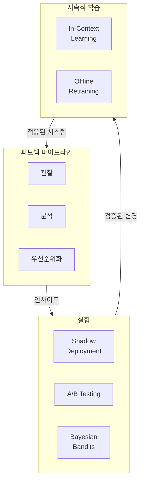

#### 1.2 개선 루프 방법론 비교

| 기법 | 목적 | 강점 | 한계 | 사용 시점 |
|------|------|------|------|-----------|
| **피드백 파이프라인** | 상호작용에서 이슈 관찰, 분석, 우선순위화 | 확장 가능, 자동화+인간 감독 혼합, 선제적 위험 탐지 | 데이터 품질 의존, 에스컬레이션 없이 신규 이슈 놓칠 수 있음 | 실패 진단, 패턴 발견, 개선 백로그 구축 |
| **실험** | 통제된 환경에서 변경 검증, 영향 측정, 위험 감소 | 데이터 기반, 위험 최소화, 변형 비교, 실제 조건 적응 | 통계적 유의성 위해 충분한 데이터 필요, 리소스 집약적 | 개선 테스트, 점진적 롤아웃, 동적 환경 |
| **지속적 학습** | 상호작용 및 진화하는 요구에 기반한 동적 적응 내재화 | 실시간 적응, 사용자 변화 대응, 탄력성 향상, 개인화 | 과적합/회귀 위험, 계산 비용, 견고한 모니터링 필요 | 패턴 적응, 개인화, 체계적 이슈 수정 |

#### 1.3 강화 학습 관점의 개선 루프

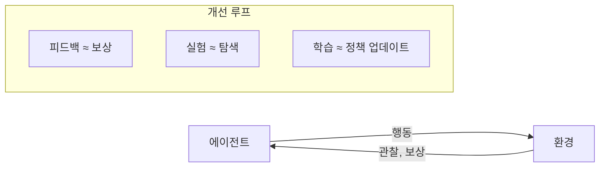

---

### 2. 피드백 파이프라인 (Feedback Pipelines)

```
핵심: 대규모 데이터에서 패턴 인식, 클러스터링, 실행 가능한 인사이트 도출
```

#### 2.1 자동화된 프롬프트 최적화 파이프라인

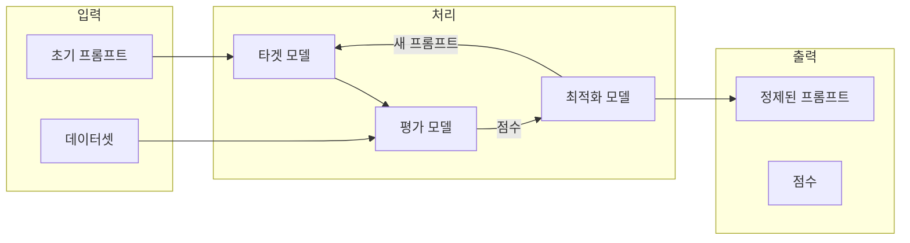

#### 2.2 주요 최적화 프레임워크

| 프레임워크 | 목적 | 특징 |
|-----------|------|------|
| **DSPy** | 선언적 자기 개선 LM 프로그램 | 모듈식, 서명 기반, BootstrapFewshot/MIPROv2 최적화 |
| **Microsoft Trace** | 생성적 AI 시스템 최적화 | 일반 피드백(점수, 자연어, 쌍별 선호) 활용, 블랙박스 시스템 적합 |
| **APO** | 자동 프롬프트 최적화 | 데이터 기반 프롬프트 개선, 수동 개입 최소화 |

#### 2.3 SOC 에이전트 예제

**시스템 프롬프트**:
```
You are an experienced Security Operations Center (SOC) analyst specializing
in cybersecurity incident response.

Your expertise covers:
- Threat intelligence analysis and IOC research
- Security log analysis and correlation across multiple systems
- Incident triage and classification (true positive/false positive)
- Malware analysis and threat hunting
- Network security monitoring and anomaly detection
- Incident containment and response coordination
- SIEM/SOAR platform operations

Your investigation methodology:
  1) Analyze security alerts and gather initial indicators
  2) Use lookup_threat_intel to research IPs, hashes, URLs, and domains
  3) Use query_logs to search relevant log sources for evidence
  4) Use triage_incident to classify findings as true/false positives
  5) Use isolate_host when containment is needed to prevent spread
  6) Follow up with send_analyst_response to document findings
```

**도구 정의**:
```python
from langchain.tools import tool

@tool
def lookup_threat_intel(indicator: str, type: str, **kwargs) -> str:
    """Look up threat intelligence for IP addresses, file hashes,
    URLs, and domains."""
    print(f"[TOOL] lookup_threat_intel(indicator={indicator}, type={type})")
    log_to_loki("tool.lookup_threat_intel", f"indicator={indicator}, type={type}")
    return "threat_intel_retrieved"

@tool
def query_logs(query: str, log_index: str, **kwargs) -> str:
    """Search and analyze security logs across authentication, endpoint,
    network, firewall, and DNS systems."""
    print(f"[TOOL] query_logs(query={query}, log_index={log_index})")
    log_to_loki("tool.query_logs", f"query={query}, log_index={log_index}")
    return "log_query_executed"

@tool
def triage_incident(incident_id: str, decision: str, reason: str, **kwargs):
    """Classify security incidents as true positive, false positive,
    or escalate for further investigation."""
    print(f"[TOOL] triage_incident(incident_id={incident_id}, decision={decision})")
    log_to_loki("tool.triage_incident", f"decision={decision}")
    return "incident_triaged"

@tool
def isolate_host(host_id: str, reason: str, **kwargs) -> str:
    """Isolate compromised hosts to prevent lateral movement
    and contain security incidents."""
    print(f"[TOOL] isolate_host(host_id={host_id}, reason={reason})")
    log_to_loki("tool.isolate_host", f"host_id={host_id}")
    return "host_isolated"

@tool
def send_analyst_response(incident_id: str = None, message: str = None) -> str:
    """Send security analysis, incident updates, or recommendations
    to stakeholders."""
    print(f"[TOOL] send_analyst_response → {message}")
    log_to_loki("tool.send_analyst_response", f"incident_id={incident_id}")
    return "analyst_response_sent"

TOOLS = [
    lookup_threat_intel, query_logs, triage_incident,
    isolate_host, send_analyst_response
]
```

---

### 3. 자동화된 이슈 탐지와 근본 원인 분석

```
원칙: 무엇이 실패했는지뿐 아니라 왜 실패했는지 파악
```

#### 3.1 이슈 탐지 패턴

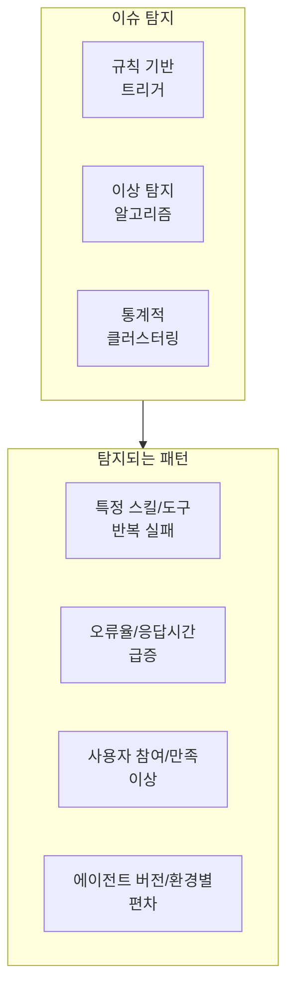

#### 3.2 근본 원인 분석 (RCA) 단계

| 단계 | 설명 | SOC 에이전트 예시 |
|------|------|-------------------|
| **워크플로우 추적** | 실패까지의 의사결정 체인 재구성 | query_logs 호출 시퀀스 추적 |
| **결함 위치 특정** | 고장 책임 컴포넌트 격리 | 쿼리 파라미터 생성 로직 식별 |
| **패턴 인식** | 반복 vs 일회성 구분 | 특정 쿼리 유형에서 반복 실패 확인 |
| **영향 평가** | 빈도와 심각도 평가 | 하루 100건 중 15건 영향 |

---

### 4. Human-in-the-Loop (HITL) 리뷰

```
핵심: 자동화만으로 불충분한 모호한, 윤리적, 신규 엣지 케이스 처리
```

#### 4.1 HITL 워크플로우

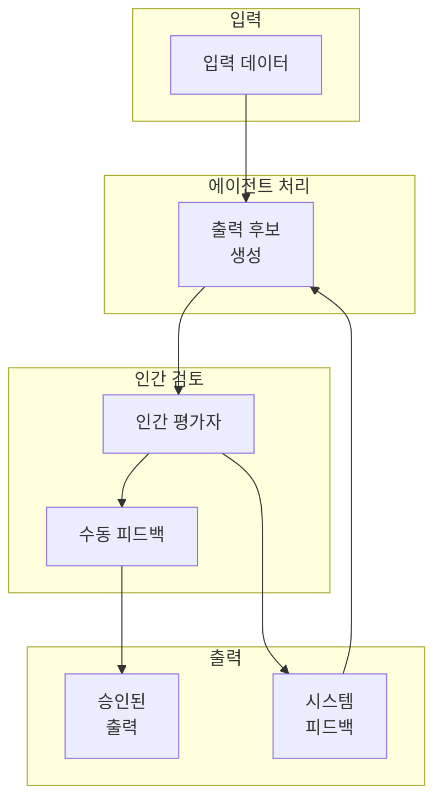

#### 4.2 에스컬레이션 기준

**저확실성 케이스**:
```python
# 모델 확신도 기반 에스컬레이션
def should_escalate_low_certainty(response, threshold=0.7):
    """확신도가 낮으면 에스컬레이션"""
    certainty = response.get("certainty", 1.0)
    if certainty < threshold:
        return True, f"Low certainty: {certainty}"
    return False, None

# 다중 실행 분산 기반
def should_escalate_by_variance(responses, divergence_threshold=0.2):
    """응답 분산이 크면 에스컬레이션"""
    unique_outputs = len(set(r["output"] for r in responses))
    divergence = unique_outputs / len(responses)
    if divergence > divergence_threshold:
        return True, f"High divergence: {divergence:.2%}"
    return False, None
```

**고영향 케이스**:
```python
# 도메인별 심각도 기반
def should_escalate_high_impact(incident, critical_assets):
    """고영향 케이스 에스컬레이션"""
    # 심각도 체크
    if incident.get("severity") == "critical":
        return True, "Critical severity"

    # 중요 자산 영향 체크
    affected_assets = incident.get("affected_assets", [])
    if any(asset in critical_assets for asset in affected_assets):
        return True, "Critical asset affected"

    return False, None

# 불확실성 × 영향 점수
def calculate_escalation_score(certainty, impact_score):
    """에스컬레이션 점수 계산"""
    uncertainty = 1 - certainty
    return uncertainty * impact_score
```

#### 4.3 에스컬레이션 상황

| 상황 | 설명 | 조치 |
|------|------|------|
| 기술적 설명 없는 지속적 오류 | 자동 분석 실패 | 다학제 팀 분석 |
| 규제/윤리적 함의 이상 | 민감 케이스 | 컴플라이언스 검토 |
| 고가치/미션 크리티컬 태스크 실패 | 비즈니스 영향 | 우선 대응 |
| 자동 도구 간 충돌 진단 | 모순된 추천 | 인간 판단 |

---

### 5. 프롬프트 및 도구 정제

```
원칙: 인사이트를 실행으로 연결 - 프롬프트와 도구는 가장 직접적인 개선 레버
```

#### 5.1 프롬프트 정제 문제 유형

| 문제 | 증상 | 해결 방법 |
|------|------|-----------|
| 모호한 지시 | 불일치/관련 없는 응답 | 명확성 향상, 형식 지정 |
| 과도하게 넓은 범위 | 환각, 벗어난 출력 | 범위 제한, 제약 추가 |
| 경직된 좁은 범위 | 실세계 변동성 대응 실패 | 예시 추가, 일반화 |
| 경계/에러 처리 부재 | 예외 상황 혼란 | 명시적 가이드라인 |

#### 5.2 DSPy를 활용한 ReAct 모듈 최적화

```python
import dspy

dspy.configure(lm=dspy.OpenAI(model="gpt-4o-mini"))

def lookup_threat_intel(indicator: str) -> str:
    """Mock: Look up threat intelligence for an indicator."""
    return f"Mock intel for {indicator}: potentially malicious"

def query_logs(query: str) -> str:
    """Mock: Search and analyze security logs."""
    return f"Mock logs for '{query}': suspicious activity detected"

# 합성 테스트 케이스 (실제로는 100개 이상 권장)
trainset = [
    dspy.Example(
        alert="Suspicious login attempt from IP 203.0.113.45 to admin account.",
        response="Lookup threat intel for IP, query logs for activity, "
                 "triage as true positive, isolate host if malicious."
    ).with_inputs('alert'),
    dspy.Example(
        alert="Unusual file download from URL example.com/malware.exe.",
        response="Lookup threat intel for URL and hash, query logs for "
                 "endpoint activity, triage as true positive, isolate host."
    ).with_inputs('alert'),
    dspy.Example(
        alert="High network traffic to domain suspicious-site.net.",
        response="Lookup threat intel for domain, query logs for network "
                 "and firewall, triage as false positive if benign."
    ).with_inputs('alert'),
    dspy.Example(
        alert="Alert: Potential phishing email with attachment hash abc123.",
        response="Lookup threat intel for hash, query logs for email and "
                 "endpoint, triage as true positive, send analyst response."
    ).with_inputs('alert'),
    dspy.Example(
        alert="Anomaly in user behavior: multiple failed logins from new device.",
        response="Query logs for authentication, lookup threat intel for "
                 "device IP, triage as true positive if pattern matches attack."
    ).with_inputs('alert'),
]

# ReAct 모듈 정의
react = dspy.ReAct("alert -> response", tools=[lookup_threat_intel, query_logs])

# MIPROv2 최적화
tp = dspy.MIPROv2(
    metric=dspy.evaluate.answer_exact_match,
    auto="light",
    num_threads=24
)
optimized_react = tp.compile(react, trainset=trainset)

# 최적화된 모듈을 SOC 에이전트 워크플로우에 통합
```

#### 5.3 도구 정제 - DSPy ChainOfThought 활용

```python
import dspy

dspy.configure(lm=dspy.LM("openai/gpt-4o-mini"))

# 위협 분류 서명 정의
class ThreatClassifier(dspy.Signature):
    """Classify the threat level of a given indicator as
    'benign', 'suspicious', or 'malicious'."""
    indicator: str = dspy.InputField(
        desc="The indicator to classify (IP, URL, or file hash)."
    )
    threat_level: str = dspy.OutputField(
        desc="The classified threat level: 'benign', 'suspicious', or 'malicious'."
    )

# ChainOfThought 기반 분류 모듈
class ThreatClassificationModule(dspy.Module):
    def __init__(self):
        super().__init__()
        self.classify = dspy.ChainOfThought(ThreatClassifier)

    def forward(self, indicator):
        return self.classify(indicator=indicator)

# 학습 데이터셋 (실제 SOC 로그에서 50-200개 이상 권장)
trainset = [
    dspy.Example(indicator="203.0.113.45",
                 threat_level="suspicious").with_inputs('indicator'),
    dspy.Example(indicator="example.com/malware.exe",
                 threat_level="malicious").with_inputs('indicator'),
    dspy.Example(indicator="benign-site.net",
                 threat_level="benign").with_inputs('indicator'),
    dspy.Example(indicator="abc123def456",
                 threat_level="malicious").with_inputs('indicator'),
    dspy.Example(indicator="192.168.1.1",
                 threat_level="benign").with_inputs('indicator'),
    dspy.Example(indicator="obfuscated.url/with?params",
                 threat_level="suspicious").with_inputs('indicator'),
    dspy.Example(indicator="new-attack-vector-hash789",
                 threat_level="malicious").with_inputs('indicator'),
]

# 평가 메트릭
def threat_match_metric(example, pred, trace=None):
    return example.threat_level.lower() == pred.threat_level.lower()

# BootstrapFewshotWithRandomSearch 최적화
optimizer = dspy.BootstrapFewshotWithRandomSearch(
    metric=threat_match_metric,
    max_bootstrapped_demos=4,
    max_labeled_demos=4
)
optimized_module = optimizer.compile(
    ThreatClassificationModule(),
    trainset=trainset
)

# 최적화된 도구 함수
def classify_threat(indicator: str) -> str:
    """Classify threat level using the optimized DSPy module."""
    prediction = optimized_module(indicator=indicator)
    return prediction.threat_level
```

---

### 6. 개선 집계 및 우선순위화

```
원칙: 모든 버그가 즉시 수정될 수는 없다 - 영향도 기반 우선순위화
```

#### 6.1 우선순위화 차원

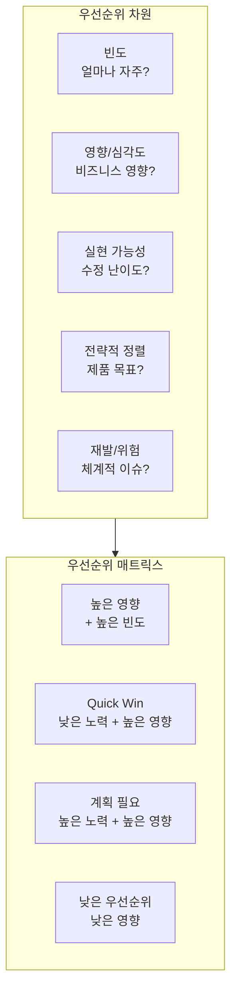

#### 6.2 개선 백로그 관리

```python
from dataclasses import dataclass
from enum import Enum
from typing import List, Optional
import heapq

class Priority(Enum):
    CRITICAL = 1
    HIGH = 2
    MEDIUM = 3
    LOW = 4

@dataclass
class Improvement:
    id: str
    title: str
    description: str
    frequency: int  # 발생 횟수
    impact_score: float  # 0-1
    effort_score: float  # 0-1 (높을수록 어려움)
    strategic_alignment: float  # 0-1
    root_cause: Optional[str] = None
    related_traces: List[str] = None

    @property
    def priority_score(self) -> float:
        """우선순위 점수 계산 (높을수록 우선)"""
        impact_weight = 0.4
        frequency_weight = 0.3
        feasibility_weight = 0.2
        strategic_weight = 0.1

        feasibility = 1 - self.effort_score  # 낮은 노력 = 높은 실현 가능성
        normalized_freq = min(self.frequency / 100, 1.0)  # 정규화

        return (
            self.impact_score * impact_weight +
            normalized_freq * frequency_weight +
            feasibility * feasibility_weight +
            self.strategic_alignment * strategic_weight
        )

class ImprovementBacklog:
    """개선 백로그 관리자"""

    def __init__(self):
        self.items: List[Improvement] = []
        self._heap = []  # 우선순위 힙

    def add(self, improvement: Improvement):
        """개선 항목 추가"""
        self.items.append(improvement)
        # 음수로 저장 (최대 힙 시뮬레이션)
        heapq.heappush(
            self._heap,
            (-improvement.priority_score, improvement.id, improvement)
        )

    def get_top_priorities(self, n: int = 10) -> List[Improvement]:
        """상위 N개 우선순위 항목 반환"""
        return sorted(
            self.items,
            key=lambda x: x.priority_score,
            reverse=True
        )[:n]

    def deduplicate(self):
        """유사 이슈 클러스터링 및 중복 제거"""
        # 제목/근본 원인 기반 유사도 계산 및 그룹화
        pass

    def get_quick_wins(self, effort_threshold: float = 0.3) -> List[Improvement]:
        """Quick Win 항목 (낮은 노력, 높은 영향)"""
        return [
            item for item in self.items
            if item.effort_score <= effort_threshold
            and item.impact_score >= 0.7
        ]
```

---

### 7. 실험 프레임워크 (Experimentation)

```
원칙: 인사이트와 배포 사이의 다리 - 통제된 환경에서 변경 검증
```

#### 7.1 실험 전략 스펙트럼

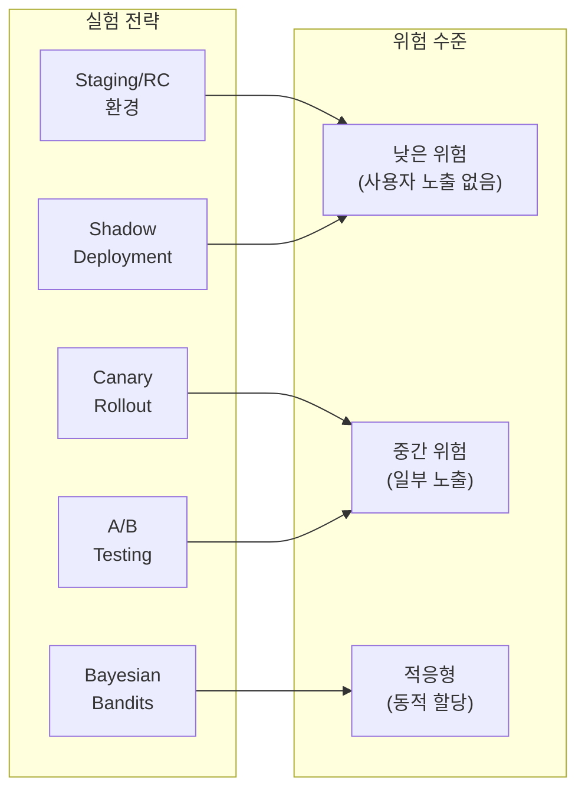

#### 7.2 Shadow Deployment

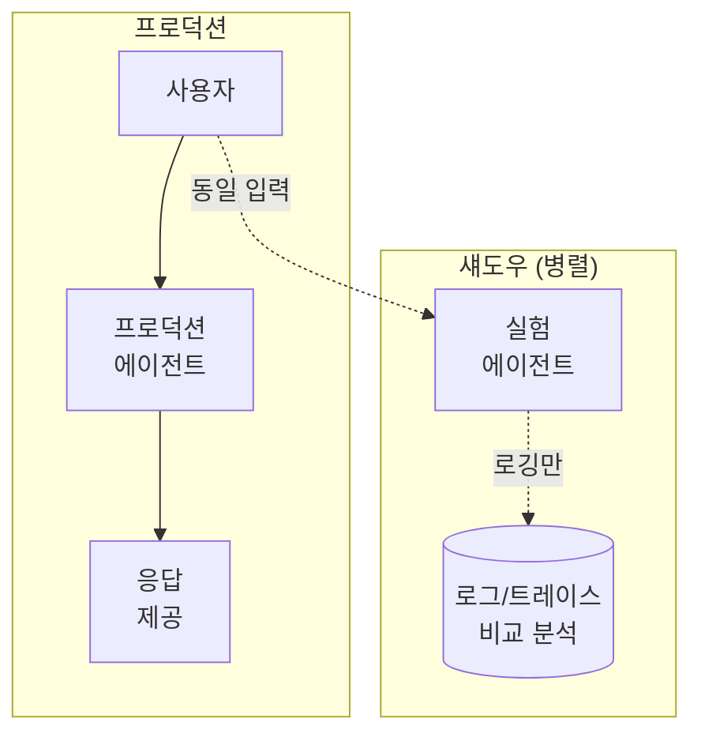

**구현**:
```python
import asyncio
import uuid
from typing import Any, Dict

async def shadow_deployment_handler(
    request: Dict[str, Any],
    production_agent,
    shadow_agent
) -> Dict[str, Any]:
    """Shadow Deployment: 실험 에이전트 병렬 실행 (응답 미제공)"""
    request_id = str(uuid.uuid4())

    # 프로덕션 에이전트 실행 (응답 제공)
    prod_task = asyncio.create_task(
        production_agent.invoke(request, trace_id=request_id)
    )

    # 섀도우 에이전트 실행 (로깅만, 응답 미제공)
    shadow_task = asyncio.create_task(
        shadow_agent.invoke(
            request,
            trace_id=request_id,
            shadow=True  # 응답 미제공 플래그
        )
    )

    # 프로덕션 응답만 반환
    prod_response = await prod_task

    # 섀도우 결과는 백그라운드에서 비교 로깅
    asyncio.create_task(
        log_shadow_comparison(request_id, prod_response, shadow_task)
    )

    return prod_response


async def log_shadow_comparison(
    request_id: str,
    prod_response: Dict,
    shadow_task: asyncio.Task
):
    """프로덕션 vs 섀도우 결과 비교 로깅"""
    try:
        shadow_response = await asyncio.wait_for(shadow_task, timeout=30)

        comparison = {
            "request_id": request_id,
            "production": {
                "latency_ms": prod_response.get("latency_ms"),
                "tools_called": prod_response.get("tools_called"),
                "output": prod_response.get("output")[:200]  # 요약
            },
            "shadow": {
                "latency_ms": shadow_response.get("latency_ms"),
                "tools_called": shadow_response.get("tools_called"),
                "output": shadow_response.get("output")[:200]
            },
            "discrepancies": detect_discrepancies(prod_response, shadow_response)
        }

        log_to_analytics("shadow_comparison", comparison)

    except Exception as e:
        log_to_analytics("shadow_error", {
            "request_id": request_id,
            "error": str(e)
        })
```

#### 7.3 A/B Testing

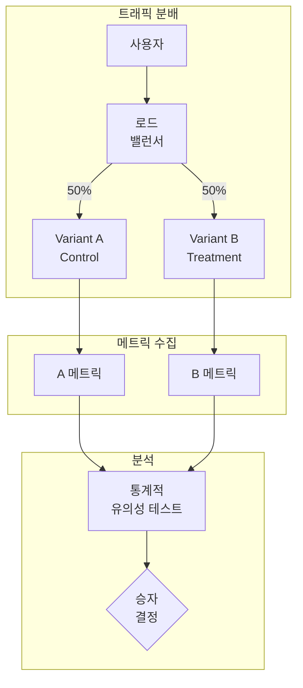

**구현**:
```python
import hashlib
import random
from typing import Dict, List, Optional
from dataclasses import dataclass
from scipy import stats
import numpy as np

@dataclass
class ABTestConfig:
    test_name: str
    variants: List[str]  # ["control", "treatment"]
    allocation: Dict[str, float]  # {"control": 0.5, "treatment": 0.5}
    metrics: List[str]  # ["success_rate", "latency", "satisfaction"]
    min_sample_size: int = 1000

class ABTestManager:
    """A/B 테스트 관리자"""

    def __init__(self, config: ABTestConfig):
        self.config = config
        self.results: Dict[str, List[float]] = {v: [] for v in config.variants}

    def assign_variant(self, user_id: str) -> str:
        """사용자를 변형에 할당 (Sticky Assignment)"""
        # 해시 기반 일관된 할당
        hash_value = int(hashlib.md5(
            f"{self.config.test_name}:{user_id}".encode()
        ).hexdigest(), 16)

        rand_value = (hash_value % 10000) / 10000
        cumulative = 0.0

        for variant, allocation in self.config.allocation.items():
            cumulative += allocation
            if rand_value < cumulative:
                return variant

        return self.config.variants[0]  # 기본값

    def record_outcome(self, variant: str, metric: str, value: float):
        """결과 기록"""
        if variant in self.results:
            self.results[variant].append(value)

    def analyze_significance(self) -> Dict[str, any]:
        """통계적 유의성 분석"""
        control = np.array(self.results.get("control", []))
        treatment = np.array(self.results.get("treatment", []))

        if len(control) < 30 or len(treatment) < 30:
            return {"status": "insufficient_data"}

        # t-test
        t_stat, p_value = stats.ttest_ind(control, treatment)

        # 효과 크기 (Cohen's d)
        pooled_std = np.sqrt(
            (np.std(control)**2 + np.std(treatment)**2) / 2
        )
        cohens_d = (np.mean(treatment) - np.mean(control)) / pooled_std

        return {
            "control_mean": np.mean(control),
            "treatment_mean": np.mean(treatment),
            "control_std": np.std(control),
            "treatment_std": np.std(treatment),
            "t_statistic": t_stat,
            "p_value": p_value,
            "cohens_d": cohens_d,
            "significant": p_value < 0.05,
            "winner": "treatment" if (
                p_value < 0.05 and np.mean(treatment) > np.mean(control)
            ) else "control" if (
                p_value < 0.05 and np.mean(control) > np.mean(treatment)
            ) else "inconclusive"
        }
```

#### 7.4 Bayesian Bandits

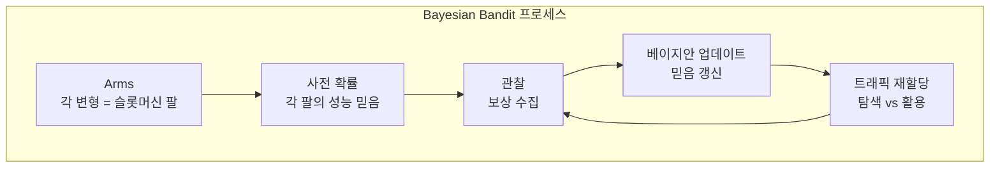

**구현**:
```python
import numpy as np
from typing import Dict, List, Tuple
from scipy.stats import beta

class BayesianBandit:
    """Thompson Sampling 기반 Bayesian Bandit"""

    def __init__(self, arms: List[str], prior_alpha: float = 1, prior_beta: float = 1):
        """
        Args:
            arms: 변형 이름 리스트
            prior_alpha: Beta 분포 알파 (성공 사전)
            prior_beta: Beta 분포 베타 (실패 사전)
        """
        self.arms = arms
        # 각 팔의 (alpha, beta) 파라미터
        self.params: Dict[str, Tuple[float, float]] = {
            arm: (prior_alpha, prior_beta) for arm in arms
        }
        self.history: Dict[str, List[int]] = {arm: [] for arm in arms}

    def select_arm(self) -> str:
        """Thompson Sampling으로 팔 선택"""
        samples = {}
        for arm, (alpha, b) in self.params.items():
            # Beta 분포에서 샘플링
            samples[arm] = beta.rvs(alpha, b)

        # 가장 높은 샘플 값을 가진 팔 선택
        return max(samples, key=samples.get)

    def update(self, arm: str, reward: int):
        """보상 관찰 후 베이지안 업데이트

        Args:
            arm: 선택된 팔
            reward: 보상 (1=성공, 0=실패)
        """
        alpha, b = self.params[arm]
        # 베이지안 업데이트: Beta(alpha + reward, beta + 1 - reward)
        self.params[arm] = (alpha + reward, b + 1 - reward)
        self.history[arm].append(reward)

    def get_allocation(self) -> Dict[str, float]:
        """현재 예상 트래픽 할당"""
        total_samples = 10000
        selections = {arm: 0 for arm in self.arms}

        for _ in range(total_samples):
            arm = self.select_arm()
            selections[arm] += 1

        return {arm: count / total_samples for arm, count in selections.items()}

    def get_arm_stats(self) -> Dict[str, Dict]:
        """각 팔의 통계"""
        stats = {}
        for arm, (alpha, b) in self.params.items():
            mean = alpha / (alpha + b)
            variance = (alpha * b) / ((alpha + b)**2 * (alpha + b + 1))

            stats[arm] = {
                "alpha": alpha,
                "beta": b,
                "expected_reward": mean,
                "variance": variance,
                "total_trials": len(self.history[arm]),
                "successes": sum(self.history[arm])
            }
        return stats


# 사용 예시
bandit = BayesianBandit(arms=["prompt_v1", "prompt_v2", "prompt_v3"])

# 시뮬레이션
for _ in range(1000):
    arm = bandit.select_arm()

    # 실제로는 에이전트 실행 후 성공 여부 판단
    true_success_rates = {"prompt_v1": 0.6, "prompt_v2": 0.75, "prompt_v3": 0.65}
    reward = 1 if np.random.random() < true_success_rates[arm] else 0

    bandit.update(arm, reward)

# 결과 확인
print("Arm Stats:", bandit.get_arm_stats())
print("Current Allocation:", bandit.get_allocation())
```

---

### 8. 지속적 학습 (Continuous Learning)

```
원칙: 개선을 시스템 동작에 내재화 - 세션 내 즉각 적응부터 오프라인 재훈련까지
```

#### 8.1 학습 메커니즘 비교

| 메커니즘 | 범위 | 지속성 | 적합 상황 |
|----------|------|--------|-----------|
| **In-Context Learning** | 세션 내 | 휘발성 | 즉각 적응, 빠른 테스트, 개인화 |
| **Offline Retraining** | 시스템 전체 | 영구적 | 체계적 이슈, 장기 정렬, 대규모 업데이트 |

#### 8.2 In-Context Learning

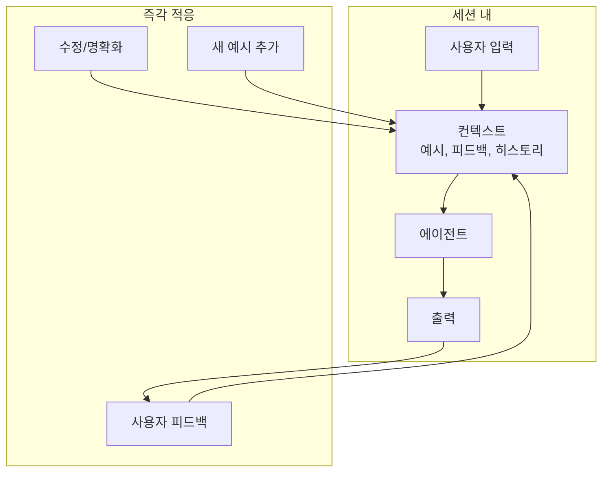

**강점**:
- 사용자별 적응 (개인화)
- 실시간 피드백 반영
- 추론 단계 가이드
- 즉각적 효과

**한계**:
- 세션 종료 시 소실
- 컨텍스트 윈도우 제한
- 성공적 전략은 영구 메커니즘으로 승격 필요

#### 8.3 Offline Retraining

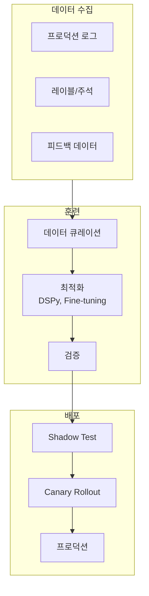

**프로세스**:
1. **데이터 큐레이션**: 다양성, 균형, 품질 확보
2. **모델 업데이트**: DSPy 최적화, LoRA 파인튜닝
3. **검증**: 오프라인 벤치마크, Shadow 테스트
4. **롤아웃**: Canary → 점진적 확대

---

## 심화 학습

### 프레임워크 비교

| 프레임워크 | 유형 | 주요 기능 |
|-----------|------|-----------|
| **DSPy** | 프롬프트 최적화 | 선언적 서명, BootstrapFewshot, MIPROv2 |
| **Microsoft Trace** | 생성적 최적화 | 일반 피드백, 블랙박스 시스템 |
| **APO** | 자동 프롬프트 | 데이터 기반 자동 개선 |
| **Optuna** | 하이퍼파라미터 | 베이지안 최적화, 분산 |
| **Ray Tune** | 분산 실험 | 스케일러블, 다양한 알고리즘 |

### 실험 전략 선택 가이드

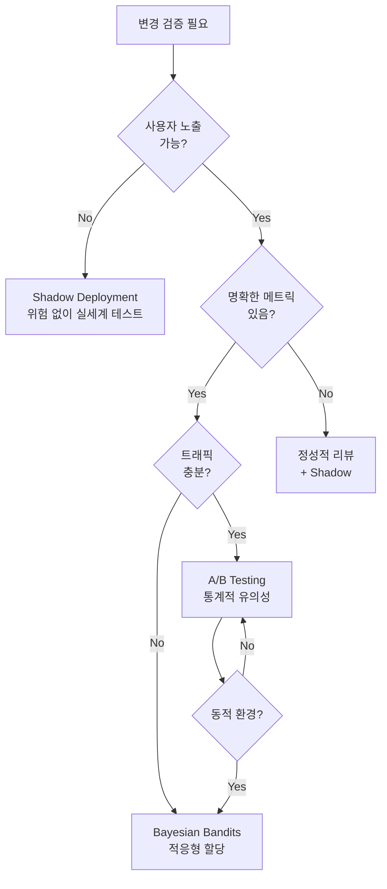

---

## 실무 적용 포인트

### 즉시 적용 가능

1. **기본 피드백 파이프라인**
   - 로그 기반 실패 패턴 클러스터링
   - 에스컬레이션 임계값 설정

2. **DSPy 프롬프트 최적화**
   - 핵심 워크플로우에 10-20개 예시로 시작
   - BootstrapFewshot 적용

3. **Shadow Deployment**
   - 주요 변경 전 병렬 실행
   - 메트릭 비교 자동화

### 중기 적용

1. **A/B 테스트 프레임워크**
   - Sticky assignment 구현
   - 통계적 유의성 분석

2. **개선 백로그 시스템**
   - 우선순위 점수 계산
   - Quick Win 식별

3. **HITL 리뷰 워크플로우**
   - 에스컬레이션 기준 정의
   - 다학제 팀 구성

### 장기 전략

1. **Bayesian Bandits**
   - 동적 트래픽 할당
   - 다중 변형 동시 테스트

2. **Offline Retraining 파이프라인**
   - 정기적 데이터 수집 및 큐레이션
   - 자동화된 검증 및 배포

3. **조직 문화**
   - 모든 실패를 학습 기회로
   - 실험 우선 문화

---

## 핵심 개념 체크리스트

### 피드백 파이프라인

- [ ] 자동화된 이슈 탐지 (규칙, 이상 탐지, 클러스터링)
- [ ] 근본 원인 분석 (RCA) 프로세스
- [ ] HITL 에스컬레이션 기준 (확실성, 영향도)
- [ ] DSPy/APO 기반 프롬프트 최적화
- [ ] 도구 정제 및 검증

### 실험

- [ ] Shadow Deployment: 위험 없는 실세계 테스트
- [ ] A/B Testing: 통계적 유의성 검증
- [ ] Bayesian Bandits: 적응형 트래픽 할당
- [ ] 메트릭 정의 및 샘플 크기 계산

### 지속적 학습

- [ ] In-Context Learning: 세션 내 즉각 적응
- [ ] Offline Retraining: 영구적 개선 내재화
- [ ] 컨텍스트 관리 (롤링 윈도우, 압축)
- [ ] 검증 → Shadow → Canary → 프로덕션 파이프라인

### 조직

- [ ] 개선 백로그 관리
- [ ] 우선순위화 프레임워크
- [ ] 문서화 및 지식 공유
- [ ] 실험 문화 구축

---

## 참고 자료

### 프레임워크 및 도구
- DSPy: https://github.com/stanfordnlp/dspy
- Microsoft Trace: https://github.com/microsoft/Trace
- LaunchDarkly: https://launchdarkly.com
- Optimizely: https://optimizely.com

### 아키텍처 다이어그램

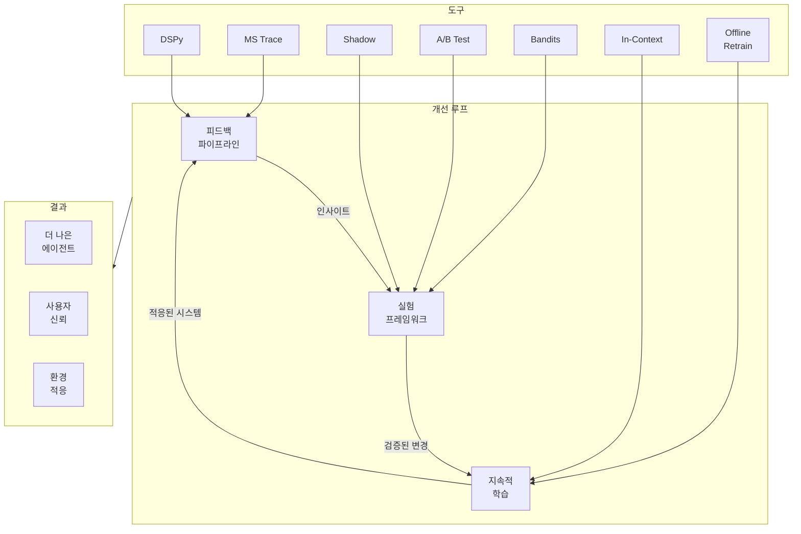
