# Chapter 13: Human-Agent Collaboration

## 핵심 요약

> **Human-Agent 협업의 성공은 기술적 역량만큼이나 인터페이스 설계, 신뢰 보정(Trust Calibration), 거버넌스 구조에 달려 있다. 핵심은 자율성 보정(Autonomy Calibration)—언제 Agent가 독립적으로 행동하고, 언제 질문하며, 언제 완전히 위임해야 하는지 아는 것이다.**

이 장에서는 Human-Agent 협업의 두 축을 다룬다: (1) 상호작용 수준의 메커니즘(인터페이스, 불확실성 신호, 핸드오프)과 (2) 거버넌스 구조(감독, 규정 준수, 신뢰 보정). Progressive Delegation 전략—간단한 초안이나 제안에서 시작하여 신뢰가 쌓이면서 더 큰 독립성을 부여하는 방식—을 통해 불투명한 어시스턴트를 신뢰할 수 있는 팀원으로 전환한다.

---

## 학습 목표

이 장을 학습한 후 다음을 할 수 있어야 한다:

1. **Human 역할 진화** 이해 (Executor → Reviewer → Collaborator → Governor)
2. **Progressive Delegation** 전략 설계 및 구현
3. **Agent Scope** 분류 및 적절한 거버넌스 적용 (Personal → Organizational)
4. **Trust Lifecycle** 관리 및 Trust Repair 메커니즘 설계
5. **Accountability Framework** 구축 (Audit, Logging, Traceability)
6. **Escalation Design** 및 Human Oversight 구조 설계
7. **Privacy 및 Regulatory Compliance** 요구사항 통합

---

## 본문 정리

### 1. 역할과 자율성 (Roles and Autonomy)

#### 1.1 Human 역할의 진화

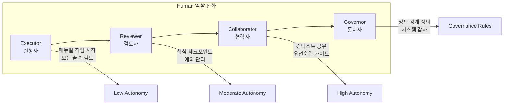

| 역할 | Human 책임 | Agent 자율성 | 인터페이스 요구사항 |
|-----|-----------|-------------|-------------------|
| **Executor** | 작업 업로드, 모든 출력 검토 | 최소 (감독 하) | 단계별 가이던스, 타이트한 피드백 루프 |
| **Reviewer** | 핵심 출력 스팟 체크 | 중간 (루틴 작업 처리) | 대시보드, 예외 플래그, 신뢰도 점수 |
| **Collaborator** | 우선순위 가이드, 공동 주석 | 높음 (감독 하 초안/실행) | 공유 계획 UI, 컨텍스트 주석 |
| **Governor** | 정책 설정, 결정 감사, 에스컬레이션 감독 | 거버넌스 규칙 내 자율 | 정책 설정 화면, 감사 로그, 설명 가능성 도구 |

#### 1.2 실제 사례: 역할 진화

**JPMorganChase COiN (Contract Intelligence)**:
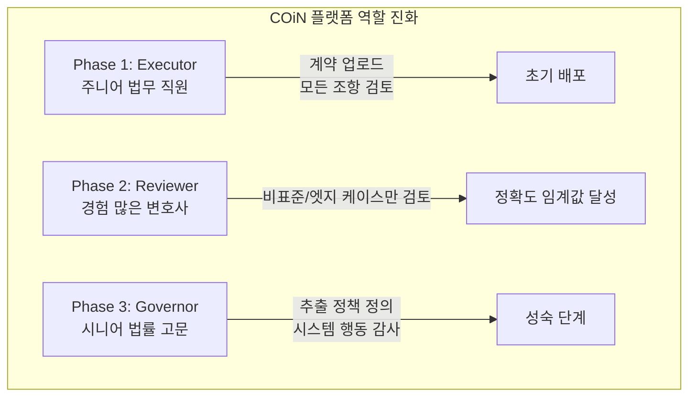

**GitLab Security Bot**:
- **Executor**: SAST/DAST 스캔, 취약점 플래그
- **Reviewer**: 보안 챔피언이 발견 사항 검토/분류
- **Governor**: 시니어 보안 리더가 규칙 및 에스컬레이션 로그 감사

#### 1.3 Stakeholder 정렬 및 채택 추진

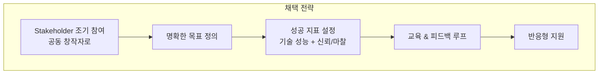

**ZoomInfo GitHub Copilot 4단계 롤아웃**:

| 단계 | 규모 | 성공 지표 | 결과 |
|-----|------|----------|------|
| Pilot | 50명 엔지니어 | 제안 수락률, 개발자 만족도 | 33% 수락률, 72% 만족도 |
| Expansion | 전체 400+ 명 | 임계값 충족 확인 | 핵심 생산성 도구로 전환 |

> **핵심 교훈**: 각 확장을 구체적인 Trust Signal에 연결하여 "있으면 좋은 것"에서 "필수 도구"로 전환

---

### 2. 협업 확장 (Scaling Collaboration)

#### 2.1 Agent Scope 분류

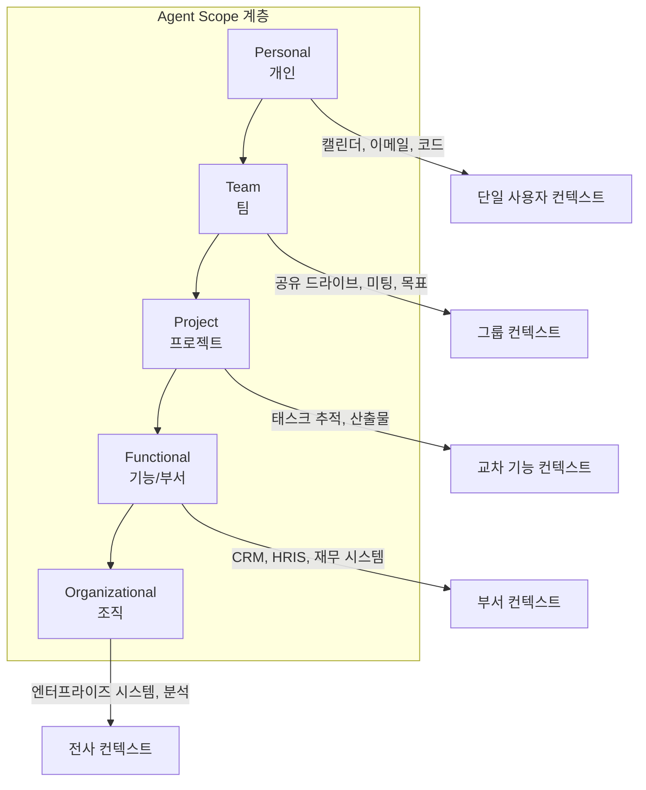

| Scope | 주요 사용자 | 접근 범위 | 결정 자율성 | 예시 |
|-------|-----------|----------|------------|------|
| **Personal** | 개인 | 이메일, 캘린더, 문서, 코드 | 낮음~중간 | 임원 비서, Dev Copilot |
| **Team** | 그룹/매니저 | 공유 드라이브, 미팅, 목표 | 중간 | 스프린트 계획 어시스턴트, 미팅 봇 |
| **Project** | 교차 기능 그룹 | 태스크 추적, 산출물 | 중간~높음 | R&D 프로그램 Agent, 런치 조정 봇 |
| **Functional** | 부서 | CRM, HRIS, 재무 시스템 | 높음 (도메인 내) | HR Agent, 컴플라이언스 Agent |
| **Organizational** | 리더십/IT/CIO | 엔터프라이즈 시스템, 분석 | 높음 또는 제한 | 전사 분석 Agent, AI 헬프데스크 |

#### 2.2 Scope별 거버넌스 요구사항

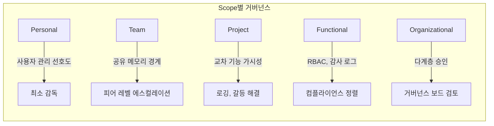

| Scope | 자율성 수준 | 리스크 프로필 | 거버넌스 요구사항 |
|-------|-----------|-------------|------------------|
| Personal | 낮음~중간 | 낮음 | 사용자 관리 선호도; 최소 감독 |
| Team | 중간 | 중간 | 공유 메모리 경계; 피어 에스컬레이션; 신뢰 보정 |
| Project | 중간~높음 | 중간~높음 | 교차 기능 가시성; 로깅; 갈등 해결 |
| Functional | 높음 (도메인 내) | 높음 | RBAC; 감사 로그; 컴플라이언스 정렬 |
| Organizational | 높음 또는 제한 | 매우 높음 | 다계층 승인; 거버넌스 보드; 윤리 감사 |

#### 2.3 공유 메모리 및 컨텍스트 경계

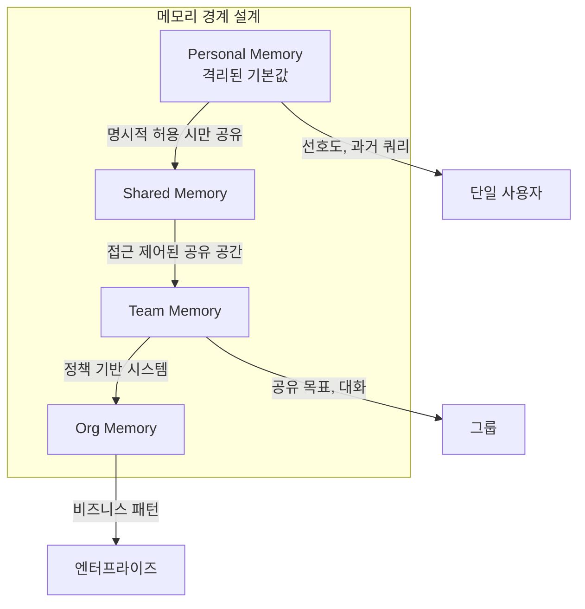

**메모리 설계 원칙**:
- **Personal Agent**: 격리된 메모리 기본값, 명시적 허용 시에만 공유
- **Team/Dept Agent**: 접근 제어된 공유 메모리 공간
- **Org Agent**: 정책 기반 시스템 (보존 규칙, 로깅, 감사 가능성)

**투명성 요구사항**:
- Agent가 기억하는 내용과 이유 설명 가능
- 사용자가 메모리 검사/삭제 가능
- 숨겨진 가정 기반 행동 금지

---

### 3. 신뢰, 거버넌스, 컴플라이언스

#### 3.1 Trust Lifecycle

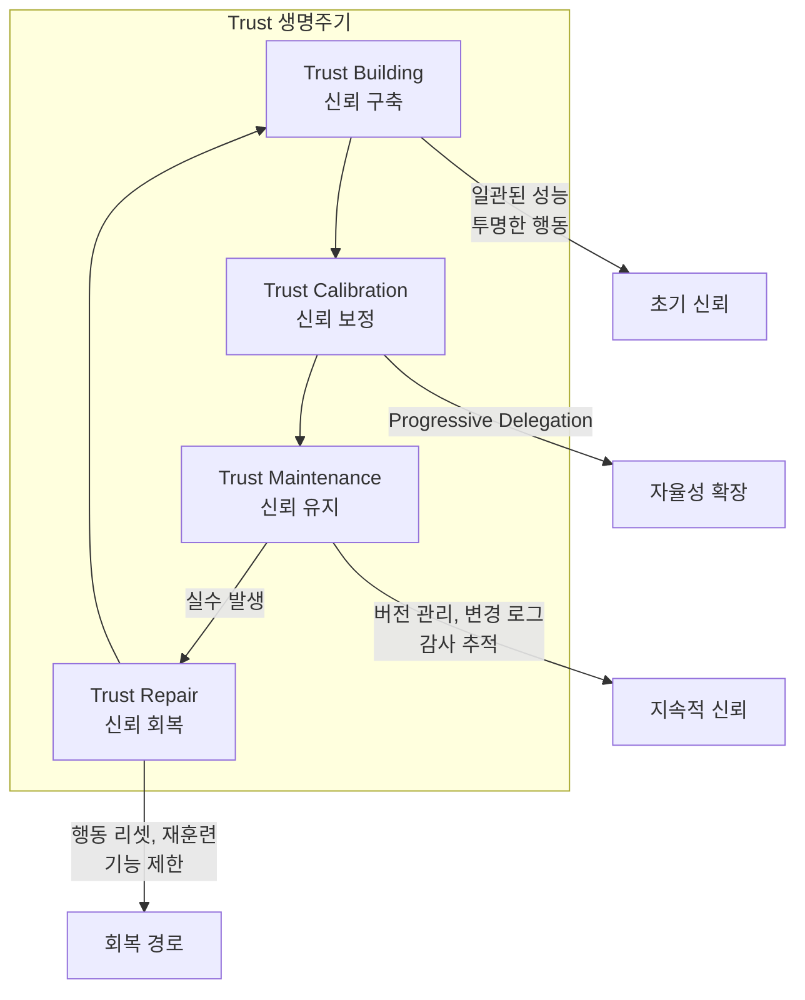

**Progressive Delegation 패턴**:

| 단계 | Agent 행동 | Human 역할 | 예시 |
|-----|-----------|-----------|------|
| 초기 | 신중하게 행동, 검토/승인 요청 | 모든 출력 검토 | 팀 Agent가 상태 보고서 초안 작성 |
| 성장 | 신뢰성 입증에 따라 자율성 확대 | 예외만 검토 | 팀 Agent가 보고서 직접 전송 |
| 성숙 | 정의된 범위 내 자율 운영 | 정책 설정 및 감사 | 재무 Agent가 $1K 미만 자동 승인 |

**Trust Repair 메커니즘**:
- 행동 리셋
- 재훈련/프롬프트 튜닝
- 기능 제한
- 명시적 회복 경로 제공

> **경고 사례**: Klarna 2024년 700명 CS 직원을 AI 챗봇으로 대체 → 공감/미묘한 판단 부재로 불만 급증 → 2025년 중반 인간 상담원 재고용

#### 3.2 Accountability Framework

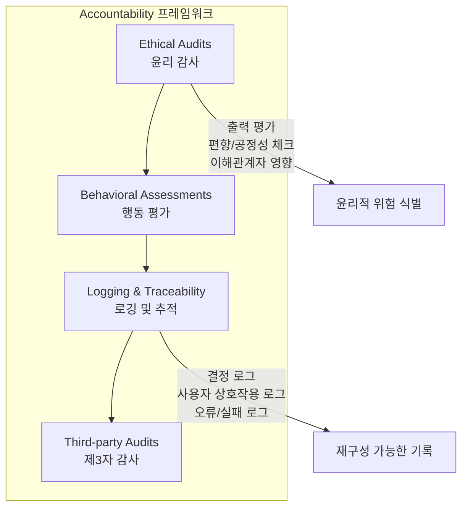

**윤리 감사 구성요소**:
1. **출력 평가**: Agent 행동이 의도된 목표/윤리 지침과 일치하는지
2. **편향/공정성 체크**: 출력의 편향 또는 불공정 패턴 식별
3. **결정 경로 분석**: Agent가 권장/결정에 도달하는 방법 검토
4. **이해관계자 영향 평가**: 다양한 사용자 그룹에 미치는 영향 고려

**로깅 시스템 구성**:
- **결정 로그**: 특정 결정 이유 (입력, 중간 추론, 출력)
- **사용자 상호작용 로그**: 입력/응답 + 타임스탬프
- **오류/실패 로그**: 실패 시점과 이유 문서화

**활용 가능한 프레임워크**:
- **NIST AI RMF**: Govern, Map, Measure, Manage 4가지 핵심 기능
- **Co-designed AI Impact Assessment Template**: EU AI Act, NIST AI RMF, ISO 42001 정렬

#### 3.3 Escalation Design 및 Human Oversight

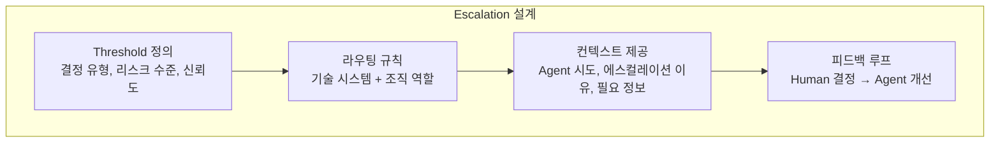

**Escalation 예시**:

| Agent 유형 | 자율 처리 | 에스컬레이션 대상 | 플래그 대상 |
|-----------|----------|-----------------|-----------|
| 고객 지원 | 루틴 문의 | 청구 분쟁 → 인간 감독자 | 잠재적 남용 → Trust & Safety |
| 구매 | $1K 미만 자동 승인 | $1K 이상 → 다자 승인 | - |

**Oversight 역할**:
- 기존 구조: 라인 매니저, 컴플라이언스 리드
- 신규 포지션: AI Operations Analyst, Agent Governance Officer

#### 3.4 Privacy 및 Regulatory Compliance

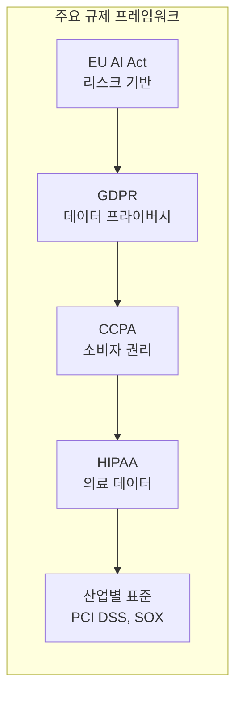

| 규제 | 범위 | 핵심 요구사항 |
|-----|------|-------------|
| **EU AI Act** | AI 시스템 전반 | 리스크 수준별 분류, 투명성, 책임성, Human Oversight |
| **GDPR** | 데이터 보호 | 데이터 최소화, 사용자 동의, 삭제/수정 권리 |
| **CCPA** | 캘리포니아 거주자 | 데이터 보호, 투명성, 동의, 접근 권리 |
| **HIPAA** | 의료 데이터 | 엄격한 프라이버시/보안 요구사항 |
| **PCI DSS** | 결제 처리 | 결제 데이터 보안 표준 |
| **SOX** | 재무 보고 | 재무 보고 무결성 |

**CI/CD 파이프라인 통합 전략**:

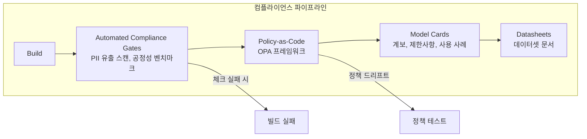

---

### 4. Human-Agent 팀의 미래

#### 4.1 책의 핵심 여정 요약

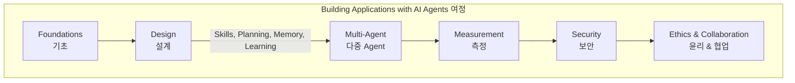

#### 4.2 실천 원칙 4가지

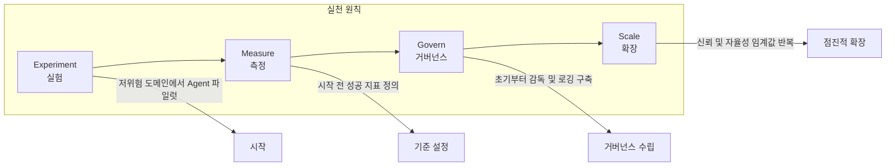

| 원칙 | 설명 | 핵심 활동 |
|-----|------|----------|
| **Experiment** | 저위험 도메인에서 Agent 파일럿 | 파일럿 범위 정의, 초기 사용자 선정 |
| **Measure** | 시작 전 성공 지표 정의 | 기술 + 신뢰/마찰 지표 설정 |
| **Govern** | 초기부터 감독 및 로깅 구축 | Accountability Framework 적용 |
| **Scale** | 신뢰 및 자율성 임계값 반복 | Progressive Delegation 실행 |

#### 4.3 미래 비전

> **"Agent 시스템을 단순히 똑똑(Smart)하게가 아니라 현명(Wise)하게, 단순히 효율적이 아니라 정의롭게(Just), 단순히 역량 강화가 아니라 인간 번영(Human Flourishing)에 깊이 헌신하도록 만들자."**

---

## 심화 학습

### Human-Agent 협업 성숙도 모델

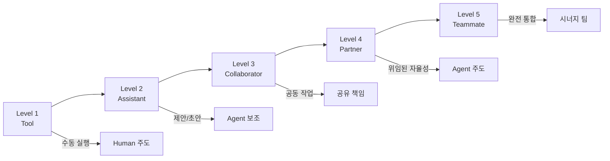

### Trust Signal 매트릭스

| 신호 유형 | 측정 방법 | 임계값 예시 |
|----------|----------|-----------|
| **정확도** | 출력 정확성 비율 | >95% 정확도 |
| **일관성** | 동일 입력 동일 출력 | >90% 일관성 |
| **투명성** | 설명 제공 빈도 | 모든 중요 결정에 설명 |
| **회복력** | 오류 후 복구 시간 | <1시간 복구 |
| **수용률** | 사용자 제안 수락률 | >70% 수락 |
| **만족도** | 사용자 만족도 조사 | >75% 만족 |

---

## 실무 적용 포인트

### Human-Agent 협업 설계 체크리스트

```
□ 역할 및 자율성 설계
  □ Human 역할 정의 (Executor/Reviewer/Collaborator/Governor)
  □ Progressive Delegation 전략 수립
  □ 역할별 인터페이스 요구사항 정의
  □ Trust Signal 및 임계값 설정

□ Scope 설계
  □ Agent Scope 분류 (Personal → Organizational)
  □ Scope별 RBAC/ABAC 구현
  □ Scope별 거버넌스 정책 정의
  □ 공유 메모리 경계 설계

□ Trust 관리
  □ Trust Lifecycle 관리 프로세스
  □ Trust Repair 메커니즘 구현
  □ 투명성 기능 (신뢰도 점수, 설명)
  □ 버전 관리, 변경 로그, 감사 추적

□ Accountability Framework
  □ 윤리 감사 프로세스 수립
  □ 편향/공정성 체크 통합
  □ 로깅 시스템 구현 (결정, 상호작용, 오류)
  □ 추적 가능성 메커니즘 (재구성 가능)
  □ 제3자 감사 계획

□ Escalation 및 Oversight
  □ Escalation 임계값 정의
  □ 라우팅 규칙 (기술 + 조직)
  □ 컨텍스트 제공 메커니즘
  □ Human Oversight 역할 정의
  □ 피드백 루프 설계

□ Compliance
  □ 적용 가능한 규제 식별 (GDPR, CCPA, HIPAA 등)
  □ Automated Compliance Gates (CI/CD 통합)
  □ Policy-as-Code 구현
  □ Model Cards / Datasheets 생성
  □ 지속적 규제 모니터링

□ 채택 전략
  □ Stakeholder 조기 참여 및 정렬
  □ 명확한 목표 및 성공 지표 정의
  □ 단계별 롤아웃 계획 (Pilot → Scale)
  □ 교육 및 피드백 루프 구축
```

### 역할별 인터페이스 설계 가이드

| 역할 | 핵심 인터페이스 요소 | 설계 원칙 |
|-----|-------------------|----------|
| **Executor** | 단계별 가이드, 피드백 루프 | 명확한 지시, 타이트한 검증 |
| **Reviewer** | 대시보드, 예외 플래그, 신뢰도 점수 | 빠른 스캔, 예외 집중 |
| **Collaborator** | 공유 계획 UI, 컨텍스트 주석 | 공동 편집, 실시간 동기화 |
| **Governor** | 정책 설정, 감사 로그, 설명 도구 | 시스템 뷰, 추세 분석 |

---

## 핵심 개념 체크리스트

### 이해도 자가 점검

| 개념 | 설명 가능 | 설계 가능 | 최적화 가능 |
|-----|:--------:|:--------:|:----------:|
| Human 역할 진화 (Executor → Governor) | □ | □ | - |
| Progressive Delegation | □ | □ | □ |
| Agent Scope (Personal → Organizational) | □ | □ | □ |
| Scope별 RBAC/거버넌스 | □ | □ | □ |
| 공유 메모리 경계 | □ | □ | □ |
| Trust Lifecycle | □ | □ | □ |
| Trust Repair 메커니즘 | □ | □ | □ |
| Accountability Framework | □ | □ | □ |
| 윤리 감사 / 행동 평가 | □ | □ | □ |
| 로깅 및 추적 가능성 | □ | □ | □ |
| Escalation Design | □ | □ | □ |
| Regulatory Compliance (GDPR, CCPA 등) | □ | □ | □ |

---

## 참고 자료

### Accountability Framework
- [NIST AI Risk Management Framework (AI RMF)](https://www.nist.gov/itl/ai-risk-management-framework) - Govern, Map, Measure, Manage
- [Co-designed AI Impact Assessment Template](https://github.com/) - EU AI Act, ISO 42001 정렬

### Regulatory Compliance
- [EU AI Act](https://artificialintelligenceact.eu/) - 리스크 기반 AI 규제
- [GDPR](https://gdpr.eu/) - 데이터 보호 규정
- [CCPA](https://oag.ca.gov/privacy/ccpa) - 캘리포니아 소비자 프라이버시 법
- [HIPAA](https://www.hhs.gov/hipaa/) - 의료 정보 보호법

### Policy-as-Code
- [Open Policy Agent (OPA)](https://www.openpolicyagent.org/) - 정책 프레임워크

### 실제 사례
- **JPMorganChase COiN**: 계약 인텔리전스 플랫폼 역할 진화
- **GitLab Security Bot**: Executor → Reviewer → Governor 공존
- **Bank of America Erica**: 20억+ 고객 요청, 신뢰도 표시 및 핸드오프
- **ZoomInfo GitHub Copilot**: 4단계 롤아웃, Trust Signal 기반 확장

---

## 책 전체 요약

**"Building Applications with AI Agents"**는 Agent 시스템의 설계, 오케스트레이션, 보안, UX, 윤리적 고려사항을 포괄적으로 다룬다:

1. **Foundations**: Agent 시스템의 약속, 전통 소프트웨어와의 차이, 강점과 과제
2. **Design**: Skills, Planning, Memory, Learning - 자율적, 적응적, 효과적 운영을 위한 핵심 요소
3. **Multi-Agent**: 협업, 협상, 태스크 분배로 단일 Agent 불가능한 목표 달성
4. **Measurement & Monitoring**: 강건한 평가 프레임워크와 지속적 감독
5. **Security & Resilience**: Foundation Model 보안, 데이터 보호, 위협 완화
6. **Ethics & Collaboration**: 감독, 투명성, 책임성, 공정성, 프라이버시

> **Agent 시스템은 "설정 후 방치" 기술이 아니다—새로운 데이터, 새로운 위협, 변화하는 사회적 기대에 적응하며 지속적으로 평가, 개선, 정렬되어야 한다.**
