# Chapter 1. Introduction - 생성형 AI 디자인 패턴 입문

---

## 📌 핵심 요약

> 생성형 AI(GenAI)는 강력하고 사용하기 쉬워서 비개발자도 쉽게 프로토타입을 만들 수 있지만, **프로덕션 환경에서는 할루시네이션, 비결정적 출력, 학습 방식에 따른 한계** 등 다양한 문제가 발생합니다. 이 책은 파운데이션 모델(GPT, Gemini, Claude 등) 기반 애플리케이션 개발 시 반복적으로 발생하는 문제들에 대한 **32가지 검증된 해결책(디자인 패턴)**을 제시하며, AI 엔지니어가 더 신뢰성 있는 에이전틱(Agentic) 애플리케이션을 구축할 수 있도록 안내합니다.

---

## 🎯 학습 목표

- [ ] **디자인 패턴**의 개념과 AI 엔지니어링에서의 역할 이해
- [ ] **파운데이션 모델**의 학습 과정(Pretraining → SFT → RLHF) 파악
- [ ] **에이전트(Agent)**의 핵심 특성 5가지 설명 가능
- [ ] **생성 제어** 방법(Temperature, Top-K, Top-P, Beam Search) 활용법 이해
- [ ] **In-Context Learning**과 **Post-Training**의 차이점 및 선택 기준 파악

---

## 📖 본문 정리

### 1. GenAI 디자인 패턴이란?

**디자인 패턴(Design Pattern)**은 소프트웨어 개발에서 반복적으로 발생하는 문제에 대한 **검증된 해결책**입니다.

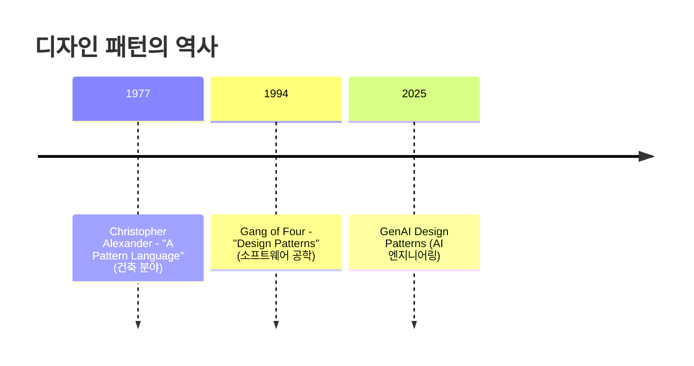

**디자인 패턴의 가치:**
- **공통 어휘 확립**: 개발자 간 효율적 커뮤니케이션
- **품질 향상**: 검증된 솔루션으로 소프트웨어 품질 개선
- **유지보수성/확장성**: 코드의 가독성과 확장 가능한 아키텍처

### 2. AI 엔지니어링: 새로운 접근법

**AI 엔지니어링(AI Engineering)**은 애플리케이션별 커스텀 모델을 처음부터 학습하는 대신, **범용 파운데이션 모델** 위에 애플리케이션을 구축하는 접근법입니다.

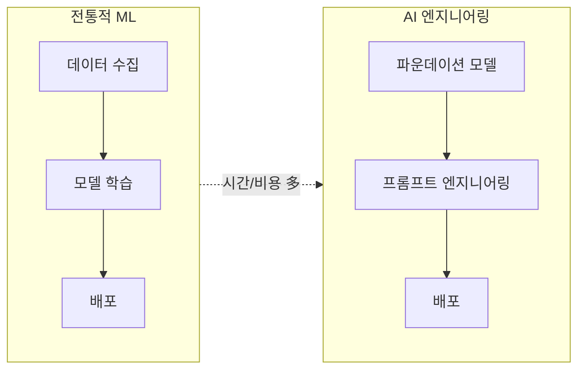

**주요 파운데이션 모델:**

| 모델 | 제공사 | 특징 |
|------|--------|------|
| GPT-4, GPT-4.5 | OpenAI | 최고 수준 추론 능력 |
| Gemini | Google | 멀티모달, 긴 컨텍스트 윈도우(2M 토큰) |
| Claude | Anthropic | 안전성과 정직성 중시 |
| Llama | Meta | 오픈 웨이트, 커스터마이징 가능 |
| DeepSeek | DeepSeek | 비용 효율적, 추론 특화 |

### 3. 프롬프트와 컨텍스트

파운데이션 모델 호출의 기본 구조:

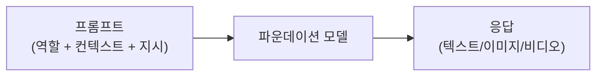

**프롬프트 구성 요소:**

```python
# Anthropic API 예시
completion = client.messages.create(
    model="claude-3-7-sonnet-latest",
    system="You are an expert Python programmer.",  # 역할 (시스템 프롬프트)
    messages=[
        {
            "role": "user",
            "content": "Write code to find the median value."  # 지시 (유저 프롬프트)
        }
    ]
)
```

**LLM 프레임워크 사용의 장점 (PydanticAI):**

```python
from pydantic_ai import Agent

# 모델 문자열만 변경하면 제공사 전환 가능
agent = Agent(
    'anthropic:claude-3-7-sonnet-latest',  # 또는 'openai:gpt-4o-mini'
    system_prompt="You are an expert Python programmer."
)
result = agent.run_sync("Write code to find the median value.")
```

### 4. 파운데이션 모델의 생성 과정

DeepSeek-R1의 학습 단계를 기준으로 설명합니다:

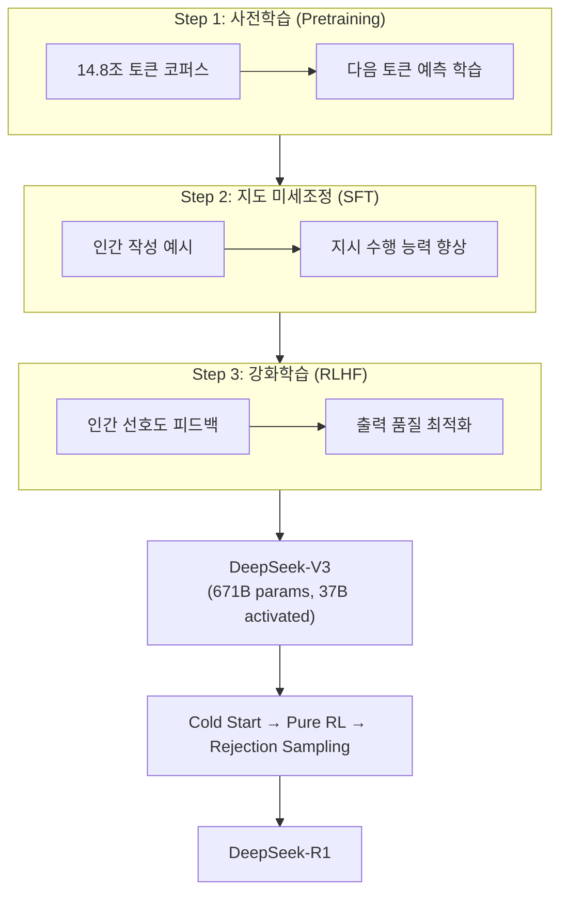

**핵심 용어:**

| 용어 | 설명 |
|------|------|
| **토큰(Token)** | LLM이 처리하는 최소 텍스트 단위. 셰익스피어 전집 ≈ 120만 토큰 |
| **MoE (Mixture of Experts)** | 전체 파라미터 중 일부만 활성화하는 최적화 기법 |
| **RLHF** | 인간 피드백 기반 강화학습 (두 출력 중 더 나은 것 선택) |
| **Chain-of-Thought (CoT)** | 복잡한 문제를 단계별로 추론하는 기법 |

### 5. 파운데이션 모델 생태계

**LMArena 리더보드 (2025년 4월 기준):**

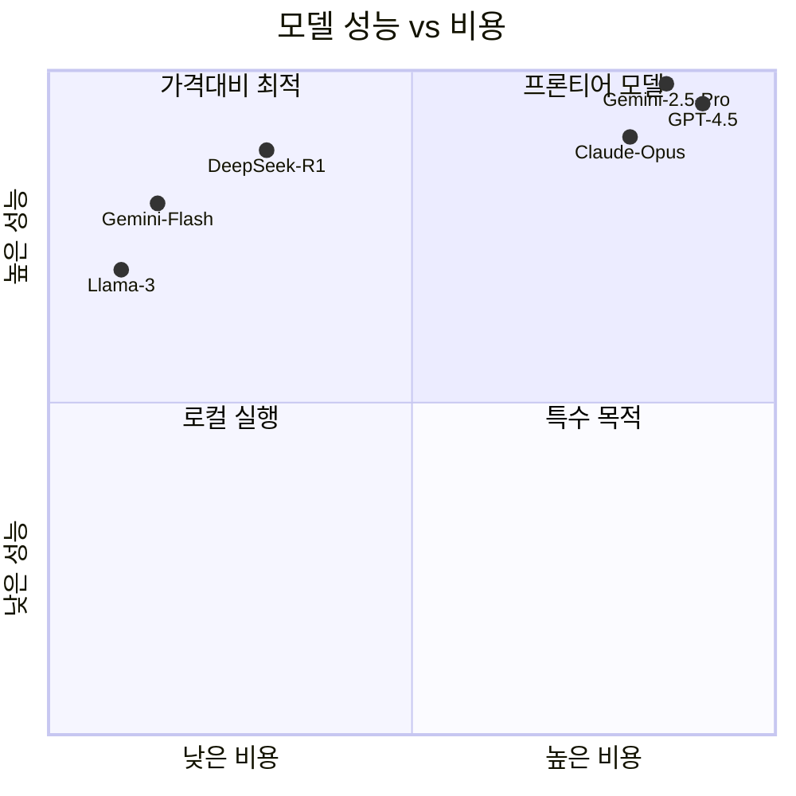

**모델 카테고리:**

| 카테고리 | 특성 | 사용 사례 |
|----------|------|-----------|
| **프론티어 모델** | 최고 성능, 고비용 | 복잡한 추론, 고급 태스크 |
| **디스틸드 모델** | 균형잡힌 성능/비용 | 대용량 처리, 일반 태스크 |
| **오픈 웨이트** | 커스터마이징 가능 | 특화 도메인, 프라이버시 |
| **로컬 실행** | 완전한 프라이버시 | 에어갭 환경, 엣지 디바이스 |

### 6. 에이전틱 AI (Agentic AI)

**에이전트(Agent)**는 사용자를 대신하여 **자율적으로** 작업을 수행하는 AI 소프트웨어입니다.

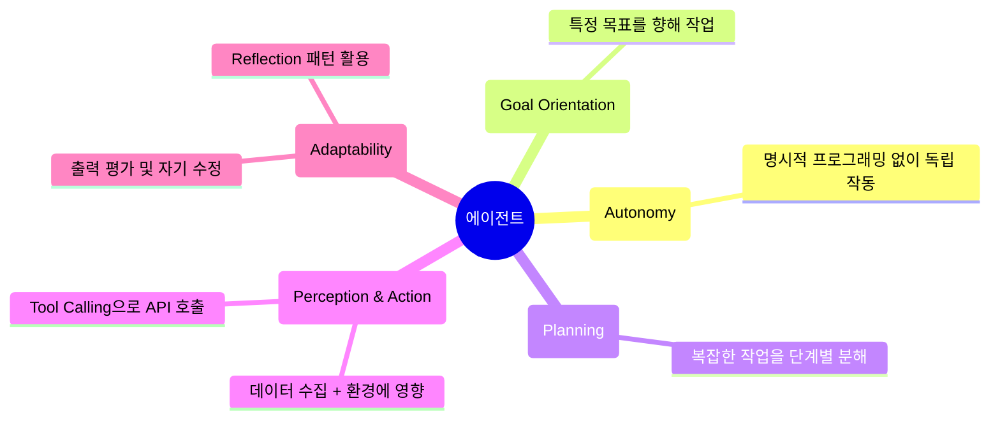

**에이전트 예시 - 재고 관리:**

```python
from pydantic_ai import Agent
from dataclasses import dataclass

@dataclass
class InventoryItem:
    name: str
    quantity_on_hand: int
    weekly_quantity_sold_past_n_weeks: list[int]
    weeks_to_deliver: int

agent = Agent(
    "anthropic:claude-3-7-sonnet-latest",
    system_prompt="You are an inventory manager who orders just in time."
)

items = [
    InventoryItem("itemA", 300, [50, 70, 80, 100], 2),
    InventoryItem("itemB", 100, [70, 80, 90, 70], 2),  # 재주문 필요!
    InventoryItem("itemC", 200, [80, 70, 90, 80], 1)
]

result = agent.run_sync(f"Identify which items need reordering: {items}")
# 결과: itemB - 현재 재고(100)로는 배송 기간(2주) 동안의 수요를 충당 불가
```

> ⚠️ **현실**: 에이전틱 동작은 아직 **열망적 목표(aspirational goal)**입니다. 비결정성, 할루시네이션 등의 문제로 완전 자율 AI는 어렵습니다.

### 7. 생성 제어 (Fine-Grained Control)

#### 7.1 Logits와 Softmax

**Logits**는 모델 마지막 레이어의 정규화되지 않은 원시 출력값입니다.

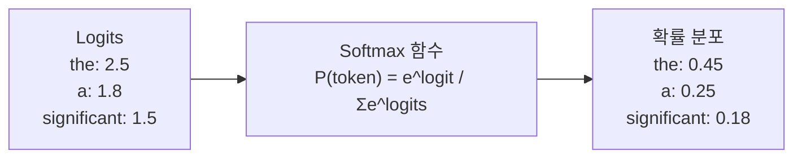

#### 7.2 Temperature (온도)

**Temperature**는 토큰 선택의 무작위성을 제어합니다.

$$P(\text{token}_i) = \frac{e^{\text{logit}_i / T}}{\sum_j e^{\text{logit}_j / T}}$$

| Temperature | 효과 | 사용 사례 |
|-------------|------|-----------|
| **T = 0** | Greedy 샘플링 (가장 높은 확률만 선택) | 사실적 응답, RAG, LLM-as-Judge |
| **T = 0.3~0.5** | 낮은 무작위성 | 코드 생성, 분석 |
| **T = 0.7~1.0** | 높은 무작위성 | 창작 글쓰기, 브레인스토밍 |

```python
# Temperature 설정 예시
agent = Agent(
    'anthropic:claude-3-7-sonnet-latest',
    model_settings={"temperature": 0.5}
)
```

#### 7.3 Top-K vs Top-P (Nucleus) 샘플링

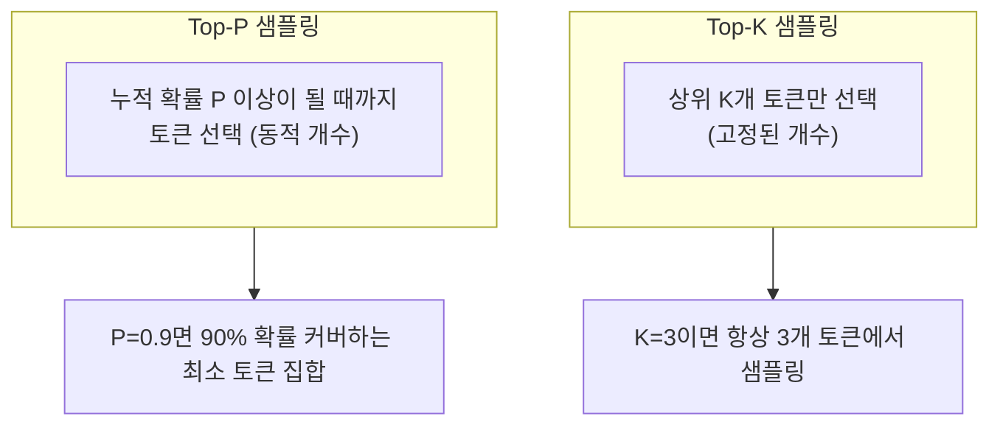

| 특성 | Top-K | Top-P |
|------|-------|-------|
| 선택 방식 | 고정된 K개 | 동적 토큰 수 |
| 적응성 | 모델 신뢰도와 무관 | 신뢰도에 따라 자동 조정 |
| 결과 | 때때로 부자연스러움 | 더 자연스러운 텍스트 |

#### 7.4 Beam Search

여러 시퀀스를 병렬로 탐색하여 **전체 시퀀스의 확률**을 최적화합니다.

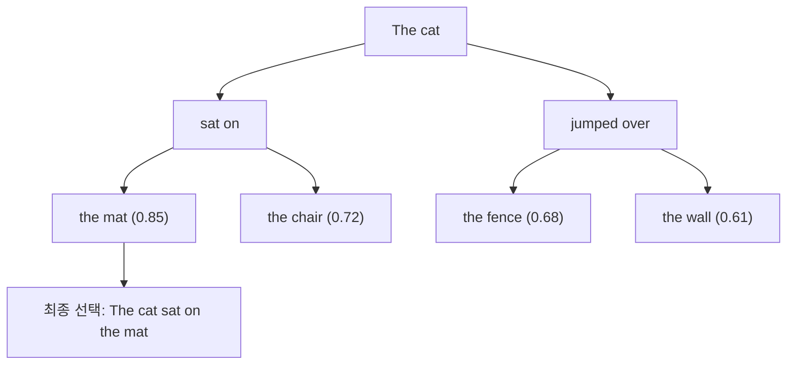

**관련 페널티:**
- **빈도 페널티**: 자주 나타난 단어 확률 감소
- **존재 페널티**: 이미 등장한 단어 확률 감소
- **길이 페널티**: 최소/최대 토큰 수 제어

### 8. In-Context Learning

모델 가중치를 변경하지 않고, **프롬프트의 예시만으로** 새 태스크에 적응하는 능력입니다.

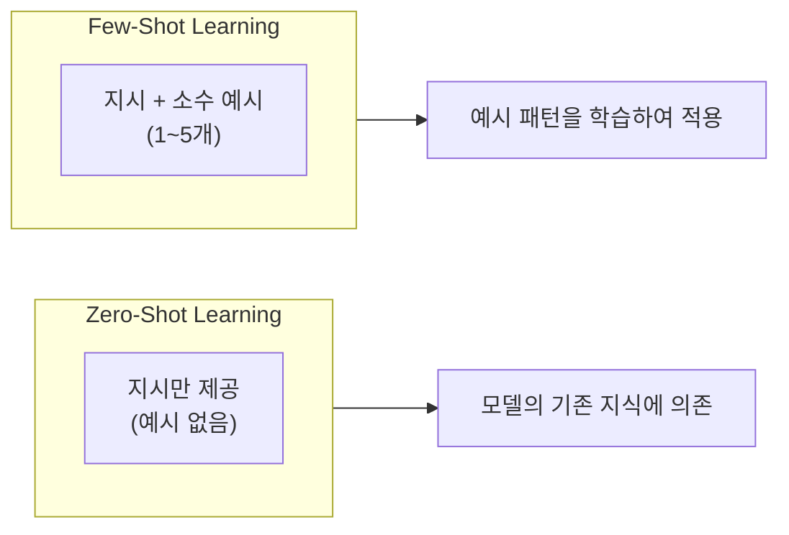

**Few-Shot 예시:**

```python
agent = Agent(MODEL_ID, system_prompt="You are an art history expert.")

result = agent.run_sync("""
Example:
Description: shows two rowboats and a red Sun.
Answer:
   Painting: Impression, Sunrise
   Artist: Claude Monet
   Year: 1872

Description: people eating under a tent, men wearing boating hats.
""")
# 결과: Luncheon of the Boating Party by Pierre-Auguste Renoir
```

**In-Context Learning의 장단점:**

| 장점 | 단점 |
|------|------|
| 빠른 프로토타이핑 | 모델에 기존 지식 필요 |
| 데이터셋 큐레이션 불필요 | 많은 예시 → 토큰 소비 증가 |
| 쉬운 예시 업데이트 | 복잡한 문제 일반화 어려움 |

### 9. Post-Training (사후 학습)

사전학습된 모델의 **가중치를 수정**하여 커스터마이징하는 방법입니다.

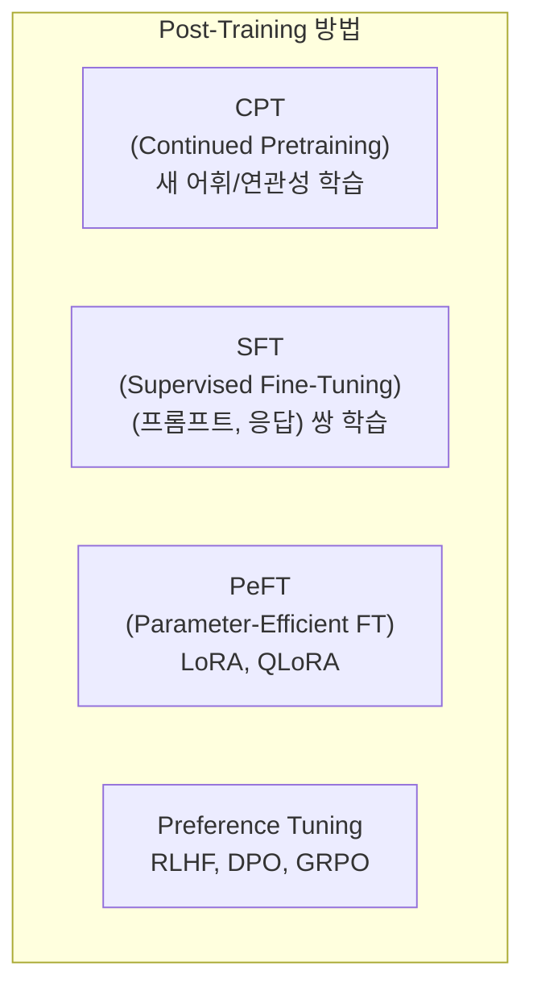

#### LoRA (Low-Rank Adaptation)

대규모 모델을 효율적으로 파인튜닝하는 핵심 기법:

```
원본 가중치 W₀ [d × d] (고정)
     +
어댑터 A × B [d × r] × [r × d]  (r << d)
     =
최종 출력: W₀ + A × B

효과:
- 학습 파라미터: 최대 10,000배 감소
- GPU 메모리: 최대 3배 감소
- 추론 지연: 증가 없음
```

**OpenAI 파인튜닝 예시:**

```python
# 1. 데이터 업로드
training_file = client.files.create(
    file=open("training_data.jsonl", "rb"),
    purpose="fine-tune"
)

# 2. 파인튜닝 작업 시작
job = client.fine_tuning.jobs.create(
    training_file=training_file.id,
    model="gpt-3.5-turbo"
)

# 3. 파인튜닝된 모델 사용
completion = client.chat.completions.create(
    model=job_status.fine_tuned_model,  # ft:gpt-3.5-turbo:org::job_id
    messages=messages
)
```

**파인튜닝 고려사항:**

| 고려사항 | 설명 |
|----------|------|
| **데이터 요구** | 최소 100개 이상의 샘플 필요 |
| **Catastrophic Forgetting** | 파인튜닝 시 기존 지식 손실 가능 |
| **추가 복잡성** | 평가, 편향 검사, 버전 관리 필요 |
| **추가 비용** | API 파인튜닝 비용 또는 GPU 비용 |

### 10. 책의 전체 구성

```mermaid
flowchart TB
    subgraph CH2["Ch.2: 스타일 & 포맷"]
        P1["Pattern 1-5<br/>Logits Masking, Grammar,<br/>Style Transfer..."]
    end

    subgraph CH34["Ch.3-4: 지식 검색 (RAG)"]
        P2["Pattern 6-12<br/>Basic RAG, Semantic Indexing,<br/>Deep Search..."]
    end

    subgraph CH5["Ch.5: 추론 향상"]
        P3["Pattern 13-16<br/>Chain of Thought,<br/>Tree of Thoughts..."]
    end

    subgraph CH6["Ch.6: 신뢰성"]
        P4["Pattern 17-20<br/>LLM-as-Judge, Reflection,<br/>Prompt Optimization..."]
    end

    subgraph CH7["Ch.7: 행동 수행"]
        P5["Pattern 21-23<br/>Tool Calling,<br/>Multiagent Collaboration"]
    end

    subgraph CH8["Ch.8: 성능 최적화"]
        P6["Pattern 24-28<br/>SLM, Prompt Caching,<br/>Long-Term Memory..."]
    end

    subgraph CH9["Ch.9: 안전장치"]
        P7["Pattern 29-32<br/>Template Generation,<br/>Self-Check, Guardrails"]
    end

    subgraph CH10["Ch.10: 종합 사례"]
        P8["프로덕션급<br/>에이전틱 앱"]
    end
```

---

## 🔍 심화 학습

### DeepSeek-R1의 Pure RL 혁신

책에서 언급된 DeepSeek-R1의 **Pure RL** 접근법은 AI 연구에서 중요한 돌파구입니다:

- **기존 방식**: SFT(지도 미세조정) → RLHF
- **DeepSeek 혁신**: SFT 없이 **직접 RL만으로** 추론 능력 획득
- **의의**: 인간 작성 예시 없이도 Chain-of-Thought 추론 가능 → 더 다양한 문제에 저비용 학습

> 📚 출처: [DeepSeek-R1 Technical Report](https://arxiv.org/abs/2501.12948)

### LMArena 벤치마크 이해

책에서 언급된 LMArena는 **Elo 레이팅** 시스템을 사용합니다:

- 400점 차이 = 10:1 승률 (상위 모델이 이길 확률 91%)
- 로그 스케일이므로 작은 차이도 큰 성능 격차를 의미

> 📚 출처: [LMSys Chatbot Arena](https://chat.lmsys.org/)

### Mixture of Experts (MoE) 아키텍처

DeepSeek-V3가 사용하는 MoE 구조:

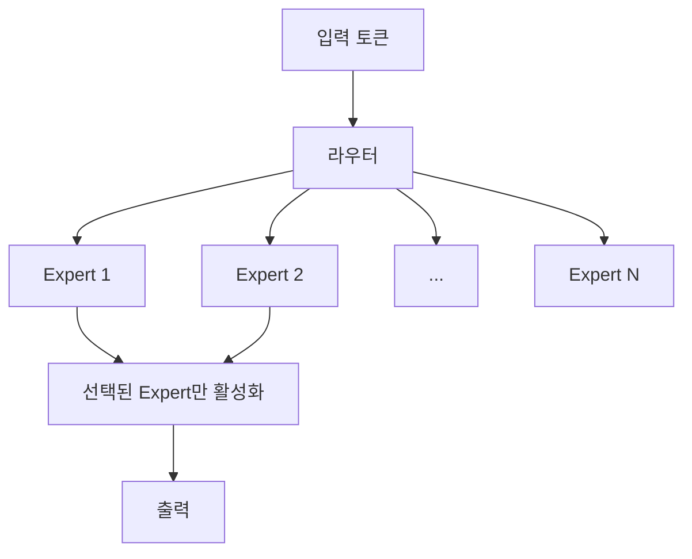

- **총 파라미터**: 671B
- **활성화 파라미터**: 37B/토큰 (약 5.5%만 사용)
- **장점**: 큰 모델 용량 + 빠른 추론 속도

---

## 💡 실무 적용 포인트

### 1. Temperature 설정 가이드

```python
# 태스크별 권장 Temperature
TEMPERATURE_GUIDE = {
    "factual_qa": 0.0,        # 사실 기반 QA
    "rag": 0.0,               # 검색 증강 생성
    "code_generation": 0.2,   # 코드 생성
    "summarization": 0.3,     # 요약
    "translation": 0.3,       # 번역
    "creative_writing": 0.7,  # 창작 글쓰기
    "brainstorming": 0.9,     # 브레인스토밍
}
```

### 2. In-Context Learning vs Fine-Tuning 선택

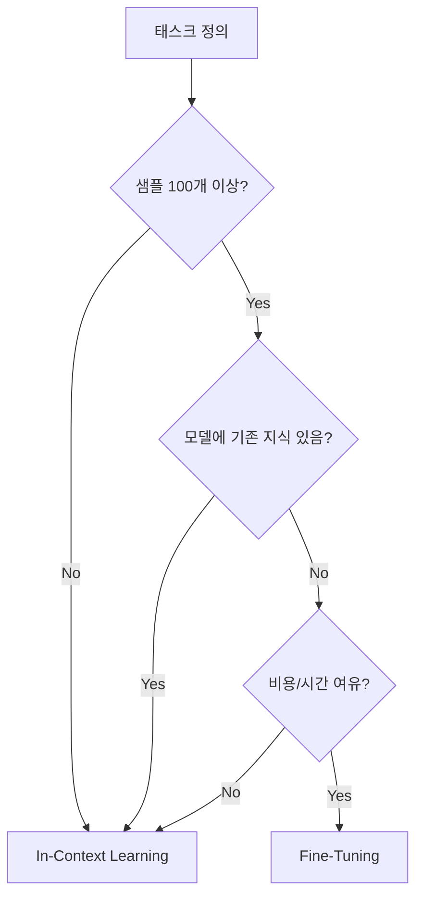

### 3. 프레임워크 선택 기준

| 요구사항 | 추천 프레임워크 |
|----------|----------------|
| 빠른 프로토타이핑 | PydanticAI, LangChain |
| 프로덕션 안정성 | 모델 제공사 직접 API |
| 로컬 실행 | Ollama + OpenAI 호환 API |
| 멀티모달 | Google Vertex AI, OpenAI |

---

## ✅ 정리 체크리스트

- [ ] 디자인 패턴의 개념과 AI 엔지니어링에서의 역할을 설명할 수 있다
- [ ] 파운데이션 모델의 3단계 학습 과정(Pretraining → SFT → RLHF)을 이해한다
- [ ] 에이전트의 5가지 핵심 특성(자율성, 목표 지향성, 계획, 인지/행동, 적응성)을 설명할 수 있다
- [ ] Temperature, Top-K, Top-P의 차이를 이해하고 적절히 설정할 수 있다
- [ ] In-Context Learning과 Fine-Tuning의 장단점을 비교하고 선택 기준을 안다
- [ ] LoRA의 기본 원리와 장점을 설명할 수 있다
- [ ] 이 책의 32개 패턴이 어떤 문제를 해결하는지 대략적으로 파악했다

---

## 🔗 참고 자료

### 공식 문서
- [OpenAI API Documentation](https://platform.openai.com/docs)
- [Anthropic Claude Documentation](https://docs.anthropic.com)
- [Google Gemini API](https://ai.google.dev/docs)
- [PydanticAI Documentation](https://ai.pydantic.dev)

### 추가 학습
- [Chip Huyen - AI Engineering (O'Reilly)](https://www.oreilly.com/library/view/ai-engineering/9781098166298/)
- [DeepSeek-R1 Technical Report](https://arxiv.org/abs/2501.12948)
- [LMSys Chatbot Arena Leaderboard](https://chat.lmsys.org/)
- [LoRA 논문](https://arxiv.org/abs/2106.09685)

### 관련 도서
- "Hands-On Generative AI with Transformers and Diffusion Models" (O'Reilly)
- "Generative AI on AWS" (O'Reilly)
- "Machine Learning Design Patterns" (O'Reilly)

---

*📖 출처: "Generative AI Design Patterns" - O'Reilly, 2025*
