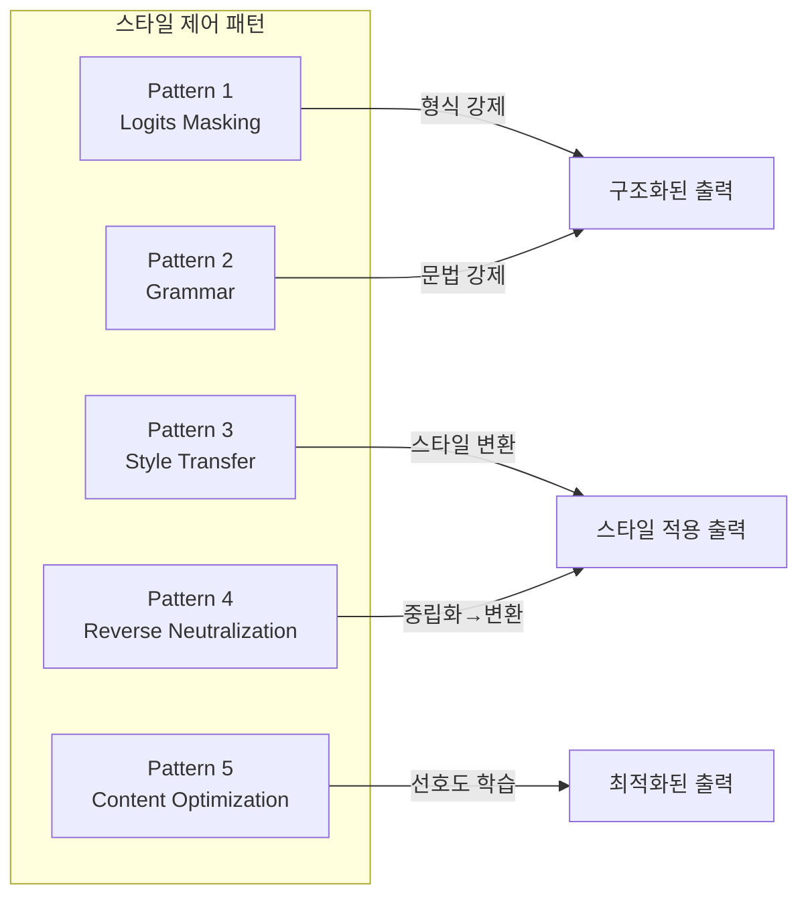
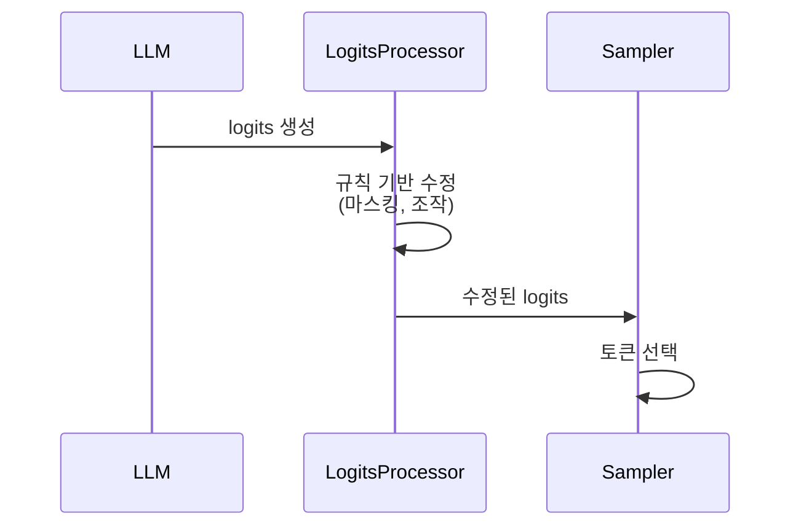
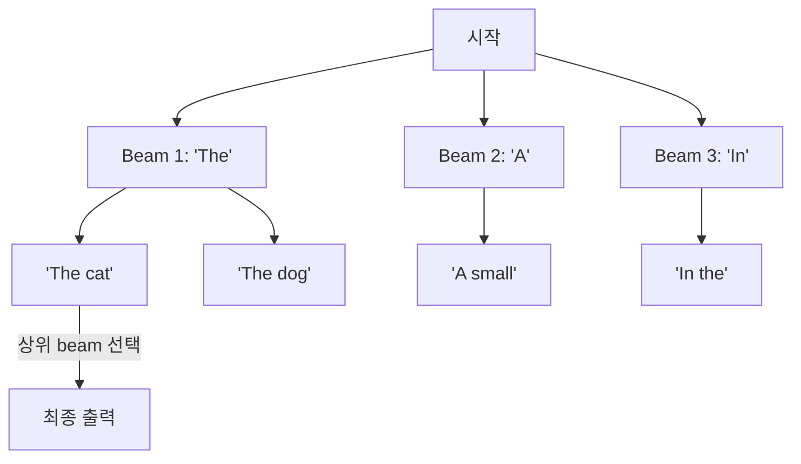
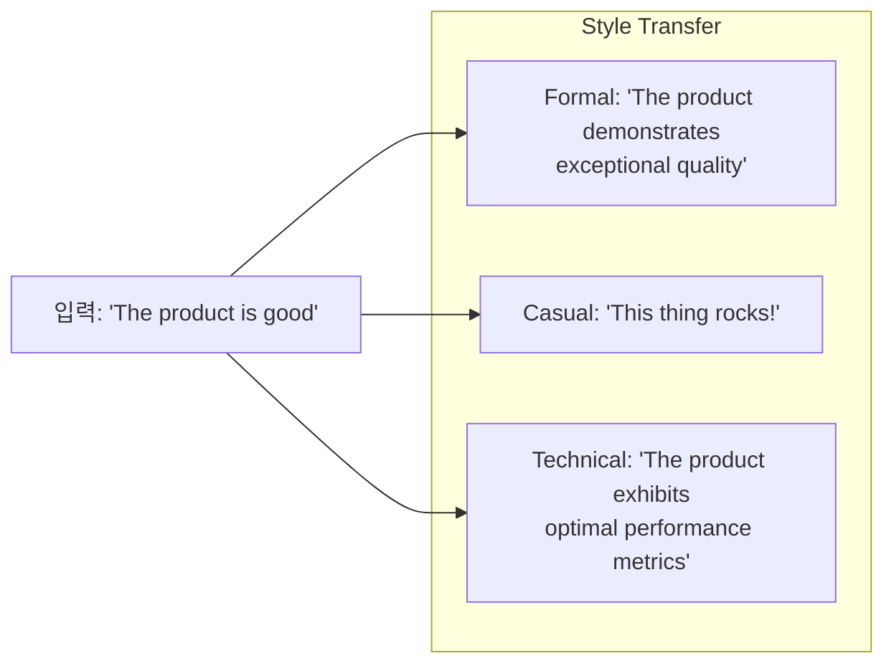
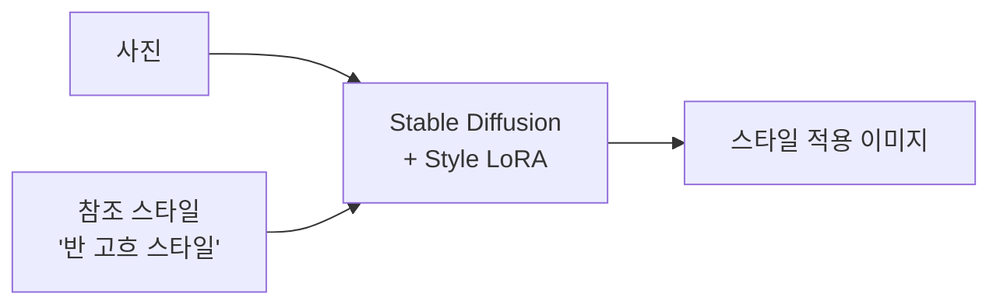
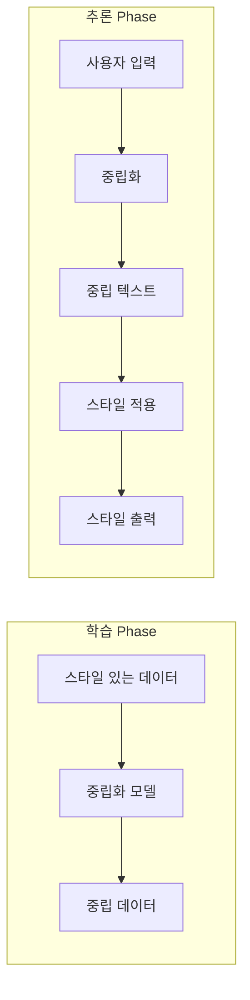
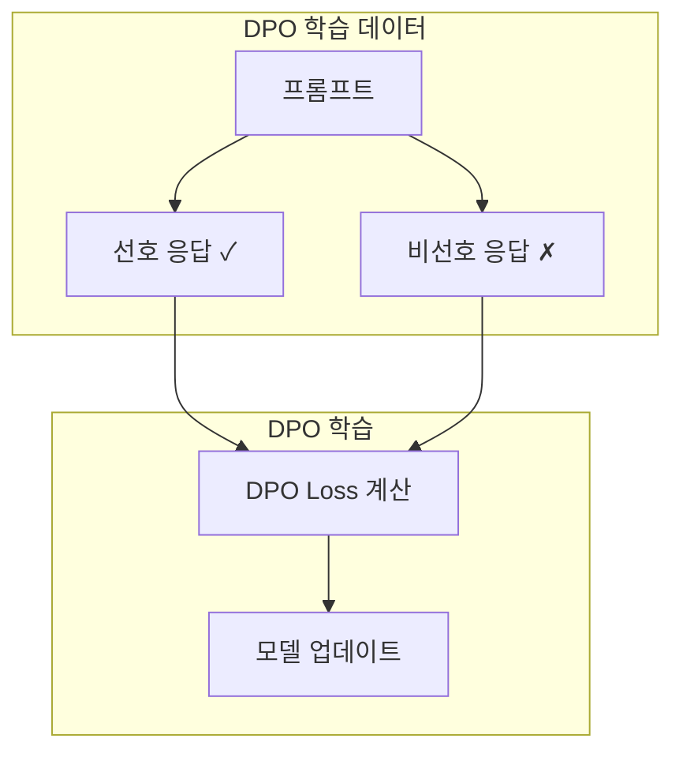
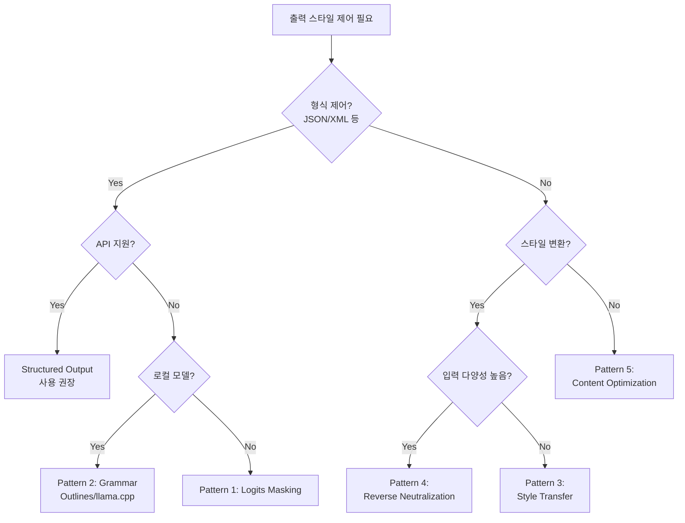

# Chapter 2. 콘텐츠 스타일 제어 (Controlling Content Style)

---

### 📌 핵심 요약

> 이 챕터는 **생성형 AI의 출력 스타일을 제어하는 5가지 디자인 패턴**을 다룬다. 단순히 프롬프트로 "JSON으로 출력해줘"라고 요청하는 것은 불안정하다. 프로덕션 환경에서는 **Logits Masking**, **Grammar 기반 구조화**, **Style Transfer**, **Reverse Neutralization**, **Content Optimization** 패턴을 통해 출력 형식과 스타일을 확정적으로 제어해야 한다.

---

### 🎯 학습 목표

이 챕터를 학습하고 나면:

- **Logits Masking**의 원리와 HuggingFace `LogitsProcessor` 구현 방법을 이해한다
- **BNF 문법**을 활용한 구조화된 출력 생성 방식을 파악한다
- **Few-shot Learning vs Fine-tuning**의 Style Transfer 적용 기준을 판단할 수 있다
- **Reverse Neutralization** 패턴의 필요성과 구현 흐름을 설명할 수 있다
- **DPO(Direct Preference Optimization)**를 통한 콘텐츠 최적화 방법을 이해한다

---

### 📖 본문 정리

## 1. 챕터 개요: 왜 스타일 제어가 필요한가?

생성형 AI 애플리케이션에서 출력 스타일 제어는 다음과 같은 이유로 중요하다:

| 제어 대상 | 필요 이유 | 패턴 |
|-----------|-----------|------|
| **출력 형식** | JSON, XML 등 파싱 가능한 형식 필요 | Pattern 1, 2 |
| **톤/어조** | 브랜드 보이스, 타겟 독자에 맞춤 | Pattern 3, 4 |
| **품질 최적화** | 선호도 기반 출력 개선 | Pattern 5 |



---

## 2. Pattern 1: Logits Masking

### 2.1 개념 이해

**Logits**는 LLM이 다음 토큰을 예측할 때 각 토큰에 부여하는 **정규화되지 않은 확률값**이다. Softmax를 적용하면 실제 확률 분포가 된다.

```
logits = [2.1, 1.5, 0.3, -1.2, ...]  # 각 토큰의 raw score
probabilities = softmax(logits)      # 확률 분포로 변환
```

**Logits Masking**은 이 logits 값을 **샘플링 직전에 가로채서 수정**하는 기법이다.



### 2.2 구현 방법

HuggingFace의 `LogitsProcessor`를 상속받아 구현:

```python
from transformers import LogitsProcessor
import torch

class JsonBracketEnforcer(LogitsProcessor):
    """JSON 출력 시 괄호 균형을 강제하는 LogitsProcessor"""

    def __init__(self, tokenizer):
        self.tokenizer = tokenizer
        self.open_bracket_id = tokenizer.encode("{", add_special_tokens=False)[0]
        self.close_bracket_id = tokenizer.encode("}", add_special_tokens=False)[0]

    def __call__(self, input_ids, scores):
        # 현재까지 생성된 텍스트 분석
        generated_text = self.tokenizer.decode(input_ids[0])
        open_count = generated_text.count("{")
        close_count = generated_text.count("}")

        # 괄호 불균형 시 닫는 괄호 확률 증가
        if open_count > close_count:
            scores[:, self.close_bracket_id] += 5.0

        return scores
```

### 2.3 적용 시나리오

| 시나리오 | Logits Masking 적용 |
|----------|---------------------|
| JSON 형식 강제 | 괄호 균형, 필수 키 포함 |
| 금지어 필터링 | 특정 토큰 확률을 -inf로 설정 |
| 길이 제어 | EOS 토큰 확률 조작 |
| 반복 방지 | 이미 생성된 토큰 페널티 |

### 2.4 고급 기법: Beam Search와 결합

**Beam Search**는 여러 후보 시퀀스를 병렬로 탐색하는 방식이다:



**Sequence Selection**: 생성된 전체 시퀀스를 평가하여 조건에 맞는 것만 선택
**Sequence Regeneration**: 조건 불만족 시 재생성 (비용 증가)

---

## 3. Pattern 2: Grammar

### 3.1 BNF 문법 기반 생성

**BNF(Backus-Naur Form)**는 형식 언어를 정의하는 메타 문법이다.

```bnf
<json> ::= "{" <members> "}"
<members> ::= <pair> | <pair> "," <members>
<pair> ::= <string> ":" <value>
<value> ::= <string> | <number> | <array> | <json> | "true" | "false" | "null"
```

이 문법을 LLM 생성 과정에 적용하면 **문법적으로 올바른 출력만** 생성되도록 강제할 수 있다.

### 3.2 주요 구현체

| 라이브러리 | 특징 |
|------------|------|
| **Outlines** | Python 기반, HuggingFace 통합 |
| **llama.cpp GBNF** | C++ 기반, 로컬 추론 최적화 |
| **Guidance** | Microsoft, 선언적 템플릿 |
| **LMQL** | SQL 스타일 쿼리 언어 |

### 3.3 Structured Output (구조화된 출력)

최신 LLM API들은 자체적으로 구조화된 출력을 지원한다:

**OpenAI Structured Output**:
```python
from openai import OpenAI
from pydantic import BaseModel

class MovieReview(BaseModel):
    title: str
    rating: int  # 1-5
    summary: str
    pros: list[str]
    cons: list[str]

client = OpenAI()
response = client.beta.chat.completions.parse(
    model="gpt-4o-2024-08-06",
    messages=[{"role": "user", "content": "인터스텔라 리뷰 작성해줘"}],
    response_format=MovieReview  # 스키마 강제
)
```

**JSON Mode vs Structured Output**:

| 기능 | JSON Mode | Structured Output |
|------|-----------|-------------------|
| 출력 형식 | JSON (형식만 보장) | JSON (스키마까지 보장) |
| 필드 검증 | ❌ | ✅ |
| 타입 검증 | ❌ | ✅ |
| 사용 난이도 | 쉬움 | 중간 |

### 3.4 Python Dataclass 활용

```python
from dataclasses import dataclass
from typing import List, Optional

@dataclass
class ApiResponse:
    status: str
    data: dict
    errors: Optional[List[str]] = None

# LLM에게 이 스키마를 프롬프트에 포함시켜 출력 형식 가이드
```

---

## 4. Pattern 3: Style Transfer

### 4.1 개념

**Style Transfer**는 콘텐츠의 의미는 유지하면서 **표현 스타일만 변환**하는 기법이다.



### 4.2 구현 방법 비교

| 방법 | 장점 | 단점 | 적용 시점 |
|------|------|------|-----------|
| **Few-shot Learning** | 빠른 적용, 데이터 불필요 | 일관성 낮음, 토큰 비용 | 프로토타입, 소규모 |
| **Fine-tuning** | 높은 일관성, 추론 비용 낮음 | 학습 데이터 필요, 시간 소요 | 프로덕션, 대규모 |

### 4.3 Few-shot Learning 예시

```
당신은 격식체 한국어 작가입니다. 다음 예시를 참고하여 변환하세요:

예시 1:
입력: "이거 진짜 좋아요"
출력: "해당 제품은 매우 우수한 품질을 갖추고 있습니다"

예시 2:
입력: "배송 빨랐어요"
출력: "배송 서비스가 신속하게 진행되었습니다"

변환할 텍스트: "가격이 좀 비싸긴 한데 만족해요"
```

### 4.4 Fine-tuning 데이터 준비

Style Transfer용 Fine-tuning 데이터셋 형식:

```json
{
  "messages": [
    {"role": "system", "content": "Convert to formal Korean"},
    {"role": "user", "content": "이거 완전 대박이에요"},
    {"role": "assistant", "content": "이 제품은 기대 이상의 우수한 성과를 보여주고 있습니다"}
  ]
}
```

### 4.5 이미지 Style Transfer

텍스트뿐 아니라 **이미지**에도 Style Transfer를 적용할 수 있다:

- **Diffusion 모델**: Stable Diffusion의 img2img
- **ControlNet**: 구조 유지하며 스타일만 변경
- **LoRA**: 특정 스타일 학습



---

## 5. Pattern 4: Reverse Neutralization

### 5.1 문제 상황

직접적인 Style Transfer의 한계:
- 입력 스타일이 **다양**하면 변환 품질 저하
- 학습 데이터의 **입력-출력 쌍** 구성 어려움

### 5.2 해결책: 2단계 변환



### 5.3 핵심 아이디어

1. **중립화(Neutralization)**: 모든 입력을 **표준화된 중립 형태**로 변환
2. **스타일 적용**: 중립 형태에서 **목표 스타일**로 변환

**장점**:
- 입력 다양성 문제 해결
- 학습 데이터: `(스타일 텍스트, 중립 텍스트)` 쌍만 필요
- 새로운 스타일 추가 용이

### 5.4 구현 예시

```python
# Phase 1: 중립화 모델
neutralizer = load_model("neutralizer")
neutral_text = neutralizer.generate(
    f"다음을 중립적인 표현으로 변환: {input_text}"
)

# Phase 2: 스타일 적용 모델
styler = load_model("formal_korean_styler")
styled_text = styler.generate(
    f"다음을 격식체로 변환: {neutral_text}"
)
```

---

## 6. Pattern 5: Content Optimization

### 6.1 DPO (Direct Preference Optimization)

**DPO**는 RLHF의 복잡성을 줄인 선호도 기반 학습 방법이다.



### 6.2 RLHF vs DPO

| 항목 | RLHF | DPO |
|------|------|-----|
| Reward Model | 필요 | 불필요 |
| 학습 안정성 | 낮음 (PPO 불안정) | 높음 |
| 구현 복잡도 | 높음 | 낮음 |
| 데이터 요구량 | 많음 | 적음 |

### 6.3 데이터셋 구성

```json
{
  "prompt": "Python으로 퀵소트 구현해줘",
  "chosen": "def quicksort(arr):\n    if len(arr) <= 1:\n        return arr\n    ...",
  "rejected": "퀵소트는 분할 정복 알고리즘입니다. 코드는 다음과 같습니다..."
}
```

### 6.4 LLM-as-Judge 평가

**선호도 데이터 생성**을 위해 LLM을 평가자로 활용:

```python
evaluation_prompt = """
다음 두 응답 중 더 나은 것을 선택하세요.

질문: {question}

응답 A: {response_a}
응답 B: {response_b}

평가 기준:
1. 정확성
2. 완성도
3. 가독성

더 나은 응답 (A/B):
"""
```

---

### 🔍 심화 학습

#### 1. Outlines 라이브러리 심층 분석

**Outlines**는 구조화된 텍스트 생성을 위한 Python 라이브러리다.

```python
import outlines

model = outlines.models.transformers("mistralai/Mistral-7B-v0.1")

# JSON 스키마 기반 생성
schema = {
    "type": "object",
    "properties": {
        "name": {"type": "string"},
        "age": {"type": "integer"},
        "email": {"type": "string", "format": "email"}
    },
    "required": ["name", "age"]
}

generator = outlines.generate.json(model, schema)
result = generator("사용자 정보 생성:")
```

**출처**: [Outlines GitHub](https://github.com/outlines-dev/outlines)

#### 2. DPO 논문 핵심 내용

DPO는 다음 손실 함수를 최적화한다:

```
L_DPO = -E[log σ(β * (log π(y_w|x)/π_ref(y_w|x) - log π(y_l|x)/π_ref(y_l|x)))]
```

- `y_w`: 선호 응답 (winner)
- `y_l`: 비선호 응답 (loser)
- `β`: 온도 파라미터
- `π_ref`: 참조 모델 (초기 모델)

**출처**: [Direct Preference Optimization Paper (arXiv:2305.18290)](https://arxiv.org/abs/2305.18290)

#### 3. Guidance vs Outlines 비교

| 특성 | Guidance | Outlines |
|------|----------|----------|
| 개발사 | Microsoft | 커뮤니티 |
| 패러다임 | 선언적 템플릿 | 함수형 API |
| 성능 | 빠름 | 매우 빠름 |
| 유연성 | 높음 | 중간 |

**출처**: [Microsoft Guidance](https://github.com/guidance-ai/guidance)

---

### 💡 실무 적용 포인트

#### 1. 패턴 선택 가이드



#### 2. 프로덕션 체크리스트

| 체크 항목 | Pattern 1-2 | Pattern 3-4 | Pattern 5 |
|-----------|-------------|-------------|-----------|
| 출력 형식 검증 | ✅ 필수 | - | - |
| 스타일 일관성 테스트 | - | ✅ 필수 | ✅ 필수 |
| 학습 데이터 품질 | - | 중요 | 매우 중요 |
| A/B 테스트 | 권장 | 필수 | 필수 |
| 롤백 계획 | 권장 | 필수 | 필수 |

#### 3. 비용-효과 분석

```
Few-shot Style Transfer:
- 초기 비용: 낮음 (데이터 불필요)
- 운영 비용: 높음 (토큰 비용 증가)
- 품질: 중간

Fine-tuning Style Transfer:
- 초기 비용: 높음 (데이터 수집, 학습)
- 운영 비용: 낮음
- 품질: 높음

권장: 일일 요청 > 10,000건이면 Fine-tuning 고려
```

---

### ✅ 정리 체크리스트

- [ ] **Logits Masking**: LogitsProcessor 구현 방법 이해
- [ ] **Beam Search**: 시퀀스 선택/재생성 전략 파악
- [ ] **BNF Grammar**: 형식 언어 정의 방법 숙지
- [ ] **Structured Output**: OpenAI/Anthropic API 활용법
- [ ] **JSON Mode vs Structured Output**: 차이점 구분
- [ ] **Few-shot vs Fine-tuning**: Style Transfer 적용 기준
- [ ] **Reverse Neutralization**: 2단계 변환 흐름 이해
- [ ] **DPO**: RLHF 대비 장점 및 데이터셋 구성
- [ ] **LLM-as-Judge**: 선호도 데이터 생성 방법

---

### 🔗 참고 자료

**라이브러리 & 도구**:
- [Outlines - Structured Text Generation](https://github.com/outlines-dev/outlines)
- [Microsoft Guidance](https://github.com/guidance-ai/guidance)
- [LMQL - Language Model Query Language](https://lmql.ai/)
- [llama.cpp GBNF Grammar](https://github.com/ggerganov/llama.cpp/blob/master/grammars/README.md)

**논문**:
- [Direct Preference Optimization (DPO)](https://arxiv.org/abs/2305.18290)
- [Constitutional AI: Harmlessness from AI Feedback](https://arxiv.org/abs/2212.08073)

**공식 문서**:
- [OpenAI Structured Outputs](https://platform.openai.com/docs/guides/structured-outputs)
- [Anthropic Tool Use](https://docs.anthropic.com/claude/docs/tool-use)

**실습 자료**:
- [HuggingFace LogitsProcessor 튜토리얼](https://huggingface.co/docs/transformers/internal/generation_utils)
- [DPO Trainer (TRL)](https://huggingface.co/docs/trl/main/en/dpo_trainer)

---

*📚 출처: "Generative AI Design Patterns" - Chapter 2*
