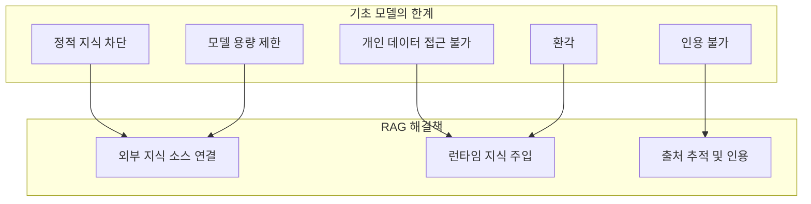
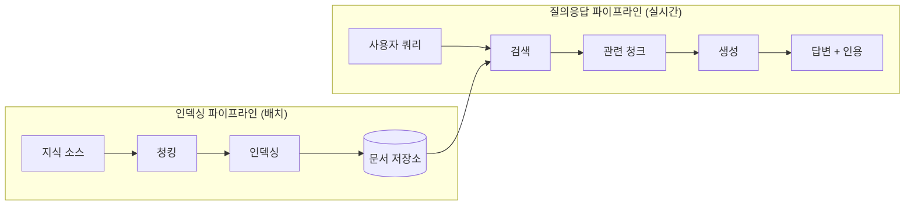
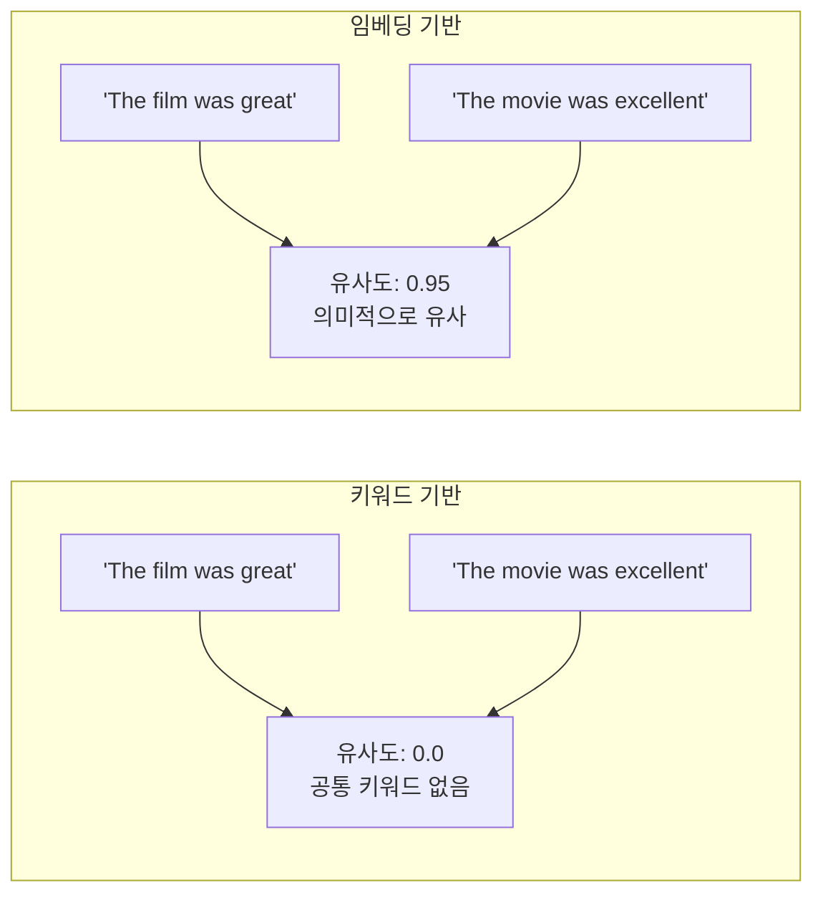
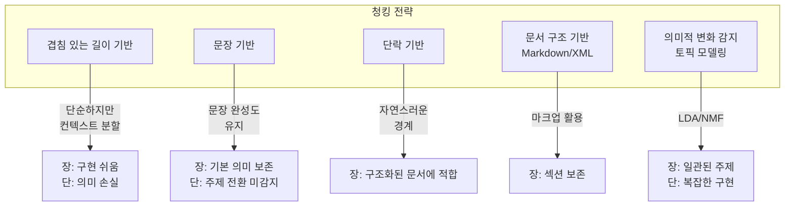
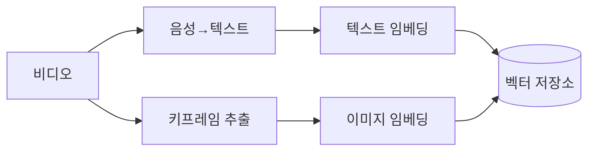
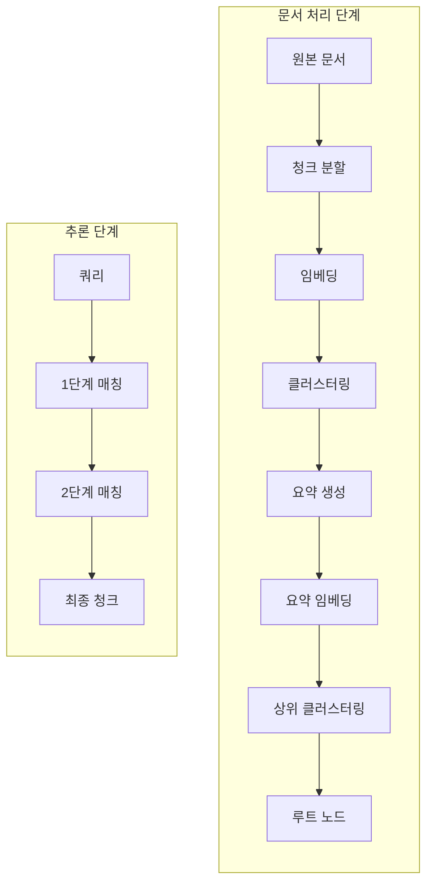
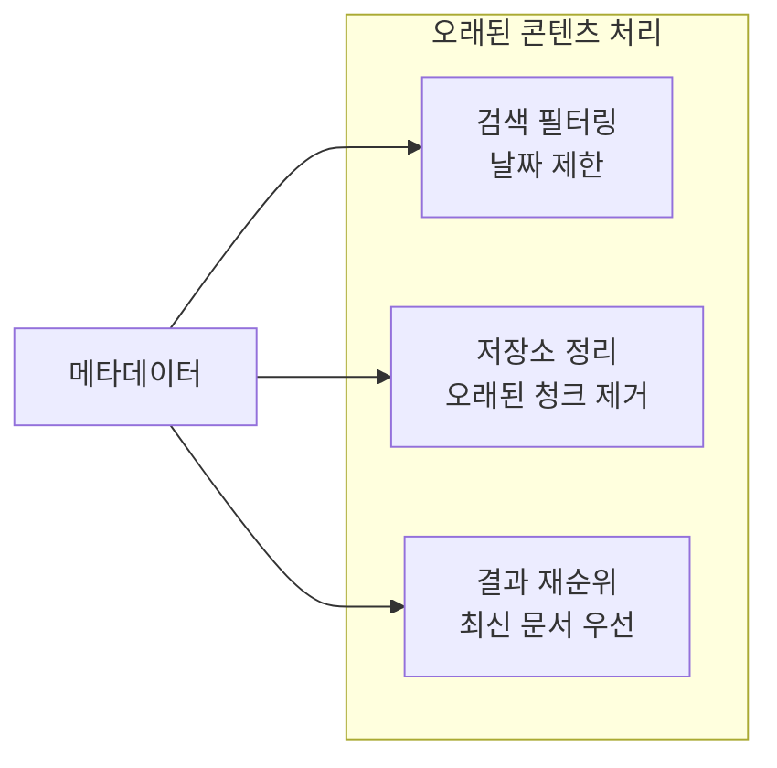
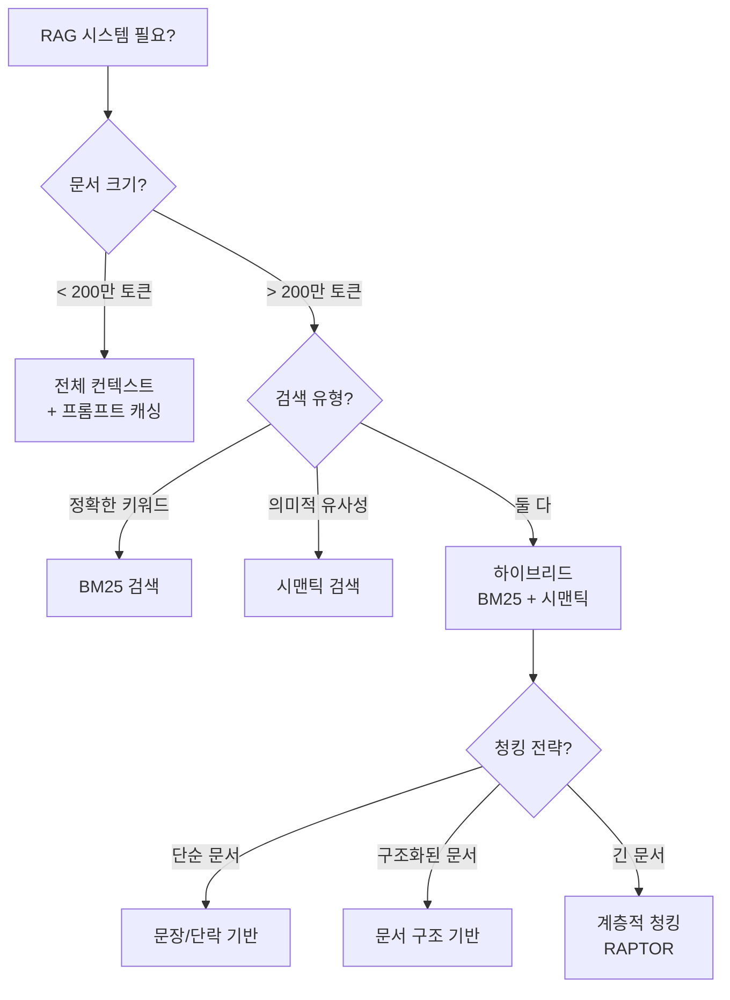

# Chapter 3. 지식 추가하기: 베이스 (Adding Knowledge: The Base)

---

### 📌 핵심 요약

> 기초 모델(Foundation Model)은 학습 데이터에 의해 제한되는 **폐쇄형 시스템**이다. RAG(Retrieval-Augmented Generation)는 이러한 한계를 극복하기 위해 **런타임에 외부 지식을 주입**하는 핵심 패턴이다. 이 챕터에서는 **기본 RAG(Pattern 6)**, **시맨틱 인덱싱(Pattern 7)**, **대규모 인덱싱(Pattern 8)**을 통해 점진적으로 정교해지는 RAG 시스템 구축 방법을 다룬다.

---

### 🎯 학습 목표

이 챕터를 학습하고 나면:

- **RAG의 3단계 구조**(인덱싱, 검색, 생성)를 설명할 수 있다
- **TF-IDF와 BM25**의 원리 및 한계를 이해한다
- **임베딩 기반 시맨틱 검색**의 장점과 구현 방법을 파악한다
- **청킹 전략**(문장, 단락, 계층적, 시맨틱)의 특성을 비교할 수 있다
- **대규모 인덱싱**에서 메타데이터 활용 및 모델 수명 주기 관리 방법을 이해한다

---

### 📖 본문 정리

## 1. 왜 RAG가 필요한가?

기초 모델의 3가지 근본적 한계:

| 한계 | 설명 | RAG 해결책 |
|------|------|-----------|
| **정적 지식 차단** | 학습 데이터 수집 이후 정보 접근 불가 | 최신 외부 소스로 지식 보강 |
| **모델 용량 제한** | 매개변수 내 저장 가능한 정보량 제한 | 외부 지식 기반과 연결 |
| **개인 데이터 접근 불가** | 기밀/독점 정보 미포함 | 런타임에 비공개 데이터 제공 |

추가적으로 발생하는 문제:

- **환각(Hallucination)**: 학습 범위 외 질문에 그럴듯하지만 부정확한 답변 생성
- **인용 불가**: 생성된 텍스트의 출처를 제시할 수 없음



---

## 2. Pattern 6: 기본 RAG (Basic RAG)

### 2.1 RAG 시스템 개요

RAG는 **두 개의 파이프라인**으로 구성된다:



### 2.2 접지(Grounding)의 원리

LLM은 **프롬프트의 정보를 우선적으로 사용**한다. 이를 **프라이밍(Priming) 효과**라고 한다.

**예시 - 프라이밍 효과**:
```
# 컨텍스트 없이
유럽에서 방문하고 싶은 소도시 세 곳을 추천하세요.
→ 다양한 응답 (예측 불가)

# 컨텍스트 추가
프랑스 최고의 음식은 리옹에 있습니다.
유럽에서 방문하고 싶은 소도시 세 곳을 추천하세요.
→ 미식가 도시 중심 응답 (프라이밍 효과)
```

**핵심**: 지식창고에서 **관련 청크**를 프롬프트에 추가하여 LLM 응답을 **근거 있게** 만든다.

### 2.3 검색: TF-IDF와 BM25

#### TF-IDF (Term Frequency - Inverse Document Frequency)

```
tf_idf(chunk, term) = count(term, chunk) / Σcount(term, chunk)
                      × log(count(chunk) / count(chunk | term ∈ chunk))
```

| 구성요소 | 의미 | 목적 |
|----------|------|------|
| **TF (Term Frequency)** | 청크 내 용어 출현 빈도 | 관련성 측정 |
| **IDF (Inverse Document Frequency)** | 용어의 희귀도 | 일반적인 단어(the, a) 페널티 |

#### BM25 개선점

- **용어 포화도**: `count / (count + k)`로 분자 포화
- **확률적 관련성**: 정보 이론 기반 보정

```python
# LlamaIndex에서 BM25 리트리버 구축
from llama_index.retrievers import BM25Retriever

retriever = BM25Retriever.from_defaults(
    docstore=index.get_docstore(),
    similarity_top_k=5  # 상위 5개 청크 반환
)

retrieved_nodes = retriever.retrieve(query)
```

### 2.4 생성 단계

검색된 청크를 컨텍스트로 사용하여 LLM에 전달:

```python
# 메시지 구성
messages = [
    # 지시문
    ChatMessage(role="system",
                content="Use the following text to answer the given question."),
    # 컨텍스트 (검색된 청크들)
    *[ChatMessage(role="system", content=node.text) for node in retrieved_nodes],
    # 사용자 쿼리
    ChatMessage(role="user", content=query)
]

# LLM 호출
response = llm.chat(messages)
```

### 2.5 RAG vs 대규모 컨텍스트 창

| 상황 | 권장 방식 |
|------|-----------|
| 문서가 작음 (< 200만 토큰) | 전체 문서를 프롬프트에 포함 |
| 문서가 큼 / 자주 변경됨 | RAG 시스템 구축 |
| 비용 최적화 필요 | 프롬프트 캐싱 + RAG 조합 |

**프롬프트 캐싱 예시 (Gemini)**:
```python
def answer_question(prompt: str, cached_tax_return: str) -> str:
    response = client.models.generate_content(
        model=GEMINI,
        contents=prompt,
        config=types.GenerateContentConfig(
            cached_content=cached_tax_return  # 캐시된 문서
        )
    )
    return response.text
```

### 2.6 기본 RAG의 한계

| 한계 | 설명 |
|------|------|
| **정확한 일치 필요** | "파열된" vs "파손된" 다른 결과 반환 |
| **청크 크기 제한** | 토큰 수 제약으로 후속 단계 누락 가능 |
| **동의어 미처리** | AI ≠ 인공지능으로 인식 |

---

## 3. Pattern 7: 시맨틱 인덱싱 (Semantic Indexing)

### 3.1 임베딩의 개념

**임베딩(Embedding)**은 텍스트, 이미지 등을 **고차원 벡터 공간에 매핑**하여 의미를 포착한다.



**코드 예시**:
```python
from sentence_transformers import SentenceTransformer

model = SentenceTransformer('all-MiniLM-L6-v2')

chunks = [
    "I really enjoyed the film we watched last night",
    "The movie was excellent",
    "I didn't like the documentary",
]

# 임베딩 생성
embeddings = model.encode(chunks)

# 쿼리 임베딩
query = "The film was great"
query_embedding = model.encode([query])[0]

# 유사도 계산 → 의미적으로 유사한 청크 검색
```

### 3.2 시맨틱 청킹 전략



### 3.3 멀티모달 처리

#### 이미지 처리 옵션

| 방법 | 설명 | 사용 시점 |
|------|------|----------|
| **OCR + 텍스트 추출** | 이미지에서 텍스트 추출 | 문서 스캔본 |
| **LLM 설명 생성** | 멀티모달 LLM으로 이미지 설명 | 사진, 다이어그램 |
| **직접 임베딩** | 멀티모달 모델로 이미지 임베딩 | 시각적 검색 |

#### 비디오 처리



#### 테이블 처리

| 청킹 전략 | 적합한 상황 |
|----------|------------|
| **테이블 전체** | 작은 테이블 |
| **슬라이딩 윈도우** | 큰 테이블, 헤더 유지 필요 |
| **행 기반** | 의미적으로 독립된 행 |
| **열 기반** | 시계열, 관련 데이터 그룹 |

### 3.4 문맥 검색 (Contextual Retrieval)

Anthropic이 제안한 기법: 각 청크에 **문서 전체의 맥락 요약**을 추가

```
# 원본 청크
회사의 손실이 전년 대비 10% 감소했습니다.

# 문맥화된 청크
이 자료는 2025년 4분기에 발표된 월마트의 재무 보고서입니다.
전 분기 수익은 2% 증가했습니다.
회사의 손실은 전년 대비 10% 감소했습니다.
```

**프롬프트 예시**:
```xml
<document>
{{WHOLE_DOCUMENT}}
</document>

Here is the chunk we want to situate within the whole document
<chunk>
{{CHUNK_CONTENT}}
</chunk>

Please give a short succinct context to situate this chunk
within the overall document for the purposes of improving
search retrieval of the chunk.
```

**효과**: 잘못된 검색률 **67% 감소** (Anthropic 발표)

### 3.5 계층적 청킹 (RAPTOR)

**RAPTOR** (Recursive Abstractive Tree Organization Retrieval Processing):



**장점**: 다양한 세부 수준(고/중/저)의 문서 정보 제공

### 3.6 업계 전문 용어 처리

**동의어 확장** 방법:

1. **전문 용어집 구축**: 수동 큐레이션
2. **통계 기법**: 동시 발생 분석으로 유사 용어 그룹화
3. **LLM 활용**: 용어 확장 (환각 주의)

```
# 쿼리 확장 예시
심장 마비의 증상은?
→ 심장 마비 | 급성 심근 경색 | 심근 경색의 증상은?
```

---

## 4. Pattern 8: 대규모 인덱싱 (Indexing at Scale)

### 4.1 프로덕션 환경의 도전 과제

| 문제 | 설명 |
|------|------|
| **명확성** | 도메인에 따라 단어 의미 달라짐 (유체: 물리학 vs 일반) |
| **데이터 최신성** | 시간 경과에 따른 정보 갱신 필요 |
| **모순 정보** | 서로 다른 시점/출처의 상충 정보 |
| **모델 수명 주기** | 임베딩 모델 변경 시 전체 재인덱싱 필요 |

### 4.2 메타데이터 활용

#### 메타데이터 유형

```python
metadata = {
    # 문서 수준
    "source": "https://...",
    "created_at": "2025-01-01",
    "author": "CDC",

    # 청크 수준
    "section": "Chapter 3",
    "entities": ["심근경색", "혈압"],

    # 도메인별
    "domain": "medical",
    "version": "2025 Guidelines",

    # 접근 제어
    "access_level": "confidential",
    "department": "cardiology"
}
```

#### 메타데이터 활용 방법



#### 모순 정보 해결 예시

```python
# 청크 1
{
    "content": "고혈압 기준: 140/90mmHg 이상",
    "source": "National Health Guidelines",
    "publication_date": "2017-03-01"
}

# 청크 2
{
    "content": "고혈압 기준: 130/80mmHg 이상",
    "source": "AHA/ACC Guidelines",
    "publication_date": "2017-11-01"
}

# 해결: 최신 날짜 또는 권위 있는 출처 우선
```

### 4.3 모델 수명 주기 관리

**임베딩 모델 선택 고려사항**:

| 요소 | 고려사항 |
|------|----------|
| **지원 수명** | 장기 지원 모델 선호 |
| **오픈 가중치** | 수명 주기 완전 제어 가능 |
| **성능** | MTEB 벤치마크 참조 |
| **비용** | 재인덱싱 비용 고려 |

**MTEB 리더보드 참고** (2025년 기준):
1. Gemini Embeddings
2. (격차)
3. Alibaba Qwen2 (오픈 가중치)
4. ...
13. OpenAI text-embedding-3-large

### 4.4 코드 예시: 메타데이터 필터링

```python
# 메타데이터 추가
metadata = []
for doc in documents:
    meta = {
        'source': doc['source'],
        'created_at': doc['created_at']
    }
    metadata.append(meta)

collection.add(
    ids=ids,
    embeddings=vectors,
    metadatas=metadata
)

# 필터링 쿼리
where_conditions = [{"created_at": "2025-01-01"}]
results = collection.query(
    query_embeddings=[query_embedding.tolist()],
    where={"$and": where_conditions} if len(where_conditions) > 1 else where_conditions[0]
)
```

---

### 🔍 심화 학습

#### 1. RAG 논문 계보

| 연도 | 논문 | 기여 |
|------|------|------|
| 2020 | Lewis et al. "Retrieval-Augmented Generation for Knowledge-Intensive NLP Tasks" | RAG 개념 정립 |
| 2024 | Gao et al. | RAG 변형 검토 및 평가 프레임워크 |
| 2025 | Fareed Khan | 18개 RAG 변형 비교 |

**출처**: [RAG 원본 논문](https://arxiv.org/abs/2005.11401)

#### 2. 임베딩 기술 발전

- **Bengio et al. (2000)**: 임베딩 개념 도입
- **Chris Olah (2014)**: 시각적 임베딩 설명
- **Pinecone (2025)**: LLM 애플리케이션에서 청킹의 역할

**출처**: [Pinecone Learning Center](https://www.pinecone.io/learn/)

#### 3. 문맥 검색 (Anthropic)

Anthropic의 연구에 따르면 문맥 검색은:
- 잘못된 검색률 67% 감소
- BM25 + 시맨틱 검색 조합 시 최적 성능

**출처**: [Anthropic Contextual Retrieval](https://www.anthropic.com/news/contextual-retrieval)

#### 4. RAPTOR

계층적 트리 구조를 통한 검색:
- 다양한 추상화 수준 지원
- 복잡한 문서 구조 처리

**출처**: [RAPTOR Paper](https://arxiv.org/abs/2401.18059)

---

### 💡 실무 적용 포인트

#### 1. RAG 시스템 구축 의사결정 트리



#### 2. 청킹 크기 가이드라인

| 문서 유형 | 권장 청크 크기 | 중첩 |
|----------|---------------|------|
| 기술 문서 | 200-500자 | 10-20% |
| 법률 문서 | 500-1000자 | 15-25% |
| 학술 논문 | 300-600자 | 20% |
| FAQ | 단일 Q&A | 없음 |

#### 3. 프로덕션 체크리스트

| 단계 | 체크 항목 |
|------|----------|
| **인덱싱** | □ 메타데이터 포함 □ 청킹 전략 결정 □ 임베딩 모델 선택 |
| **검색** | □ BM25 + 시맨틱 하이브리드 □ 필터링 조건 정의 □ top-k 최적화 |
| **생성** | □ 프롬프트 템플릿 작성 □ 인용 형식 정의 □ 환각 방지 지시문 |
| **운영** | □ 갱신 주기 설정 □ 모순 해결 정책 □ 모델 버전 관리 |

#### 4. 하이브리드 검색 구현

```python
# BM25 + 시맨틱 검색 조합
def hybrid_search(query, alpha=0.5):
    """
    alpha: BM25 가중치 (1-alpha: 시맨틱 가중치)
    """
    bm25_results = bm25_retriever.retrieve(query)
    semantic_results = semantic_retriever.retrieve(query)

    # 점수 정규화 및 결합
    combined_scores = {}
    for node in bm25_results:
        combined_scores[node.id] = alpha * normalize(node.score)

    for node in semantic_results:
        if node.id in combined_scores:
            combined_scores[node.id] += (1 - alpha) * normalize(node.score)
        else:
            combined_scores[node.id] = (1 - alpha) * normalize(node.score)

    # 상위 k개 반환
    return sorted(combined_scores.items(), key=lambda x: x[1], reverse=True)[:k]
```

---

### ✅ 정리 체크리스트

- [ ] **RAG 3단계**: 인덱싱 → 검색 → 생성 흐름 이해
- [ ] **접지(Grounding)**: 프라이밍 효과를 통한 LLM 응답 근거화
- [ ] **TF-IDF / BM25**: 키워드 기반 검색의 원리와 한계
- [ ] **임베딩**: 시맨틱 유사도 검색의 장점
- [ ] **청킹 전략**: 문장, 단락, 구조, 시맨틱, 계층적 청킹 비교
- [ ] **멀티모달 처리**: 이미지, 비디오, 테이블 인덱싱 방법
- [ ] **문맥 검색**: Anthropic의 문맥화된 청크 기법
- [ ] **RAPTOR**: 계층적 요약 트리 구조
- [ ] **메타데이터 활용**: 필터링, 모순 해결, 최신성 유지
- [ ] **모델 수명 주기**: 임베딩 모델 선택 및 관리 전략

---

### 🔗 참고 자료

**논문**:
- [RAG 원본 논문 - Lewis et al. (2020)](https://arxiv.org/abs/2005.11401)
- [RAPTOR Paper (2024)](https://arxiv.org/abs/2401.18059)
- [Contextual Retrieval - Anthropic](https://www.anthropic.com/news/contextual-retrieval)

**라이브러리 & 도구**:
- [LlamaIndex](https://docs.llamaindex.ai/)
- [LangChain Text Splitters](https://python.langchain.com/docs/modules/data_connection/document_transformers/)
- [ChromaDB](https://docs.trychroma.com/)
- [Pinecone](https://www.pinecone.io/)

**벤치마크**:
- [MTEB Leaderboard (임베딩 모델 순위)](https://huggingface.co/spaces/mteb/leaderboard)

**기업 사례**:
- [AWS RAG 구축 교훈](https://aws.amazon.com/blogs/machine-learning/)
- [Mercado Libre RAG 인사이트](https://medium.com/mercadolibre-tech)

**PDF 수집 도구**:
- [LlamaParse](https://docs.llamaindex.ai/en/stable/llama_cloud/llama_parse/)
- [Unstructured](https://unstructured.io/)
- [Docling](https://github.com/docling-project/docling)

---

*📚 출처: "Generative AI Design Patterns" - Chapter 3*
