# 4장. 지식 추가하기: 고급 RAG 패턴

---

### 📌 핵심 요약
> 3장의 기본 RAG를 넘어, 실제 프로덕션 환경에서 마주하는 복잡한 문제들을 해결하는 고급 패턴들을 다룹니다. 인덱스 인식 검색(Pattern 9)으로 쿼리와 인덱스 간 불일치를 해결하고, 노드 후처리(Pattern 10)로 검색 결과를 정제하며, 신뢰할 수 있는 생성(Pattern 11)으로 환각을 방지하고, 딥 서치(Pattern 12)로 복잡한 추론이 필요한 질문에 답합니다.

---

### 🎯 학습 목표
- **인덱스 인식 검색**의 4가지 기법(HyDE, 쿼리 확장, 하이브리드 검색, GraphRAG) 이해
- **노드 후처리**를 통한 검색 품질 개선 방법 습득
- **환각 방지**를 위한 인용, 가드레일, CRAG, Self-RAG 패턴 적용
- **딥 서치** 패턴으로 복잡한 다단계 추론 구현

---

### 📖 본문 정리

## Pattern 9: 인덱스 인식 검색 (Index-Aware Retrieval)

### 문제: 쿼리-인덱스 불일치

사용자 쿼리와 인덱스된 문서 사이에는 본질적인 불일치가 존재합니다:

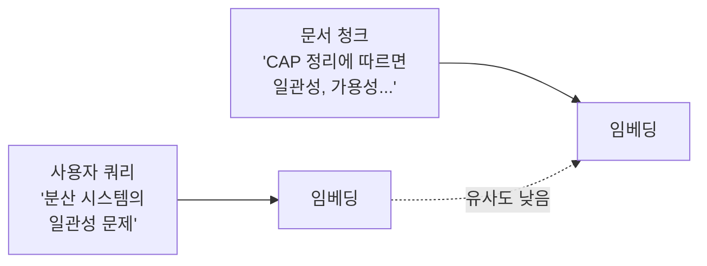

**불일치 원인**:
- 쿼리는 짧고 질문 형태, 문서는 길고 서술 형태
- 동일 개념에 대한 다른 용어 사용
- 쿼리의 암묵적 의도가 문서에 명시적으로 표현됨

---

### 해결책 1: HyDE (Hypothetical Document Embeddings)

LLM을 사용해 쿼리에 대한 **가상의 답변 문서**를 생성한 뒤, 이를 검색에 사용합니다.

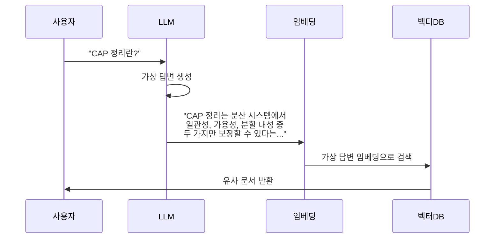

**장점**: 쿼리를 문서와 유사한 형태로 변환하여 검색 정확도 향상
**단점**: LLM 호출 추가로 지연시간 증가

---

### 해결책 2: 쿼리 확장 (Query Expansion)

원본 쿼리를 여러 변형으로 확장하여 검색 범위를 넓힙니다.

| 확장 유형 | 원본 쿼리 | 확장된 쿼리 |
|----------|----------|------------|
| 동의어 확장 | "분산 시스템 일관성" | "분산 시스템 일관성", "distributed consistency", "데이터 정합성" |
| 하위 질문 분해 | "MSA 설계 방법" | "MSA란?", "MSA 장단점", "MSA 설계 패턴", "MSA 통신 방식" |
| Step-back 질문 | "Redis Cluster 장애 복구" | "분산 캐시 장애 복구 일반 원칙" |

```python
# 쿼리 확장 예시
def expand_query(query: str, llm) -> list[str]:
    prompt = f"""
    다음 쿼리를 3가지 다른 방식으로 재구성하세요:
    원본: {query}

    1. 동의어 사용 버전
    2. 더 구체적인 버전
    3. 더 일반적인 버전
    """
    return llm.generate(prompt).split('\n')
```

---

### 해결책 3: 하이브리드 검색 (Hybrid Search)

키워드 검색과 시맨틱 검색의 장점을 결합합니다.

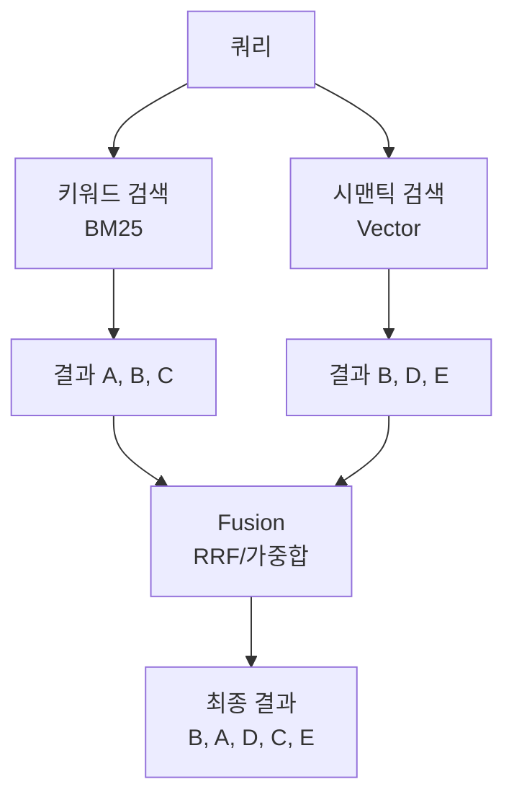

**Reciprocal Rank Fusion (RRF)**:
```
score(d) = Σ 1 / (k + rank_i(d))
```
- `k`: 상수 (보통 60)
- `rank_i(d)`: i번째 검색 방법에서 문서 d의 순위

**가중 합산 방식**:
```python
final_score = α * keyword_score + (1-α) * semantic_score
# α는 도메인에 따라 조정 (기술 문서: 0.3~0.4, 일반 문서: 0.5~0.6)
```

---

### 해결책 4: GraphRAG

문서를 **지식 그래프**로 변환하여 관계 기반 검색을 수행합니다.

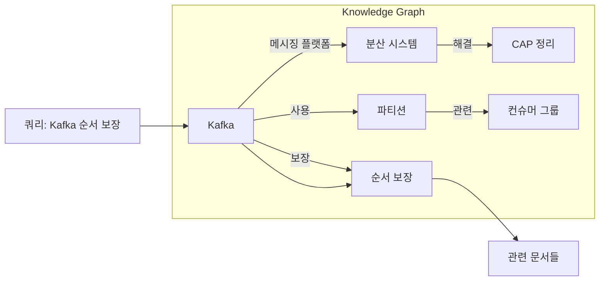

**GraphRAG 장점**:
- 명시적 관계 추론 가능
- 멀티홉 질문 처리 (A→B→C 관계 탐색)
- 커뮤니티 기반 요약으로 전체 컨텍스트 파악

**구현 고려사항**:
- 그래프 구축 비용이 높음 (LLM으로 엔티티/관계 추출)
- 정기적인 그래프 업데이트 필요
- 소규모 문서셋에는 과도할 수 있음

---

## Pattern 10: 노드 후처리 (Node Postprocessing)

검색된 문서들을 **생성 전에 정제**하여 품질을 높입니다.

### 10.1 리랭킹 (Reranking)

초기 검색 결과를 **Cross-Encoder**로 재정렬합니다.

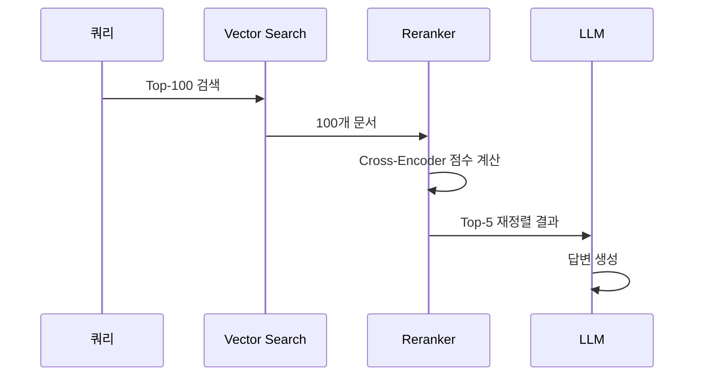

**Bi-Encoder vs Cross-Encoder**:

| 구분 | Bi-Encoder | Cross-Encoder |
|-----|-----------|---------------|
| 처리 방식 | 쿼리/문서 독립 임베딩 | 쿼리+문서 함께 처리 |
| 속도 | 빠름 (사전 계산 가능) | 느림 (실시간 계산) |
| 정확도 | 상대적 낮음 | 높음 |
| 사용 단계 | 1차 검색 (Recall) | 2차 정제 (Precision) |

**대표 리랭커 모델**: Cohere Rerank, BGE Reranker, cross-encoder/ms-marco

---

### 10.2 컨텍스트 압축 (Context Compression)

검색된 문서에서 **관련 부분만 추출**하여 컨텍스트 길이를 줄입니다.

```python
# LLM 기반 압축 예시
compression_prompt = """
다음 문서에서 질문과 관련된 정보만 추출하세요.

질문: {query}
문서: {document}

관련 정보:
"""

# 또는 임베딩 기반 문장 필터링
def compress_context(doc: str, query: str, threshold: float = 0.7):
    sentences = split_sentences(doc)
    query_emb = embed(query)

    relevant = []
    for sent in sentences:
        if cosine_sim(embed(sent), query_emb) > threshold:
            relevant.append(sent)

    return ' '.join(relevant)
```

**압축 전략 비교**:
| 방법 | 장점 | 단점 |
|-----|-----|-----|
| LLM 압축 | 의미 기반 정확한 추출 | 비용, 지연시간 |
| 임베딩 필터링 | 빠름, 저비용 | 문맥 손실 가능 |
| 문장 중요도 | 균형잡힌 접근 | 파라미터 튜닝 필요 |

---

### 10.3 중의성 해소 (Disambiguation)

동음이의어나 모호한 쿼리의 의도를 명확히 합니다.

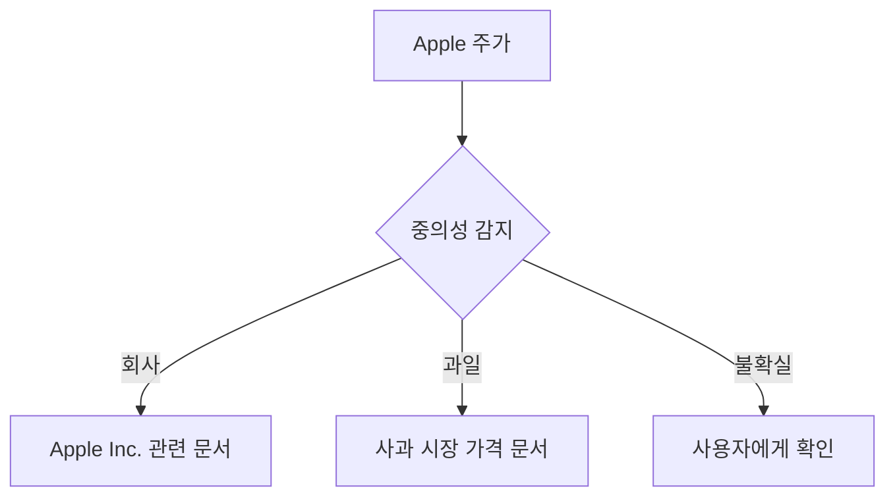

**구현 방법**:
1. **컨텍스트 기반**: 이전 대화에서 의도 파악
2. **엔티티 링킹**: 지식베이스와 매칭
3. **확인 요청**: 모호한 경우 사용자에게 질문

---

### 10.4 개인화 (Personalization)

사용자 프로필/이력을 기반으로 검색 결과를 맞춤화합니다.

```python
def personalized_rerank(results: list, user_profile: dict):
    for doc in results:
        # 사용자 선호도 반영
        if doc.topic in user_profile['interests']:
            doc.score *= 1.2

        # 전문성 수준 반영
        if doc.difficulty <= user_profile['expertise_level']:
            doc.score *= 1.1

    return sorted(results, key=lambda x: x.score, reverse=True)
```

---

## Pattern 11: 신뢰할 수 있는 생성 (Trustworthy Generation)

### 핵심 문제: 환각 (Hallucination)

LLM이 검색된 문서에 없는 정보를 생성하는 문제입니다.

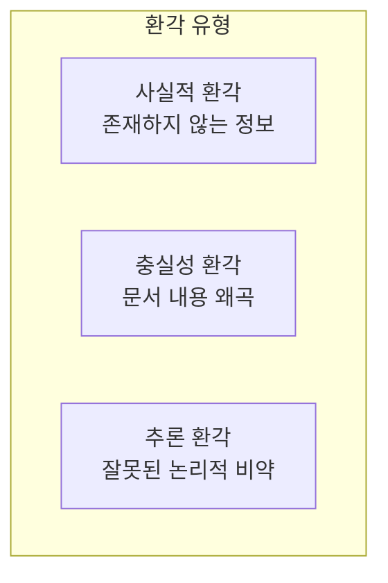

---

### 11.1 도메인 외 감지 (Out-of-Domain Detection)

검색된 문서가 질문에 답할 수 있는지 먼저 판단합니다.

```python
def check_answerability(query: str, contexts: list[str]) -> bool:
    prompt = f"""
    다음 질문에 대해 주어진 컨텍스트로 답변 가능한지 판단하세요.

    질문: {query}
    컨텍스트: {contexts}

    답변 가능 여부 (true/false):
    """
    return llm.generate(prompt).strip().lower() == 'true'

# 사용
if not check_answerability(query, contexts):
    return "죄송합니다. 제공된 문서에서 해당 질문에 대한 답을 찾을 수 없습니다."
```

---

### 11.2 인용 (Citations)

생성된 답변에 **출처를 명시**합니다.

```python
citation_prompt = """
다음 문서들을 참고하여 질문에 답하세요.
각 주장에 대해 [1], [2] 형식으로 출처를 표시하세요.

문서:
[1] {doc1}
[2] {doc2}
[3] {doc3}

질문: {query}

답변 (인용 포함):
"""

# 출력 예시
"""
CAP 정리에 따르면 분산 시스템은 일관성, 가용성, 분할 내성 중
두 가지만 동시에 보장할 수 있습니다[1].
Kafka는 이 중 일관성과 분할 내성을 선택한 시스템입니다[2].
"""
```

---

### 11.3 가드레일 (Guardrails)

출력을 **검증하고 필터링**합니다.

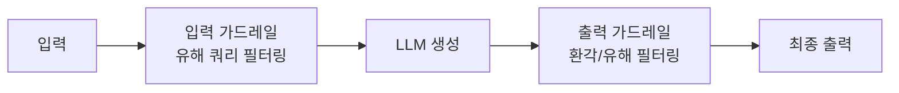

**가드레일 체크리스트**:
- [ ] 민감 정보 노출 여부
- [ ] 사실 확인 가능 여부 (인용 존재)
- [ ] 유해 콘텐츠 포함 여부
- [ ] 도메인 범위 이탈 여부

---

### 11.4 CRAG (Corrective RAG)

검색 결과의 **품질을 평가**하고 필요시 교정합니다.

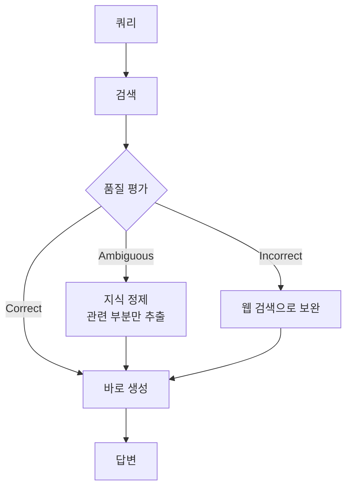

**품질 평가 기준**:
- **Correct**: 검색 결과가 쿼리에 직접 답함
- **Ambiguous**: 부분적으로 관련 있음
- **Incorrect**: 전혀 관련 없음

---

### 11.5 Self-RAG

LLM이 **스스로 검색 필요성을 판단**하고 생성물을 평가합니다.

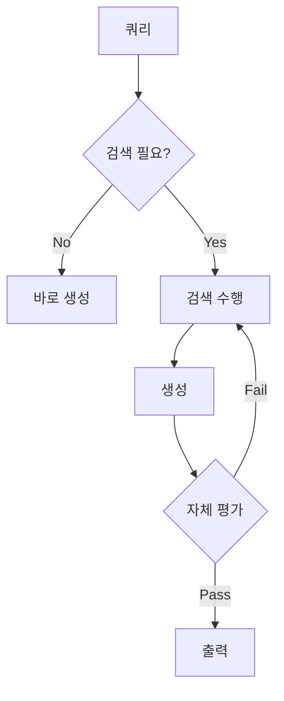

**Self-RAG 토큰**:
- `[Retrieve]`: 검색 필요 여부
- `[IsRel]`: 검색 결과 관련성
- `[IsSup]`: 답변이 문서에 기반하는지
- `[IsUse]`: 답변 유용성

```python
# Self-RAG 의사 코드
def self_rag(query: str):
    # 1. 검색 필요 여부 판단
    if needs_retrieval(query):
        docs = retrieve(query)

        # 2. 관련성 평가
        relevant_docs = [d for d in docs if is_relevant(d, query)]

        # 3. 생성
        answer = generate(query, relevant_docs)

        # 4. 자체 검증
        if is_supported(answer, relevant_docs) and is_useful(answer, query):
            return answer
        else:
            return self_rag(refine_query(query))  # 재시도
    else:
        return generate(query, [])
```

---

## Pattern 12: 딥 서치 (Deep Search)

### 복잡한 질문의 문제

단순 검색-생성으로 답할 수 없는 **다단계 추론**이 필요한 질문들이 있습니다.

```
질문: "2024년 AI 스타트업 투자 트렌드가 2023년과 어떻게 다른지,
       그리고 이것이 개발자 채용 시장에 미치는 영향은?"

필요한 정보:
1. 2024년 AI 투자 데이터
2. 2023년 AI 투자 데이터
3. 두 해 비교 분석
4. 채용 시장 현황
5. 투자와 채용의 상관관계 분석
```

---

### 딥 서치 아키텍처

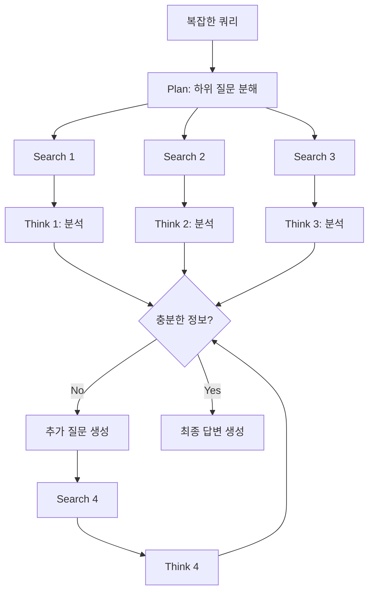

**핵심 루프**: `계획 → 검색 → 사고 → 평가 → (반복) → 생성`

---

### 구현 예시

```python
class DeepSearch:
    def __init__(self, llm, retriever, max_iterations=5):
        self.llm = llm
        self.retriever = retriever
        self.max_iterations = max_iterations

    def search(self, query: str) -> str:
        # 1. 초기 계획 수립
        sub_questions = self.decompose(query)
        knowledge_base = {}

        for iteration in range(self.max_iterations):
            # 2. 각 하위 질문에 대해 검색
            for q in sub_questions:
                if q not in knowledge_base:
                    docs = self.retriever.search(q)
                    analysis = self.analyze(q, docs)
                    knowledge_base[q] = analysis

            # 3. 충분성 평가
            if self.is_sufficient(query, knowledge_base):
                break

            # 4. 추가 질문 생성
            gaps = self.identify_gaps(query, knowledge_base)
            sub_questions.extend(gaps)

        # 5. 최종 답변 생성
        return self.synthesize(query, knowledge_base)

    def decompose(self, query: str) -> list[str]:
        prompt = f"다음 질문을 답하기 위해 필요한 하위 질문들을 나열하세요:\n{query}"
        return self.llm.generate(prompt).split('\n')

    def is_sufficient(self, query: str, kb: dict) -> bool:
        prompt = f"질문: {query}\n수집된 정보: {kb}\n답변하기에 충분합니까? (yes/no)"
        return 'yes' in self.llm.generate(prompt).lower()
```

---

### 딥 서치 vs 기본 RAG

| 구분 | 기본 RAG | 딥 서치 |
|-----|---------|---------|
| 검색 횟수 | 1회 | 다회 (반복) |
| 질문 유형 | 단순, 직접적 | 복잡, 다단계 추론 |
| 지연시간 | 낮음 | 높음 |
| 비용 | 낮음 | 높음 |
| 정확도 | 단순 질문에 적합 | 복잡 질문에 우수 |

**사용 시나리오**:
- 연구 보고서 작성
- 시장 분석
- 기술 비교 분석
- 의사결정 지원

---

### 🔍 심화 학습

#### HyDE 논문
- **"Precise Zero-Shot Dense Retrieval without Relevance Labels"** (Gao et al., 2022)
- 가상 문서 생성으로 zero-shot 검색 성능 향상
- [arXiv:2212.10496](https://arxiv.org/abs/2212.10496)

#### GraphRAG 공식 문서
- **Microsoft GraphRAG**
- 엔티티 추출, 커뮤니티 탐지, 글로벌/로컬 검색
- [GitHub: microsoft/graphrag](https://github.com/microsoft/graphrag)

#### Self-RAG 논문
- **"Self-RAG: Learning to Retrieve, Generate, and Critique"** (Asai et al., 2023)
- 자기 반성 토큰으로 RAG 품질 향상
- [arXiv:2310.11511](https://arxiv.org/abs/2310.11511)

#### CRAG 논문
- **"Corrective Retrieval Augmented Generation"** (Yan et al., 2024)
- 검색 결과 품질 평가 및 교정
- [arXiv:2401.15884](https://arxiv.org/abs/2401.15884)

---

### 💡 실무 적용 포인트

#### 1. 점진적 복잡도 증가 전략
```
시작: 기본 RAG
 ↓ 검색 품질 낮으면
추가: 하이브리드 검색 + 리랭킹
 ↓ 여전히 부족하면
추가: HyDE 또는 쿼리 확장
 ↓ 복잡한 질문 대응 필요시
추가: 딥 서치
```

#### 2. 비용-품질 트레이드오프
| 기법 | 추가 LLM 호출 | 지연시간 증가 | 품질 향상 |
|-----|-------------|-------------|----------|
| 리랭킹 | 0 (별도 모델) | +100-200ms | 중 |
| HyDE | +1 | +500ms | 중-상 |
| CRAG | +1-2 | +500-1000ms | 상 |
| 딥 서치 | +3-10 | +2-10s | 매우 높음 |

#### 3. 환각 방지 체크리스트
1. ✅ 도메인 외 감지로 답변 불가 상황 처리
2. ✅ 인용 강제로 출처 명시
3. ✅ 출력 가드레일로 사실 확인
4. ✅ 불확실성 표현 허용 ("~할 수 있습니다", "문서에 따르면")

#### 4. 프로덕션 권장 구성
```yaml
# 일반적인 Q&A 시스템
retrieval:
  method: hybrid  # BM25 + Vector
  top_k: 20

postprocessing:
  reranker: cohere-rerank-v3
  top_k: 5

generation:
  citations: required
  guardrails:
    - fact_check
    - domain_boundary

# 연구/분석 시스템
deep_search:
  enabled: true
  max_iterations: 5
  confidence_threshold: 0.8
```

---

### ✅ 정리 체크리스트

- [ ] HyDE: 가상 답변 문서로 쿼리-인덱스 불일치 해결
- [ ] 쿼리 확장: 동의어, 하위질문, Step-back으로 검색 범위 확대
- [ ] 하이브리드 검색: BM25 + Vector의 RRF 결합
- [ ] GraphRAG: 지식 그래프로 관계 기반 검색
- [ ] 리랭킹: Cross-Encoder로 검색 결과 재정렬
- [ ] 컨텍스트 압축: 관련 부분만 추출하여 효율화
- [ ] 도메인 외 감지: 답변 불가 상황 처리
- [ ] 인용: 출처 명시로 신뢰성 확보
- [ ] 가드레일: 입출력 검증 및 필터링
- [ ] CRAG: 검색 품질 평가 후 교정
- [ ] Self-RAG: 자기 반성으로 검색/생성 품질 향상
- [ ] 딥 서치: 반복적 검색-사고 루프로 복잡한 질문 해결

---

### 🔗 참고 자료

- [LangChain RAG 문서](https://python.langchain.com/docs/use_cases/question_answering/)
- [LlamaIndex Query Transformations](https://docs.llamaindex.ai/en/stable/optimizing/advanced_retrieval/query_transformations/)
- [Cohere Rerank API](https://docs.cohere.com/docs/rerank)
- [Microsoft GraphRAG](https://github.com/microsoft/graphrag)
- [Anthropic RAG Best Practices](https://docs.anthropic.com/claude/docs/retrieval-augmented-generation)
- [OpenAI Cookbook: RAG](https://cookbook.openai.com/examples/question_answering_using_embeddings)

---
