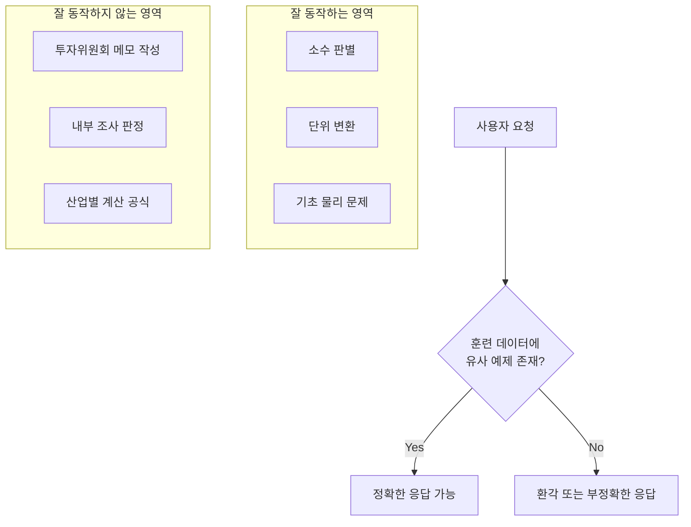
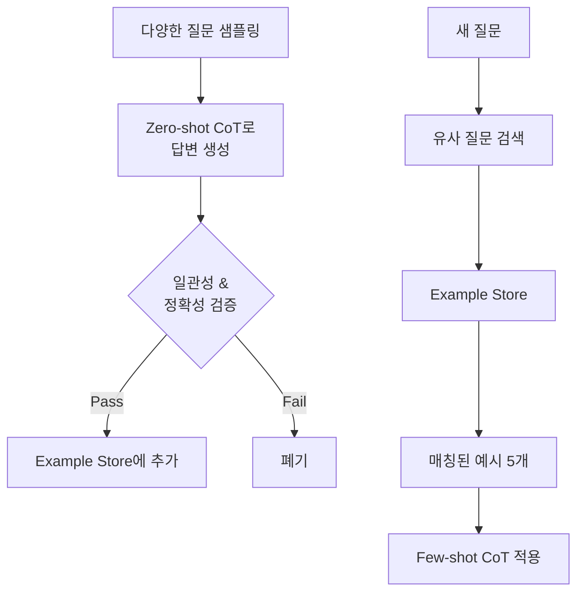
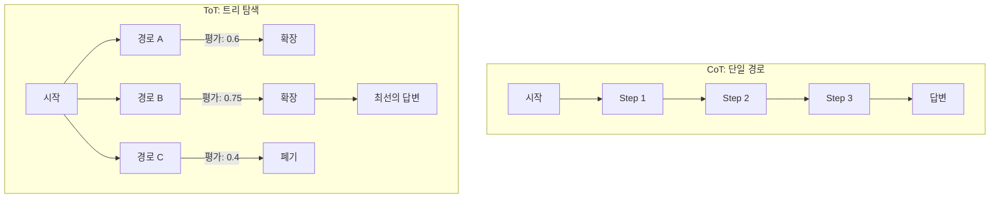
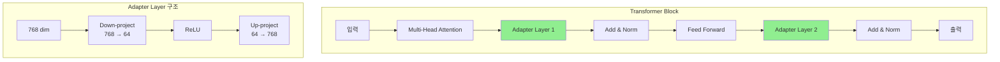
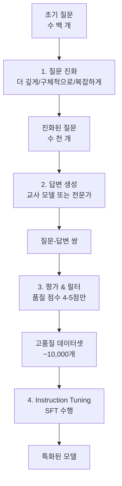

# 5장. 모델 역량 확장하기

---

### 📌 핵심 요약
> LLM은 패턴 인식과 텍스트 생성에 뛰어나지만, 훈련 데이터에 포함되지 않은 도메인 특화 작업은 수행하기 어렵습니다. 이 장에서는 사전 훈련된 모델에 새로운 능력을 가르치는 4가지 패턴을 다룹니다: Chain of Thought(CoT)로 단계별 추론을 유도하고, Tree of Thoughts(ToT)로 여러 추론 경로를 탐색하며, Adapter Tuning으로 효율적인 파인튜닝을 수행하고, Evol-Instruct로 복잡한 기업 과제용 데이터셋을 생성합니다.

---

### 🎯 학습 목표
- **LLM 추론의 한계**와 그것이 발생하는 이유 이해
- **Chain of Thought (CoT)** 3가지 변형(Zero-shot, Few-shot, Auto-CoT) 적용
- **Tree of Thoughts (ToT)**로 복잡한 전략적 문제 해결
- **Adapter Tuning**과 **LoRA**를 통한 효율적 파인튜닝 구현
- **Evol-Instruct**로 Instruction Tuning 데이터셋 생성

---

### 📖 본문 정리

## LLM 추론의 한계

### 훈련 데이터 커버리지 문제

LLM은 훈련 데이터에서 본 패턴을 일반화할 수 있지만, **훈련 데이터에 없는 작업**은 수행하기 어렵습니다.



**훈련 데이터에 잘 포함된 작업**:
- 100~110 사이의 소수 찾기 → ✅ 정확히 답함
- 84 제곱미터를 제곱피트로 변환 → ✅ 올바른 공식 적용

**훈련 데이터에 부족한 작업**:
- 석유/가스 산업의 파이프 유량 계산 → ❌ "정보 부족" 핑계
- 브릿지 카드 게임의 전략 적용 → ❌ 규칙은 알지만 적용 못함

---

### 다단계 추론 실패

LLM은 종종 중간 단계 없이 **직접 답변으로 점프**하여 오류를 발생시킵니다.

```
질문: 미국이 최종 목적지이면 50kg, 아니면 40kg 수하물 허용.
      SIN-DFW-YYZ 여정의 수하물 허용량은?

잘못된 답변: "최종 목적지 중 하나가 미국이므로 50kg 허용"
올바른 답변: "최종 목적지 YYZ(캐나다)이므로 40kg 허용"
```

모델이 "final(최종)"이라는 단어를 잘못 해석했습니다.

---

## Pattern 13: Chain of Thought (CoT)

### 핵심 아이디어

**"단계별로 생각하라"**고 요청하여 복잡한 문제를 중간 추론 단계로 분해합니다.

```mermaid
graph LR
    subgraph "기존 방식"
        A1[프롬프트] --> B1[LLM] --> C1[바로 답변]
    end

    subgraph "CoT 방식"
        A2[프롬프트 +<br/>"Think step-by-step"] --> B2[LLM] --> C2[Step 1] --> D2[Step 2] --> E2[Step 3] --> F2[최종 답변]
    end
```

---

### Variant 1: Zero-shot CoT

단순히 **"Think step-by-step"** 문구만 추가합니다.

```python
prompt = """
파이프 직경 25cm, 호스 길이 100m일 때
Texas Sweet 원유의 7bar 압력차에서의 유량은?
Think about it step-by-step.
"""
```

**결과**: 모델이 점성(viscosity)을 찾고, 방정식에 대입하는 단계를 수행합니다.

**효과**: 모델이 "게으름"을 피우지 않고 사전 훈련된 지식을 활용하도록 유도

---

### Variant 2: Few-shot CoT

**예시를 통해 추론 패턴을 시연**합니다.

```python
prompt = """
다음 예시를 템플릿으로 사용하여 물리 문제를 풀어라.

예시:
Q: 공이 200m 높이에서 떨어진다. 땅에 도달하는 시간은?
A:
Step 1: 방정식 식별 - Δy = v₀t + (1/2)at²
Step 2: 알려진 값 식별 - Δy = -200m, v₀ = 0, a = -9.8m/s²
Step 3: 대입 - -200 = 0 + (-4.9) * t²
Step 4: 풀이 - t ≈ 6.39s
Step 5: 답변 - 6.39초 소요

Q: 2kg 물체가 30° 마찰 없는 경사면을 미끄러진다. 가속도는?
"""
```

**Few-shot CoT vs RAG**:
| 구분 | RAG | Few-shot CoT |
|-----|-----|-------------|
| 추가 내용 | 지식(데이터) | 논리(방법) |
| 기대 효과 | 정확한 정보 기반 답변 | 패턴 일반화 |
| 비유 | 물고기를 준다 | 낚시하는 법을 보여준다 |

---

### Variant 3: Auto-CoT

**다양한 질문에 대한 시연 예시를 데이터베이스에 저장**하고 동적으로 선택합니다.



**장점**: 수동으로 예시를 작성할 필요 없음, 질문 유형에 맞는 예시 자동 선택

---

### CoT의 한계

**데이터 갭**: 논리는 맞지만 사실이 틀린 경우
```
Q: 하이데라바드에서 서쪽으로 300km 운전하면 어디?
잘못된 답: 아우랑가바드 (실제로는 300km 이상 떨어짐)
→ 지도 이미지를 컨텍스트에 추가하여 해결
```

**비순차적 논리**: 순환 루프나 다중 시나리오 최적화가 필요한 경우
- 브릿지 카드 게임의 전문가 라인
- CoT로 시연해도 모델이 패턴을 못 따라감

---

## Pattern 14: Tree of Thoughts (ToT)

### 문제: 단일 경로의 한계

CoT는 **선형적인 단계별 추론**만 가능합니다. 하지만 많은 문제는:
- 여러 접근 방식을 탐색해야 함
- 잘못된 경로에서 백트래킹이 필요함
- 지속적인 자체 평가가 필요함



---

### ToT의 4가지 구성 요소

#### 1. Thought Generation (생각 생성)
```python
def generate_thoughts(self, state: str, step: int) -> List[str]:
    prompt = f"""{state}
    Tree of Thoughts 방법으로 문제를 단계별로 해결 중입니다.
    위 상태를 보고 {self.num_thoughts_per_step}개의
    다양한 다음 단계를 생성하세요.
    """
    return json.loads(llm.generate(prompt))
```

#### 2. Path Evaluation (경로 평가)
```python
def evaluate_state(self, state: str, problem: str) -> float:
    prompt = f"""
    문제: {problem}
    추론 경로: {state}

    이 추론 경로가 얼마나 유망한지 0-100 점수로 평가하세요.
    고려사항: 정확성, 진행도, 통찰력, 잠재력
    """
    return int(llm.generate(prompt)) / 100.0
```

#### 3. Beam Search (빔 서치)
```python
# 상위 K개의 유망한 경로만 유지
beam = heapq.nsmallest(self.beam_width, candidates)
```

#### 4. Summary Generation (요약 생성)
```python
def generate_solution(self, problem: str, final_state: str) -> str:
    prompt = f"""
    문제: {problem}
    완료된 추론 경로: {final_state}
    추론 경로를 바탕으로 간결한 답변을 제공하세요.
    """
    return llm.generate(prompt)
```

---

### ToT 예시: 공급망 최적화

**문제**:
- 3개 제조 위치 (멕시코, 베트남, 폴란드)
- 4개 물류 센터 (애틀랜타, 시카고, 달라스, 시애틀)
- 2가지 배송 방법 (항공, 해상)
- 수요 변동 ±20%, 아시아 배송 경로 혼란

**ToT 탐색 결과**:
```
Step 1: 운송 네트워크 매핑 (점수: 0.65)
Step 2: 3가지 구성 개발 - 비용, 속도, 복원력 중심 (점수: 0.75)
Step 3: 3가지 시나리오(정상, 혼란, 수요 증가)에서 평가 (점수: 0.80)
Step 4: 민감도 분석으로 최적 구성 결정 (점수: 0.85)

최종 결론: 분산 제조(Configuration C)가 비용, 속도, 복원력의
          최적 균형을 제공
```

---

### ToT의 고려사항

| 구분 | 장점 | 단점 |
|-----|-----|-----|
| 복잡한 문제 | 여러 경로 탐색, 백트래킹 가능 | 구현 복잡도 높음 |
| 비용 | 최적 해결책 도출 | 수십 회의 LLM 호출 필요 |
| 지연시간 | - | 수 분 소요 가능 |

**대안**:
- **추론 모델**: o3, Opus, Gemini 2.5 Pro의 thinking mode
- **Least-to-Most Prompting**: 순차적 하위 문제 분해
- **Wait-injection**: 종료 토큰을 "Wait"으로 대체하여 재평가 유도

---

## Pattern 15: Adapter Tuning

### 문제: 효율적인 모델 맞춤화

프롬프트 엔지니어링과 Few-shot Learning의 한계:
- 복잡한 프롬프트는 비용 증가, 테스트 어려움
- Few-shot은 컨텍스트 윈도우 사용, 패턴 추출 제한적

**Adapter Tuning**: 소수의 add-on 레이어만 훈련하여 효율적으로 파인튜닝

---

### 아키텍처



**핵심 특징**:
- **파라미터 효율적**: 768 × 64 × 2 = ~100K 파라미터만 훈련 (vs 수십억 전체)
- **훈련 데이터 최소화**: 100~1,000개 예시로 충분
- **빠른 훈련**: 단일 GPU에서 1시간 이내

---

### Adapter Tuning이 적합하지 않은 경우

| 목적 | 적합한 방법 |
|-----|-----------|
| 산업 용어 학습 | Continued Pretraining (CPT) |
| 새로운 지식 추가 | RAG |
| 복잡한 새 작업 | Evol-Instruct (Pattern 16) |

**Adapter Tuning은**:
- ✅ 분류, 요약, 추출적 QA, 브랜드 맞춤 챗봇
- ❌ 새로운 단어/언어 학습
- ❌ 새로운 사실 정보 학습

---

### 구현 예시: 방사선 이미지 캡션

```python
# LoRA 설정
peft_config = LoraConfig(
    r=16,                    # 랭크 (차원 축소 크기)
    lora_alpha=16,           # 스케일링 값
    target_modules="all-linear",
    task_type="CAUSAL_LM",
)

# 훈련 설정
sft_config = SFTConfig(
    output_dir="gemma-radiology",
    num_train_epochs=1,
    learning_rate=2e-4,
)

# 훈련
trainer = SFTTrainer(
    model=model,
    args=sft_config,
    train_dataset=messages,
    peft_config=peft_config,
)
trainer.train()
```

**결과**:
- 입력: CT 스캔 이미지
- 출력: "복부의 CT 스캔으로 복강 내 종괴의 크기와 밀도를 보여줌"

---

## Pattern 16: Evol-Instruct

### 문제: 기업 특화 작업 데이터셋 부족

기업 과제의 특성:
- 모델 제공자가 기업 사용 사례를 모름
- 데이터 프라이버시로 인해 훈련 데이터 접근 불가
- 공개 데이터에 없는 도메인 특화 논리 필요

**Evol-Instruct**: 초기 Instruction을 "진화"시켜 대규모 훈련 데이터셋 생성

---

### Evol-Instruct 워크플로우



---

### Step 1: 질문 진화 전략

| 진화 유형 | 방법 | 예시 |
|----------|-----|-----|
| **더 깊게** | 제약 조건, 가정 추가 | "비용 초과 20% 발생 시..." |
| **더 구체적** | "왜"→"3가지 이유", "어떻게"→"단계" | "수익성 저해 3가지 방법은?" |
| **더 복잡** | 두 질문 결합 | "경쟁 + 보조금 불확실성이 함께 미치는 영향은?" |

```python
# 더 구체적으로 만드는 프롬프트
prompt = """
주어진 질문을 더 구체적으로 만들어 세부 사항 파악이 필요하도록 수정하세요:
- "왜" 대신 "3가지 이유"를 물어라
- "어떻게" 대신 "단계"를 물어라
- 특정 결과가 왜 더 크거나 작지 않은지 물어라

원본 질문: {original_question}
"""
```

---

### Step 2: 답변 생성 방법

| 방법 | 적용 시나리오 |
|-----|-------------|
| **인간 전문가** | 도메인 지식 필수, 예산 충분 |
| **산업 도구** | 시뮬레이터, 계산기 활용 가능 |
| **Reflection** | 자동 평가기 존재 (코딩, 수학) |
| **RAG** | 기업 DB에서 답변 추출 가능 |
| **교사-학생** | 강력한 모델로 답변 생성 |

---

### Step 3: 품질 평가 (LLM-as-Judge)

```python
evaluation_prompt = """
당신은 월스트리트 애널리스트를 인터뷰한 기자입니다.
다음 질문-답변 쌍이 비즈니스 전략 기사에 실릴 만큼 통찰력 있는지 평가하세요.

1점: 명백하거나 틀린 내용
5점: 진정으로 통찰력 있는 내용

질문: {question}
답변: {answer}
점수 (1-5):
"""

# 4-5점만 훈련 데이터로 사용
```

---

### 예시: SEC 공시 기반 비즈니스 전략 모델

**목표**: Gemma 3 1B 모델을 비즈니스 컨설턴트로 훈련

**프로세스**:
1. S&P 500 기업의 SEC 공시에서 초기 질문 3개씩 생성
2. 각 질문을 10개로 진화 → 13개/공시
3. 500개 기업 × 4년 = ~26,000개 질문-답변 쌍
4. 품질 4-5점만 필터 → ~11,000개 훈련 예시

**결과 비교**:
| 모델 | 응답 품질 |
|-----|----------|
| **훈련 전 Gemma 1B** | "기존 글로벌 네트워크 활용..." (일반적, 통찰 부족) |
| **훈련 후 Gemma 1B** | "관계 중심 전략 강화, 보완적 자산관리사 파트너십, 옴니채널 접근..." (구체적, 전략적) |
| **Claude Sonnet** | 유사한 수준의 통찰력 |

---

### 데이터셋 크기 가이드라인

| 모델 크기 | 최소 예시 수 | 비고 |
|----------|-------------|-----|
| 1B 파라미터 | 10,000+ | 기본 기준 |
| 10B 파라미터 | 1,000+ | 1/x 비례 |
| 100B 파라미터 | 100+ | 일반화 능력 우수 |

**주의사항**:
- QLoRA로도 임베딩 + gate projection + attention head 훈련 필요
- **치명적 망각(Catastrophic Forgetting)** 발생 가능
- 훈련된 작업 외의 능력은 저하될 수 있음

---

### 🔍 심화 학습

#### Chain of Thought 논문
- **"Chain-of-Thought Prompting Elicits Reasoning in Large Language Models"** (Wei et al., 2022)
- 단계별 예시로 산술, 상식, 기호 추론 정확도 향상
- [arXiv:2201.11903](https://arxiv.org/abs/2201.11903)

#### Zero-shot CoT 논문
- **"Large Language Models are Zero-Shot Reasoners"** (Kojima et al., 2022)
- "Let's think step by step"만으로 추론 능력 유도
- [arXiv:2205.11916](https://arxiv.org/abs/2205.11916)

#### Tree of Thoughts 논문
- **"Tree of Thoughts: Deliberate Problem Solving with Large Language Models"** (Yao et al., 2023)
- 트리 탐색 기반 심화 문제 해결
- [arXiv:2305.10601](https://arxiv.org/abs/2305.10601)

#### QLoRA 논문
- **"QLoRA: Efficient Finetuning of Quantized LLMs"** (Dettmers et al., 2023)
- 4비트 양자화 + LoRA로 메모리 효율적 파인튜닝
- [arXiv:2305.14314](https://arxiv.org/abs/2305.14314)

#### Evol-Instruct (WizardLM) 논문
- **"WizardLM: Empowering Large Language Models to Follow Complex Instructions"** (Xu et al., 2023)
- Instruction 진화로 복잡한 지시 따르기 능력 향상
- [arXiv:2304.12244](https://arxiv.org/abs/2304.12244)

---

### 💡 실무 적용 포인트

#### 1. 패턴 선택 의사결정 트리
```
모델이 작업을 잘 못함
├─ 논리/추론 문제?
│  ├─ 순차적 논리 → CoT (Zero-shot 먼저, 필요시 Few-shot)
│  └─ 다중 경로 탐색 필요 → ToT
│
├─ 응답 스타일 문제?
│  └─ 100~1,000개 예시 → Adapter Tuning
│
└─ 복잡한 도메인 특화 작업?
   └─ 10,000+개 예시 생성 → Evol-Instruct
```

#### 2. 비용-효과 트레이드오프
| 패턴 | 구현 복잡도 | 추론 비용 | 유지보수 |
|-----|-----------|----------|---------|
| Zero-shot CoT | 낮음 | 약간 증가 | 낮음 |
| Few-shot CoT | 중간 | 증가 | 예시 관리 필요 |
| Auto-CoT | 높음 | 검색 + 추론 | Example Store 관리 |
| ToT | 높음 | 수십 배 증가 | 파라미터 튜닝 |
| Adapter Tuning | 중간 | 감소 가능 | 모델 버전 관리 |
| Evol-Instruct | 높음 | 감소 | 데이터셋 + 모델 관리 |

#### 3. 6개월마다 재평가하기
```
CoT를 사용 중이라면:
- 최신 모델에서 여전히 CoT가 필요한가?
- 모델의 내장 추론 능력이 향상되었는가?
- 수동 예시 제거로 프롬프트 간소화 가능한가?
```

#### 4. Andrew Ng의 4가지 에이전트 패턴 매핑
| Ng의 분류 | 이 장의 패턴 |
|----------|------------|
| **Planning** | CoT, ToT, Deep Search(Ch.4) |
| **Reflection** | ToT의 평가 단계 |
| **Tool Use** | Ch.7에서 다룸 |
| **Multi-agent** | ToT의 오케스트레이션 |

---

### ✅ 정리 체크리스트

- [ ] **Zero-shot CoT**: "Think step-by-step" 문구로 추론 유도
- [ ] **Few-shot CoT**: 예시를 통해 추론 패턴 시연
- [ ] **Auto-CoT**: Example Store에서 동적으로 예시 선택
- [ ] **ToT 구조**: Thought Generation → Evaluation → Beam Search → Summary
- [ ] **ToT 사용 시나리오**: 전략적 문제, 창작 작문, 복잡한 계획
- [ ] **Adapter 아키텍처**: Down-project → ReLU → Up-project
- [ ] **LoRA 파라미터**: r (랭크), lora_alpha (스케일링)
- [ ] **Adapter vs Full Fine-tuning**: 파라미터 효율성, 데이터 요구량 차이
- [ ] **Evol-Instruct 워크플로우**: 진화 → 생성 → 평가 → 훈련
- [ ] **데이터 품질**: LLM-as-Judge로 4-5점만 필터링
- [ ] **치명적 망각 주의**: 특화 모델은 범용 능력 저하 가능

---

### 🔗 참고 자료

- [Hugging Face TRL - Supervised Fine-tuning](https://huggingface.co/docs/trl/sft_trainer)
- [Unsloth - Fast LoRA Fine-tuning](https://github.com/unslothai/unsloth)
- [PEFT - Parameter Efficient Fine-Tuning](https://huggingface.co/docs/peft)
- [LangChain ReAct Agent](https://python.langchain.com/docs/modules/agents/agent_types/react)
- [OpenAI Fine-tuning Guide](https://platform.openai.com/docs/guides/fine-tuning)
- [Vertex AI Model Tuning](https://cloud.google.com/vertex-ai/docs/generative-ai/models/tune-models)

---
