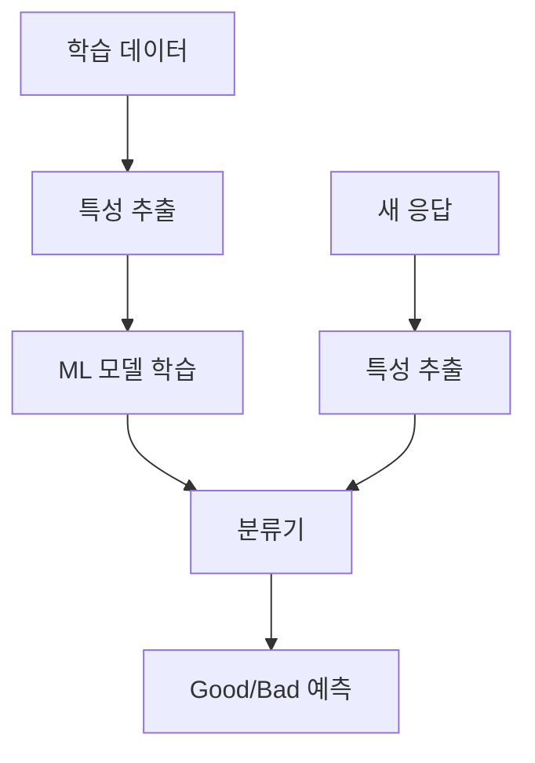
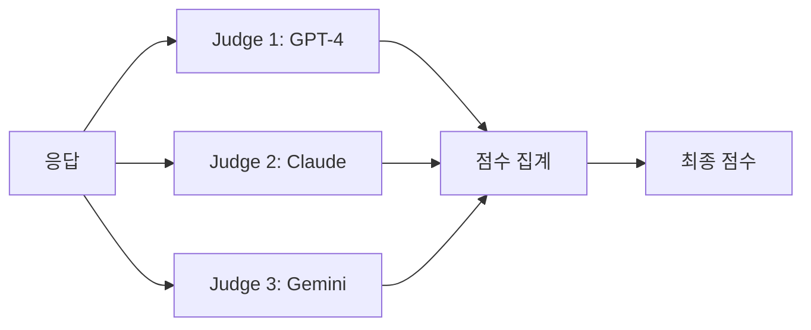
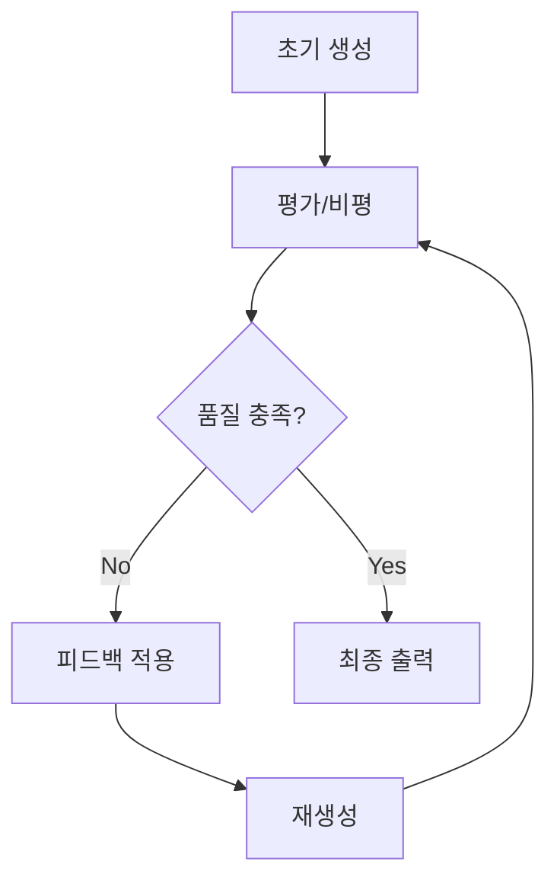
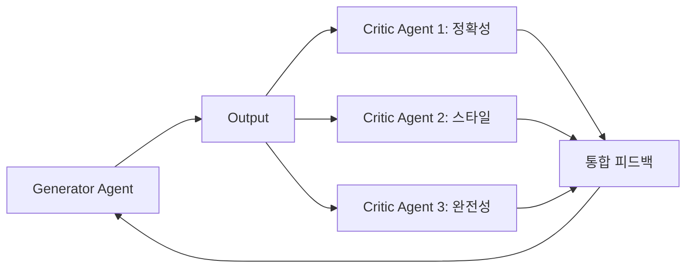
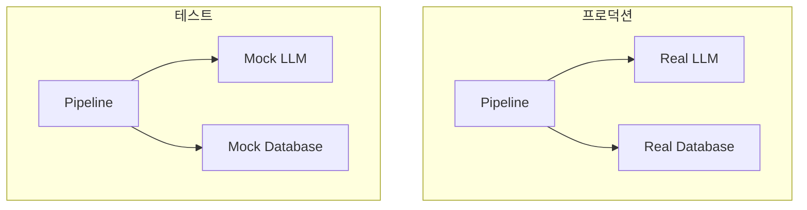
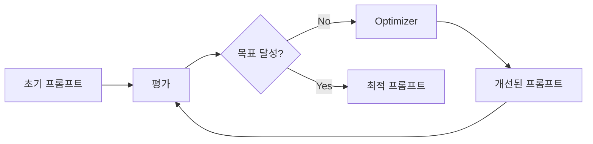
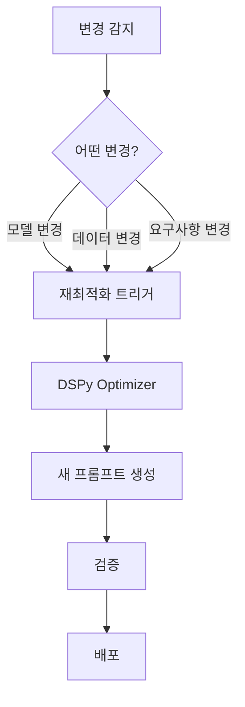

# Chapter 6: 신뢰성 향상 (Improving Reliability)

---

### 📌 핵심 요약
> GenAI 모델은 본질적으로 확률적이기 때문에 일관되지 않은 출력, 사실의 부정확성, 환각(Hallucination) 문제를 가집니다. 이 장에서는 이러한 문제를 완화하기 위한 네 가지 패턴을 소개합니다: **LLM-as-Judge**(LLM을 평가자로 활용), **Reflection**(자기 성찰을 통한 개선), **Dependency Injection**(테스트 가능한 구조 설계), **Prompt Optimization**(체계적 프롬프트 최적화). 이 패턴들을 통해 GenAI 애플리케이션의 품질과 신뢰성을 크게 향상시킬 수 있습니다.

---

### 🎯 학습 목표
- LLM-as-Judge 패턴의 세 가지 구현 방식(프롬프팅, ML, 파인튜닝)을 이해한다
- Reflection 패턴을 통한 자기 개선 메커니즘을 학습한다
- Dependency Injection으로 테스트 가능한 GenAI 파이프라인을 설계할 수 있다
- DSPy 프레임워크를 활용한 프롬프트 자동 최적화 방법을 익힌다
- 각 패턴의 적합한 사용 시나리오와 trade-off를 파악한다

---

### 📖 본문 정리

## 1. 패턴 17: LLM-as-Judge (LLM을 평가자로 활용)

### 1.1 개념 소개

**LLM-as-Judge**는 LLM의 출력 품질을 평가하기 위해 LLM 자체를 평가자로 활용하는 패턴입니다. 기존에는 사람이 직접 평가하거나 BLEU, ROUGE 같은 기계적 메트릭을 사용했지만, 이런 방식들은 각각 비용과 한계가 있습니다.


### 1.2 구현 방식

#### 방식 1: 프롬프팅 기반 (Prompting)

가장 간단한 방법으로, LLM에게 점수 매기는 방법을 프롬프트로 설명합니다.

**핵심 구성 요소:**
- **Scoring Rubric (채점 기준표)**: 각 점수가 무엇을 의미하는지 명확히 정의
- **Calibration (보정)**: 기대하는 점수와 실제 점수 분포 일치

```python
# 채점 기준표 예시
rubric = """
5점: 쿼리에 완벽하게 답변하고 모든 정보가 정확함
4점: 대부분 정확하나 사소한 오류 있음
3점: 부분적으로 정확하나 중요한 정보 누락
2점: 관련성은 있으나 부정확한 정보 포함
1점: 쿼리와 관련 없거나 완전히 부정확함
"""

prompt = f"""
다음 응답을 1-5점 척도로 평가하세요.

{rubric}

쿼리: {query}
응답: {response}

점수와 간단한 이유를 제시하세요.
"""
```

**고려사항:**
| 문제 | 해결 방법 |
|------|-----------|
| **관대함 편향** (Leniency Bias) | 점수 분포 명시, 예시 포함 |
| **일관성 부족** | 세분화된 척도(1-5점) 대신 이진/삼진 척도 사용 |
| **자기 편향** (Self-bias) | 다른 모델을 평가자로 사용 |
| **위치 편향** | 응답 순서 무작위화 |

#### 방식 2: ML 기반

로지스틱 회귀 같은 간단한 ML 모델을 사용하여 "좋은/나쁜" 응답을 예측합니다.



**장점:**
- 프롬프팅보다 빠르고 저렴
- 대량 평가에 적합

**단점:**
- 레이블된 학습 데이터 필요
- 설명 가능성 제한적

#### 방식 3: 파인튜닝 기반

LLM을 파인튜닝하여 인간 평가자처럼 행동하도록 훈련합니다.

**훈련 방식:**
1. **지도 학습**: 인간 점수가 매겨진 데이터로 직접 학습
2. **GRPO (Group Relative Policy Optimization)**: 선호도 데이터로 강화학습

```python
# GRPO 개념 - 응답 그룹 내 상대적 순위 학습
training_example = {
    "query": "Python 리스트 정렬 방법은?",
    "responses": [
        {"text": "sort() 또는 sorted() 사용", "human_score": 5},
        {"text": "정렬하려면...", "human_score": 3},
        {"text": "Python은 언어입니다", "human_score": 1}
    ]
}
```

### 1.3 LLM-as-Jury (배심원단 방식)

단일 평가자의 편향을 줄이기 위해 **여러 LLM 평가자**를 사용합니다.



---

## 2. 패턴 18: Reflection (자기 성찰)

### 2.1 개념 소개

**Reflection**은 LLM이 자신의 출력을 비판적으로 평가하고 개선하는 반복적 프로세스입니다. "Critique → Apply Feedback → Regenerate" 루프를 통해 품질을 점진적으로 향상시킵니다.



### 2.2 실제 예시: 로고 디자인

```python
class LogoDesignAgent:
    def __init__(self, generator, critic, max_iterations=3):
        self.generator = generator
        self.critic = critic
        self.max_iterations = max_iterations

    def design(self, requirements):
        # 1. 초기 생성
        current_design = self.generator.generate(requirements)

        for i in range(self.max_iterations):
            # 2. 비평 (Critique)
            feedback = self.critic.evaluate(current_design, requirements)

            # 3. 품질 체크
            if feedback.is_satisfactory:
                break

            # 4. 피드백 반영하여 재생성
            current_design = self.generator.improve(
                current_design,
                feedback.suggestions
            )

        return current_design
```

### 2.3 평가자 유형

| 평가자 유형 | 설명 | 사용 시나리오 |
|-------------|------|---------------|
| **LLM 자체** | 동일 또는 다른 LLM이 평가 | 일반적인 품질 평가 |
| **외부 도구** | 컴파일러, 린터, API 등 | 코드 검증, 형식 검사 |
| **인간** | 사람의 직접 피드백 | 창의적 작업, 주관적 판단 |

### 2.4 응용: 멀티 에이전트 Reflection



---

## 3. 패턴 19: Dependency Injection (의존성 주입)

### 3.1 개념 소개

**Dependency Injection**은 GenAI 파이프라인을 테스트 가능하게 만드는 소프트웨어 설계 패턴입니다. LLM 호출을 추상화하여 테스트 시 Mock 객체로 대체할 수 있게 합니다.



### 3.2 실제 예시: 도서 마케팅 시스템

```python
from abc import ABC, abstractmethod
from typing import Protocol

# 인터페이스 정의
class LLMInterface(Protocol):
    def generate(self, prompt: str) -> str:
        ...

class DatabaseInterface(Protocol):
    def get_book_info(self, isbn: str) -> dict:
        ...

# 실제 구현
class OpenAILLM:
    def generate(self, prompt: str) -> str:
        # 실제 API 호출
        return openai.ChatCompletion.create(...)

# Mock 구현
class MockLLM:
    def __init__(self, responses: dict):
        self.responses = responses

    def generate(self, prompt: str) -> str:
        # 미리 정의된 응답 반환
        for key, response in self.responses.items():
            if key in prompt:
                return response
        return "Default mock response"

# 파이프라인 (의존성 주입)
class BookMarketingPipeline:
    def __init__(self, llm: LLMInterface, db: DatabaseInterface):
        self.llm = llm  # 주입된 의존성
        self.db = db

    def generate_marketing_copy(self, isbn: str) -> str:
        book = self.db.get_book_info(isbn)
        prompt = f"다음 책의 마케팅 문구를 작성하세요: {book['title']}"
        return self.llm.generate(prompt)

# 테스트 코드
def test_marketing_pipeline():
    mock_llm = MockLLM({
        "마케팅 문구": "이 책은 최고의 선택입니다!"
    })
    mock_db = MockDatabase({
        "978-1234": {"title": "Python 마스터"}
    })

    pipeline = BookMarketingPipeline(llm=mock_llm, db=mock_db)
    result = pipeline.generate_marketing_copy("978-1234")

    assert "최고" in result
```

### 3.3 함수 주입 패턴 (Python)

클래스 대신 함수를 주입하는 더 가벼운 방식:

```python
from typing import Callable

def create_pipeline(
    llm_fn: Callable[[str], str] = None,
    search_fn: Callable[[str], list] = None
):
    # 기본값: 실제 구현
    llm_fn = llm_fn or real_llm_call
    search_fn = search_fn or real_search

    def run(query: str) -> str:
        context = search_fn(query)
        return llm_fn(f"Context: {context}\nQuery: {query}")

    return run

# 프로덕션
pipeline = create_pipeline()

# 테스트
test_pipeline = create_pipeline(
    llm_fn=lambda x: "mock response",
    search_fn=lambda x: ["mock context"]
)
```

### 3.4 장점

| 장점 | 설명 |
|------|------|
| **테스트 용이성** | API 호출 없이 빠른 단위 테스트 |
| **비용 절감** | 개발/테스트 중 LLM 비용 절약 |
| **재현성** | Mock으로 동일 결과 보장 |
| **병렬 개발** | LLM 없이도 파이프라인 개발 가능 |

---

## 4. 패턴 20: Prompt Optimization (프롬프트 최적화)

### 4.1 개념 소개

**Prompt Optimization**은 프롬프트를 체계적으로 개선하는 자동화된 접근 방식입니다. 수동 프롬프트 엔지니어링의 한계를 극복하고, 의존성(모델, 데이터 등)이 변경될 때 자동으로 프롬프트를 업데이트합니다.



### 4.2 DSPy 프레임워크

**DSPy**는 프롬프트를 프로그래밍적으로 정의하고 자동 최적화하는 프레임워크입니다.

```python
import dspy

# 1. Signature 정의 (입출력 명세)
class QuestionAnswer(dspy.Signature):
    """주어진 컨텍스트에서 질문에 답변합니다."""
    context: str = dspy.InputField(desc="관련 정보")
    question: str = dspy.InputField(desc="사용자 질문")
    answer: str = dspy.OutputField(desc="간결한 답변")

# 2. Module 정의 (파이프라인 로직)
class RAGModule(dspy.Module):
    def __init__(self, retriever):
        self.retriever = retriever
        self.generate = dspy.ChainOfThought(QuestionAnswer)

    def forward(self, question):
        context = self.retriever(question)
        return self.generate(context=context, question=question)

# 3. Metric 정의 (평가 기준)
def answer_accuracy(example, prediction):
    return example.answer.lower() in prediction.answer.lower()

# 4. Optimizer로 최적화
optimizer = dspy.BootstrapFewShot(
    metric=answer_accuracy,
    max_bootstrapped_demos=4
)

optimized_module = optimizer.compile(
    RAGModule(retriever),
    trainset=training_examples
)
```

### 4.3 주요 Optimizer 종류

| Optimizer | 설명 | 사용 시나리오 |
|-----------|------|---------------|
| **BestOfN** | N개 프롬프트 중 최고 선택 | 빠른 비교 평가 |
| **BootstrapFewShot** | 자동 few-shot 예시 생성 | 예시 기반 학습 |
| **MIPRO** | 지시문 + 예시 동시 최적화 | 종합 최적화 |
| **MIPROv2** | 베이지안 최적화 적용 | 효율적 탐색 |

### 4.4 자동 재최적화



### 4.5 DSPy Signature 고급 사용

```python
# Chain-of-Thought 자동 적용
class MathProblem(dspy.Signature):
    """수학 문제를 단계별로 풀이합니다."""
    problem: str = dspy.InputField()
    reasoning: str = dspy.OutputField(desc="단계별 풀이 과정")
    answer: float = dspy.OutputField()

# TypedPredictor로 타입 검증
predictor = dspy.TypedPredictor(MathProblem)
result = predictor(problem="2x + 5 = 15일 때 x는?")
# result.answer는 float 타입 보장
```

---

### 🔍 심화 학습

#### LLM-as-Judge 관련 연구
- **Judging LLM-as-a-Judge** (Zheng et al., 2023): LLM 평가자의 편향과 한계 분석
- **G-Eval** (Liu et al., 2023): Chain-of-Thought 기반 평가 프레임워크
- **출처**: https://arxiv.org/abs/2306.05685

#### Reflection 관련 연구
- **Self-Refine** (Madaan et al., 2023): 자기 개선 프레임워크
- **Reflexion** (Shinn et al., 2023): 언어 에이전트의 강화학습적 자기 성찰
- **출처**: https://arxiv.org/abs/2303.17651

#### DSPy 프레임워크
- **공식 문서**: https://dspy-docs.vercel.app/
- **GitHub**: https://github.com/stanfordnlp/dspy
- **논문**: "DSPy: Compiling Declarative Language Model Calls" (Khattab et al., 2023)

#### GRPO (Group Relative Policy Optimization)
- DeepSeek-R1에서 사용된 강화학습 기법
- 응답 그룹 내 상대적 품질 학습
- **출처**: https://arxiv.org/abs/2501.12948

---

### 💡 실무 적용 포인트

#### 1. 평가 시스템 설계
```
프로젝트 규모에 따른 LLM-as-Judge 선택:
- 소규모: 프롬프팅 방식 (빠른 구현)
- 중규모: ML 분류기 (비용 효율)
- 대규모: 파인튜닝 (정확도 우선)
```

#### 2. Reflection 적용 가이드
```python
# 반복 횟수 제한 필수!
MAX_ITERATIONS = 3  # 무한 루프 방지

# 개선 여부 감지
def should_continue(prev_score, curr_score, threshold=0.1):
    return curr_score - prev_score > threshold
```

#### 3. 테스트 전략
```
개발 단계별 테스트:
1. 단위 테스트: Mock LLM으로 로직 검증
2. 통합 테스트: 실제 LLM으로 E2E 검증
3. 회귀 테스트: 골든 데이터셋 유지
```

#### 4. 프롬프트 관리
```
프롬프트 버전 관리:
- Git으로 프롬프트 이력 추적
- A/B 테스트로 성능 비교
- DSPy로 자동 최적화 파이프라인 구축
```

---

### ✅ 정리 체크리스트

- [ ] LLM-as-Judge의 세 가지 구현 방식 (프롬프팅, ML, 파인튜닝) 이해
- [ ] Scoring Rubric 설계 원칙과 보정(Calibration) 방법 숙지
- [ ] Reflection 패턴의 Critique-Apply-Regenerate 루프 이해
- [ ] Dependency Injection으로 테스트 가능한 구조 설계 가능
- [ ] Mock 객체 활용한 단위 테스트 작성 가능
- [ ] DSPy의 Signature, Module, Optimizer 개념 이해
- [ ] BootstrapFewShot, BestOfN 등 Optimizer 선택 기준 파악
- [ ] 각 패턴의 적합한 사용 시나리오 판단 가능

---

### 🔗 참고 자료

- [DSPy 공식 문서](https://dspy-docs.vercel.app/)
- [LangChain Evaluation](https://python.langchain.com/docs/guides/evaluation)
- [OpenAI Evals](https://github.com/openai/evals)
- [RAGAS - RAG 평가 프레임워크](https://docs.ragas.io/)
- [DeepEval - LLM 평가 라이브러리](https://docs.deepeval.com/)
- [Reflexion 논문](https://arxiv.org/abs/2303.11366)
- [Self-Refine 논문](https://arxiv.org/abs/2303.17651)
- [G-Eval 논문](https://arxiv.org/abs/2303.16634)

---

*이 문서는 "Generative AI Design Patterns" Chapter 6을 기반으로 작성되었습니다.*
