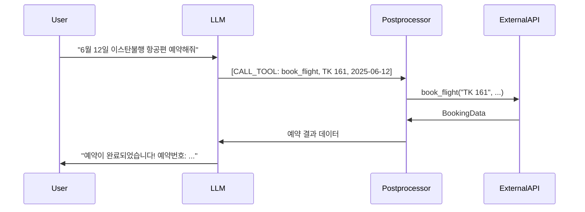
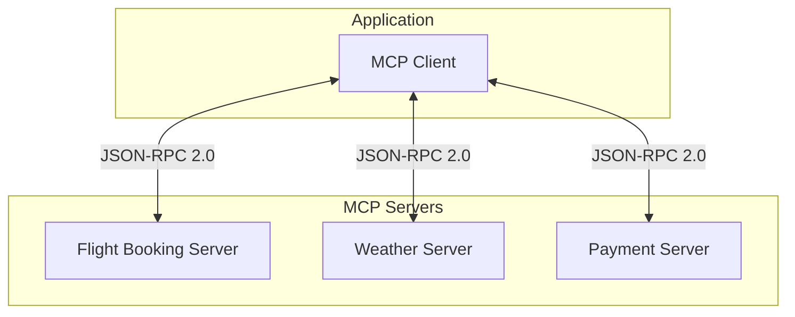
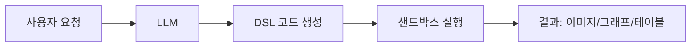
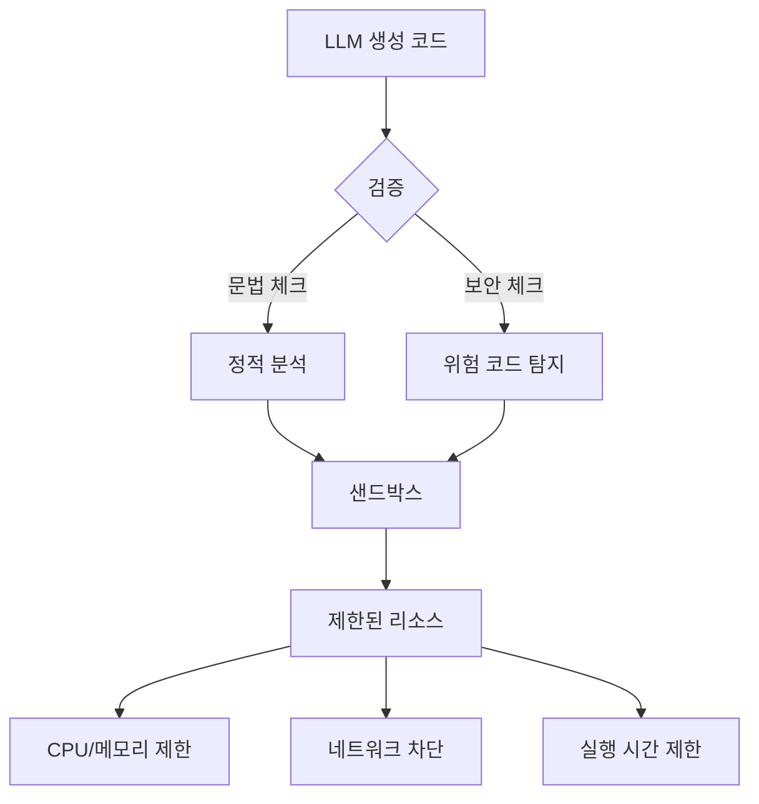
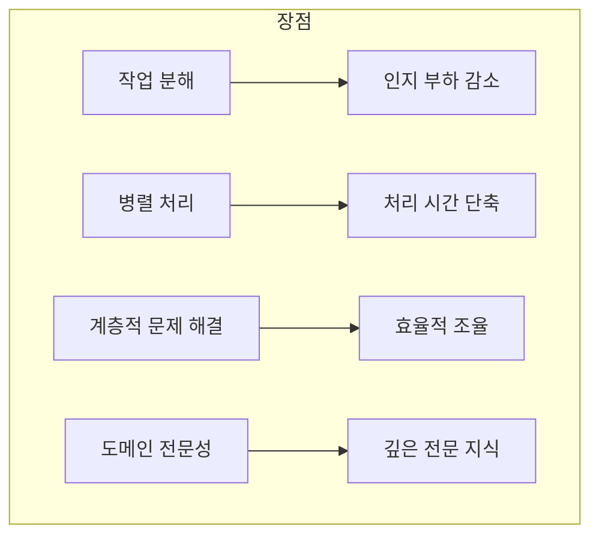
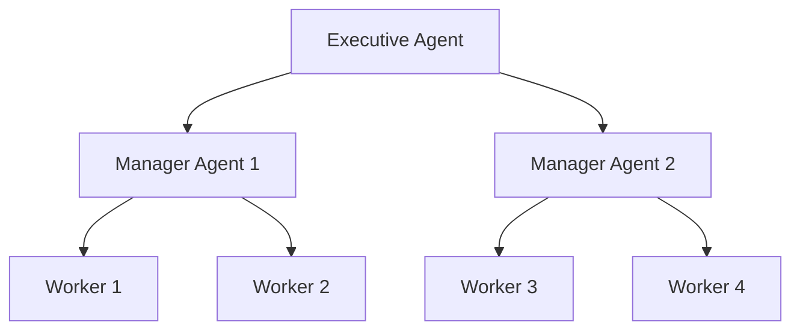
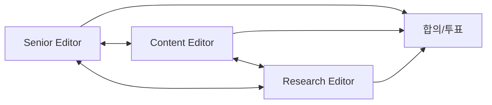
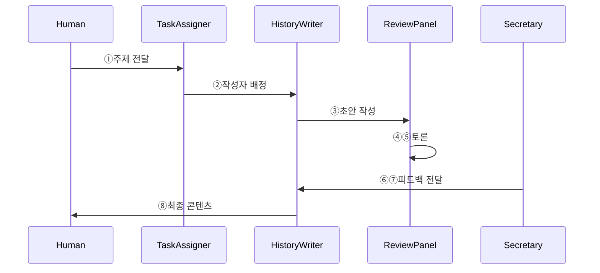

# Chapter 7: 에이전트의 행동 활성화 (Enabling Agents to Take Action)

---

### 📌 핵심 요약
> 이전 장까지의 패턴들이 콘텐츠 생성에 초점을 맞췄다면, 이 장에서는 AI 모델이 **실제 세계와 상호작용**할 수 있게 하는 세 가지 패턴을 다룹니다. **Tool Calling**(패턴 21)은 LLM이 외부 함수를 호출하여 정보를 얻거나 환경을 변경할 수 있게 합니다. **Code Execution**(패턴 22)은 LLM이 코드를 생성하고 실행하여 복잡한 문제를 해결합니다. **Multiagent Collaboration**(패턴 23)은 특화된 AI 에이전트들을 계층적, P2P, 또는 시장 기반 아키텍처로 조직화하여 분업을 통해 복잡한 작업을 수행합니다. 이러한 패턴들은 GenAI 애플리케이션을 **Agentic(에이전틱)**하게 만드는 핵심 요소입니다.

---

### 🎯 학습 목표
- Tool Calling의 동작 원리와 OpenAI/MCP 구현 방식을 이해한다
- ReAct 패턴(추론과 행동의 결합)을 활용할 수 있다
- Code Execution을 통해 DSL 기반 작업(그래프, SQL 등)을 처리할 수 있다
- Multiagent 아키텍처(계층적, P2P, 시장 기반)의 특징과 적용 시나리오를 파악한다
- 프롬프트 인젝션 공격에 대한 6가지 방어 패턴을 이해한다
- A2A 프로토콜을 활용한 에이전트 간 통신 방법을 익힌다

---

### 📖 본문 정리

## 1. 패턴 21: Tool Calling (도구 호출)

### 1.1 개념 소개

**Tool Calling**은 LLM이 외부 세계와 상호작용할 수 있게 하는 패턴입니다. LLM은 함수 호출이 필요할 때 특수 토큰과 인자를 출력하고, 클라이언트 측 후처리기가 실제 함수를 호출한 뒤 결과를 LLM에 반환합니다.



### 1.2 Tool Calling이 여는 가능성

| 활용 분야 | 설명 | 예시 |
|-----------|------|------|
| **최신 정보** | RAG보다 동적인 실시간 정보 제공 | 뉴스, 날씨, 주가 |
| **개인화** | 개인 워크스페이스 연동 | 이메일, 캘린더 |
| **엔터프라이즈 API** | 내부 시스템 연동 | 사내 검색, 트랜잭션 DB |
| **계산** | 복잡한 연산 수행 | 계산기, GIS, 최적화 솔버 |
| **ReAct** | 추론과 행동의 인터리빙 | CoT + Tool Calling 결합 |

### 1.3 OpenAI 구현 방식

#### Step 1: 함수 구현
```python
@dataclass
class BookingData:
    flight_number: str
    departure_time: datetime
    seat_number: str
    payment_method: str
    invoiced_amount: float

def book_flight(flight_code: str, departure_date: datetime,
                cabin_class: CabinClass) -> BookingData:
    response = requests.post(
        "https://api.turkishairlines.com/...",
        json={...}
    )
    return BookingData(**response.json())
```

#### Step 2: 도구 정의 및 모델 호출
```python
tools = [{
    "type": "function",
    "name": "book_flight",
    "description": "Books a flight using the airline API",
    "parameters": {
        "type": "object",
        "properties": {
            "flight_code": {
                "type": "string",
                "description": "IATA flight code like AA 123"
            },
            "departure_date": {
                "type": "string",
                "description": "Date in YYYY-MM-DD format"
            },
            "cabin_class": {
                "type": "string",
                "enum": ["economy", "premium_economy", "business", "first"]
            }
        }
    }
}]

response = client.responses.create(
    model="gpt-4.1",
    input=[{"role": "user", "content": "..."}],
    tools=tools,
)
```

#### Step 3-4: 클라이언트 측 처리 및 결과 반환
```python
# 응답에서 도구 호출 정보 추출
tool_call = response.output[0]
if tool_call.name == "book_flight":
    args = json.loads(tool_call.arguments)
    result = book_flight(args["flight_code"], ...)

# 결과를 메시지에 추가하여 재호출
input_messages.append(tool_call)
input_messages.append({
    "type": "function_call_output",
    "call_id": tool_call.call_id,
    "output": json.dumps(result)
})

response_2 = client.responses.create(
    model="gpt-4.1",
    input=input_messages,
    tools=tools,
)
```

### 1.4 MCP(Model Context Protocol) 방식

MCP는 Anthropic이 제안한 표준화된 프로토콜로, Tool Calling을 더 간결하게 만듭니다.



#### MCP 서버 구현
```python
from mcp import FastMCP

mcp = FastMCP("weather")

@mcp.tool()
async def get_weather_from_nws(latitude: float, longitude: float) -> str:
    """Fetches weather data from the National Weather Service API"""
    base_url = "https://api.weather.gov/points/"
    points_url = f"{base_url}{latitude},{longitude}"
    response = requests.get(points_url, headers=headers)
    # ... 처리 로직
    return weather_data

if __name__ == "__main__":
    mcp.run(transport="streamable-http")
```

#### MCP 클라이언트 + LangGraph ReAct 에이전트
```python
from langchain_mcp_adapters.client import MultiServerMCPClient
import langgraph.prebuilt

async with MultiServerMCPClient({
    "weather": {
        "url": "http://localhost:8000/mcp",
        "transport": "streamable_http",
    }
}) as client:
    agent = langgraph.prebuilt.create_react_agent(
        "anthropic:claude-3-7-sonnet-latest",
        client.get_tools()
    )
    response = await agent.ainvoke({
        "messages": [{"role": "user", "content": "시카고 화요일 날씨는?"}]
    })
```

### 1.5 프롬프트 인젝션 방어 패턴

Tool Calling은 보안 취약점을 증가시킵니다. 6가지 방어 패턴:

| 패턴 | 설명 |
|------|------|
| **Action-Selector** | 사전 정의된 액션만 허용, 도구 피드백 차단 |
| **Plan-Then-Execute** | 고정된 계획 수립 후 실행, 계획 변경 불가 |
| **Map-Reduce** | 격리된 서브에이전트로 신뢰할 수 없는 데이터 처리 |
| **Dual-LLM** | 권한 있는 LLM(계획/도구)과 샌드박스 LLM(데이터 처리) 분리 |
| **Code-Then-Execute** | 정형화된 프로그램 작성 후 실행 |
| **Context-Minimization** | 불필요한 컨텍스트 제거, 후속 단계에서 원본 프롬프트 삭제 |

---

## 2. 패턴 22: Code Execution (코드 실행)

### 2.1 개념 소개

**Code Execution**은 LLM이 DSL(Domain-Specific Language) 코드를 생성하고, 외부 시스템이 이를 실행하여 결과를 생성하는 패턴입니다.



### 2.2 Tool Calling vs Code Execution

| 특성 | Tool Calling | Code Execution |
|------|-------------|----------------|
| **입력 형태** | 짧은 파라미터 목록 | 긴 DSL 문자열 |
| **적합한 작업** | API 호출, 단순 함수 | 그래프, SQL, 이미지 처리 |
| **예시** | `book_flight("TK161", ...)` | Matplotlib, SQL, Mermaid |

### 2.3 실제 예시: 토너먼트 결과 시각화

#### Step 1: LLM에 DOT DSL 생성 요청
```python
prompt = """
농구 토너먼트 결과를 Graphviz DOT 형식으로 변환하세요.

예시:
Input: (1) Florida 84, (3) Texas Tech 79
Output: "Florida" -> "Texas Tech" [label="84-79"]

{tournament_results}
"""
```

#### Step 2: 생성된 DOT 코드 실행
```bash
dot -Grankdir=LR -Tpng tournament.dot -o tournament.png
```

### 2.4 샌드박스 환경 고려사항



**주요 고려사항:**
- Docker, VM 등으로 격리
- CPU, 메모리, 실행 시간 제한
- 네트워크 접근 제어
- 컴파일러 오류는 LLM에 피드백하여 Reflection 적용

---

## 3. 패턴 23: Multiagent Collaboration (다중 에이전트 협업)

### 3.1 단일 에이전트의 한계

| 한계 | 설명 |
|------|------|
| **인지적 병목** | 유한한 컨텍스트 윈도우와 계산 용량 |
| **파라미터 효율성 감소** | 모델 크기 증가에 따른 수익 체감 |
| **제한된 추론 깊이** | 다중 사고 라인 병렬 탐색 어려움 |
| **도메인 적응 문제** | 일반 모델의 전문 영역 약점 |

### 3.2 멀티에이전트 시스템의 장점



### 3.3 멀티에이전트 아키텍처 유형

#### 1) 계층적 구조 (Hierarchical)



**Sequential Workflow (프롬프트 체이닝):**
```python
from langchain.chains import LLMChain, SequentialChain

paragraph_chain = LLMChain(llm=llm, prompt=paragraph_prompt,
                           output_key="paragraph")
title_chain = LLMChain(llm=llm, prompt=title_prompt,
                       output_key="title")
keywords_chain = LLMChain(llm=llm, prompt=keywords_prompt,
                          output_key="keywords")

overall_chain = SequentialChain(
    chains=[paragraph_chain, title_chain, keywords_chain],
    input_variables=["topic"],
    output_variables=["paragraph", "title", "keywords"],
)
```

#### 2) P2P 네트워크 (Peer-to-Peer)



**CrewAI 합의 태스크:**
```python
voting_task = Task(
    description="3라운드 토론 후 ACCEPT/REJECT/REVISE 결정",
    agent=[senior_editor, content_editor, research_editor],
    context=[review_task_1, review_task_2, review_task_3],
)
```

#### 3) 시장 기반 시스템 (Market-based)

```python
def run_auction(agents, task_description):
    bids = {}
    for agent in agents:
        prompt = f"이 작업에 대한 입찰가를 제시하세요: {task_description}"
        bid_response = agent.run(prompt)
        bids[agent.name] = int(bid_response.output)

    winner = max(bids, key=bids.get)
    return winner, bids[winner]
```

### 3.4 실제 예시: 교육 콘텐츠 생성



**AG2 프레임워크 구현:**
```python
from ag2 import ConversableAgent, LLMConfig

llm_config = LLMConfig(
    api_type="google",
    model="gemini-2.0-flash",
    temperature=0.2,
)

with llm_config:
    history_writer = ConversableAgent(
        name="history_writer",
        system_message="You are a historian..."
    )
    math_writer = ConversableAgent(
        name="math_writer",
        system_message="You are a math teacher..."
    )
```

### 3.5 A2A(Agent2Agent) 프로토콜

```python
# Python Pydantic 에이전트를 A2A로 노출
from pydantic_ai import Agent
agent = Agent('openai:gpt-4.1', ...)
app = agent.to_a2a()

# TypeScript Mastra에서 Python 에이전트 호출
import { A2A } from "@mastra/client-js";
const a2a = new A2A({ serverUrl: "https://server.com:8093" });
const task = await a2a.sendTask({
    id: randomUUID(),
    message: { role: 'user', parts: [...] }
});
```

### 3.6 실패 모드와 고려사항

연구에 따르면 멀티에이전트 시스템의 **40-80%가 실패**합니다.

| 실패 범주 | 설명 | 예시 |
|-----------|------|------|
| **Specification Issues** | 시스템 설계 결함 | 역할 미정의, 컨텍스트 손실 |
| **Interagent Misalignment** | 에이전트 간 조율 실패 | 대화 리셋, 정보 은닉 |
| **Task Verification** | 검증 프로세스 부족 | 조기 종료, 오류 미탐지 |

**Anthropic 권장사항:** 복잡한 프레임워크보다 **단순하고 조합 가능한 패턴** 사용

---

### 🔍 심화 학습

#### Tool Calling 관련
- **ReAct 논문** (Yao et al., 2022): 추론과 행동의 인터리빙
- **Toolformer 논문** (Schick et al., 2023): LLM의 도구 사용 학습
- **MCP 공식 문서**: https://modelcontextprotocol.io/
- **출처**: https://arxiv.org/abs/2210.03629

#### Code Execution 관련
- **CodeT5** (Wang et al., 2021): 코드 의미론 활용 트랜스포머
- **HumanEval** (Chen et al., 2021): 코드 생성 벤치마크
- **출처**: https://arxiv.org/abs/2107.03374

#### Multiagent 관련
- **Andrew Ng의 Agentic Design Patterns** (2024): Reflection, Tool Use, Planning, Multiagent
- **Google Multiagent White Paper** (2025)
- **A2A Protocol**: https://google.github.io/a2a/
- **Cemri et al. (2025)**: 멀티에이전트 실패 분석
- **출처**: https://arxiv.org/abs/2503.13657

#### 프롬프트 인젝션 방어
- **Beurer-Kellner et al. (2025)**: Tool Calling 보안 설계 패턴
- **출처**: https://arxiv.org/abs/2501.06662

---

### 💡 실무 적용 포인트

#### 1. Tool Calling 신뢰성 향상
```
필수 체크리스트:
□ 명확한 함수명과 파라미터 설명
□ 시스템 프롬프트에 정책 명시 (언제 검색 vs 예약)
□ 유효 입력 예시 제공 (항공편 코드 형식)
□ Enum 등 타입 제약 활용
□ 도구 개수 제한 (3-10개)
```

#### 2. MCP 현재 한계점 (2025년 기준)
```
인지해야 할 한계:
- 보안: 인증/인가 미구현 → Cloudflare OAuth 확장 활용
- 협업: 단방향 통신 → A2A/ACP 프로토콜 보완
- 스트리밍: 30-60초 타임아웃 → streamable HTTP 사용
```

#### 3. Code Execution 가이드
```python
# 안전한 Code Execution 패턴
def safe_execute(code: str, max_time: int = 30):
    # 1. 정적 분석
    if contains_dangerous_patterns(code):
        raise SecurityError("Dangerous code detected")

    # 2. 샌드박스에서 실행
    with DockerSandbox(timeout=max_time) as sandbox:
        result = sandbox.run(code)

    # 3. 실패 시 Reflection
    if result.error:
        return retry_with_feedback(code, result.error)

    return result
```

#### 4. 멀티에이전트 선택 기준
```
단일 에이전트 우선:
- UX 디자인으로 해결 가능한가?
- Human-in-the-loop로 충분한가?
- 고객 기대치 조정이 가능한가?

멀티에이전트 선택 시:
- 병렬 실행 가능한 독립 작업인가? (가장 효과적)
- 다중 도메인 전문성이 필요한가?
- 적대적 검증이 필요한가?
```

---

### ✅ 정리 체크리스트

- [ ] Tool Calling의 4단계 프로세스 (함수 구현 → 도구 정의 → 클라이언트 처리 → 결과 반환) 이해
- [ ] MCP 서버/클라이언트 구현 방법 숙지
- [ ] ReAct 패턴(CoT + Tool Calling) 활용 가능
- [ ] 프롬프트 인젝션 6가지 방어 패턴 파악
- [ ] Code Execution과 Tool Calling의 사용 시나리오 구분 가능
- [ ] 샌드박스 환경 구성 요소 이해
- [ ] 멀티에이전트 3가지 아키텍처(계층적, P2P, 시장 기반) 특징 파악
- [ ] A2A 프로토콜을 통한 에이전트 간 통신 이해
- [ ] 멀티에이전트 실패 모드 3가지 범주 인지

---

### 🔗 참고 자료

- [MCP 공식 문서](https://modelcontextprotocol.io/)
- [LangGraph ToolNode 문서](https://langchain-ai.github.io/langgraph/)
- [OpenAI Function Calling 가이드](https://platform.openai.com/docs/guides/function-calling)
- [A2A Protocol (Google)](https://google.github.io/a2a/)
- [AG2 Framework](https://github.com/ag2ai/ag2)
- [CrewAI](https://github.com/joaomdmoura/crewAI)
- [Devin - Autonomous Coding Assistant](https://devin.ai/)
- [GitHub MCP Server](https://github.com/github/github-mcp-server)
- [Zapier AI Actions](https://actions.zapier.com/)
- [ReAct 논문](https://arxiv.org/abs/2210.03629)
- [Toolformer 논문](https://arxiv.org/abs/2302.04761)

---

*이 문서는 "Generative AI Design Patterns" Chapter 7을 기반으로 작성되었습니다.*
