# Chapter 8: 제약 조건 해결 (Addressing Constraints)

---

### 📌 핵심 요약
> 프로덕션 환경에서 LLM을 배포할 때는 단순히 모델이 작동하는 것을 넘어 **비용, 지연 시간, 확장성, 상태 관리** 등의 제약 조건을 해결해야 합니다. 이 장에서는 5가지 패턴을 다룹니다: **Small Language Model(SLM)**(패턴 24)은 증류, 양자화, 투기적 디코딩으로 비용/지연을 최적화합니다. **Prompt Caching**(패턴 25)은 반복 요청의 효율을 높입니다. **Inference Optimization**(패턴 26)은 연속 배칭과 프롬프트 압축으로 처리량을 극대화합니다. **Degradation Testing**(패턴 27)은 부하 테스트와 핵심 메트릭으로 성능 저하를 감지합니다. **Long-Term Memory**(패턴 28)은 사용자 컨텍스트의 장기 유지를 가능케 합니다.

---

### 🎯 학습 목표
- SLM의 3가지 최적화 기법(증류, 양자화, 투기적 디코딩)을 이해한다
- 클라이언트/서버/시맨틱 캐싱의 차이점과 적용 시나리오를 파악한다
- 연속 배칭과 프롬프트 압축의 동작 원리를 설명할 수 있다
- LLM 성능 테스트의 4대 핵심 메트릭(TTFT, EERL, TPS, RPS)을 활용할 수 있다
- Mem0를 활용한 장기 메모리 구현 방법을 익힌다
- 작업 기억, 에피소드 기억, 절차적 기억, 의미적 기억의 개념을 구분한다

---

### 📖 본문 정리

## 1. 패턴 24: Small Language Model (SLM)

### 1.1 개념 소개

대규모 언어 모델(LLM)은 강력하지만 **비용과 지연 시간** 측면에서 프로덕션 제약이 있습니다. **SLM(Small Language Model)**은 이러한 제약을 해결하기 위한 패턴입니다.

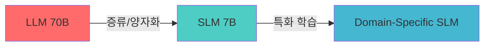

### 1.2 SLM 선택이 적합한 상황

| 시나리오 | SLM 적합성 | 이유 |
|----------|------------|------|
| 단일 도메인 특화 작업 | ✅ 높음 | 작은 모델도 특화 학습으로 충분한 성능 |
| 실시간 응답 필수 | ✅ 높음 | 낮은 지연 시간 |
| 비용 민감 환경 | ✅ 높음 | 추론 비용 절감 |
| 복잡한 추론 필요 | ❌ 낮음 | 대형 모델 필요 |
| 다양한 도메인 처리 | ❌ 낮음 | 범용성 부족 |

### 1.3 기법 1: 지식 증류 (Knowledge Distillation)

**지식 증류**는 큰 "교사" 모델의 지식을 작은 "학생" 모델에게 전수하는 기법입니다.

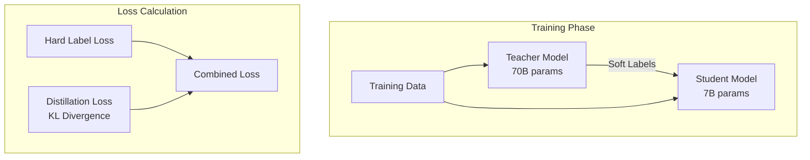

#### 핵심 개념: KL Divergence Loss

```python
import torch
import torch.nn.functional as F

def distillation_loss(student_logits, teacher_logits,
                      labels, temperature=2.0, alpha=0.5):
    """
    지식 증류 손실 함수

    Args:
        student_logits: 학생 모델의 출력
        teacher_logits: 교사 모델의 출력
        labels: 실제 정답 레이블
        temperature: 소프트맥스 온도 (높을수록 부드러운 분포)
        alpha: 증류 손실과 하드 레이블 손실의 비율
    """
    # Soft targets from teacher (temperature로 smoothing)
    soft_targets = F.softmax(teacher_logits / temperature, dim=-1)
    soft_student = F.log_softmax(student_logits / temperature, dim=-1)

    # KL Divergence: 교사와 학생 분포의 차이 측정
    distill_loss = F.kl_div(soft_student, soft_targets,
                           reduction='batchmean') * (temperature ** 2)

    # Hard label loss: 실제 정답과의 Cross Entropy
    hard_loss = F.cross_entropy(student_logits, labels)

    # 두 손실의 가중 합
    return alpha * distill_loss + (1 - alpha) * hard_loss
```

#### 온도(Temperature)의 역할

| Temperature | 출력 분포 특성 | 용도 |
|-------------|----------------|------|
| T = 1.0 | 원래 분포 | 일반 추론 |
| T > 1.0 | 부드러운 분포 | 증류 학습 (지식 전달) |
| T < 1.0 | 날카로운 분포 | 확신도 높은 예측 |

### 1.4 기법 2: 양자화 (Quantization)

**양자화**는 모델 가중치의 정밀도를 낮춰 메모리 사용량과 연산량을 줄이는 기법입니다.

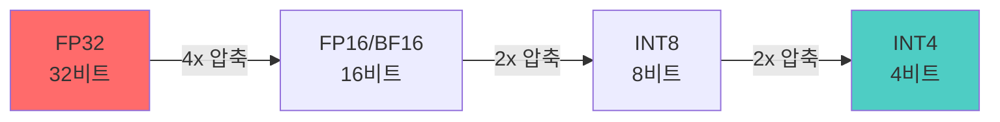

#### BitsAndBytes를 이용한 4bit 양자화

```python
from transformers import AutoModelForCausalLM, BitsAndBytesConfig
import torch

# 4bit 양자화 설정
quantization_config = BitsAndBytesConfig(
    load_in_4bit=True,                    # 4비트 양자화 활성화
    bnb_4bit_quant_type="nf4",           # NormalFloat4 타입 (권장)
    bnb_4bit_compute_dtype=torch.bfloat16,  # 연산은 BF16으로
    bnb_4bit_use_double_quant=True,       # 이중 양자화로 추가 압축
)

# 양자화된 모델 로드
model = AutoModelForCausalLM.from_pretrained(
    "meta-llama/Llama-2-70b-hf",
    quantization_config=quantization_config,
    device_map="auto",  # 자동으로 GPU/CPU에 분산
)
```

#### 양자화 수준별 비교

| 정밀도 | 메모리 (70B 모델) | 품질 저하 | 적용 시나리오 |
|--------|-------------------|-----------|---------------|
| FP32 | ~280GB | 없음 | 학습 |
| FP16/BF16 | ~140GB | 거의 없음 | 일반 추론 |
| INT8 | ~70GB | 미미함 | 배포 최적화 |
| INT4 | ~35GB | 약간 있음 | 엣지 디바이스 |

### 1.5 기법 3: 투기적 디코딩 (Speculative Decoding)

**투기적 디코딩**은 작은 "드래프트" 모델로 여러 토큰을 빠르게 생성하고, 큰 "타겟" 모델이 이를 병렬로 검증하는 기법입니다.

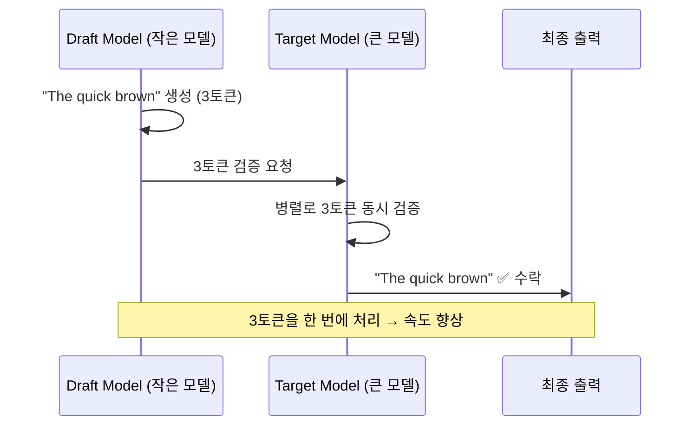

#### vLLM을 이용한 투기적 디코딩

```python
from vllm import LLM, SamplingParams

# 투기적 디코딩 설정
llm = LLM(
    model="meta-llama/Llama-2-70b-hf",      # 타겟 모델
    speculative_model="TinyLlama/TinyLlama-1.1B-Chat-v1.0",  # 드래프트 모델
    num_speculative_tokens=5,                # 한 번에 추측할 토큰 수
    use_v2_block_manager=True,
)

# 추론 실행
sampling_params = SamplingParams(temperature=0.7, max_tokens=100)
outputs = llm.generate(["Once upon a time"], sampling_params)
```

#### 투기적 디코딩의 핵심 원리

1. **드래프트 모델**: 작고 빠른 모델이 K개의 토큰을 빠르게 생성
2. **병렬 검증**: 타겟 모델이 K개 토큰을 한 번에 검증 (순차 생성보다 빠름)
3. **수락/거부**: 검증 통과 토큰은 수락, 실패 시 해당 위치부터 재생성
4. **속도 향상**: 드래프트 모델의 정확도가 높을수록 효과적

---

## 2. 패턴 25: Prompt Caching (프롬프트 캐싱)

### 2.1 개념 소개

많은 LLM 요청은 유사한 프롬프트 패턴을 반복합니다. **Prompt Caching**은 이러한 중복 계산을 줄여 비용과 지연 시간을 최적화합니다.

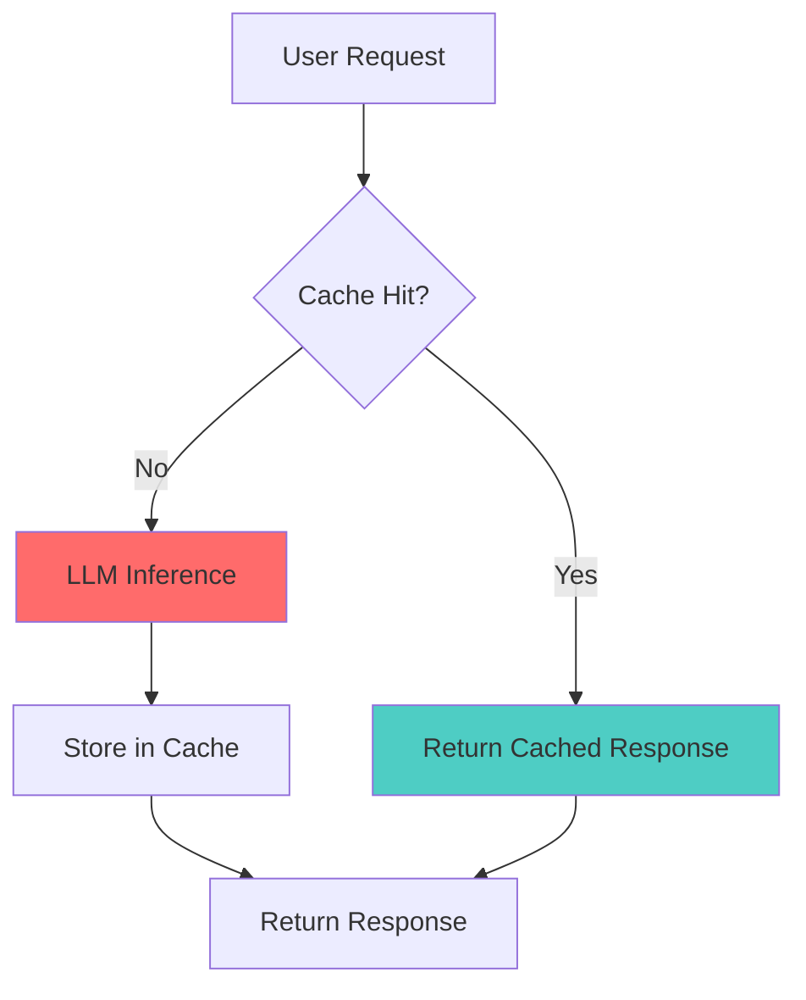

### 2.2 캐싱 유형별 비교

| 유형 | 동작 방식 | 장점 | 단점 |
|------|-----------|------|------|
| **클라이언트 캐싱** | 애플리케이션 레벨 메모이제이션 | 완전한 제어, 비용 0 | 완전 일치만 지원 |
| **서버 캐싱** | 프롬프트 접두사의 KV 캐시 재사용 | 접두사 일치 지원, 자동화 | 공급자 의존 |
| **시맨틱 캐싱** | 의미적 유사성 기반 매칭 | 유사 질문 처리 | 오탐 위험 |

### 2.3 클라이언트 측 캐싱 (LangChain)

```python
from langchain_openai import ChatOpenAI
from langchain_core.globals import set_llm_cache
from langchain_community.cache import InMemoryCache

# 인메모리 캐시 설정
set_llm_cache(InMemoryCache())

llm = ChatOpenAI(model="gpt-4o")

# 첫 번째 호출: LLM 실제 호출
response1 = llm.invoke("프랑스의 수도는?")  # ~800ms

# 두 번째 호출: 캐시에서 즉시 반환
response2 = llm.invoke("프랑스의 수도는?")  # ~1ms
```

#### SQLite 기반 영구 캐시

```python
from langchain_community.cache import SQLiteCache

# 파일 기반 영구 캐시
set_llm_cache(SQLiteCache(database_path=".langchain.db"))

# 애플리케이션 재시작 후에도 캐시 유지
```

### 2.4 서버 측 캐싱 (Prefix Caching)

서버 측 캐싱은 프롬프트 **접두사**의 KV(Key-Value) 캐시를 재사용합니다.

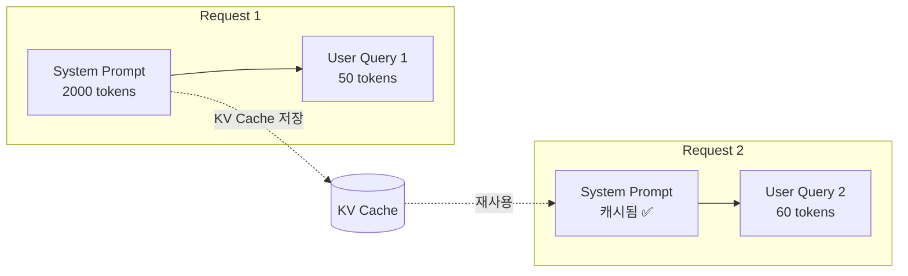

#### OpenAI의 자동 프롬프트 캐싱

OpenAI는 1,024토큰 이상의 프롬프트에 대해 **자동 캐싱**을 적용합니다:

```python
# 긴 시스템 프롬프트 (캐시 대상)
system_prompt = """
[매우 긴 시스템 프롬프트: 약 2000토큰]
당신은 법률 전문가입니다...
[상세한 지침들]
"""

# 첫 번째 요청: 전체 처리
response1 = client.chat.completions.create(
    model="gpt-4o",
    messages=[
        {"role": "system", "content": system_prompt},
        {"role": "user", "content": "계약 해지 조건은?"}
    ]
)

# 두 번째 요청: 시스템 프롬프트 캐시 히트 → 50% 비용 절감
response2 = client.chat.completions.create(
    model="gpt-4o",
    messages=[
        {"role": "system", "content": system_prompt},  # 캐시됨!
        {"role": "user", "content": "손해배상 청구는?"}
    ]
)
```

### 2.5 시맨틱 캐싱 (Semantic Caching)

**시맨틱 캐싱**은 **의미적으로 유사한** 질문에 대해 캐시된 응답을 반환합니다.

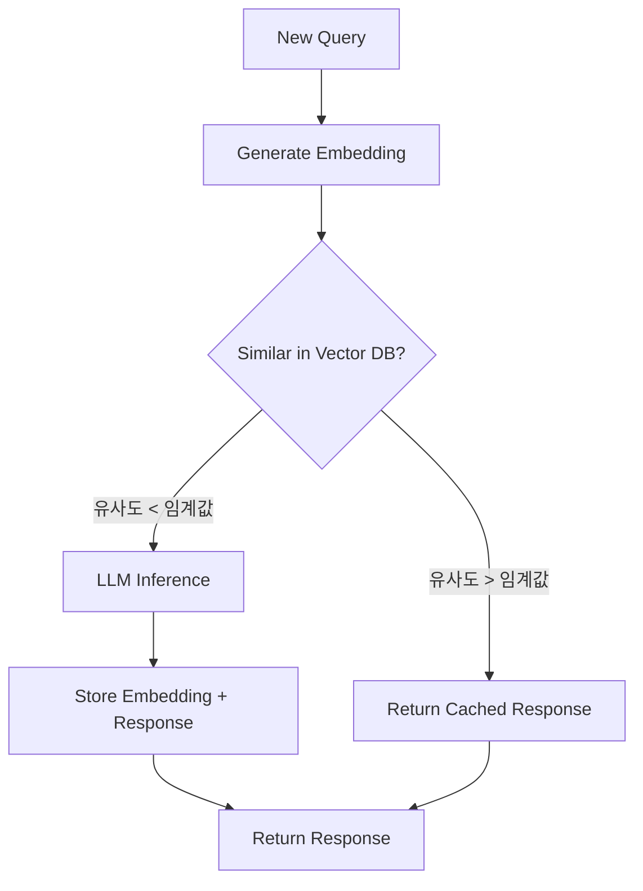

#### LangChain 시맨틱 캐시 구현

```python
from langchain_community.cache import RedisSemanticCache
from langchain_openai import OpenAIEmbeddings

# Redis + 벡터 유사도 기반 시맨틱 캐시
set_llm_cache(
    RedisSemanticCache(
        redis_url="redis://localhost:6379",
        embedding=OpenAIEmbeddings(),
        score_threshold=0.95,  # 95% 이상 유사도일 때만 캐시 히트
    )
)

# "프랑스 수도가 뭐야?" → 캐시 히트 (유사 질문 존재)
# "프랑스의 수도는 어디인가요?" → 캐시 히트
# "독일 수도는?" → 캐시 미스 (다른 질문)
```

#### 시맨틱 캐싱의 주의점

| 장점 | 위험 |
|------|------|
| 유사 질문 중복 처리 제거 | **오탐 위험**: 미묘하게 다른 질문에 잘못된 응답 |
| 비용 절감 | **컨텍스트 무시**: 동일 질문이라도 컨텍스트에 따라 답이 다를 수 있음 |
| 응답 시간 단축 | **캐시 무효화 어려움**: 정보 변경 시 관리 복잡 |

---

## 3. 패턴 26: Inference Optimization (추론 최적화)

### 3.1 개념 소개

LLM 추론 성능을 최적화하기 위한 **모델 서빙** 레벨의 기법들입니다.

### 3.2 연속 배칭 (Continuous Batching)

기존 배칭은 모든 요청이 완료될 때까지 대기하지만, **연속 배칭**은 요청이 완료되는 즉시 새 요청을 추가합니다.

```mermaid
gantt
    title 정적 배칭 vs 연속 배칭
    dateFormat X
    axisFormat %s

    section 정적 배칭
    Request A (짧음) :a1, 0, 3
    Request B (김)   :a2, 0, 8
    Request C (대기) :a3, 8, 11

    section 연속 배칭
    Request A :b1, 0, 3
    Request C (즉시 시작) :b3, 3, 6
    Request B :b2, 0, 8
```

#### vLLM의 연속 배칭

```python
from vllm import LLM, SamplingParams

# vLLM은 기본적으로 연속 배칭 사용
llm = LLM(
    model="meta-llama/Llama-2-7b-hf",
    max_num_batched_tokens=4096,  # 배치당 최대 토큰
    max_num_seqs=256,             # 동시 처리 시퀀스 수
)

# 여러 요청 병렬 처리
prompts = [
    "Explain quantum computing",
    "Write a haiku about AI",
    "Summarize machine learning",
]

outputs = llm.generate(prompts, SamplingParams(max_tokens=100))
```

### 3.3 프롬프트 압축 (Prompt Compression)

긴 프롬프트를 압축하여 처리 속도를 높이고 비용을 줄이는 기법입니다.

#### 하드 프롬프트 압축 (Hard Prompt Compression)

텍스트 자체를 요약하거나 중요 토큰만 추출합니다.

```python
from llmlingua import PromptCompressor

# LLMLingua를 이용한 프롬프트 압축
compressor = PromptCompressor(
    model_name="microsoft/llmlingua-2-bert-base-multilingual-cased-meetingbank",
    use_llmlingua2=True,
)

original_prompt = """
[매우 긴 문서: 10,000 토큰]
이 문서는 기계 학습의 역사와 발전에 대해 다루고 있습니다...
"""

# 1/4로 압축 (10,000 → 2,500 토큰)
compressed = compressor.compress_prompt(
    original_prompt,
    rate=0.25,  # 25%만 유지
    force_tokens=["중요한", "핵심"],  # 반드시 유지할 토큰
)

print(f"원본: {len(original_prompt)} chars → 압축: {len(compressed['compressed_prompt'])} chars")
```

#### 소프트 프롬프트 압축 (Soft Prompt Compression)

텍스트 대신 **학습된 임베딩 벡터**로 컨텍스트를 표현합니다.

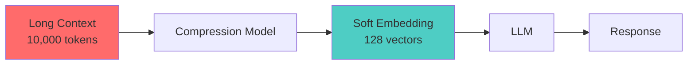

### 3.4 추론 최적화 기법 비교

| 기법 | 최적화 대상 | 효과 | 복잡도 |
|------|------------|------|--------|
| 연속 배칭 | 처리량 (Throughput) | 2-3x 향상 | 낮음 |
| 투기적 디코딩 | 지연 시간 (Latency) | 1.5-3x 향상 | 중간 |
| 프롬프트 압축 | 비용 + 지연 시간 | 2-4x 절감 | 중간 |
| 양자화 | 메모리 + 비용 | 2-8x 절감 | 낮음 |
| KV 캐시 최적화 | 메모리 | 2-4x 절감 | 높음 |

---

## 4. 패턴 27: Degradation Testing (성능 저하 테스트)

### 4.1 개념 소개

LLM 기반 시스템의 성능 한계를 파악하고 **적절한 성능 저하(Graceful Degradation)**를 보장하기 위한 테스트입니다.

### 4.2 핵심 성능 메트릭

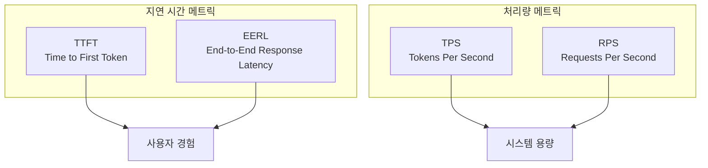

| 메트릭 | 정의 | 측정 대상 | 이상적인 값 |
|--------|------|-----------|-------------|
| **TTFT** | 첫 토큰 생성까지 시간 | 초기 응답성 | < 500ms |
| **EERL** | 전체 응답 완료 시간 | 총 지연 시간 | < 5s (짧은 응답) |
| **TPS** | 초당 생성 토큰 수 | 생성 속도 | > 50 tokens/s |
| **RPS** | 초당 처리 요청 수 | 시스템 용량 | 애플리케이션 의존 |

### 4.3 테스트 유형

#### 1. 부하 테스트 (Load Testing)

정상 및 예상 최대 부하에서의 성능을 측정합니다.

```python
import asyncio
import aiohttp
import time

async def load_test(endpoint: str, num_requests: int,
                   concurrency: int) -> dict:
    """
    동시 요청으로 부하 테스트 수행
    """
    semaphore = asyncio.Semaphore(concurrency)
    results = []

    async def single_request():
        async with semaphore:
            start = time.time()
            async with aiohttp.ClientSession() as session:
                async with session.post(endpoint, json={"prompt": "test"}) as resp:
                    await resp.json()
            return time.time() - start

    tasks = [single_request() for _ in range(num_requests)]
    results = await asyncio.gather(*tasks)

    return {
        "avg_latency": sum(results) / len(results),
        "p50": sorted(results)[len(results)//2],
        "p99": sorted(results)[int(len(results)*0.99)],
        "rps": num_requests / max(results),
    }

# 테스트 실행
metrics = asyncio.run(load_test(
    "http://localhost:8000/generate",
    num_requests=1000,
    concurrency=50
))
```

#### 2. 스트레스 테스트 (Stress Testing)

시스템 한계점을 찾기 위해 부하를 점진적으로 증가시킵니다.

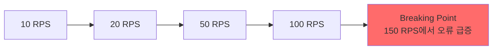

#### 3. 확장성 테스트 (Scalability Testing)

수평/수직 확장 시 성능 변화를 측정합니다.

| 인스턴스 수 | RPS | 효율성 |
|------------|-----|--------|
| 1 | 50 | 100% |
| 2 | 95 | 95% |
| 4 | 180 | 90% |
| 8 | 340 | 85% |

### 4.4 테스트 도구

```python
# Locust를 이용한 LLM 부하 테스트
from locust import HttpUser, task, between

class LLMUser(HttpUser):
    wait_time = between(1, 3)  # 요청 간 대기 시간

    @task
    def generate(self):
        self.client.post("/generate", json={
            "prompt": "Explain the concept of...",
            "max_tokens": 100,
        })

    @task(2)  # 2배 빈도로 실행
    def short_query(self):
        self.client.post("/generate", json={
            "prompt": "What is AI?",
            "max_tokens": 20,
        })
```

### 4.5 적절한 성능 저하 전략

| 상황 | 전략 | 구현 |
|------|------|------|
| 높은 지연 | 응답 길이 제한 | `max_tokens` 동적 조절 |
| 과부하 | 요청 제한 | Rate limiting |
| GPU 부족 | 큐잉 | 비동기 처리 + 우선순위 큐 |
| 모델 장애 | 폴백 | 더 작은 모델로 전환 |
| 타임아웃 | 부분 응답 | 스트리밍 + 중단 가능 |

---

## 5. 패턴 28: Long-Term Memory (장기 메모리)

### 5.1 개념 소개

LLM의 컨텍스트 윈도우는 제한적입니다. **Long-Term Memory**는 세션을 넘어 사용자 정보와 상호작용 기록을 유지합니다.

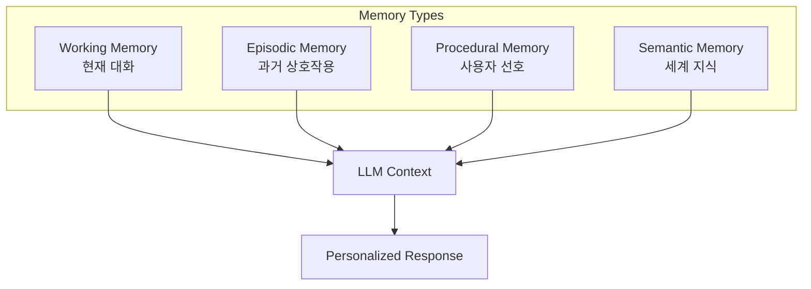

### 5.2 메모리 유형

| 유형 | 저장 내용 | 예시 |
|------|----------|------|
| **작업 기억 (Working)** | 현재 대화 컨텍스트 | "방금 말한 코드 수정해줘" |
| **에피소드 기억 (Episodic)** | 과거 상호작용 이력 | "저번에 Python 프로젝트 도와줬지" |
| **절차적 기억 (Procedural)** | 사용자 선호/패턴 | "이 사용자는 간결한 답변 선호" |
| **의미적 기억 (Semantic)** | 도메인 지식 | "이 사용자는 ML 전문가" |

### 5.3 Mem0를 이용한 장기 메모리 구현

**Mem0**는 LLM을 위한 오픈소스 메모리 레이어입니다.

```python
from mem0 import Memory

# 메모리 초기화
memory = Memory()

# 사용자와의 대화에서 메모리 추출 및 저장
result = memory.add(
    messages=[
        {"role": "user", "content": "저는 Python과 Go를 주로 사용합니다"},
        {"role": "assistant", "content": "알겠습니다. Python과 Go 개발자시군요!"},
        {"role": "user", "content": "네, 특히 백엔드 개발을 좋아해요"},
    ],
    user_id="user_123",
    metadata={"category": "preferences"}
)

print(result)
# Output:
# [
#   {"memory": "User prefers Python and Go", "category": "preferences"},
#   {"memory": "User is a backend developer", "category": "preferences"}
# ]
```

#### 메모리 검색 및 활용

```python
# 관련 메모리 검색
memories = memory.search(
    query="이 사용자가 선호하는 프로그래밍 언어는?",
    user_id="user_123",
    limit=5
)

# 검색된 메모리를 LLM 컨텍스트에 주입
context = "\n".join([m["memory"] for m in memories])

prompt = f"""
사용자에 대한 정보:
{context}

사용자 질문: 새 프로젝트에 어떤 언어를 추천하시나요?
"""

response = llm.generate(prompt)
```

### 5.4 메모리 아키텍처

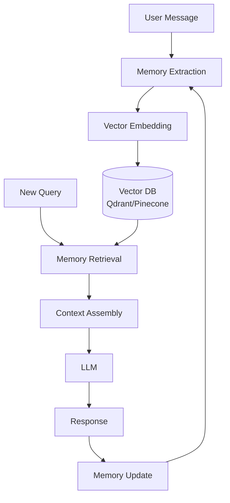

### 5.5 메모리 관리 전략

| 전략 | 설명 | 사용 시점 |
|------|------|-----------|
| **TTL (Time-To-Live)** | 일정 기간 후 자동 삭제 | 단기 정보 |
| **중요도 기반 보존** | LLM이 중요도 평가 | 핵심 정보 필터링 |
| **요약 압축** | 오래된 메모리 요약 | 메모리 용량 관리 |
| **명시적 삭제** | 사용자 요청 시 삭제 | 프라이버시 준수 |

```python
# 메모리 관리 예시
memory = Memory(config={
    "vector_store": {
        "provider": "qdrant",
        "config": {"collection_name": "user_memories"}
    },
    "llm": {
        "provider": "openai",
        "config": {"model": "gpt-4o-mini"}
    },
    "history_db_path": "./memory_history.db",  # 메모리 이력 저장
})

# 특정 사용자의 모든 메모리 조회
all_memories = memory.get_all(user_id="user_123")

# 특정 메모리 삭제
memory.delete(memory_id="mem_abc123")

# 사용자의 모든 메모리 삭제 (GDPR 준수)
memory.delete_all(user_id="user_123")
```

---

### 🔍 심화 학습

#### 1. SLM 관련 최신 연구

**DistilBERT & TinyBERT 논문**
- [DistilBERT (Sanh et al., 2019)](https://arxiv.org/abs/1910.01108): BERT의 40% 크기로 97% 성능
- [TinyBERT (Jiao et al., 2020)](https://arxiv.org/abs/1909.10351): Transformer 증류의 상세 기법

**양자화 기법**
- [GPTQ (Frantar et al., 2023)](https://arxiv.org/abs/2210.17323): Post-training 양자화
- [QLoRA (Dettmers et al., 2023)](https://arxiv.org/abs/2305.14314): 양자화 + LoRA 결합

#### 2. 추론 최적화 프레임워크

| 프레임워크 | 주요 기능 | 적합한 사용 사례 |
|------------|----------|------------------|
| **vLLM** | PagedAttention, 연속 배칭 | 고처리량 서빙 |
| **TensorRT-LLM** | NVIDIA 최적화, INT4/INT8 | GPU 최대 활용 |
| **llama.cpp** | CPU 추론, 양자화 | 엣지 디바이스 |
| **Ollama** | 로컬 실행, 간편 설치 | 개발/테스트 |

#### 3. 장기 메모리 솔루션

- **Mem0**: 오픈소스, 자체 호스팅 가능
- **LangChain Memory**: 다양한 메모리 타입 지원
- **Zep**: 대화 기록 + 요약 자동화
- **MemGPT**: 계층적 메모리 관리

---

### 💡 실무 적용 포인트

#### 1. 비용 최적화 체크리스트

```
✅ 프롬프트 캐싱 적용 (반복 시스템 프롬프트)
✅ 적절한 모델 크기 선택 (SLM vs LLM)
✅ 양자화 적용 (INT8/INT4)
✅ 프롬프트 압축 (긴 문서 처리 시)
✅ 배치 처리 활용 (실시간 불필요 시)
```

#### 2. 지연 시간 최적화 우선순위

1. **캐싱**: 가장 쉽고 효과적
2. **스트리밍**: TTFT 개선
3. **투기적 디코딩**: 순차 생성 가속
4. **모델 경량화**: 근본적 해결

#### 3. 장기 메모리 도입 시 고려사항

| 고려사항 | 질문 |
|----------|------|
| **프라이버시** | 어떤 정보를 저장할 것인가? 삭제 정책은? |
| **일관성** | 메모리 간 충돌은 어떻게 해결? |
| **용량** | 사용자당 메모리 한도는? |
| **검색 품질** | 관련 메모리를 정확히 찾을 수 있는가? |

#### 4. 성능 테스트 권장 사항

```python
# 프로덕션 배포 전 필수 테스트
performance_checklist = {
    "load_test": {
        "target_rps": 100,
        "duration": "10m",
        "success_rate": ">99.5%"
    },
    "latency_requirements": {
        "ttft_p50": "<300ms",
        "ttft_p99": "<1000ms",
        "eerl_p50": "<3s",
        "eerl_p99": "<10s"
    },
    "stress_test": {
        "find_breaking_point": True,
        "graceful_degradation": True
    }
}
```

---

### ✅ 정리 체크리스트

- [ ] SLM의 3가지 최적화 기법 (증류, 양자화, 투기적 디코딩) 이해
- [ ] 지식 증류에서 Temperature와 KL Divergence의 역할 파악
- [ ] 양자화 수준별 (FP32 → INT4) 트레이드오프 이해
- [ ] 투기적 디코딩의 드래프트-타겟 모델 구조 이해
- [ ] 클라이언트/서버/시맨틱 캐싱의 차이점 구분
- [ ] 시맨틱 캐싱의 오탐 위험 인지
- [ ] 연속 배칭 vs 정적 배칭의 차이 이해
- [ ] 프롬프트 압축 (하드/소프트)의 동작 원리 파악
- [ ] TTFT, EERL, TPS, RPS 메트릭의 의미와 측정 방법 숙지
- [ ] 부하/스트레스/확장성 테스트의 목적 구분
- [ ] Mem0를 이용한 장기 메모리 구현 방법 이해
- [ ] 4가지 메모리 유형 (작업, 에피소드, 절차적, 의미적) 구분

---

### 🔗 참고 자료

**공식 문서**
- [vLLM Documentation](https://docs.vllm.ai/)
- [BitsAndBytes](https://github.com/TimDettmers/bitsandbytes)
- [LangChain Caching](https://python.langchain.com/docs/modules/model_io/llms/llm_caching)
- [Mem0 Documentation](https://docs.mem0.ai/)

**논문**
- [Speculative Decoding (Leviathan et al., 2023)](https://arxiv.org/abs/2211.17192)
- [LLMLingua (Pan et al., 2023)](https://arxiv.org/abs/2310.05736)
- [MemGPT (Packer et al., 2023)](https://arxiv.org/abs/2310.08560)

**실습 자료**
- [vLLM Quickstart](https://docs.vllm.ai/en/latest/getting_started/quickstart.html)
- [Locust Load Testing](https://docs.locust.io/)
- [Mem0 Quickstart](https://docs.mem0.ai/quickstart)
