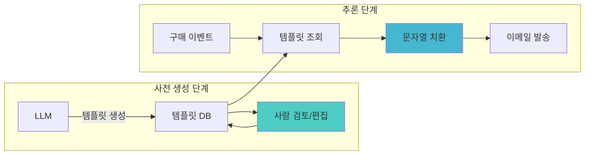
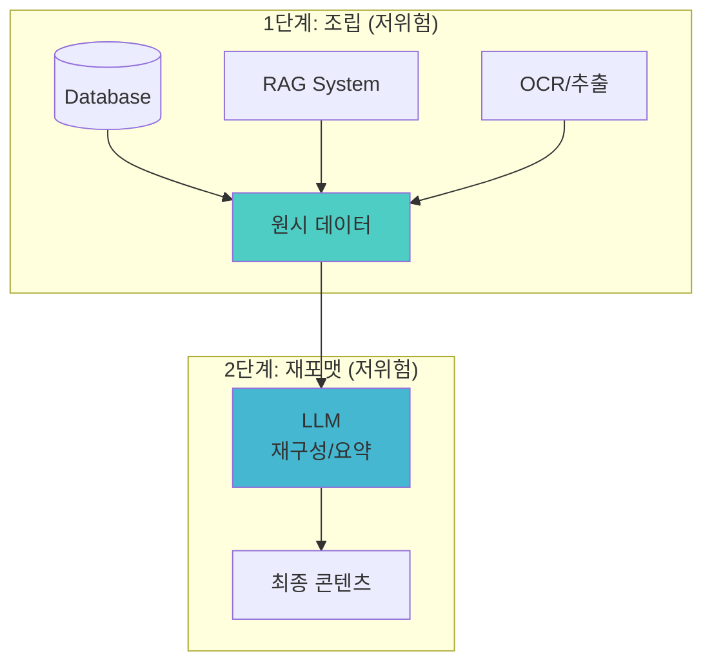
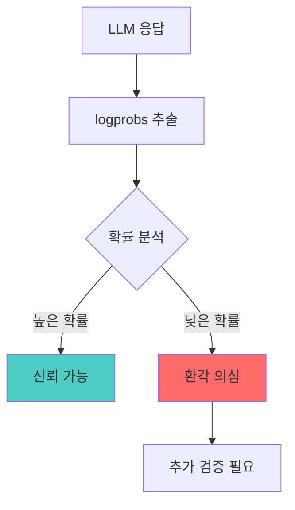
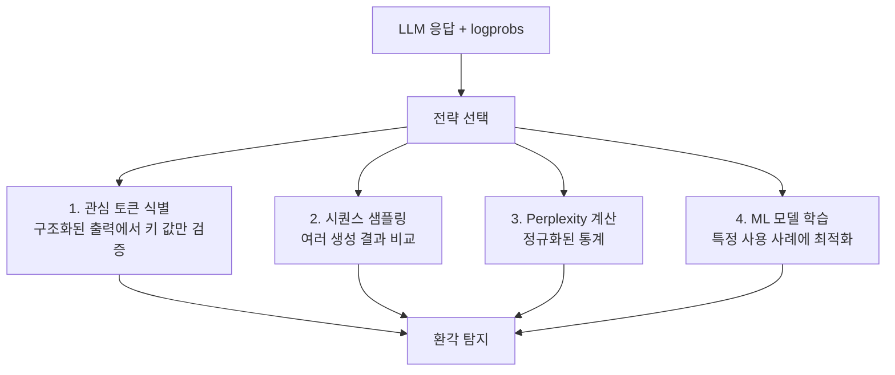
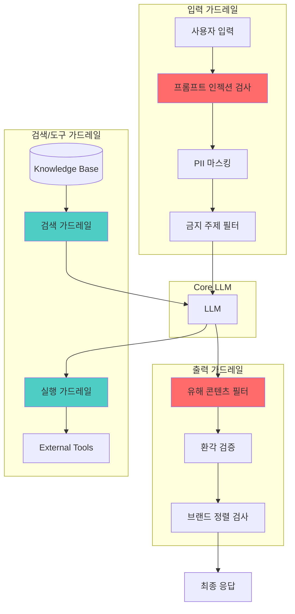
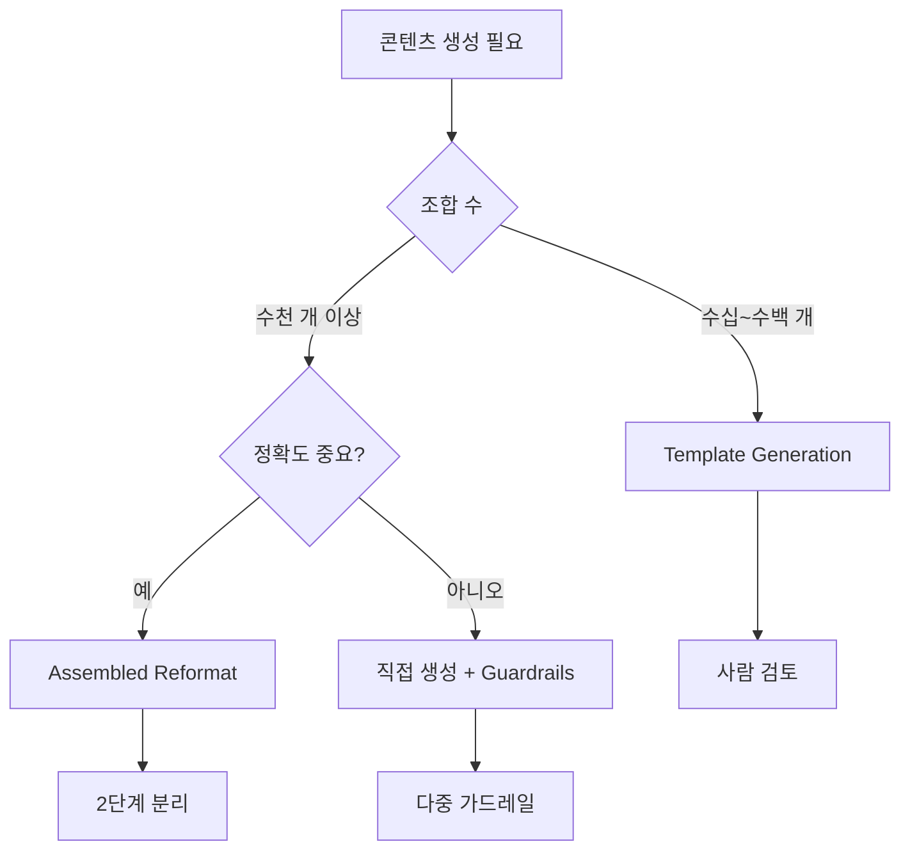

# Chapter 9: 안전장치 설정 (Setting Safeguards)

---

### 📌 핵심 요약
> GenAI 애플리케이션은 비결정적 특성으로 인해 **부정확하거나 환각된 응답**을 생성할 위험이 있습니다. 이 장에서는 4가지 안전장치 패턴을 다룹니다: **Template Generation**(패턴 29)은 사전 검토된 템플릿으로 대량 커뮤니케이션의 위험을 줄입니다. **Assembled Reformat**(패턴 30)은 데이터 수집과 포맷팅을 분리하여 환각 위험을 낮춥니다. **Self-Check**(패턴 31)은 토큰 확률(logprobs)로 환각을 비용 효율적으로 탐지합니다. **Guardrails**(패턴 32)는 보안, 프라이버시, 콘텐츠 검열, 윤리적 정렬을 위한 포괄적인 안전 레이어입니다.

---

### 🎯 학습 목표
- Template Generation으로 대량 개인화 커뮤니케이션의 위험을 관리할 수 있다
- Assembled Reformat의 2단계 분리 전략(수집 → 포맷팅)을 이해한다
- logprobs를 활용한 환각 탐지 원리와 구현 방법을 익힌다
- Guardrails의 4가지 보호 영역(보안, 프라이버시, 콘텐츠, 정렬)을 파악한다
- 프롬프트 인젝션과 탈옥(Jailbreaking) 공격에 대한 방어 전략을 수립할 수 있다
- NeMo, Guardrails AI, LLM Guard 등 가드레일 프레임워크를 활용할 수 있다

---

### 📖 본문 정리

## 1. 패턴 29: Template Generation (템플릿 생성)

### 1.1 개념 소개

**Template Generation**은 LLM이 최종 콘텐츠가 아닌 **템플릿**을 생성하게 하여, 사람이 검토할 수 있는 범위 내로 리스크를 제한하는 패턴입니다.



### 1.2 문제 상황

| 시나리오 | 문제점 |
|----------|--------|
| 투어 회사의 감사 이메일 | 하루 수천 건 → 전수 검토 불가능 |
| 부적절한 언어 위험 | 브랜드 손상 가능성 |
| 잘못된 업셀링 | 부적절하거나 논란 있는 상품 추천 |

### 1.3 해결 방법

**템플릿 수 = 조합 수**로 제한하여 사람 검토 가능하게 만듭니다:

```python
DESTINATIONS = ["Toledo, Spain", "Avila & Segovia", "Escorial Monastery"]
PACKAGE_TYPES = ["Family", "Individual", "Group", "Singles"]
LANGUAGES = ["English", "Polish"]

# 총 템플릿 수: 3 × 4 × 2 = 24개 (검토 가능한 범위)
for dest in DESTINATIONS:
    for package_type in PACKAGE_TYPES:
        for lang in LANGUAGES:
            template = create_template(dest, package_type, lang)
            db.insert(dest, package_type, lang, template)
```

### 1.4 템플릿 생성 프롬프트

```python
def create_template(tour_destination, package_type, language):
    prompt = f"""
    You are a tour guide working on behalf of Tours GenAI S.L.
    Write a personalized letter in {language} to a customer who has
    purchased a {package_type} tour package to visit {tour_destination}.

    Sound excited to see them and lead them on the tour. Explain some
    of the highlights of what they will see there.

    In the letter, use:
    - [CUSTOMER_NAME] for their name
    - [TOUR_GUIDE] for your name
    """
    template = zero_shot(GEMINI, prompt)
    # 사람 검토 및 수정
    template = human_edit_confirm(template)
    return template
```

### 1.5 추론 시점 사용

```python
# 예약 발생 시
booked_tour = get_booking_info()

# 템플릿 조회
template = db.retrieve(
    booked_tour.destination,
    booked_tour.package_type,
    booked_tour.language
)

# 결정론적 문자열 치환 (안전함)
email_body = (template
    .replace("[CUSTOMER_NAME]", booked_tour.customer_name)
    .replace("[TOUR_GUIDE]", booked_tour.tour_guide.name))

send_email(email_body)
```

### 1.6 생성된 템플릿 예시

**영어 (Toledo, Spain, Family)**:
```
Dear [CUSTOMER_NAME],

I'm absolutely thrilled to welcome you to Toledo! I'm [TOUR_GUIDE],
and I'll be your guide for your family tour.

Here's a sneak peek of what awaits you:
* **The magnificent Toledo Cathedral:** A masterpiece of Gothic architecture
* **The Alcázar of Toledo:** A formidable fortress with panoramic views

See you soon,
[TOUR_GUIDE]
```

**폴란드어 (Avila & Segovia, Family)**:
```
Szanowni Państwo, [CUSTOMER_NAME]!

Z ogromną radością witam Państwa w imieniu Tours GenAI S.L.!
Jestem [TOUR_GUIDE] i będę miał przyjemność być Państwa
przewodnikiem podczas rodzinnej wycieczki do Avili i Segowii!
```

---

## 2. 패턴 30: Assembled Reformat (조립 후 재포맷)

### 2.1 개념 소개

**Assembled Reformat**은 콘텐츠 생성을 **두 개의 저위험 단계**로 분리합니다:
1. **조립(Assembly)**: 저위험 방법(DB, OCR, RAG)으로 정확한 데이터 수집
2. **재포맷(Reformat)**: LLM으로 수집된 데이터를 매력적으로 재구성



### 2.2 문제 상황: 제품 카탈로그

| 잘못된 정보 | 위험 수준 |
|-------------|-----------|
| 리튬 배터리 → "알칼리" | 🔴 항공 안전 문제 |
| 제품 사양 오류 | 🔴 법적 책임 |
| 가격 정보 오류 | 🟡 고객 불만 |

### 2.3 구현 방법

#### Step 1: 데이터 구조 정의

```python
@dataclass
class CatalogContent:
    part_name: str = Field("Common name of part")
    part_id: str = Field("unique part id in catalog")
    part_description: str = Field("One paragraph description")
    failure_modes: list[str] = Field("list of common failure reasons")
    warranty_period: int = Field("years under warranty")
    price: str = Field("price of part")
```

#### Step 2: 저위험 데이터 수집

```python
# DB에서 정확한 데이터 조회
catalog_content = CatalogContent(
    part_name='wet_end',
    part_id='X34521PL',
    part_description='The wet end of a paper machine is the section...',
    failure_modes=['Web breaks', 'Uneven sheet formation', 'Poor drainage'],
    warranty_period=3,
    price='$23295'
)
```

#### Step 3: LLM으로 재포맷

```python
prompt = f"""
Write content in Markdown for the Replacement Parts section of the
manufacturer's website. Include a placeholder for an image.
Optimize the content for SEO. Make it appealing to potential buyers.

**Part Information:**
{catalog_content}
"""

formatted_content = llm.generate(prompt, temperature=0.7)
```

### 2.4 결과물

원시 데이터의 **3가지 failure modes**가 그대로 유지되면서 매력적으로 재구성됩니다:

```markdown
The wet end is where the magic happens—the initial formation of the
paper web. A poorly functioning wet end can lead to:

* **Web Breaks:** Major source of downtime and material waste
* **Uneven Sheet Formation:** Lower-quality paper and customer complaints
* **Poor Drainage:** Reduced machine speed and increased energy consumption

Investing in genuine replacement parts is an investment in quality.
```

### 2.5 Template Generation vs Assembled Reformat

| 기준 | Template Generation | Assembled Reformat |
|------|--------------------|--------------------|
| **검토 방식** | 템플릿 전수 검토 | 추출 로직 검증 |
| **확장성** | 조합 수 제한 | 대규모 항목 가능 |
| **동적 콘텐츠** | 제한적 | 유연함 |
| **적합 사례** | 마케팅 이메일 | 제품 카탈로그 |

---

## 3. 패턴 31: Self-Check (자기 검증)

### 3.1 개념 소개

**Self-Check**은 LLM이 반환하는 **토큰 확률(logprobs)**을 활용하여 환각을 탐지하는 패턴입니다.



### 3.2 환각 문제의 현실

Vectara의 2024-2025년 측정 결과:

| 시점 | 최고 모델 환각률 | 25위 모델 환각률 |
|------|-----------------|------------------|
| 2024년 12월 | 1.3% | 4.1% |
| 2025년 4월 | 0.7% | 2.4% |

환각률이 개선되고 있지만, **복잡한 상황이나 제약 조건**에서는 여전히 문제가 됩니다.

### 3.3 logprobs 요청 방법

```python
message = client.chat.completions.create(
    model="gpt-3.5-turbo",
    messages=[
        {"role": "user", "content": "What year was Ataturk born?"}
    ],
    logprobs=True,       # logprobs 반환 요청
    top_logprobs=5       # 상위 5개 후보 토큰
)

# 응답 처리
response_text = message.choices[0].message.content
logprobs = message.choices[0].logprobs

for token_info in logprobs.content:
    token = token_info.token
    logprob = token_info.logprob
    probability = math.exp(logprob)  # e^logprob = 확률
    print(f"Token: {token}, Probability: {probability:.2%}")
```

### 3.4 logprobs 동작 방식

#### 높은 신뢰도 예시 (아타튀르크 출생 연도)

```
질문: "What year was Ataturk born?"
응답: "Ataturk was born in 1881."
```

| 토큰 | 확률 | 해석 |
|------|------|------|
| "188" | 99.8% | 매우 확신 |
| "1" | 99.5% | 매우 확신 |

#### 낮은 신뢰도 예시 (환각)

```
질문: "Who is John Cole Howard?"
응답: "John Cole Howard is a fictional character from The Office,
       portrayed by Ed Helms."
```

| 토큰 | 확률 | 해석 |
|------|------|------|
| "The" (쇼 이름) | 38% | **환각 의심** |
| "Ed" (배우 이름) | 42% | **환각 의심** |

실제로 Ed Helms의 캐릭터는 Andy Bernard이며, John Cole Howard는 실존 인물이 아닙니다.

### 3.5 환각 탐지 전략



### 3.6 실용 예제: 영수증 처리

```python
def parse_result(response_text, logprobs) -> pd.DataFrame:
    # CSV 파싱
    csv_file = StringIO(response_text)
    result_df = pd.read_csv(csv_file, header=None,
                 names=['billed_amount', 'tax', 'tip', 'paid_amount'])

    # 라인별 최저 신뢰도 계산
    line_no = 0
    confidence_of_line = 1.0

    for token_info in logprobs.content:
        token = token_info.token
        probability = math.exp(token_info.logprob)
        confidence_of_line = min(confidence_of_line, probability)

        if '\n' in token:  # 다음 라인
            result_df.loc[line_no, 'confidence'] = confidence_of_line
            line_no += 1
            confidence_of_line = 1.0

    return result_df
```

**결과**:

| billed_amount | tax | tip | paid_amount | confidence |
|---------------|-----|-----|-------------|------------|
| 312.32 | 28.76 | 60.0 | 401.08 | 0.96 (✅ 정확) |
| 312.32 | 28.76 | 60.0 | 400.00 | 0.55 (⚠️ 1개 추정) |
| 312.21 | 28.84 | 50.0 | 391.05 | 0.17 (🔴 2개 추정) |

### 3.7 "모른다" 옵션 제공

```python
from typing import Literal

# 모델에게 "모른다"고 응답할 수 있는 옵션 제공
class ExtractionResult(BaseModel):
    currency_rate: float | Literal["Unknown"]
    confidence: float | Literal["Low"]
```

---

## 4. 패턴 32: Guardrails (가드레일)

### 4.1 개념 소개

**Guardrails**는 LLM의 입력, 출력, 컨텍스트, 도구 파라미터에 적용되는 **안전 레이어**입니다.



### 4.2 보호 영역

| 영역 | 위험 | 방어 전략 |
|------|------|-----------|
| **보안** | 프롬프트 인젝션, 탈옥 | 입력 검증, 패턴 탐지 |
| **프라이버시** | PII 노출, 기밀 정보 | 마스킹, 레다ction |
| **콘텐츠** | 유해/혐오 콘텐츠 | 독성 분류기 |
| **환각** | 사실과 다른 정보 | Self-Check, 팩트 검증 |
| **정렬** | 정책/윤리 위반 | 브랜드 보이스 검증 |

### 4.3 내장 안전 기능 (Gemini 예시)

```python
response = client.models.generate_content(
    model="gemini-2.0-flash",
    contents=[prompt, media],
    config=types.GenerateContentConfig(
        safety_settings=[
            types.SafetySetting(
                category=types.HarmCategory.HARM_CATEGORY_HATE_SPEECH,
                threshold=types.HarmBlockThreshold.BLOCK_LOW_AND_ABOVE,
            ),
        ]
    )
)
```

### 4.4 LLM Guard 프레임워크

#### 독성 검사

```python
from llm_guard.input_scanners import Toxicity

scanner = Toxicity(threshold=0.5, match_type=MatchType.SENTENCE)
sanitized_prompt, is_valid, risk_score = scanner.scan(prompt)

if not is_valid:
    raise SecurityException("Toxic content detected")
```

#### 프롬프트 인젝션 방어

```python
from llm_guard.input_scanners import PromptInjection

scanner = PromptInjection(threshold=0.5, match_type=MatchType.FULL)
sanitized_prompt, is_valid, _ = scanner.scan(prompt)
```

#### 정규식 기반 필터링

```python
from llm_guard.input_scanners import Regex

scanner = Regex(
    patterns=[r"Bearer [A-Za-z0-9-._~+/]+"],  # API 토큰 패턴
    is_blocked=True,
    match_type=MatchType.SEARCH,
    redact=True,  # 찾으면 마스킹
)
sanitized_prompt, is_valid, risk_score = scanner.scan(prompt)
```

### 4.5 커스텀 가드레일 구현

#### PII 제거 가드레일

```python
def guardrail_replace_names(to_scan: str):
    system_prompt = """
    I will give you a piece of text. Replace any personal names
    with a generic identifier.

    Example:
      Input: I met Sally in the store.
      Output: I met a woman in the store.

    Return only the modified text.
    """

    sanitized_output = llm.complete(system_prompt + "\n" + to_scan).text.strip()
    no_change = (sanitized_output == to_scan)

    return {
        "guardrail_type": "PII Removal",
        "activated": not no_change,
        "should_stop": False,
        "sanitized_output": sanitized_output,
    }
```

#### 금지 주제 가드레일

```python
def guardrail_banned_topics(to_scan: str):
    banned_topics = ["religion", "politics", "sexual innuendo"]

    system_prompt = f"""
    I will give you a piece of text. Check whether the text
    touches on any of these topics: {banned_topics}

    Return True or False, with no preamble.
    """

    response = llm.complete(system_prompt + "\n" + to_scan).text.strip()
    is_banned = (response == "True")

    return {
        "guardrail_type": "Banned Topic",
        "activated": is_banned,
        "should_stop": is_banned,
        "sanitized_output": to_scan,
    }
```

### 4.6 가드레일 적용 파이프라인

```python
def apply_guardrails(guardrails: list, prompt: str):
    sanitized_prompt = prompt

    for scanner in guardrails:
        result = scanner(sanitized_prompt)

        if result["should_stop"]:
            raise GuardrailException(f"Blocked by {result['guardrail_type']}")

        sanitized_prompt = result["sanitized_output"]

    return sanitized_prompt


# 쿼리 엔진 래핑
class GuardedQueryEngine:
    def __init__(self, query_engine):
        self._query_engine = query_engine

    def query(self, query):
        # 입력 가드레일
        sanitized = apply_guardrails(
            [guardrail_replace_names, guardrail_banned_topics],
            query
        )

        # LLM 호출
        response = self._query_engine.query(sanitized)

        # 출력 가드레일
        final = apply_guardrails(
            [guardrail_banned_topics],
            str(response)
        )

        return final
```

### 4.7 병렬 실행으로 지연 시간 최소화

```python
import asyncio

async def guarded_llm_call(prompt):
    try:
        # 입력 가드레일과 LLM 호출을 병렬 실행
        guardrail_result, llm_result = await asyncio.gather(
            apply_guardrails_async([guardrail_injection, guardrail_pii], prompt),
            llm.complete_async(prompt),
        )
    except InputGuardrailTriggered:
        # 가드레일 위반 시 LLM 결과 무시
        return "Request blocked for security reasons."

    return llm_result
```

### 4.8 가드레일 프레임워크 비교

| 프레임워크 | 특징 | 적합 사례 |
|------------|------|-----------|
| **Nvidia NeMo** | 엔터프라이즈급, 대화형 AI | 대규모 배포 |
| **Guardrails AI** | 선언적 정의, 유연성 | 다양한 정책 |
| **LLM Guard** | SLM 기반, 경량 | 빠른 추론 |
| **Azure AI Content Safety** | 클라우드 통합 | Azure 환경 |

---

### 🔍 심화 학습

#### 1. 프롬프트 인젝션 유형 (OWASP 분류)

| 유형 | 설명 | 방어 |
|------|------|------|
| **직접 인젝션** | 악성 프롬프트 직접 입력 | 입력 검증 |
| **간접 인젝션** | 외부 데이터에 페이로드 숨김 | 데이터 sanitization |
| **접미사 공격** | 랜덤 문자열로 모델 혼란 | 패턴 탐지 |
| **탈옥** | 안전 기능 우회 시도 | 다중 레이어 방어 |

#### 2. 환각 탐지 연구

- **SelfCheckGPT (Manakul et al., 2023)**: 시퀀스 생성 기반 탐지
- **ML 분류기 (Quevedo et al., 2024)**: 토큰 확률 기반 분류
- **Perplexity 분석 (Valentin et al., 2024)**: 다양한 logprobs 활용법 비교

#### 3. 가드레일 관련 논문

- [Dong et al. (2024)](https://arxiv.org/): 포인트 솔루션의 한계와 포괄적 접근 필요성
- [Carnegie Mellon 연구 (2023)](https://llm-attacks.org/): 접미사 공격 발견

---

### 💡 실무 적용 포인트

#### 1. 패턴 선택 가이드



#### 2. Self-Check 적용 체크리스트

```
✅ 구조화된 출력에서 키 필드의 logprobs 확인
✅ 임계값 설정 (예: 확률 < 50%면 경고)
✅ 낮은 신뢰도 응답에 대한 폴백 전략 수립
✅ "Unknown" 옵션 제공으로 강제 추측 방지
✅ 여러 생성 결과 비교로 일관성 검증
```

#### 3. Guardrails 도입 시 고려사항

| 고려사항 | 권장 |
|----------|------|
| **지연 시간** | 병렬 실행, SLM 기반 가드레일 |
| **유지보수** | 모델 무관한 가드레일 설계 |
| **평가** | 정기적인 bypass 시도 테스트 |
| **업데이트** | 분기별 가드레일 갱신 |

#### 4. 보안 vs 사용성 트레이드오프

```python
# 엄격한 가드레일 (높은 보안, 낮은 사용성)
strict_config = {
    "toxicity_threshold": 0.3,
    "injection_threshold": 0.2,
    "blocked_topics": ["politics", "religion", "competitors", ...]
}

# 완화된 가드레일 (낮은 보안, 높은 사용성)
relaxed_config = {
    "toxicity_threshold": 0.7,
    "injection_threshold": 0.5,
    "blocked_topics": ["explicit_violence", "hate_speech"]
}

# 사용 사례에 맞게 선택
config = strict_config if is_public_facing else relaxed_config
```

---

### ✅ 정리 체크리스트

- [ ] Template Generation의 사전 생성 → 추론 시 치환 패턴 이해
- [ ] 템플릿 수 = 조합 수 계산으로 검토 가능성 판단
- [ ] Assembled Reformat의 2단계 분리 전략 이해
- [ ] 저위험 수집 방법(DB, OCR, RAG) 식별
- [ ] logprobs를 활용한 환각 탐지 원리 이해
- [ ] 확률 = exp(logprob) 계산 방법 숙지
- [ ] 환각 탐지의 4가지 전략 파악
- [ ] Guardrails의 4가지 보호 영역 이해
- [ ] LLM Guard의 기본 사용법 숙지
- [ ] 커스텀 가드레일 함수 시그니처 이해
- [ ] 가드레일 파이프라인 적용 방법 파악
- [ ] 보안과 사용성의 트레이드오프 인지

---

### 🔗 참고 자료

**공식 문서**
- [Nvidia NeMo Guardrails](https://docs.nvidia.com/nemo/guardrails/)
- [Guardrails AI](https://www.guardrailsai.com/docs)
- [LLM Guard](https://llm-guard.com/)
- [Vectara Hallucination Leaderboard](https://huggingface.co/spaces/vectara/leaderboard)

**논문**
- [SelfCheckGPT (Manakul et al., 2023)](https://arxiv.org/abs/2303.08896)
- [Prompt Injection Attacks (OWASP)](https://owasp.org/www-project-top-10-for-large-language-model-applications/)
- [LLM Attacks (Carnegie Mellon)](https://llm-attacks.org/)

**프레임워크**
- [LLM Guard GitHub](https://github.com/protectai/llm-guard)
- [Guardrails AI GitHub](https://github.com/guardrails-ai/guardrails)
- [LangChain Safety](https://python.langchain.com/docs/guides/safety/)

**사례 연구**
- QED42: 법률 검색 애플리케이션의 가드레일 적용
- Acrolinx: LLM-as-Judge 기반 브랜드 보이스 일관성
