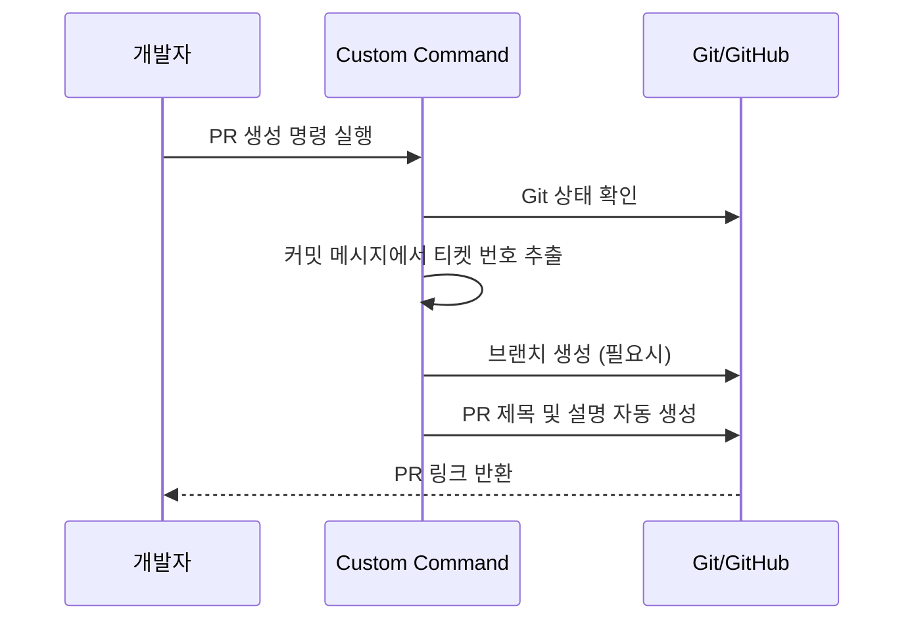

# Claude Code Custom Command 활용 사례 및 예시

> 원문: https://mangkyu.tistory.com/451
> 작성자: 망나니개발자

---

## 📌 핵심 요약
> Custom Command는 사용자가 자신만의 명령어를 정의하고 실행할 수 있는 기능이다.
> 반복적인 작업을 간소화하고 개발 생산성을 크게 높일 수 있다.

## 🎯 학습 목표
이 내용을 읽고 나면:
- [ ] Custom Command의 개념과 필요성을 이해할 수 있다
- [ ] IntelliJ HTTP 파일 생성 자동화를 구현할 수 있다
- [ ] PR 생성 및 코드 리뷰 자동화 명령어를 만들 수 있다

## 📖 본문 정리

### 1. Custom Command란?

사용자가 자신만의 맞춤형 명령어를 만들어 반복적인 작업을 간소화할 수 있는 기능이다.

### 2. 활용 사례 1: IntelliJ HTTP 파일 생성 자동화

#### 문제 상황
컨트롤러 클래스를 생성할 때마다 수동으로 HTTP 테스트 파일을 생성하는 것이 번거롭다.

#### 해결 방법
컨트롤러 파일을 분석하여 HTTP 요청을 자동 생성하는 Custom Command를 만든다.

| 기능 | 설명 |
|------|------|
| 컨트롤러 파일 분석 | 엔드포인트, HTTP 메서드, 파라미터 추출 |
| HTTP 요청 자동 생성 | `.http` 파일 형식으로 변환 |
| 기존 파일 병합 | 이미 존재하는 파일과 통합 처리 |
| 헤더 값 일관성 | 공통 헤더 자동 적용 |

> 💬 **TIP**: API 테스트를 위한 HTTP 파일을 일일이 만들 필요 없이, 컨트롤러만 작성하면 테스트 파일이 자동으로 생성된다.

### 3. 활용 사례 2: PR(Pull Request) 생성 자동화

#### 주요 기능

#### 처리 로직
1. **Git 상태 확인**: 현재 브랜치 및 변경사항 확인
2. **티켓 번호 추출**: 커밋 메시지에서 JIRA/GitHub 이슈 번호 파싱
3. **자동 브랜치 생성**: 명명 규칙에 따른 브랜치 생성
4. **PR 자동 생성**: 제목, 설명, 라벨 자동 설정

> 💬 **TIP**: GitHub CLI가 설치되어 있지 않은 경우 자동으로 설치를 시도하는 기능을 추가할 수 있다.

### 4. 활용 사례 3: 코드 리뷰 자동화

AI 기반 코드 리뷰를 자동화하여 개발자들이 더 빠르게 피드백을 받을 수 있다.

#### 리뷰 자동화 장점

| 항목 | 수동 리뷰 | 자동화 리뷰 |
|------|----------|------------|
| 소요 시간 | 수 시간 ~ 수 일 | 수 분 |
| 일관성 | 리뷰어에 따라 다름 | 동일한 기준 적용 |
| 가용성 | 리뷰어 일정에 의존 | 24/7 가능 |
| 기본 검토 | 컨벤션, 버그 등 | 자동 처리 |

## 💡 실무 적용 포인트

### 이런 상황에서 사용하세요
- 프로젝트 내 반복되는 보일러플레이트 작업이 있을 때
- 팀 전체가 동일한 워크플로우를 따라야 할 때
- API 테스트 파일 생성이 번거로울 때
- PR 프로세스를 표준화하고 싶을 때

### 주의할 점 / 흔한 실수
- ⚠️ Custom Command는 `.claude/commands/` 디렉토리에 마크다운 형식으로 저장
- ⚠️ 명령어 작성 시 명확한 입력/출력 정의 필요
- ⚠️ 팀 프로젝트에서는 commands 디렉토리를 git에 포함하여 공유

### 면접에서 나올 수 있는 질문
- Q: AI 코딩 도구에서 Custom Command의 역할은?
- Q: 반복적인 개발 작업을 어떻게 자동화할 수 있는가?

## ✅ 핵심 개념 체크리스트
- [ ] Custom Command의 개념을 설명할 수 있는가?
- [ ] HTTP 파일 자동 생성의 이점을 알고 있는가?
- [ ] PR 자동화 명령어의 주요 기능을 나열할 수 있는가?
- [ ] 자신의 프로젝트에 적용할 Custom Command를 설계할 수 있는가?

## 🔗 참고 자료
- 📄 원문 블로그: [망나니개발자 - Custom Command 활용](https://mangkyu.tistory.com/451)
- 📄 Claude Code 공식 문서: Commands 섹션

---
