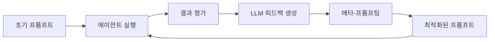

# Prompt Learning으로 Claude Code와 Cline 개선하기

> **발표**: How we improved Claude Code and Cline with Prompt Learning  
> **발표자**: Aparna Dhinakaran (Arize AI Co-founder & CPO)  
> **행사**: AI Engineer Conference 2025  
> **원본**: [YouTube 영상](https://youtube.com/watch?v=pP_dSNz_EdQ)

---

## 목차
1. [배경: 코딩 에이전트의 현재 문제점](#1-배경-코딩-에이전트의-현재-문제점)
2. [Prompt Learning이란?](#2-prompt-learning이란)
3. [System Prompt Learning 루프](#3-system-prompt-learning-루프)
4. [구현 방법: 7단계 레시피](#4-구현-방법-7단계-레시피)
5. [실험 결과](#5-실험-결과)
6. [CLAUDE.md 베스트 프랙티스](#6-claudemd-베스트-프랙티스)
7. [적용 가능한 에이전트](#7-적용-가능한-에이전트)
8. [핵심 인사이트](#8-핵심-인사이트)

---

## 1. 배경: 코딩 에이전트의 현재 문제점

### 기존 접근 방식의 한계

현재 대부분의 코딩 에이전트(Claude Code, Cline, Cursor, Windsurf 등)는 다음과 같은 문제점을 가지고 있습니다:

| 문제점 | 설명 |
|--------|------|
| **취약한 시스템 프롬프트** | 수동으로 편집한 스타일 가이드(agent.md, .clinerules 등)에 의존 |
| **RL의 불투명성** | 강화학습(RL)이 모델을 향상시키지만 기업 전체에 확장하기 어려움 |
| **학습 불가** | 에이전트가 팀의 PR 리뷰나 피드백에서 학습하지 못함 |
| **일관성 부재** | 팀의 코딩 스타일과 컨벤션을 일관되게 따르지 않음 |

### 핵심 질문

> "에이전트가 여러분의 리뷰에서 학습하고 자동으로 시스템 프롬프트를 업데이트할 수 있다면?"

---

## 2. Prompt Learning이란?

### 정의

**Prompt Learning (PL)**은 강화학습(RL)에서 영감을 받은 프롬프트 최적화 접근 방식입니다.

```
핵심 차이점:
- 전통적 RL: 모델 가중치(weights) 튜닝
- Prompt Learning: 시스템 프롬프트 튜닝
```

### 작동 원리



### 기존 방법과의 차이

| 구분 | 기존 RL 기반 | Prompt Learning |
|------|-------------|-----------------|
| **튜닝 대상** | 모델 가중치 | 시스템 프롬프트 |
| **피드백 형태** | 스칼라 보상 (0/1) | 영문 설명 피드백 |
| **평가 방식** | 단순 정답/오답 | LLM이 생성한 상세 분석 |
| **확장성** | 기업 전체 확장 어려움 | 모든 에이전트에 적용 가능 |
| **투명성** | 블랙박스 | 이해 가능한 프롬프트 변화 |

### 영감의 출처

- **Voyager 논문** (NVIDIA, Jim Fan 팀): 게임 에이전트의 기술 라이브러리 자동 생성
- **Andrej Karpathy**: "프롬프트 중심 학습(prompt-centric learning)이 핵심 기법이 될 것"

---

## 3. System Prompt Learning 루프

### 개념

System Prompt Learning은 **평가에서 얻은 영문 피드백을 사용하여 AI 코딩 에이전트를 반복적으로 개선**하는 접근 방식입니다.

### 핵심 구성 요소

```
1. 런타임 신호 캡처
   ├── PR 리뷰 피드백
   ├── 테스트 실패/성공
   ├── LLM-as-Judge 평가
   └── 사용자 피드백

2. 시스템 프롬프트 자동 튜닝
   ├── 메타-프롬프팅으로 개선안 도출
   ├── agents.md / CLAUDE.md 자동 업데이트
   └── 반복적 개선 루프
```

### 왜 영문 피드백이 중요한가?

```python
# 기존 방식: 스칼라 보상
reward = 1 if test_passed else 0  # 정보 부족

# Prompt Learning 방식: 상세 피드백
feedback = """
패치가 실패한 이유:
1. Django ORM 쿼리에서 N+1 문제 발생
2. 기존 코드베이스의 prefetch_related 패턴 미사용
3. 테스트 케이스의 edge case 미처리

개선 방향:
- 기존 쿼리 최적화 패턴 참조 필요
- 유사한 PR의 리뷰 코멘트 반영
"""
```

---

## 4. 구현 방법: 7단계 레시피

### 전체 파이프라인

| 단계 | 작업 | 도구/방법 |
|------|------|-----------|
| **1** | 데이터 분할 | SWE-bench Lite (300개 이슈), 50:50 분할 |
| **2** | 에이전트 실행 | Claude Code / Cline으로 패치 생성 |
| **3** | 결과 평가 | 단위 테스트 실행 (Pass=1, Fail=0) |
| **4** | 피드백 생성 | LLM으로 실패 원인 상세 분석 |
| **5** | 메타-프롬프팅 | 기존 프롬프트 + 피드백 → 최적 프롬프트 |
| **6** | 검증 | 테스트 세트에서 재실행 |
| **7** | 반복 | 개선이 정체될 때까지 계속 |

### 상세 구현

#### Step 1: 데이터 준비

```python
# SWE-bench Lite 데이터셋 분할
train_issues = issues[:150]  # 훈련용
test_issues = issues[150:]   # 평가용
```

#### Step 2: 에이전트 실행

```bash
# Claude Code CLI 사용
claude --append-system-prompt "$(cat CLAUDE.md)" \
       --task "Fix issue: ${issue_description}"
```

#### Step 3-4: 평가 및 피드백 생성

```python
# LLM-as-Judge 평가
evaluation_prompt = """
다음 패치를 분석하세요:
- 패치가 올바른지/틀린지
- 에이전트가 그 방향을 택한 이유
- 시스템 프롬프트에 추가해야 할 규칙

패치: {patch}
정답: {ground_truth}
"""

feedback = llm.generate(evaluation_prompt)
```

#### Step 5: 메타-프롬프팅

```python
meta_prompt = """
현재 시스템 프롬프트:
{current_prompt}

현재 규칙셋:
{current_rules}

평가 피드백:
{aggregated_feedback}

위 정보를 바탕으로 개선된 규칙셋을 생성하세요.
"""

optimized_rules = llm.generate(meta_prompt)
```

---

## 5. 실험 결과

### Cline 최적화 결과

| 모델 | 훈련 정확도 개선 | 테스트 정확도 개선 |
|------|-----------------|-------------------|
| **GPT-4.1** | +10-15% | 유의미한 개선 |
| **Claude Sonnet** | +6% | +0.67% |

> **주목**: GPT-4.1은 규칙셋 최적화만으로 Sonnet 수준 성능에 근접

### Claude Code 최적화 결과

#### 분할 전략 A: 저장소별 분할

```
목표: 일반적인 코딩 능력 개선
훈련: Django, Pytest, Sphinx 등 6개 저장소
테스트: SymPy, Matplotlib 등 다른 6개 저장소

결과: +5.19% 정확도 향상
```

#### 분할 전략 B: 저장소 내 분할 (실무 워크플로우)

```
목표: 특정 코드베이스에서 Claude Code 최적화
방법: Django 114개 이슈를 타임스탬프로 분할

결과: +10.87% 정확도 향상
```

### 핵심 발견

1. **아키텍처/미세조정 없이 성능 향상**: 오직 프롬프트 개선만으로 달성
2. **LLM 평가의 우월성**: 스칼라 보상보다 설명 기반 피드백이 효과적
3. **저장소 특화 최적화**: 같은 코드베이스에서 더 큰 개선 효과
4. **일반화 가능성**: 다른 저장소에도 학습된 규칙 적용 가능

---

## 6. CLAUDE.md 베스트 프랙티스

### 필수 포함 항목 (Claude 공식 가이드)

```markdown
# CLAUDE.md

## 자주 사용하는 Bash 명령어
- 빌드: `npm run build`
- 테스트: `npm test -- --coverage`
- 린트: `npm run lint`

## 핵심 파일과 유틸리티 함수
- `src/utils/api.ts`: API 호출 래퍼
- `src/hooks/useAuth.ts`: 인증 훅
- `src/constants/`: 상수 정의

## 코드 스타일 가이드라인
- ESLint + Prettier 사용
- 함수형 컴포넌트 + 훅 패턴
- 타입스크립트 strict 모드

## 테스트 지침
- 모든 새 기능에 단위 테스트 필수
- 통합 테스트는 `tests/integration/`에 위치
- 커버리지 80% 이상 유지

## 저장소 에티켓
- PR 전 self-review 필수
- 커밋 메시지 conventional commits 형식
- feature 브랜치 사용

## 개발 환경 설정
- Node.js 20+
- pnpm 패키지 매니저
- Docker Compose로 로컬 DB 실행
```

### Prompt Learning으로 발견된 추가 규칙 예시

```markdown
## 학습된 규칙 (Prompt Learning)

### Django 프로젝트
- 항상 `select_related` 또는 `prefetch_related` 사용 고려
- 마이그레이션 파일 자동 생성 후 리뷰 필수
- 기존 쿼리셋 패턴 우선 참조

### 테스트 작성
- 경계값 테스트 케이스 반드시 포함
- 기존 테스트 파일의 fixture 패턴 참조
- 비동기 테스트시 `pytest-asyncio` 사용
```

---

## 7. 적용 가능한 에이전트

### 메타-프롬프팅의 범용성

> "메타-프롬프팅은 시스템 프롬프트를 노출하는 모든 에이전트에 확장 가능"

| 에이전트 유형 | 적용 방법 |
|--------------|----------|
| **Claude Code** | `CLAUDE.md` 파일 최적화 |
| **Cline** | `.clinerules` 파일 최적화 |
| **Cursor** | `.cursorrules` 파일 최적화 |
| **커스텀 코딩 에이전트** | 시스템 프롬프트 직접 최적화 |
| **RAG 어시스턴트** | 검색 및 응답 프롬프트 최적화 |
| **내부 개발자 도구** | 도구별 시스템 프롬프트 최적화 |

### 실무 적용 시나리오

```
1. 팀 PR 리뷰 피드백 수집
2. 반복되는 리뷰 코멘트 패턴 분석
3. LLM으로 규칙화
4. CLAUDE.md에 추가
5. 다음 작업에서 자동 적용
```

---

## 8. 핵심 인사이트

### 발표의 핵심 메시지

```
🎯 "모델 재훈련 없이 프롬프트 최적화만으로 10%+ 성능 향상 가능"

💡 "스칼라 보상 대신 영문 피드백이 더 풍부한 학습 신호 제공"

🔄 "에이전트가 팀의 피드백에서 자동으로 학습하는 루프 구축 가능"

📈 "Cline + GPT-4.1이 규칙 최적화로 Sonnet 수준 도달"
```

### 실무 적용 체크리스트

- [ ] 현재 사용 중인 에이전트의 규칙 파일 확인
- [ ] 반복되는 PR 리뷰 피드백 패턴 수집
- [ ] LLM-as-Judge 평가 파이프라인 구축
- [ ] 메타-프롬프팅으로 규칙 자동 생성
- [ ] A/B 테스트로 개선 효과 검증
- [ ] 규칙 업데이트 주기 결정 (주간/격주)

### 주의사항

1. **과적합 방지**: 훈련/테스트 세트 명확히 분리
2. **일반화 검증**: 다른 프로젝트에도 적용 가능한지 확인
3. **규칙 충돌**: 기존 규칙과 새 규칙 간 충돌 검토
4. **지속적 개선**: 일회성이 아닌 반복적 최적화 루프 유지

---

## 참고 자료

- [CLAUDE.md Best Practices - Arize AI](https://arize.com/blog/claude-md-best-practices-learned-from-optimizing-claude-code-with-prompt-learning/)
- [Optimizing Coding Agent Rules - Arize AI](https://arize.com/blog/optimizing-coding-agent-rules-claude-md-agents-md-clinerules-cursor-rules-for-improved-accuracy/)
- [What is Prompt Learning? - Arize AI Medium](https://medium.com/arize-ai/what-is-prompt-learning-b2019e8d4154)
- [Prompt Learning: Using English Feedback - Arize AI](https://arize.com/blog/prompt-learning-using-english-feedback-to-optimize-llm-systems/)
- [SWE-bench 벤치마크](https://www.swebench.com/)

---

*작성일: 2025-01-04*  
*원본 발표: AI Engineer Conference 2025.12.24*
