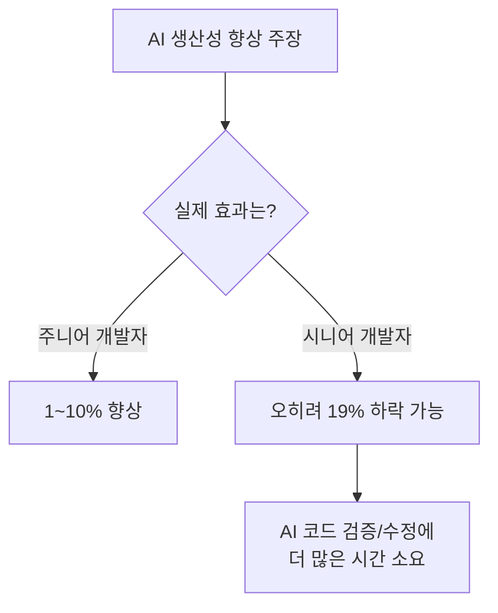

# AI에 대한 사실과 오해 그리고 현실적인 올바른 활용법

> 원문: https://mangkyu.tistory.com/452
> 작성자: 망나니개발자

---

## 📌 핵심 요약
> 2025년 현재, AI는 복잡한 비즈니스 로직을 완전히 담당하지 못한다.
> 핵심 업무에 집중하고 부수적 작업을 AI에 위임하는 "외과의사처럼 코딩하기" 전략이 효과적이다.

## 🎯 학습 목표
이 내용을 읽고 나면:
- [ ] AI 생산성 향상에 대한 사실과 과장을 구분할 수 있다
- [ ] AI의 올바른 활용 영역과 위험한 영역을 판단할 수 있다
- [ ] "외과의사처럼 코딩하기" 전략을 실무에 적용할 수 있다

## 📖 본문 정리

### 1. AI와 함께하는 시대: 현황

개발자를 포함한 많은 지식 노동자들이 업무에 AI를 활용 중이다.

| 조사 기관 | 통계 |
|----------|------|
| Stack Overflow 2025 | 84%의 개발자가 AI 도구 사용 또는 사용 예정 |
| Microsoft 연구 | 75% 정기 활용, 64% 매주 사용 |
| Business Insider | 90%의 엔지니어링 팀이 AI 코딩 도구 도입 완료 |

개발자 외 직군도 AI 활용 중:
- 마케터: 65%
- 기자: 64%
- 변호사: 30%

### 2. AI 생산성 향상: 사실 vs 과장

#### 주장되는 효과
- GPT-4로 컨설턴트들이 업무를 25% 더 빠르게 수행
- GitHub Copilot으로 26% 생산성 향상

#### 실제 효과 (현실적 평가)



> 💬 **핵심 인사이트**: 경험 많은 개발자의 경우 AI 코드를 검증하고 수정하는 데 더 많은 시간이 소요되어 오히려 생산성이 하락할 수 있다.

### 3. 잘못된 AI 활용: 복잡한 비즈니스 로직

#### 핵심 문제: 코드 부채 증가

| 구분 | 설명 |
|------|------|
| AI 생성 코드의 특징 | 높은 복잡성 기반 |
| 결과 | 이해하지 못하는 코드 = 레거시 코드 양산 |
| 리스크 | 유지보수 비용 급증 |

#### 상황별 AI 활용 적절성

| 상황 | AI 활용 | 이유 |
|------|---------|------|
| 프로토타이핑 | ✅ 적절 | 빠른 가설 검증이 목적 |
| 시장 검증용 단기 프로젝트 | ✅ 적절 | 일회성 코드 |
| 장기 유지보수 프로젝트 | ❌ 위험 | 기술 부채 누적 |
| 복잡한 비즈니스 로직 | ❌ 위험 | 컨텍스트 부족, 환각 문제 |

> 💬 **비유**: AI에게 복잡한 비즈니스 로직을 맡기는 것은 마치 건축 현장에서 설계도 없이 벽돌만 빠르게 쌓는 것과 같다. 빠르지만 결국 무너진다.

### 4. 올바른 AI 활용 영역

#### AI가 효과적인 영역
- 보일러플레이트 코드 작성
- 간단한 스크립트
- 문서 요약 및 변환
- 반복적인 작업

#### 구체적 사례: API 호출 로직

```
API 호출 로직의 특징:
- 복잡한 비즈니스 로직 없음
- 단순 데이터 교환 목적
- 스펙 문서 기반 작업

→ AI가 DTO 및 호출 로직을 자동 생성하기 적합
```

> 💬 **참고**: 토스 테크 블로그의 "사내 Swagger MCP 서버" 구현 사례 참조

#### 핵심 전략


### 5. 외과의사처럼 코딩하기

GitHub CEO의 언급: "수작업 코딩은 여전히 핵심"

개발자 역할의 진화:
- 과거: 모든 코드를 직접 작성
- 현재: AI와 협업하여 전략적 문제 해결 및 설계 역량에 집중

| 외과의사 | 개발자 |
|----------|--------|
| 핵심 수술에만 직접 집도 | 핵심 비즈니스 로직에 집중 |
| 보조 업무는 간호사/레지던트에게 | 부수적 작업은 AI에게 위임 |
| 높은 전문성 유지 | 아키텍처/설계 역량 강화 |

## 🔍 심화 학습

### 저자의 최종 평가
> "적어도 2025년, 지금까지는 AI가 복잡한 비즈니스 로직을 완전히 담당하지 못하는 것으로 보인다"

### 현재 AI의 한계
- **컨텍스트 부족**: 프로젝트 전체 맥락 이해 제한
- **흐름 단절**: 긴 세션에서 일관성 유지 어려움
- **환각(Hallucination)**: 존재하지 않는 API나 패턴 생성

## 💡 실무 적용 포인트

### 이런 상황에서 AI를 활용하세요
- API 스펙 문서 기반 DTO 생성
- 테스트 코드 보일러플레이트
- 간단한 유틸리티 스크립트
- 문서 형식 변환

### 주의할 점 / 흔한 실수
- ⚠️ 복잡한 비즈니스 로직을 AI에게 전적으로 맡기지 말 것
- ⚠️ AI 생성 코드를 검토 없이 프로덕션에 배포하지 말 것
- ⚠️ 생산성 향상 수치를 맹신하지 말 것

### 면접에서 나올 수 있는 질문
- Q: AI 코딩 도구의 장단점은 무엇인가?
- Q: 어떤 상황에서 AI 도구를 사용하고, 어떤 상황에서 피해야 하는가?
- Q: 코드 부채(Technical Debt)와 AI의 관계를 설명해 보세요.

## ✅ 핵심 개념 체크리스트
- [ ] AI 생산성 향상의 실제 효과를 현실적으로 평가할 수 있는가?
- [ ] AI 활용이 적합한 영역과 부적합한 영역을 구분할 수 있는가?
- [ ] "외과의사처럼 코딩하기" 전략을 설명할 수 있는가?
- [ ] 자신의 업무에서 AI에게 위임할 수 있는 반복 작업을 식별할 수 있는가?

## 🔗 참고 자료
- 📄 원문 블로그: [망나니개발자 - AI 활용법](https://mangkyu.tistory.com/452)
- 📄 토스 테크 블로그: Swagger MCP 서버 구현 사례
- 📄 Stack Overflow Developer Survey 2025

---
