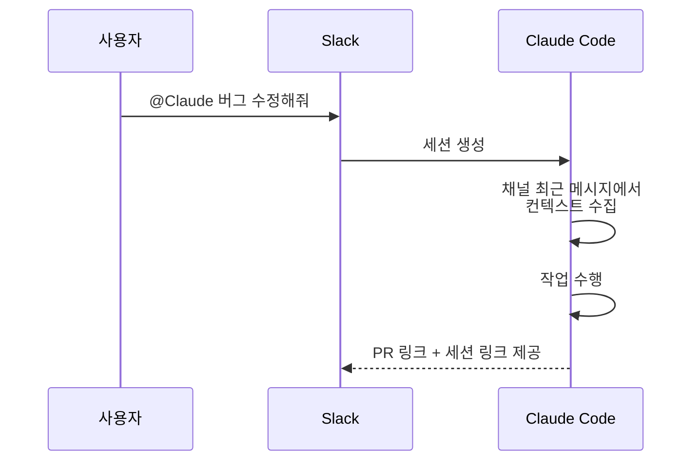
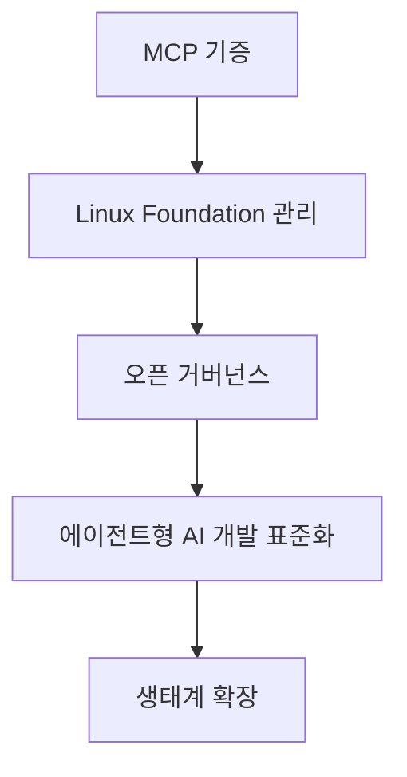

# Claude Code의 최신 소식

> 원문: https://mangkyu.tistory.com/456
> 작성자: 망나니개발자
> 발행일: 2025년 12월 23일

---

## 📌 핵심 요약
> Claude의 개발자 워크플로우 통합이 Slack, GitHub, 브라우저, 표준화된 프로토콜을 통해 확장되고 있다.
> MCP가 Linux Foundation에 기증되어 에이전트형 AI 개발의 표준화가 촉진된다.

## 🎯 학습 목표
이 내용을 읽고 나면:
- [ ] Claude Code와 Slack, GitHub 통합 방법을 이해할 수 있다
- [ ] Claude Skills와 MCP의 차이를 설명할 수 있다
- [ ] Linux Foundation Agentic AI Foundation의 의미를 이해할 수 있다

## 📖 본문 정리

### 1. Claude Code + Slack 통합

Slack 채팅에서 `@Claude`를 멘션하면 자동으로 Claude Code 세션이 생성된다.



#### 주요 특징
- 버그 리포트나 코드 수정 요청 시 주변 문맥 활용
- 채널의 최근 메시지에서 컨텍스트 수집
- 완료 후 PR 링크와 세션 링크 제공

### 2. Claude Code GitHub Actions

GitHub PR이나 이슈에 `@claude`를 멘션하면 Claude가 작업을 수행한다.

| 기능 | 설명 |
|------|------|
| 코드 분석 | PR 변경사항 분석 및 리뷰 |
| PR 생성 | 이슈 기반 자동 PR 생성 |
| 기능 구현 | 요청된 기능 직접 구현 |
| 버그 수정 | 이슈 기반 버그 해결 |
| 커스터마이징 | Claude Code SDK 기반 확장 |

> 💬 **TIP**: Claude Code SDK를 활용하면 팀에 맞는 맞춤형 GitHub Actions를 만들 수 있다.

### 3. Claude in Chrome (베타)

유료 플랜 사용자들이 Chrome 브라우저 확장 프로그램을 통해 Claude를 사용할 수 있다.

#### 주요 기능

| 기능 | 설명 |
|------|------|
| 웹사이트 상호작용 | 읽기, 클릭, 탐색 |
| 워크플로우 학습 | 사용자 작업 패턴 기록 및 학습 |
| 콘솔 로그 읽기 | 개발자 도구 로그 분석 |
| 예약 작업 | 반복 작업 스케줄링 |
| 승인 요청 | 실행 전 사용자 확인 |

### 4. Claude Skills

특정 도메인의 전문 지식을 제공하는 지침과 리소스 모음이다.

#### 점진적 공개 방식으로 토큰 최적화


#### MCP vs Skills

| 구분 | MCP | Skills |
|------|-----|--------|
| 역할 | 데이터 접근 활성화 | 데이터 활용 방법 제공 |
| 기능 | 외부 시스템 연결 | 전문 지식 및 지침 |
| 비유 | 도구 제공 | 사용 설명서 제공 |

> 💬 **비유**: MCP는 망치를 주는 것이고, Skills는 망치로 못을 박는 방법을 가르쳐주는 것이다.

### 5. Tool Search Tool (실험 중)

MCP-CLI를 통해 필요한 tool 정보만 요청하는 온디맨드 방식이다.

```bash
# 활성화 방법
ENABLE_EXPERIMENTAL_MCP_CLI=true
```

#### 장점
- 토큰 소비 감소
- 필요한 도구만 동적으로 로드
- 대규모 도구 세트 효율적 관리

### 6. Linux Foundation Agentic AI Foundation

Anthropic이 Model Context Protocol(MCP)을 Linux Foundation에 기증했다.

#### 참여 기업
- AWS
- Google
- Microsoft
- OpenAI
- 기타 주요 기업들

#### 의의



> 💬 **핵심 의미**: MCP가 업계 표준으로 자리잡으면서 다양한 AI 에이전트들이 통일된 방식으로 외부 시스템과 연동할 수 있게 된다.

## 💡 실무 적용 포인트

### 이런 상황에서 활용하세요
- Slack에서 팀 커뮤니케이션 중 코드 수정 필요 시
- GitHub PR 리뷰 자동화가 필요할 때
- 브라우저 기반 반복 작업 자동화
- 특정 도메인 전문 지식이 필요한 작업

### 주의할 점 / 흔한 실수
- ⚠️ Chrome 확장은 현재 베타로, 안정성 확인 필요
- ⚠️ GitHub Actions에서 민감한 코드 접근 권한 관리 주의
- ⚠️ Skills는 MCP와 역할이 다르므로 혼동하지 말 것

### 면접에서 나올 수 있는 질문
- Q: MCP(Model Context Protocol)란 무엇인가?
- Q: Claude Skills와 MCP의 차이점을 설명해 보세요.
- Q: AI 에이전트의 워크플로우 통합 사례를 설명해 보세요.

## ✅ 핵심 개념 체크리스트
- [ ] Claude Code와 Slack 통합 방식을 설명할 수 있는가?
- [ ] GitHub Actions에서 Claude를 활용하는 방법을 알고 있는가?
- [ ] Claude Skills의 토큰 최적화 전략을 이해하는가?
- [ ] MCP와 Skills의 역할 차이를 구분할 수 있는가?
- [ ] Linux Foundation Agentic AI Foundation의 의미를 설명할 수 있는가?

## 🔗 참고 자료
- 📄 원문 블로그: [망나니개발자 - Claude Code 최신 소식](https://mangkyu.tistory.com/456)
- 📄 Anthropic 공식 블로그
- 📄 Linux Foundation Agentic AI Foundation

---
