# Chapter 1: Diving into Software Architecture

## 핵심 요약

> 소프트웨어 아키텍처는 복잡한 기술 요구사항과 전략적 비즈니스 목표를 연결하는 핵심 기반이다. 이 장에서는 아키텍처의 정의와 중요성, 설계(Design)와의 차이점, 핵심 원칙들(Coupling, Cohesion, SOLID, KISS, DRY, YAGNI), 주요 아키텍처 스타일, 그리고 CAP 정리를 통한 데이터베이스 선택 전략을 다룬다.

---

## 학습 목표

이 장을 학습한 후 다음을 수행할 수 있어야 한다:

- [ ] 소프트웨어 아키텍처의 정의와 중요성을 설명할 수 있다
- [ ] 소프트웨어 아키텍처와 소프트웨어 설계의 차이를 구분할 수 있다
- [ ] SOLID 원칙을 코드에 적용할 수 있다
- [ ] 주요 아키텍처 스타일의 장단점을 비교할 수 있다
- [ ] CAP 정리를 이해하고 아키텍처 스타일에 맞는 데이터베이스를 선택할 수 있다

---

## 본문 정리

### 1. 소프트웨어 아키텍처의 정의와 중요성

#### 정의

소프트웨어 아키텍처는 **소프트웨어 시스템의 기본 구조**로, 컴포넌트, 상호작용, 그리고 진화를 이끄는 전반적인 원칙을 정의한다. 건물의 청사진과 같이 기술 명세와 비즈니스 목표를 충족하면서 유연성, 보안성, 효율성을 보장한다.

#### 중요성 8가지

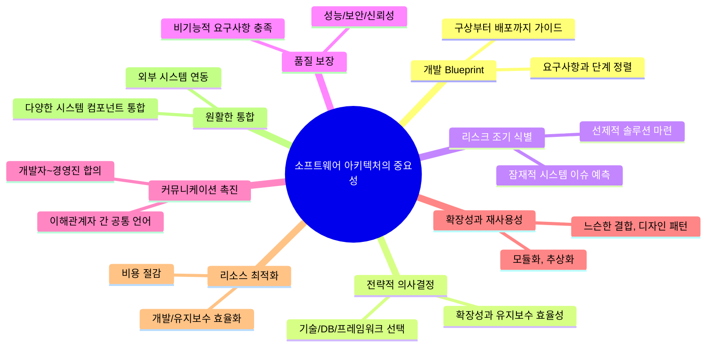

---

### 2. 소프트웨어 설계 vs 소프트웨어 아키텍처

#### 비유로 이해하기

| 구분 | 아키텍처 (Architecture) | 설계 (Design) |
|------|------------------------|---------------|
| **비유** | 집의 청사진 (전체 구조, 방 배치) | 인테리어 (마감재, 배관, 자재) |
| **초점** | 시스템 전체 고수준 구조 | 컴포넌트 내부 세부사항 |

#### 7가지 차이점

| 측면 | Architecture | Design |
|------|-------------|--------|
| **범위와 추상화** | 고수준 시스템 구조 | 모듈, 객체, 클래스의 세부 구현 |
| **세분성** | 시스템 전체 또는 주요 컴포넌트 | 컴포넌트를 더 작은 부분으로 분해 |
| **시점** | 개발 초기에 결정 | 개발 사이클 전반에 걸쳐 진화 |
| **결정 범위** | 전략적 (DB, 통신 유형 등) | 전술적 (프레임워크, 동기/비동기 등) |
| **이해관계자** | 아키텍트, 경영진, PO | 개발팀, 소프트웨어 디자이너 |
| **변경 영향** | 전체 시스템에 큰 영향, 비용 높음 | 특정 컴포넌트에 국한된 영향 |
| **문서화** | 아키텍처 블루프린트, 고수준 다이어그램 | 클래스/시퀀스 다이어그램, 상세 문서 |

#### 예시로 이해하기

```
아키텍처 결정: "마이크로서비스는 RESTful API로 통신한다"
     ↓
설계 결정: "동기 호출 vs 리액티브 프로그래밍을 사용한 비동기 호출"
```

---

### 3. 소프트웨어 아키텍처 원칙

#### 3.1 Coupling과 Cohesion

Larry Constantine이 1960년대 후반 구조적 설계 프레임워크에서 소개한 품질 메트릭.

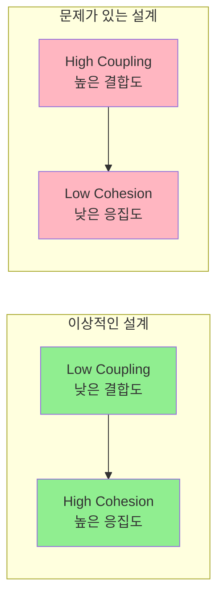

##### High Coupling (문제 있는 코드)

```java
public class ShoppingCart {
  private CreditCardPayment cc = new CreditCardPayment();  // 직접 인스턴스화
  private DebitCardPayment debit = new DebitCardPayment(); // 직접 인스턴스화

  public void checkout(String typePayment, double amount){
     if (typePayment.equals("CC")) {
       cc.processCreditCardPayment(amount);
     } else {
       debit.processDebitCardPayment(amount);
     }
  }
}
```

**문제점**: 새 결제 수단 추가 시 ShoppingCart 클래스 수정 필요

##### Low Coupling (개선된 코드)

```java
// 1. 인터페이스 정의
public interface Payment {
  void processPayment(double amount);
}

// 2. 구현체들
public class CreditCardPayment implements Payment {
  public void processPayment(double amount) { /* ... */ }
}

public class DebitCardPayment implements Payment {
  public void processPayment(double amount) { /* ... */ }
}

// 3. 생성자 주입으로 결합도 낮춤
public class ShoppingCart {
  private final Payment payment;

  public ShoppingCart(Payment payment) {
    this.payment = payment;
  }

  public void checkout(double amount) {
    payment.processPayment(amount);
  }
}
```

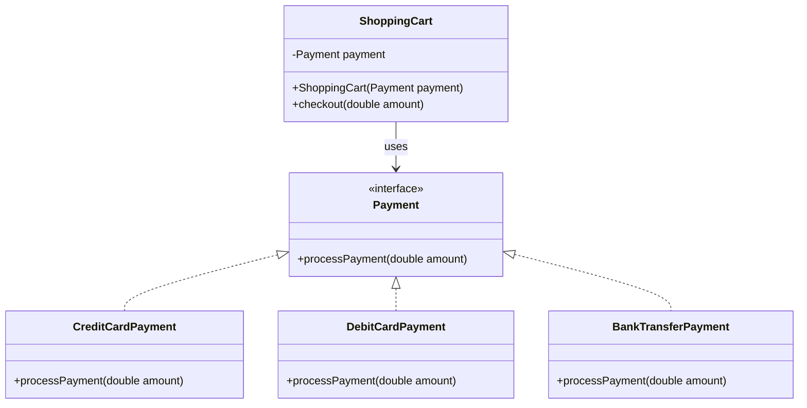

##### High Cohesion (응집도)

```java
// Good: 높은 응집도 - 사용자 관리에만 집중
public class UserManager {
  public void addUser(User user) { /* ... */ }
  public void updateUser(User user) { /* ... */ }
}

// Bad: 낮은 응집도 - 관련 없는 기능 포함
public class UserManager {
  public void addUser(User user) { /* ... */ }
  public void validateEmail(String email) { /* ... */ }  // Email 클래스로 분리 필요
  public void sendEmail() { /* ... */ }                   // Email 클래스로 분리 필요
}
```

---

#### 3.2 Separation of Concerns (관심사 분리)

소프트웨어 애플리케이션을 각 섹션이 특정 관심사에 집중하도록 분리하는 원칙.

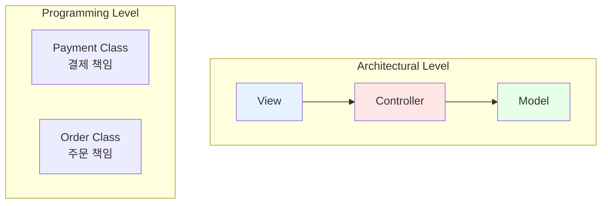

**위반 사례**: Payment 클래스에 `removeOrder()` 메서드가 있는 경우

---

#### 3.3 SOLID 원칙

Robert C. Martin (Uncle Bob)이 2000년대 초 소개한 5가지 설계 원칙.

##### S - Single Responsibility Principle (단일 책임 원칙)

> 클래스는 하나의 책임만 가지며, 변경되어야 할 이유도 하나뿐이어야 한다.

```java
// Book: 책 속성과 동작만 담당
public class Book {
  private String title;
  private String author;
  public Book(String title, String author) { /* ... */ }
}

// BookPersistence: 저장 책임만 담당
public class BookPersistence {
  public void save(Book book) { /* ... */ }
}
```

##### O - Open/Closed Principle (개방/폐쇄 원칙)

> 확장에는 열려있고, 수정에는 닫혀있어야 한다.

```java
// 추상화
public interface BookSaveFormat {
  void save(Book book);
}

// 구현체들 (확장)
public class TextFileSaveFormat implements BookSaveFormat {
  public void save(Book book) {
    System.out.println("Saving '" + book.getTitle() + "' to file.");
  }
}

public class DbSaveFormat implements BookSaveFormat {
  public void save(Book book) {
    System.out.println("Saving '" + book.getTitle() + "' to DB");
  }
}

// 수정 없이 새 포맷 추가 가능
public class BookPersistence {
  private BookSaveFormat saveFormat;

  public BookPersistence(BookSaveFormat saveFormat) {
    this.saveFormat = saveFormat;
  }

  public void saveBook(Book book) {
    this.saveFormat.save(book);
  }
}
```

##### L - Liskov Substitution Principle (리스코프 치환 원칙)

> 상위 클래스 객체는 하위 클래스 객체로 대체할 수 있어야 한다.

```java
public class EBook extends Book {
  private String url;
  // Book의 모든 동작을 정상 수행
}

public static void displayBookDetails(Book book) {
  System.out.println(book.getTitle());
  if (book instanceof EBook) {
    System.out.println(((EBook)book).getDownloadUrl());
  }
}
```

##### I - Interface Segregation Principle (인터페이스 분리 원칙)

> 클라이언트는 사용하지 않는 메서드에 의존하면 안 된다.

```java
// Bad: 큰 인터페이스
public interface Publication {
  void displayInfo();
  void validateIsbn(String isbn);  // Magazine은 불필요
  void validateIssn(String issn);  // Book은 불필요
}

// Good: 분리된 인터페이스
public interface Publication {
  void displayInfo();
}

public interface ValidateIsbn {
  void validate(String isbn);
}

public interface ValidateIssn {
  void validate(String issn);
}

// Book은 필요한 인터페이스만 구현
public class Book implements ValidateIsbn, Publication {
  void displayInfo() { /* ... */ }
  void validate(String isbn) { /* ... */ }
}
```

##### D - Dependency Inversion Principle (의존성 역전 원칙)

> 고수준 모듈은 저수준 모듈에 의존하면 안 된다. 둘 다 추상화에 의존해야 한다.

```java
// 추상화
public interface BookPersistence {
  void save(Book book);
}

public interface BookSaveFormat {
  void save(Book book);
}

// 구현
public class BookPersistenceImpl implements BookPersistence {
  private BookSaveFormat saveFormat;

  public BookPersistenceImpl(BookSaveFormat saveFormat) {
    this.saveFormat = saveFormat;
  }

  public void saveBook(Book book) {
    saveFormat.save(book);
  }
}

// 사용
BookPersistence bookPersistence = saveType.equals("T")
    ? new BookPersistenceImpl(new TextFileSaveFormat())
    : new BookPersistenceImpl(new DbSaveFormat());
bookPersistence.saveBook(book);
```

---

#### 3.4 기타 중요 원칙

| 원칙 | 설명 | 핵심 |
|------|------|------|
| **KISS** | Keep It Simple, Stupid | 불필요한 복잡성 피하기, 가장 단순한 해결책 추구 |
| **DRY** | Don't Repeat Yourself | 코드 중복 제거, 공통 기능 추상화 |
| **YAGNI** | You Aren't Gonna Need It | 필요할 때까지 기능 추가 금지 |
| **LoD** | Law of Demeter (최소 지식 원칙) | 객체는 가까운 친구와만 대화 |

##### Law of Demeter - 호출 가능한 메서드

1. 객체 자신의 메서드
2. 인자로 전달된 객체의 메서드
3. 직접 생성한 객체의 메서드
4. 직접 컴포넌트(필드)의 메서드

---

### 4. 주요 아키텍처 스타일

#### 아키텍처 선택 시 고려사항

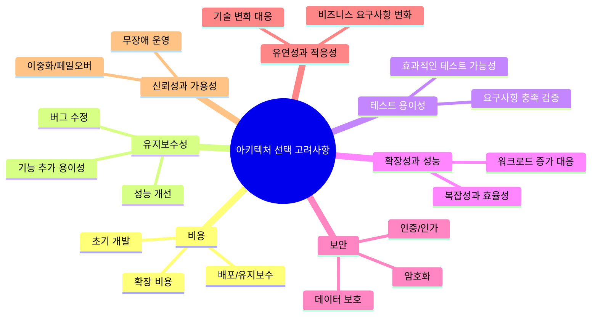

#### Scalability: Vertical vs Horizontal

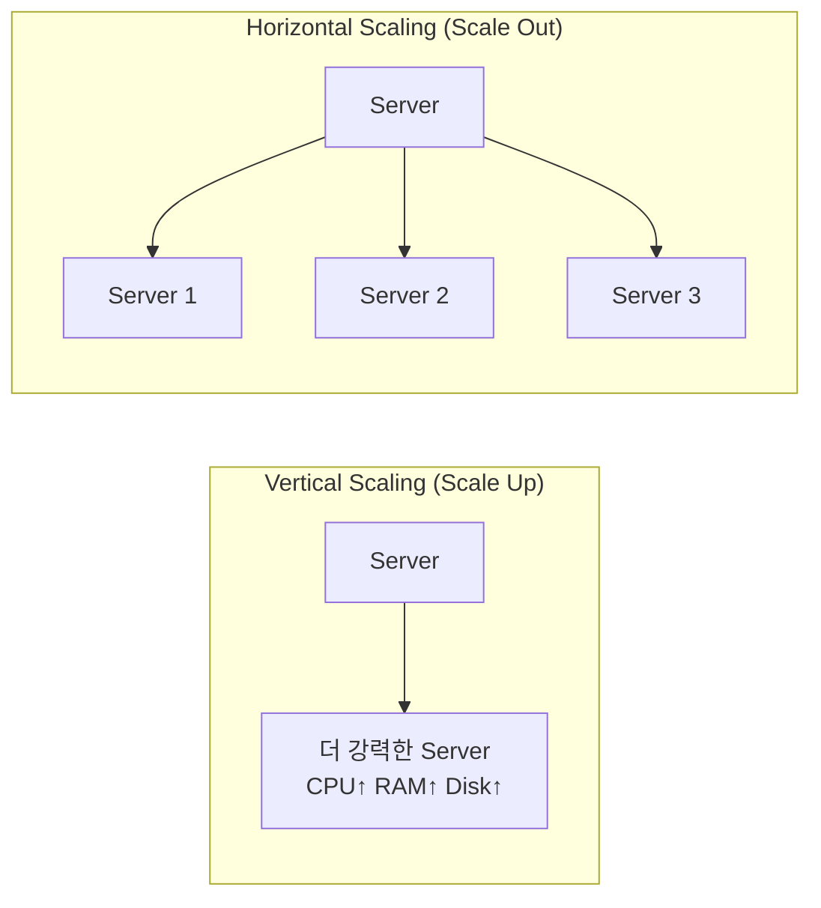

| 구분 | Vertical Scaling | Horizontal Scaling |
|------|-----------------|-------------------|
| 방법 | 하드웨어 업그레이드 | 서버 추가 |
| 장점 | 구현 용이 | 유연성, 장애 허용성 |
| 단점 | 물리적 한계, 단일 장애점 | 복잡한 관리, 로드밸런싱 필요 |
| 적합 | 단일 서버 애플리케이션 | 분산 시스템 |

---

#### 4.1 Monolithic Architecture

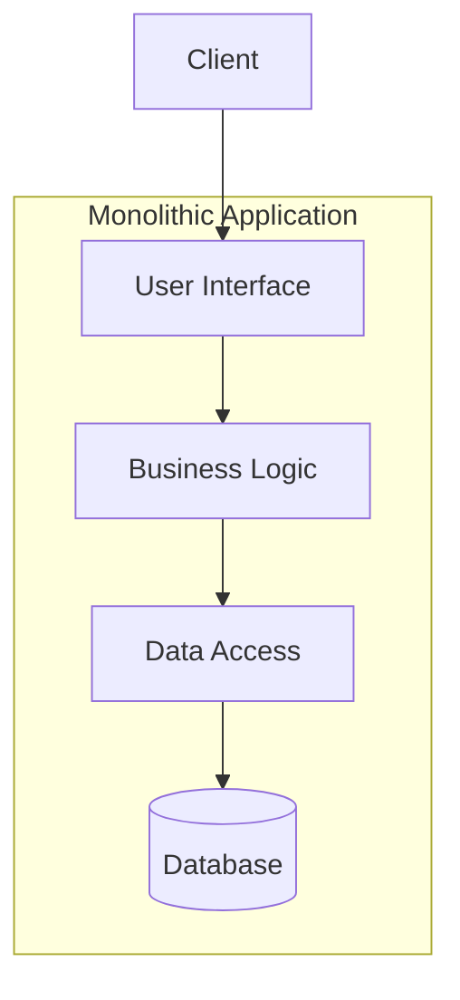

| 장점 | 단점 |
|------|------|
| 단일 코드베이스로 개발 효율성 | 복잡도 증가 시 확장성 저하 |
| 디버깅/테스트 단순화 | 기술 스택에 종속 |
| 트랜잭션 무결성 보장 | 독립적 개발 어려움 |
| 네트워크 지연 없음 | 변경의 파급효과 |

---

#### 4.2 Client-Server Architecture

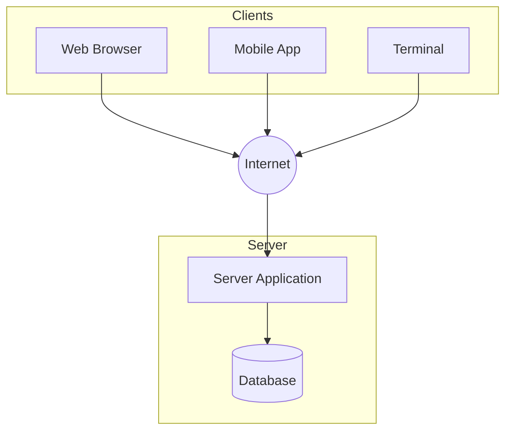

| 장점 | 단점 |
|------|------|
| 중앙 집중식 데이터 관리 | 네트워크 의존성 |
| 보안 및 업데이트 용이 | 수직 확장 비용 높음 |
| 리소스 최적화 | 서버가 단일 장애점 가능 |
| 어디서나 접근 가능 | 관리 복잡성 |

---

#### 4.3 Microservices Architecture

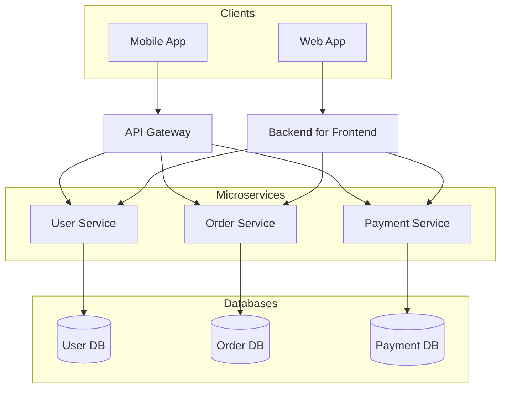

| 장점 | 단점 |
|------|------|
| 독립적 확장 | 서비스 관리 복잡성 |
| 기술 스택 자유도 | 데이터 일관성 문제 |
| 시스템 복원력 | 네트워크 지연 |
| 빠른 배포 | 테스트 어려움 |
| 장애 격리 | 운영 오버헤드 |

---

#### 4.4 Event-Driven Architecture (EDA)

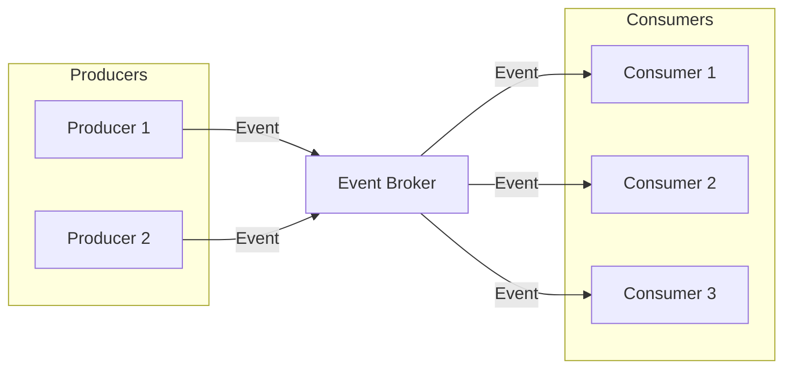

##### 핵심 컴포넌트

| 컴포넌트 | 역할 |
|---------|------|
| **Events** | 시스템의 상태 변화 또는 발생한 사건 |
| **Producers** | 이벤트를 생성/발행하는 엔티티 |
| **Consumers** | 이벤트를 구독하고 처리하는 컴포넌트 |
| **Event Broker** | 이벤트 전달을 중개하는 미들웨어 |

##### EDA 패턴

- **Publisher/Subscriber**: 발행자가 소비자를 모르고 이벤트 발행
- **Event Streaming**: 실시간 연속 데이터 흐름 처리

| 장점 | 단점 |
|------|------|
| 독립적 확장 | 이벤트 흐름 관리 복잡 |
| 느슨한 결합 | 테스트/디버깅 어려움 |
| 실시간 응답성 | 데이터 일관성 문제 |
| 복원력 (장애 격리) | 브로커 의존성 |

---

#### 4.5 Serverless Architecture

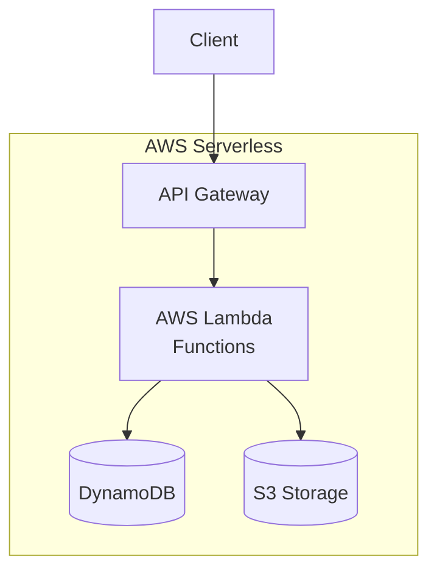

##### Serverless 유형

| 유형 | 설명 | 예시 |
|------|------|------|
| **FaaS** | 이벤트에 응답하여 함수 실행 | AWS Lambda |
| **BaaS** | 백엔드 서비스 제공 | Firebase |
| **DBaaS** | 데이터베이스 서비스 | DynamoDB |
| **API Gateway** | API 관리 및 라우팅 | AWS API Gateway |

| 장점 | 단점 |
|------|------|
| 비용 효율성 (사용한 만큼) | Cold Start 지연 |
| 자동 확장 | 환경 제어 제한 |
| 운영 부담 감소 | 벤더 종속 위험 |
| 빠른 배포 | 보안 취약점 증가 |
| 글로벌 분산 지원 | 상태 관리 복잡 |

---

#### 4.6 Pipe and Filter Architecture

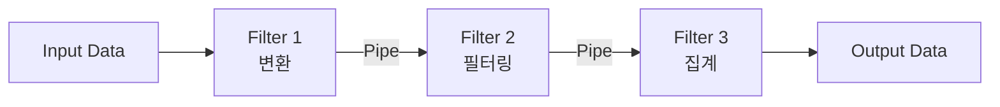

##### 핵심 컴포넌트

| 컴포넌트 | 역할 |
|---------|------|
| **Filter** | 데이터 처리 단위 (변환, 필터링, 집계) |
| **Pipe** | 필터 간 데이터 전달 통로 |

| 장점 | 단점 |
|------|------|
| 유연성, 느슨한 결합 | 다중 필터 관리로 성능 병목 |
| 병렬 작업 실행 | 인터랙티브 앱에 부적합 |
| 필터 재사용성 | 대규모 연속 계산에 비효율 |

---

### 5. 데이터베이스 선택

#### 5.1 데이터베이스 유형

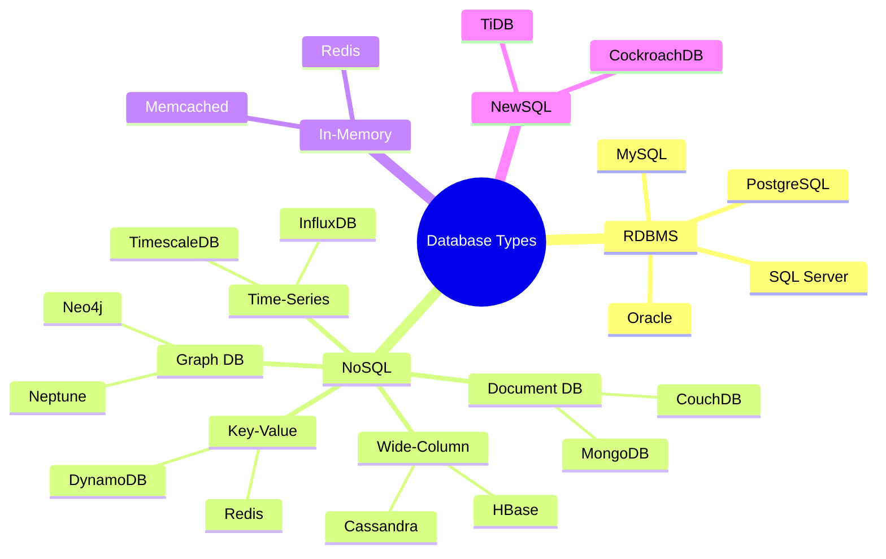

---

#### 5.2 CAP Theorem (CAP 정리)

Eric Brewer가 2000년에 공식화한 분산 시스템의 기본 원리.

> 분산 시스템은 Consistency, Availability, Partition Tolerance 중 **두 가지만** 동시에 보장할 수 있다.

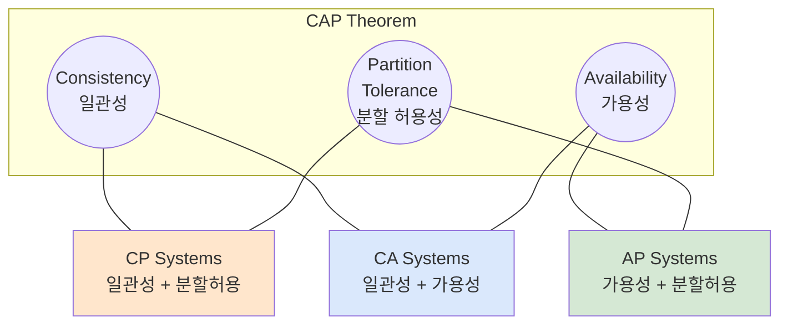

| 속성 | 설명 |
|------|------|
| **Consistency** | 모든 노드가 동시에 같은 데이터를 봄 |
| **Availability** | 모든 요청이 (에러가 아닌) 응답을 받음 |
| **Partition Tolerance** | 네트워크 분할에도 시스템이 동작함 |

| 조합 | 설명 | 예시 |
|------|------|------|
| **CP** | 네트워크 장애 시 일관성 유지, 가용성 희생 | HBase, MongoDB |
| **AP** | 네트워크 장애 시 가용성 유지, 일관성 희생 | Cassandra, DynamoDB |
| **CA** | 네트워크 장애 무시 (비현실적) | 전통적 RDBMS (단일 노드) |

---

#### 5.3 아키텍처 스타일별 데이터베이스 선택

| 아키텍처 스타일 | 권장 데이터베이스 | 이유 |
|----------------|------------------|------|
| **Monolithic** | RDBMS | 강한 일관성, ACID, 관계형 모델링 |
| **Client-Server** | RDBMS 또는 Document NoSQL | 견고성과 트랜잭션 무결성, 유연성 필요 시 NoSQL |
| **Microservices** | NoSQL | 수평 확장, 분산 데이터 모델 |
| **Event-Driven** | Event Streaming + NoSQL/NewSQL | Apache Kafka + 유연한 데이터 모델링 |
| **Serverless** | Serverless DB | 자동 스케일링, 운영 간소화 (DynamoDB) |
| **Pipe and Filter** | In-Memory DB | 저지연, 고처리량, 실시간 처리 |

---

## 심화 학습

### 면접 예상 질문

1. **소프트웨어 아키텍처와 설계의 차이점은 무엇인가요?**
   - 아키텍처: 고수준 시스템 구조, 전략적 의사결정, 초기 단계
   - 설계: 세부 구현, 전술적 의사결정, 전체 개발 사이클

2. **SOLID 원칙 중 OCP(개방/폐쇄 원칙)를 설명해주세요.**
   - 확장에는 열려있고 수정에는 닫혀있어야 함
   - 인터페이스/추상 클래스를 통해 새 기능 추가 시 기존 코드 수정 불필요

3. **Microservices와 Monolithic의 장단점을 비교해주세요.**
   - Monolithic: 개발 단순, 트랜잭션 용이 / 확장성 제한, 기술 종속
   - Microservices: 독립 배포/확장, 기술 자유 / 복잡성, 네트워크 지연

4. **CAP 정리에서 왜 3가지를 모두 만족할 수 없나요?**
   - 네트워크 분할 발생 시 일관성과 가용성 중 하나를 선택해야 함
   - 실제 분산 시스템에서 네트워크 장애는 불가피

5. **Event-Driven Architecture의 장점과 사용 사례는?**
   - 느슨한 결합, 확장성, 실시간 처리
   - 알림 시스템, 실시간 분석, IoT 데이터 처리

### 추가 학습 자료

- **도서**: "Clean Architecture" - Robert C. Martin
- **도서**: "The Pragmatic Programmer" - Andy Hunt, Dave Thomas
- **온라인**: Martin Fowler's Blog (martinfowler.com)

---

## 실무 적용 포인트

### Spring에서의 SOLID 적용

```java
// DIP 적용 - Spring의 DI
@Service
public class BookService {
    private final BookRepository repository;  // 추상화에 의존

    @Autowired
    public BookService(BookRepository repository) {
        this.repository = repository;
    }
}

// SRP 적용 - 단일 책임
@RestController
public class BookController { /* HTTP 처리만 */ }

@Service
public class BookService { /* 비즈니스 로직만 */ }

@Repository
public class BookRepository { /* 데이터 접근만 */ }
```

### 아키텍처 선택 체크리스트

- [ ] 비즈니스 요구사항 규모 확인
- [ ] 팀 규모와 기술 역량 평가
- [ ] 확장성 요구사항 분석
- [ ] 데이터 일관성 요구 수준 결정
- [ ] 운영 복잡성 수용 가능 여부
- [ ] 비용 제약 검토

---

## 핵심 개념 체크리스트

| 개념 | 이해 | 적용 가능 |
|------|:----:|:--------:|
| 아키텍처 vs 설계 차이점 | [ ] | [ ] |
| Low Coupling / High Cohesion | [ ] | [ ] |
| Separation of Concerns | [ ] | [ ] |
| SRP (단일 책임 원칙) | [ ] | [ ] |
| OCP (개방/폐쇄 원칙) | [ ] | [ ] |
| LSP (리스코프 치환 원칙) | [ ] | [ ] |
| ISP (인터페이스 분리 원칙) | [ ] | [ ] |
| DIP (의존성 역전 원칙) | [ ] | [ ] |
| KISS, DRY, YAGNI | [ ] | [ ] |
| Monolithic Architecture | [ ] | [ ] |
| Microservices Architecture | [ ] | [ ] |
| Event-Driven Architecture | [ ] | [ ] |
| Serverless Architecture | [ ] | [ ] |
| CAP Theorem | [ ] | [ ] |
| Vertical vs Horizontal Scaling | [ ] | [ ] |

---

## 참고 자료

- [GitHub 코드 예제](https://github.com/PacktPublishing/Software-Architecture-with-Spring/tree/main/ch1)
- [Clean Architecture - Robert C. Martin](https://www.amazon.com/Clean-Architecture-Craftsmans-Software-Structure/dp/0134494164)
- [The Pragmatic Programmer - Andy Hunt, Dave Thomas](https://pragprog.com/titles/tpp20/the-pragmatic-programmer-20th-anniversary-edition/)
