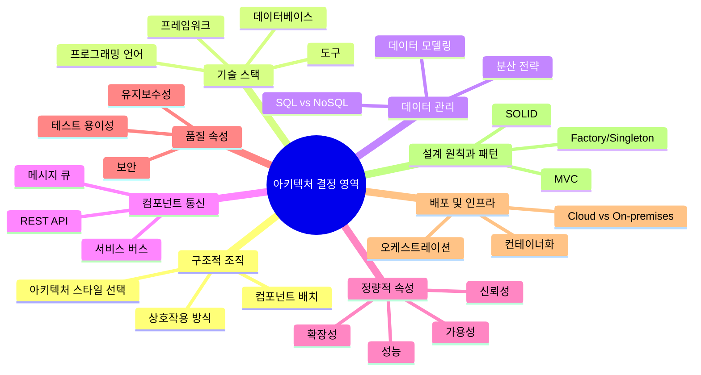
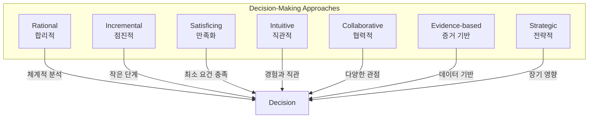
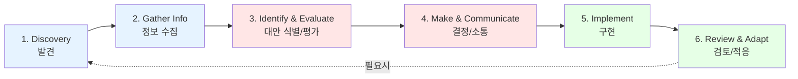
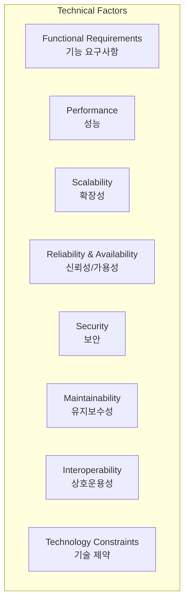
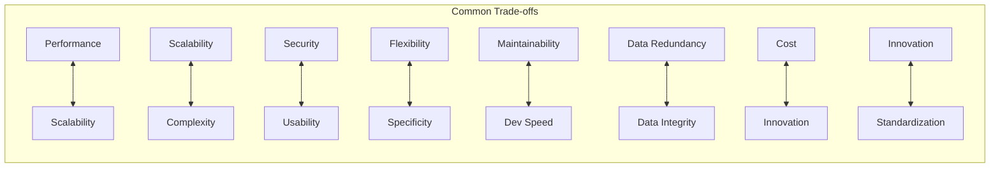
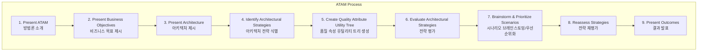
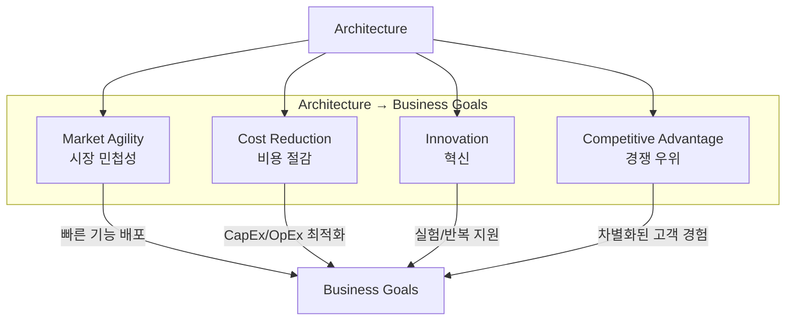
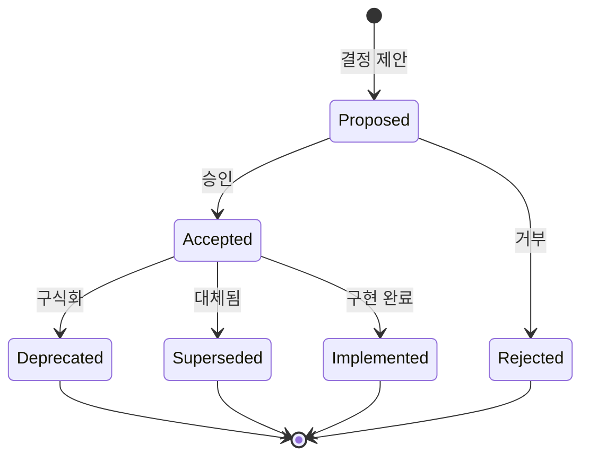

# Chapter 2: Decision-Making Processes in Software Architecture

## 핵심 요약

> 소프트웨어 아키텍처에서 의사결정은 프로젝트 성공의 핵심이다. 이 장에서는 아키텍처 결정의 본질, 영향 요소(기술/비즈니스/조직), 트레이드오프 평가 방법(ATAM), 비즈니스 목표와의 정렬 전략, 그리고 ADR(Architecture Decision Records)을 통한 문서화 방법을 다룬다.

---

## 학습 목표

이 장을 학습한 후 다음을 수행할 수 있어야 한다:

- [ ] 소프트웨어 아키텍처 결정의 유형과 영역을 설명할 수 있다
- [ ] 7가지 의사결정 접근법을 상황에 맞게 적용할 수 있다
- [ ] 기술/비즈니스/조직 요소를 분석하여 균형 잡힌 결정을 내릴 수 있다
- [ ] ATAM을 활용하여 아키텍처 트레이드오프를 평가할 수 있다
- [ ] ADR 문서를 작성하여 아키텍처 결정을 체계적으로 기록할 수 있다

---

## 본문 정리

### 1. 의사결정 프로세스 이해

#### 결정(Decision)이란?

> 여러 옵션 중에서 최선 또는 가장 적절한 옵션을 고려한 후 도달한 결론 또는 해결책

- **전제조건**: 복수의 옵션이 존재해야 함
- **단일 옵션**: 결정이 아닌 선택의 여지가 없는 상황
- **핵심**: 잘못된 결정 → 시간, 비용, 비즈니스 손실

---

#### 소프트웨어 아키텍처 결정 영역



**중요**: 아키텍처 결정은 장기적 영향을 미치며, 비용이 높고, 구현 후 변경이 어려움

---

#### 7가지 의사결정 접근법



| 접근법 | 설명 | 적용 상황 |
|--------|------|----------|
| **Rational** | 체계적/분석적, 요구사항 식별 → 대안 생성 → 평가 → 선택 | 완전한 정보가 있을 때 |
| **Incremental** | 작고 관리 가능한 단계로 진행 | 복잡한 프로젝트, 요구사항 예측 어려울 때 |
| **Satisficing** | 최적이 아닌 '충분히 좋은' 첫 번째 옵션 선택 | 시간 제한, 긴급 버그 수정 |
| **Intuitive** | 경험, 직관, 개인적 통찰 기반 | 빠른 결정 필요, 데이터 불완전 |
| **Collaborative** | 다양한 이해관계자 참여, 합의 도출 | 다양한 관점이 필요할 때 |
| **Evidence-based** | 데이터, 메트릭, 경험적 증거 활용 | 편향과 가정 줄여야 할 때 |
| **Strategic** | 장기 영향, 비즈니스 목표 정렬 | 프로젝트 비전과 미래 트렌드 고려 |

---

#### 의사결정 프로세스 6단계



| 단계 | 활동 | 핵심 질문 |
|------|------|----------|
| **Discovery** | 결정이 필요한 요구/기회 인식 | 해결해야 할 문제는? 달성할 목표는? |
| **Gather Info** | 결정에 영향을 미칠 데이터 수집/분석 | 어떤 정보가 필요한가? |
| **Identify & Evaluate** | 대안 우선순위화, 요구사항 대비 평가 | 실현 가능성, 리스크, 영향은? |
| **Make & Communicate** | 최적 옵션 선택, 이해관계자에게 근거 설명 | 왜 이 결정인가? (ADR 문서화) |
| **Implement** | 개발팀과 협력하여 결정 구현 | 가이드라인, 팀 이해 확보 |
| **Review & Adapt** | 성과/피드백/요구사항 변화 검토 | 결정이 요구를 충족했는가? |

---

### 2. 아키텍처 요소 분석

#### 2.1 기술적 요소 (Technical Factors)



| 요소 | 설명 | 결정 예시 |
|------|------|----------|
| **기능 요구사항** | 시스템이 제공해야 할 기능 | 검색 기능 → 강력한 DB 필요 |
| **성능** | 알고리즘, 캐싱, 인덱싱, 병렬 처리 | 캐싱 메커니즘 선택 |
| **확장성** | 데이터/트래픽 증가 대응 | DB 설계, 로드밸런싱, 분산 아키텍처 |
| **신뢰성/가용성** | 다양한 조건에서 안정적 동작, 최소 다운타임 | 장애 허용 설계 |
| **보안** | 데이터 보호, 규정 준수 | 암호화, 인증, 접근 제어 |
| **유지보수성** | 시스템 유지/진화 용이성 | 모듈 설계, 코딩 표준, 문서화 |
| **상호운용성** | 타 시스템과 통신/연동 | 인터페이스, 데이터 교환 형식, 프로토콜 |
| **기술 제약** | 기존 스택, 외부 시스템 호환성, 팀 전문성 | 기술 선택 제한 |

---

#### 2.2 비즈니스 요소 (Business Factors)

| 요소 | 설명 | 영향 |
|------|------|------|
| **예산 제약** | 제한된 자금 | 비용 효율적 솔루션, 오픈소스, 클라우드 고려 |
| **시간 제약** | 마감일 압박 | 빠른 프로토타이핑, 자동화 테스트, 모듈 개발 |
| **규제 요구사항** | 산업별 규정 준수 | 데이터 저장, 프라이버시, 감사 추적 |
| **비즈니스 목표** | 조직의 전반적 목표 | 아키텍처 품질 우선순위 결정 |
| **진화** | 미래 요구사항, 기술 변화 대응 | 지속 가능한 결정 |
| **벤더 종속** | 단일 벤더 기술 의존 | 오픈 표준, 멀티 클라우드 전략 |
| **국제화/지역화** | 다국어, 지역별 특성 | Unicode, 외부화된 텍스트, 유연한 UI |
| **접근성** | 장애인 사용자 지원 | alt-text, 색상 대비, 스크린 리더 |

---

#### 2.3 조직적 요소 (Organizational Factors)

| 요소 | 설명 | 영향 |
|------|------|------|
| **팀 기술/경험** | 개발팀의 전문성 | 기술 및 패턴 선택에 영향 |
| **이해관계자 관심사** | 다양한 우선순위 균형 | 개발자(구현 용이성) vs 마케팅(UX) |
| **아키텍처 원칙/가이드라인** | 조직 내 확립된 원칙 | 일관성, 광범위한 목표 정렬 |
| **문화/조직 역학** | 커뮤니케이션 패턴, 의사결정 프로세스 | 아키텍처 방향 영향 |
| **DevOps 관행** | CI/CD 채택 | 자동화, 모니터링, 배포 전략 |

---

### 3. 아키텍처 트레이드오프

#### 트레이드오프란?

> 하나의 아키텍처 옵션을 선택할 때 발생하는 내재적 타협. 한 측면에서 유리한 결정이 다른 측면에서 비용을 발생시킴.

---

#### 일반적인 트레이드오프 예시



| 트레이드오프 | 설명 |
|-------------|------|
| **성능 vs 확장성** | 고성능 모놀리식 → 확장성 희생, 마이크로서비스 → 지연 발생 |
| **확장성 vs 복잡성** | 로드밸런서, 분산 DB → 구현/테스트/관리 복잡성 증가 |
| **보안 vs 사용성** | 다중 인증 → 보안 강화, 사용 편의성 저하 |
| **유연성 vs 특수성** | 범용 솔루션 → 복잡성, 특화 솔루션 → 적응성 부족 |
| **유지보수성 vs 개발 속도** | 디자인 패턴/문서화 → 장기 유지보수 용이, 초기 속도 저하 |
| **데이터 중복 vs 데이터 무결성** | 중복 → 가용성/성능 향상, 일관성 유지 어려움 |
| **비용 vs 혁신** | 최신 기술 → 초기 비용 높음 |
| **혁신 vs 표준화** | 새로운 기술 → 경쟁 우위, 리스크 / 표준 기술 → 안정성, 기회 상실 |

---

#### ATAM (Architecture Trade-off Analysis Method)

Carnegie Mellon 대학 SEI에서 개발한 구조화된 트레이드오프 평가 기법.

##### ATAM 목표

1. **리스크 조기 식별**: 요구사항 충족을 위협하는 취약점 발견
2. **아키텍처 결정 평가**: 품질 속성 달성에 대한 영향 체계적 평가
3. **이해관계자 커뮤니케이션 개선**: 트레이드오프를 명시적으로 만들어 소통 강화

##### ATAM 9단계 프로세스



| 단계 | 활동 |
|------|------|
| 1. ATAM 소개 | 이해관계자에게 방법론 설명 |
| 2. 비즈니스 목표 | 시스템 개발 동기가 되는 목표 공유/평가 |
| 3. 아키텍처 제시 | 전체 아키텍처를 팀에 공유 |
| 4. 전략 식별 | 다양한 아키텍처 계획 논의 |
| 5. 유틸리티 트리 | 비즈니스/기술 요구사항을 품질 속성과 연결, 시나리오로 표현 |
| 6. 전략 평가 | 시나리오 중요도 평가, 아키텍처 효과성 검토 |
| 7. 시나리오 확장 | 더 넓은 이해관계자와 시나리오 확장/우선순위화 |
| 8. 재평가 | 새로운 인사이트로 전략 재평가 |
| 9. 결과 발표 | 문서와 발견사항을 이해관계자에게 배포 |

##### ATAM 이점

- **사전 리스크 관리**: 비용이 많이 드는 문제로 확대되기 전 해결
- **정보에 기반한 의사결정**: 결정 결과에 대한 깊은 이해
- **이해관계자 정렬**: 비즈니스 목표와 기술 솔루션 조화
- **품질 속성 강조**: 장기 품질/성능 목표와 정렬

---

#### ATAM 케이스 스터디: 건강 모니터링 시스템 (HMS)

**시나리오**: 만성 질환 환자를 위한 실시간 건강 추적 시스템

##### 비즈니스 목표

| 목표 | 설명 |
|------|------|
| 목표 1 | 환자 데이터 보안 및 프라이버시 보장 |
| 목표 2 | 실시간 건강 모니터링 및 알림 제공 |
| 목표 3 | 사용자 증가에 맞게 확장 |

##### 아키텍처 전략

- 환자 데이터 암호화 및 보안 프로토콜
- 확장을 위한 마이크로서비스 아키텍처
- 신뢰성/성능을 위한 클라우드 서비스

##### Quality Attribute Utility Tree

```
보안 (Security)
├─ 데이터 암호화 [H, H]
│   └─ 시나리오: 모든 환자 데이터는 전송 중 및 저장 시 암호화
├─ 접근 제어 [H, M]
│   └─ 시나리오: 의료진만 환자 기록 접근 가능
└─ 감사 로깅 [M, H]
    └─ 시나리오: 모든 데이터 접근은 로깅되어 추적 가능

성능 (Performance)
├─ 응답 시간 [H, H]
│   └─ 시나리오: 건강 데이터 조회 2초 이내
└─ 실시간 알림 [H, H]
    └─ 시나리오: 이상 징후 감지 시 30초 이내 알림

확장성 (Scalability)
├─ 수평 확장 [H, M]
│   └─ 시나리오: 사용자 10배 증가에도 성능 유지
└─ 데이터 볼륨 [M, H]
    └─ 시나리오: 일일 100만 건 데이터 포인트 처리

[우선순위, 난이도] - H: High, M: Medium, L: Low
```

##### 결과

ATAM을 통해 이해관계자들이 아키텍처 트레이드오프를 이해하고, 보안/프라이버시, 실시간 모니터링, 확장성에 집중하여 비즈니스 목표와 정렬된 아키텍처 방향 확정.

---

### 4. 비즈니스 목표와 아키텍처 결정 정렬

#### 비즈니스 목표란?

조직이 성장, 지속 가능성, 경쟁 우위를 보장하기 위해 설정한 목표:
- 수익 증대
- 고객 만족도 향상
- 시장 점유율 확대
- 규제 준수

#### 아키텍처가 달성하는 비즈니스 목표



| 목표 | 아키텍처의 역할 |
|------|----------------|
| **시장 민첩성** | 빠른 기능 배포, 변화하는 요구 적응, 신기술 통합 |
| **비용 절감** | 효율적 시스템 설계, 모듈성으로 장기 유지보수 비용 감소 |
| **혁신** | 실험/반복 지원 아키텍처, 데이터 분석 인사이트 제공 |
| **경쟁 우위** | 뛰어난 고객 경험, 운영 효율화, 빠른 출시 |

---

#### 정렬된 결정 vs 비정렬된 결정

| 구분 | 정렬된 결정 (Aligned) | 비정렬된 결정 (Misaligned) |
|------|----------------------|---------------------------|
| **효율성** | 향상 | 저하 |
| **비용** | 최적화 | 증가 |
| **확장성** | 지원 | 방해 |
| **보안** | 강화 | 취약점 노출 |
| **고객 만족** | 향상 | 저하 |
| **시장 기회** | 포착 | 놓침 |
| **의사결정** | 명확 | 혼란 |

##### 케이스 스터디 1: 성공적 정렬

> **글로벌 이커머스 플랫폼**: 채널 간 고객 데이터 통합을 위해 아키텍처 재설계 → 고객 경험 향상 → 만족도/유지율/수익 증가

##### 케이스 스터디 2: 비정렬

> **금융 기관**: 기술적으로 건전한 새 시스템 도입, but 기존 운영 워크플로우 고려 부족 → 운영 마찰, 지연, 비용 증가

---

#### 정렬 전략

1. **조직 목표 포괄적 이해**: 이해관계자 참여, 시장 역학 이해, 산업 트렌드 파악
2. **반복적 피드백 루프**: 지속적 정렬 보장
3. **우선순위 프레임워크**: 핵심 비즈니스 결과에 집중
4. **교차 기능 협업**: 전체 비전 지원 결정
5. **애자일 방법론**: 진화하는 비즈니스 요구 충족

---

### 5. 아키텍처 결정 문서화: ADR

#### ADR (Architecture Decision Record)란?

> 중요한 아키텍처 결정(AD), 그 컨텍스트, 결과를 기록하는 문서

##### ADR의 중요성

- 결정 근거에 대한 명확한 기록 제공
- 비즈니스 목표와의 정렬 보장
- 이해관계자 커뮤니케이션 촉진
- 미래 개발 노력 가이드
- 시스템 일관성, 규정 준수, 효율성 유지

##### ADR 상태 (Status)



| 상태 | 설명 |
|------|------|
| **Proposed** | 검토/논의 중인 결정 |
| **Accepted** | 구현을 위해 최종 확정 |
| **Rejected** | 진행하지 않기로 함 |
| **Deprecated** | 이전에 승인된 결정이 구식화 |
| **Superseded** | 새로운 결정으로 대체 |
| **Implemented** | 완전히 실행되어 운영 중 |

##### ADR 구조

```markdown
# ADR-001: [제목 - 선언적으로 목적 기술]

## 날짜
2024-01-15

## 상태
Accepted

## 컨텍스트
[사실과 컨텍스트를 풍부하고 간단하며 직접적으로 설명]
- 문제 상황
- 제약 조건
- 고려 사항

## 결정
[컨텍스트 기반의 결론. 완전한 문장, 능동태 사용]

우리는 [결정 내용]을 선택한다.

## 결과
### 긍정적 결과
- [장점 1]
- [장점 2]

### 부정적 결과
- [단점 1]
- [단점 2]

### 리스크
- [리스크 1]
- [리스크 2]
```

##### ADR 예시

```markdown
# ADR-002: 마이크로서비스 아키텍처 채택

## 날짜
2024-03-20

## 상태
Accepted

## 컨텍스트
현재 모놀리식 애플리케이션은 다음 문제를 겪고 있다:
- 배포 시 전체 시스템 재시작 필요
- 팀 간 코드 충돌 빈번
- 특정 기능만 스케일링 불가
- 새로운 기술 도입 어려움

## 결정
우리는 마이크로서비스 아키텍처로 전환한다.
- 도메인별 독립 서비스 분리
- API Gateway를 통한 통합
- 서비스당 독립 데이터베이스

## 결과
### 긍정적
- 독립적 배포 및 스케일링 가능
- 팀별 자율성 증가
- 기술 스택 유연성

### 부정적
- 분산 시스템 복잡성 증가
- 네트워크 지연 가능성
- 운영 오버헤드 증가

### 리스크
- 데이터 일관성 관리 필요
- 모니터링/로깅 인프라 필요
```

##### ADR 저장 위치

- **Git Repository**: 버전 관리 가능, but 비기술 이해관계자 접근 제한
- **Wiki/Confluence**: 모든 이해관계자 접근 용이
- **네트워크 디렉토리**: 조직 전체 접근 가능

**권장**: 모든 이해관계자가 접근 가능한 도구나 디렉토리에 저장

---

## 심화 학습

### 면접 예상 질문

1. **아키텍처 요소의 주요 카테고리는 무엇인가요?**
   - 기술적 요소 (성능, 확장성, 보안 등)
   - 비즈니스 요소 (예산, 시간, 규제 등)
   - 조직적 요소 (팀 역량, 문화, DevOps 등)

2. **ATAM이란 무엇이며 왜 중요한가요?**
   - 아키텍처 트레이드오프 분석 방법
   - 품질 속성 대비 결정 영향 평가
   - 리스크 조기 식별, 이해관계자 정렬

3. **ADR의 필수 섹션은 무엇인가요?**
   - Title, Date, Status, Context, Decision, Consequences

4. **정렬된 결정과 비정렬된 결정의 영향은?**
   - 정렬: 효율성 향상, 비용 최적화, 확장성 지원
   - 비정렬: 비용 증가, 확장성 저하, 기회 상실

5. **의사결정 접근법 중 긴급 상황에 적합한 것은?**
   - Satisficing: 최소 요건 충족하는 첫 번째 옵션 선택
   - Intuitive: 경험과 직관 기반 빠른 결정

### 추가 학습 자료

- **도서**: "Software Architecture in Practice" - Len Bass, Paul Clements, Rick Kazman
- **SEI**: [ATAM 공식 문서](https://resources.sei.cmu.edu/library/asset-view.cfm?assetid=5177)
- **ADR**: [adr.github.io](https://adr.github.io/)

---

## 실무 적용 포인트

### Spring 프로젝트에서 ADR 활용

```
project-root/
├── docs/
│   └── adr/
│       ├── 0001-use-spring-boot.md
│       ├── 0002-adopt-microservices.md
│       ├── 0003-select-postgresql.md
│       └── 0004-implement-jwt-auth.md
├── src/
└── ...
```

### 의사결정 체크리스트

**결정 전**:
- [ ] 문제/기회가 명확히 정의되었는가?
- [ ] 모든 관련 정보가 수집되었는가?
- [ ] 충분한 대안이 식별되었는가?
- [ ] 기술/비즈니스/조직 요소를 고려했는가?

**결정 시**:
- [ ] 트레이드오프가 명확히 분석되었는가?
- [ ] 이해관계자와 충분히 논의했는가?
- [ ] 비즈니스 목표와 정렬되는가?

**결정 후**:
- [ ] ADR로 문서화했는가?
- [ ] 팀에 결정을 공유했는가?
- [ ] 구현 계획이 수립되었는가?
- [ ] 검토/적응 일정이 있는가?

---

## 핵심 개념 체크리스트

| 개념 | 이해 | 적용 가능 |
|------|:----:|:--------:|
| 의사결정 프로세스 6단계 | [ ] | [ ] |
| 7가지 의사결정 접근법 | [ ] | [ ] |
| 기술적 요소 (Technical Factors) | [ ] | [ ] |
| 비즈니스 요소 (Business Factors) | [ ] | [ ] |
| 조직적 요소 (Organizational Factors) | [ ] | [ ] |
| 트레이드오프 개념 | [ ] | [ ] |
| ATAM 프로세스 9단계 | [ ] | [ ] |
| Quality Attribute Utility Tree | [ ] | [ ] |
| 비즈니스 목표 정렬 전략 | [ ] | [ ] |
| ADR 구조 및 작성법 | [ ] | [ ] |

---

## 참고 자료

- [Software Engineering Institute (SEI) - ATAM](https://resources.sei.cmu.edu/library/asset-view.cfm?assetid=5177)
- [ADR GitHub](https://adr.github.io/)
- [Documenting Architecture Decisions - Michael Nygard](https://cognitect.com/blog/2011/11/15/documenting-architecture-decisions)
