# Chapter 3: Understanding the System Context

## 핵심 요약

> 시스템 컨텍스트(System Context)는 소프트웨어 시스템이 운영되는 환경을 정의하며, 이해관계자(Stakeholder) 식별, 기능적/비기능적 요구사항(FRs/NFRs) 도출, 그리고 C4 Model을 통한 체계적인 문서화가 핵심이다. 이 장에서는 시스템의 경계와 외부 상호작용을 이해하고, 효과적인 아키텍처 설계를 위한 컨텍스트 분석 방법을 다룬다.

---

## 학습 목표

이 장을 학습한 후 다음을 수행할 수 있어야 한다:

- [ ] 시스템 컨텍스트와 소프트웨어 아키텍처의 관계를 설명할 수 있다
- [ ] 이해관계자를 식별하고 분류할 수 있다
- [ ] 기능적 요구사항(FRs)과 비기능적 요구사항(NFRs)을 구분하고 도출할 수 있다
- [ ] C4 Model의 4가지 레벨을 이해하고 활용할 수 있다
- [ ] 실제 시스템에 대한 컨텍스트 다이어그램을 작성할 수 있다

---

## 본문 정리

### 1. 시스템 컨텍스트란?

#### 정의

시스템 컨텍스트는 **소프트웨어 시스템이 운영되고 상호작용하는 환경**을 정의한다. 시스템의 경계(boundary)를 명확히 하고, 외부 시스템, 사용자, 데이터 소스와의 관계를 파악한다.

> 💬 **비유**: 시스템 컨텍스트는 집의 "대지"와 같다. 집(소프트웨어 시스템)을 짓기 전에 대지의 경계, 이웃(외부 시스템), 도로 접근성(인터페이스), 지역 규정(제약사항)을 먼저 이해해야 한다.

#### 시스템 컨텍스트 vs 소프트웨어 아키텍처

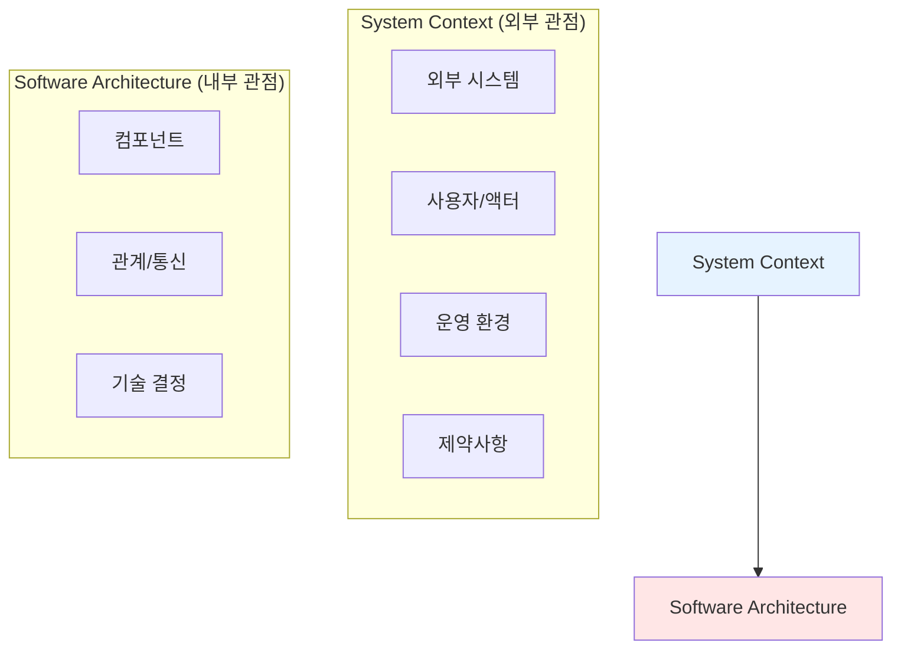

| 구분 | System Context | Software Architecture |
|------|---------------|----------------------|
| **관점** | 외부 (Outside-in) | 내부 (Inside-out) |
| **초점** | 시스템 경계와 상호작용 | 내부 구조와 설계 |
| **질문** | "무엇과 상호작용하는가?" | "어떻게 구축하는가?" |
| **산출물** | 컨텍스트 다이어그램 | 아키텍처 다이어그램 |

---

#### 시스템 컨텍스트의 4가지 요소

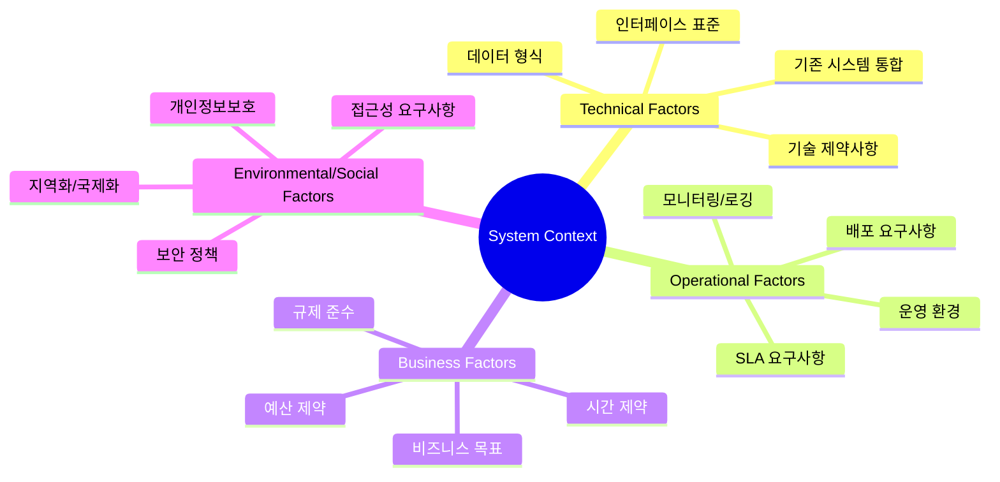

| 요소 | 설명 | 예시 |
|------|------|------|
| **Technical** | 기술적 제약과 통합 요구사항 | 레거시 시스템 연동, API 표준 |
| **Operational** | 운영 환경과 배포 요구사항 | 클라우드 vs 온프레미스, 고가용성 |
| **Business** | 비즈니스 목표와 제약 | ROI 목표, 규정 준수, 출시 일정 |
| **Environmental** | 사회적/환경적 요구사항 | GDPR 준수, 접근성(A11y) |

---

### 2. 이해관계자(Stakeholder) 참여

#### 이해관계자란?

이해관계자는 **시스템에 관심이 있거나 영향을 받는 개인 또는 그룹**이다. 성공적인 아키텍처를 위해 모든 관련 이해관계자를 식별하고 그들의 요구사항을 이해해야 한다.

#### 이해관계자 식별 기법

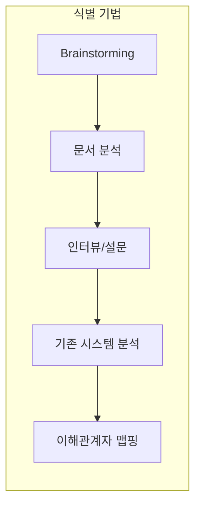

##### 주요 이해관계자 유형

| 유형 | 역할 | 주요 관심사 |
|------|------|------------|
| **Executive Sponsors** | 프로젝트 후원자 | ROI, 비즈니스 가치, 전략적 정렬 |
| **Project Managers** | 프로젝트 관리 | 일정, 예산, 리소스, 리스크 |
| **End Users** | 최종 사용자 | 사용성, 기능, 성능 |
| **Developers** | 개발팀 | 기술 스택, 개발 용이성, 유지보수성 |
| **Operations** | 운영팀 | 배포, 모니터링, 안정성 |
| **Security Team** | 보안팀 | 보안 요구사항, 규정 준수 |
| **External Partners** | 외부 파트너 | 통합, API, 데이터 교환 |

---

#### 이해관계자 분류 - Power/Interest Grid

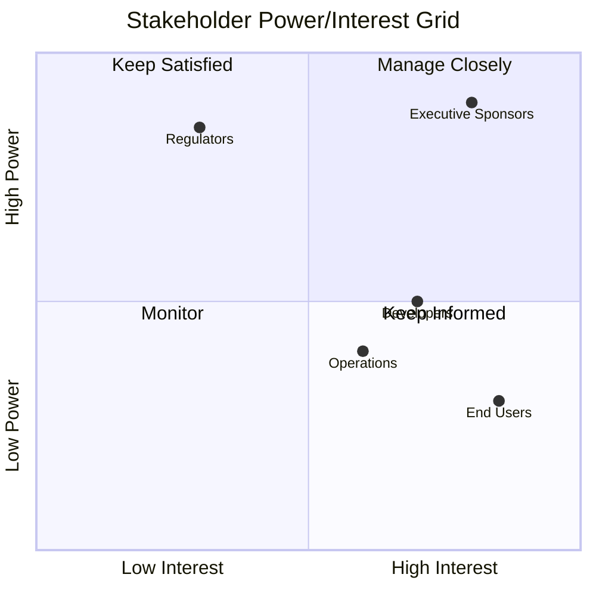

| 사분면 | 전략 | 대상 예시 |
|--------|------|----------|
| **Manage Closely** | 긴밀한 관리, 적극적 참여 | 경영진, 핵심 고객 |
| **Keep Satisfied** | 만족 유지, 정기 보고 | 규제기관, 투자자 |
| **Keep Informed** | 정보 제공, 의견 수렴 | 최종 사용자, 개발팀 |
| **Monitor** | 모니터링, 필요시 대응 | 일반 대중 |

---

#### 이해관계자 참여 전략

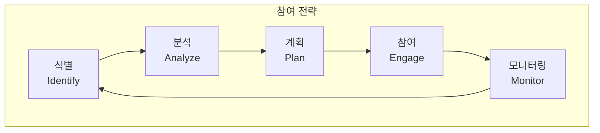

##### 효과적인 참여 방법

1. **초기 참여**: 프로젝트 시작부터 이해관계자 포함
2. **정기적 커뮤니케이션**: 주간/월간 상태 업데이트
3. **피드백 루프**: 의견 수렴 및 반영 체계
4. **기대치 관리**: 명확한 범위와 제약사항 공유
5. **갈등 해결**: 상충되는 요구사항 조율

---

### 3. 기능적 요구사항(FRs)과 비기능적 요구사항(NFRs)

#### 정의와 차이점

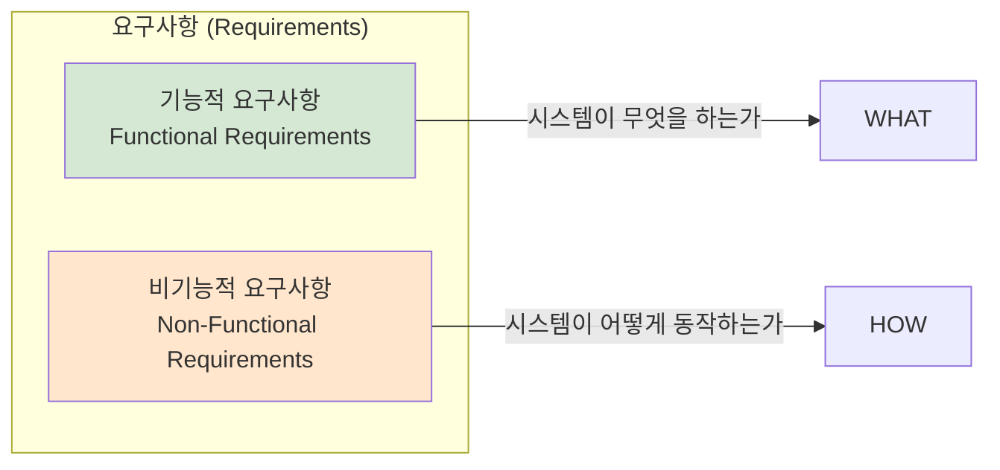

| 구분 | 기능적 요구사항 (FRs) | 비기능적 요구사항 (NFRs) |
|------|---------------------|------------------------|
| **질문** | "시스템이 무엇을 해야 하는가?" | "시스템이 어떻게 동작해야 하는가?" |
| **초점** | 기능, 동작, 비즈니스 로직 | 품질 속성, 제약사항 |
| **예시** | 사용자 로그인, 주문 처리 | 응답 시간 < 2초, 99.9% 가용성 |
| **검증** | 기능 테스트, 인수 테스트 | 성능 테스트, 보안 감사 |
| **영향** | 주로 개발 범위 | 아키텍처 설계에 큰 영향 |

---

#### 기능적 요구사항 (FRs) 예시

```java
// FR-001: 사용자는 이메일과 비밀번호로 로그인할 수 있어야 한다
@PostMapping("/login")
public ResponseEntity<AuthResponse> login(@RequestBody LoginRequest request) {
    // 사용자 인증 로직
    User user = userService.authenticate(request.getEmail(), request.getPassword());
    String token = jwtService.generateToken(user);
    return ResponseEntity.ok(new AuthResponse(token));
}

// FR-002: 사용자는 상품을 장바구니에 추가할 수 있어야 한다
@PostMapping("/cart/items")
public ResponseEntity<CartItem> addToCart(
    @AuthenticationPrincipal User user,
    @RequestBody AddCartItemRequest request) {
    CartItem item = cartService.addItem(user.getId(), request.getProductId(), request.getQuantity());
    return ResponseEntity.ok(item);
}
```

##### FRs 도출 기법

| 기법 | 설명 | 장점 |
|------|------|------|
| **User Stories** | "As a [user], I want [goal] so that [benefit]" | 사용자 관점, 비즈니스 가치 명확 |
| **Use Cases** | 액터와 시스템 간 상호작용 시나리오 | 상세한 흐름 파악 |
| **Interviews** | 이해관계자 인터뷰 | 암묵적 요구사항 도출 |
| **Workshops** | 협업 워크샵 | 빠른 합의, 다양한 관점 |
| **Prototyping** | 프로토타입 기반 피드백 | 실제 요구사항 검증 |

---

#### 비기능적 요구사항 (NFRs) 분류

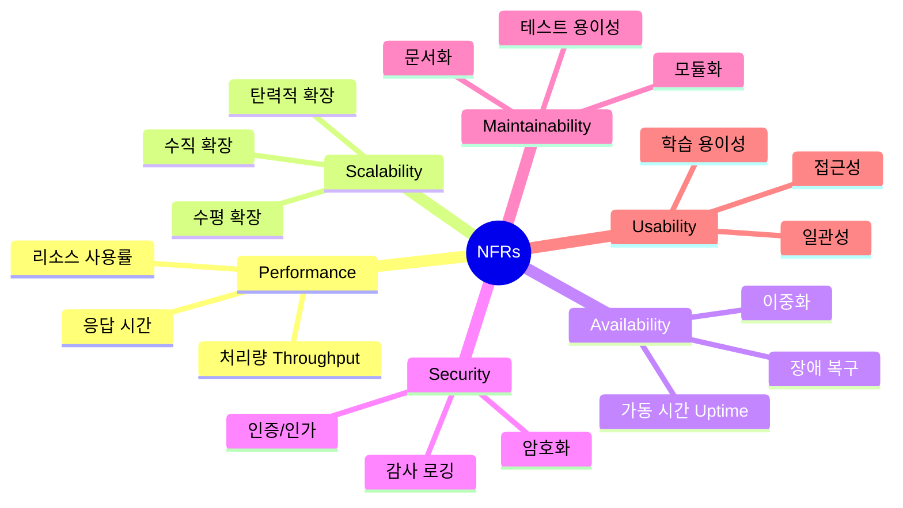

##### NFRs 정량화 예시

| 품질 속성 | 측정 가능한 요구사항 | 검증 방법 |
|---------|---------------------|---------|
| **Performance** | API 응답 시간 ≤ 200ms (p95) | JMeter, k6 부하 테스트 |
| **Availability** | 가용성 ≥ 99.9% (연간 다운타임 < 8.76시간) | 모니터링 대시보드 |
| **Scalability** | 동시 사용자 10,000명 지원 | 스트레스 테스트 |
| **Security** | OWASP Top 10 취약점 0건 | 보안 감사, 침투 테스트 |
| **Maintainability** | 코드 커버리지 ≥ 80% | SonarQube 분석 |

---

#### NFRs가 아키텍처에 미치는 영향

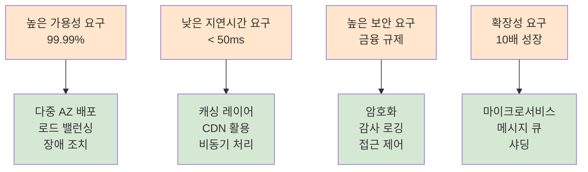

---

#### 요구사항 도출 Best Practices

1. **SMART 원칙 적용**
   - **S**pecific: 구체적
   - **M**easurable: 측정 가능
   - **A**chievable: 달성 가능
   - **R**elevant: 관련성
   - **T**ime-bound: 기한 명시

2. **우선순위 지정 (MoSCoW)**
   - **M**ust have: 필수
   - **S**hould have: 권장
   - **C**ould have: 선택
   - **W**on't have: 제외

3. **추적성(Traceability) 유지**
   - 요구사항 ID 체계
   - 설계-구현-테스트 매핑

---

### 4. C4 Model - 아키텍처 문서화

#### C4 Model 개요

Simon Brown이 만든 **소프트웨어 아키텍처 시각화 모델**로, 4가지 레벨의 추상화를 통해 시스템을 문서화한다.

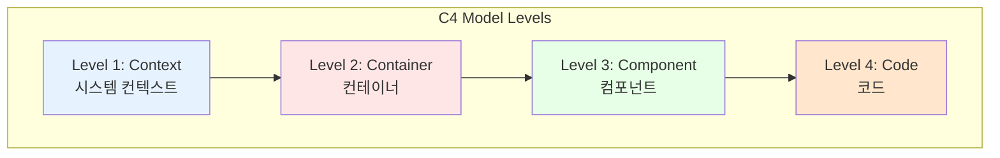

| 레벨 | 대상 | 설명 | 대상 독자 |
|------|------|------|---------|
| **Context** | 시스템 전체 | 외부 시스템과 사용자와의 관계 | 비기술자, 경영진 |
| **Container** | 컨테이너 | 애플리케이션, 데이터베이스, 서버 | 아키텍트, 개발자 |
| **Component** | 컴포넌트 | 컨테이너 내부 구성 요소 | 개발자 |
| **Code** | 코드 | 클래스, 인터페이스 수준 | 개발자 |

---

#### Level 1: System Context Diagram

> 💬 **비유**: 구글 지도에서 "위성에서 본 전체 도시 모습". 시스템의 위치와 주변 환경을 한눈에 파악.

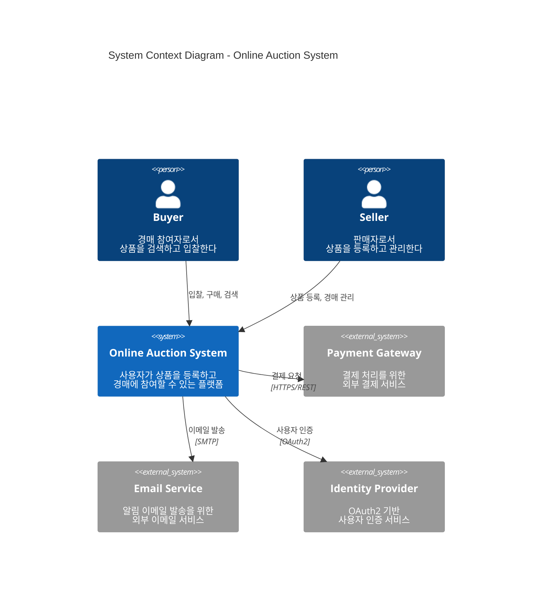

##### Context Diagram 구성 요소

| 요소 | 설명 | 표현 |
|------|------|------|
| **Person** | 시스템을 사용하는 인간 사용자 | 사람 아이콘 |
| **Software System** | 우리가 구축하는 시스템 | 박스 (강조) |
| **External System** | 외부 시스템, 서비스 | 박스 (회색) |
| **Relationship** | 상호작용, 데이터 흐름 | 화살표 + 설명 |

---

#### Level 2: Container Diagram

> 💬 **비유**: 구글 지도에서 "건물 내부 층별 안내도". 시스템 내부의 주요 기술 구성 요소.

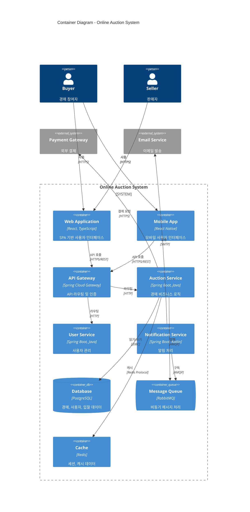

##### Container 유형

| 유형 | 설명 | 예시 |
|------|------|------|
| **Application** | 실행 가능한 애플리케이션 | Web App, Mobile App, API |
| **Database** | 데이터 저장소 | PostgreSQL, MongoDB |
| **Message Queue** | 비동기 메시징 | RabbitMQ, Kafka |
| **Cache** | 캐시 시스템 | Redis, Memcached |
| **File Storage** | 파일 저장소 | S3, MinIO |

---

#### Level 3: Component Diagram

> 💬 **비유**: 구글 지도에서 "특정 층의 방 배치도". 컨테이너 내부의 구성 요소.

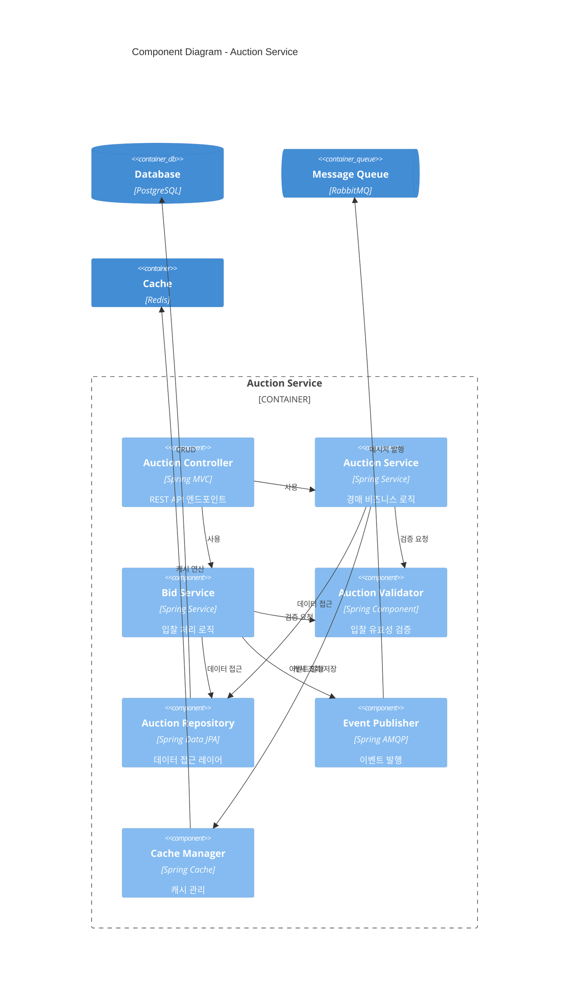

---

#### Level 4: Code Diagram

> 일반적으로 IDE나 UML 도구로 자동 생성. 필요한 경우에만 작성.

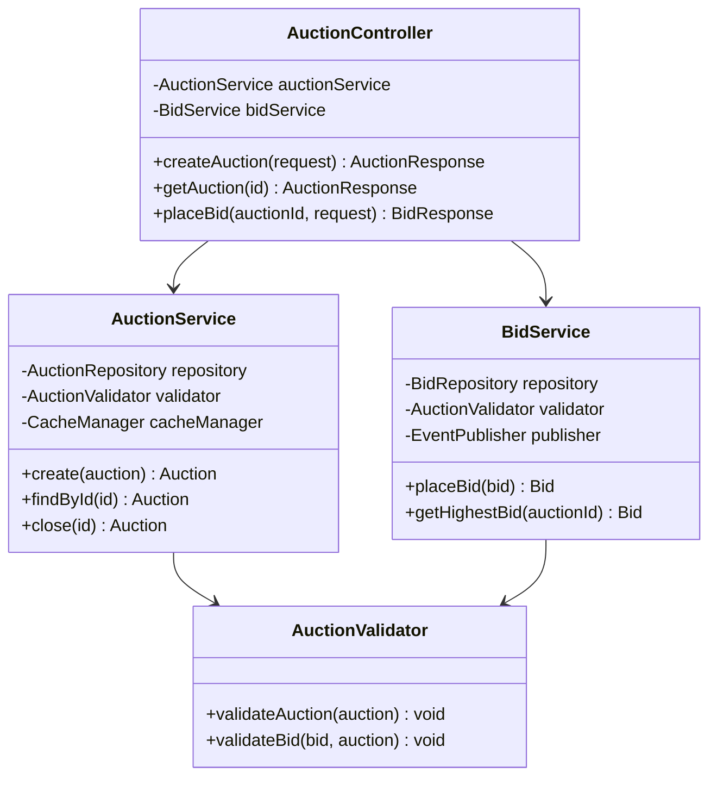

---

#### C4 Model 작성 도구

| 도구 | 특징 | URL |
|------|------|-----|
| **Structurizr** | C4 Model 공식 도구, DSL 지원 | structurizr.com |
| **PlantUML** | 텍스트 기반 다이어그램 | plantuml.com |
| **Mermaid** | 마크다운 호환, GitHub 지원 | mermaid.js.org |
| **Draw.io** | 범용 다이어그램 도구 | draw.io |
| **IcePanel** | C4 Model 특화 협업 도구 | icepanel.io |

---

## 심화 학습

### C4 Model과 다른 아키텍처 표기법 비교

| 표기법 | 특징 | 적합한 상황 |
|--------|------|-----------|
| **C4 Model** | 4단계 줌, 기술자와 비기술자 모두 이해 | 현대적 소프트웨어 시스템 |
| **UML** | 표준화된 정형 표기법, 상세 | 엔터프라이즈, 계약 기반 개발 |
| **ArchiMate** | 엔터프라이즈 아키텍처 | 비즈니스-IT 정렬 |
| **4+1 View Model** | 5가지 관점 (논리, 프로세스, 개발, 물리, 시나리오) | 복잡한 시스템 |

### 추가 참고 자료

- [C4 Model 공식 사이트](https://c4model.com/)
- [Structurizr DSL](https://structurizr.com/dsl)
- [Simon Brown - Software Architecture for Developers](https://leanpub.com/software-architecture-for-developers)

---

## 실무 적용 포인트

### 이런 상황에서 사용하세요

1. **프로젝트 킥오프**: 시스템 컨텍스트를 명확히 정의하여 팀 간 공유
2. **이해관계자 회의**: C4 Context Diagram으로 시스템 범위 설명
3. **기술 설계 리뷰**: Container/Component Diagram으로 설계 검토
4. **온보딩 문서**: 새 팀원에게 시스템 구조 설명
5. **RFP/제안서**: 고객에게 제안하는 아키텍처 시각화

### 주의할 점 / 흔한 실수

- ⚠️ **과도한 상세화**: Code Level은 필요한 경우에만 작성
- ⚠️ **업데이트 누락**: 다이어그램이 실제 시스템과 불일치
- ⚠️ **이해관계자 누락**: 보안팀, 운영팀 등 간과하기 쉬운 그룹
- ⚠️ **NFRs 경시**: 기능에만 집중하고 품질 속성 무시
- ⚠️ **측정 불가능한 NFRs**: "빨라야 한다" 대신 "응답 시간 < 200ms"

### 면접에서 나올 수 있는 질문

- **Q: 기능적 요구사항과 비기능적 요구사항의 차이는?**
  - FRs: 시스템이 "무엇"을 하는가 (기능, 동작)
  - NFRs: 시스템이 "어떻게" 동작하는가 (품질 속성)
  - NFRs가 아키텍처에 더 큰 영향을 미침

- **Q: C4 Model의 4가지 레벨을 설명해주세요.**
  - Context: 외부 시스템과의 관계 (줌 아웃)
  - Container: 애플리케이션, DB 등 기술 구성 요소
  - Component: 컨테이너 내부 구성 요소
  - Code: 클래스/인터페이스 수준 (줌 인)

- **Q: 이해관계자를 어떻게 분류하나요?**
  - Power/Interest Grid 활용
  - 관리 전략: Manage Closely, Keep Satisfied, Keep Informed, Monitor

- **Q: 좋은 NFR의 조건은?**
  - SMART: 구체적, 측정 가능, 달성 가능, 관련성, 기한

---

## 핵심 개념 체크리스트

| 개념 | 이해 | 적용 가능 |
|------|:----:|:--------:|
| 시스템 컨텍스트 정의 | [ ] | [ ] |
| 컨텍스트 4가지 요소 (Technical, Operational, Business, Environmental) | [ ] | [ ] |
| 이해관계자 식별 기법 | [ ] | [ ] |
| Power/Interest Grid | [ ] | [ ] |
| 기능적 요구사항 (FRs) 도출 | [ ] | [ ] |
| 비기능적 요구사항 (NFRs) 분류 | [ ] | [ ] |
| NFRs 정량화 방법 | [ ] | [ ] |
| MoSCoW 우선순위 | [ ] | [ ] |
| C4 Model 4단계 | [ ] | [ ] |
| Context Diagram 작성 | [ ] | [ ] |
| Container Diagram 작성 | [ ] | [ ] |
| Component Diagram 작성 | [ ] | [ ] |

---

## 참고 자료

- [GitHub 코드 예제](https://github.com/PacktPublishing/Software-Architecture-with-Spring/tree/main/ch3)
- [C4 Model 공식 사이트](https://c4model.com/)
- [Structurizr - C4 Model 도구](https://structurizr.com/)
- [Simon Brown - The C4 Model for Software Architecture](https://www.youtube.com/watch?v=x2-rSnhpw0g)
- [BABOK - Business Analysis Body of Knowledge](https://www.iiba.org/standards-and-resources/babok/)
