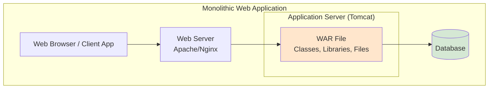
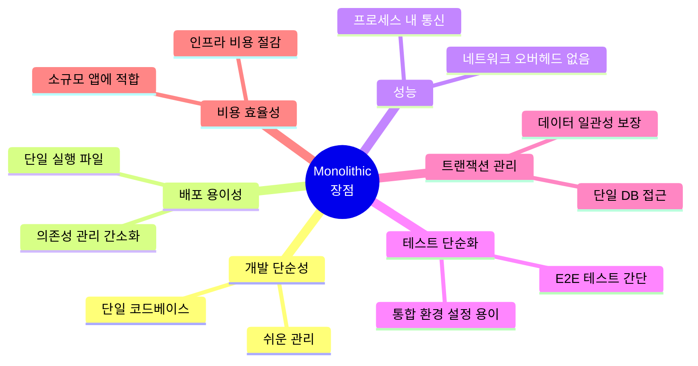
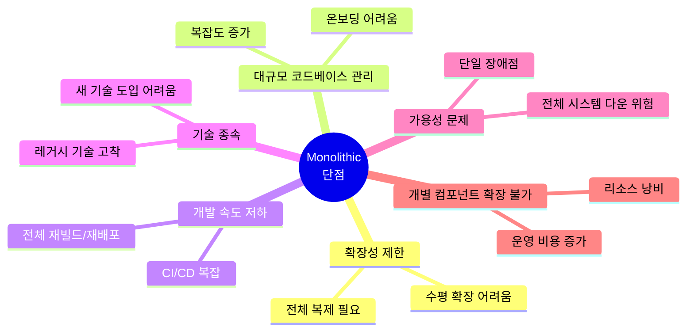
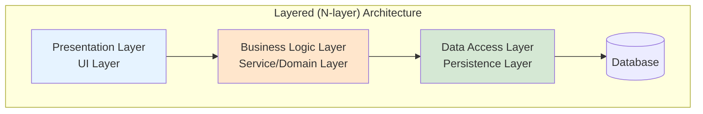
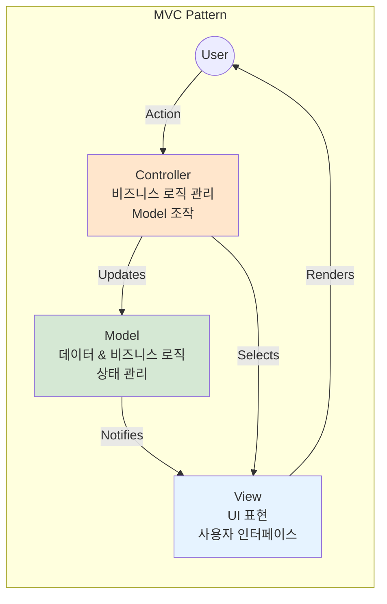
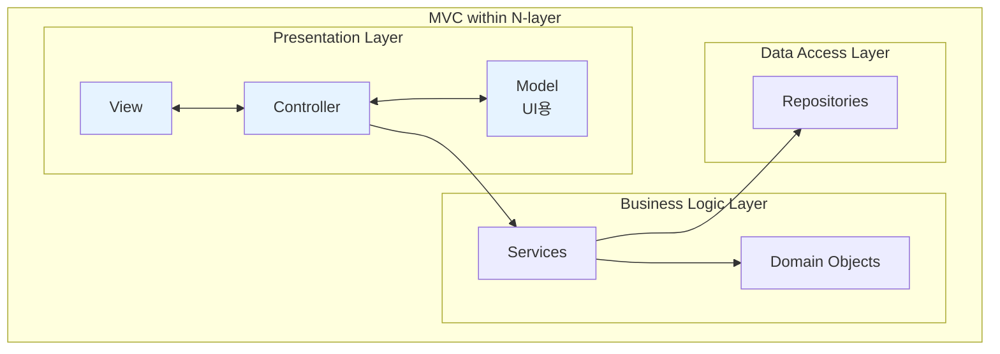
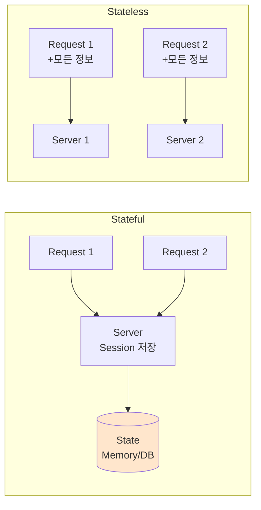
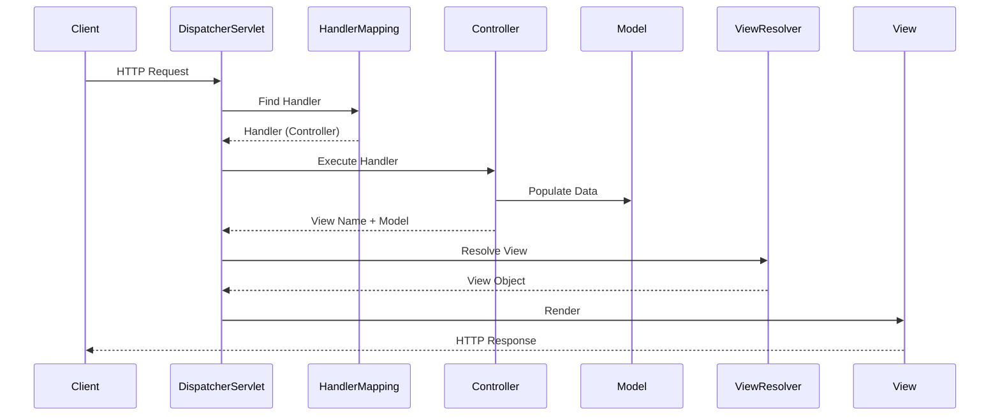
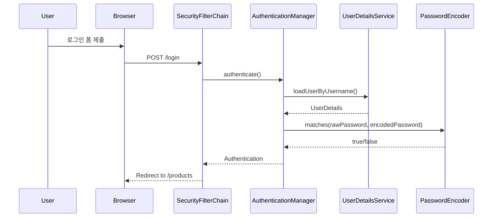
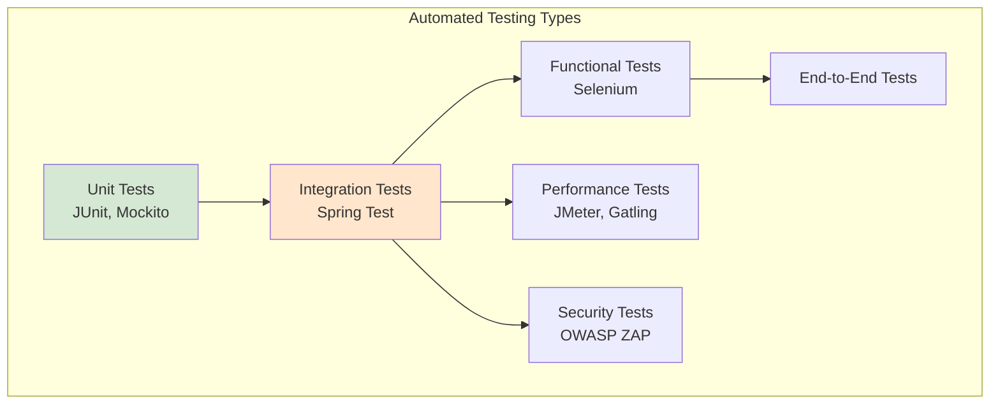

# Chapter 4: Monolithic Architecture

## 핵심 요약

> 모놀리식 아키텍처는 모든 컴포넌트가 단일 코드베이스에 통합되어 하나의 아티팩트로 배포되는 전통적인 소프트웨어 개발 방식이다. 이 장에서는 모놀리식 아키텍처의 장단점, Layered Architecture와 MVC 패턴, Stateful/Stateless 개념을 다루고, Spring Boot, Spring MVC, Spring Security, Thymeleaf를 활용한 온라인 경매 시스템 구현과 자동화 테스트를 실습한다.

---

## 학습 목표

이 장을 학습한 후 다음을 수행할 수 있어야 한다:

- [ ] 모놀리식 아키텍처의 정의와 장단점을 설명할 수 있다
- [ ] Layered Architecture(N-layer)와 MVC 패턴의 역할을 이해하고 적용할 수 있다
- [ ] Stateful과 Stateless 시스템의 차이를 구분하고 적절히 선택할 수 있다
- [ ] Spring Boot, Spring MVC, Thymeleaf를 사용하여 모놀리식 애플리케이션을 구현할 수 있다
- [ ] Spring Security를 활용하여 인증/인가를 구현할 수 있다
- [ ] 통합 테스트를 작성하고 실행할 수 있다

---

## 본문 정리

### 1. 모놀리식 아키텍처란?

#### 정의

모놀리식 아키텍처는 **모든 컴포넌트와 기능이 단일 유닛으로 통합**되어 서버에 하나의 아티팩트로 배포되는 전통적인 소프트웨어 개발 방식이다. 사용자 인터페이스, 비즈니스 로직, 데이터 접근 계층이 모두 하나의 코드베이스에 포함된다.



> 💬 **비유**: 모놀리식 아키텍처는 "올인원 스위스 아미 나이프"와 같다. 모든 도구가 하나로 통합되어 있어 휴대와 사용이 편리하지만, 특정 도구만 업그레이드하거나 교체하기 어렵다.

---

#### 모놀리식 아키텍처의 장점



| 장점 | 설명 |
|------|------|
| **개발 단순성** | 모든 컴포넌트가 한 곳에 있어 작업, 테스트, 배포가 간편 |
| **배포 용이성** | 단일 실행 파일로 배포, 마이크로서비스처럼 다중 서비스 관리 불필요 |
| **성능** | 동일 프로세스 내 함수 호출로 네트워크 지연 없음 |
| **테스트 단순화** | 통합 테스트 환경 설정이 분산 시스템보다 간단 |
| **신뢰성** | 긴밀하게 결합된 모듈은 함께 테스트되어 예측 가능한 동작 보장 |
| **트랜잭션 관리** | 단일 DB 접근으로 트랜잭션 관리와 데이터 일관성 보장 용이 |
| **비용 효율성** | 소규모 애플리케이션에서 개발/유지보수 리소스 절감 |
| **확장 용이성** | 부하가 예측 가능하면 수직 확장(Vertical Scaling)으로 대응 가능 |
| **Cross-cutting Concerns** | 로깅, 보안 등 횡단 관심사를 일관되게 구현 가능 |

---

#### 모놀리식 아키텍처의 단점



| 단점 | 설명 |
|------|------|
| **제한된 확장성** | 수평 확장 시 전체 애플리케이션 복제 필요 |
| **대규모 코드베이스 관리 어려움** | 기능 추가 시 복잡도 증가, 신규 팀원 적응 시간 증가 |
| **개발 속도 저하** | 작은 변경도 전체 재빌드/재배포 필요 |
| **기술 종속(Lock-in)** | 새 기술/프레임워크 도입이 전체 시스템에 영향 |
| **가용성 문제** | 일부 장애가 전체 시스템 장애로 이어질 수 있음 |
| **개별 컴포넌트 확장 불가** | 특정 컴포넌트만 확장 불가, 리소스 낭비 |
| **CI 복잡성** | 작은 변경도 전체 재빌드 필요, 버그 유입 위험 증가 |
| **리팩토링 어려움** | 한 부분 변경이 다른 부분에 예상치 못한 영향 |
| **IDE 성능 저하** | 대규모 코드베이스로 개발 도구 반응 속도 저하 |

---

### 2. 모놀리식 아키텍처의 일반적인 패턴

#### 2.1 Layered Architecture (N-layer)

Layered Architecture는 애플리케이션 컴포넌트를 **수평적 계층(Layer)**으로 조직화하는 소프트웨어 설계 패턴이다. 각 계층은 명확한 역할과 책임을 가지며, 인접한 계층과만 통신한다.



| 계층 | 역할 | 예시 |
|------|------|------|
| **Presentation Layer** | 사용자 인터페이스, 입출력 처리 | Controllers, Views, Templates |
| **Business Logic Layer** | 비즈니스 규칙, 도메인 로직 | Services, Domain Objects |
| **Data Access Layer** | 데이터 영속성, DB 접근 | Repositories, DAOs |

##### Layered Architecture의 역할

- **관심사 분리**: 각 계층의 역할을 명확히 구분하여 코드 관리 용이
- **변경 영향 최소화**: 특정 계층 변경이 다른 계층에 미치는 영향 제한
- **독립적 테스트**: 각 계층을 독립적으로 단위 테스트 가능
- **개발 유연성**: 팀이 서로 다른 계층을 병렬로 작업 가능
- **보안 계층화**: 각 계층에 맞는 보안 정책 적용 가능

---

#### 2.2 Model-View-Controller (MVC) 패턴

MVC 패턴은 애플리케이션을 **Model, View, Controller** 세 가지 컴포넌트로 분리하는 디자인 패턴이다. 주로 **Presentation Layer**에서 사용된다.



| 컴포넌트 | 역할 | Spring 매핑 |
|---------|------|------------|
| **Model** | 데이터와 비즈니스 로직, 상태 관리 | Entity, DTO, Domain Objects |
| **View** | 사용자 인터페이스, 데이터 표현 | Thymeleaf Templates, JSP |
| **Controller** | 사용자 입력 처리, Model과 View 조정 | @Controller Classes |

##### MVC vs N-layer



- **MVC**: 주로 **UI 측면**에 초점, Presentation Layer 내에서 사용
- **N-layer**: **전체 애플리케이션**의 관심사 분리에 초점
- **조합 사용**: MVC는 N-layer의 Presentation Layer 내에서 활용 가능

---

#### 2.3 Stateful vs Stateless



| 구분 | Stateful | Stateless |
|------|----------|-----------|
| **정의** | 이전 상호작용 정보 유지 | 각 요청을 독립적으로 처리 |
| **상태 저장** | HTTP Session, Cookie, DB | 요청에 모든 정보 포함 |
| **확장성** | 세션 동기화 필요, 확장 어려움 | 독립 처리로 확장 용이 |
| **리소스** | 상태 저장에 추가 리소스 필요 | 리소스 효율적 |
| **예시** | 전통적 웹 애플리케이션, 뱅킹 시스템 | RESTful API, 공개 API |
| **적합 상황** | 복잡한 사용자 세션, 실시간 처리 | 대규모 사용자, 독립적 요청 |

> **Note**: Stateful/Stateless 선택은 시스템의 성능, 확장성, 복잡도에 큰 영향을 미치므로 운영 요구사항에 맞게 신중히 결정해야 한다.

---

### 3. 모놀리식 애플리케이션 구현

#### 3.1 Online Auction 케이스 스터디

가상의 회사 **WX-Auction**은 제한된 예산으로 온라인 경매 시스템을 빠르고 비용 효율적으로 개발하고자 한다.

**아키텍처 선택 이유**:
- 빠른 개발, 테스트, 배포 (MVP)
- 클라우드/온프레미스 리소스 비용 절감
- 유지보수 인력 최소화
- 필요 시 수직 확장으로 대응 가능

**기술 스택**:
- Java 21, Maven
- Spring Boot, Spring Security, Spring Web MVC, Spring Data
- Thymeleaf (서버사이드 템플릿)

---

#### 3.2 Spring Boot 프로젝트 생성

Spring Initializr(https://start.spring.io/)를 사용하여 프로젝트 생성:

```xml
<!-- 필수 의존성 -->
<dependency>
    <groupId>org.springframework.boot</groupId>
    <artifactId>spring-boot-starter-web</artifactId>
</dependency>

<dependency>
    <groupId>org.springframework.boot</groupId>
    <artifactId>spring-boot-starter-thymeleaf</artifactId>
</dependency>

<dependency>
    <groupId>org.springframework.boot</groupId>
    <artifactId>spring-boot-starter-security</artifactId>
</dependency>
```

---

#### 3.3 Spring MVC 구현

##### Spring MVC 컴포넌트와 흐름



##### Controller 구현

```java
@Controller
@RequestMapping("products")  // 기본 URL 경로 설정
public class ProductController {

    @Autowired
    private ProductService productService;

    // GET 요청 처리 - 로그인 페이지
    @GetMapping(value = "/login")
    public String login() {
        return "login";  // login.html 템플릿 반환
    }

    // GET 요청 처리 - 상품 상세 조회
    @GetMapping("/{id}")
    public String listProducts(Model model, @PathVariable("id") Integer id) {
        // Model에 데이터 추가하여 View로 전달
        model.addAttribute("product", productService.getProductById(id));
        return "product-item";  // product-item.html 반환
    }

    // POST 요청 처리 - 상품 저장
    @PostMapping("/add")
    public String saveProduct(@ModelAttribute Product product) {
        // @ModelAttribute: 폼 데이터를 Product 객체에 바인딩
        productService.saveProduct(product);
        return "redirect:/products";
    }
}
```

##### Thymeleaf 뷰 구현

**레이아웃 템플릿 (layout.html)**:
```html
<html xmlns:layout="http://www.ultraq.net.nz/web/thymeleaf/layout">
<head>
    <title>Online Auction</title>
</head>
<body>
    <header><!-- 공통 헤더 --></header>

    <!-- 자식 템플릿 내용이 삽입되는 영역 -->
    <section layout:fragment="content"></section>

    <footer><!-- 공통 푸터 --></footer>
</body>
</html>
```

**자식 템플릿 (products.html)**:
```html
<html xmlns:layout="http://www.ultraq.net.nz/thymeleaf/layout"
      layout:decorate="~{layout.html}">
<body>
    <section layout:fragment="content">
        <!-- 상품 목록 표시 -->
        <div th:each="product : ${products}">
            <span th:text="${product.name}">상품명</span>
        </div>
    </section>
</body>
</html>
```

**폼 데이터 전송 예시**:
```html
<form th:action="@{/products/add}" th:object="${product}" method="post">
    <input type="text" id="name" th:field="*{name}" placeholder="상품명">
    <input type="number" id="price" th:field="*{price}" placeholder="가격">
    <button type="submit">등록</button>
</form>
```

| Thymeleaf 표현식 | 설명 |
|-----------------|------|
| `th:action="@{/url}"` | 폼 액션 URL 설정 |
| `th:object="${obj}"` | 폼에 객체 바인딩 |
| `th:field="*{field}"` | 객체 필드에 입력 바인딩 |
| `th:text="${expr}"` | 텍스트 출력 |
| `th:each="item : ${list}"` | 반복문 |

---

#### 3.4 Spring Security 구현

##### 기본 인증 흐름



##### Security 설정 (Spring Security 6)

```java
@Configuration
@EnableWebSecurity
public class SecurityConfig {

    @Bean
    public SecurityFilterChain filterChain(HttpSecurity http) throws Exception {
        http
            // 요청 인가 설정
            .authorizeHttpRequests(authorize -> authorize
                .requestMatchers("/home", "/login", "/register").permitAll()  // 공개 URL
                .anyRequest().authenticated()  // 나머지는 인증 필요
            )
            // 폼 로그인 설정
            .formLogin(form -> form
                .loginPage("/login")  // 커스텀 로그인 페이지
                .defaultSuccessUrl("/products", true)  // 로그인 성공 시 이동
            )
            // 로그아웃 설정
            .logout(logout -> logout
                .logoutSuccessUrl("/home")  // 로그아웃 후 이동
            )
            // CSRF 보호
            .csrf(csrf -> csrf
                .csrfTokenRepository(new CookieCsrfTokenRepository())
            )
            // HTTP Basic 인증
            .httpBasic(Customizer.withDefaults());

        return http.build();
    }

    // 비밀번호 암호화 (BCrypt)
    @Bean
    public PasswordEncoder passwordEncoder() {
        return new BCryptPasswordEncoder();
    }
}
```

##### UserDetailsService 커스텀 구현

```java
@Service
public class UserDetailsCustomService implements UserDetailsService {

    @Autowired
    private UserRepository userRepository;

    @Override
    public UserDetails loadUserByUsername(String username)
            throws UsernameNotFoundException {
        // DB에서 사용자 조회
        User user = userRepository.findByUsername(username)
            .orElseThrow(() -> new UsernameNotFoundException(
                "User not found: " + username));

        // Spring Security UserDetails 객체로 변환
        return new UserDetailsCustom(
            user.getUsername(),
            user.getPassword(),
            user.getRoles().stream()
                .map(r -> new SimpleGrantedAuthority(r.getName()))
                .collect(Collectors.toList()),
            user.isEnabled()
        );
    }
}
```

##### 역할 기반 접근 제어

```java
// Controller에서 역할 기반 접근 제어
@PreAuthorize("hasRole('ADMIN')")
@GetMapping("/admin")
public String admin() {
    return "admin";
}
```

```html
<!-- Thymeleaf에서 역할 기반 표시 제어 -->
<html xmlns:sec="http://www.thymeleaf.org/thymeleaf-extras-springsecurity6">

<!-- ADMIN 역할만 표시 -->
<li sec:authorize="hasRole('ROLE_ADMIN')">
    <a href="/admin">관리자 메뉴</a>
</li>

<!-- 로그인한 사용자만 표시 -->
<li sec:authorize="isAuthenticated()">
    <a href="/logout">로그아웃</a>
</li>
```

---

#### 3.5 SSL/TLS 보안 설정

```properties
# application.properties
server.port=8443
server.ssl.key-store=classpath:keystore.jks
server.ssl.key-store-password=yourpassword
server.ssl.keyStoreType=JKS
server.ssl.keyAlias=tomcat
```

**JKS 인증서 생성**:
```bash
keytool -genkeypair -alias myappkey -keyalg RSA -keysize 2048 \
  -keystore mykeystore.jks -validity 365
```

---

### 4. 자동화 테스트

#### 테스트 유형



| 테스트 유형 | 목적 | 도구 |
|-----------|------|------|
| **Unit Tests** | 개별 컴포넌트/함수 테스트 | JUnit, Mockito |
| **Integration Tests** | 컴포넌트 간 상호작용 검증 | Spring Test, MockMvc |
| **Functional Tests** | 최종 사용자 관점에서 기능 검증 | Selenium, TestComplete |
| **Performance Tests** | 부하 조건에서 성능 검증 | JMeter, Gatling |
| **Security Tests** | 보안 취약점 검사 | OWASP ZAP, Fortify |

---

#### 통합 테스트 구현

```xml
<!-- 테스트 의존성 -->
<dependency>
    <groupId>org.springframework.boot</groupId>
    <artifactId>spring-boot-starter-test</artifactId>
    <scope>test</scope>
</dependency>

<dependency>
    <groupId>org.springframework.security</groupId>
    <artifactId>spring-security-test</artifactId>
    <scope>test</scope>
</dependency>
```

##### 로그인 통합 테스트

```java
@SpringBootTest(webEnvironment = SpringBootTest.WebEnvironment.RANDOM_PORT)
@AutoConfigureMockMvc
public class LoginIntegrationTests {

    @Autowired
    private MockMvc mockMvc;

    @Test
    public void testSuccessfulLogin() throws Exception {
        // 로그인 성공 테스트
        mockMvc.perform(formLogin("/login")
                .user("user")
                .password("test123"))
            .andExpect(redirectedUrl("/home"));
    }

    @Test
    public void testFailedLogin() throws Exception {
        // 로그인 실패 테스트
        mockMvc.perform(formLogin("/login")
                .user("user")
                .password("wrongpassword"))
            .andExpect(redirectedUrl("/login?error"));
    }
}
```

##### 역할 기반 접근 제어 테스트

```java
@Test
@WithMockUser(username = "admin", roles = {"USER", "ADMIN"})
public void testAdminAccess() throws Exception {
    // ADMIN 역할로 /admin 접근 성공 테스트
    mockMvc.perform(get("/admin"))
        .andExpect(status().isOk());
}

@Test
@WithMockUser(username = "user", roles = {"USER"})
public void testAdminAccessDenied() throws Exception {
    // USER 역할로 /admin 접근 실패 테스트
    mockMvc.perform(get("/admin"))
        .andExpect(status().isForbidden());
}
```

| 어노테이션 | 설명 |
|-----------|------|
| `@SpringBootTest` | 전체 애플리케이션 컨텍스트 로드 |
| `@AutoConfigureMockMvc` | MockMvc 자동 설정 |
| `@WithMockUser` | 특정 사용자/역할로 테스트 실행 |

---

## 심화 학습

### 모놀리식에서 마이크로서비스로의 전환 시점

| 상황 | 권장 아키텍처 |
|------|-------------|
| MVP, 프로토타입, 소규모 팀 | **Monolithic** |
| 잘 정의된 고정 요구사항 | **Monolithic** |
| 빠른 초기 개발 필요 | **Monolithic** |
| 대규모 트래픽, 독립적 확장 필요 | **Microservices** |
| 다양한 기술 스택 사용 | **Microservices** |
| 대규모 팀, 독립적 배포 | **Microservices** |

### 추가 참고 자료

- [Spring Boot 공식 문서](https://spring.io/projects/spring-boot)
- [Spring Security 6 Migration Guide](https://docs.spring.io/spring-security/reference/migration/index.html)
- [Thymeleaf 공식 문서](https://www.thymeleaf.org/documentation.html)

---

## 실무 적용 포인트

### 이런 상황에서 모놀리식을 선택하세요

- **MVP/프로토타입**: 빠른 시장 검증이 필요할 때
- **소규모 팀**: 5명 이하의 개발팀
- **명확한 요구사항**: 변경 가능성이 낮은 도메인
- **예산 제약**: 인프라 및 운영 비용 절감이 중요할 때
- **단순한 도메인**: 복잡한 분산 트랜잭션이 불필요할 때

### 주의할 점 / 흔한 실수

- ⚠️ **Big Ball of Mud**: 계층 간 경계 없이 코드 작성 → Layered Architecture 준수
- ⚠️ **과도한 결합**: 모든 것을 한 클래스에 → SRP(단일 책임 원칙) 적용
- ⚠️ **테스트 부재**: 자동화 테스트 없이 배포 → CI/CD 파이프라인 구축
- ⚠️ **보안 후순위**: 개발 완료 후 보안 적용 → Security by Design
- ⚠️ **성급한 마이크로서비스 전환**: 충분한 검토 없이 분리 → 실제 병목 지점 분석 후 결정

### 면접에서 나올 수 있는 질문

- **Q: 모놀리식 아키텍처란 무엇인가요?**
  - 모든 컴포넌트(UI, 비즈니스 로직, 데이터 접근)가 단일 코드베이스에 통합되어 하나의 아티팩트로 배포되는 아키텍처

- **Q: Layered Architecture의 각 계층 역할은?**
  - Presentation: UI/UX 처리
  - Business Logic: 비즈니스 규칙 처리
  - Data Access: 데이터 영속성 관리

- **Q: MVC 패턴과 N-layer의 차이점은?**
  - MVC: UI 측면에 초점, Presentation Layer 내에서 사용
  - N-layer: 전체 애플리케이션의 관심사 분리

- **Q: Stateful과 Stateless의 차이점은?**
  - Stateful: 이전 상호작용 정보 유지, 세션 관리 필요
  - Stateless: 각 요청 독립 처리, 확장 용이

- **Q: Spring Security에서 BCryptPasswordEncoder를 사용하는 이유는?**
  - 평문 저장 방지, 솔팅으로 동일 비밀번호도 다른 해시값 생성, 레인보우 테이블 공격 방어

---

## 핵심 개념 체크리스트

| 개념 | 이해 | 적용 가능 |
|------|:----:|:--------:|
| 모놀리식 아키텍처 정의 | [ ] | [ ] |
| 모놀리식 장점 (9가지) | [ ] | [ ] |
| 모놀리식 단점 (9가지) | [ ] | [ ] |
| Layered Architecture (N-layer) | [ ] | [ ] |
| MVC 패턴 | [ ] | [ ] |
| MVC vs N-layer 차이점 | [ ] | [ ] |
| Stateful vs Stateless | [ ] | [ ] |
| Spring Boot 프로젝트 생성 | [ ] | [ ] |
| Spring MVC Controller 구현 | [ ] | [ ] |
| Thymeleaf 템플릿 사용 | [ ] | [ ] |
| Spring Security 6 설정 | [ ] | [ ] |
| BCryptPasswordEncoder | [ ] | [ ] |
| UserDetailsService 구현 | [ ] | [ ] |
| 역할 기반 접근 제어 | [ ] | [ ] |
| SSL/TLS 설정 | [ ] | [ ] |
| 통합 테스트 작성 | [ ] | [ ] |
| @WithMockUser 사용 | [ ] | [ ] |

---

## 참고 자료

- [GitHub 코드 예제](https://github.com/PacktPublishing/Software-Architecture-with-Spring/tree/main/ch4)
- [Spring Boot 공식 문서](https://spring.io/projects/spring-boot)
- [Spring Security Reference](https://docs.spring.io/spring-security/reference/)
- [Thymeleaf + Spring Integration](https://www.thymeleaf.org/doc/tutorials/3.1/thymeleafspring.html)
- [Spring Initializr](https://start.spring.io/)
