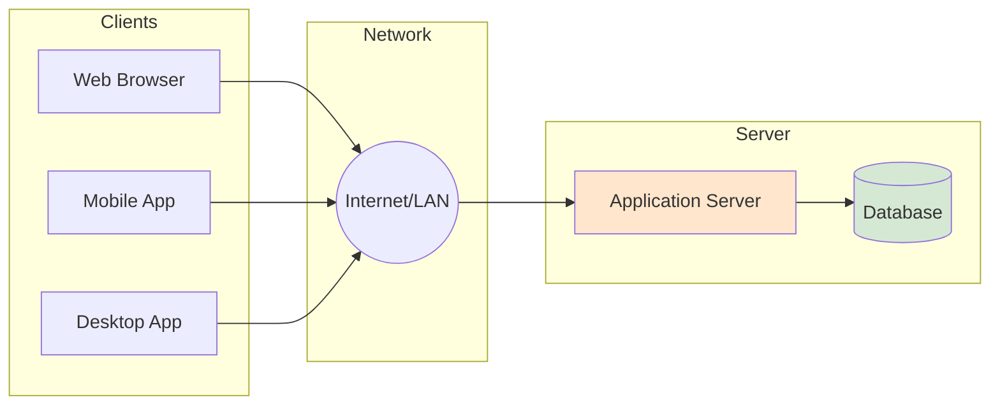
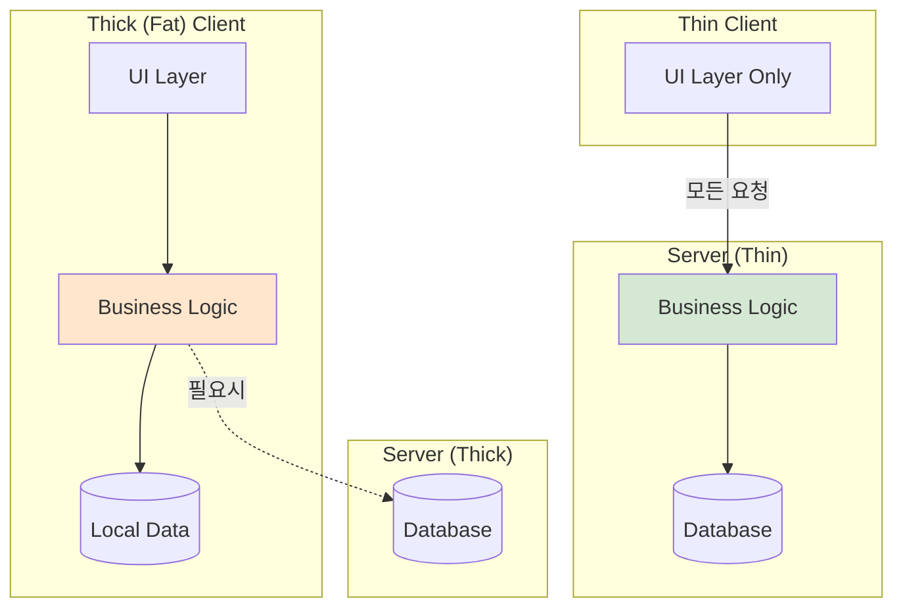
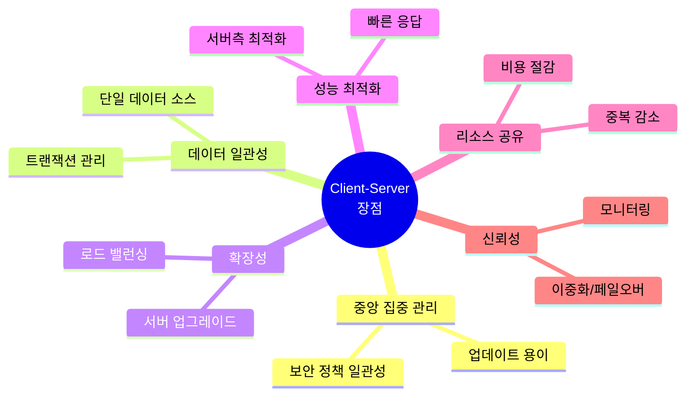
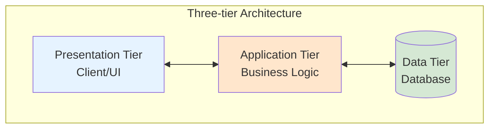
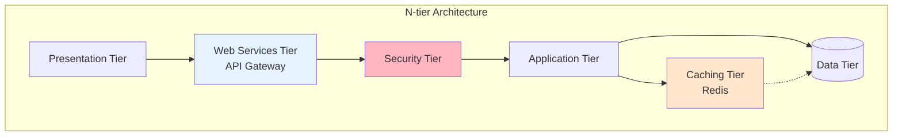
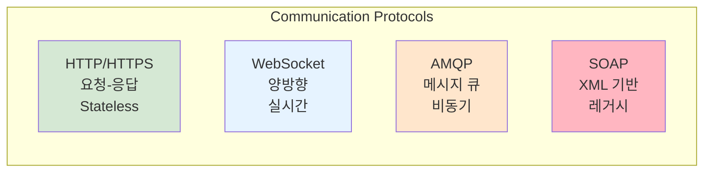
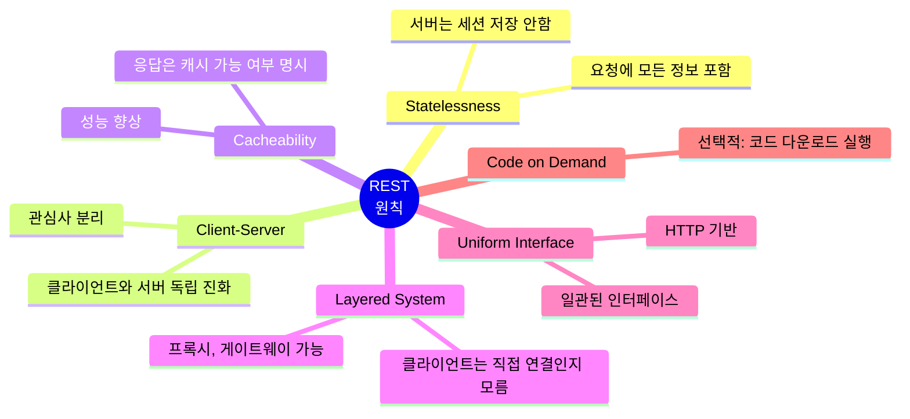
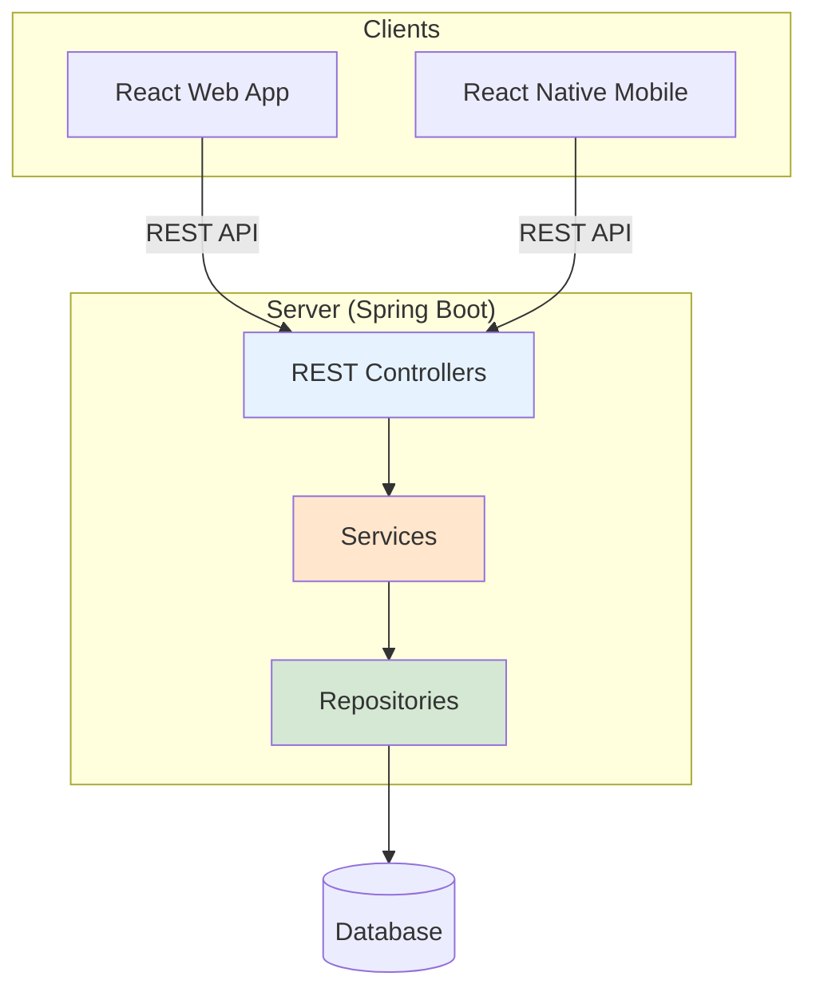
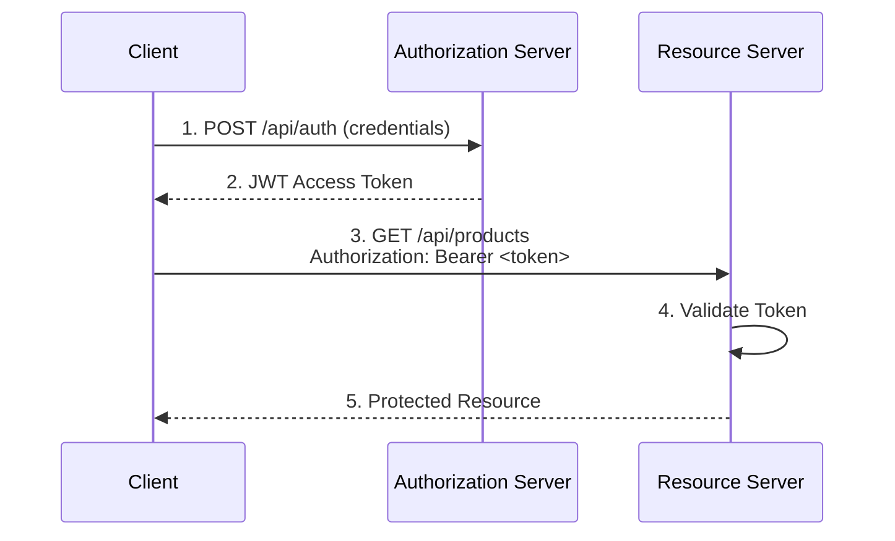

# Chapter 5: Client-Server Architecture

## 핵심 요약

> 클라이언트-서버 아키텍처는 작업을 클라이언트(요청자)와 서버(제공자)로 분리하여 분산 컴퓨팅의 근간을 이루는 아키텍처이다. 이 장에서는 클라이언트-서버 아키텍처의 정의, 구성 요소, 장단점, Two-tier/Three-tier/N-tier 모델 비교, REST 원칙과 RESTful API 설계, 그리고 Spring을 활용한 JWT 기반 토큰 인증 구현, OpenAPI 문서화, JaCoCo를 이용한 코드 커버리지 테스트를 다룬다.

---

## 학습 목표

이 장을 학습한 후 다음을 수행할 수 있어야 한다:

- [ ] 클라이언트-서버 아키텍처의 구성 요소와 장단점을 설명할 수 있다
- [ ] Two-tier, Three-tier, N-tier 아키텍처의 차이를 비교할 수 있다
- [ ] REST 원칙과 RESTful API 설계 베스트 프랙티스를 적용할 수 있다
- [ ] JWT를 사용한 토큰 기반 인증을 구현할 수 있다
- [ ] OpenAPI(Swagger)로 API를 문서화할 수 있다
- [ ] JaCoCo를 사용하여 코드 커버리지를 측정할 수 있다

---

## 본문 정리

### 1. 클라이언트-서버 아키텍처란?

#### 정의

클라이언트-서버 아키텍처는 작업을 **클라이언트(Client)**와 **서버(Server)**라는 두 개의 엔티티로 분리하는 분산 컴퓨팅 모델이다. 클라이언트는 요청을 시작하고, 서버는 리소스를 관리하고 요청을 처리한다.



> 💬 **비유**: 클라이언트-서버 아키텍처는 "레스토랑"과 같다. 손님(클라이언트)은 주문(요청)을 하고, 주방(서버)은 음식(데이터/서비스)을 준비하여 제공한다. 여러 손님이 동시에 주문해도 주방이 효율적으로 처리한다.

---

#### 핵심 구성 요소

| 구성 요소 | 역할 | 예시 |
|---------|------|------|
| **Client** | 사용자 인터페이스, 요청 전송, 응답 표시 | 웹 브라우저, 모바일 앱, 데스크톱 앱 |
| **Server** | 요청 처리, 데이터 관리, 비즈니스 로직 실행 | Web Server, Application Server, DB Server |
| **Network** | 클라이언트-서버 간 통신 매개체 | LAN, WAN, Internet |

---

#### Thick Client vs Thin Client



| 구분 | Thick (Fat) Client | Thin Client |
|------|-------------------|-------------|
| **처리 위치** | 클라이언트에서 대부분 처리 | 서버에서 대부분 처리 |
| **비즈니스 로직** | 클라이언트에 포함 | 서버에만 존재 |
| **데이터 저장** | 로컬 저장 가능 | 서버에만 저장 |
| **오프라인 동작** | 가능 | 불가능 (네트워크 필수) |
| **예시** | Salesforce Classic, 데스크톱 앱 | 웹 브라우저 앱, IoT 장치 |
| **적합 상황** | 오프라인 필요, 빠른 응답 | 중앙 집중 관리, 업데이트 용이 |

---

#### 클라이언트-서버 아키텍처의 장점



| 장점 | 설명 |
|------|------|
| **중앙 집중 관리** | 서버에서 리소스, 데이터, 서비스 통합 관리, 보안 정책 일관 적용 |
| **데이터 일관성** | 단일 DB 서버로 트랜잭션 관리, 데이터 무결성 보장 |
| **확장성** | 서버 하드웨어 업그레이드 또는 클러스터 추가로 확장 |
| **성능 최적화** | 서버측 전문 하드웨어/소프트웨어로 집중 처리 |
| **리소스 공유** | 파일, 애플리케이션, DB를 다중 클라이언트가 공유 |
| **신뢰성** | 이중화, 페일오버로 고가용성 보장 |

---

#### 클라이언트-서버 아키텍처의 단점

| 단점 | 설명 |
|------|------|
| **단일 장애점(SPOF)** | 서버 다운 시 전체 시스템 접근 불가 |
| **성능 병목** | 과다 접속 시 서버가 병목 지점 |
| **확장성 한계** | 수평 확장 시 복잡성과 비용 증가 |
| **지연(Latency)** | 클라이언트-서버 간 물리적 거리로 지연 발생 |
| **보안 취약점** | 중앙 서버가 사이버 공격의 주요 대상 |
| **유지보수** | 서버 유지보수/다운타임이 전체 클라이언트에 영향 |

---

### 2. 클라이언트-서버 아키텍처 유형

> **Note**: **Tier**는 물리적 분리(다른 서버/머신), **Layer**는 논리적 분리(코드 구조)를 의미한다.

#### 2.1 Two-tier Architecture

```mermaid
graph TB
    subgraph "Two-tier Architecture"
        CT[Client Tier<br/>UI + Business Logic<br/>(Fat Client)]
        DT[(Data Tier<br/>Database)]
    end

    CT <-->|Direct Access| DT

    style CT fill:#E6F3FF
    style DT fill:#D5E8D4
```

| 구성 | 역할 |
|------|------|
| **Client Tier** | UI + 비즈니스 로직 (Fat) 또는 UI만 (Thin) |
| **Data Tier** | 데이터베이스 관리 시스템 (DBMS) |

**특징**:
- 클라이언트가 DB에 직접 접근
- 소규모 애플리케이션에 적합
- 구현 단순, 빠른 개발

---

#### 2.2 Three-tier Architecture



| Tier | 역할 | 예시 |
|------|------|------|
| **Presentation Tier** | 사용자 인터페이스, 입출력 | Web Browser, Mobile App |
| **Application Tier** | 비즈니스 로직, 요청 처리 | Spring Boot, Node.js |
| **Data Tier** | 데이터 저장/조회 | PostgreSQL, MongoDB |

**특징**:
- 관심사 분리로 유지보수성 향상
- 중간 계층에서 보안 정책 적용
- 웹 애플리케이션, 엔터프라이즈 시스템에 적합

---

#### 2.3 N-tier Architecture



**추가 가능한 Tier**:
- **Web Services Tier**: API Gateway, 외부 서비스 통합
- **Security Tier**: 인증/인가, 접근 제어
- **Caching Tier**: Redis, Memcached로 성능 향상

---

#### 아키텍처 유형 비교

| 항목 | Two-tier | Three-tier | N-tier |
|------|----------|------------|--------|
| **확장성** | 제한적 | 양호 | 우수 |
| **성능** | 소규모에 빠름 | 균형적 | Tier별 최적화 가능 |
| **유지보수성** | 성장 시 어려움 | 양호 | 우수 |
| **재사용성** | 제한적 | 양호 (중간 계층) | 우수 |
| **보안** | 취약 (직접 DB 접근) | 양호 | 우수 (다층 보안) |
| **적합 상황** | 소규모, 단순 앱 | 중규모 웹 앱 | 대규모, 복잡한 시스템 |

---

### 3. 클라이언트-서버 통신 프로토콜

#### 주요 통신 프로토콜



| 프로토콜 | 특징 | 적합 상황 |
|---------|------|----------|
| **HTTP/HTTPS** | 요청-응답, Stateless, 웹 표준 | 일반 웹 애플리케이션, RESTful API |
| **WebSocket** | 양방향, 지속 연결, 실시간 | 채팅, 실시간 알림, 게임 |
| **AMQP** | 메시지 브로커 기반, 비동기 | 분산 시스템, 이벤트 기반 |
| **SOAP** | XML 형식, 엄격한 표준 | 레거시 시스템, 엔터프라이즈 통합 |

---

#### REST (Representational State Transfer)

REST는 네트워크 애플리케이션 설계를 위한 **아키텍처 스타일**이다. Roy Fielding의 박사 논문(2000)에서 정의되었다.

##### REST 6가지 원칙



| 원칙 | 설명 |
|------|------|
| **Statelessness** | 각 요청은 필요한 모든 정보를 포함, 서버는 클라이언트 상태 저장 안함 |
| **Client-Server** | 클라이언트와 서버는 독립적으로 진화 가능 |
| **Cacheability** | 응답은 캐시 가능/불가능 명시 |
| **Layered System** | 클라이언트는 중간 계층 존재 여부 알 수 없음 |
| **Uniform Interface** | HTTP 기반 일관된 인터페이스 사용 |
| **Code on Demand** | (선택) 실행 가능한 코드 전송 가능 |

---

#### RESTful API 설계 베스트 프랙티스

##### HTTP 메서드 사용

| 메서드 | 목적 | 예시 |
|--------|------|------|
| **GET** | 리소스 조회 | `GET /api/products/123` |
| **POST** | 리소스 생성 | `POST /api/products` |
| **PUT** | 리소스 전체 수정 | `PUT /api/products/123` |
| **PATCH** | 리소스 부분 수정 | `PATCH /api/products/123` |
| **DELETE** | 리소스 삭제 | `DELETE /api/products/123` |

##### URI 설계 규칙

```
✅ 좋은 예:
GET  /api/v1/products          # 상품 목록 조회
GET  /api/v1/products/123      # 특정 상품 조회
POST /api/v1/products          # 상품 생성
PUT  /api/v1/products/123      # 상품 수정

❌ 나쁜 예:
GET  /api/getProduct?id=123    # 동사 사용
POST /api/createProduct        # 동사 중복
GET  /api/product              # 단수형 사용
```

##### HTTP 상태 코드

| 코드 | 의미 | 사용 상황 |
|------|------|----------|
| **200 OK** | 성공 | GET, PUT, PATCH 성공 |
| **201 Created** | 생성됨 | POST로 리소스 생성 성공 |
| **204 No Content** | 내용 없음 | DELETE 성공 |
| **400 Bad Request** | 잘못된 요청 | 클라이언트 요청 오류 |
| **401 Unauthorized** | 인증 필요 | 인증 없이 접근 |
| **403 Forbidden** | 접근 금지 | 권한 없음 |
| **404 Not Found** | 찾을 수 없음 | 리소스 없음 |
| **500 Internal Server Error** | 서버 오류 | 서버 내부 에러 |

##### RESTful API 설계 체크리스트

1. **의미 있는 URI**: `/api/products/123` (명사, 복수형)
2. **버전 관리**: `/api/v1/products` (URI에 버전 포함)
3. **Stateless**: 모든 요청에 필요한 정보 포함
4. **HTTP 메서드 올바른 사용**: GET은 조회, POST는 생성
5. **적절한 상태 코드 반환**: 200, 201, 400, 404 등
6. **보안**: HTTPS 사용, 인증/인가 구현

---

### 4. 클라이언트-서버 애플리케이션 구현

#### 4.1 Online Auction 케이스 스터디 (계속)

**상황**: WX-Auction 회사의 모놀리식 애플리케이션이 성공하여 모바일 앱 버전 요구 발생.

**결정 사항**:
- 기존 모놀리식 비즈니스 로직 활용
- React (Web) + React Native (Mobile) 클라이언트 개발
- RESTful API로 클라이언트-서버 통신
- Three-tier 클라이언트-서버 아키텍처 채택



---

#### 4.2 모놀리식에서 클라이언트-서버로 리팩토링

##### Thymeleaf 제거

```xml
<!-- 제거할 의존성 -->
<!-- spring-boot-starter-thymeleaf -->
<!-- thymeleaf-layout-dialect -->
<!-- thymeleaf-extras-springsecurity6 -->
```

- `templates/` 및 `static/` 폴더 삭제
- View 관련 코드 제거

##### @Controller → @RestController 변경

```java
// Before: View 반환
@Controller
@RequestMapping("products")
public class ProductController {
    @GetMapping
    public String listProducts(Model model) {
        model.addAttribute("products", productService.getAllProducts());
        return "products";  // View 이름 반환
    }
}

// After: JSON 데이터 반환
@RestController  // @Controller + @ResponseBody
@RequestMapping("products")
public class ProductController {

    @Autowired
    private ProductService productService;

    @GetMapping
    public ResponseEntity<List<Product>> listProducts() {
        Optional<List<Product>> products = productService.getAllProducts();

        return products.isPresent()
            ? new ResponseEntity<>(products.get(), HttpStatus.OK)      // 200
            : new ResponseEntity<>(HttpStatus.NOT_FOUND);              // 404
    }

    @GetMapping("/{id}")
    public ResponseEntity<Product> getProduct(@PathVariable Integer id) {
        return productService.getProductById(id)
            .map(product -> ResponseEntity.ok(product))
            .orElse(ResponseEntity.notFound().build());
    }

    @PostMapping
    public ResponseEntity<Product> createProduct(@RequestBody Product product) {
        Product saved = productService.saveProduct(product);
        return ResponseEntity.status(HttpStatus.CREATED).body(saved);  // 201
    }
}
```

| 변경 사항 | 설명 |
|----------|------|
| `@RestController` | `@Controller` + `@ResponseBody` 결합 |
| `ResponseEntity` | HTTP 상태 코드, 헤더, 본문 제어 |
| `@RequestBody` | JSON 요청 본문을 객체로 변환 |
| `@PathVariable` | URI 경로 변수 바인딩 |

---

#### 4.3 JWT 토큰 기반 인증 구현

##### 토큰 기반 인증 흐름



##### JWT 구조

```
Header.Payload.Signature

┌─────────────────────────────────────────────────────────────┐
│ Header: {"alg": "HS256", "typ": "JWT"}                      │
├─────────────────────────────────────────────────────────────┤
│ Payload: {"sub": "user", "roles": ["USER"], "exp": ...}     │
├─────────────────────────────────────────────────────────────┤
│ Signature: HMACSHA256(base64(header) + "." + base64(payload)│
│            , secret)                                         │
└─────────────────────────────────────────────────────────────┘
```

##### JWT 구현

**1. 의존성 추가**:
```xml
<dependency>
    <groupId>io.jsonwebtoken</groupId>
    <artifactId>jjwt</artifactId>
    <version>0.12.5</version>
</dependency>
```

**2. application.properties**:
```properties
security.jwt.secret-key=your_256_bit_secret_key_here
security.jwt.expiration-time=86400000  # 24시간 (밀리초)
```

**3. JwtService 클래스**:
```java
@Service
public class JwtService {

    @Value("${security.jwt.secret-key}")
    private String secretKey;

    @Value("${security.jwt.expiration-time}")
    private long jwtExpiration;

    // 토큰 생성
    public String generateToken(UserDetails userDetails) {
        Map<String, Object> claims = new HashMap<>();

        // 역할 정보를 claims에 추가
        List<String> roles = userDetails.getAuthorities().stream()
            .map(GrantedAuthority::getAuthority)
            .collect(Collectors.toList());
        claims.put("roles", roles);

        return createToken(claims, userDetails.getUsername());
    }

    private String createToken(Map<String, Object> claims, String subject) {
        return Jwts.builder()
            .setClaims(claims)
            .setSubject(subject)  // 사용자명
            .setIssuedAt(new Date(System.currentTimeMillis()))  // 발행 시간
            .setExpiration(new Date(System.currentTimeMillis() + jwtExpiration))  // 만료 시간
            .signWith(SignatureAlgorithm.HS256, secretKey)  // 서명
            .compact();
    }

    // 토큰에서 사용자명 추출
    public String extractUsername(String token) {
        return extractClaim(token, Claims::getSubject);
    }

    // 토큰 유효성 검사
    public boolean isTokenValid(String token, UserDetails userDetails) {
        final String username = extractUsername(token);
        return username.equals(userDetails.getUsername()) && !isTokenExpired(token);
    }
}
```

**4. JwtAuthenticationFilter**:
```java
@Component
public class JwtAuthenticationFilter extends OncePerRequestFilter {

    @Autowired
    private JwtService jwtService;

    @Autowired
    private UserDetailsService userDetailsService;

    @Override
    protected void doFilterInternal(HttpServletRequest request,
                                    HttpServletResponse response,
                                    FilterChain filterChain)
            throws ServletException, IOException {

        // Authorization 헤더에서 토큰 추출
        final String authHeader = request.getHeader("Authorization");

        if (authHeader == null || !authHeader.startsWith("Bearer ")) {
            filterChain.doFilter(request, response);
            return;
        }

        final String jwt = authHeader.substring(7);  // "Bearer " 제거
        final String username = jwtService.extractUsername(jwt);

        // 토큰 검증 및 인증 설정
        if (username != null && SecurityContextHolder.getContext().getAuthentication() == null) {
            UserDetails userDetails = userDetailsService.loadUserByUsername(username);

            if (jwtService.isTokenValid(jwt, userDetails)) {
                UsernamePasswordAuthenticationToken authToken =
                    new UsernamePasswordAuthenticationToken(
                        userDetails, null, userDetails.getAuthorities());

                SecurityContextHolder.getContext().setAuthentication(authToken);
            }
        }

        filterChain.doFilter(request, response);
    }
}
```

**5. Security 설정**:
```java
@Configuration
@EnableWebSecurity
public class SecurityConfiguration {

    @Autowired
    private JwtAuthenticationFilter jwtAuthenticationFilter;

    @Autowired
    private UserDetailsService userDetailsService;

    @Bean
    public SecurityFilterChain securityFilterChain(HttpSecurity http) throws Exception {
        http
            // CSRF 비활성화 (Stateless API)
            .csrf(csrf -> csrf.disable())
            // CORS 설정
            .cors(cors -> cors.configurationSource(corsConfigurationSource()))
            // 요청 인가 설정
            .authorizeHttpRequests(authorize -> authorize
                .requestMatchers("/api/auth").permitAll()  // 인증 없이 접근 가능
                .anyRequest().authenticated()              // 나머지는 인증 필요
            )
            // 세션 관리: Stateless
            .sessionManagement(session -> session
                .sessionCreationPolicy(SessionCreationPolicy.STATELESS)
            )
            // 인증 프로바이더
            .authenticationProvider(authenticationProvider())
            // JWT 필터 추가
            .addFilterBefore(jwtAuthenticationFilter,
                UsernamePasswordAuthenticationFilter.class);

        return http.build();
    }

    @Bean
    public AuthenticationProvider authenticationProvider() {
        DaoAuthenticationProvider authProvider = new DaoAuthenticationProvider();
        authProvider.setUserDetailsService(userDetailsService);
        authProvider.setPasswordEncoder(passwordEncoder());
        return authProvider;
    }

    @Bean
    public PasswordEncoder passwordEncoder() {
        return new BCryptPasswordEncoder();
    }
}
```

**6. AuthenticationController**:
```java
@RestController
@RequestMapping("/api/auth")
public class AuthenticationController {

    @Autowired
    private AuthenticationManager authenticationManager;

    @Autowired
    private UserDetailsService userDetailsService;

    @Autowired
    private JwtService jwtService;

    @PostMapping
    public ResponseEntity<AuthenticationResponse> authenticate(
            @RequestBody AuthenticationRequest request) {

        // 인증 수행
        authenticationManager.authenticate(
            new UsernamePasswordAuthenticationToken(
                request.getUsername(),
                request.getPassword()
            )
        );

        // 사용자 정보 로드 및 토큰 생성
        UserDetails userDetails = userDetailsService
            .loadUserByUsername(request.getUsername());
        String token = jwtService.generateToken(userDetails);

        return ResponseEntity.ok(new AuthenticationResponse(token));
    }
}
```

---

#### 4.4 OpenAPI(Swagger) 문서화

```xml
<!-- 의존성 추가 -->
<dependency>
    <groupId>org.springdoc</groupId>
    <artifactId>springdoc-openapi-starter-webmvc-ui</artifactId>
    <version>2.5.0</version>
</dependency>
```

```java
@Configuration
@OpenAPIDefinition(
    info = @Info(
        title = "API Documentation - Online Auction",
        version = "1.0"
    ),
    security = @SecurityRequirement(name = "bearerAuth")
)
@SecurityScheme(
    name = "bearerAuth",
    type = SecuritySchemeType.HTTP,
    scheme = "bearer",
    bearerFormat = "JWT"
)
public class OpenApiConfiguration {
}
```

**Swagger UI 접근**: `http://localhost:8080/swagger-ui/index.html`

---

### 5. 코드 커버리지 테스트

#### JaCoCo 설정

```xml
<plugin>
    <groupId>org.jacoco</groupId>
    <artifactId>jacoco-maven-plugin</artifactId>
    <version>0.8.12</version>
    <executions>
        <execution>
            <goals>
                <goal>prepare-agent</goal>
            </goals>
        </execution>
        <execution>
            <id>report</id>
            <phase>verify</phase>
            <goals>
                <goal>report</goal>
            </goals>
        </execution>
    </executions>
</plugin>
```

**실행 명령어**:
```bash
mvn clean verify
```

**리포트 위치**: `target/site/jacoco/index.html`

#### 코드 커버리지 메트릭

| 메트릭 | 설명 |
|--------|------|
| **Missed Instructions** | 테스트되지 않은 명령어 수 |
| **Missed Branches** | 테스트되지 않은 분기 수 (if/else) |
| **Missed Lines** | 테스트되지 않은 코드 라인 수 |
| **Missed Methods** | 테스트되지 않은 메서드 수 |
| **Missed Classes** | 테스트되지 않은 클래스 수 |

---

## 심화 학습

### Basic Auth vs Token-based Auth

| 항목 | Basic Authentication | Token-based (JWT) |
|------|---------------------|-------------------|
| **자격 증명 전송** | 매 요청마다 전송 | 최초 인증 시 1회 |
| **상태 관리** | Stateless (서버 저장 없음) | Stateless |
| **보안** | Base64 인코딩 (암호화 아님) | 서명된 토큰 |
| **확장성** | 단순 | 분산 시스템에 적합 |
| **권한 정보** | 포함 불가 | Payload에 포함 가능 |
| **만료 관리** | 없음 | 토큰 만료 시간 설정 |

### Richardson Maturity Model

RESTful API의 성숙도를 평가하는 모델:

| Level | 설명 |
|-------|------|
| **Level 0** | HTTP를 터널로 사용 (단일 URI, POST만 사용) |
| **Level 1** | 리소스 개념 도입 (여러 URI) |
| **Level 2** | HTTP 메서드 활용 (GET, POST, PUT, DELETE) |
| **Level 3** | HATEOAS (Hypermedia as the Engine of Application State) |

### 추가 참고 자료

- [Spring Security Reference](https://docs.spring.io/spring-security/reference/)
- [JWT.io](https://jwt.io/) - JWT 디버거/검증
- [SpringDoc OpenAPI](https://springdoc.org/)
- [Richardson Maturity Model](https://martinfowler.com/articles/richardsonMaturityModel.html)

---

## 실무 적용 포인트

### 이런 상황에서 클라이언트-서버를 선택하세요

- **다중 클라이언트**: 웹 + 모바일 + 데스크톱 동시 지원
- **API 제공**: 외부 시스템 연동, Open API 제공
- **확장 필요**: 사용자 증가 예상, 스케일 아웃 필요
- **클라이언트 독립 업데이트**: 서버 변경 없이 UI 업데이트

### 주의할 점 / 흔한 실수

- ⚠️ **CORS 설정 누락**: 클라이언트-서버 도메인 다를 때 필수
- ⚠️ **JWT Secret 노출**: 환경 변수로 관리, Git에 커밋 금지
- ⚠️ **토큰 만료 미처리**: Refresh Token 전략 수립
- ⚠️ **Stateless 원칙 위반**: 서버에 세션 저장 시 확장성 저하
- ⚠️ **API 버전 관리 누락**: `/api/v1/` 형식으로 버전 관리
- ⚠️ **적절한 HTTP 상태 코드 미사용**: 200만 반환하지 않기

### 면접에서 나올 수 있는 질문

- **Q: 클라이언트-서버 아키텍처란?**
  - 작업을 클라이언트(요청자)와 서버(제공자)로 분리하는 분산 컴퓨팅 모델

- **Q: Thick Client와 Thin Client의 차이는?**
  - Thick: 클라이언트에서 비즈니스 로직 처리, 오프라인 가능
  - Thin: 서버에서 모든 처리, 네트워크 필수

- **Q: REST 원칙을 설명해주세요.**
  - Statelessness, Client-Server, Cacheability, Layered System, Uniform Interface

- **Q: JWT의 구조는?**
  - Header (알고리즘, 타입) + Payload (Claims) + Signature (서명)

- **Q: Token-based Auth가 Basic Auth보다 나은 이유는?**
  - 매 요청마다 자격 증명 전송 불필요, 권한 정보 포함 가능, 분산 시스템에 적합

---

## 핵심 개념 체크리스트

| 개념 | 이해 | 적용 가능 |
|------|:----:|:--------:|
| 클라이언트-서버 아키텍처 정의 | [ ] | [ ] |
| Client, Server, Network 역할 | [ ] | [ ] |
| Thick vs Thin Client | [ ] | [ ] |
| 클라이언트-서버 장단점 | [ ] | [ ] |
| Two-tier Architecture | [ ] | [ ] |
| Three-tier Architecture | [ ] | [ ] |
| N-tier Architecture | [ ] | [ ] |
| HTTP/HTTPS, WebSocket, AMQP | [ ] | [ ] |
| REST 6가지 원칙 | [ ] | [ ] |
| RESTful API 설계 | [ ] | [ ] |
| HTTP 메서드 (GET, POST, PUT, DELETE) | [ ] | [ ] |
| HTTP 상태 코드 | [ ] | [ ] |
| @RestController vs @Controller | [ ] | [ ] |
| ResponseEntity 사용 | [ ] | [ ] |
| JWT 구조 (Header, Payload, Signature) | [ ] | [ ] |
| JWT 토큰 생성/검증 | [ ] | [ ] |
| JwtAuthenticationFilter 구현 | [ ] | [ ] |
| Spring Security Stateless 설정 | [ ] | [ ] |
| OpenAPI/Swagger 문서화 | [ ] | [ ] |
| JaCoCo 코드 커버리지 | [ ] | [ ] |

---

## 참고 자료

- [GitHub 코드 예제](https://github.com/PacktPublishing/Software-Architecture-with-Spring/tree/main/ch5)
- [Spring Security JWT Guide](https://spring.io/guides/tutorials/spring-boot-oauth2/)
- [JWT.io - JWT Debugger](https://jwt.io/)
- [SpringDoc OpenAPI Documentation](https://springdoc.org/)
- [Richardson Maturity Model - Martin Fowler](https://martinfowler.com/articles/richardsonMaturityModel.html)
- [HMAC Generator Tool](https://appdevtools.com/hmac-generator)
