# Chapter 6: Microservices Architecture

---

## 📌 핵심 요약

> 이 장에서는 마이크로서비스 아키텍처(Microservices Architecture)의 핵심 특성인 **자율성(Autonomy)**과 **전문화(Specialization)**를 다루며, 클라이언트-서버 애플리케이션을 마이크로서비스로 전환하는 과정을 실습합니다. DDD(Domain-Driven Design)를 통한 바운디드 컨텍스트 식별, CAP 정리 기반 데이터베이스 선택, 클린 아키텍처 구현, RestClient를 활용한 동기 통신, Spring Boot Actuator를 이용한 모니터링, Docker를 통한 컨테이너화까지 마이크로서비스 전환의 전 과정을 학습합니다.

---

## 🎯 학습 목표

이 내용을 읽고 나면:
- [ ] 마이크로서비스의 핵심 특성(자율성, 전문화)을 설명할 수 있다
- [ ] DDD의 바운디드 컨텍스트를 활용하여 서비스 경계를 정의할 수 있다
- [ ] CAP 정리를 기반으로 각 마이크로서비스에 적합한 데이터베이스를 선택할 수 있다
- [ ] 클린 아키텍처 원칙을 마이크로서비스에 적용할 수 있다
- [ ] RestClient를 사용하여 마이크로서비스 간 동기 통신을 구현할 수 있다
- [ ] Spring Boot Actuator로 마이크로서비스를 모니터링할 수 있다
- [ ] Docker와 Docker Compose로 마이크로서비스를 컨테이너화할 수 있다

---

## 📖 본문 정리

### 1. 마이크로서비스 아키텍처 소개

마이크로서비스 아키텍처는 애플리케이션을 작고 자율적인 서비스들로 구성하는 접근 방식입니다. 각 서비스는 특정 비즈니스 기능을 수행하며, 독립적으로 개발, 배포, 확장할 수 있습니다.

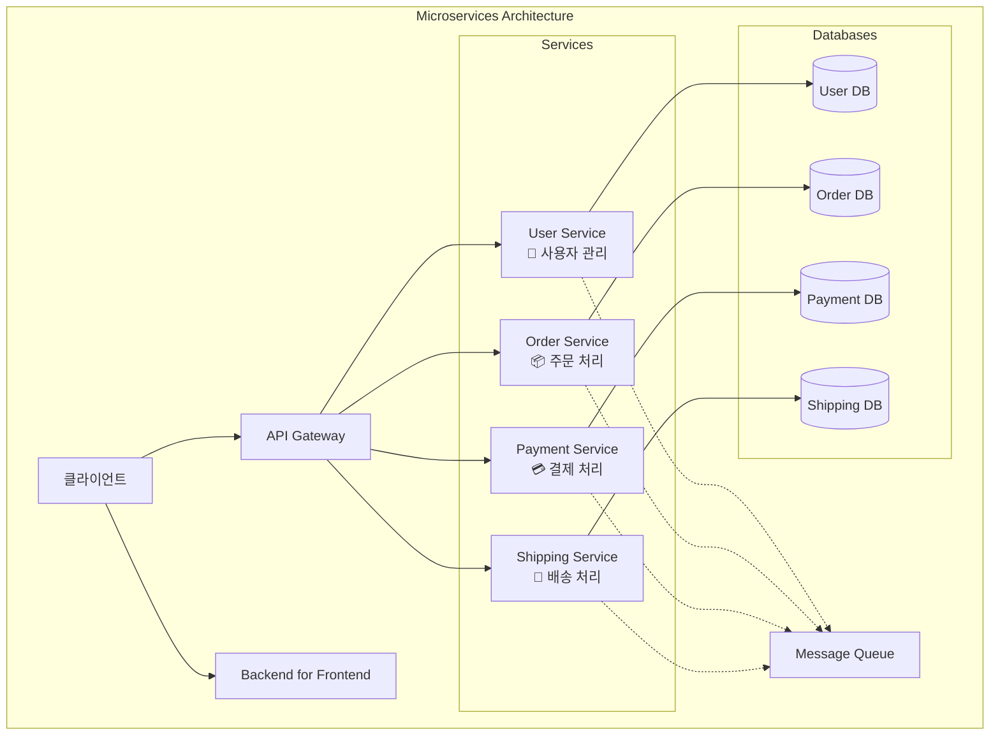

#### 핵심 구성 요소

| 구성 요소 | 역할 | 특징 |
|----------|------|------|
| **API Gateway** | API 프론트엔드 역할, 요청 라우팅 | 단일 진입점, 인증/인가 처리 |
| **BFF (Backend for Frontend)** | 특정 프론트엔드 전용 서비스 | 클라이언트별 최적화된 API 제공 |
| **Individual Services** | 특정 비즈니스 기능 수행 | 독립적 배포, 자체 데이터베이스 |
| **Message Queue** | 비동기 통신 지원 | 서비스 간 느슨한 결합 |

---

### 2. 마이크로서비스의 핵심 특성: 자율성과 전문화

> 💬 **핵심 키워드**: 마이크로서비스를 개발할 때 항상 기억해야 할 두 단어는 **자율성(Autonomy)**과 **전문화(Specialization)**입니다.

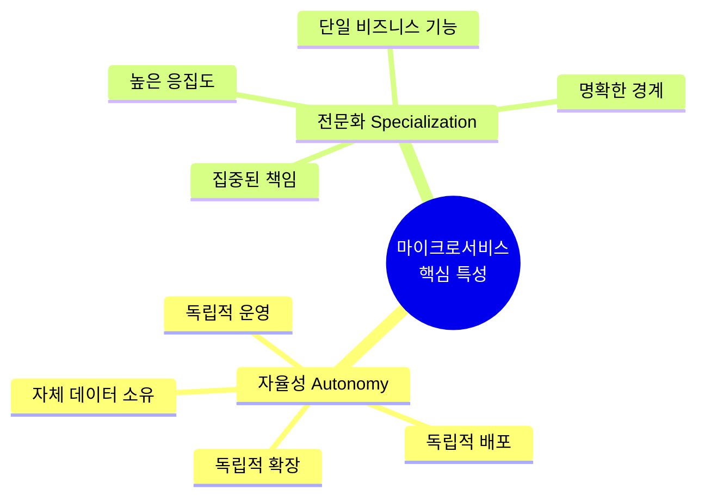

#### 자율적이고 전문화된 마이크로서비스 구축 기법

| 기법 | 설명 | 적용 방법 |
|------|------|----------|
| **SRP (단일 책임 원칙)** | 하나의 변경 이유만 가짐 | 서비스별 단일 비즈니스 기능 담당 |
| **DDD (도메인 주도 설계)** | 바운디드 컨텍스트 정의 | 비즈니스 도메인 기반 서비스 분리 |
| **별도 코드베이스** | 독립적인 코드 저장소 | 서비스별 Git 리포지토리 운영 |
| **별도 데이터 저장소** | 데이터 독립성 보장 | 서비스별 전용 데이터베이스 |
| **전문화된 API** | 비즈니스 규칙 중심 API | CRUD보다 도메인 특화 연산 |
| **CI/CD** | 자동화된 테스트/배포 | Jenkins, Docker 활용 |

---

### 3. 마이크로서비스의 장단점

#### 장점

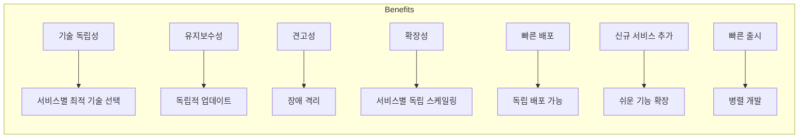

#### 단점

| 단점 | 설명 | 대응 전략 |
|------|------|----------|
| **데이터 관리** | 분산 트랜잭션의 복잡성 | SAGA, 2PC 패턴, 이벤트 기반 일관성 |
| **배포 복잡성** | 다수 서비스 관리 부담 | 강력한 DevOps 문화, K8s 활용 |
| **서비스 간 통신** | 네트워크 지연, 신뢰성 | Circuit Breaker, 재시도, 타임아웃 |
| **비용** | 인프라, 운영 비용 증가 | 비용 관리 전략 수립 |
| **리포트 생성** | 분산 데이터 집계 어려움 | CQRS, 데이터 웨어하우스 |
| **모니터링/로깅** | 분산 로그 상관관계 추적 | 중앙 집중식 로깅, 분산 추적 |
| **디버깅** | 서비스 경계 간 이슈 추적 | 상관관계 ID, 분산 추적 도구 |

---

### 4. DDD를 활용한 마이크로서비스 전환

#### DDD 핵심 개념

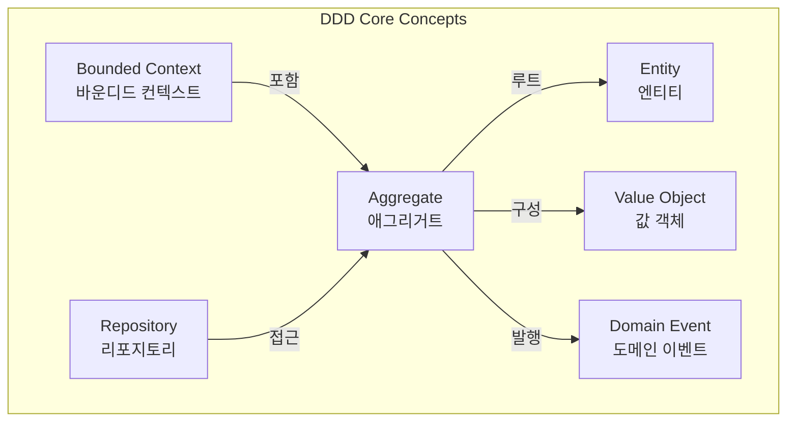

| DDD 개념 | 설명 | 마이크로서비스 적용 |
|----------|------|-------------------|
| **Bounded Context** | 특정 모델이 적용되는 경계 | 마이크로서비스 단위로 매핑 |
| **Entity** | 고유 식별자를 가진 객체 | 핵심 도메인 객체 |
| **Value Object** | 불변, 식별자 없음 | 속성 그룹화 |
| **Aggregate** | 관련 엔티티/값객체 그룹 | 트랜잭션 경계 |
| **Domain Event** | 비즈니스 이벤트 | 서비스 간 통신, 이벤트 기반 연동 |
| **Repository** | 데이터 접근 추상화 | 데이터 독립성 유지 |

#### 온라인 경매 애플리케이션의 바운디드 컨텍스트

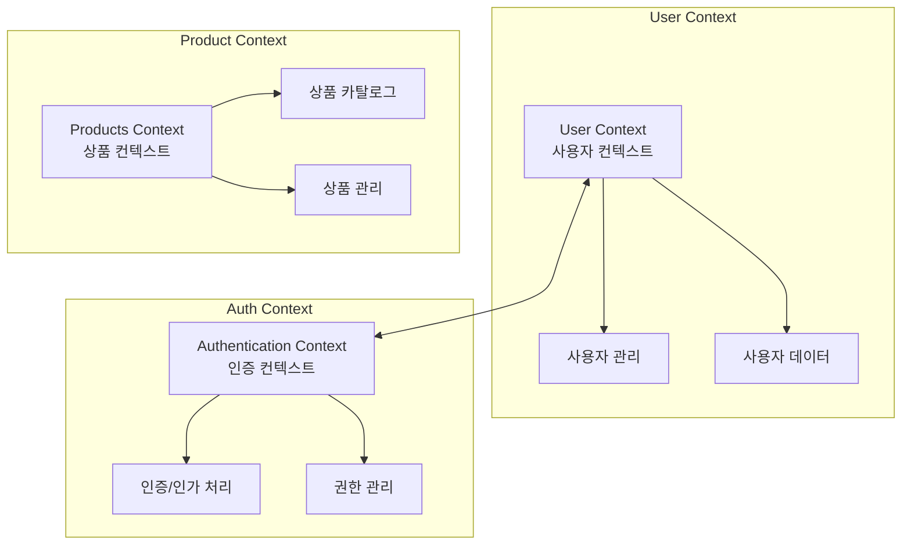

---

### 5. CAP 정리 기반 데이터베이스 선택

CAP 정리: 분산 시스템에서 **일관성(Consistency)**, **가용성(Availability)**, **분할 내성(Partition Tolerance)** 중 동시에 두 가지만 보장 가능

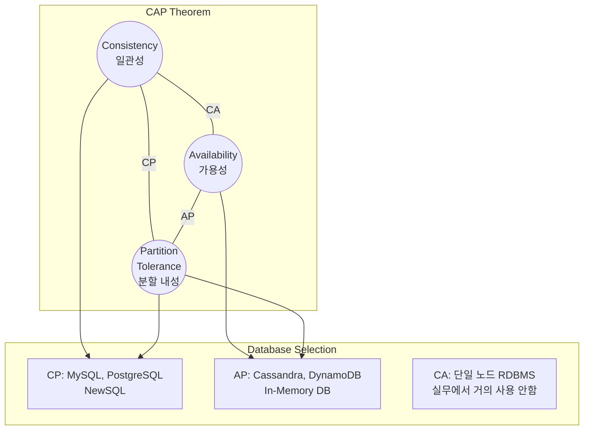

#### 마이크로서비스별 데이터베이스 선택

| 서비스 | 요구사항 | CAP 우선순위 | 권장 DB |
|--------|----------|-------------|---------|
| **User Service** | 강한 일관성, 트랜잭션 무결성 | CP | PostgreSQL, MySQL, NewSQL |
| **Authentication Service** | 고가용성, 낮은 지연시간 | AP | Redis (세션/토큰), NoSQL |
| **Product Service** | 일관성, 복잡한 쿼리 | CP | PostgreSQL, MySQL, NewSQL |

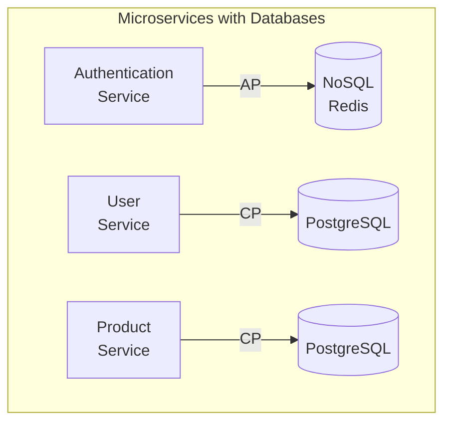

---

### 6. 수직 팀 구조 (Vertical Team Structure)

#### 수평 vs 수직 팀 구조

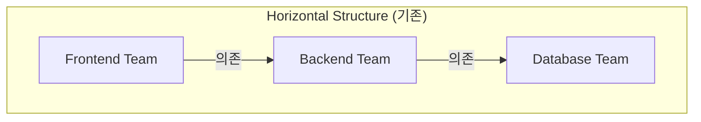

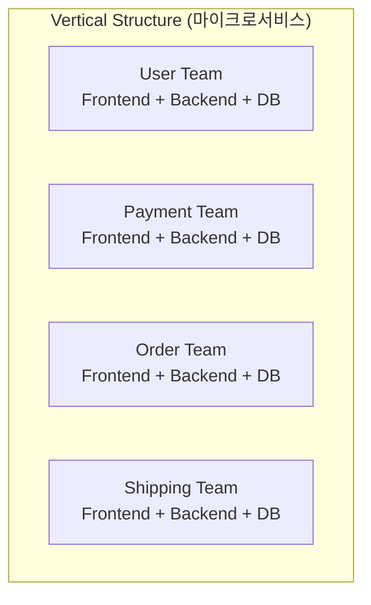

| 비교 항목 | 수평 구조 | 수직 구조 |
|----------|----------|----------|
| **팀 구성** | 기술 레이어별 | 비즈니스 기능별 |
| **의존성** | 팀 간 높은 의존성 | 독립적 운영 |
| **의사결정** | 여러 팀 조율 필요 | 팀 내 신속한 결정 |
| **배포** | 조율된 배포 | 독립적 배포 |
| **책임** | 분산된 책임 | 명확한 소유권 |

---

### 7. 클린 아키텍처 (Clean Architecture)

클린 아키텍처는 비즈니스 중심의 유지보수성 높은 코드를 만들기 위한 가이드라인으로, 프레임워크와 데이터베이스로부터 독립적입니다.

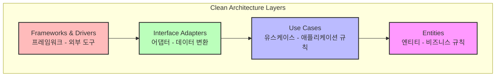

> 💬 **의존성 규칙(Dependency Rule)**: 상위 레이어(Entity)는 절대 하위 레이어(Use Case, Interface Adapter)를 알아서는 안 됩니다. 의존성은 항상 안쪽(고수준)을 향합니다.

#### 프로젝트 구조

```
authentication-services/
├── internal/                    # 비즈니스 규칙 (내부)
│   ├── entities/               # 엔티티 레이어 (POJO)
│   │   └── Authentication.java
│   ├── usecases/               # 유스케이스 레이어
│   │   └── GenerateTokenUseCase.java
│   └── repositories/           # 리포지토리 인터페이스
│       ├── UserRepository.java
│       └── TokenRepository.java
├── adapter/                     # 인터페이스 어댑터
│   ├── datasources/            # 데이터 소스 구현체
│   │   ├── UserRestApi.java
│   │   └── TokenJwt.java
│   └── transportlayers/        # 컨트롤러 (입력)
│       └── AuthenticationController.java
└── config/                      # 설정
    └── usecases/
        └── UseCaseConfiguration.java
```

#### 엔티티 레이어 (Entity Layer)

```java
// internal/entities/Authentication.java
// 순수 POJO - 외부 프레임워크 어노테이션 사용 금지
public class Authentication {
    private Long id;
    private String username;
    private String password;

    // Getter, Setter (Lombok 사용 금지)
    public Long getId() { return id; }
    public void setId(Long id) { this.id = id; }
    // ...
}
```

#### 유스케이스 레이어 (Use Case Layer)

```java
// internal/usecases/GenerateTokenUseCase.java
package com.packtpub.authenticationservices.internal.usecase;

public class GenerateTokenUseCase {
    // 리포지토리 인터페이스를 통한 의존성 역전
    private final AuthenticationManagerRepository authenticationManagerRepository;
    private final UserRepository userRepository;
    private final TokenRepository tokenRepository;

    public GenerateTokenUseCase(
            AuthenticationManagerRepository authenticationManagerRepository,
            UserRepository userRepository,
            TokenRepository tokenRepository) {
        this.authenticationManagerRepository = authenticationManagerRepository;
        this.userRepository = userRepository;
        this.tokenRepository = tokenRepository;
    }

    // 단일 메서드 - 하나의 유스케이스, 하나의 책임
    public Optional<String> execute(String username, String password) {
        // 인증 처리
        Optional<Authentication> authentication =
            authenticationManagerRepository.authenticate(username, password);

        if (authentication.isPresent()) {
            // userRepository - REST API인지 DB인지 비즈니스 로직은 모름
            authentication.get().setRoles(
                userRepository.getRolesByUsername(username));
            // 토큰 생성
            return Optional.of(tokenRepository.generateToken(authentication.get()));
        }
        return Optional.empty();
    }
}
```

#### 인터페이스 어댑터 레이어 (Interface Adapter Layer)

```java
// adapter/datasources/UserRestApi.java
// 데이터소스가 리포지토리 인터페이스 구현
@Service
public class UserRestApi implements UserRepository {
    private final RestClient restClient;

    @Override
    public List<Role> getRolesByUsername(String username) {
        RoleResponse result = restClient
            .get()
            .uri("/v1/users/{username}/roles", username)
            .retrieve()
            .body(RoleResponse.class);
        return result.getRoles();
    }
}
```

```java
// adapter/transportlayers/AuthenticationController.java
// 컨트롤러가 유스케이스를 호출
@RestController
@RequestMapping("/api/auth")
public class AuthenticationController {
    private final GenerateTokenUseCase generateTokenUseCase;

    @PostMapping
    public ResponseEntity<AuthenticationResponse> createAuthenticationToken(
            @RequestBody AuthenticationRequest authenticationRequest) {

        // 유스케이스 실행
        final Optional<String> token = generateTokenUseCase.execute(
            authenticationRequest.getUsername(),
            authenticationRequest.getPassword());

        return token.map(t -> ResponseEntity.ok(new AuthenticationResponse(t)))
                   .orElse(ResponseEntity.status(HttpStatus.UNAUTHORIZED).build());
    }
}
```

#### 의존성 주입 설정

```java
// config/usecases/UseCaseConfiguration.java
@Configuration
public class UseCaseConfiguration {

    @Bean
    public GenerateTokenUseCase generateTokenUseCase(
            UserRestApi userRestApiGateway,      // 구현체
            AuthenticationManager authenticationManager,
            TokenJwt tokenJwt) {
        // 의존성 역전 원칙 적용
        return new GenerateTokenUseCase(
            authenticationManager,
            userRestApiGateway,  // UserRepository 구현체
            tokenJwt);           // TokenRepository 구현체
    }
}
```

---

### 8. 동기 통신 (Synchronous Communication)

#### RestClient를 이용한 동기 통신

Spring Framework 팀이 권장하는 현대적인 동기 HTTP 클라이언트입니다.

```java
// RestClient 인스턴스 생성
RestClient restClient = RestClient.create();

// 또는 빌더를 통한 설정
RestClient restClient = RestClient.builder()
    .baseUrl("http://user-service:8081")
    .defaultHeader(HttpHeaders.CONTENT_TYPE, MediaType.APPLICATION_JSON_VALUE)
    .build();
```

#### GET 요청

```java
// 사용자 역할 조회
RoleResponse result = restClient
    .get()
    .uri(userServiceUrl + "/v1/users/{username}/roles", username)
    .retrieve()
    .body(RoleResponse.class);
```

#### POST 요청

```java
// 사용자 생성
ResponseEntity<Void> response = restClient.post()
    .uri("/v1/users")
    .contentType(MediaType.APPLICATION_JSON)
    .body(user)
    .retrieve()
    .toBodilessEntity();
```

#### 예외 처리

```java
// 커스텀 예외 처리
Boolean result = restClient.get()
    .uri(authenticationServiceUrl + "/v1/api/auth/validate?token={token}", token)
    .retrieve()
    .onStatus(HttpStatusCode::is5xxServerError, (request, response) -> {
        throw new MyCustomException(
            response.getStatusCode().toString(),
            response.getStatusText());
    })
    .body(Boolean.class);
```

#### 동기 통신의 장단점

| 장점 | 단점 |
|------|------|
| 구현이 간단하고 직관적 | 네트워크 지연이 성능에 영향 |
| 실시간 상호작용에 적합 | 확장성 병목 가능 |
| 예측 가능한 워크플로우 | 장애 전파 위험 |

#### 마이크로서비스 간 결합 유형

| 결합 유형 | 설명 | 문제점 |
|----------|------|--------|
| **시간적 결합 (Temporal)** | 서비스 가용성/타이밍 의존 | 연쇄 장애, 지연 |
| **공유 DB 결합** | 동일 스키마 직접 접근 | DB 변경 시 모든 서비스 수정 |
| **배포 결합** | 함께 배포/스케일링 | 독립 배포 불가 |

#### 결합도 줄이기 전략

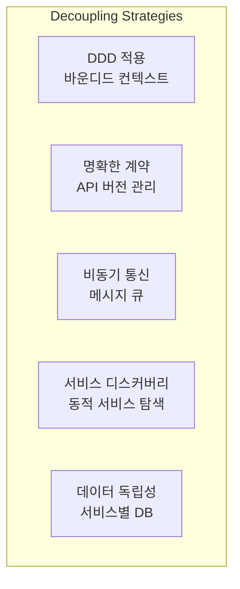

---

### 9. Spring Boot Actuator를 이용한 모니터링

#### 의존성 추가

```xml
<dependency>
    <groupId>org.springframework.boot</groupId>
    <artifactId>spring-boot-starter-actuator</artifactId>
</dependency>
```

#### 보안 설정

```java
@Configuration
@EnableWebSecurity
public class SecurityConfiguration {
    @Bean
    public SecurityFilterChain filterChain(HttpSecurity http) throws Exception {
        return http
            .authorizeHttpRequests(authorize -> authorize
                .requestMatchers("/api/auth", "/swagger-ui/**", "/v3/api-docs/**").permitAll()
                .requestMatchers("/actuator/**").hasRole("ADMIN")  // ADMIN만 접근
                .anyRequest().authenticated())
            .build();
    }
}
```

#### 주요 Actuator 엔드포인트

| 엔드포인트 | 용도 |
|-----------|------|
| `/actuator/health` | 애플리케이션 상태 (UP/DOWN) |
| `/actuator/info` | 애플리케이션 정보 |
| `/actuator/metrics` | 메모리, GC 등 성능 메트릭 |
| `/actuator/loggers` | 런타임 로깅 레벨 조회/변경 |
| `/actuator/threaddump` | JVM 스레드 덤프 |
| `/actuator/httptrace` | HTTP 요청 추적 |
| `/actuator/env` | 환경 속성 |
| `/actuator/beans` | Spring Bean 목록 |
| `/actuator/mappings` | @RequestMapping 경로 |

#### 엔드포인트 노출 설정

```properties
# application.properties
# 특정 엔드포인트만 노출
management.endpoints.web.exposure.include=health,metrics,info

# 모든 엔드포인트 노출
management.endpoints.web.exposure.include=*
```

---

### 10. Docker를 이용한 컨테이너화

#### 기본 Dockerfile

```dockerfile
FROM openjdk:21-jdk-slim
COPY target/authorization-service.jar authorization-service.jar
ENTRYPOINT ["java", "-jar", "authorization-service.jar"]
```

#### 멀티 스테이지 빌드 Dockerfile

```dockerfile
# Stage 1: 빌드 스테이지
FROM maven:3.9.7-eclipse-temurin-21-alpine AS builder
WORKDIR /app
COPY pom.xml .
COPY src ./src
RUN mvn clean package

# Stage 2: 런타임 스테이지
FROM openjdk:21-jdk-slim
WORKDIR /app
COPY --from=builder /app/target/authentication-services*.jar ./authentication-services.jar
EXPOSE 8080
ENTRYPOINT ["java", "-jar", "authentication-services.jar"]
```

> 💬 **멀티 스테이지 빌드 장점**: 최종 이미지 크기 감소, 보안 강화 (빌드 도구 제외), 레이어 캐싱 최적화

#### Docker Compose

```yaml
# docker-compose.yml
version: "3.8"
services:
  authentication-services:
    build: ../authentication-services
    ports:
      - "8080:8080"
    environment:
      DATABASE_URL: jdbc:postgresql://postgresql:5432/auth_db
      USER_SERVICE_URL: http://user-services:8081
    depends_on:
      - postgresql

  user-services:
    build: ../user-services
    ports:
      - "8081:8081"
    environment:
      DATABASE_URL: jdbc:postgresql://postgresql:5432/user_db
    depends_on:
      - postgresql

  product-services:
    build: ../product-services
    ports:
      - "8082:8082"
    environment:
      DATABASE_URL: jdbc:postgresql://postgresql:5432/product_db
    depends_on:
      - postgresql

  postgresql:
    image: postgres:15
    environment:
      POSTGRES_USER: admin
      POSTGRES_PASSWORD: admin123
    volumes:
      - ./postgres/init.sql:/docker-entrypoint-initdb.d/init.sql
    ports:
      - "5432:5432"
```

#### Docker 명령어

```bash
# 이미지 빌드
docker build -t auth-service:latest .

# 컨테이너 실행
docker run -d -p 8080:8080 auth-service:latest

# Docker Compose로 전체 실행
docker-compose up -d

# 실행 중인 컨테이너 확인
docker ps

# 로그 확인
docker-compose logs -f authentication-services
```

---

## 🔍 심화 학습

### CAP 정리 vs PACELC 정리

책에서 CAP 정리만 다루지만, 실무에서는 **PACELC** 정리가 더 유용합니다.

```
PACELC: 분할(P) 상황에서는 A(가용성) vs C(일관성) 선택,
        그렇지 않으면(E) L(지연시간) vs C(일관성) 선택
```

| 시스템 | P 상황 | E 상황 |
|--------|--------|--------|
| **DynamoDB** | PA (가용성) | EL (낮은 지연) |
| **PostgreSQL** | PC (일관성) | EC (일관성) |
| **Cassandra** | PA (가용성) | EL (낮은 지연) |
| **MongoDB** | PA/PC (설정) | EC (일관성) |

### SAGA 패턴 vs 2PC

분산 트랜잭션 처리를 위한 두 가지 주요 패턴:

| 비교 항목 | SAGA | 2PC (Two-Phase Commit) |
|----------|------|------------------------|
| **방식** | 보상 트랜잭션 | 분산 락 |
| **가용성** | 높음 | 낮음 (코디네이터 장애 시) |
| **일관성** | 최종적 일관성 | 강한 일관성 |
| **복잡도** | 보상 로직 구현 필요 | 상대적으로 단순 |
| **성능** | 높음 | 락으로 인한 성능 저하 |
| **사용 사례** | 마이크로서비스 | 모놀리식, 단일 DB |

### 출처

- [Martin Fowler - Microservices](https://martinfowler.com/articles/microservices.html)
- [CAP Theorem - Wikipedia](https://en.wikipedia.org/wiki/CAP_theorem)
- [Clean Architecture - Robert C. Martin](https://blog.cleancoder.com/uncle-bob/2012/08/13/the-clean-architecture.html)
- [Spring Boot Actuator 공식 문서](https://docs.spring.io/spring-boot/docs/current/reference/html/actuator.html)
- [RestClient 공식 문서](https://docs.spring.io/spring-framework/reference/integration/rest-clients.html)

---

## 💡 실무 적용 포인트

### 이런 상황에서 마이크로서비스를 고려하세요

- ✅ 팀이 충분히 크고 (2 Pizza Rule), 독립적 배포가 필요한 경우
- ✅ 서비스별로 다른 확장 요구사항이 있는 경우
- ✅ 다양한 기술 스택이 필요한 경우
- ✅ 빠른 릴리즈 주기가 필요한 경우

### 주의할 점 / 흔한 실수

- ⚠️ **과도한 분해**: 너무 세분화된 서비스는 운영 복잡도만 증가 (Nano-service Anti-pattern)
- ⚠️ **분산 모놀리스**: 강한 결합으로 독립 배포가 불가능한 마이크로서비스
- ⚠️ **공유 데이터베이스**: 서비스 간 데이터 독립성을 깨뜨림
- ⚠️ **동기 통신 과다**: 연쇄 장애 위험, 비동기 통신 고려
- ⚠️ **모니터링 부재**: 분산 시스템에서 가시성 확보 필수
- ⚠️ **DevOps 준비 부족**: CI/CD, 컨테이너 오케스트레이션 역량 필요

### 면접에서 나올 수 있는 질문

- **Q**: 마이크로서비스의 핵심 원칙은 무엇이며, 왜 중요한가요?
  - A: 자율성(독립 배포/확장)과 전문화(단일 비즈니스 기능). 느슨한 결합과 높은 응집도를 통해 변경 영향 최소화

- **Q**: DDD가 마이크로서비스 전환에 어떻게 도움이 되나요?
  - A: 바운디드 컨텍스트를 통해 서비스 경계를 명확히 정의하고, 비즈니스 도메인에 맞는 서비스 분리 가능

- **Q**: CAP 정리에서 왜 세 가지를 동시에 만족할 수 없나요?
  - A: 네트워크 분할 시, 일관성 유지를 위해 가용성을 포기하거나, 가용성 유지를 위해 일관성을 포기해야 함

- **Q**: 클린 아키텍처의 의존성 규칙은 무엇인가요?
  - A: 외부 레이어가 내부 레이어를 의존하고, 내부 레이어는 외부를 알지 못함. 의존성 역전을 통해 비즈니스 로직을 프레임워크로부터 격리

- **Q**: 동기 통신의 단점을 어떻게 완화하나요?
  - A: Circuit Breaker, 재시도, 타임아웃, 캐싱, 비동기 통신 도입

---

## ✅ 핵심 개념 체크리스트

- [ ] 마이크로서비스의 자율성(Autonomy)과 전문화(Specialization)를 설명할 수 있는가?
- [ ] 마이크로서비스의 장단점을 비교할 수 있는가?
- [ ] DDD의 바운디드 컨텍스트가 마이크로서비스 경계 정의에 어떻게 사용되는지 이해하는가?
- [ ] CAP 정리를 설명하고 데이터베이스 선택에 적용할 수 있는가?
- [ ] 클린 아키텍처의 의존성 규칙을 준수하여 코드를 구조화할 수 있는가?
- [ ] RestClient를 사용한 동기 통신을 구현할 수 있는가?
- [ ] Spring Boot Actuator를 설정하고 모니터링에 활용할 수 있는가?
- [ ] Docker 멀티 스테이지 빌드와 Docker Compose를 작성할 수 있는가?

---

## 🔗 참고 자료

- 📄 [Spring RestClient 공식 문서](https://docs.spring.io/spring-framework/reference/integration/rest-clients.html)
- 📄 [Spring Boot Actuator 공식 문서](https://docs.spring.io/spring-boot/docs/current/reference/html/actuator.html)
- 📄 [Docker Compose 공식 문서](https://docs.docker.com/compose/)
- 📚 Domain-Driven Design: Tackling Complexity in the Heart of Software - Eric Evans
- 📚 Monolith to Microservices - Sam Newman
- 📚 Clean Architecture - Robert C. Martin
- 🎬 [Microservices vs Monolith - Fireship](https://www.youtube.com/watch?v=y8OnoxKotPQ)

---
