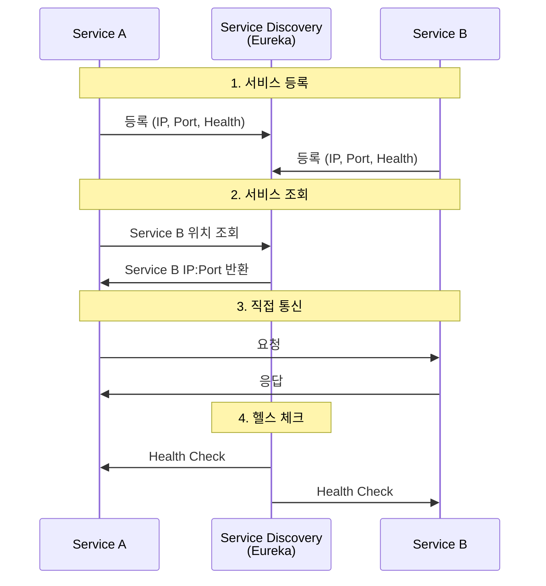
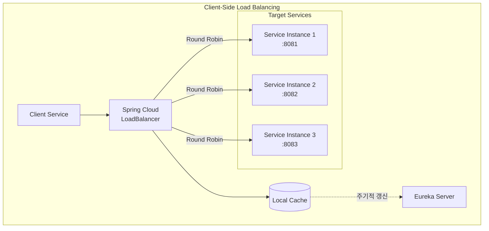
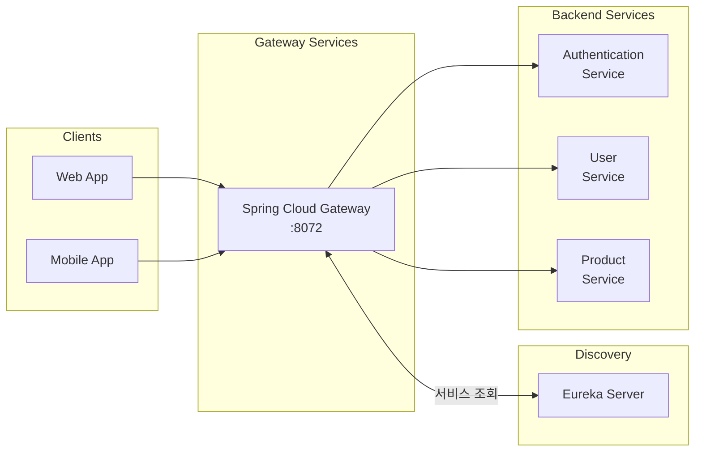
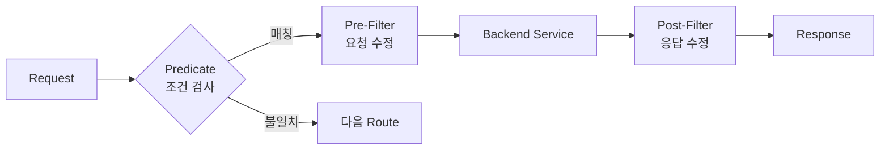
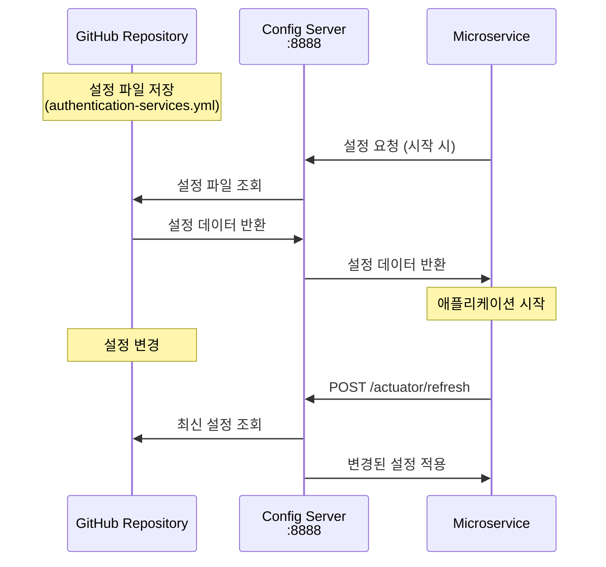
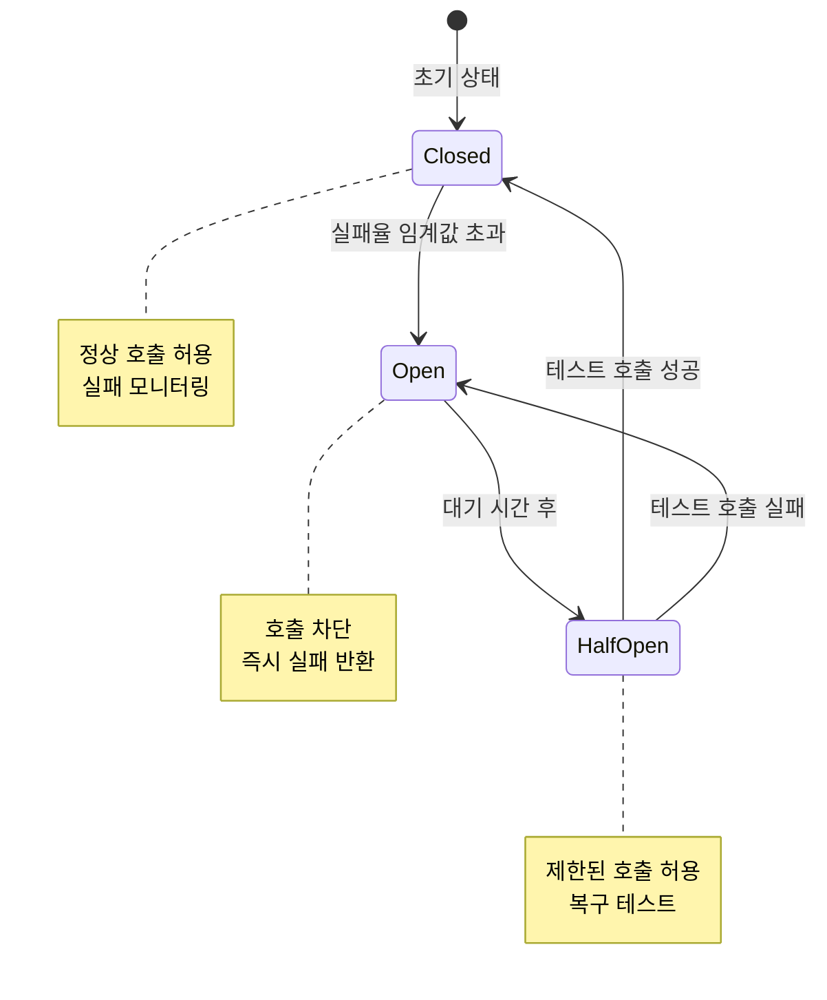
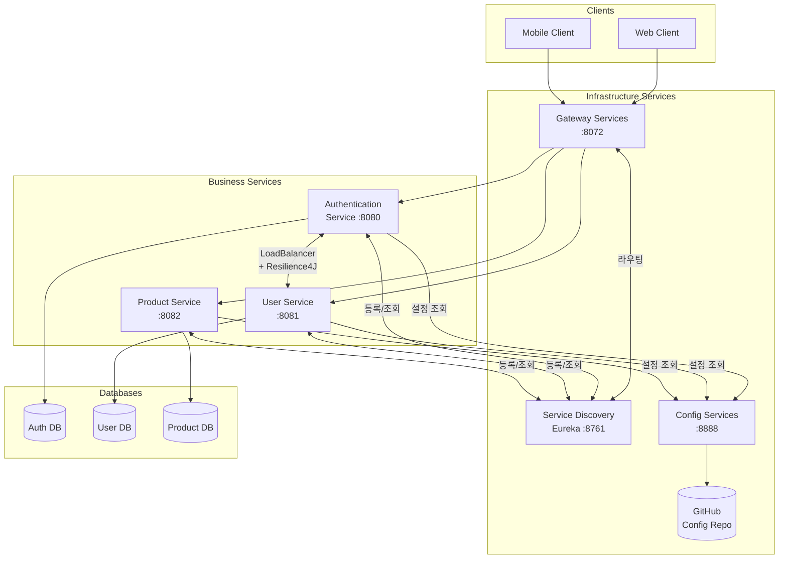

# Chapter 7: Microservices Patterns with Spring Cloud

---

## 📌 핵심 요약

> 이 장에서는 Spring Cloud를 활용한 마이크로서비스 핵심 패턴들을 다룹니다. **Eureka**를 통한 서비스 디스커버리, **Spring Cloud LoadBalancer**를 이용한 클라이언트 사이드 로드 밸런싱, **Spring Cloud Gateway**를 활용한 API 게이트웨이 구현, **Spring Cloud Config**를 통한 중앙 집중식 설정 관리, 그리고 **Resilience4J**를 이용한 회복탄력성 패턴(Circuit Breaker, Retry, Rate Limiter, Bulkhead, Fallback)을 실습합니다.

---

## 🎯 학습 목표

이 내용을 읽고 나면:
- [ ] Eureka를 사용하여 서비스 디스커버리를 구현할 수 있다
- [ ] Spring Cloud LoadBalancer로 클라이언트 사이드 로드 밸런싱을 설정할 수 있다
- [ ] Spring Cloud Gateway로 API 게이트웨이를 구축하고 Predicate/Filter를 활용할 수 있다
- [ ] Spring Cloud Config로 중앙 집중식 설정 관리를 구현할 수 있다
- [ ] Resilience4J를 사용하여 Circuit Breaker, Retry, Rate Limiter, Bulkhead 패턴을 적용할 수 있다

---

## 📖 본문 정리

### 1. 서비스 디스커버리 (Service Discovery with Eureka)

서비스 디스커버리는 마이크로서비스들이 고정된 URI 없이 동적으로 서로를 찾고 통신할 수 있게 해주는 메커니즘입니다.



#### 서비스 디스커버리 장단점

| 장점 | 단점 |
|------|------|
| **동적 확장성**: 새 인스턴스 즉시 등록/발견 | **단일 장애점**: 레지스트리 장애 시 전체 영향 |
| **장애 허용**: 실패한 인스턴스 자동 제거 | **복잡성 증가**: 추가 컴포넌트 관리 필요 |
| **로드 밸런싱 통합**: 요청 분산 가능 | **일관성 문제**: 네트워크 지연으로 오래된 정보 가능 |
| **네트워크 탄력성**: IP 변경에 자동 적응 | |

#### Eureka Server 구현

**1. 의존성 추가**

```xml
<dependency>
    <groupId>org.springframework.cloud</groupId>
    <artifactId>spring-cloud-starter-netflix-eureka-server</artifactId>
</dependency>
```

**2. 설정**

```properties
# application.properties
spring.application.name=service-discovery-services
server.port=8761

# 단독 서버 모드 (자기 자신 등록 안 함)
eureka.client.register-with-eureka=false
eureka.client.fetch-registry=false
```

**3. 메인 클래스**

```java
@EnableEurekaServer  // Eureka Server 활성화
@SpringBootApplication
public class ServiceDiscoveryServicesApplication {
    public static void main(String[] args) {
        SpringApplication.run(ServiceDiscoveryServicesApplication.class, args);
    }
}
```

#### Eureka Client 등록 (각 마이크로서비스)

```xml
<dependency>
    <groupId>org.springframework.cloud</groupId>
    <artifactId>spring-cloud-starter-netflix-eureka-client</artifactId>
</dependency>
```

```properties
# 각 서비스의 application.properties
eureka.client.serviceUrl.defaultZone=http://localhost:8761/eureka
eureka.instance.preferIpAddress=true  # 호스트명 대신 IP 주소 사용
```

#### DiscoveryClient를 통한 서비스 호출

```java
@Service
public class UserRestApi implements UserRepository {
    private final RestClient restClient;
    private final DiscoveryClient discoveryClient;

    @Override
    public List<String> getRolesByUsername(String username) {
        // Eureka에서 USER-SERVICES 인스턴스 조회
        ServiceInstance serviceInstance =
            discoveryClient.getInstances("USER-SERVICES").get(0);

        RoleResponse result = restClient.get()
            .uri(serviceInstance.getUri() + "/v1/users/{username}/roles", username)
            .retrieve()
            .body(RoleResponse.class);

        return result.getRoles();
    }
}
```

> ⚠️ **한계**: `discoveryClient.getInstances().get(0)`은 첫 번째 인스턴스만 사용. 로드 밸런싱 없음!

---

### 2. 로드 밸런싱 (Spring Cloud LoadBalancer)

로드 밸런싱은 네트워크 트래픽을 여러 서버에 분산하여 단일 서버 과부하를 방지합니다.



#### 서버 사이드 vs 클라이언트 사이드 로드 밸런싱

| 비교 항목 | Server-Side | Client-Side |
|----------|-------------|-------------|
| **로드 밸런서 위치** | 중앙 집중 (별도 서버) | 클라이언트 내장 |
| **병목 가능성** | 로드 밸런서가 병목 | 분산되어 병목 없음 |
| **지연시간** | 추가 홉으로 인한 지연 | 직접 통신으로 낮은 지연 |
| **서비스 발견** | 로드 밸런서가 관리 | 클라이언트가 직접 조회 |
| **예시** | Nginx, HAProxy, AWS ELB | Spring Cloud LoadBalancer |

#### Spring Cloud LoadBalancer 구현

**1. 의존성 추가**

```xml
<dependency>
    <groupId>org.springframework.cloud</groupId>
    <artifactId>spring-cloud-starter-loadbalancer</artifactId>
</dependency>
```

**2. RestClient 설정**

```java
@Configuration
public class BeansConfiguration {

    @LoadBalanced  // 로드 밸런싱 활성화
    @Bean
    public RestClient.Builder restClient() {
        return RestClient.builder();
    }
}
```

**3. 서비스 호출 (가상 호스트명 사용)**

```java
@Service
public class UserRestApi implements UserRepository {
    private final RestClient.Builder restClientBuilder;

    @Override
    public List<String> getRolesByUsername(String username) {
        // lb://SERVICE-NAME 형식으로 가상 호스트명 사용
        RoleResponse result = restClientBuilder.build()
            .get()
            .uri(URI.create("http://USER-SERVICES/v1/users/" + username + "/roles"))
            .retrieve()
            .body(RoleResponse.class);

        return result.getRoles();
    }
}
```

> 💬 **핵심**: `http://USER-SERVICES/...` 형식으로 물리 주소 대신 서비스명을 사용하면 LoadBalancer가 자동으로 라운드 로빈 방식으로 요청 분산

#### 로드 밸런싱 확인용 인터셉터

```java
@Component
public class CustomLoadBalancerInterceptor implements ClientHttpRequestInterceptor {
    private final LoadBalancerClient loadBalancerClient;

    @Override
    public ClientHttpResponse intercept(HttpRequest request, byte[] body,
            ClientHttpRequestExecution execution) throws IOException {

        ServiceInstance instance = loadBalancerClient.choose("USER-SERVICES");

        if (instance != null) {
            log.info("Calling service instance: host={}, port={}, path={}",
                instance.getHost(), instance.getPort(), request.getURI().getPath());
        }
        return execution.execute(request, body);
    }
}
```

---

### 3. API 게이트웨이 (Spring Cloud Gateway)

게이트웨이는 클라이언트 요청의 단일 진입점으로, 적절한 마이크로서비스로 라우팅합니다.



#### 게이트웨이 장단점

| 장점 | 단점 |
|------|------|
| **중앙 라우팅**: 단일 엔드포인트 | **단일 장애점**: 고가용성 설계 필요 |
| **보안 강화**: 인증/인가 중앙 관리 | **지연시간**: 추가 홉 발생 |
| **로드 밸런싱**: 요청 분산 |  |
| **Rate Limiting**: 과부하 방지 |  |
| **모니터링/분석**: 중앙 집중 로깅 |  |

#### Spring Cloud Gateway 구현

**1. 의존성**

```xml
<dependency>
    <groupId>org.springframework.cloud</groupId>
    <artifactId>spring-cloud-starter-gateway</artifactId>
</dependency>
<dependency>
    <groupId>org.springframework.cloud</groupId>
    <artifactId>spring-cloud-starter-netflix-eureka-client</artifactId>
</dependency>
```

**2. 기본 설정 (자동 라우팅)**

```yaml
# application.yml
spring:
  cloud:
    gateway:
      discovery:
        locator:
          enabled: true              # Eureka 기반 자동 라우트 생성
          lower-case-service-id: true # 소문자 서비스명 허용
```

**3. 서비스 호출**

```bash
# 게이트웨이를 통한 호출
# http://localhost:8072/{service-name}/{endpoint}
curl http://localhost:8072/authentication-services/v1/api/auth
```

#### Predicates와 Filters



#### 주요 Built-in Predicates

| Predicate | 설명 | 예시 |
|-----------|------|------|
| **Path** | URL 경로 매칭 | `Path=/api/**` |
| **Method** | HTTP 메서드 매칭 | `Method=GET,POST` |
| **Header** | 헤더 존재/값 매칭 | `Header=X-Request-Id, \d+` |
| **Query** | 쿼리 파라미터 매칭 | `Query=name, value` |
| **After/Before/Between** | 시간 기반 매칭 | `After=2024-01-01T00:00:00+09:00` |

#### 주요 Built-in Filters

| Filter | 설명 | 예시 |
|--------|------|------|
| **AddRequestHeader** | 요청 헤더 추가 | `AddRequestHeader=X-Custom, value` |
| **AddResponseHeader** | 응답 헤더 추가 | `AddResponseHeader=X-Custom, value` |
| **RewritePath** | 경로 재작성 | `RewritePath=/api/(?<path>.*), /$\{path}` |
| **AddRequestParameter** | 쿼리 파라미터 추가 | `AddRequestParameter=foo, bar` |

#### 커스텀 라우트 설정

```yaml
# application.yml
spring:
  cloud:
    gateway:
      routes:
        - id: auth                    # 라우트 ID
          uri: lb://authentication-services  # 로드밸런싱 URI
          predicates:
            - Path=/authentication/**  # /authentication/** 매칭
          filters:
            - RewritePath=/authentication/(?<path>.*), /$\{path}
            # /authentication/v1/api/auth -> /v1/api/auth
```

**호출 예시:**
```bash
# Before: http://localhost:8072/authentication-services/v1/api/auth
# After:  http://localhost:8072/authentication/v1/api/auth (더 짧은 URL)
```

#### Custom Global Filter 구현

```java
@Component
public class CustomGlobalFilter implements GlobalFilter {

    private static final String CORRELATION_ID = "x-correlation-id";

    @Override
    public Mono<Void> filter(ServerWebExchange exchange, GatewayFilterChain chain) {
        // Pre-Filter: 요청 처리 전
        String correlationId = exchange.getRequest().getHeaders()
            .getFirst(CORRELATION_ID);

        if (correlationId == null) {
            correlationId = UUID.randomUUID().toString();
            // 요청에 correlation-id 헤더 추가
            exchange.getRequest().mutate()
                .header(CORRELATION_ID, correlationId)
                .build();
        }

        String finalCorrelationId = correlationId;

        // Post-Filter: 응답 처리 후
        return chain.filter(exchange).then(Mono.fromRunnable(() -> {
            // 응답에 correlation-id 헤더 추가
            exchange.getResponse().getHeaders()
                .add(CORRELATION_ID, finalCorrelationId);
        }));
    }
}
```

---

### 4. 설정 관리 (Spring Cloud Config)

Spring Cloud Config는 분산 시스템의 설정을 중앙에서 관리합니다.



#### Config Server 구현

**1. 의존성**

```xml
<dependency>
    <groupId>org.springframework.cloud</groupId>
    <artifactId>spring-cloud-config-server</artifactId>
</dependency>
```

**2. 설정**

```properties
# application.properties
spring.application.name=configuration-services
server.port=8888

# Git 저장소 설정
spring.cloud.config.server.git.uri=https://github.com/user/config-repo.git
spring.cloud.config.server.git.default-label=main
```

**3. 메인 클래스**

```java
@EnableConfigServer  // Config Server 활성화
@SpringBootApplication
public class ConfigurationServicesApplication {
    public static void main(String[] args) {
        SpringApplication.run(ConfigurationServicesApplication.class, args);
    }
}
```

#### 설정 파일 네이밍 규칙

```
{application-name}.properties
{application-name}-{profile}.properties

예시:
├── authentication-services.properties      # 기본
├── authentication-services-dev.properties  # dev 프로파일
├── authentication-services-prod.properties # prod 프로파일
├── user-services.properties
└── product-services.properties
```

#### Config Client 설정 (각 마이크로서비스)

**1. 의존성**

```xml
<dependency>
    <groupId>org.springframework.cloud</groupId>
    <artifactId>spring-cloud-starter-config</artifactId>
</dependency>
<dependency>
    <groupId>org.springframework.cloud</groupId>
    <artifactId>spring-cloud-starter-bootstrap</artifactId>
</dependency>
```

**2. 로컬 설정 (bootstrap 전용)**

```properties
# application.properties (로컬)
spring.application.name=authentication-services
server.port=8080

# Config Server 연결
spring.config.import=optional:configserver:${CONFIG_SERVER_URI:http://localhost:8888}
```

> 💬 **`optional:`**: Config Server 불가용 시에도 애플리케이션 시작 가능

#### 런타임 설정 갱신 (@RefreshScope)

```java
@RefreshScope  // 설정 갱신 가능하게 함
@SpringBootApplication
public class AuthenticationServicesApplication {
    public static void main(String[] args) {
        SpringApplication.run(AuthenticationServicesApplication.class, args);
    }
}
```

```bash
# 설정 갱신 트리거
curl -X POST http://localhost:8080/actuator/refresh
```

---

### 5. 회복탄력성 패턴 (Resilience4J)

Resilience4J는 클라이언트 사이드 회복탄력성 패턴을 제공하는 라이브러리입니다.

```mermaid
mindmap
  root((Resilience4J<br/>회복탄력성))
    Circuit Breaker
      장애 서비스 호출 차단
      Closed/Open/Half-Open
    Retry
      일시적 오류 재시도
      최대 시도 횟수
    Rate Limiter
      시간당 요청 수 제한
      과부하 방지
    Bulkhead
      동시 호출 수 제한
      자원 격리
    Fallback
      대체 응답 제공
      기본값/캐시 반환
```



#### 의존성 추가

```xml
<dependency>
    <groupId>io.github.resilience4j</groupId>
    <artifactId>resilience4j-spring-boot3</artifactId>
</dependency>
<dependency>
    <groupId>org.springframework.boot</groupId>
    <artifactId>spring-boot-starter-aop</artifactId>
</dependency>
<!-- Rate Limiter 사용 시 -->
<dependency>
    <groupId>io.github.resilience4j</groupId>
    <artifactId>resilience4j-ratelimiter</artifactId>
</dependency>
```

---

#### 5.1 Circuit Breaker (서킷 브레이커)

장애가 발생한 서비스로의 반복 호출을 방지합니다.



**구현:**

```java
@Service
public class UserRestApi implements UserRepository {

    @CircuitBreaker(name = "userServices", fallbackMethod = "getRolesFromCache")
    @Override
    public List<String> getRolesByUsername(String username) {
        // User Service 호출
        return restClient.get()
            .uri("http://USER-SERVICES/v1/users/{username}/roles", username)
            .retrieve()
            .body(RoleResponse.class)
            .getRoles();
    }

    // Fallback 메서드 (동일 시그니처 + Throwable)
    public List<String> getRolesFromCache(String username, Throwable t) {
        log.warn("Fallback triggered for user: {}, error: {}", username, t.getMessage());
        return List.of("ROLE_GUEST");  // 기본값 반환
    }
}
```

**설정:**

```yaml
resilience4j:
  circuitbreaker:
    instances:
      userServices:
        register-health-indicator: true      # Actuator 헬스 체크 등록
        wait-duration-in-open-state: 10s     # Open 상태 유지 시간
        failure-rate-threshold: 10           # 실패율 임계값 (%)
        slow-call-rate-threshold: 10         # 느린 호출 비율 임계값 (%)
        slow-call-duration-threshold: 1s     # 느린 호출 기준 시간
        minimum-number-of-calls: 5           # 통계 계산 최소 호출 수
        automatic-transition-from-open-to-half-open-enabled: true
```

---

#### 5.2 Retry (재시도)

일시적인 오류에 대해 자동으로 재시도합니다.

```java
@Retry(name = "userServicesRetry", fallbackMethod = "getRolesFromCache")
@CircuitBreaker(name = "userServices", fallbackMethod = "getRolesFromCache")
public List<String> getRolesByUsername(String username) {
    // ...
}
```

```yaml
resilience4j:
  retry:
    instances:
      userServicesRetry:
        max-attempts: 3       # 최대 재시도 횟수
        wait-duration: 1s     # 재시도 간 대기 시간
    metrics:
      enabled: true
```

---

#### 5.3 Rate Limiter (요청 제한)

시간당 요청 수를 제한하여 서비스 과부하를 방지합니다.

```java
@RateLimiter(name = "userServicesRateLimiter")
public List<String> getRolesByUsername(String username) {
    // ...
}
```

```yaml
resilience4j:
  ratelimiter:
    instances:
      userServicesRateLimiter:
        register-health-indicator: true
        limit-for-period: 5        # 기간당 허용 요청 수
        limit-refresh-period: 60s  # 제한 갱신 주기
    metrics:
      enabled: true
```

> 💬 **Rate Limiter vs Bulkhead**: Rate Limiter는 **시간당** 총 요청 수 제한, Bulkhead는 **동시** 요청 수 제한

---

#### 5.4 Bulkhead (격벽)

동시 호출 수를 제한하여 자원을 격리합니다.

```java
@Bulkhead(name = "userServicesBulkhead", type = Bulkhead.Type.SEMAPHORE)
public List<String> getRolesByUsername(String username) {
    // ...
}
```

```yaml
resilience4j:
  bulkhead:
    instances:
      userServicesBulkhead:
        max-concurrent-calls: 3   # 최대 동시 호출 수
        max-wait-duration: 1s     # 대기 최대 시간
    metrics:
      enabled: true
```

**Bulkhead 유형:**

| 유형 | 설명 | 사용 사례 |
|------|------|----------|
| **SEMAPHORE** | 세마포어로 동시 호출 제한 | 경량, 논블로킹 작업 |
| **THREADPOOL** | 별도 스레드풀 사용 | 블로킹 I/O 작업 |

---

#### 5.5 패턴 조합 및 우선순위

```java
// 어노테이션 적용 순서 (외부 -> 내부)
@Bulkhead(name = "userServicesBulkhead")      // 1. 동시 호출 제한
@RateLimiter(name = "userServicesRateLimiter") // 2. 요청률 제한
@Retry(name = "userServicesRetry")             // 3. 재시도
@CircuitBreaker(name = "userServices", fallbackMethod = "getRolesFromCache") // 4. 서킷 브레이커
public List<String> getRolesByUsername(String username) {
    // ...
}
```

**실행 흐름:**
```
요청 → Bulkhead 체크 → Rate Limiter 체크 → 실행 (Retry 포함) → Circuit Breaker 체크 → 응답/Fallback
```

---

### 6. 최종 아키텍처



---

## 🔍 심화 학습

### Service Mesh vs Spring Cloud

| 비교 항목 | Spring Cloud | Service Mesh (Istio) |
|----------|--------------|---------------------|
| **구현 위치** | 애플리케이션 레벨 | 인프라 레벨 (Sidecar) |
| **언어 종속성** | Java/JVM 종속 | 언어 무관 |
| **복잡도** | 상대적으로 낮음 | 높음 (K8s 필요) |
| **기능** | 개발자 친화적 | 운영자 친화적 |
| **트래픽 관리** | 코드 기반 | 정책 기반 |
| **예시** | Eureka, Config, Gateway | Istio, Linkerd, Consul Connect |

### 분산 추적 (Distributed Tracing)

책에서 간단히 다뤄진 correlation-id를 확장한 분산 추적 시스템:

| 도구 | 설명 |
|------|------|
| **Zipkin** | Twitter 개발, 경량 분산 추적 |
| **Jaeger** | Uber 개발, CNCF 프로젝트 |
| **Spring Cloud Sleuth** | Spring 기반 자동 추적 (deprecated → Micrometer Tracing) |
| **OpenTelemetry** | 표준화된 관측성 프레임워크 |

### 출처

- [Spring Cloud Netflix (Eureka)](https://spring.io/projects/spring-cloud-netflix)
- [Spring Cloud Gateway 공식 문서](https://spring.io/projects/spring-cloud-gateway)
- [Spring Cloud Config 공식 문서](https://spring.io/projects/spring-cloud-config)
- [Resilience4J 공식 문서](https://resilience4j.readme.io/docs)

---

## 💡 실무 적용 포인트

### 이런 상황에서 사용하세요

| 패턴 | 사용 시나리오 |
|------|--------------|
| **Service Discovery** | 동적으로 스케일링되는 마이크로서비스 환경 |
| **Load Balancer** | 여러 인스턴스에 트래픽 분산이 필요할 때 |
| **Gateway** | 단일 진입점, 인증/인가 중앙화가 필요할 때 |
| **Config Server** | 여러 환경(dev/staging/prod) 설정 관리 |
| **Circuit Breaker** | 외부 서비스 호출 시 장애 전파 방지 |
| **Retry** | 일시적 네트워크 오류, 타임아웃 처리 |
| **Rate Limiter** | API 과부하 방지, 외부 API 호출 제한 |
| **Bulkhead** | 서비스별 자원 격리, 연쇄 장애 방지 |

### 주의할 점 / 흔한 실수

- ⚠️ **Eureka 단일 인스턴스**: 프로덕션에서는 반드시 클러스터링 구성
- ⚠️ **Gateway 병목**: 고가용성 설계 없이 단일 Gateway 운영
- ⚠️ **Config Server 보안**: 민감 정보 평문 저장 (암호화 필요)
- ⚠️ **Circuit Breaker 임계값**: 너무 낮은 임계값은 정상 서비스도 차단
- ⚠️ **Retry 무한 반복**: max-attempts 없이 무한 재시도
- ⚠️ **Rate Limiter 전역 적용**: 사용자별이 아닌 전역 제한으로 합법적 트래픽 차단

### 면접에서 나올 수 있는 질문

- **Q**: 서비스 디스커버리의 역할과 Eureka의 동작 방식을 설명하세요.
  - A: 서비스들이 고정 IP 없이 동적으로 서로를 찾을 수 있게 함. Eureka는 서비스 등록, 헬스 체크, 서비스 조회 기능 제공

- **Q**: 클라이언트 사이드 로드 밸런싱의 장점은 무엇인가요?
  - A: 중앙 로드밸런서 병목 제거, 지연시간 감소, 서비스 디스커버리와 통합 용이

- **Q**: Circuit Breaker의 세 가지 상태와 전환 조건을 설명하세요.
  - A: Closed(정상), Open(차단), Half-Open(테스트). 실패율 초과 시 Open, 대기 후 Half-Open, 테스트 성공 시 Closed

- **Q**: Rate Limiter와 Bulkhead의 차이점은 무엇인가요?
  - A: Rate Limiter는 시간당 총 요청 수 제한, Bulkhead는 동시 요청 수 제한. 각각 다른 과부하 상황에 대응

- **Q**: Spring Cloud Config의 장점과 설정 갱신 방법은?
  - A: 중앙 집중식 설정 관리, 환경별 분리, 버전 관리. @RefreshScope와 /actuator/refresh로 런타임 갱신

---

## ✅ 핵심 개념 체크리스트

- [ ] Eureka Server/Client의 역할과 설정 방법을 이해하는가?
- [ ] @LoadBalanced 어노테이션의 동작 원리를 설명할 수 있는가?
- [ ] Spring Cloud Gateway의 Predicate와 Filter를 구분하고 사용할 수 있는가?
- [ ] Spring Cloud Config의 설정 파일 네이밍 규칙을 알고 있는가?
- [ ] Circuit Breaker의 세 가지 상태(Closed, Open, Half-Open)를 설명할 수 있는가?
- [ ] Retry, Rate Limiter, Bulkhead의 차이점과 사용 시나리오를 구분할 수 있는가?
- [ ] Fallback 메서드의 시그니처 규칙을 알고 있는가?

---

## 🔗 참고 자료

- 📄 [Spring Cloud Netflix 공식 문서](https://spring.io/projects/spring-cloud-netflix)
- 📄 [Spring Cloud Gateway 공식 문서](https://spring.io/projects/spring-cloud-gateway)
- 📄 [Spring Cloud Config 공식 문서](https://spring.io/projects/spring-cloud-config)
- 📄 [Resilience4J 공식 문서](https://resilience4j.readme.io/docs)
- 📚 Spring Microservices in Action - John Carnell
- 🎬 [Spring Cloud Gateway Tutorial - Amigoscode](https://www.youtube.com/watch?v=1vjOv_f9L8I)

---
