# Chapter 8: Event-Driven Architecture

---

## 📌 핵심 요약

> 이 장에서는 **이벤트 기반 아키텍처(Event-Driven Architecture)**의 핵심 개념과 비동기 통신의 특성을 다룹니다. 이벤트의 기본 개념(불변성, 시간성, 비동기성), 푸시/풀 모델, 오케스트레이션/코레오그래피 방식을 학습하고, 주요 패턴인 **Publish-Subscribe**, **Event Notification**, **Event-Carried State Transfer**, **Message Inbox/Outbox**, **Saga 패턴**을 탐구합니다. 마지막으로 **Spring for Apache Kafka**를 활용하여 온라인 경매 시스템에 이벤트 기반 서비스를 구현합니다.

---

## 🎯 학습 목표

이 내용을 읽고 나면:
- [ ] 이벤트 기반 아키텍처의 핵심 구성 요소와 장단점을 설명할 수 있다
- [ ] 이벤트의 특성(불변성, 시간성, 비동기성)과 유형을 구분할 수 있다
- [ ] Push 모델과 Pull 모델의 차이를 이해하고 적절한 상황에 적용할 수 있다
- [ ] Orchestration과 Choreography 방식의 차이를 비교할 수 있다
- [ ] 주요 이벤트 기반 패턴(Saga, Outbox 등)을 실무에 적용할 수 있다
- [ ] Spring for Apache Kafka를 사용하여 Producer/Consumer를 구현할 수 있다

---

## 📖 본문 정리

### 1. 이벤트 기반 아키텍처 소개

이벤트 기반 아키텍처는 **이벤트**를 통해 느슨하게 결합된 서비스들 간의 통신을 시작하고 조율하는 패러다임입니다.

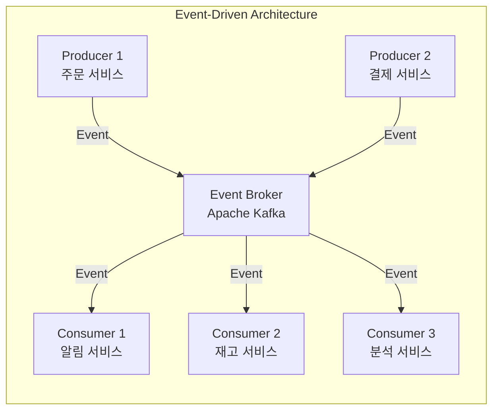

#### 핵심 구성 요소

| 구성 요소 | 역할 | 예시 |
|----------|------|------|
| **Producer** | 이벤트 생성 및 발행 | 사용자 액션, 시스템 알림, IoT 센서 |
| **Event** | 상태 변경 또는 발생한 사건 | OrderPlaced, PaymentCompleted |
| **Event Broker** | 이벤트 전달 중개자 | Apache Kafka, RabbitMQ |
| **Consumer** | 이벤트 수신 및 처리 | DB 업데이트, 알림 발송, 다른 서비스 트리거 |

#### 비동기 통신 (Asynchronous Communication)

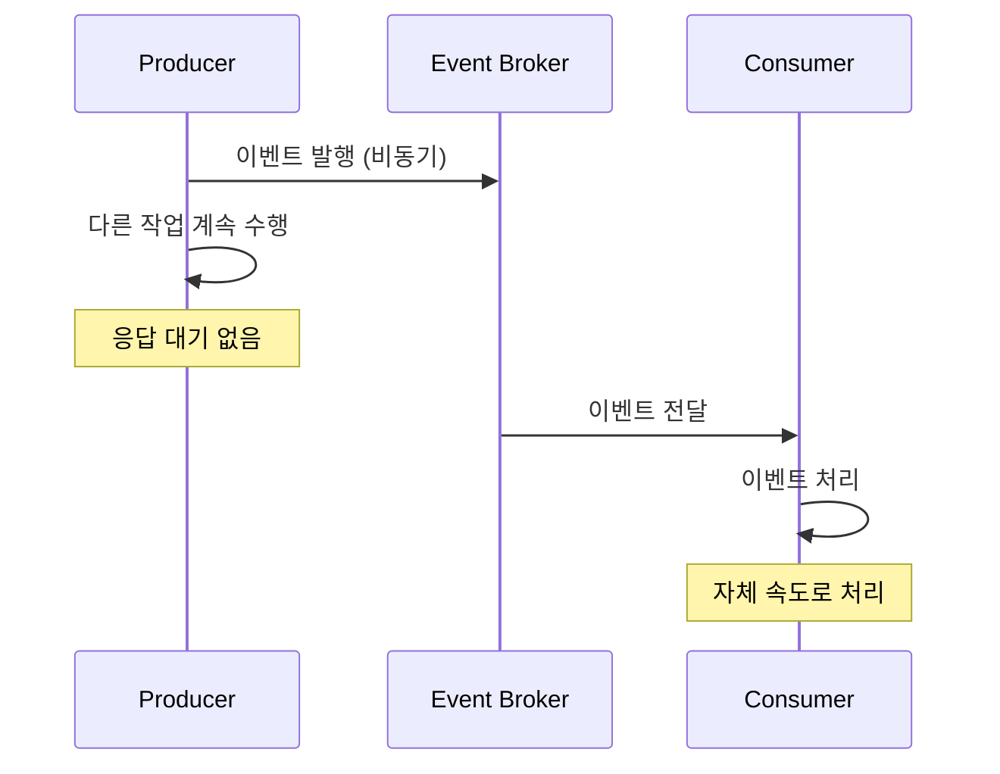

> 💬 **핵심 차이**: 동기 통신(REST API)은 응답을 기다리지만, 비동기 통신은 이벤트 발행 후 즉시 다음 작업 수행

---

### 2. 이벤트 기반 아키텍처의 장단점

#### 장점

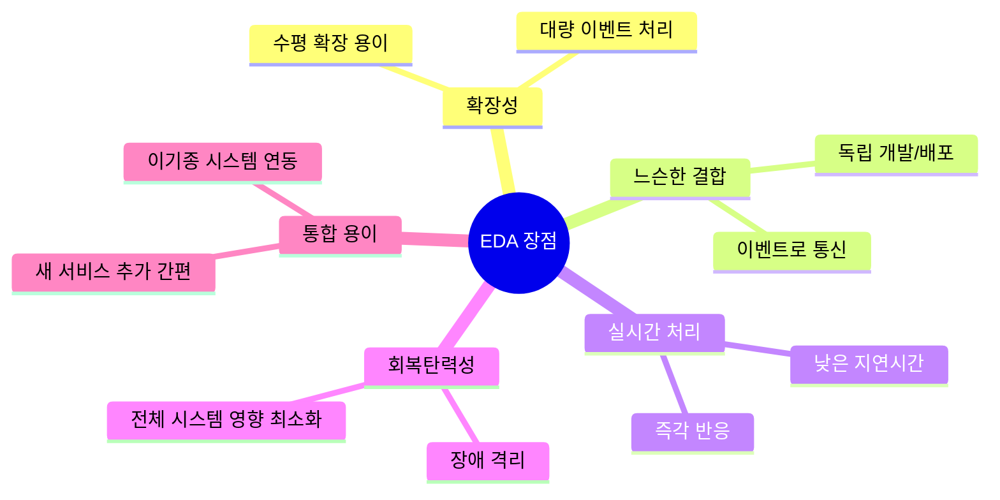

#### 단점 및 도전 과제

| 도전 과제 | 설명 | 해결 방안 |
|----------|------|----------|
| **복잡성** | 이벤트 흐름, 의존성 관리 어려움 | 명확한 이벤트 스키마, 문서화 |
| **디버깅/모니터링** | 비동기 특성으로 추적 어려움 | Zipkin, Jaeger, ELK Stack |
| **일관성** | 순서 보장, 처리 시간 차이 | 이벤트 소싱, SAGA 패턴 |
| **이벤트 과부하** | 브로커 부담, 지연 증가 | 필터링, 우선순위 지정 |
| **데이터 중복** | 서비스 간 데이터 동기화 | 고유 ID, 멱등성 보장 |
| **지연시간** | 네트워크, 처리 지연 | 비동기 처리, 로드 밸런싱 |
| **트랜잭션 관리** | 분산 트랜잭션 복잡 | SAGA, Outbox 패턴 |

---

### 3. 이벤트의 기본 개념

#### 이벤트 특성

| 특성 | 설명 | 중요성 |
|------|------|--------|
| **불변성 (Immutable)** | 발행 후 변경 불가 | 분산 시스템 일관성 보장 |
| **시간성 (Temporal)** | 특정 시점에 발생, 타임스탬프 포함 | 이벤트 순서 추적 |
| **설명적 (Descriptive)** | 발생한 일에 대한 정보 포함 | 컨슈머 처리에 필요한 데이터 |
| **비동기성 (Asynchronous)** | 비동기적으로 처리 | 프로듀서/컨슈머 분리 |

#### 이벤트 유형

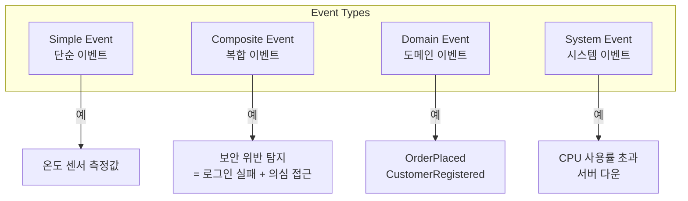

| 이벤트 유형 | 설명 | 사용 사례 |
|------------|------|----------|
| **Simple Event** | 단일 상태 변경 | IoT 센서 데이터, 클릭 이벤트 |
| **Composite Event** | 여러 단순 이벤트 조합 | 패턴 탐지, 보안 모니터링 |
| **Domain Event** | 비즈니스 도메인의 중요 변경 | 주문 생성, 결제 완료 |
| **System Event** | 인프라/시스템 관련 | 리소스 모니터링, 장애 알림 |

---

### 4. 데이터 전달 모델: Push vs Pull

#### Push 모델

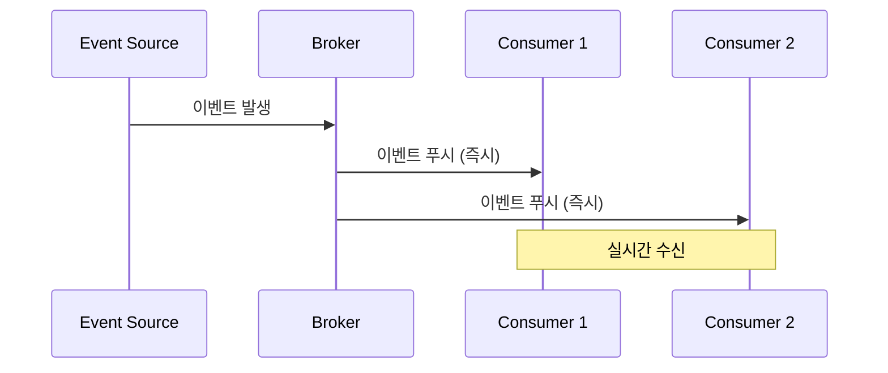

#### Pull 모델

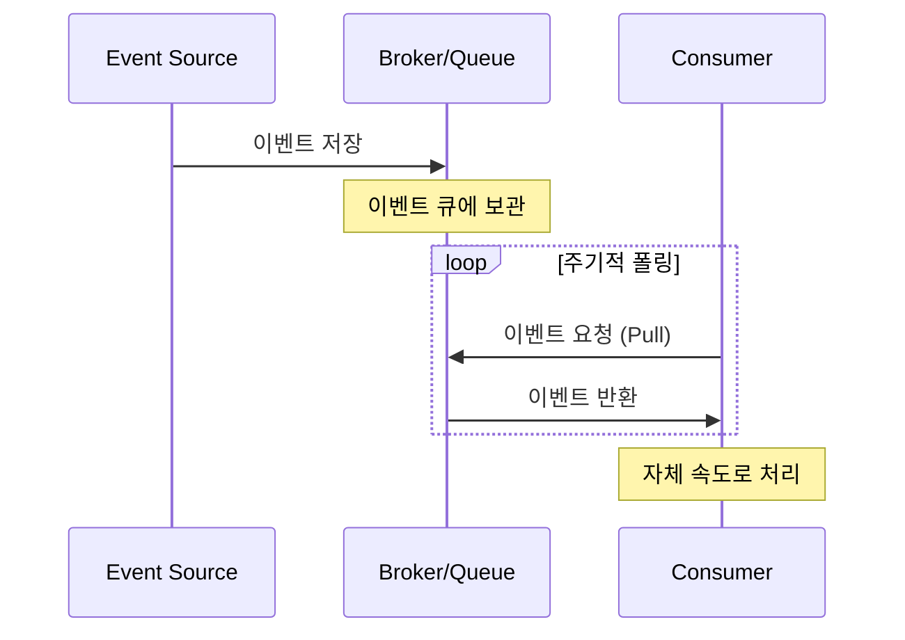

#### Push vs Pull 비교

| 비교 항목 | Push 모델 | Pull 모델 |
|----------|----------|----------|
| **전달 방식** | 브로커가 컨슈머에게 전송 | 컨슈머가 브로커에서 가져옴 |
| **지연시간** | 낮음 (즉시 전달) | 폴링 간격에 따라 다름 |
| **처리 속도 제어** | 컨슈머 과부하 가능 | 컨슈머가 속도 제어 |
| **사용 사례** | 실시간 알림, 즉각 반응 | 배치 처리, 데이터 파이프라인 |
| **예시 기술** | RabbitMQ, AWS SNS | Apache Kafka, AWS SQS |

---

### 5. 워크플로우 관리: Orchestration vs Choreography

#### Orchestration (오케스트레이션)

중앙 오케스트레이터가 서비스 호출 순서와 흐름을 제어합니다.

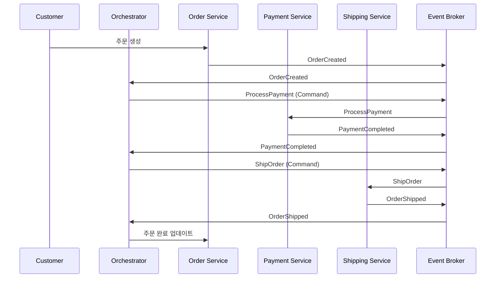

#### Choreography (코레오그래피)

각 서비스가 이벤트에 반응하여 자율적으로 다음 행동을 결정합니다.

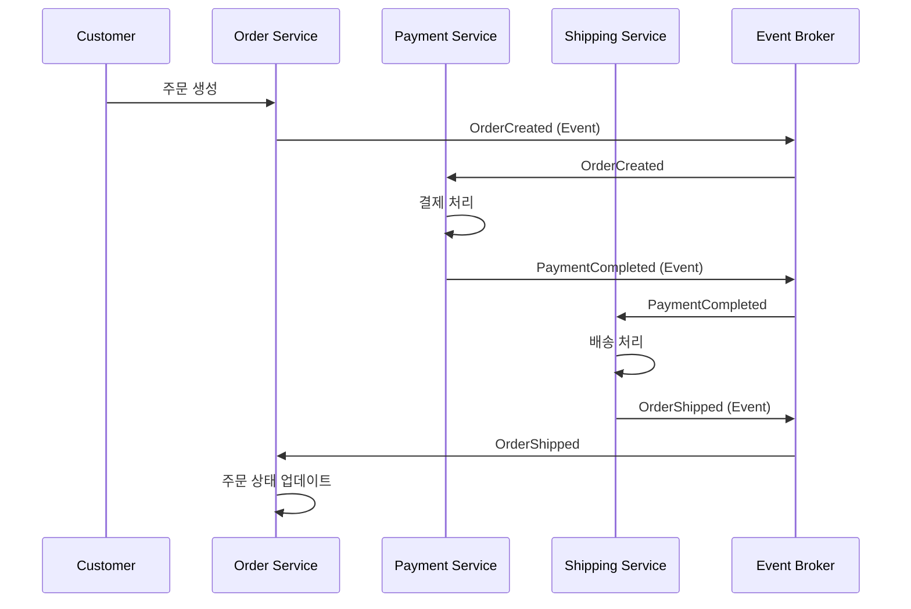

#### Orchestration vs Choreography 비교

| 비교 항목 | Orchestration | Choreography |
|----------|---------------|--------------|
| **제어 방식** | 중앙 집중 (오케스트레이터) | 분산 (각 서비스 자율) |
| **메시지 타입** | **Command** (명령) | **Event** (사실) |
| **워크플로우 정의** | 명시적 (오케스트레이터 내) | 암묵적 (서비스 상호작용에서 도출) |
| **관리 용이성** | 높음 (단일 지점 모니터링) | 낮음 (분산되어 추적 어려움) |
| **확장성** | 오케스트레이터 병목 가능 | 높음 (서비스 독립) |
| **결합도** | 오케스트레이터에 의존 | 느슨한 결합 |
| **복잡도** | 오케스트레이터 로직 복잡 | 전체 흐름 파악 어려움 |

> 💬 **핵심 차이**: Orchestration은 **Command(명령)**를 보내 서비스에게 무엇을 할지 지시하고, Choreography는 **Event(사실)**를 발행하여 서비스가 스스로 반응하도록 합니다.

---

### 6. 이벤트 기반 아키텍처 패턴

#### 6.1 Publish-Subscribe (발행-구독)

프로듀서가 이벤트를 브로커에 발행하면, 구독한 모든 컨슈머가 이벤트를 수신합니다.

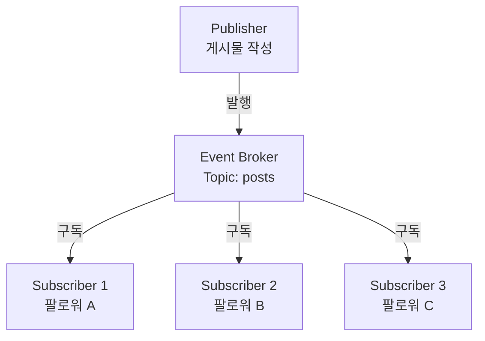

---

#### 6.2 Event Notification (이벤트 알림)

최소한의 정보만 포함하여 이벤트 발생을 알립니다.

```json
{
  "eventType": "BidAdded",
  "userId": "1",
  "productId": "2",
  "bidAmount": 150.00
}
```

| 장점 | 단점 |
|------|------|
| 이벤트 크기 작음 | 추가 데이터 필요 시 서비스 호출 |
| 구현 단순 | 서비스 간 결합도 증가 |
| | 지연시간 증가 |

---

#### 6.3 Event-Carried State Transfer (이벤트 상태 전달)

이벤트에 컨슈머가 필요한 모든 데이터를 포함합니다.

```json
{
  "user": {
    "id": "112233",
    "name": "Wanderson Xesquevixos"
  },
  "product": {
    "id": "98765",
    "description": "Sport Car 1977"
  },
  "bidAmount": 150.00
}
```

| 장점 | 단점 |
|------|------|
| 추가 서비스 호출 불필요 | 이벤트 크기 증가 |
| 낮은 지연시간 | 중복 데이터 가능 |
| 컨슈머 로직 단순화 | 데이터 변경 시 동기화 필요 |

---

#### 6.4 Message Outbox Pattern (메시지 아웃박스)

데이터베이스 트랜잭션과 이벤트 발행의 일관성을 보장합니다.

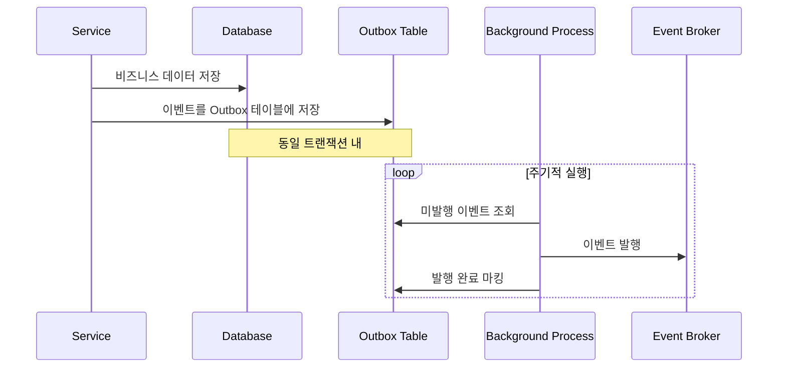

> 💬 **문제 해결**: 서비스가 DB 커밋 후 이벤트 발행 전에 크래시되면 이벤트 손실 → Outbox 패턴으로 해결

---

#### 6.5 Message Inbox Pattern (메시지 인박스)

이벤트 수신 후 처리 전에 저장하여 정확히 한 번 처리를 보장합니다.

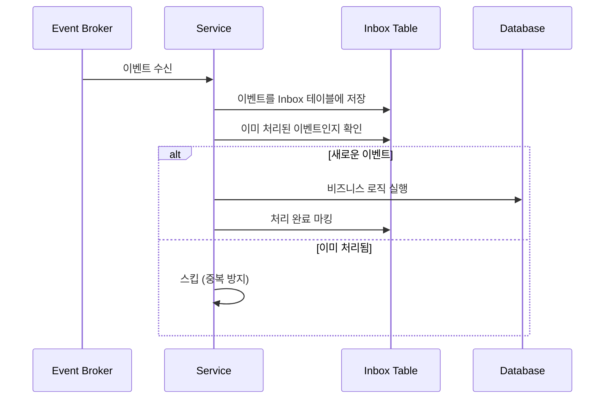

---

#### 6.6 Saga Pattern (사가 패턴)

장기 실행 트랜잭션을 작은 단계로 나누고, 실패 시 보상 트랜잭션을 실행합니다.

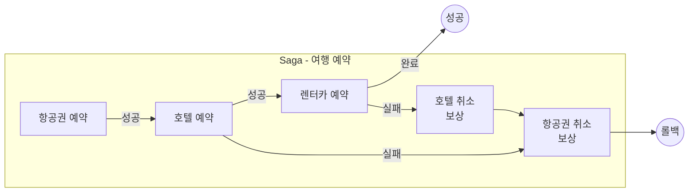

| 특징 | 설명 |
|------|------|
| **보상 트랜잭션** | 각 단계 실패 시 이전 단계 되돌리기 |
| **최종 일관성** | 즉각적 일관성이 아닌 최종 일관성 |
| **장기 실행** | 2PC보다 장기 프로세스에 적합 |

---

### 7. Apache Kafka와 Spring for Apache Kafka

#### Apache Kafka 아키텍처

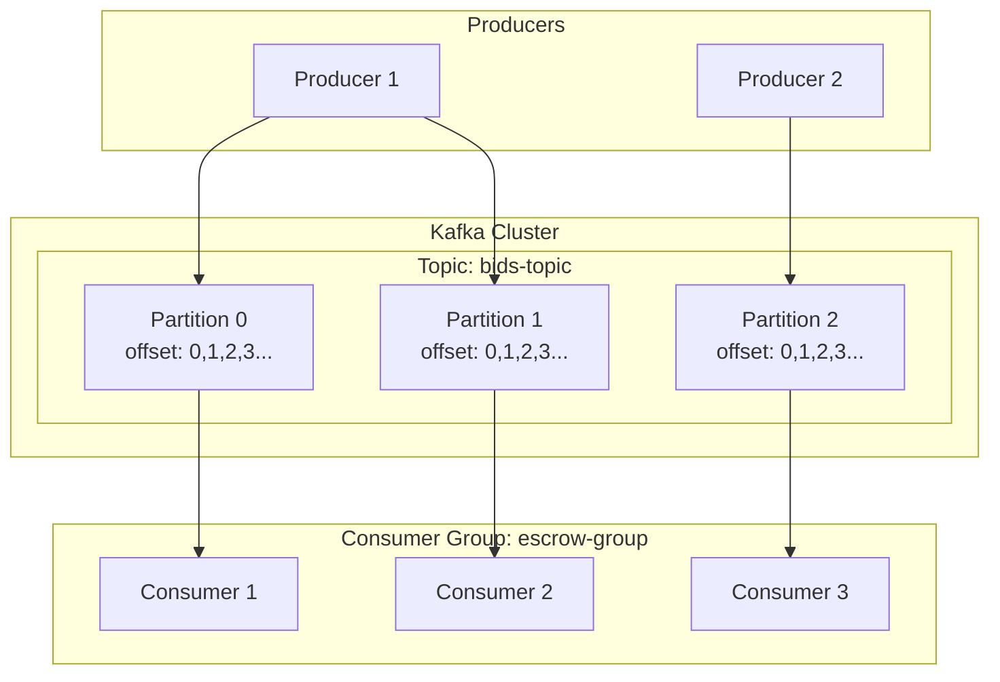

#### Kafka 핵심 개념

| 개념 | 설명 |
|------|------|
| **Topic** | 이벤트를 저장하는 논리적 카테고리 |
| **Partition** | 토픽을 나눈 단위, 병렬 처리 가능 |
| **Offset** | 파티션 내 메시지 위치, 컨슈머 진행 추적 |
| **Consumer Group** | 메시지를 분산 처리하는 컨슈머 집합 |
| **Commit Log** | 불변, 순서 보장 메시지 저장소 |

#### Consumer Group과 Partition 관계

```
3개 파티션, Consumer Group 시나리오:
- 1 Consumer: 3개 파티션 모두 처리
- 2 Consumers: 하나가 2개, 하나가 1개 처리
- 3 Consumers: 각각 1개 파티션 처리 (최적)
- 4 Consumers: 3개만 할당, 1개는 유휴
```

---

### 8. Spring for Apache Kafka 구현

#### 프로젝트 구조 (온라인 경매)

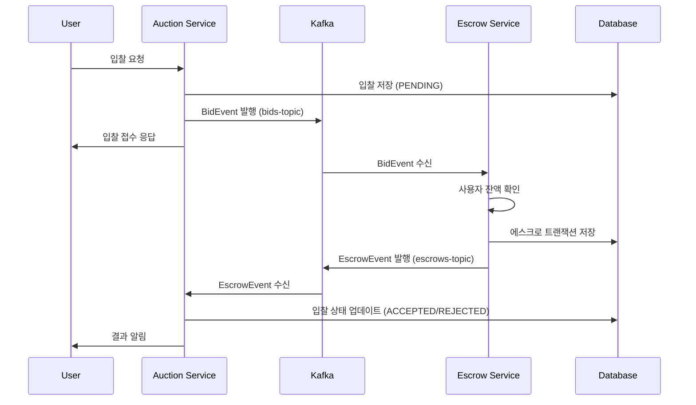

#### Producer 구현 (Auction Service)

**의존성:**
```xml
<dependency>
    <groupId>org.springframework.kafka</groupId>
    <artifactId>spring-kafka</artifactId>
</dependency>
```

**Producer 클래스:**
```java
@Slf4j
@Component
public class BidProducer {
    private final KafkaTemplate<String, Bid> kafkaTemplate;
    private static final String BIDS_TOPIC = "bids-topic";
    private static final String KEY_BIDS_TOPIC = "key-bids";

    public BidProducer(KafkaTemplate<String, Bid> kafkaTemplate) {
        this.kafkaTemplate = kafkaTemplate;
    }

    public void placeBid(Bid bid) {
        log.info("Place bid: {}", bid);
        // 비동기 메시지 발행
        kafkaTemplate.send(BIDS_TOPIC, KEY_BIDS_TOPIC, bid);
        log.info("Bid {} sent to bids topic!", bid.getId());
    }
}
```

**Producer 설정:**
```properties
# application.properties
spring.kafka.bootstrap-servers=localhost:9092

# Key 직렬화: String
spring.kafka.producer.key-serializer=org.apache.kafka.common.serialization.StringSerializer

# Value 직렬화: JSON
spring.kafka.producer.value-serializer=org.springframework.kafka.support.serializer.JsonSerializer

# 타입 헤더 비활성화 (호환성)
spring.kafka.producer.properties.spring.json.add.type.headers=false
```

#### Consumer 구현 (Escrow Service)

**Consumer 클래스:**
```java
@Component
public class BidConsumer {
    private final EscrowProducer escrowProducer;
    private final GetUserEscrowBalanceUseCase getUserEscrowBalanceUseCase;
    private final GetUserEscrowReservationsUseCase getUserEscrowReservationsUseCase;
    private final CreateEscrowTransactionUseCase createEscrowTransactionUseCase;

    @KafkaListener(topics = "bids-topic", groupId = "escrow-group")
    public void bidConsumer(BidEvent bidEvent) {
        // 1. 사용자 잔액 조회
        BigDecimal balance = getUserEscrowBalanceUseCase.execute(bidEvent.getUserId());

        // 2. 이미 예약된 금액 조회
        BigDecimal totalReserved = getUserEscrowReservationsUseCase.execute(bidEvent.getUserId());

        // 3. 에스크로 트랜잭션 생성
        EscrowTransaction escrowTransaction = new EscrowTransaction(
            null,
            bidEvent.getAuctionId(),
            bidEvent.getId(),
            bidEvent.getUserId(),
            bidEvent.getAmount(),
            null,
            bidEvent.getCreatedAt()
        );

        // 4. 잔액 검증 및 상태 결정
        if (balance.compareTo(totalReserved.add(bidEvent.getAmount())) >= 0) {
            bidEvent.setStatus(BidStatus.ACCEPTED.name());
            escrowTransaction.setStatus(EscrowStatus.RESERVED.name());
        } else {
            bidEvent.setStatus(BidStatus.REJECTED.name());
            escrowTransaction.setStatus(EscrowStatus.REJECTED.name());
        }

        // 5. 트랜잭션 저장
        createEscrowTransactionUseCase.execute(escrowTransaction);

        // 6. 결과 이벤트 발행
        escrowProducer.placeEscrow(bidEvent);
    }
}
```

**Consumer 설정:**
```properties
# application.properties
spring.kafka.bootstrap-servers=localhost:9092

# Consumer Group ID
spring.kafka.consumer.group-id=escrow-group

# Key 역직렬화
spring.kafka.consumer.key-deserializer=org.apache.kafka.common.serialization.StringDeserializer

# Value 역직렬화 (에러 처리 포함)
spring.kafka.consumer.value-deserializer=org.springframework.kafka.support.serializer.ErrorHandlingDeserializer

# 실제 역직렬화 위임
spring.kafka.consumer.properties.spring.deserializer.value.delegate.class=org.springframework.kafka.support.serializer.JsonDeserializer

# 대상 타입 지정
spring.kafka.consumer.properties.spring.json.value.default.type=com.example.dto.BidEvent

# 신뢰할 패키지 (보안)
spring.kafka.consumer.properties.spring.json.trusted.packages=*
```

---

## 🔍 심화 학습

### Kafka vs RabbitMQ

| 비교 항목 | Apache Kafka | RabbitMQ |
|----------|--------------|----------|
| **모델** | Pull (Consumer가 가져옴) | Push (Broker가 보냄) |
| **메시지 보관** | 장기 보관 (설정 가능) | 소비 후 삭제 |
| **순서 보장** | 파티션 내 보장 | 큐 내 보장 |
| **처리량** | 매우 높음 (수백만/초) | 높음 |
| **사용 사례** | 로그, 스트리밍, 대용량 | 작업 큐, 실시간 알림 |
| **복잡도** | 높음 (분산 시스템) | 상대적으로 낮음 |

### Transactional Outbox 구현 고려사항

```java
@Transactional
public void createOrder(Order order) {
    // 1. 비즈니스 데이터 저장
    orderRepository.save(order);

    // 2. 같은 트랜잭션 내 Outbox에 이벤트 저장
    outboxRepository.save(new OutboxEvent(
        "OrderCreated",
        objectMapper.writeValueAsString(order),
        LocalDateTime.now(),
        false  // published = false
    ));
    // 트랜잭션 커밋 시 둘 다 저장됨
}

// 별도 스케줄러로 Outbox 이벤트 발행
@Scheduled(fixedRate = 1000)
public void publishOutboxEvents() {
    List<OutboxEvent> events = outboxRepository.findByPublishedFalse();
    for (OutboxEvent event : events) {
        kafkaTemplate.send(event.getType(), event.getPayload());
        event.setPublished(true);
        outboxRepository.save(event);
    }
}
```

### 출처

- [Apache Kafka 공식 문서](https://kafka.apache.org/documentation/)
- [Spring for Apache Kafka 공식 문서](https://spring.io/projects/spring-kafka)
- [Martin Fowler - Event-Driven Architecture](https://martinfowler.com/articles/201701-event-driven.html)
- [Chris Richardson - Saga Pattern](https://microservices.io/patterns/data/saga.html)

---

## 💡 실무 적용 포인트

### 이런 상황에서 사용하세요

| 패턴/기술 | 사용 시나리오 |
|----------|--------------|
| **Event Notification** | 이벤트 크기를 줄이고 싶을 때, 컨슈머가 추가 조회 가능할 때 |
| **Event-Carried State Transfer** | 지연시간이 중요하고, 추가 API 호출을 피하고 싶을 때 |
| **Outbox Pattern** | DB 트랜잭션과 이벤트 발행의 원자성이 필요할 때 |
| **Inbox Pattern** | 정확히 한 번 처리(Exactly-Once)가 필요할 때 |
| **Saga Pattern** | 여러 서비스에 걸친 장기 트랜잭션 처리 |
| **Orchestration** | 명시적 워크플로우, 중앙 모니터링이 필요할 때 |
| **Choreography** | 높은 확장성, 느슨한 결합이 우선일 때 |

### 주의할 점 / 흔한 실수

- ⚠️ **이벤트 순서 의존**: 파티션 내에서만 순서 보장됨, 전역 순서 필요 시 단일 파티션 사용
- ⚠️ **멱등성 미구현**: 같은 이벤트 재처리 시 중복 효과 발생
- ⚠️ **Consumer Group 오설정**: 같은 그룹 ID로 여러 서비스 실행 시 메시지 분산됨
- ⚠️ **오프셋 커밋 실패**: 처리 완료 전 커밋하면 메시지 손실, 처리 후 커밋하면 중복 가능
- ⚠️ **이벤트 스키마 변경**: 하위 호환성 없이 변경하면 컨슈머 오류 발생
- ⚠️ **Saga 보상 트랜잭션 누락**: 모든 단계에 대해 보상 로직 구현 필요

### 면접에서 나올 수 있는 질문

- **Q**: 이벤트 기반 아키텍처의 장점과 단점을 설명하세요.
  - A: 장점 - 확장성, 느슨한 결합, 실시간 처리. 단점 - 복잡성, 디버깅 어려움, 일관성 관리

- **Q**: Orchestration과 Choreography의 차이점은 무엇인가요?
  - A: Orchestration은 중앙 오케스트레이터가 Command로 제어, Choreography는 서비스가 Event에 자율 반응

- **Q**: Saga 패턴이 2PC보다 마이크로서비스에 적합한 이유는?
  - A: 2PC는 블로킹, 긴밀한 결합 필요. Saga는 보상 트랜잭션으로 최종 일관성 달성, 느슨한 결합 유지

- **Q**: Kafka의 Consumer Group이 어떻게 동작하나요?
  - A: 같은 그룹의 컨슈머들이 파티션을 분담, 각 파티션은 그룹 내 하나의 컨슈머만 처리

- **Q**: Outbox 패턴이 필요한 이유는?
  - A: DB 트랜잭션 커밋과 이벤트 발행 사이에 서비스 크래시 시 이벤트 손실 방지

---

## ✅ 핵심 개념 체크리스트

- [ ] 이벤트 기반 아키텍처의 핵심 구성 요소(Producer, Event, Broker, Consumer)를 설명할 수 있는가?
- [ ] Push 모델과 Pull 모델의 차이를 이해하고 있는가?
- [ ] Orchestration과 Choreography의 특징을 비교할 수 있는가?
- [ ] Event Notification과 Event-Carried State Transfer 패턴을 구분할 수 있는가?
- [ ] Saga 패턴의 보상 트랜잭션 개념을 이해하고 있는가?
- [ ] Kafka의 Topic, Partition, Consumer Group, Offset 개념을 설명할 수 있는가?
- [ ] Spring for Apache Kafka의 @KafkaListener와 KafkaTemplate 사용법을 알고 있는가?

---

## 🔗 참고 자료

- 📄 [Apache Kafka 공식 문서](https://kafka.apache.org/documentation/)
- 📄 [Spring for Apache Kafka 공식 문서](https://spring.io/projects/spring-kafka)
- 📄 [Microservices.io - Saga Pattern](https://microservices.io/patterns/data/saga.html)
- 📄 [Martin Fowler - Event-Driven Architecture](https://martinfowler.com/articles/201701-event-driven.html)
- 📚 Designing Event-Driven Systems - Ben Stopford
- 📚 Enterprise Integration Patterns - Gregor Hohpe
- 🎬 [Kafka Tutorial - Confluent](https://www.youtube.com/watch?v=B5j3uNBH8X4)

---
