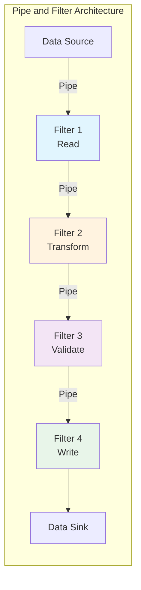
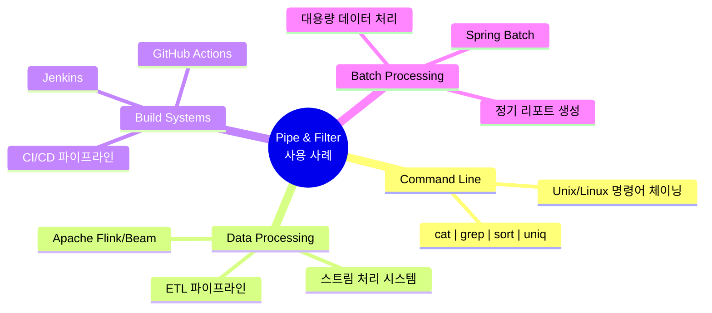
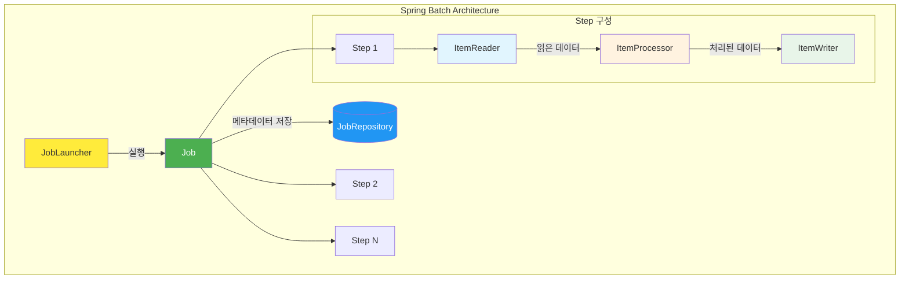
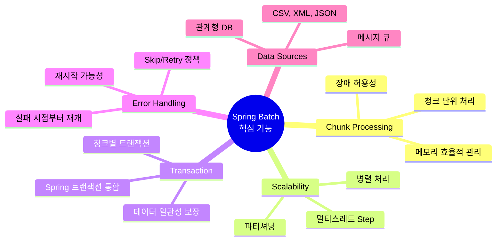
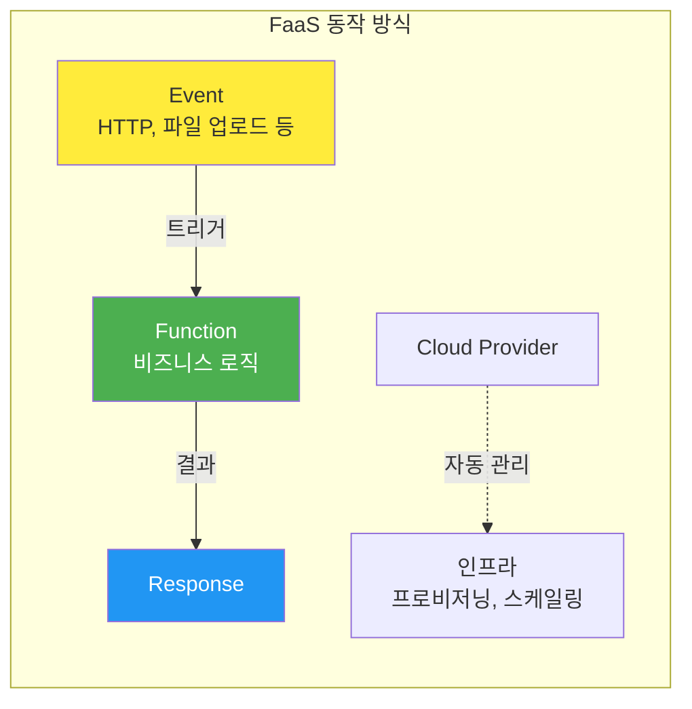
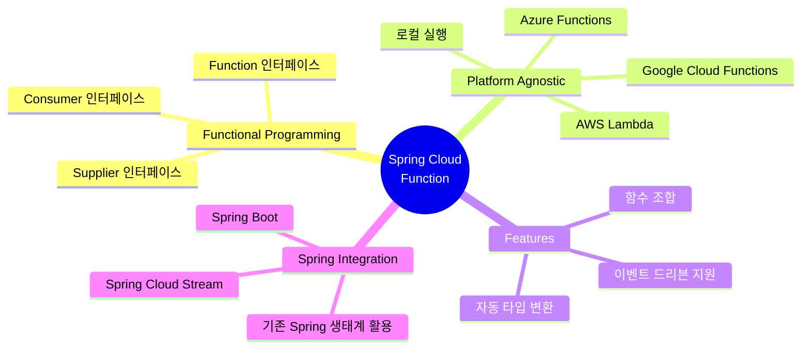
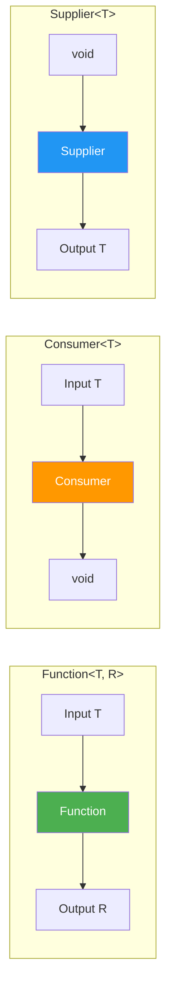
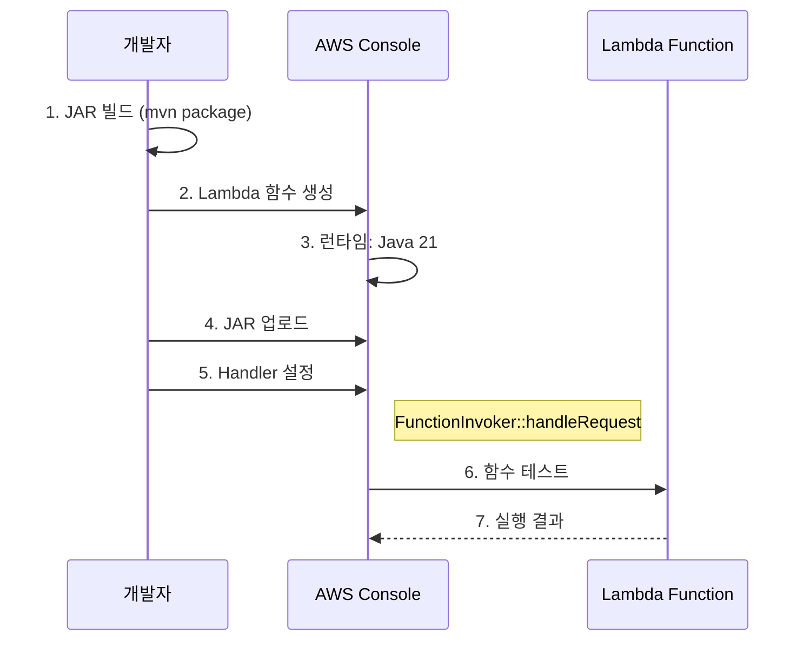

# 09. Pipe-and-Filter와 서버리스 아키텍처

---

## 📌 핵심 요약

> 이 장에서는 **파이프 앤 필터 아키텍처(Pipe and Filter Architecture)**와 **서버리스 아키텍처(Serverless Architecture)**를 다룬다. Spring Batch를 활용한 배치 처리 애플리케이션 구현과 Spring Cloud Function을 통한 FaaS(Function as a Service) 개발 방법을 학습한다. 핵심은 데이터 처리 파이프라인의 모듈화와 인프라 관리 없는 함수 기반 개발이다.

---

## 🎯 학습 목표

이 내용을 읽고 나면:
- [ ] 파이프 앤 필터 아키텍처의 구성 요소와 적용 시나리오를 설명할 수 있다
- [ ] Spring Batch의 핵심 개념(Job, Step, ItemReader/Processor/Writer)을 이해하고 구현할 수 있다
- [ ] FaaS의 장단점을 비교하고 적합한 사용 사례를 판단할 수 있다
- [ ] Spring Cloud Function으로 서버리스 함수를 구현하고 AWS Lambda에 배포할 수 있다

---

## 📖 본문 정리

### 1. 파이프 앤 필터 아키텍처 (Pipe and Filter Architecture)

파이프 앤 필터 아키텍처는 **필터(Filter)**라는 처리 단위들이 **파이프(Pipe)**로 연결되어 데이터를 순차적으로 처리하는 구조이다.



> 💬 **비유**: 공장의 조립 라인처럼 각 필터가 특정 작업을 수행하고, 결과물을 다음 필터로 전달한다. 각 작업자(필터)는 자신의 업무만 알면 되고, 컨베이어 벨트(파이프)가 제품을 이동시킨다.

#### 핵심 구성 요소

| 구성 요소 | 역할 | 예시 |
|----------|------|------|
| **Filter** | 특정 작업 수행 (변환, 집계, 필터링) | grep, sort, 데이터 변환기 |
| **Pipe** | 필터 간 데이터 전달 | Unix 파이프(`\|`), 메시지 큐 |
| **Data Source** | 입력 데이터 제공 | 파일, 데이터베이스, API |
| **Data Sink** | 최종 결과 저장 | 파일, 데이터베이스, 알림 |

#### 적용 사례



**Unix 명령어 체이닝 예시:**

```bash
# 각 명령어가 필터 역할, 파이프(|)로 연결
cat file.txt | grep "searchTerm" | sort | uniq > output.txt

# cat: 파일 읽기 (Filter 1)
# grep: 특정 용어 필터링 (Filter 2)
# sort: 정렬 (Filter 3)
# uniq: 중복 제거 (Filter 4)
```

#### 사용을 피해야 하는 경우

| 상황 | 이유 |
|------|------|
| **실시간 저지연 시스템** | 파이프라인 통과 시 지연 발생 |
| **강결합 컴포넌트** | 공유 상태가 필요한 경우 부적합 |
| **인터랙티브 애플리케이션** | 즉각적인 사용자 응답 필요 |
| **복잡한 워크플로우** | 조건 분기가 많은 경우 비효율적 |
| **장시간 연속 연산** | 성능 병목 발생 가능 |

---

### 2. Spring Batch 프레임워크

Spring Batch는 대용량 데이터 처리를 위한 경량 배치 프레임워크로, 파이프 앤 필터 아키텍처를 실제로 구현한다.

#### 핵심 개념 (도메인 언어)



| 구성 요소 | 역할 | 설명 |
|----------|------|------|
| **JobLauncher** | 작업 시작 | 스케줄러 또는 수동 요청으로 Job 실행 |
| **Job** | 전체 배치 프로세스 | 하나 이상의 Step으로 구성 |
| **JobParameters** | 작업 매개변수 | 실행별 설정값 정의 |
| **Step** | 작업 단계 | 읽기→처리→쓰기 단계 포함 |
| **ItemReader** | 데이터 읽기 | 소스에서 데이터 추출 |
| **ItemProcessor** | 데이터 처리 | 비즈니스 로직, 변환 적용 |
| **ItemWriter** | 데이터 쓰기 | 처리된 데이터 저장 |
| **JobRepository** | 메타데이터 관리 | 실행 상태, 이력 추적 |

#### Spring Batch 주요 기능



#### ItemReader 구현

```java
/**
 * CSV 파일에서 사용자 데이터를 읽는 ItemReader
 * FlatFileItemReader를 확장하여 구현
 */
@Component
@StepScope  // Step 실행마다 새로운 인스턴스 생성
public class UserItemReader extends FlatFileItemReader<UserDto> {

    public UserItemReader(
            // SpEL을 통한 Job 파라미터 주입
            @Value("#{jobParameters['usersFile']}") String usersFile) {

        // 읽을 파일 리소스 설정
        this.setResource(new FileSystemResource(usersFile));

        // 라인 매퍼 설정 (CSV 라인 → 객체 변환)
        this.setLineMapper(lineMapper());

        // 헤더 라인 스킵
        this.setLinesToSkip(1);
    }

    private LineMapper<UserDto> lineMapper() {
        DefaultLineMapper<UserDto> lineMapper = new DefaultLineMapper<>();

        // 구분자 설정 (콤마로 분리)
        DelimitedLineTokenizer tokenizer = new DelimitedLineTokenizer();
        tokenizer.setDelimiter(",");
        tokenizer.setNames("id", "city", "country", "email", "name", "phone_number", "state");
        tokenizer.setStrict(false);  // 누락된 필드 허용

        lineMapper.setLineTokenizer(tokenizer);
        lineMapper.setFieldSetMapper(new UserFieldSetMapper());

        return lineMapper;
    }
}

/**
 * FieldSet을 UserDto로 매핑하는 매퍼
 */
public class UserFieldSetMapper implements FieldSetMapper<UserDto> {

    @Override
    public UserDto mapFieldSet(FieldSet fieldSet) throws BindException {
        return UserDto.builder()
                .id(fieldSet.readLong("id"))
                .name(fieldSet.readString("name"))
                .email(fieldSet.readString("email"))
                .city(fieldSet.readString("city"))
                .country(fieldSet.readString("country"))
                .phoneNumber(fieldSet.readString("phone_number"))
                .state(fieldSet.readString("state"))
                .build();
    }
}
```

#### ItemProcessor 구현

```java
/**
 * UserDto를 User 엔티티로 변환하는 Processor
 * 비즈니스 로직, 검증, 변환 수행
 */
@Component
public class UserItemProcessor implements ItemProcessor<UserDto, User> {

    @Override
    public User process(UserDto userDto) throws Exception {
        // DTO → Entity 변환
        // 필요시 검증, 변환, 필터링 로직 추가 가능
        return User.builder()
                .id(userDto.getId())
                .name(userDto.getName())
                .email(userDto.getEmail())
                .city(userDto.getCity())
                .country(userDto.getCountry())
                .phoneNumber(userDto.getPhoneNumber())
                .state(userDto.getState())
                .build();
    }

    // null 반환 시 해당 아이템은 Writer로 전달되지 않음 (필터링)
}
```

#### ItemWriter 구현

```java
/**
 * User 데이터를 데이터베이스에 저장하는 Writer
 * JdbcTemplate을 사용한 배치 인서트
 */
@Component
@RequiredArgsConstructor
public class UserItemWriter implements ItemWriter<User> {

    private final JdbcTemplate jdbcTemplate;

    @Override
    public void write(Chunk<? extends User> users) throws Exception {
        // 청크 단위로 배치 업데이트 수행
        jdbcTemplate.batchUpdate(
            "INSERT INTO users (id, city, country, email, name, phone_number, state) " +
            "VALUES (?, ?, ?, ?, ?, ?, ?)",
            new BatchPreparedStatementSetter() {
                @Override
                public void setValues(PreparedStatement ps, int i) throws SQLException {
                    User user = users.getItems().get(i);
                    ps.setLong(1, user.getId());
                    ps.setString(2, user.getCity());
                    ps.setString(3, user.getCountry());
                    ps.setString(4, user.getEmail());
                    ps.setString(5, user.getName());
                    ps.setString(6, user.getPhoneNumber());
                    ps.setString(7, user.getState());
                }

                @Override
                public int getBatchSize() {
                    return users.size();
                }
            }
        );
    }
}
```

#### Step과 Job 설정

```java
/**
 * Spring Batch 설정 클래스
 * Step과 Job을 정의하고 구성
 */
@Configuration
@RequiredArgsConstructor
public class BatchConfig {

    private final UserItemReader userItemReader;
    private final ItemProcessor<UserDto, User> userItemProcessor;
    private final ItemWriter<User> userItemWriter;

    /**
     * 사용자 데이터 임포트 Step
     * 청크 크기 100으로 설정
     */
    @Bean
    public Step importUsersStep(
            JobRepository jobRepository,
            PlatformTransactionManager transactionManager) {

        return new StepBuilder("importUsersStep", jobRepository)
                .<UserDto, User>chunk(100, transactionManager)  // 100개씩 청크 처리
                .reader(userItemReader)       // 읽기
                .processor(userItemProcessor) // 처리
                .writer(userItemWriter)       // 쓰기
                .build();
    }

    /**
     * 파일 임포트 Job
     * 여러 Step을 순차적으로 실행
     */
    @Bean
    public Job importFilesJob(
            JobRepository jobRepository,
            PlatformTransactionManager transactionManager) {

        return new JobBuilder("importFilesJob", jobRepository)
                .start(importUsersStep(jobRepository, transactionManager))
                .next(importProductsStep(jobRepository, transactionManager))
                .next(importBidsStep(jobRepository, transactionManager))
                .next(importAuctionsStep(jobRepository, transactionManager))
                .build();
    }
}
```

#### JobLauncher 실행

```java
/**
 * 배치 Job 실행 스케줄러
 * 주기적으로 ETL 작업 수행
 */
@Component
@RequiredArgsConstructor
public class BatchJobScheduler {

    private final JobLauncher jobLauncher;
    private final Job importFilesJob;

    private static final String USERS_FILE = "/data/Users.csv";
    private static final String PRODUCTS_FILE = "/data/Products.csv";

    /**
     * 60초마다 배치 작업 실행
     */
    @Scheduled(fixedRate = 60000)
    public void runImportJob() throws Exception {
        // Job 파라미터 생성 (실행마다 고유해야 함)
        JobParameters jobParameters = new JobParametersBuilder()
                .addDate("timestamp", Calendar.getInstance().getTime())  // 실행 시각
                .addString("usersFile", USERS_FILE)
                .addString("productsFile", PRODUCTS_FILE)
                .toJobParameters();

        // Job 실행
        JobExecution execution = jobLauncher.run(importFilesJob, jobParameters);

        System.out.println("Job Status: " + execution.getStatus());
        System.out.println("Job completed at: " + execution.getEndTime());
    }
}
```

#### JPA vs JDBC 선택 기준

| 기준 | JPA | Spring Data JDBC / JdbcTemplate |
|------|-----|--------------------------------|
| **배치 처리** | 오버헤드 높음 | ✅ 효율적 |
| **메모리 사용** | 엔티티 캐싱으로 높음 | ✅ 낮음 |
| **성능** | 1차 캐시, 변경 감지 부담 | ✅ 직접 제어 가능 |
| **복잡도** | 높음 (영속성 컨텍스트 관리) | ✅ 단순함 |
| **제어력** | 추상화로 제한적 | ✅ SQL 직접 제어 |

> 💡 **실무 팁**: 배치 애플리케이션에서는 JPA보다 **순수 JDBC 또는 Spring Data JDBC**를 권장한다. 대용량 데이터 처리 시 메모리 효율성과 성능을 최적화할 수 있다.

---

### 3. 서버리스 아키텍처와 FaaS

서버리스 아키텍처(Serverless Architecture)는 개발자가 인프라를 관리하지 않고 코드 작성과 배포에만 집중할 수 있는 클라우드 컴퓨팅 모델이다.

#### FaaS (Function as a Service)란?



**FaaS 특징:**
- 이벤트에 반응하여 코드 실행
- 상태 비저장(Stateless)
- 짧은 실행 시간
- 독립적인 함수 단위 배포

#### FaaS 장단점 비교

| 장점 | 설명 |
|------|------|
| **💰 비용 효율성** | 함수 실행 시간만큼만 과금, 유휴 비용 없음 |
| **📈 자동 스케일링** | 트래픽에 따라 자동 확장/축소 |
| **🔧 복잡성 감소** | 서버 관리, 패치, 스케일링 불필요 |
| **🎯 비즈니스 집중** | 인프라 대신 핵심 기능 개발에 집중 |
| **🚀 빠른 출시** | 배포 프로세스 단순화 |

| 단점 | 설명 | 완화 방안 |
|------|------|----------|
| **❄️ Cold Start** | 첫 실행 시 지연 발생 | Warm-up 전략, Provisioned Concurrency |
| **🔒 벤더 종속** | 클라우드 제공자별 구현 차이 | Spring Cloud Function 사용 |
| **⏱️ 실행 시간 제한** | 장시간 작업에 부적합 | 작업 분할, Step Functions 활용 |
| **🐛 디버깅 어려움** | 로컬 환경과 차이 | 로컬 에뮬레이터 사용 |

---

### 4. Spring Cloud Function

Spring Cloud Function은 서버리스 애플리케이션 개발을 위한 Spring 생태계 프레임워크로, **플랫폼 독립적인** 함수 개발을 지원한다.

#### 핵심 특징



#### 함수형 인터페이스 비교

| 인터페이스 | 입력 | 출력 | 사용 사례 |
|-----------|------|------|----------|
| **`Function<T, R>`** | ✅ 있음 | ✅ 있음 | 데이터 변환, API 요청 처리 |
| **`Consumer<T>`** | ✅ 있음 | ❌ 없음 | 알림 전송, 로깅, 이벤트 처리 |
| **`Supplier<T>`** | ❌ 없음 | ✅ 있음 | 데이터 조회, 상태 확인 |



#### Consumer 함수 구현 (입력만 받음)

```java
/**
 * Slack 채널에 알림을 보내는 Consumer 함수
 * 입력을 받아 처리하지만 반환값 없음
 */
@Configuration
public class SlackAlertFunction {

    @Value("${slack.webhook.url}")
    private String slackWebhookUrl;

    private final RestClient restClient = RestClient.create();

    /**
     * Consumer: 메시지를 받아 Slack에 전송
     */
    @Bean
    public Consumer<Message> alertSlackChannelConsumer() {
        return message -> {
            try {
                restClient.post()
                        .uri(slackWebhookUrl)
                        .header("Content-Type", "application/json")
                        .body(message)
                        .retrieve();

                System.out.println("Message sent successfully!");
            } catch (Exception e) {
                System.err.println("Failed to send message: " + e.getMessage());
            }
        };
    }
}
```

#### Supplier 함수 구현 (출력만 생성)

```java
/**
 * Supplier: 입력 없이 고정 메시지를 Slack에 전송
 * 반환값으로 전송 결과 제공
 */
@Bean
public Supplier<String> alertSlackChannelSupplier() {
    return () -> {
        try {
            String messageContent = "ETL 프로세스가 완료되었습니다!";
            String payload = String.format("{\"text\":\"%s\"}", messageContent);

            restClient.post()
                    .uri(slackWebhookUrl)
                    .header("Content-Type", "application/json")
                    .body(payload)
                    .retrieve();

            return "Alert sent successfully!";
        } catch (Exception e) {
            return "Failed to send alert: " + e.getMessage();
        }
    };
}
```

#### Function 함수 구현 (입력 → 출력)

```java
/**
 * Function: 메시지를 받아 Slack에 전송하고 결과 반환
 * 가장 유연한 형태의 함수
 */
@Bean
public Function<Message, String> alertSlackChannelFunction() {
    return message -> {
        try {
            restClient.post()
                    .uri(slackWebhookUrl)
                    .header("Content-Type", "application/json")
                    .body(message)
                    .retrieve();

            return "Message sent: " + message.getText();
        } catch (Exception e) {
            return "Error: " + e.getMessage();
        }
    };
}

// Message DTO
@Data
@Builder
public class Message {
    private String text;
}
```

#### AWS Lambda 배포 설정

**pom.xml 의존성 추가:**

```xml
<!-- AWS Lambda 핵심 라이브러리 -->
<dependency>
    <groupId>com.amazonaws</groupId>
    <artifactId>aws-lambda-java-core</artifactId>
</dependency>

<!-- Spring Cloud Function - AWS 어댑터 -->
<dependency>
    <groupId>org.springframework.cloud</groupId>
    <artifactId>spring-cloud-function-adapter-aws</artifactId>
</dependency>

<!-- AWS Lambda 이벤트 타입 -->
<dependency>
    <groupId>com.amazonaws</groupId>
    <artifactId>aws-lambda-java-events</artifactId>
</dependency>
```

**빌드 플러그인 설정:**

```xml
<build>
    <plugins>
        <plugin>
            <groupId>org.springframework.boot</groupId>
            <artifactId>spring-boot-maven-plugin</artifactId>
            <dependencies>
                <!-- Lambda용 경량 레이아웃 -->
                <dependency>
                    <groupId>org.springframework.boot.experimental</groupId>
                    <artifactId>spring-boot-thin-layout</artifactId>
                    <version>1.0.31.RELEASE</version>
                </dependency>
            </dependencies>
        </plugin>
        <!-- Uber JAR 생성 -->
        <plugin>
            <groupId>org.apache.maven.plugins</groupId>
            <artifactId>maven-shade-plugin</artifactId>
        </plugin>
    </plugins>
</build>
```

**application.properties 설정:**

```properties
# 실행할 함수 지정 (여러 함수가 있을 때 필수)
spring.cloud.function.definition=alertSlackChannelFunction
```

#### AWS Lambda 배포 단계



**Handler 설정:**
```
org.springframework.cloud.function.adapter.aws.FunctionInvoker::handleRequest
```

---

## 🔍 심화 학습

### Spring Batch vs Quartz Scheduler

| 특성 | Spring Batch | Quartz Scheduler |
|------|-------------|------------------|
| **목적** | 대용량 데이터 배치 처리 | 작업 스케줄링 |
| **처리 방식** | 청크 기반, 트랜잭션 | 단순 작업 실행 |
| **재시작** | ✅ 실패 지점부터 재개 | ❌ 처음부터 재실행 |
| **모니터링** | ✅ JobRepository로 상세 추적 | 기본적인 실행 이력 |
| **사용 시기** | ETL, 대량 데이터 마이그레이션 | 정기 작업, 알림 |

### Cold Start 완화 전략

| 전략 | 설명 | AWS Lambda 적용 |
|------|------|----------------|
| **Warm-up 요청** | 주기적 더미 호출 | CloudWatch Events |
| **Provisioned Concurrency** | 사전 초기화된 인스턴스 유지 | Lambda 설정 |
| **경량 런타임** | GraalVM Native Image | 초기화 시간 단축 |
| **의존성 최적화** | 불필요한 라이브러리 제거 | thin-layout 사용 |

### 출처

- [Spring Batch 공식 문서](https://docs.spring.io/spring-batch/reference/)
- [Spring Cloud Function 공식 문서](https://docs.spring.io/spring-cloud-function/reference/)
- [AWS Lambda 개발자 가이드](https://docs.aws.amazon.com/lambda/)
- [Martin Fowler - Pipes and Filters](https://martinfowler.com/articles/patterns-of-distributed-systems/)

---

## 💡 실무 적용 포인트

### 이런 상황에서 사용하세요

**Spring Batch:**
- 야간 배치 처리 (정산, 리포트 생성)
- 대용량 데이터 마이그레이션
- 정기 ETL 작업
- 데이터 웨어하우스 적재

**Spring Cloud Function + FaaS:**
- 이벤트 기반 알림 (Slack, Email)
- 이미지 리사이징, 파일 변환
- API 게이트웨이 백엔드
- IoT 데이터 처리
- 저빈도 API 엔드포인트

### 주의할 점 / 흔한 실수

#### Spring Batch

- ⚠️ **청크 크기 설정**: 너무 크면 메모리 부족, 너무 작으면 트랜잭션 오버헤드
  ```java
  // 권장: 100~1000 사이에서 테스트 후 결정
  .<Input, Output>chunk(100, transactionManager)
  ```

- ⚠️ **JPA 사용 회피**: 배치에서 JPA는 성능 저하 원인
  ```java
  // ❌ JPA 사용
  @Entity User {}

  // ✅ JdbcTemplate 사용
  jdbcTemplate.batchUpdate(sql, ...)
  ```

- ⚠️ **JobParameters 고유성**: 동일 파라미터로 재실행 불가
  ```java
  // ✅ 타임스탬프 추가로 고유성 확보
  .addDate("timestamp", new Date())
  ```

#### Spring Cloud Function

- ⚠️ **Cold Start 고려**: 지연에 민감한 API는 FaaS 부적합
- ⚠️ **실행 시간 제한**: AWS Lambda 최대 15분
- ⚠️ **상태 비저장**: 함수 간 상태 공유 불가 (외부 저장소 필요)

### 면접에서 나올 수 있는 질문

- **Q: 파이프 앤 필터 아키텍처의 구성 요소와 장점은?**
  - A: 필터(처리 단위)와 파이프(데이터 전달)로 구성. 모듈성, 재사용성, 확장성이 장점이며, 각 필터를 독립적으로 수정/교체 가능

- **Q: Spring Batch의 청크 지향 처리(Chunk-oriented Processing)란?**
  - A: 데이터를 청크 단위로 읽고, 처리하고, 쓰는 방식. 메모리 효율적이며, 청크 단위 트랜잭션으로 장애 시 해당 청크만 재처리

- **Q: FaaS의 Cold Start 문제와 해결 방법은?**
  - A: 함수가 오래 호출되지 않으면 환경이 해제되어 첫 실행 시 지연 발생. Provisioned Concurrency, 주기적 warm-up 호출, 경량 런타임 사용으로 완화

- **Q: Spring Cloud Function이 벤더 종속 문제를 어떻게 해결하는가?**
  - A: 함수형 인터페이스(Function, Consumer, Supplier)로 비즈니스 로직 작성 후, 어댑터만 변경하여 AWS/Azure/GCP 등 다양한 플랫폼에 배포 가능

---

## ✅ 핵심 개념 체크리스트

- [ ] 파이프 앤 필터 아키텍처의 필터와 파이프 역할을 설명할 수 있는가?
- [ ] Spring Batch의 Job, Step, ItemReader/Processor/Writer 관계를 이해하는가?
- [ ] 청크 지향 처리의 동작 방식과 장점을 알고 있는가?
- [ ] FaaS의 장점(비용, 스케일링)과 단점(Cold Start, 벤더 종속)을 비교할 수 있는가?
- [ ] Function, Consumer, Supplier 인터페이스의 차이를 설명할 수 있는가?
- [ ] Spring Cloud Function을 AWS Lambda에 배포하는 과정을 알고 있는가?

---

## 🔗 참고 자료

- 📄 Spring Batch 공식 문서: [https://docs.spring.io/spring-batch/reference/](https://docs.spring.io/spring-batch/reference/)
- 📄 Spring Cloud Function 공식 문서: [https://docs.spring.io/spring-cloud-function/reference/](https://docs.spring.io/spring-cloud-function/reference/)
- 📄 AWS Lambda 개발자 가이드: [https://docs.aws.amazon.com/lambda/](https://docs.aws.amazon.com/lambda/)
- 📚 연관 서적: "Cloud Native Spring in Action" - Thomas Vitale
- 🎬 추천 영상: [Spring Batch Tutorial - Amigoscode](https://www.youtube.com/watch?v=WgjNzc7HLek)

---
