# 10. 보안 (Security)

---

## 📌 핵심 요약

> 이 장에서는 소프트웨어 개발의 **보안 핵심 원칙**과 **실무 적용 방법**을 다룬다. 데이터 암호화, 인증/인가, 일반적인 보안 위협(DoS, SQL Injection, XSS, CSRF)과 방어 기법을 학습한다. 또한 **OAuth2**와 **OpenID Connect(OIDC)**를 Spring Authorization Server로 구현하여 안전한 인증/인가 시스템을 구축하는 방법을 배운다.

---

## 🎯 학습 목표

이 내용을 읽고 나면:
- [ ] 데이터 보호를 위한 암호화 방식(At Rest, In Transit)을 설명할 수 있다
- [ ] SQL Injection, XSS, CSRF 공격의 원리와 방어 방법을 구현할 수 있다
- [ ] OAuth2와 OIDC의 차이점과 각 Grant Type을 이해할 수 있다
- [ ] Spring Authorization Server로 인증/인가 시스템을 구축할 수 있다

---

## 📖 본문 정리

### 1. 보안의 기본 원칙

보안은 프로젝트 초기부터 통합되어야 하며, 나중에 추가하는 것이 아니다. SDLC(Software Development Life Cycle) 전반에 걸쳐 보안을 핵심 요소로 다루어야 한다.

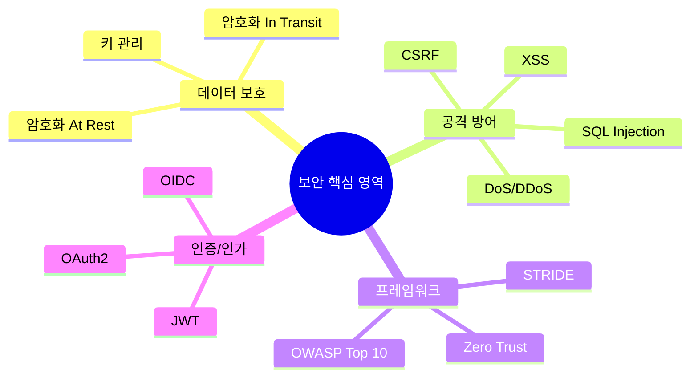

---

### 2. 데이터 보호 (Securing Data)

#### 암호화 유형 비교

| 유형 | 대상 | 암호화 방식 | 도구/기술 |
|------|------|------------|----------|
| **At Rest** | 저장된 데이터 (DB, 파일, 백업) | 대칭키 암호화 (AES) | JCE, BCrypt, AWS KMS, HashiCorp Vault |
| **In Transit** | 전송 중 데이터 (네트워크) | 공개키 암호화 (TLS) | HTTPS, Istio, Linkerd |

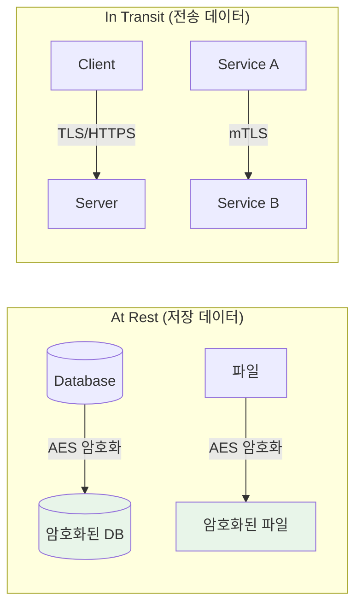

> 💬 **비유**: At Rest 암호화는 금고에 보관된 중요 서류를 잠그는 것이고, In Transit 암호화는 현금 수송차가 이동 중 보안을 유지하는 것과 같다.

---

### 3. 일반적인 보안 위협과 방어

#### 3.1 DoS/DDoS 공격 방어

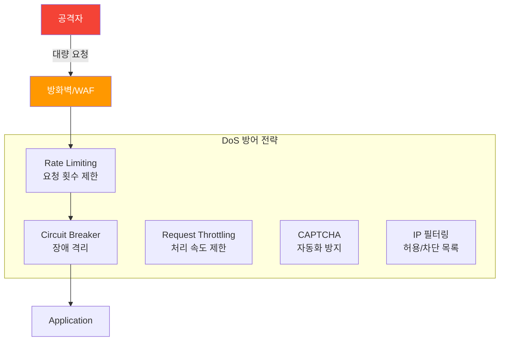

**Spring Security IP 필터링 예시:**

```java
/**
 * 관리자 엔드포인트에 대한 IP 기반 접근 제어
 * 특정 IP에서만 /admin/** 경로 접근 허용
 */
@Bean
public SecurityFilterChain filterChain(HttpSecurity http) throws Exception {
    http.authorizeHttpRequests(authorize -> authorize
            // 관리자 경로는 특정 IP만 허용
            .requestMatchers("/admin/**").hasIpAddress("192.168.1.100")
            // 나머지는 인증된 사용자만
            .anyRequest().authenticated()
    );
    return http.build();
}
```

#### 3.2 SQL Injection 방어

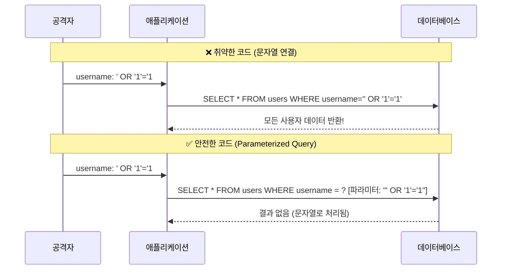

**안전한 쿼리 작성:**

```java
// ❌ 취약: 문자열 연결
String sql = "SELECT * FROM users WHERE username = '" + username + "'";

// ✅ 안전: Parameterized Query (PreparedStatement)
String sql = "SELECT * FROM users WHERE id = ?";
jdbcTemplate.query(sql, new Object[]{userId}, rowMapper);

// ✅ 안전: JPA/Hibernate
@Query("SELECT u FROM User u WHERE u.username = :username")
User findByUsername(@Param("username") String username);
```

#### 3.3 XSS (Cross-Site Scripting) 방어

**출력 인코딩으로 방어:**

```html
<!-- ❌ 취약: 사용자 입력을 그대로 출력 -->
<div>${userComment}</div>
<!-- 공격자가 <script>alert('XSS')</script> 입력 시 스크립트 실행 -->

<!-- ✅ 안전: Thymeleaf th:text 사용 (자동 이스케이프) -->
<p th:text="${userComment}"></p>
<!-- <, >, & 등 특수문자가 이스케이프되어 일반 텍스트로 표시 -->
```

#### 3.4 CSRF (Cross-Site Request Forgery) 방어

```java
/**
 * CSRF 보호 설정
 * 상태 유지 웹 애플리케이션에서는 활성화 권장
 * 상태 비저장 API(토큰 기반 인증)에서는 비활성화 가능
 */
@Bean
public SecurityFilterChain filterChain(HttpSecurity http) throws Exception {
    // CSRF 보호 활성화 (기본값)
    http.csrf(csrf -> csrf
            .csrfTokenRepository(CookieCsrfTokenRepository.withHttpOnlyFalse())
    );

    // 또는 REST API의 경우 비활성화
    // http.csrf(csrf -> csrf.disable());

    return http.build();
}
```

**폼에 CSRF 토큰 포함:**

```html
<!-- Thymeleaf에서 자동으로 CSRF 토큰 추가 -->
<form th:action="@{/submit}" method="post">
    <input type="hidden" th:name="${_csrf.parameterName}"
           th:value="${_csrf.token}" />
    <!-- 폼 필드들 -->
    <button type="submit">제출</button>
</form>
```

#### 보안 위협 요약 표

| 위협 | 설명 | 주요 방어 기법 |
|------|------|---------------|
| **DoS/DDoS** | 과도한 요청으로 서비스 마비 | Rate Limiting, Circuit Breaker, WAF |
| **SQL Injection** | 악성 SQL 코드 삽입 | Parameterized Query, ORM 사용 |
| **XSS** | 악성 스크립트 삽입 | Output Encoding, CSP 헤더 |
| **CSRF** | 인증된 세션 도용 | CSRF Token, SameSite Cookie |

---

### 4. 보안 프레임워크

#### 4.1 Zero Trust Architecture (ZTA)

**핵심 원칙: "Never Trust, Always Verify"**

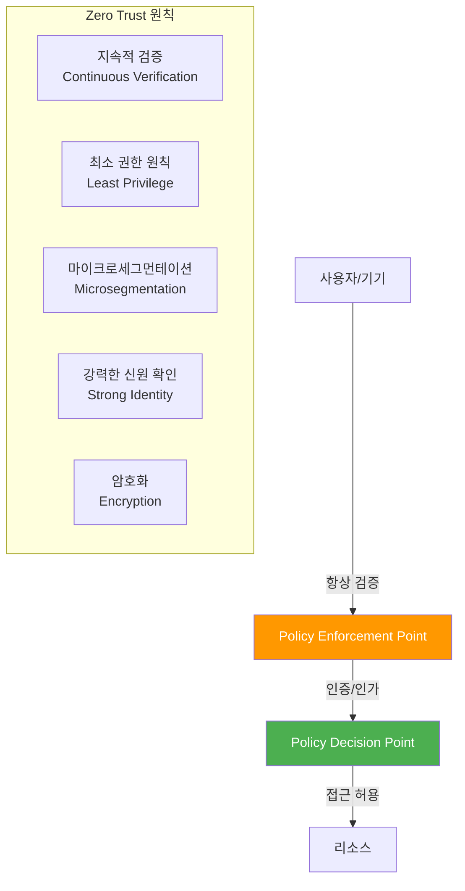

#### 4.2 STRIDE 위협 모델링

| 위협 | 설명 | 예시 |
|------|------|------|
| **S**poofing | 신원 위장 | 자격 증명 도용, 토큰 위조 |
| **T**ampering | 데이터 변조 | 전송 중 데이터 수정 |
| **R**epudiation | 부인 | 행위 증거 없음, 로깅 부재 |
| **I**nformation Disclosure | 정보 노출 | 민감 데이터 유출 |
| **D**enial of Service | 서비스 거부 | 시스템 과부하 |
| **E**levation of Privilege | 권한 상승 | 관리자 권한 획득 |

#### 4.3 OWASP Top 10 (2021)

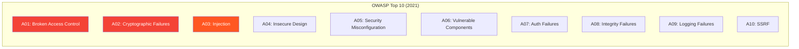

| 순위 | 취약점 | 설명 |
|------|--------|------|
| A01 | **Broken Access Control** | 권한 없는 리소스 접근 |
| A02 | **Cryptographic Failures** | 암호화 실패, 민감 데이터 노출 |
| A03 | **Injection** | SQL, XSS 등 악성 코드 삽입 |
| A04 | **Insecure Design** | 설계 단계 보안 결함 |
| A05 | **Security Misconfiguration** | 잘못된 보안 설정 |
| A06 | **Vulnerable Components** | 취약한 라이브러리 사용 |
| A07 | **Identification & Auth Failures** | 인증 메커니즘 결함 |
| A08 | **Software & Data Integrity Failures** | 무결성 검증 실패 |
| A09 | **Security Logging & Monitoring Failures** | 로깅/모니터링 부재 |
| A10 | **Server-Side Request Forgery** | 서버 측 요청 위조 |

---

### 5. OAuth2와 OIDC

#### 5.1 Entity vs Identity

| 구분 | Entity (엔티티) | Identity (신원) |
|------|----------------|-----------------|
| **정의** | 시스템에서 표현되는 객체 | 엔티티를 식별하는 속성 |
| **예시** | 사용자, 기기, 애플리케이션 | 사용자명, 이메일, 토큰 |
| **인증 관련** | 인증 정보 포함하지 않음 | 인증/식별 과정에 직접 사용 |

#### 5.2 Authentication vs Authorization

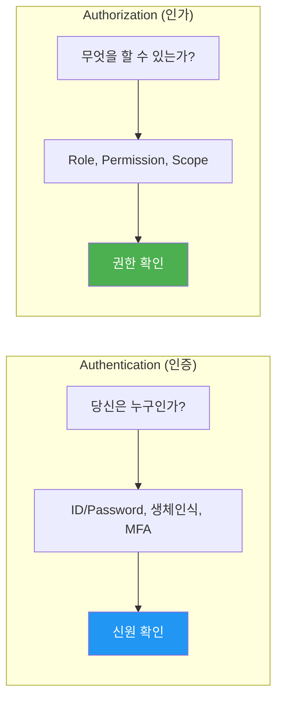

> 💬 **비유**:
> - **인증**: 콘서트장 입구에서 신분증으로 본인 확인
> - **인가**: 티켓으로 VIP 구역 접근 권한 확인

#### 5.3 OAuth2 프레임워크

**OAuth2 핵심 구성 요소:**

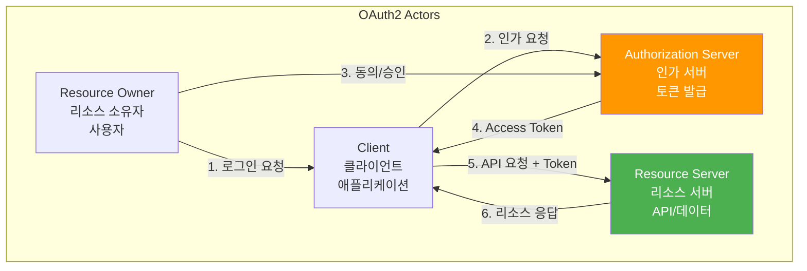

#### OAuth2 Grant Types

| Grant Type | 사용 시나리오 | 특징 |
|------------|-------------|------|
| **Authorization Code** | 서버 사이드 웹 앱 | 가장 안전, 토큰이 서버에 저장 |
| **Authorization Code + PKCE** | SPA, 모바일 앱 | 코드 가로채기 방지 |
| **Client Credentials** | 서버 간 통신 (M2M) | 사용자 개입 없음 |
| **Refresh Token** | 토큰 갱신 | Access Token 만료 시 사용 |
| **Device Code** | IoT, 스마트 TV | 입력 제한 기기용 |
| ~~Implicit~~ | ~~SPA~~ | ⚠️ **사용 중단** (PKCE로 대체) |
| ~~ROPC~~ | ~~신뢰할 수 있는 앱~~ | ⚠️ **비권장** (보안 취약) |

**Authorization Code Flow:**

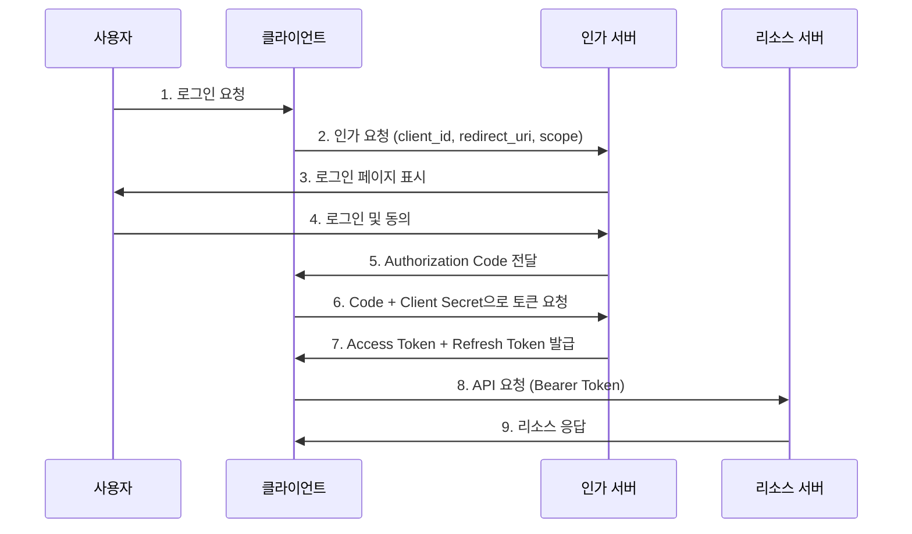

#### 5.4 OIDC (OpenID Connect)

**OIDC = OAuth2 + 인증 계층**

| 구분 | OAuth2 | OIDC |
|------|--------|------|
| **목적** | 인가 (Authorization) | 인증 (Authentication) |
| **토큰** | Access Token, Refresh Token | + **ID Token** |
| **Scope** | read, write 등 | + **openid**, profile, email |
| **정보** | 리소스 접근 권한 | + 사용자 신원 정보 |

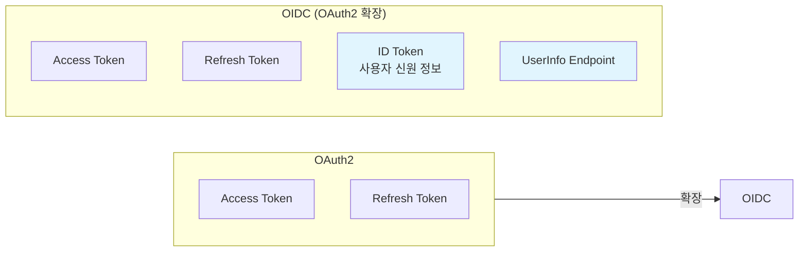

---

### 6. Spring Authorization Server 구현

#### 6.1 아키텍처 개요

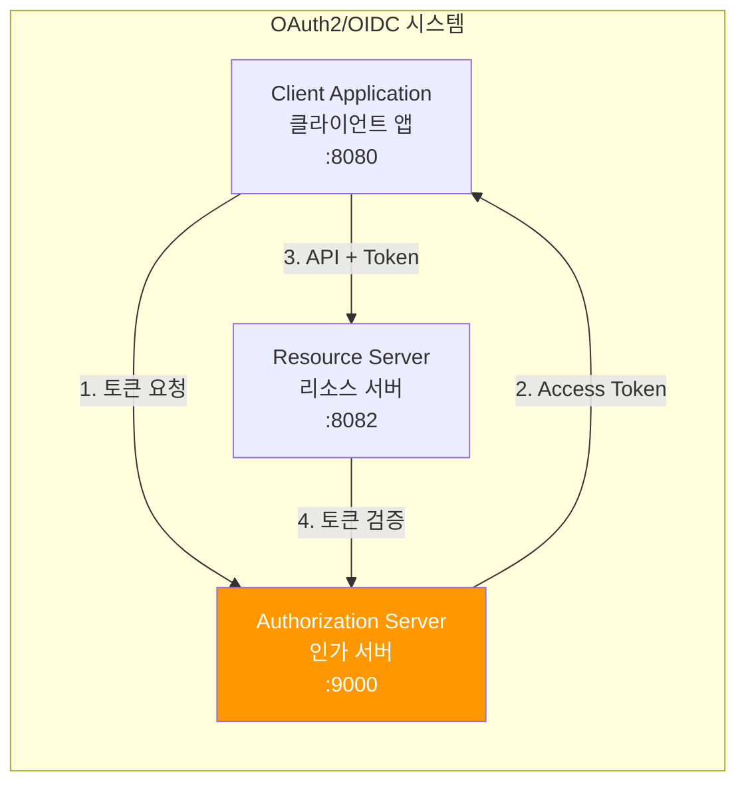

#### 6.2 Authorization Server 구현

**의존성:**

```xml
<dependency>
    <groupId>org.springframework.boot</groupId>
    <artifactId>spring-boot-starter-oauth2-authorization-server</artifactId>
</dependency>
<dependency>
    <groupId>org.springframework.boot</groupId>
    <artifactId>spring-boot-starter-security</artifactId>
</dependency>
```

**Security Filter Chain 설정:**

```java
/**
 * OAuth2 Authorization Server 보안 설정
 */
@Configuration
public class SecurityFilterConfig {

    /**
     * Authorization Server 전용 보안 필터 체인
     * OAuth2/OIDC 엔드포인트 보안 설정
     */
    @Order(1)
    @Bean
    SecurityFilterChain authorizationServerSecurityFilterChain(HttpSecurity http)
            throws Exception {
        // OAuth2 기본 보안 설정 적용
        OAuth2AuthorizationServerConfiguration.applyDefaultSecurity(http);

        // OIDC 활성화
        http.getConfigurer(OAuth2AuthorizationServerConfigurer.class)
                .oidc(Customizer.withDefaults());

        // 미인증 사용자는 로그인 페이지로 리다이렉트
        http.exceptionHandling(exceptions -> exceptions
                .authenticationEntryPoint(new LoginUrlAuthenticationEntryPoint("/login")));

        // JWT 토큰 검증을 위한 리소스 서버 기능 활성화
        http.oauth2ResourceServer(conf -> conf.jwt(Customizer.withDefaults()));

        return http.build();
    }

    /**
     * 기본 보안 필터 체인
     * 모든 요청에 인증 필요, 폼 로그인 활성화
     */
    @Order(2)
    @Bean
    SecurityFilterChain defaultSecurityFilterChain(HttpSecurity http) throws Exception {
        http.authorizeHttpRequests(authorize -> authorize
                        .anyRequest().authenticated())
                .formLogin(Customizer.withDefaults());
        return http.build();
    }
}
```

**Registered Client 설정:**

```java
/**
 * OAuth2 클라이언트 등록 설정
 */
@Configuration
public class RegisteredClientConfig {

    @Bean
    RegisteredClientRepository registeredClientRepository() {
        RegisteredClient registeredClient = RegisteredClient
                .withId(UUID.randomUUID().toString())
                .clientId("client-application")
                .clientSecret("{bcrypt}$2a$10$...")  // BCrypt 해시
                // 클라이언트 인증 방식
                .clientAuthenticationMethod(ClientAuthenticationMethod.CLIENT_SECRET_BASIC)
                // 지원하는 Grant Type
                .authorizationGrantType(AuthorizationGrantType.AUTHORIZATION_CODE)
                .authorizationGrantType(AuthorizationGrantType.REFRESH_TOKEN)
                // 리다이렉트 URI (클라이언트가 코드를 받을 주소)
                .redirectUri("http://127.0.0.1:8080/login/oauth2/code/client-server-oidc")
                // OIDC 스코프
                .scope(OidcScopes.OPENID)
                .scope(OidcScopes.PROFILE)
                // 사용자 동의 화면 필요
                .clientSettings(ClientSettings.builder()
                        .requireAuthorizationConsent(true)
                        .build())
                .build();

        return new InMemoryRegisteredClientRepository(registeredClient);
    }
}
```

**JWT 토큰 설정:**

```java
/**
 * JWT 토큰 서명 및 검증 설정
 */
@Configuration
public class JwtTokenConfig {

    /**
     * JWT 서명을 위한 RSA 키 쌍 제공
     * Private Key: 토큰 서명
     * Public Key: 토큰 검증
     */
    @Bean
    JWKSource<SecurityContext> jwkSource() {
        KeyPair keyPair = generateRsaKey();
        RSAPublicKey publicKey = (RSAPublicKey) keyPair.getPublic();
        RSAPrivateKey privateKey = (RSAPrivateKey) keyPair.getPrivate();

        RSAKey rsaKey = new RSAKey.Builder(publicKey)
                .privateKey(privateKey)
                .keyID(UUID.randomUUID().toString())
                .build();

        JWKSet jwkSet = new JWKSet(rsaKey);
        return new ImmutableJWKSet<>(jwkSet);
    }

    /**
     * JWT 토큰 디코더
     * 리소스 서버가 토큰을 검증할 때 사용
     */
    @Bean
    JwtDecoder jwtDecoder(JWKSource<SecurityContext> jwkSource) {
        return OAuth2AuthorizationServerConfiguration.jwtDecoder(jwkSource);
    }

    private KeyPair generateRsaKey() {
        try {
            KeyPairGenerator keyPairGenerator = KeyPairGenerator.getInstance("RSA");
            keyPairGenerator.initialize(2048);
            return keyPairGenerator.generateKeyPair();
        } catch (Exception ex) {
            throw new IllegalStateException(ex);
        }
    }
}
```

#### 6.3 Client Application 구현

**application.yaml:**

```yaml
spring:
  security:
    oauth2:
      client:
        registration:
          client-server-oidc:  # registrationId
            provider: spring
            client-id: client-application
            client-secret: secret
            authorization-grant-type: authorization_code
            redirect-uri: "http://127.0.0.1:8080/login/oauth2/code/{registrationId}"
            scope: openid, profile
            client-name: client-application-oidc
        provider:
          spring:
            issuer-uri: http://localhost:9000  # Authorization Server 주소
```

**Controller에서 토큰 사용:**

```java
/**
 * OAuth2 클라이언트 애플리케이션 Controller
 */
@RestController
@RequiredArgsConstructor
public class ProductController {

    private final RestClient restClient;

    /**
     * Resource Server에서 상품 목록 조회
     * @RegisteredOAuth2AuthorizedClient로 자동 토큰 주입
     */
    @GetMapping("/products")
    public ProductResponse getProducts(
            @RegisteredOAuth2AuthorizedClient("client-server-oidc")
            OAuth2AuthorizedClient client) {

        // Access Token을 Bearer 헤더에 포함하여 API 호출
        return restClient.get()
                .uri("http://127.0.0.1:8082/v1/products")
                .header("Authorization", "Bearer " + client.getAccessToken().getTokenValue())
                .retrieve()
                .body(ProductResponse.class);
    }
}
```

#### 6.4 Resource Server 구현

**의존성:**

```xml
<dependency>
    <groupId>org.springframework.boot</groupId>
    <artifactId>spring-boot-starter-oauth2-resource-server</artifactId>
</dependency>
<dependency>
    <groupId>org.springframework.security</groupId>
    <artifactId>spring-security-oauth2-jose</artifactId>
</dependency>
```

**application.yaml:**

```yaml
spring:
  security:
    oauth2:
      resourceserver:
        jwt:
          # Authorization Server의 issuer-uri
          # 여기서 공개키를 가져와 토큰 검증
          issuer-uri: http://localhost:9000
```

---

## 🔍 심화 학습

### JWT vs Opaque Token

| 특성 | JWT (Self-contained) | Opaque Token |
|------|---------------------|--------------|
| **검증 방식** | 자체 검증 (서명 확인) | 인가 서버에 검증 요청 |
| **정보 포함** | 클레임 정보 포함 | 정보 없음 (참조용) |
| **네트워크** | 검증 시 네트워크 불필요 | 매번 인가 서버 호출 |
| **토큰 폐기** | 만료까지 유효 (취소 어려움) | 즉시 폐기 가능 |
| **크기** | 상대적으로 큼 | 작음 |

### PKCE (Proof Key for Code Exchange)

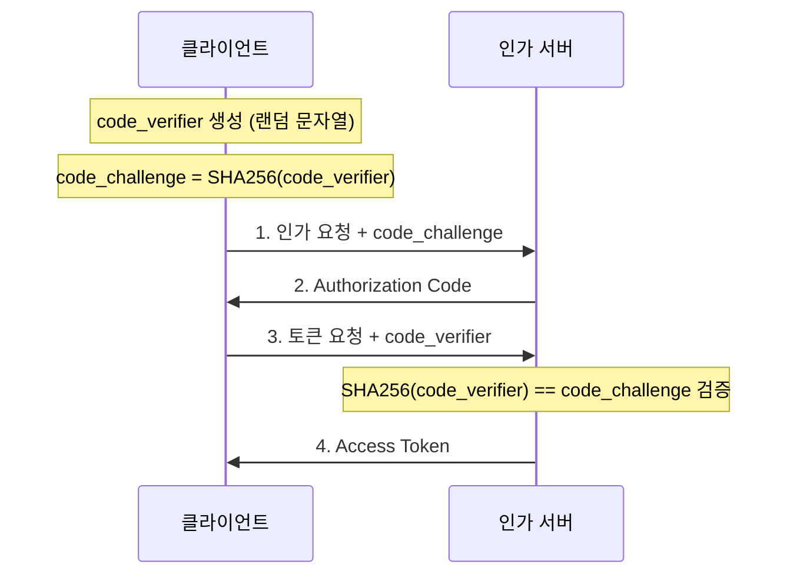

**PKCE 장점:**
- Authorization Code 가로채기 공격 방지
- SPA, 모바일 앱 등 Public Client에 필수
- Client Secret 없이 안전한 인증 가능

### 출처

- [Spring Authorization Server 공식 문서](https://docs.spring.io/spring-authorization-server/reference/)
- [OAuth 2.0 RFC 6749](https://datatracker.ietf.org/doc/html/rfc6749)
- [OpenID Connect 스펙](https://openid.net/specs/openid-connect-core-1_0.html)
- [OWASP Top 10](https://owasp.org/www-project-top-ten/)
- [NIST Zero Trust Architecture](https://www.nist.gov/publications/zero-trust-architecture)

---

## 💡 실무 적용 포인트

### 이런 상황에서 사용하세요

**Spring Authorization Server:**
- 자체 인증/인가 시스템 구축
- 마이크로서비스 간 보안 통신
- SSO(Single Sign-On) 구현
- 서드파티 API 접근 제어

**Grant Type 선택 가이드:**
| 시나리오 | 권장 Grant Type |
|---------|----------------|
| 웹 애플리케이션 (서버 사이드) | Authorization Code |
| SPA / 모바일 앱 | Authorization Code + **PKCE** |
| 백엔드 서비스 간 통신 | Client Credentials |
| IoT / 스마트 TV | Device Code |

### 주의할 점 / 흔한 실수

- ⚠️ **Client Secret 노출**: SPA/모바일에서 Client Secret 사용 금지 → PKCE 사용
  ```yaml
  # ❌ 잘못된 설정: 프론트엔드에 secret 포함
  # ✅ 올바른 설정: PKCE 사용, secret 없음
  ```

- ⚠️ **HTTPS 미사용**: 토큰 전송 시 반드시 HTTPS 사용
- ⚠️ **토큰 저장 위치**:
  - Access Token: 메모리 또는 HttpOnly Cookie
  - ❌ localStorage/sessionStorage (XSS 취약)

- ⚠️ **Scope 과다 요청**: 필요한 최소 권한만 요청 (Least Privilege)
- ⚠️ **토큰 만료 시간**: Access Token은 짧게 (15분~1시간), Refresh Token으로 갱신

### 면접에서 나올 수 있는 질문

- **Q: OAuth2와 OIDC의 차이점은?**
  - A: OAuth2는 **인가(Authorization)** 프레임워크로 리소스 접근 권한을 위임. OIDC는 OAuth2 위에 **인증(Authentication)** 계층을 추가하여 ID Token을 통해 사용자 신원 확인 가능

- **Q: Access Token과 Refresh Token의 역할 차이는?**
  - A: Access Token은 리소스 접근용 (짧은 수명), Refresh Token은 새 Access Token 발급용 (긴 수명). Access Token 탈취 시 피해 최소화를 위해 분리

- **Q: PKCE가 필요한 이유는?**
  - A: SPA/모바일 앱은 Client Secret을 안전하게 저장할 수 없음. PKCE는 동적 생성된 code_verifier/code_challenge로 Authorization Code 가로채기 공격 방지

- **Q: SQL Injection을 방지하는 방법은?**
  - A: Parameterized Query(PreparedStatement) 사용, ORM 활용, 입력 검증. 문자열 연결로 SQL 생성 금지

---

## ✅ 핵심 개념 체크리스트

- [ ] At Rest와 In Transit 암호화의 차이를 설명할 수 있는가?
- [ ] SQL Injection, XSS, CSRF 공격의 원리와 방어법을 알고 있는가?
- [ ] OWASP Top 10의 주요 취약점을 나열할 수 있는가?
- [ ] OAuth2의 핵심 구성요소(Resource Owner, Client, AS, RS)를 이해하는가?
- [ ] Authorization Code, Client Credentials, PKCE Grant Type을 구분할 수 있는가?
- [ ] OAuth2와 OIDC의 차이(인가 vs 인증, ID Token)를 설명할 수 있는가?
- [ ] Spring Authorization Server의 구성 요소(SecurityFilterChain, RegisteredClient, JwtTokenConfig)를 알고 있는가?

---

## 🔗 참고 자료

- 📄 Spring Authorization Server: [https://docs.spring.io/spring-authorization-server/reference/](https://docs.spring.io/spring-authorization-server/reference/)
- 📄 OAuth 2.0 RFC 6749: [https://datatracker.ietf.org/doc/html/rfc6749](https://datatracker.ietf.org/doc/html/rfc6749)
- 📄 OWASP: [https://owasp.org/](https://owasp.org/)
- 📄 NIST ZTA: [https://www.nist.gov/publications/zero-trust-architecture](https://www.nist.gov/publications/zero-trust-architecture)
- 📚 연관 서적: "OAuth 2.0 in Action" - Justin Richer
- 🎬 추천 영상: [Spring Security OAuth2 - Amigoscode](https://www.youtube.com/watch?v=X80nJ5T7YpE)

---
