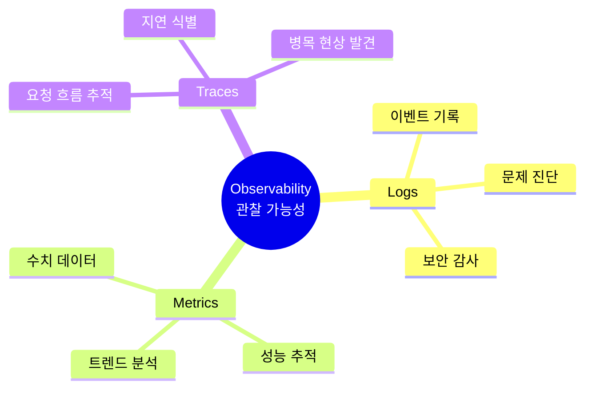
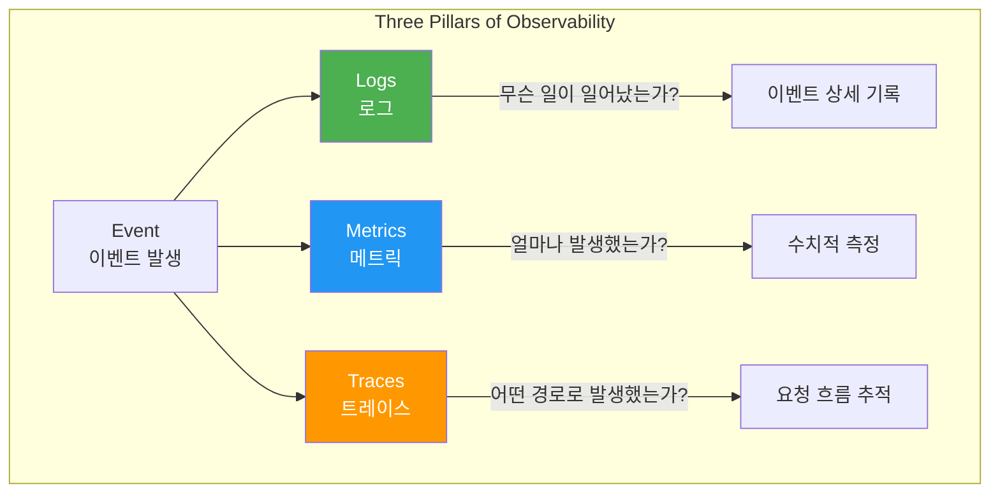
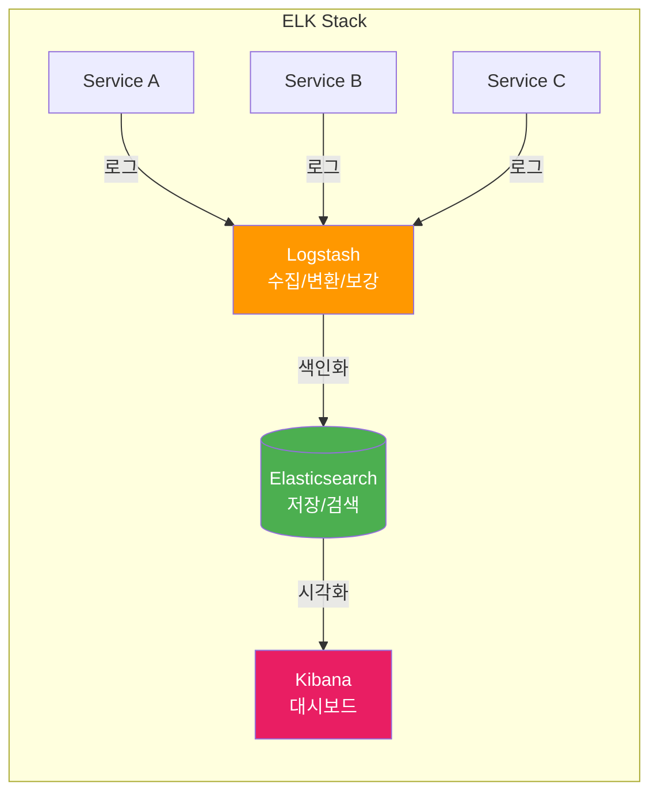
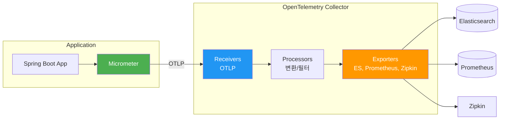
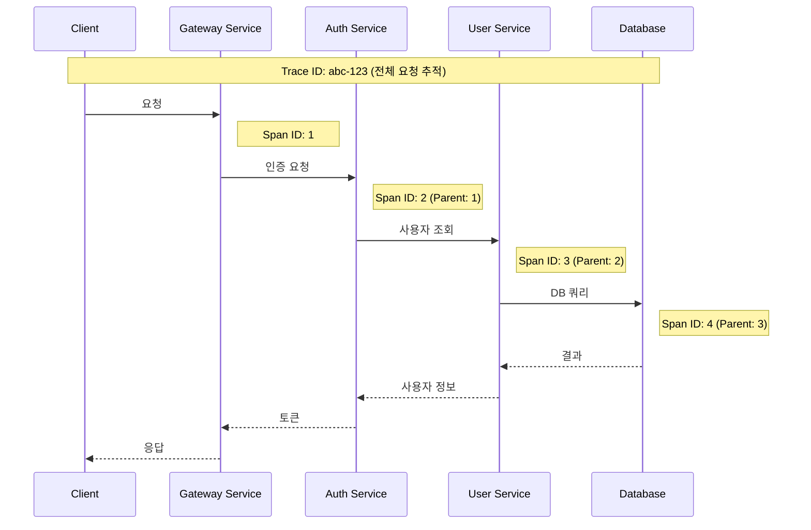
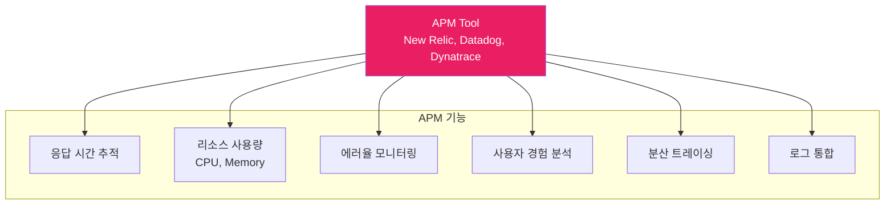
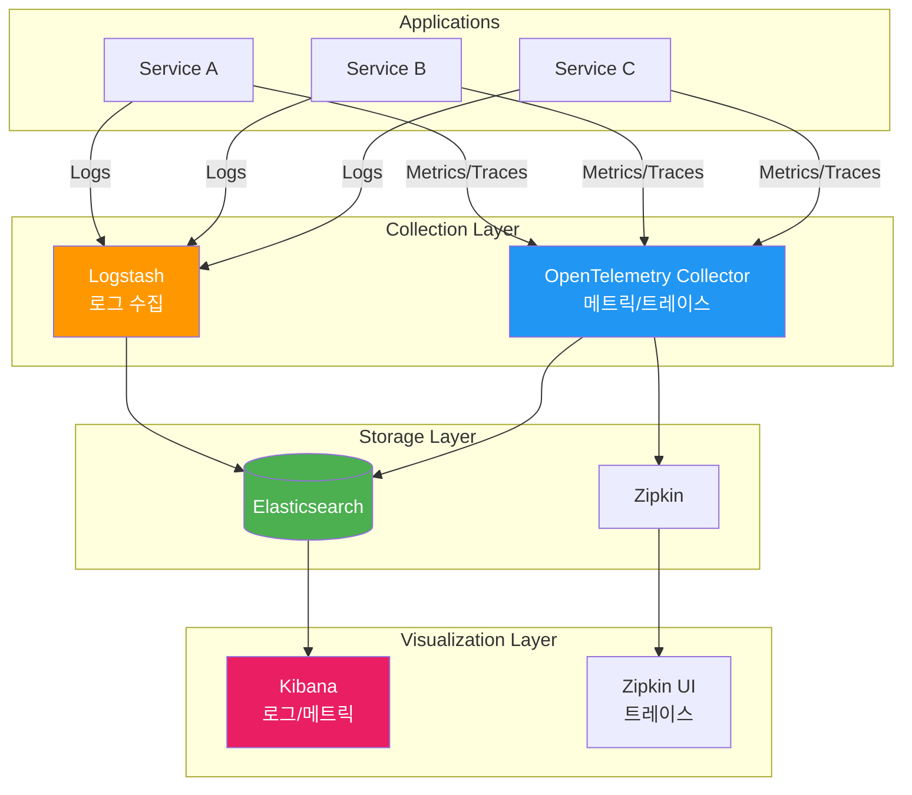

# 11. 관찰 가능성 (Observability)

---

## 📌 핵심 요약

> 이 장에서는 마이크로서비스와 분산 아키텍처에서 필수적인 **관찰 가능성(Observability)**의 세 가지 핵심 요소인 **로그(Logs)**, **메트릭(Metrics)**, **트레이스(Traces)**를 다룬다. ELK 스택, Micrometer, OpenTelemetry, Zipkin을 활용한 구현 방법과 New Relic을 통한 APM(Application Performance Monitoring) 통합을 학습한다.

---

## 🎯 학습 목표

이 내용을 읽고 나면:
- [ ] 관찰 가능성의 세 가지 핵심 요소(Logs, Metrics, Traces)를 설명할 수 있다
- [ ] ELK 스택을 활용한 중앙 집중식 로깅 시스템을 구축할 수 있다
- [ ] Micrometer와 OpenTelemetry로 메트릭을 수집하고 내보낼 수 있다
- [ ] Zipkin을 활용한 분산 트레이싱을 구현할 수 있다
- [ ] APM 도구와 오픈소스 도구의 차이점을 비교할 수 있다

---

## 📖 본문 정리

### 1. 관찰 가능성(Observability)이란?

관찰 가능성은 시스템의 **외부 출력(로그, 메트릭, 트레이스)**을 분석하여 **내부 상태를 파악**하는 능력이다. 기존 모니터링이 사전 정의된 메트릭(CPU, 메모리 등)을 추적하는 것과 달리, 관찰 가능성은 더 깊은 통찰력을 제공한다.



#### 모니터링 vs 관찰 가능성

| 구분 | 전통적 모니터링 | 관찰 가능성 |
|------|---------------|------------|
| **접근 방식** | 사전 정의된 메트릭 추적 | 시스템 상태 종합 분석 |
| **문제 해결** | "무엇이" 잘못되었는지 알림 | "왜" 잘못되었는지 파악 |
| **데이터** | 임계값 기반 알림 | 로그, 메트릭, 트레이스 상관 분석 |
| **복잡성** | 단일 시스템에 적합 | 분산 시스템 필수 |

> 💬 **비유**: 모니터링은 자동차 계기판(속도, 연료 등)을 보는 것이고, 관찰 가능성은 자동차의 모든 센서 데이터를 분석하여 엔진 내부 상태까지 파악하는 것이다.

---

### 2. 세 가지 핵심 요소 (Three Pillars)



#### 응답 시간 50ms 예시로 이해하기

| 요소 | 역할 | 50ms 응답 시간 분석 |
|------|------|-------------------|
| **Logs** | 이벤트 기록 | 요청 시작/종료 시간, 수행된 작업 기록 |
| **Metrics** | 수치 측정 | 50ms가 평균 대비 빠른지/느린지 평가, 시간별 패턴 분석 |
| **Traces** | 경로 추적 | DB 호출 30ms + API 호출 15ms + 로직 5ms 상세 분해 |

---

### 3. ELK 스택을 활용한 로그 관리

#### ELK 스택 구성



| 컴포넌트 | 역할 | 주요 기능 |
|---------|------|----------|
| **Elasticsearch** | 저장/검색 엔진 | 분산 아키텍처, 실시간 인덱싱, 풀텍스트 검색, 집계/분석 |
| **Logstash** | 데이터 파이프라인 | 다양한 소스 수집, 필터링/변환, 다중 출력 |
| **Kibana** | 시각화 도구 | 대시보드, 차트, 실시간 모니터링, 알림 |

#### Logstash 설정 (logstash.conf)

```conf
# 입력 블록: 로그 수신 방식 정의
input {
  tcp {
    port => 5000           # TCP 5000 포트에서 수신
    codec => json_lines    # JSON 형식 파싱
  }
}

# 필터 블록: 로그 처리/변환
filter {
  json {
    source => "message"    # message 필드의 JSON 파싱
  }
}

# 출력 블록: 처리된 로그 전송
output {
  elasticsearch {
    hosts => ["elasticsearch:9200"]
    index => "online-auction-logs-%{+YYYY.MM.dd}"  # 일별 인덱스 생성
  }
  stdout { codec => rubydebug }  # 디버깅용 콘솔 출력
}
```

#### Spring Boot + Logback 연동

**의존성 추가:**

```xml
<dependency>
    <groupId>net.logstash.logback</groupId>
    <artifactId>logstash-logback-encoder</artifactId>
    <version>8.0</version>
</dependency>
```

**logback-spring.xml 설정:**

```xml
<configuration>
    <!-- Logstash TCP 연결 Appender -->
    <appender name="LOGSTASH"
              class="net.logstash.logback.appender.LogstashTcpSocketAppender">
        <!-- Logstash 서버 주소 -->
        <destination>localhost:5000</destination>

        <!-- JSON 형식으로 인코딩 -->
        <encoder class="net.logstash.logback.encoder.LoggingEventCompositeJsonEncoder">
            <providers>
                <timestamp/>
                <logLevel/>
                <loggerName/>
                <message/>
                <stackTrace/>
                <mdc/>  <!-- MDC 컨텍스트 정보 포함 -->
            </providers>
        </encoder>
    </appender>

    <!-- INFO 레벨 이상 로그를 Logstash로 전송 -->
    <root level="INFO">
        <appender-ref ref="LOGSTASH"/>
    </root>
</configuration>
```

**Controller에서 로깅:**

```java
/**
 * 인증 컨트롤러
 * @Slf4j: Lombok의 로깅 어노테이션 (SLF4J Logger 자동 생성)
 */
@Slf4j
@RestController
@RequestMapping("/v1/api/auth")
public class AuthenticationController {

    @PostMapping
    public ResponseEntity<AuthenticationResponse> createToken(
            @RequestBody AuthenticationRequest request) {

        // 로그가 자동으로 Logstash → Elasticsearch → Kibana로 전송
        log.info("START PROCESS OF AUTHENTICATION");

        Optional<String> token = generateTokenUseCase.execute(
                request.getUsername(),
                request.getPassword());

        log.info("END PROCESS OF AUTHENTICATION");

        return ResponseEntity.ok(new AuthenticationResponse(token.get()));
    }
}
```

---

### 4. Micrometer와 OpenTelemetry를 활용한 메트릭 관리

#### OpenTelemetry 아키텍처



#### Micrometer vs OpenTelemetry

| 도구 | 역할 | 특징 |
|------|------|------|
| **Micrometer** | 메트릭 수집 | Spring Boot 기본 통합, 다양한 모니터링 시스템 지원 |
| **OpenTelemetry** | 텔레메트리 통합 | 벤더 중립, Logs/Metrics/Traces 통합, 표준 프로토콜 |

#### OpenTelemetry Collector 설정

```yaml
# otel-collector-config.yml
receivers:
  otlp:
    protocols:
      http:
        endpoint: "0.0.0.0:4318"  # HTTP OTLP 수신

processors:
  # 누적 메트릭을 델타 메트릭으로 변환
  cumulativetodelta: {}

  # 특정 메트릭 제외
  filter:
    metrics:
      exclude:
        match_type: regexp
        metric_names:
          - "jvm.gc.pause"  # GC pause 메트릭 제외

exporters:
  elasticsearch:
    endpoints: ["http://elasticsearch:9200"]

service:
  pipelines:
    metrics:
      receivers: [otlp]
      processors: [cumulativetodelta, filter]
      exporters: [elasticsearch]
```

#### Spring Boot 메트릭 설정

**의존성 추가:**

```xml
<dependency>
    <groupId>io.micrometer</groupId>
    <artifactId>micrometer-registry-otlp</artifactId>
    <scope>runtime</scope>
</dependency>
```

**application.properties:**

```properties
# 모든 Actuator 엔드포인트 노출
management.endpoints.web.exposure.include=*

# OTLP 메트릭 내보내기 활성화
management.otlp.metrics.export.enabled=true

# OpenTelemetry Collector 엔드포인트
management.otlp.metrics.export.url=http://localhost:4318/v1/metrics

# 메트릭 수집/전송 간격 (10초)
management.otlp.metrics.export.step=10s
```

---

### 5. Zipkin을 활용한 분산 트레이싱

#### 분산 트레이싱 핵심 개념



| 개념 | 설명 | 예시 |
|------|------|------|
| **Trace ID** | 전체 요청 추적 식별자 | `abc-123` (요청 전체에 동일) |
| **Span ID** | 개별 서비스 작업 식별자 | 각 서비스 호출마다 생성 |
| **Parent Span** | 호출한 상위 Span | Span 간 인과 관계 표현 |

#### OpenTelemetry + Zipkin 설정

**otel-collector-config.yml (트레이싱 추가):**

```yaml
receivers:
  otlp:
    protocols:
      http:
        endpoint: "0.0.0.0:4318"

exporters:
  # Zipkin으로 트레이스 내보내기
  zipkin:
    endpoint: "http://zipkin:9411/api/v2/spans"

service:
  pipelines:
    # 트레이스 파이프라인
    traces:
      receivers: [otlp]
      exporters: [zipkin]
```

#### Spring Boot 트레이싱 설정

**의존성 추가:**

```xml
<!-- Micrometer-OpenTelemetry 브릿지 -->
<dependency>
    <groupId>io.micrometer</groupId>
    <artifactId>micrometer-tracing-bridge-otel</artifactId>
</dependency>

<!-- OTLP 익스포터 -->
<dependency>
    <groupId>io.opentelemetry</groupId>
    <artifactId>opentelemetry-exporter-otlp</artifactId>
</dependency>
```

**application.properties:**

```properties
# 트레이싱 활성화
management.tracing.enabled=true

# 샘플링 비율 (1.0 = 100% 모든 요청 추적)
management.tracing.sampling.probability=1.0

# OpenTelemetry Collector 트레이스 엔드포인트
management.otlp.tracing.endpoint=http://localhost:4318/v1/traces
```

#### Zipkin UI 기능

| 기능 | 설명 |
|------|------|
| **Trace 검색** | 시간대별 요청 목록 조회 |
| **Trace 상세** | 각 Span의 소요 시간, 서비스 정보 확인 |
| **Dependencies** | 서비스 간 의존성 다이어그램 시각화 |
| **Latency 분석** | 병목 구간 식별 |

---

### 6. APM (Application Performance Monitoring)

#### APM이란?

APM은 애플리케이션의 **성능과 가용성**을 모니터링하고 관리하는 도구와 실천 방법의 집합이다. 로그, 메트릭, 트레이스를 통합하여 종합적인 애플리케이션 상태를 제공한다.



#### 오픈소스 vs APM 도구 비교

| 기준 | 오픈소스 (ELK + Zipkin) | APM (New Relic) |
|------|------------------------|-----------------|
| **비용** | 무료 (인프라 비용만) | 유료 SaaS |
| **설정 복잡도** | 높음 (수동 구성) | 낮음 (에이전트 설치) |
| **통합** | 개별 도구 연동 필요 | 올인원 솔루션 |
| **유연성** | 높음 (커스터마이징 가능) | 제한적 |
| **유지보수** | 직접 관리 | 벤더 관리 |
| **기능** | 기본 기능 | 고급 분석, AI 기반 인사이트 |
| **벤더 종속** | 없음 | 있음 |

#### New Relic 연동

**1. Java Agent 다운로드:**

```bash
curl -O https://download.newrelic.com/newrelic/java-agent/newrelic-agent/current/newrelic-java.zip
unzip newrelic-java.zip
```

**2. newrelic.yml 설정:**

```yaml
common: &default_settings
  license_key: 'YOUR_LICENSE_KEY'
  app_name: authentication-services
  log_level: info

development:
  <<: *default_settings

production:
  <<: *default_settings
```

**3. 애플리케이션 실행:**

```bash
java -javaagent:/path/to/newrelic/newrelic.jar \
     -Dnewrelic.config.file=/path/to/newrelic/newrelic-authentication-services.yml \
     -jar authentication-services.jar
```

---

### 7. 전체 관찰 가능성 아키텍처



---

## 🔍 심화 학습

### Sampling 전략

| 전략 | 설명 | 사용 시기 |
|------|------|----------|
| **Always On (1.0)** | 모든 요청 추적 | 개발/테스트 환경 |
| **Probability (0.1)** | 10% 요청만 추적 | 트래픽이 많은 운영 환경 |
| **Rate Limiting** | 초당 N개 요청만 추적 | 비용 최적화 필요 시 |
| **Parent-Based** | 상위 요청의 샘플링 결정 상속 | 분산 시스템 일관성 |

### 구조화된 로깅 (Structured Logging)

```java
// ❌ 비구조화된 로그 (파싱 어려움)
log.info("User " + userId + " logged in from " + ipAddress);

// ✅ 구조화된 로그 (MDC 사용)
MDC.put("userId", userId);
MDC.put("ipAddress", ipAddress);
log.info("User login successful");
MDC.clear();

// JSON 출력 결과:
// {"timestamp":"2025-01-15T10:30:00", "level":"INFO",
//  "message":"User login successful", "userId":"123", "ipAddress":"192.168.1.1"}
```

### 출처

- [OpenTelemetry 공식 문서](https://opentelemetry.io/docs/)
- [Elasticsearch 공식 문서](https://www.elastic.co/guide/index.html)
- [Zipkin 공식 문서](https://zipkin.io/)
- [Micrometer 공식 문서](https://micrometer.io/docs)
- [New Relic 문서](https://docs.newrelic.com/)

---

## 💡 실무 적용 포인트

### 이런 상황에서 사용하세요

**ELK 스택:**
- 중앙 집중식 로그 관리 필요 시
- 로그 기반 분석, 검색, 대시보드 필요 시
- 보안 감사 로그 관리

**OpenTelemetry + Zipkin:**
- 마이크로서비스 간 요청 흐름 추적
- 지연 병목 현상 분석
- 서비스 의존성 파악

**APM (New Relic, Datadog):**
- 빠른 설정이 필요한 경우
- 종합적인 성능 모니터링
- 실시간 알림 및 대시보드

### 주의할 점 / 흔한 실수

- ⚠️ **샘플링 비율**: 운영 환경에서 100% 샘플링은 성능/비용 문제 발생
  ```properties
  # 운영 환경 권장
  management.tracing.sampling.probability=0.1
  ```

- ⚠️ **로그 레벨**: DEBUG 로그가 프로덕션에서 활성화되면 성능 저하
  ```xml
  <!-- 프로덕션에서는 INFO 이상만 -->
  <root level="INFO">
  ```

- ⚠️ **민감 정보 로깅 금지**: 비밀번호, 토큰 등 로그에 포함 금지
  ```java
  // ❌ 절대 금지
  log.info("User password: " + password);

  // ✅ 마스킹 처리
  log.info("Login attempt for user: {}", username);
  ```

- ⚠️ **Trace Context 전파**: 서비스 간 호출 시 Trace ID 전파 확인
  ```java
  // RestClient 사용 시 자동 전파 (Spring Boot 3.x)
  // WebClient 사용 시 tracing 설정 필요
  ```

### 면접에서 나올 수 있는 질문

- **Q: 관찰 가능성(Observability)과 모니터링(Monitoring)의 차이는?**
  - A: 모니터링은 사전 정의된 메트릭으로 "무엇이" 잘못됐는지 알려주고, 관찰 가능성은 로그/메트릭/트레이스를 종합하여 "왜" 잘못됐는지 파악할 수 있게 함

- **Q: 분산 트레이싱에서 Trace ID와 Span ID의 역할은?**
  - A: Trace ID는 전체 요청을 고유하게 식별하고 모든 서비스에서 동일. Span ID는 개별 서비스 작업을 식별하며, Parent Span ID로 인과 관계 표현

- **Q: ELK 스택의 각 구성 요소 역할은?**
  - A: Elasticsearch는 로그 저장/검색 엔진, Logstash는 로그 수집/변환/전송 파이프라인, Kibana는 시각화/대시보드 도구

- **Q: 오픈소스 도구 vs APM 도구를 선택하는 기준은?**
  - A: 오픈소스는 비용 효율적이고 유연하지만 운영 부담이 높음. APM은 빠른 설정과 고급 기능 제공하지만 비용과 벤더 종속 발생. 조직의 규모, 예산, 기술 역량에 따라 선택

---

## ✅ 핵심 개념 체크리스트

- [ ] 관찰 가능성의 세 가지 핵심 요소(Logs, Metrics, Traces)의 역할을 설명할 수 있는가?
- [ ] ELK 스택의 각 구성 요소(Elasticsearch, Logstash, Kibana)를 이해하는가?
- [ ] Micrometer와 OpenTelemetry의 역할 차이를 알고 있는가?
- [ ] Trace ID와 Span ID의 개념과 분산 트레이싱의 원리를 설명할 수 있는가?
- [ ] Spring Boot에서 로그, 메트릭, 트레이스 설정 방법을 알고 있는가?
- [ ] 오픈소스 도구와 APM 도구의 장단점을 비교할 수 있는가?

---

## 🔗 참고 자료

- 📄 OpenTelemetry 공식 문서: [https://opentelemetry.io/docs/](https://opentelemetry.io/docs/)
- 📄 Elastic Stack 문서: [https://www.elastic.co/guide/](https://www.elastic.co/guide/)
- 📄 Zipkin 문서: [https://zipkin.io/](https://zipkin.io/)
- 📄 Micrometer 문서: [https://micrometer.io/docs](https://micrometer.io/docs)
- 📚 연관 서적: "Distributed Systems Observability" - Cindy Sridharan
- 🎬 추천 영상: [Spring Boot Observability - Spring I/O](https://www.youtube.com/watch?v=2m9B2P-s0hg)

---
