# 12장: Testing (테스팅)

---

## 📌 핵심 요약

> 이 장에서는 현대 소프트웨어 개발에서 자동화 테스트의 중요성과 테스트 피라미드(Test Pyramid) 모델을 다룬다. 핵심은 **단위 테스트를 기반으로 통합 테스트와 E2E 테스트를 균형 있게 구성**하여 빠른 피드백과 높은 품질을 동시에 달성하는 것이다. JUnit 5, Mockito, Testcontainers, MockMvc, RestAssured 등의 도구를 활용한 실전 테스트 구현과 TDD/BDD 방법론을 학습한다.

---

## 🎯 학습 목표

이 내용을 읽고 나면:
- [ ] 테스트 피라미드의 각 계층(Unit, Integration, E2E)의 특성과 비율을 설명할 수 있다
- [ ] JUnit 5와 Mockito를 활용한 단위 테스트를 구현할 수 있다
- [ ] Testcontainers를 사용한 통합 테스트를 작성할 수 있다
- [ ] MockMvc와 RestAssured의 차이점과 적절한 사용 시점을 판단할 수 있다
- [ ] JMeter를 활용한 성능 테스트를 수행할 수 있다
- [ ] TDD와 BDD의 개념과 GWT 패턴을 적용할 수 있다

---

## 📖 본문 정리

### 1. 자동화 테스트의 중요성

자동화 테스트는 빠른 개발 사이클, CI/CD 워크플로우를 지원하는 핵심 요소이다.

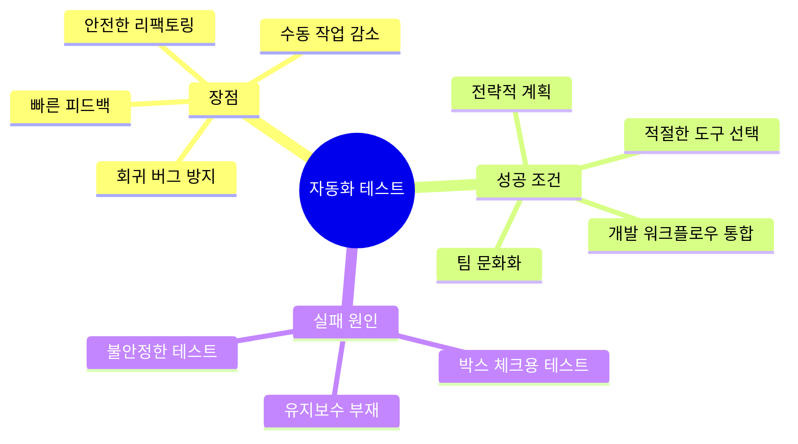

#### 효과적인 자동화 테스트를 위한 단계

| 단계 | 설명 | 도구 예시 |
|------|------|----------|
| 1. 테스트 목표 정의 | 핵심 비즈니스 로직, API 검증 우선 | - |
| 2. 도구 선택 | 기술 스택에 맞는 도구 선택 | JUnit, Mockito, Testcontainers |
| 3. 테스트 피라미드 구성 | 계층별 적절한 비율 유지 | - |
| 4. 정기적 유지보수 | 테스트 리팩토링 및 불필요 테스트 제거 | - |
| 5. TDD 활용 | 테스트 먼저 작성 | - |
| 6. CI 자동화 | 코드 변경마다 자동 실행 | Jenkins, GitHub Actions |

---

### 2. 테스트 피라미드 (Test Pyramid)

Mike Cohn이 제안한 테스트 피라미드는 테스트 계층별 비율을 안내하는 시각적 가이드이다.

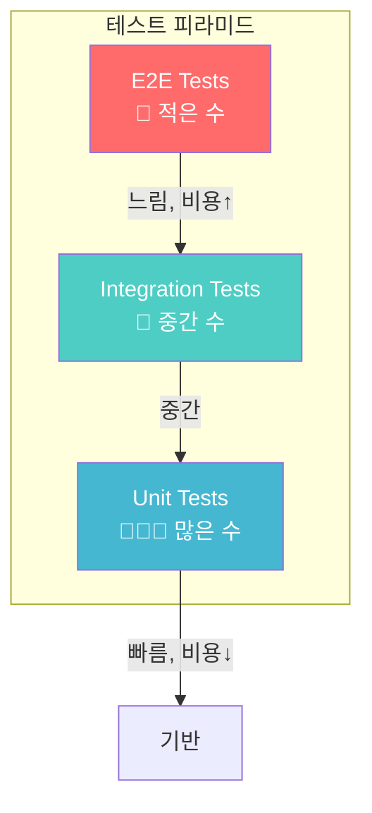

#### 테스트 피라미드 vs 아이스크림 콘 (안티패턴)

| 구분 | 테스트 피라미드 ✅ | 아이스크림 콘 ❌ |
|------|-------------------|-----------------|
| 단위 테스트 | 많음 (70-80%) | 적음 |
| 통합 테스트 | 중간 (15-20%) | 적음 |
| E2E 테스트 | 적음 (5-10%) | 많음 |
| 실행 속도 | 빠름 | 느림 |
| 유지보수 | 용이 | 어려움 |
| 피드백 속도 | 빠름 | 느림 |

> 💬 **비유**: 테스트 피라미드는 건물의 기초와 같다. 넓고 튼튼한 기초(단위 테스트) 위에 중간층(통합 테스트)을 쌓고, 꼭대기(E2E)는 가볍게 유지해야 안정적이다.

---

### 3. 단위 테스트 (Unit Testing)

단위 테스트는 개별 컴포넌트나 코드 단위를 격리하여 의도대로 동작하는지 확인한다.

#### 단위 테스트의 특성

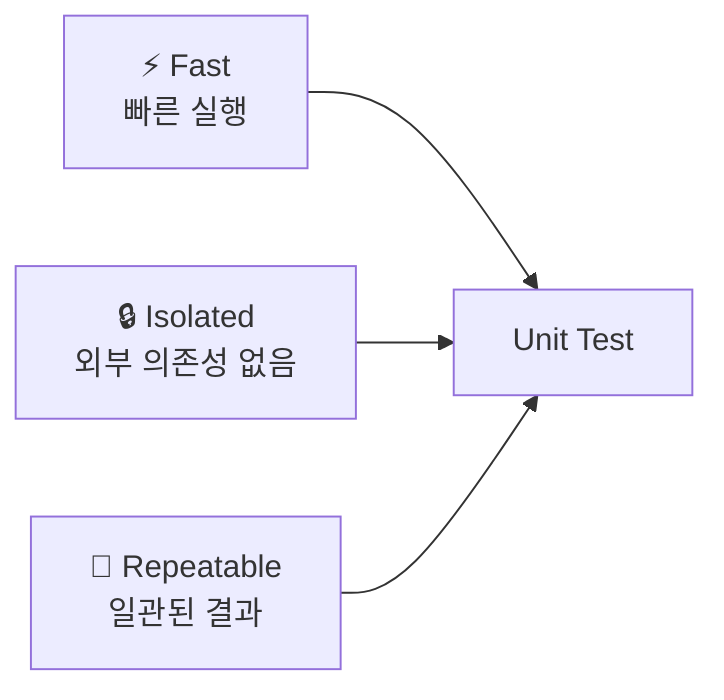

#### 기본 단위 테스트 구현

```java
// 테스트 대상 클래스: 경매 입찰 로직
public class AuctionBid {
    private final String bidder;        // 입찰자
    private BigDecimal highestBid;      // 최고 입찰가

    public AuctionBid(String bidder) {
        this.bidder = bidder;
        this.highestBid = BigDecimal.ZERO;
    }

    // 입찰하기 - 현재 최고가보다 높아야 함
    public void placeBid(BigDecimal amount) {
        if (amount.compareTo(getHighestBid()) <= 0) {
            throw new IllegalArgumentException(
                "Bid must be higher than current highest bid");
        }
        this.highestBid = amount;
    }

    public BigDecimal getHighestBid() {
        return highestBid;
    }
}
```

```java
// JUnit 5 + AssertJ를 활용한 단위 테스트
public class AuctionBidTest {

    @Test
    void givenHigherBid_whenPlaceBid_thenUpdatesHighestBid() {
        // Given: 입찰자 생성
        AuctionBid bid = new AuctionBid("Alice");

        // When: 100원 입찰
        bid.placeBid(new BigDecimal("100.00"));

        // Then: 최고 입찰가가 100원으로 업데이트됨
        assertThat(bid.getHighestBid())
            .isEqualByComparingTo(new BigDecimal("100.00"));
    }

    @Test
    void givenLowerOrEqualBid_whenPlaceBid_thenThrowsException() {
        // Given: 150원 입찰된 상태
        AuctionBid bid = new AuctionBid("Bob");
        bid.placeBid(new BigDecimal("150.00"));

        // When & Then: 100원(더 낮은 금액) 입찰 시 예외 발생
        assertThatThrownBy(() -> bid.placeBid(new BigDecimal("100.00")))
            .isInstanceOf(IllegalArgumentException.class)
            .hasMessage("Bid must be higher than current highest bid");
    }
}
```

#### Solitary vs Sociable 테스트

| 구분 | Solitary (고립형) | Sociable (협력형) |
|------|------------------|------------------|
| 의존성 처리 | Test Double로 대체 | 실제 객체 사용 |
| 격리 수준 | 높음 | 낮음 |
| 테스트 대상 | 단일 유닛의 동작 | 유닛 간 상호작용 |
| 사용 시점 | 특정 동작 격리 테스트 | 안정적 상호작용 검증 |

---

### 4. Mock과 Spy

#### Mock vs Spy 비교

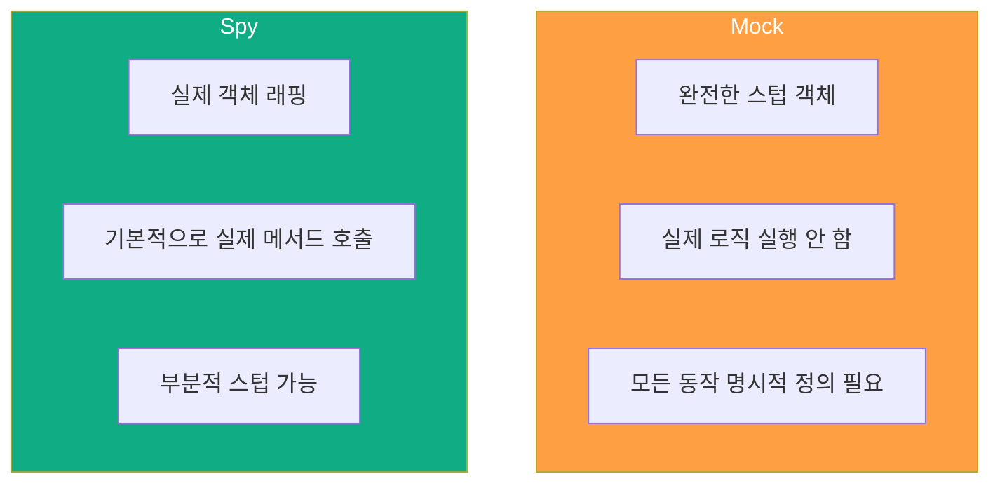

#### Mock 사용 예제

```java
@Test
void mock_shouldReturnStubbedValueAndNotCallRealLogic() {
    // Mock 생성 - 실제 로직 실행 안 함
    AuctionBid mockBid = mock();

    // 동작 정의: getHighestBid() 호출 시 999 반환
    when(mockBid.getHighestBid()).thenReturn(new BigDecimal("999.00"));

    // 실행 및 검증
    BigDecimal result = mockBid.getHighestBid();
    assertThat(result).isEqualTo(new BigDecimal("999.00"));
}
```

#### Spy 사용 예제

```java
@Test
void givenStubbedHighestBid_whenPlaceBidLower_thenException() {
    // 실제 객체 생성
    AuctionBid realBid = new AuctionBid("Charlie");

    // Spy로 래핑 - 실제 객체 + 부분 스텁
    AuctionBid spyBid = spy(realBid);

    // getHighestBid()만 스텁 (다른 메서드는 실제 동작)
    doReturn(new BigDecimal("200.00"))
        .when(spyBid)
        .getHighestBid();

    // placeBid()는 실제 로직 실행 → 스텁된 200과 비교
    assertThatThrownBy(() -> spyBid.placeBid(new BigDecimal("150.00")))
        .isInstanceOf(IllegalArgumentException.class);
}
```

#### 비즈니스 로직 단위 테스트

```java
// 테스트 대상: 사용자 역할 조회 Use Case
public class GetUserRolesUseCase {
    private final UserRepository userRepository;

    public GetUserRolesUseCase(UserRepository userRepository) {
        this.userRepository = userRepository;
    }

    public List<String> execute(String username) {
        List<String> roles = new ArrayList<>();
        Optional<User> user = userRepository.findByUsername(username);

        // 사용자 존재 시 역할 반환, 없으면 ANONYMOUS
        user.ifPresentOrElse(
            usr -> usr.getRoles().forEach(role -> roles.add(role.getName())),
            () -> roles.add("ANONYMOUS")
        );
        return roles;
    }
}
```

```java
// Mock을 활용한 단위 테스트
public class GetUserRolesUseCaseTest {

    @Test
    void givenUserExists_whenExecute_thenReturnsRoles() {
        // Given: Mock Repository 설정
        UserRepository mockRepository = mock();
        GetUserRolesUseCase useCase = new GetUserRolesUseCase(mockRepository);

        Set<Role> roles = Set.of(
            new Role(1L, "ROLE_USER"),
            new Role(2L, "ROLE_ADMIN")
        );
        User user = new User(1L, "Alexander", roles);

        when(mockRepository.findByUsername("alexander@example.com"))
            .thenReturn(Optional.of(user));

        // When: Use Case 실행
        List<String> result = useCase.execute("alexander@example.com");

        // Then: 역할 목록 검증
        assertThat(result).containsExactlyInAnyOrder("ROLE_USER", "ROLE_ADMIN");
    }

    @Test
    void givenNoUser_whenExecute_thenReturnsAnonymousRole() {
        UserRepository mockRepository = mock();
        GetUserRolesUseCase useCase = new GetUserRolesUseCase(mockRepository);

        when(mockRepository.findByUsername("not_exist@example.com"))
            .thenReturn(Optional.empty());

        List<String> result = useCase.execute("not_exist@example.com");

        assertThat(result).containsExactly("ANONYMOUS");
    }
}
```

---

### 5. RESTful 컨트롤러 단위 테스트 (MockMvc)

MockMvc는 실제 서버를 시작하지 않고 HTTP 요청을 시뮬레이션한다.

```java
@WebMvcTest(UserController.class)  // 웹 계층만 로드
@AutoConfigureMockMvc(addFilters = false)  // 보안 필터 비활성화
class UserControllerTest {

    @Autowired
    private MockMvc mockMvc;  // HTTP 요청 시뮬레이션

    @MockBean
    private GetUsersUseCase getUsersUseCase;  // 의존성 Mock

    @Test
    void getUsers_shouldReturnListOfUsers_whenUsersExist() throws Exception {
        // Given: Mock 데이터 설정
        List<User> users = List.of(
            new User(1L, "Alice", "alice@example.com"),
            new User(2L, "Bob", "bob@example.com")
        );
        when(getUsersUseCase.execute()).thenReturn(users);

        // When & Then: HTTP GET 요청 및 응답 검증
        mockMvc.perform(get("/v1/users")
                .accept(MediaType.APPLICATION_JSON))
            .andExpect(status().isOk())                          // 200 OK
            .andExpect(jsonPath("$", hasSize(2)))                // 배열 크기 2
            .andExpect(jsonPath("$[0].name").value("Alice"))     // 첫 번째 이름
            .andExpect(jsonPath("$[1].email").value("bob@example.com"));  // 두 번째 이메일
    }
}
```

---

### 6. 통합 테스트 (Integration Testing)

통합 테스트는 개별 유닛이 그룹으로 결합되어 올바르게 상호작용하는지 검증한다.

#### 실제 컴포넌트 vs 시뮬레이션

| 구분 | 실제 컴포넌트 | 시뮬레이션 |
|------|-------------|-----------|
| 정확도 | 높음 | 매우 높음 (충분) |
| 가용성 | 불안정할 수 있음 | 안정적 |
| 속도 | 느림 | 빠름 |
| 비용 | 높음 | 낮음 |
| 데이터 관리 | 어려움 | 용이 |

#### 시뮬레이션 도구

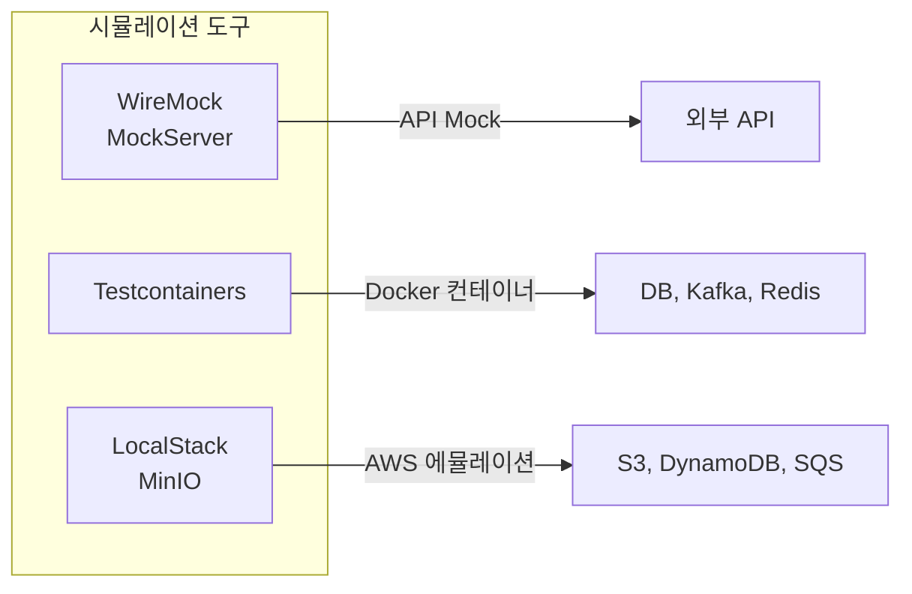

---

### 7. Testcontainers를 활용한 통합 테스트

Testcontainers는 Docker 컨테이너로 격리된 테스트 환경을 제공한다.

#### 의존성 설정

```xml
<!-- Spring Boot Testcontainers 통합 -->
<dependency>
    <groupId>org.springframework.boot</groupId>
    <artifactId>spring-boot-testcontainers</artifactId>
    <scope>test</scope>
</dependency>

<!-- JUnit 5 통합 -->
<dependency>
    <groupId>org.testcontainers</groupId>
    <artifactId>junit-jupiter</artifactId>
    <scope>test</scope>
</dependency>

<!-- PostgreSQL 컨테이너 -->
<dependency>
    <groupId>org.testcontainers</groupId>
    <artifactId>postgresql</artifactId>
    <scope>test</scope>
</dependency>
```

#### 테스트 프로필 설정

```properties
# src/test/resources/application-test.properties
eureka.client.enabled=false                    # Eureka 비활성화
management.otlp.metrics.export.enabled=false   # OTLP 메트릭 비활성화
management.tracing.enabled=false               # 분산 추적 비활성화
```

#### Testcontainers 통합 테스트

```java
@SpringBootTest
@Testcontainers
@ActiveProfiles("test")
@Sql({"/init.sql"})  // 테스트 데이터 초기화
public class GetUserRolesUseCaseIntegrationTest {

    // PostgreSQL 컨테이너 정의 (Docker 이미지 사용)
    @Container
    @ServiceConnection  // Spring Boot 3.1+ 자동 설정 연결
    static PostgreSQLContainer<?> postgres =
        new PostgreSQLContainer<>("postgres:16-alpine");

    @Autowired
    private UserJpaDatasource userJpaDatasource;

    private GetUserRolesUseCase getUserRolesUseCase;

    @BeforeEach
    void setUp() {
        getUserRolesUseCase = new GetUserRolesUseCase(
            new UserRepositoryAdapter(userJpaDatasource));
    }

    @Test
    void givenUserExists_whenExecute_thenReturnsRoles() {
        // Given: init.sql에서 admin@wxauction.com 사용자 삽입됨
        String username = "admin@wxauction.com";

        // When: 실제 DB에서 역할 조회
        List<String> roles = getUserRolesUseCase.execute(username);

        // Then: ROLE_ADMIN 포함 확인
        assertThat(roles).contains("ROLE_ADMIN");
    }
}
```

#### 영속성 계층 통합 테스트

```java
@DataJpaTest  // JPA 관련 컴포넌트만 로드 (경량 테스트)
@Testcontainers
@AutoConfigureTestDatabase(replace = AutoConfigureTestDatabase.Replace.NONE)
@Sql("/init.sql")
public class UserJpaRepositoryIntegrationTest {

    @Container
    @ServiceConnection
    static PostgreSQLContainer<?> postgres =
        new PostgreSQLContainer<>("postgres:16-alpine");

    @Autowired
    private UserJpaRepository userJpaRepository;

    @Test
    void findByUsername_shouldReturnUser_whenEmailExists() {
        String email = "admin@wxauction.com";

        Optional<UserEntity> result = userJpaRepository.findByUsername(email);

        assertThat(result).isPresent()
            .get()
            .extracting(UserEntity::getEmail)
            .isEqualTo(email);
    }
}
```

---

### 8. Full Stack 통합 테스트 (RestAssured)

RestAssured는 실제 HTTP 요청을 보내 전체 스택을 검증한다.

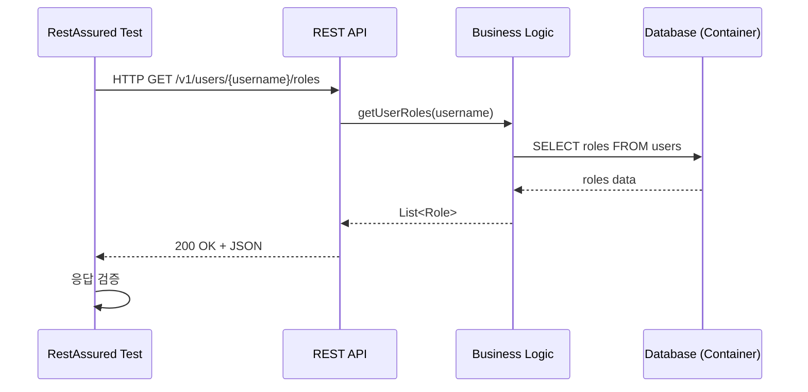

#### MockMvc vs RestAssured

| 구분 | MockMvc | RestAssured |
|------|---------|-------------|
| 실행 방식 | Spring 컨텍스트 내 시뮬레이션 | 실제 HTTP 요청 |
| 서버 시작 | 불필요 | 필요 (RANDOM_PORT) |
| 검증 범위 | 컨트롤러 계층 | 전체 스택 |
| 속도 | 빠름 | 상대적으로 느림 |
| 사용 시점 | 컨트롤러 단위 테스트 | E2E/Full Stack 테스트 |

```java
@SpringBootTest(
    classes = UserServicesApplication.class,
    webEnvironment = SpringBootTest.WebEnvironment.RANDOM_PORT  // 랜덤 포트 사용
)
@Testcontainers
@Sql("/init.sql")
public class UserControllerIntegrationTest {

    @LocalServerPort
    private int port;  // 런타임에 할당된 포트 주입

    @Container
    @ServiceConnection
    static PostgreSQLContainer<?> postgres =
        new PostgreSQLContainer<>("postgres:16-alpine");

    @Test
    void getUserRoles_shouldReturnRoles_whenUserExists() {
        // RestAssured 기본 설정
        RestAssured.baseURI = "http://localhost";
        RestAssured.port = port;

        // 실제 HTTP 요청 및 검증
        given()
            .accept(ContentType.JSON)
            .header("traceparent", "00-abcdef1234567890abc")  // 분산 추적 헤더
        .when()
            .get("/v1/users/admin@wxauction.com/roles")
        .then()
            .log().all()                          // 디버깅용 로깅
            .statusCode(200)                      // HTTP 상태 코드
            .body("roles", not(empty()))          // roles가 비어있지 않음
            .body("roles", hasItem("ROLE_USER")); // ROLE_USER 포함
    }
}
```

---

### 9. E2E 테스트 (End-to-End Testing)

E2E 테스트는 사용자 관점에서 전체 워크플로우를 검증한다.

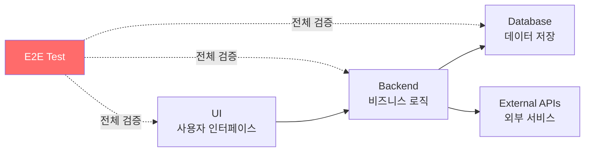

#### E2E 테스트 도구

| 도구 | 주요 용도 | 특징 |
|------|----------|------|
| Selenium | 웹 브라우저 자동화 | 다양한 브라우저 지원 |
| Cypress | 프론트엔드 E2E | 빠른 실행, 디버깅 용이 |
| Playwright | 크로스 브라우저 | 현대적, 병렬 실행 |

#### E2E 테스트 베스트 프랙티스

- 미션 크리티컬 경로에만 집중
- 특정 테스트 데이터 의존성 최소화
- 병렬 실행으로 테스트 시간 단축
- CI/CD 파이프라인에 핵심 테스트만 포함

---

### 10. 성능 테스트 (Performance Testing)

성능 테스트는 시스템이 부하 상황에서 어떻게 동작하는지 검증한다.

```mermaid
mindmap
  root((성능 테스트))
    Load Testing
      일반~높은 트래픽 시뮬레이션
      예상 트래픽 처리 능력 확인
    Stress Testing
      시스템 한계점 테스트
      극한 상황에서의 동작 확인
    Scalability Testing
      확장/축소 능력 평가
      수평/수직 확장 검증
    Endurance Testing
      장시간 일반 부하 실행
      메모리 누수, 안정성 확인
```

#### JMeter 부하 테스트 설정

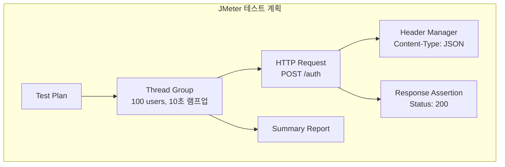

#### Thread Group 설정

| 설정 | 값 | 설명 |
|------|-----|------|
| Number of Threads | 100 | 동시 사용자 수 |
| Ramp-Up Period | 10초 | 전체 스레드 시작 시간 |
| Loop Count | 10 | 각 사용자의 요청 횟수 |
| 총 요청 수 | 1,000 | 100 × 10 |

#### JMeter 결과 분석

| 지표 | 값 | 해석 |
|------|-----|------|
| # Samples | 1,000 | 충분한 샘플 크기 |
| Average | 1,244ms | 평균 응답 시간 (1초 미만 목표 시 개선 필요) |
| Min | 112ms | 최소 응답 시간 |
| Max | 4,571ms | 최대 응답 시간 (간헐적 지연 발생) |
| Std. Dev. | 654.45ms | 높은 편차 (일관성 부족) |
| Error % | 0% | 오류 없음 (안정성 양호) |
| Throughput | 44.6 req/sec | 초당 처리량 |

> 💡 **분석 결과**: 오류 없이 안정적이지만, 응답 시간 편차가 크고 최대 4.5초까지 지연. 캐싱, 최적화, 로드 밸런싱으로 개선 필요.

---

### 11. TDD (Test-Driven Development)

TDD는 테스트를 먼저 작성하고 코드를 구현하는 개발 방법론이다.

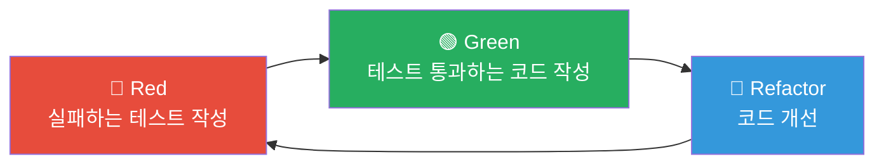

#### TDD 사이클

| 단계 | 설명 | 목표 |
|------|------|------|
| Red | 기능 정의를 위한 실패 테스트 작성 | 요구사항 명확화 |
| Green | 테스트 통과를 위한 최소한의 코드 | 기능 구현 |
| Refactor | 코드 구조 개선 (동작 유지) | 코드 품질 향상 |

---

### 12. BDD (Behavior-Driven Development)

BDD는 비즈니스 요구사항과 일치하는 시스템 전체 동작을 테스트한다.

#### Given-When-Then (GWT) 패턴

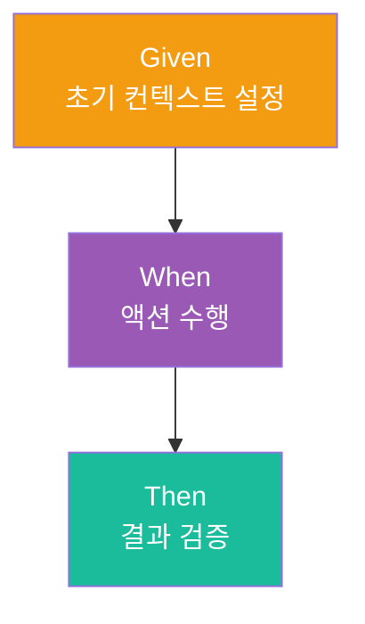

#### GWT 패턴 적용 예제

```java
@Test
void givenAnExistingUsername_whenFindByUsername_thenReturnsUser() {
    // Given: 초기 조건 설정
    String name = "testUser";
    UserEntity userEntity = new UserEntity();
    userEntity.setName(name);
    when(userJpaRepository.findByUsername(name))
        .thenReturn(Optional.of(userEntity));

    // When: 테스트 대상 액션 실행
    Optional<User> result = userJpaDatasource.findByUsername(name);

    // Then: 결과 검증
    assertTrue(result.isPresent());
    assertEquals(name, result.get().getName());
}
```

#### TDD vs BDD

| 구분 | TDD | BDD |
|------|-----|-----|
| 관점 | 개발자 중심 | 비즈니스/사용자 중심 |
| 테스트 대상 | 개별 코드 유닛 | 시스템 동작 |
| 언어 | 기술적 | 비즈니스 용어 (Ubiquitous Language) |
| 협업 | 개발팀 내부 | 개발자 + 테스터 + 비즈니스 |
| 문서화 | 코드가 문서 | 시나리오가 문서 |

---

## 🔍 심화 학습

### 추가 조사 내용

#### 테스트 커버리지 도구

- **JaCoCo**: Java 코드 커버리지 라이브러리
- **SonarQube**: 코드 품질 및 커버리지 통합 분석
- **Codecov**: CI/CD 통합 커버리지 리포팅

#### Contract Testing

- **Pact**: 마이크로서비스 간 계약 테스트
- **Spring Cloud Contract**: Spring 기반 계약 테스트
- 장점: 서비스 간 API 계약 보장, 통합 문제 조기 발견

#### Mutation Testing

- **PITest**: Java Mutation Testing
- 원리: 코드에 의도적 버그(mutant) 삽입 후 테스트가 잡는지 확인
- 효과: 테스트 품질 검증

### 출처

- [JUnit 5 User Guide](https://junit.org/junit5/docs/current/user-guide/)
- [Mockito Documentation](https://site.mockito.org/)
- [Testcontainers Documentation](https://www.testcontainers.org/)
- [Apache JMeter](https://jmeter.apache.org/)
- [RestAssured Documentation](https://rest-assured.io/)

---

## 💡 실무 적용 포인트

### 이런 상황에서 사용하세요

| 상황 | 테스트 유형 | 도구 |
|------|-----------|------|
| 비즈니스 로직 검증 | Unit Test | JUnit 5 + Mockito |
| 컨트롤러 동작 검증 | Unit Test | MockMvc |
| DB 쿼리/영속성 검증 | Integration Test | Testcontainers + @DataJpaTest |
| 전체 API 워크플로우 검증 | Integration Test | RestAssured + Testcontainers |
| 사용자 시나리오 검증 | E2E Test | Selenium/Cypress/Playwright |
| 부하 상황 검증 | Performance Test | JMeter |

### 주의할 점 / 흔한 실수

- ⚠️ **아이스크림 콘 안티패턴**: E2E 테스트만 많이 작성하면 느리고 불안정한 테스트 스위트가 됨
- ⚠️ **실제 DB 사용**: 통합 테스트에서 실제 DB 사용 시 불안정성, 느린 속도, 데이터 충돌 발생
- ⚠️ **과도한 Mock**: 모든 것을 Mock하면 실제 통합 문제를 놓칠 수 있음
- ⚠️ **테스트 유지보수 무시**: 테스트도 리팩토링 필요, 불필요한 테스트 제거 필수
- ⚠️ **private 메서드 테스트**: 구현 세부사항이 아닌 공개 인터페이스와 동작을 테스트

### 면접에서 나올 수 있는 질문

- Q: 테스트 피라미드란 무엇이고, 왜 중요한가요?
- Q: Mock과 Spy의 차이점은 무엇인가요?
- Q: Testcontainers를 사용하는 이유는 무엇인가요? H2 대비 장점은?
- Q: MockMvc와 RestAssured의 차이점과 각각 언제 사용하나요?
- Q: TDD의 Red-Green-Refactor 사이클을 설명해주세요.
- Q: 부하 테스트와 스트레스 테스트의 차이점은 무엇인가요?

---

## ✅ 핵심 개념 체크리스트

- [ ] 테스트 피라미드의 3개 계층과 각각의 특성을 설명할 수 있는가?
- [ ] JUnit 5의 @Test, AssertJ의 assertThat 사용법을 알고 있는가?
- [ ] Mock과 Spy의 차이점과 적절한 사용 시점을 구분할 수 있는가?
- [ ] @WebMvcTest와 MockMvc로 컨트롤러 테스트를 작성할 수 있는가?
- [ ] Testcontainers의 @Container, @ServiceConnection 어노테이션을 이해하는가?
- [ ] @DataJpaTest와 @SpringBootTest의 차이를 알고 있는가?
- [ ] RestAssured를 사용한 Full Stack 테스트를 구현할 수 있는가?
- [ ] JMeter 결과 지표(Throughput, Latency, Error %)를 해석할 수 있는가?
- [ ] TDD의 Red-Green-Refactor 사이클을 실제로 적용할 수 있는가?
- [ ] BDD의 GWT 패턴으로 테스트 메서드를 작성할 수 있는가?

---

## 🔗 참고 자료

- 📄 공식 문서: [JUnit 5](https://junit.org/junit5/), [Mockito](https://site.mockito.org/), [Testcontainers](https://www.testcontainers.org/)
- 📄 Spring 테스트: [Spring Boot Testing](https://docs.spring.io/spring-boot/docs/current/reference/html/features.html#features.testing)
- 🎬 추천 영상: [Testing Spring Boot Applications](https://www.youtube.com/results?search_query=spring+boot+testing)
- 📚 연관 서적: "Succeeding with Agile" (Mike Cohn), "Test Driven Development" (Kent Beck)

---
