# 13장: Performance and Optimizations (성능과 최적화)

---

## 📌 핵심 요약

> 이 장에서는 Java 애플리케이션의 성능 최적화를 위한 JVM과 GC 튜닝, 캐싱 전략, 리액티브 프로그래밍을 다룬다. 핵심은 **GC 선택과 힙 사이징으로 지연 시간을 최소화**하고, **캐싱으로 응답 시간을 단축**하며, **Spring WebFlux로 높은 동시성과 확장성을 달성**하는 것이다. 또한 Java의 Virtual Threads를 활용한 경량 스레딩 모델도 소개한다.

---

## 🎯 학습 목표

이 내용을 읽고 나면:
- [ ] JVM 아키텍처와 메모리 구조를 설명할 수 있다
- [ ] G1, ZGC, Shenandoah 등 GC의 특성과 적절한 선택 기준을 이해한다
- [ ] 힙 사이징과 GC 튜닝 파라미터를 설정할 수 있다
- [ ] Spring Cache와 Caffeine/Redis를 활용한 캐싱을 구현할 수 있다
- [ ] Spring WebFlux와 Mono/Flux를 사용한 리액티브 프로그래밍을 적용할 수 있다
- [ ] Spring MVC와 Spring WebFlux의 차이점을 비교하고 적절한 선택을 할 수 있다
- [ ] Virtual Threads의 개념과 활성화 방법을 알고 있다

---

## 📖 본문 정리

### 1. JVM 아키텍처 이해

JVM은 Java 애플리케이션의 핵심 런타임 환경으로, 다양한 하드웨어와 OS에서 일관된 실행 환경을 제공한다.

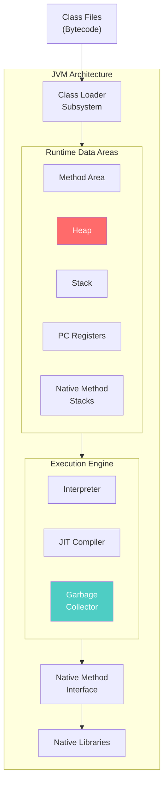

---

### 2. Garbage Collector (GC) 이해

GC는 Java 애플리케이션에서 메모리를 자동으로 관리하며, 사용되지 않는 객체의 공간을 회수한다.

#### Java Heap 메모리 구조

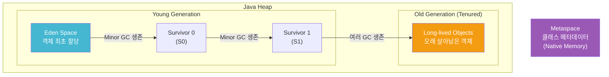

#### GC 유형 비교

| GC 유형 | JVM 파라미터 | 특징 | 적합한 상황 |
|---------|-------------|------|------------|
| **G1 GC** | `-XX:+UseG1GC` | 대규모 앱, 동적 적응, 일시 정지 최소화 | 범용, 대규모 힙 |
| **Shenandoah** | `-XX:+UseShenandoahGC` | 동시 GC + 메모리 압축, 낮은 일시 정지 | 컨테이너 환경 |
| **ZGC** | `-XX:+UseZGC` | 극히 낮은 일시 정지, 대용량 힙 확장 | 고응답성 요구 앱 |
| **C4 (Azul)** | Azul JVM 필요 | 무정지 GC, 극한 확장성 | 실시간 시스템 |

> 💬 **비유**: GC는 도서관 사서와 같다. 반납된 책(사용되지 않는 객체)을 정리하여 서가(힙 메모리)에 공간을 확보한다. Minor GC는 매일 정리, Major GC는 대규모 정리 작업이다.

---

### 3. 힙 사이징 및 GC 튜닝

#### 힙 사이징 전략

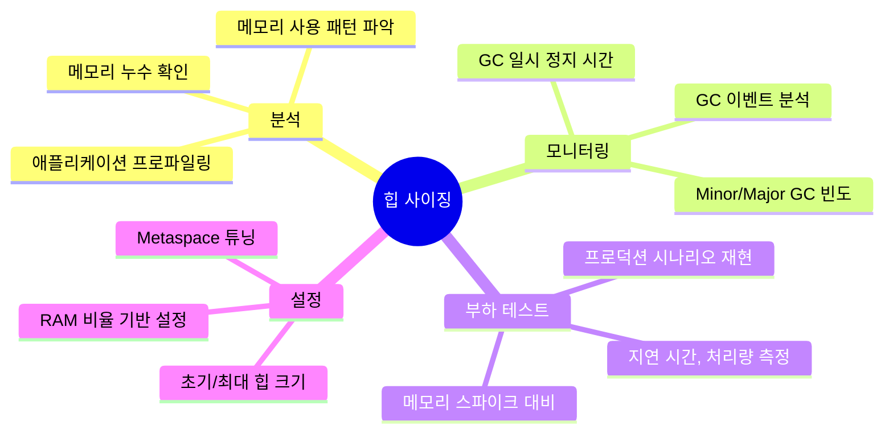

#### 주요 JVM 파라미터

| 파라미터 | 설명 | 예시 |
|----------|------|------|
| `-Xms<size>` | 초기 힙 크기 | `-Xms512m` |
| `-Xmx<size>` | 최대 힙 크기 | `-Xmx2g` |
| `-XX:InitialRAMPercentage=<value>` | 초기 힙 (RAM %) | `-XX:InitialRAMPercentage=50` |
| `-XX:MaxRAMPercentage=<value>` | 최대 힙 (RAM %) | `-XX:MaxRAMPercentage=70` |
| `-XX:NewRatio=<value>` | Young:Old 비율 | `-XX:NewRatio=2` |
| `-XX:SurvivorRatio=<value>` | Eden:Survivor 비율 | `-XX:SurvivorRatio=8` |
| `-XX:MetaspaceSize=<size>` | 초기 Metaspace | `-XX:MetaspaceSize=128m` |
| `-XX:MaxMetaspaceSize=<size>` | 최대 Metaspace | `-XX:MaxMetaspaceSize=256m` |
| `-XX:MaxGCPauseMillis=<value>` | 목표 GC 일시 정지 시간 | `-XX:MaxGCPauseMillis=200` |
| `-Xlog:gc*` | GC 로깅 활성화 | `-Xlog:gc*:file=gc.log` |

---

### 4. JVM 튜닝 케이스 스터디

#### Case Study 1: 고트래픽 웹 애플리케이션 지연 시간 개선

**문제**: 플래시 세일 시 긴 GC 일시 정지로 응답 지연

**원인**: Default Parallel GC의 stop-the-world 이벤트

**해결 방안**:
```bash
# G1 GC 전환 및 튜닝
-XX:+UseG1GC
-XX:MaxGCPauseMillis=200
-Xms4g -Xmx4g
-XX:G1HeapRegionSize=16m
```

#### Case Study 2: 데이터 집약적 분석 플랫폼 확장

**문제**: 대규모 데이터셋 처리 시 메모리 부족 및 긴 GC 일시 정지

**원인**: Old Generation에 대형 객체 누적

**해결 방안**:
```bash
# ZGC 채택 및 동적 힙 설정
-XX:+UseZGC
-XX:InitialRAMPercentage=50
-XX:MaxRAMPercentage=70
-XX:MaxGCPauseMillis=10
-Xlog:gc*
```

#### Case Study 3: 마이크로서비스 메모리 최적화 (Kubernetes)

**문제**: 컨테이너 메모리 제한 초과로 Pod 재시작

**원인**: 비효율적인 힙 설정, 컨테이너 환경 미고려

**해결 방안**:
```bash
# Shenandoah GC + 컨테이너 최적화
-XX:+UseShenandoahGC
-XX:InitialRAMPercentage=50
-XX:MaxRAMPercentage=70
-XX:MetaspaceSize=128m
-XX:MaxMetaspaceSize=256m
```

---

### 5. JVM 프로파일링 도구

| 도구 | 특징 | 용도 |
|------|------|------|
| **VisualVM** | 무료, 경량, 실시간 모니터링 | CPU, 메모리, 스레드, GC, 힙 덤프 분석 |
| **JFR + JMC** | 낮은 오버헤드, 프로덕션 적합 | 지속적 프로파일링, GC 일시 정지, CPU 분석 |
| **Eclipse MAT** | 오픈소스, 대용량 힙 덤프 분석 | 메모리 누수 식별, 객체 참조 그래프 |

---

### 6. 캐싱 (Caching)

캐싱은 자주 접근하는 데이터를 임시 저장소에 보관하여 빠른 접근을 가능하게 한다.

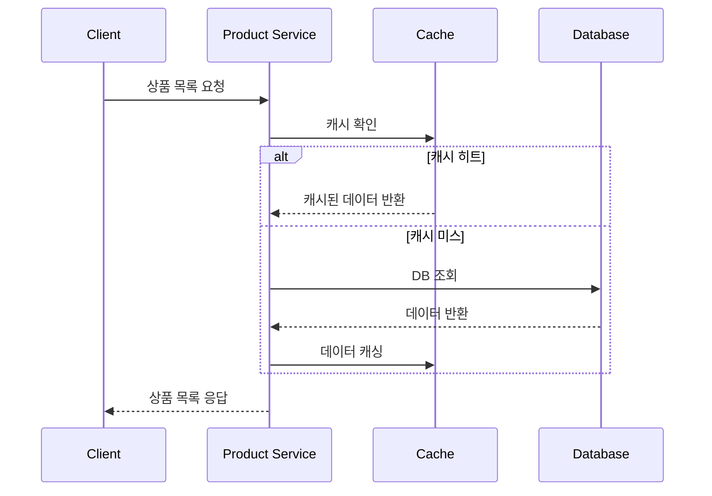

#### 캐싱의 장점

| 장점 | 설명 |
|------|------|
| **성능 향상** | DB 쿼리, 네트워크 호출 감소로 속도 향상 |
| **부하 감소** | DB/API 부하 분산, 더 많은 요청 처리 가능 |
| **비용 효율** | 클라우드 리소스 사용량 감소 |
| **확장성 향상** | 더 많은 동시 사용자 처리 가능 |

#### 캐시 무효화 전략

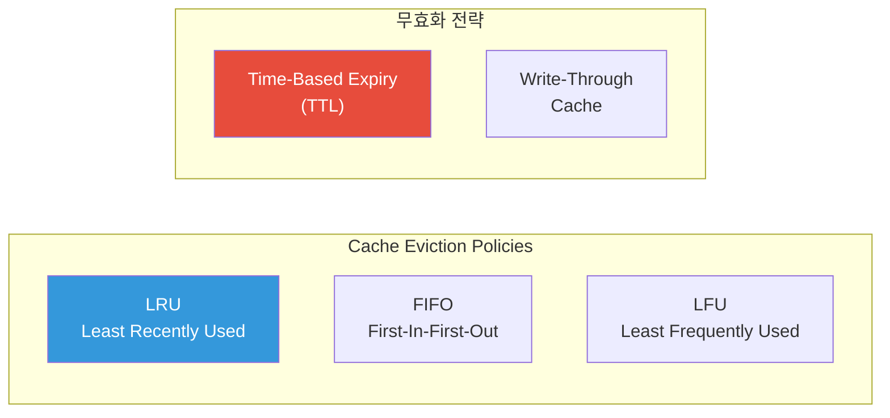

| 전략 | 설명 | 적합한 상황 |
|------|------|------------|
| **LRU** | 가장 오래 접근하지 않은 데이터 제거 | 일반적인 상황 |
| **FIFO** | 가장 오래된 데이터 제거 | 접근 빈도 무관 |
| **LFU** | 가장 적게 접근한 데이터 제거 | 핫 데이터 유지 필요 |
| **TTL** | 지정 시간 후 자동 만료 | 데이터 신선도 중요 |
| **Write-Through** | 백엔드 변경 시 캐시 즉시 업데이트 | 강한 일관성 필요 |

---

### 7. 애플리케이션 레벨 캐싱 (Caffeine)

Spring Cache + Caffeine으로 고성능 인메모리 캐싱을 구현한다.

#### 의존성 추가

```xml
<dependency>
    <groupId>com.github.ben-manes.caffeine</groupId>
    <artifactId>caffeine</artifactId>
</dependency>
```

#### 캐시 설정

```java
@Configuration
@EnableCaching  // 캐싱 활성화
public class CacheConfig {

    @Bean
    public CacheManager cacheManager() {
        CaffeineCacheManager cacheManager =
            new CaffeineCacheManager("products");  // 캐시 이름

        cacheManager.setCaffeine(Caffeine.newBuilder()
            .expireAfterWrite(10, TimeUnit.MINUTES)  // 10분 후 만료
            .maximumSize(100));  // 최대 100개 엔트리

        return cacheManager;
    }
}
```

#### 캐시 어노테이션 사용

```java
@Service
public class ProductServiceImpl implements ProductService {

    // 결과를 "products" 캐시에 저장
    // 캐시 히트 시 메서드 실행 생략
    @Cacheable("products")
    public List<ProductResponse> getAllProducts() {
        List<Product> products = getProductsUseCase.execute();
        return products.stream()
            .map(ProductMapper::toResponse)
            .toList();
    }

    // 새 상품 추가 시 캐시 전체 무효화
    @CacheEvict(value = "products", allEntries = true)
    public ProductResponse addProduct(ProductRequest productRequest) {
        // 상품 추가 로직
    }
}
```

#### 주요 캐시 어노테이션

| 어노테이션 | 설명 |
|-----------|------|
| `@Cacheable` | 결과 캐싱, 캐시 히트 시 메서드 실행 생략 |
| `@CacheEvict` | 캐시 항목 제거 |
| `@CachePut` | 항상 메서드 실행 후 결과 캐싱 |
| `@Caching` | 여러 캐시 어노테이션 조합 |

---

### 8. 분산 캐싱 (Redis)

마이크로서비스 환경에서 여러 인스턴스 간 캐시 일관성을 위해 Redis를 사용한다.

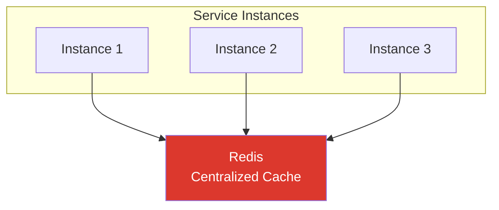

#### 의존성 추가

```xml
<dependency>
    <groupId>org.springframework.boot</groupId>
    <artifactId>spring-boot-starter-data-redis</artifactId>
</dependency>
```

#### Redis 설정

```properties
# application.properties
spring.cache.type=redis
spring.redis.host=localhost
spring.redis.port=6379
spring.redis.timeout=60000

# Connection Pool 설정
spring.redis.lettuce.pool.max-active=10
spring.redis.lettuce.pool.min-idle=2
```

#### Redis CacheManager 설정

```java
@Configuration
public class CacheConfig {

    @Bean
    public CacheManager cacheManager(
            RedisConnectionFactory redisConnectionFactory) {

        RedisCacheConfiguration config =
            RedisCacheConfiguration.defaultCacheConfig()
                .entryTtl(Duration.ofMinutes(10))  // TTL 10분
                .serializeValuesWith(
                    RedisSerializationContext.SerializationPair
                        .fromSerializer(
                            new GenericJackson2JsonRedisSerializer()));  // JSON 직렬화

        return RedisCacheManager.builder(redisConnectionFactory)
            .cacheDefaults(config)
            .build();
    }
}
```

#### 애플리케이션 vs 분산 캐시

| 구분 | 애플리케이션 캐시 (Caffeine) | 분산 캐시 (Redis) |
|------|---------------------------|------------------|
| 저장 위치 | 각 인스턴스 메모리 | 중앙 집중 서버 |
| 인스턴스 간 공유 | ❌ 불가능 | ✅ 가능 |
| 일관성 | 인스턴스별 다를 수 있음 | 모든 인스턴스 동일 |
| 속도 | 매우 빠름 (로컬) | 빠름 (네트워크 지연) |
| 확장성 | 제한적 | 높음 |
| 장애 영향 | 인스턴스별 | 전체 (Redis 장애 시) |

---

### 9. 리액티브 프로그래밍 (Reactive Programming)

리액티브 프로그래밍은 비동기 데이터 스트림을 처리하는 패러다임으로, 논블로킹(Non-blocking), 이벤트 기반 시스템에 적합하다.

#### 왜 리액티브 프로그래밍인가?

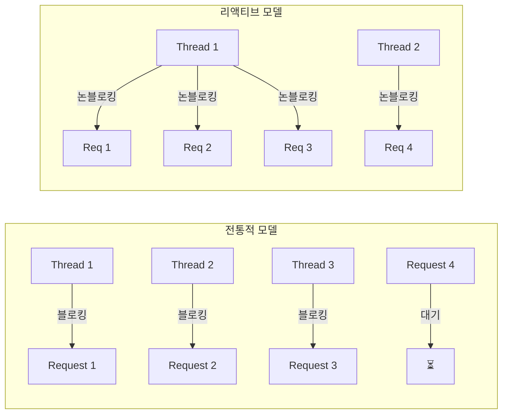

| 특징 | 설명 |
|------|------|
| **Non-blocking I/O** | 외부 리소스 대기 중 스레드 차단 없음 |
| **Asynchronous Processing** | 태스크 독립 실행, 응답성 향상 |
| **Backpressure Handling** | 생산자-소비자 속도 조절로 과부하 방지 |

#### Reactive Streams 핵심 인터페이스

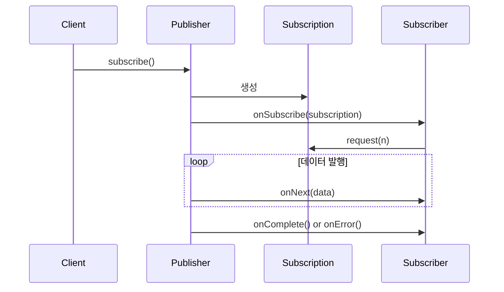

| 인터페이스 | 역할 |
|-----------|------|
| **Publisher** | 비동기적으로 데이터 생성 및 발행 |
| **Subscriber** | 데이터 소비 (onSubscribe, onNext, onError, onComplete) |
| **Subscription** | Publisher-Subscriber 간 계약 관리, 백프레셔 제어 |
| **Processor** | Publisher + Subscriber (데이터 변환) |

---

### 10. Spring WebFlux

Spring WebFlux는 Spring 5에서 도입된 리액티브 웹 프레임워크로, Project Reactor 기반이다.

#### Mono와 Flux

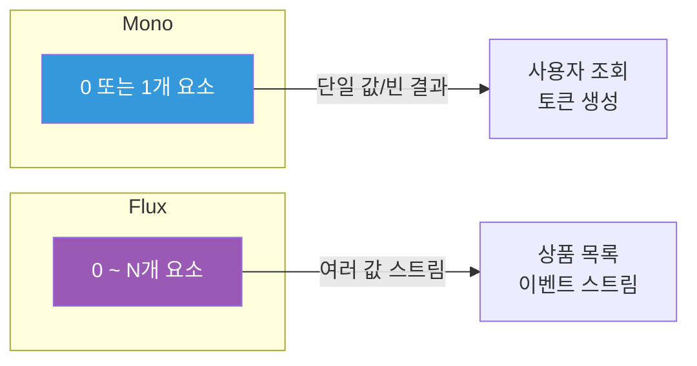

#### WebFlux 컨트롤러 예제

```java
@RestController
@RequestMapping("/api/auth")
public class AuthenticationController {

    private final GenerateTokenUseCase generateTokenUseCase;

    // Mono를 반환하여 비동기 처리
    @PostMapping
    public Mono<AuthenticationResponse> createAuthenticationToken(
            @RequestBody Mono<AuthenticationRequest> authRequestMono) {

        return authRequestMono
            .flatMap(authRequest ->
                // 토큰 생성 (비동기)
                generateTokenUseCase.execute(
                    authRequest.getUsername(),
                    authRequest.getPassword()))
            .map(AuthenticationResponse::new);
    }
}
```

#### 리액티브 Use Case 구현

```java
public class GenerateTokenUseCase {

    public Mono<String> execute(String username, String password) {
        return authenticationManagerRepository
            .authenticate(username, password)  // 인증 (Mono)
            .flatMap(authentication ->
                userRepository.getRolesByUsername(username)  // 역할 조회 (Flux)
                    .collectList()  // Flux → Mono<List>
                    .doOnNext(authentication::setRoles)
                    .thenReturn(authentication))
            .flatMap(authentication ->
                Mono.just(tokenRepository.generate(authentication)));  // 토큰 생성
    }
}
```

#### WebClient (리액티브 HTTP 클라이언트)

```java
public class UserRestApi implements UserRepository {

    private final WebClient webClient;

    // Flux 반환 - 여러 역할 스트림
    public Flux<String> getRolesByUsername(String username) {
        return webClient.get()
            .uri("http://USER-SERVICES/v1/users/{username}/roles", username)
            .retrieve()
            .onStatus(status -> status != HttpStatus.OK,
                clientResponse -> clientResponse.bodyToMono(String.class)
                    .flatMap(errorBody ->
                        Mono.error(new RuntimeException("Error: " + errorBody))))
            .bodyToFlux(String.class);  // 결과를 Flux로 추출
    }
}
```

#### 리액티브 보안 설정

```java
@EnableWebFluxSecurity  // WebFlux 보안 활성화
public class SecurityConfiguration {

    private final ReactiveUserDetailsService reactiveUserDetailsService;

    @Bean
    public SecurityWebFilterChain securityWebFilterChain(
            ServerHttpSecurity http) {
        // WebFlux 보안 설정
        return http
            .csrf(ServerHttpSecurity.CsrfSpec::disable)
            .authorizeExchange(exchanges -> exchanges
                .pathMatchers("/public/**").permitAll()
                .anyExchange().authenticated())
            .build();
    }

    @Bean
    public ReactiveUserDetailsService reactiveAuthenticationManager() {
        // 리액티브 UserDetailsService
    }
}
```

---

### 11. Spring MVC vs Spring WebFlux 비교

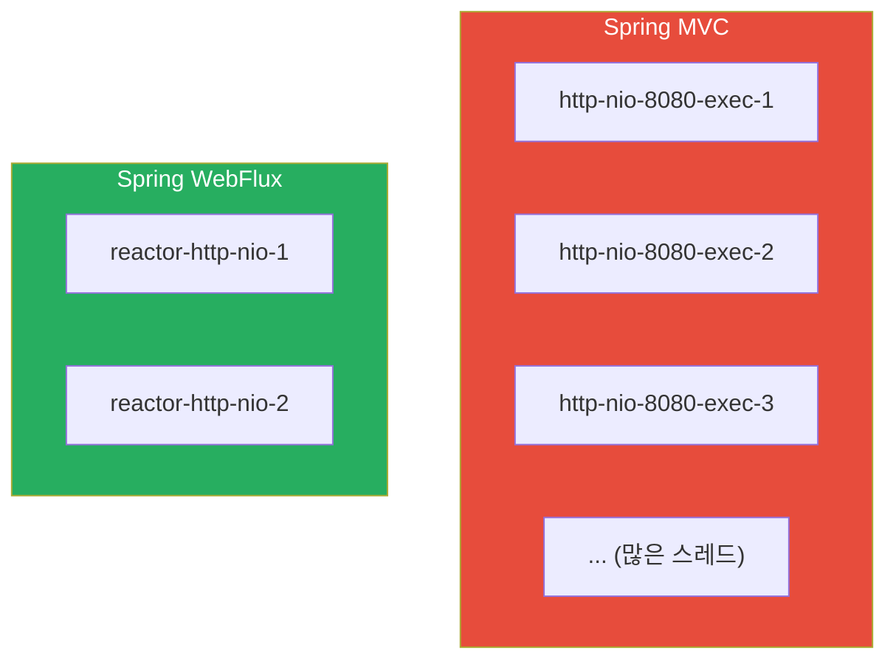

| 구분 | Spring MVC | Spring WebFlux |
|------|-----------|----------------|
| **모델** | Thread-per-request (블로킹) | Event-driven (논블로킹) |
| **스레드 수** | 많음 (요청당 1개) | 적음 (이벤트 루프) |
| **리소스 효율** | 대기 중 스레드 유휴 | 스레드 활성 상태 유지 |
| **확장성** | 제한적 (스레드 풀 한계) | 높음 |
| **코드 복잡도** | 낮음 (동기식) | 높음 (비동기 체이닝) |
| **학습 곡선** | 완만 | 가파름 |
| **DB 드라이버** | JDBC (블로킹) | R2DBC, Reactive MongoDB |
| **적합 상황** | 소~중규모, 저~중동시성 | 고동시성, 실시간, 스트리밍 |

---

### 12. Virtual Threads (가상 스레드)

Java Project Loom에서 도입된 Virtual Threads는 경량 스레딩 모델이다.

#### Virtual Threads vs Platform Threads

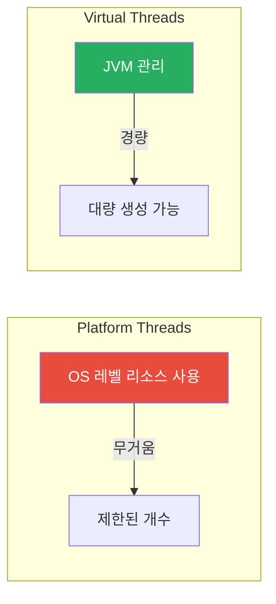

| 특징 | 설명 |
|------|------|
| **Thread-per-task** | 전통적 블로킹 스타일 유지하면서 리소스 제한 해소 |
| **Seamless Integration** | 기존 Java 코드, 라이브러리와 투명하게 작동 |
| **Blocking Calls 지원** | 블로킹 I/O를 효율적으로 처리 (일시 중단/재개) |

#### Spring Boot에서 Virtual Threads 활성화

```properties
# application.properties (Spring Boot 3.2+)
spring.threads.virtual.enabled=true
```

#### Virtual Threads vs Reactive Programming

| 측면 | Reactive Programming | Virtual Threads |
|------|---------------------|-----------------|
| **프로그래밍 모델** | 논블로킹, 이벤트 기반 | 블로킹, 명령형 |
| **학습 곡선** | 가파름 (Mono, Flux 개념) | 완만 (기존 코드 유사) |
| **코드 복잡도** | 높음 (비동기 체이닝) | 낮음 (동기식 스타일) |
| **생태계** | 리액티브 라이브러리 필요 | 기존 블로킹 라이브러리 사용 가능 |
| **사용 사례** | 스트리밍, 실시간, 고동시성 | 고동시성 + 간단한 코드 선호 시 |

---

## 🔍 심화 학습

### 추가 조사 내용

#### GraalVM Native Image
- 빌드 시 AOT 컴파일로 네이티브 실행 파일 생성
- 빠른 시작 시간, 낮은 메모리 사용
- 마이크로서비스, 서버리스에 적합

#### R2DBC (Reactive Relational Database Connectivity)
- 관계형 DB용 리액티브 드라이버
- JDBC의 블로킹 한계 극복
- PostgreSQL, MySQL, SQL Server 지원

#### Spring Data Redis Reactive
- `ReactiveRedisTemplate` 사용
- 비동기 Redis 연산 지원

### 출처

- [JVM Garbage Collectors](https://docs.oracle.com/en/java/javase/21/gctuning/)
- [Project Reactor](https://projectreactor.io/)
- [Spring WebFlux Documentation](https://docs.spring.io/spring-framework/reference/web/webflux.html)
- [Project Loom - Virtual Threads](https://openjdk.org/projects/loom/)

---

## 💡 실무 적용 포인트

### 이런 상황에서 사용하세요

| 상황 | 기술 | 이유 |
|------|------|------|
| 고트래픽 웹 앱 지연 시간 감소 | G1 GC + 힙 튜닝 | 일시 정지 최소화 |
| 대용량 힙 데이터 처리 | ZGC | 극저 일시 정지, 확장성 |
| 컨테이너/K8s 메모리 최적화 | Shenandoah + RAM % 설정 | 동적 메모리 관리 |
| 읽기 중심 데이터 성능 향상 | 캐싱 (Caffeine/Redis) | DB 부하 감소 |
| 마이크로서비스 캐시 일관성 | Redis 분산 캐시 | 인스턴스 간 공유 |
| 고동시성 실시간 API | Spring WebFlux | 논블로킹 확장성 |
| 간단한 코드 + 고동시성 | Virtual Threads | 기존 코드 유지 |

### 주의할 점 / 흔한 실수

- ⚠️ **GC 튜닝 없는 배포**: 기본 GC 설정이 모든 워크로드에 적합하지 않음
- ⚠️ **힙 크기 과다/과소 설정**: 너무 크면 GC 시간 증가, 너무 작으면 빈번한 GC
- ⚠️ **캐시 과다 사용**: 메모리 과사용, 데이터 불일치 위험
- ⚠️ **TTL 미설정**: 오래된 데이터 제공 위험
- ⚠️ **WebFlux에서 블로킹 호출**: 리액티브 이점 상쇄
- ⚠️ **리액티브 전환 시 DB 드라이버 미변경**: JDBC는 블로킹, R2DBC 필요

### 면접에서 나올 수 있는 질문

- Q: JVM에서 GC의 역할은 무엇이고, 왜 튜닝이 필요한가요?
- Q: G1 GC와 ZGC의 차이점은 무엇인가요?
- Q: 애플리케이션 레벨 캐시와 분산 캐시의 차이점은?
- Q: Spring WebFlux와 Spring MVC의 차이점은 무엇인가요?
- Q: Mono와 Flux의 차이점을 설명해주세요.
- Q: Virtual Threads와 Reactive Programming 중 언제 어떤 것을 선택하나요?

---

## ✅ 핵심 개념 체크리스트

- [ ] JVM 아키텍처의 주요 구성요소(Class Loader, Heap, GC)를 설명할 수 있는가?
- [ ] Young/Old Generation, Minor/Major GC의 차이를 알고 있는가?
- [ ] G1, ZGC, Shenandoah의 특성과 선택 기준을 이해하는가?
- [ ] -Xms, -Xmx, -XX:MaxRAMPercentage 등 힙 파라미터를 설정할 수 있는가?
- [ ] 캐시 무효화 전략(LRU, TTL, Write-through)을 설명할 수 있는가?
- [ ] @Cacheable, @CacheEvict 어노테이션을 사용할 수 있는가?
- [ ] Caffeine과 Redis 캐시의 차이점을 알고 있는가?
- [ ] 리액티브 프로그래밍의 핵심 개념(논블로킹, 백프레셔)을 이해하는가?
- [ ] Mono와 Flux의 용도와 차이를 설명할 수 있는가?
- [ ] flatMap, map, doOnNext 등 Reactor 연산자를 사용할 수 있는가?
- [ ] Virtual Threads 활성화 방법과 Reactive와의 차이를 알고 있는가?

---

## 🔗 참고 자료

- 📄 공식 문서: [JVM GC Tuning](https://docs.oracle.com/en/java/javase/21/gctuning/), [Project Reactor](https://projectreactor.io/)
- 📄 Spring 문서: [Spring Cache](https://docs.spring.io/spring-framework/reference/integration/cache.html), [Spring WebFlux](https://docs.spring.io/spring-framework/reference/web/webflux.html)
- 🎬 추천 영상: [JVM Performance Tuning](https://www.youtube.com/results?search_query=jvm+gc+tuning)
- 📚 연관 서적: "Java Performance" (Scott Oaks), "Reactive Programming with Spring 5" (Oleh Dokuka)

---
