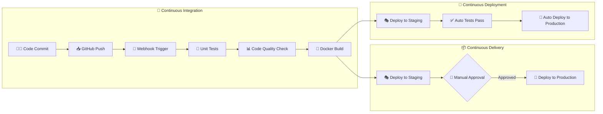
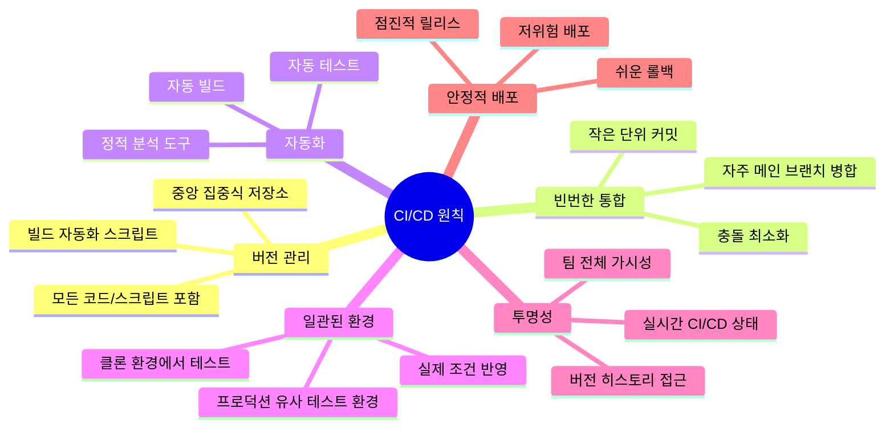
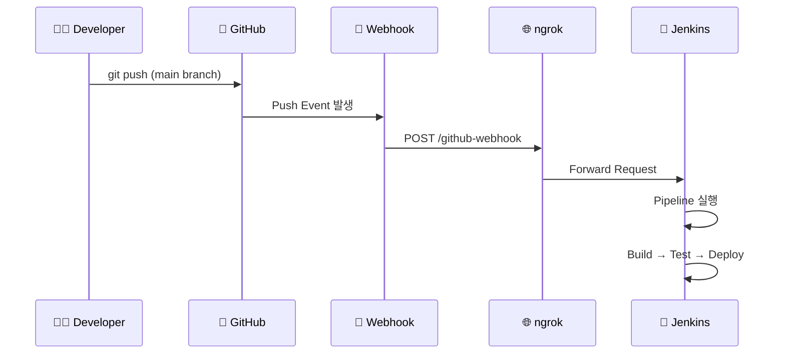
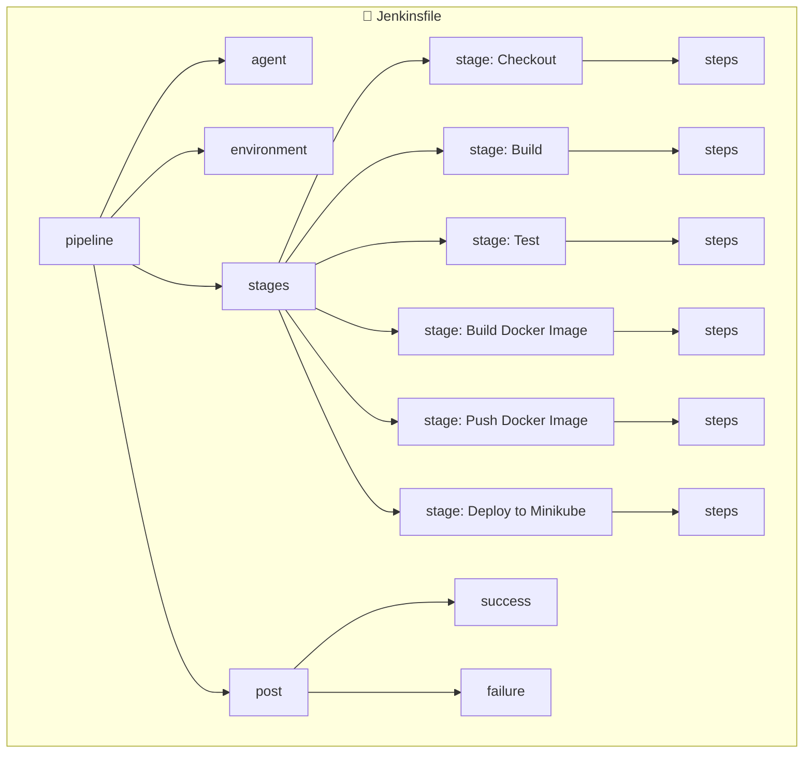
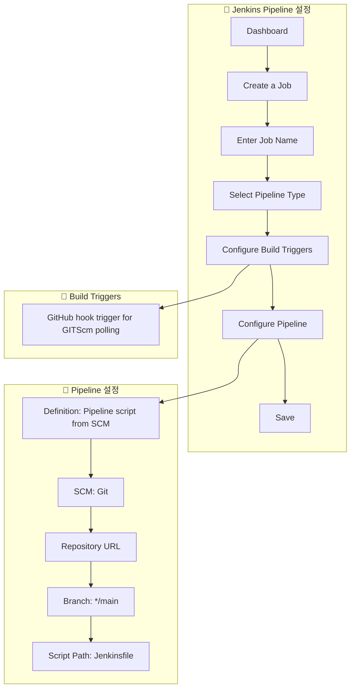
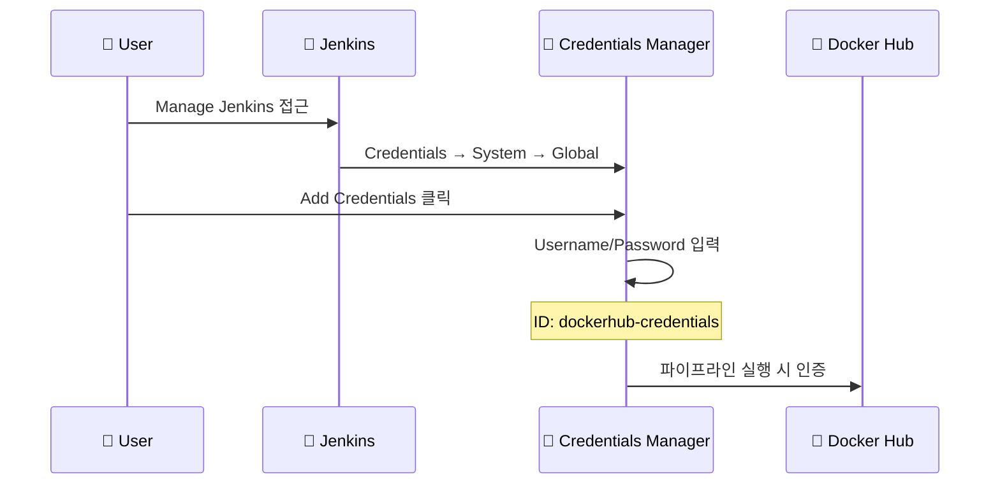
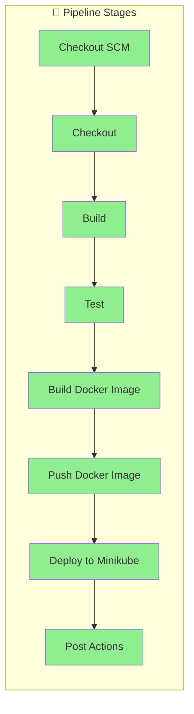
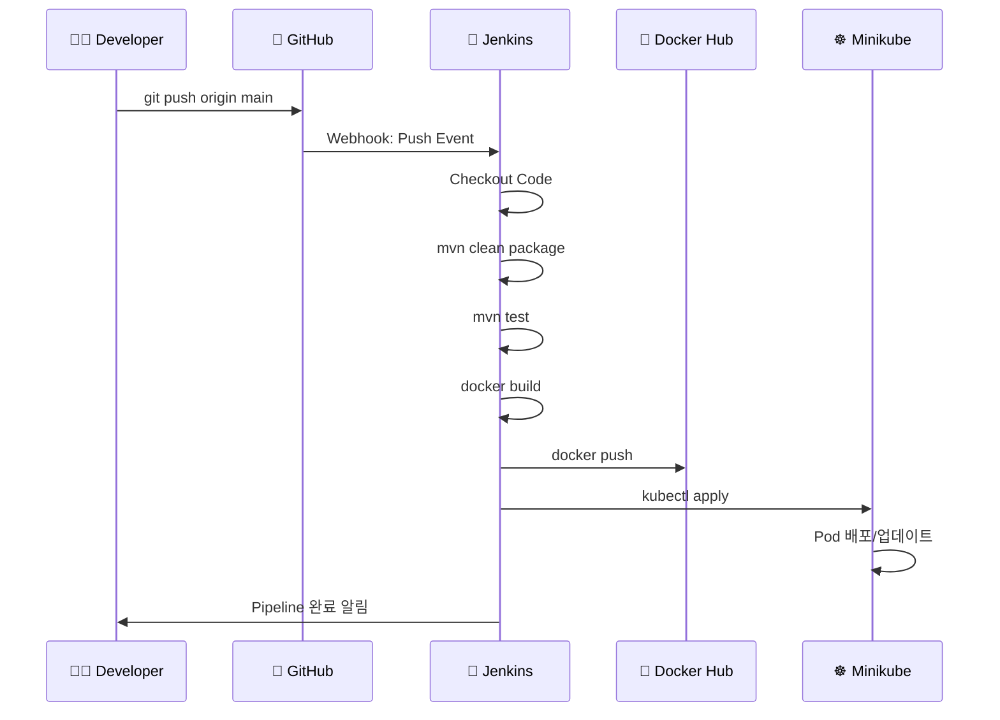

# 15. CI/CD (Continuous Integration and Continuous Deployment)

---

## 📌 핵심 요약

> 이 장에서는 **CI/CD(지속적 통합/지속적 배포)**의 개념과 실무 구현을 다룬다. 핵심은 **소프트웨어 빌드, 테스트, 배포 과정을 자동화**하여 개발 효율성을 높이고 릴리스 주기를 단축하는 것이다. Jenkins를 활용한 실제 파이프라인 구축을 통해 GitHub 연동, Docker 이미지 생성, Kubernetes 배포까지의 전체 워크플로우를 자동화하는 방법을 학습한다.

---

## 🎯 학습 목표

이 내용을 읽고 나면:
- [ ] CI/CD의 개념과 핵심 원칙을 설명할 수 있다
- [ ] Continuous Delivery와 Continuous Deployment의 차이를 비교할 수 있다
- [ ] Jenkinsfile의 구조와 각 블록의 역할을 이해할 수 있다
- [ ] Jenkins 파이프라인을 구축하고 GitHub 웹훅을 설정할 수 있다
- [ ] Docker 이미지 빌드부터 Kubernetes 배포까지 자동화할 수 있다

---

## 📖 본문 정리

### 1. CI/CD 이해하기

#### 1.1 전통적 개발 모델의 문제점

전통적인 **Waterfall 모델**에서는 개발자들이 오랜 기간 코드를 작성한 후 통합했다. 이로 인해 발생하는 문제:

- **Integration Hell**: 여러 팀원의 변경사항 병합 시 충돌과 지연 발생
- **늦은 테스트**: 개발 주기 끝에 수동 테스트 → 이슈 조기 발견 어려움
- **긴 피드백 루프**: 문제 발견까지 시간이 오래 걸림

> 💬 **비유**: 전통적 개발은 마치 1년치 빨래를 한꺼번에 하는 것과 같다. CI/CD는 매일 조금씩 빨래하여 쌓이지 않게 관리하는 것이다.

#### 1.2 CI/CD 프로세스 흐름



#### 1.3 Continuous Delivery vs Continuous Deployment

| 구분 | Continuous Delivery | Continuous Deployment |
|------|--------------------|-----------------------|
| **정의** | 프로덕션 배포 전 수동 승인 필요 | 모든 단계가 자동으로 진행 |
| **승인 과정** | ✅ 수동 승인 단계 존재 | ❌ 수동 개입 없음 |
| **위험도** | 낮음 (사람이 최종 확인) | 높음 (완전 자동화) |
| **적합한 환경** | 규제가 있는 산업, 신중한 배포 필요 시 | 빠른 반복이 필요한 스타트업 |
| **배포 속도** | 상대적으로 느림 | 매우 빠름 |

### 2. CI/CD 핵심 원칙



#### 핵심 원칙 상세

1. **버전 관리된 중앙 저장소**
   - 소스 코드, DB 스키마, 라이브러리, 설정 파일 포함
   - 테스트 스크립트와 빌드 자동화 스크립트 관리

2. **빈번한 소규모 병합**
   - 숨겨진 충돌 방지
   - 디버깅 단순화
   - 대규모 커밋 회피

3. **자동화된 빌드와 테스트**
   - 단일 명령으로 빌드 실행
   - 테스트 실패 시 빌드 실패
   - 정적 분석 도구로 코드 품질 유지

4. **일관된 테스트 환경**
   - 프로덕션과 유사한 환경에서 테스트
   - 실제 환경 조건 반영

5. **투명한 협업**
   - 팀 전체가 빌드, 저장소, 로그 접근 가능
   - 실시간 CI/CD 상태 모니터링

6. **안정적인 저위험 배포**
   - 점진적 배포로 대규모 실패 위험 감소
   - 쉬운 롤백 지원

### 3. CI/CD의 장점과 도전과제

#### 장점

| 장점 | 설명 |
|------|------|
| **높은 코드 품질** | JUnit, Selenium 등 자동화 테스트로 조기 버그 발견 |
| **향상된 협업** | 빈번한 코드 통합으로 팀 협업 촉진 |
| **수동 작업 감소** | 자동화로 반복 작업 제거, 기능 개발에 집중 |
| **낮은 위험** | 점진적 배포로 대규모 실패 방지, 쉬운 롤백 |
| **높은 투명성** | 실시간 소프트웨어 상태 가시성 |
| **빠른 출시** | 통합, 테스트, 배포 자동화로 릴리스 주기 단축 |

#### 도전과제

- 복잡한 파이프라인 설정
- 빌드 실패 시 시간 소모
- 강력한 인프라와 모니터링 도구 필요

### 4. 주요 CI/CD 도구

```mermaid
graph TB
    subgraph Tools["🛠️ CI/CD Tools"]
        J[Jenkins]
        GA[GitHub Actions]
        GL[GitLab CI/CD]
        CC[CircleCI]
    end

    subgraph Jenkins_Features["Jenkins 특징"]
        J --> J1[오픈소스]
        J --> J2[광범위한 플러그인]
        J --> J3[Jenkinsfile 지원]
        J --> J4[다양한 VCS 연동]
    end

    subgraph GA_Features["GitHub Actions 특징"]
        GA --> GA1[GitHub 내장]
        GA --> GA2[YAML 워크플로우]
        GA --> GA3[Marketplace 액션]
        GA --> GA4[Git 이벤트 트리거]
    end

    subgraph GL_Features["GitLab CI/CD 특징"]
        GL --> GL1[통합 DevOps 솔루션]
        GL --> GL2[컨테이너 레지스트리]
        GL --> GL3[모니터링 포함]
        GL --> GL4[YAML 파이프라인]
    end

    subgraph CC_Features["CircleCI 특징"]
        CC --> CC1[클라우드/온프레미스]
        CC --> CC2[병렬 테스트 실행]
        CC --> CC3[Docker/K8s 지원]
        CC --> CC4[직관적 YAML 설정]
    end
```



| 도구 | 특징 | 적합한 환경 |
|------|------|-------------|
| **Jenkins** | 오픈소스, 플러그인 생태계, Jenkinsfile | 커스터마이징이 필요한 대규모 조직 |
| **GitHub Actions** | GitHub 내장, YAML 워크플로우, Marketplace | GitHub 사용 팀 |
| **GitLab CI/CD** | 통합 DevOps, 컨테이너 레지스트리 | 올인원 솔루션 선호 팀 |
| **CircleCI** | 클라우드/온프레미스, 병렬 실행 | 컨테이너화된 애플리케이션 |

### 5. 환경 설정

#### 5.1 ngrok으로 로컬 개발 환경 공개

ngrok은 로컬 서버를 외부에서 접근 가능하게 만드는 도구이다.

```bash
# ngrok 설치 후 실행
ngrok http 8080
```

**세션 정보 예시**:
```
Forwarding  https://abc123.ngrok.io -> http://localhost:8080
```

> 💬 **비유**: ngrok은 집 앞에 임시 우편함을 설치하는 것과 같다. 외부에서 보낸 편지(웹훅 요청)를 받아 집 안(로컬 서버)으로 전달한다.

#### 5.2 GitHub 웹훅 설정

GitHub에서 푸시 이벤트 발생 시 Jenkins 파이프라인을 트리거하는 웹훅 설정:



**웹훅 설정 단계**:
1. GitHub Repository → Settings → Webhooks → Add Webhook
2. Payload URL: `https://[ngrok-url]/github-webhook`
3. Content type: `application/json`
4. Events: `Just the push event`

### 6. Jenkinsfile 구조

#### 6.1 Jenkinsfile 블록 구조



#### 6.2 Jenkinsfile 블록 설명

| 블록 | 목적 | 필수/선택 |
|------|------|-----------|
| `pipeline` | 전체 파이프라인 정의 (루트 블록) | 필수 |
| `agent` | 파이프라인 실행 환경 정의 (노드, Docker 등) | 필수 |
| `environment` | 파이프라인 전역 환경 변수 선언 | 선택 |
| `stages` | 파이프라인의 주요 단계 정의 | 필수 |
| `stage` | 개별 단계 정의 (build, test, deploy 등) | 필수 |
| `steps` | 각 stage에서 실행할 명령어 | 필수 |
| `post` | 파이프라인 완료 후 실행할 액션 | 선택 |
| `input` | 수동 승인 단계 추가 | 선택 |
| `parameters` | 사용자 입력 파라미터 정의 | 선택 |
| `options` | 타임아웃, 재시도 등 추가 설정 | 선택 |

#### 6.3 완전한 Jenkinsfile 예제

```groovy
// 파이프라인 루트 블록 - 전체 CI/CD 워크플로우 정의
pipeline {
    // 파이프라인 실행 환경 - any: 사용 가능한 모든 에이전트에서 실행
    agent any

    // 환경 변수 정의 - 파이프라인 전체에서 사용
    environment {
        DOCKER_IMAGE = 'wxesquevixos/authentication-services'  // Docker 이미지 이름
        DOCKER_TAG = 'latest'  // 이미지 태그
        GITHUB_REPOSITORY_URL = 'https://github.com/wandersonxs/authentication-services.git'
    }

    // 파이프라인 단계들 정의
    stages {
        // 1단계: GitHub에서 코드 체크아웃
        stage('Checkout') {
            steps {
                echo 'Checking out code...'
                git branch: 'main', url: "${GITHUB_REPOSITORY_URL}"
            }
        }

        // 2단계: Maven으로 애플리케이션 빌드
        stage('Build') {
            steps {
                echo 'Building the application...'
                sh 'mvn clean package -DskipTests'  // 테스트 스킵하고 패키징
            }
        }

        // 3단계: 단위 테스트 실행
        stage('Test') {
            steps {
                echo 'Running tests...'
                sh 'mvn test'  // Maven 테스트 실행
            }
        }

        // 4단계: Docker 이미지 빌드
        stage('Build Docker Image') {
            steps {
                echo 'Building Docker image...'
                sh """
                    docker build -t ${DOCKER_IMAGE}:${DOCKER_TAG} .
                """
            }
        }

        // 5단계: Docker Hub에 이미지 푸시
        stage('Push Docker Image') {
            steps {
                echo 'Pushing Docker image to Docker Hub...'
                // Jenkins Credentials에서 Docker Hub 인증 정보 사용
                withCredentials([usernamePassword(
                    credentialsId: 'dockerhub-credentials',
                    usernameVariable: 'DOCKER_USERNAME',
                    passwordVariable: 'DOCKER_PASSWORD'
                )]) {
                    sh '''
                        echo $DOCKER_PASSWORD | docker login -u $DOCKER_USERNAME --password-stdin
                        docker push ${DOCKER_IMAGE}:${DOCKER_TAG}
                    '''
                }
            }
        }

        // 6단계: Minikube에 배포
        stage('Deploy to Minikube') {
            steps {
                echo 'Deploying to Minikube...'
                sh """
                    kubectl apply -f kubernetes/authentication-services-deployment.yaml
                    kubectl apply -f kubernetes/authentication-services-service.yaml
                    kubectl apply -f kubernetes/authentication-services-ingress.yaml
                """
            }
        }
    }

    // 파이프라인 완료 후 실행할 액션
    post {
        success {
            echo 'Pipeline completed successfully!'  // 성공 시 메시지
        }
        failure {
            echo 'Pipeline failed. Please check the logs.'  // 실패 시 메시지
        }
    }
}
```

### 7. Jenkins 설정 및 파이프라인 구축

#### 7.1 Jenkins 설치 및 초기 설정

```bash
# macOS에서 Jenkins 실행
/opt/homebrew/opt/jenkins/bin/jenkins --httpListenAddress=127.0.0.1 --httpPort=8080
```

**설정 단계**:
1. 초기 관리자 비밀번호 입력 (콘솔 또는 `~/.jenkins/secrets/initialAdminPassword`)
2. 추천 플러그인 설치 선택
3. 관리자 계정 생성
4. Jenkins URL 설정: `http://localhost:8080/`

#### 7.2 파이프라인 생성



**파이프라인 설정 상세**:

| 설정 항목 | 값 | 설명 |
|----------|-----|------|
| Definition | Pipeline script from SCM | SCM에서 Jenkinsfile 사용 |
| SCM | Git | Git 저장소 사용 |
| Repository URL | GitHub URL | 프로젝트 저장소 URL |
| Credentials | none (공개 저장소) | 비공개 시 인증 정보 필요 |
| Branch | */main | 메인 브랜치 지정 |
| Script Path | Jenkinsfile | Jenkinsfile 위치 |

#### 7.3 Docker Hub Credentials 설정



**Credentials 설정**:
- **Scope**: Global (모든 Job에서 접근 가능)
- **Username**: Docker Hub 사용자명
- **Password**: Docker Hub 비밀번호
- **ID**: `dockerhub-credentials` (Jenkinsfile에서 참조)

### 8. 파이프라인 실행

#### 8.1 수동 실행

1. Jenkins Dashboard → authentication-services 클릭
2. Build Now 클릭
3. Stages 메뉴에서 진행 상황 모니터링



#### 8.2 자동 실행 (GitHub Push 트리거)



**자동 트리거 확인**:
1. 코드 변경 후 main 브랜치에 push
2. Jenkins Dashboard에서 Build Executor Status 확인
3. 빌드 상세 정보에서 커밋 메시지 확인

---

## 🔍 심화 학습

### 추가 조사 내용

#### Blue Ocean - Jenkins UI 개선
Jenkins의 Blue Ocean 플러그인은 파이프라인 시각화를 크게 개선한다:
- 직관적인 파이프라인 편집기
- 실시간 파이프라인 시각화
- Git 브랜치별 파이프라인 뷰

#### GitOps 패러다임
Git을 단일 진실 공급원(Single Source of Truth)으로 사용:
- **ArgoCD**: Kubernetes 네이티브 GitOps 도구
- **Flux**: CNCF 프로젝트, Git 기반 배포 자동화
- 선언적 인프라 관리

#### 고급 배포 전략

| 전략 | 설명 | 장점 | 단점 |
|------|------|------|------|
| **Blue-Green** | 두 환경 전환 | 빠른 롤백 | 리소스 2배 필요 |
| **Canary** | 점진적 트래픽 이동 | 위험 최소화 | 복잡한 라우팅 |
| **Rolling** | 순차적 Pod 교체 | 리소스 효율적 | 느린 롤백 |
| **A/B Testing** | 사용자 그룹별 분리 | 실험 가능 | 복잡한 분석 |

### 출처
- [Jenkins 공식 문서](https://www.jenkins.io/doc/)
- [GitHub Actions 문서](https://docs.github.com/en/actions)
- [GitLab CI/CD 문서](https://docs.gitlab.com/ee/ci/)
- [Martin Fowler - Continuous Integration](https://martinfowler.com/articles/continuousIntegration.html)

---

## 💡 실무 적용 포인트

### 이런 상황에서 사용하세요

- **팀 규모 성장 시**: 수동 배포의 병목 현상 해소
- **마이크로서비스 아키텍처**: 다수 서비스의 독립적 배포 자동화
- **빈번한 릴리스 필요 시**: 일일/주간 배포 주기
- **품질 게이트 강화**: 자동화된 테스트와 코드 품질 검사

### 주의할 점 / 흔한 실수

- ⚠️ **시크릿 노출**: Jenkinsfile에 하드코딩하지 말고 Credentials Manager 사용
- ⚠️ **테스트 스킵**: 빌드 시간 단축을 위해 테스트를 건너뛰면 품질 저하
- ⚠️ **모노리식 파이프라인**: 서비스별로 파이프라인을 분리하여 독립성 확보
- ⚠️ **롤백 전략 미비**: 배포 실패 시 자동 롤백 메커니즘 구축 필수
- ⚠️ **환경 불일치**: 테스트 환경과 프로덕션 환경 최대한 동일하게 유지

### 면접에서 나올 수 있는 질문

- **Q: CI와 CD의 차이점은 무엇인가요?**
  - CI는 코드 통합과 테스트 자동화, CD는 배포 자동화에 초점

- **Q: Continuous Delivery와 Continuous Deployment의 차이는?**
  - Delivery는 수동 승인 필요, Deployment는 완전 자동화

- **Q: Jenkins Pipeline의 Declarative vs Scripted 방식 차이는?**
  - Declarative: 구조화된 문법, 읽기 쉬움
  - Scripted: Groovy 기반, 더 유연하지만 복잡

- **Q: Blue-Green 배포와 Canary 배포의 차이점은?**
  - Blue-Green: 전체 트래픽 전환
  - Canary: 점진적 트래픽 이동

- **Q: CI/CD 파이프라인에서 보안을 어떻게 확보하나요?**
  - Credentials 관리, 이미지 취약점 스캔, SAST/DAST 통합

---

## ✅ 핵심 개념 체크리스트

- [ ] CI/CD의 목적과 이점을 한 문장으로 설명할 수 있는가?
- [ ] Continuous Delivery와 Continuous Deployment의 차이를 알고 있는가?
- [ ] CI/CD의 6가지 핵심 원칙을 나열할 수 있는가?
- [ ] Jenkinsfile의 필수 블록(pipeline, agent, stages, stage, steps)을 이해하는가?
- [ ] GitHub 웹훅과 Jenkins 연동 방식을 설명할 수 있는가?
- [ ] Docker 이미지 빌드와 푸시를 파이프라인에 통합할 수 있는가?
- [ ] Jenkins Credentials로 민감 정보를 안전하게 관리할 수 있는가?

---

## 🔗 참고 자료

- 📄 공식 문서: [Jenkins Pipeline](https://www.jenkins.io/doc/book/pipeline/)
- 📄 공식 문서: [GitHub Webhooks](https://docs.github.com/en/developers/webhooks-and-events/webhooks)
- 🎬 추천 영상: [Jenkins Tutorial for Beginners - YouTube](https://www.youtube.com/watch?v=FX322RVNGj4)
- 📚 연관 서적: "Continuous Delivery" by Jez Humble & David Farley
- 🔧 도구: [ngrok - Secure tunnels](https://ngrok.com/)
- 📄 GitHub 예제: [ch15/authentication-services](https://github.com/PacktPublishing/Software-Architecture-with-Spring/tree/main/ch15)
