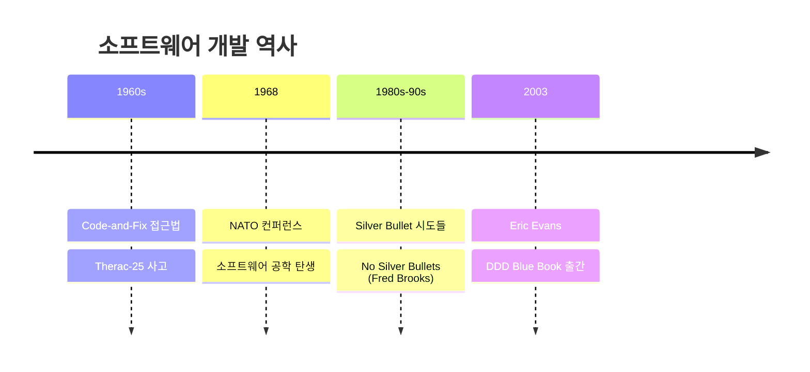
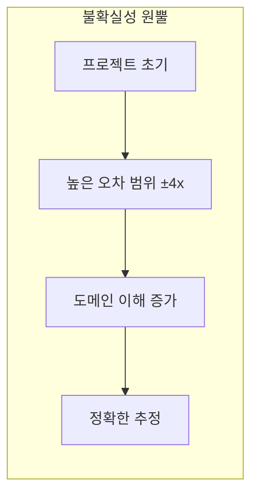
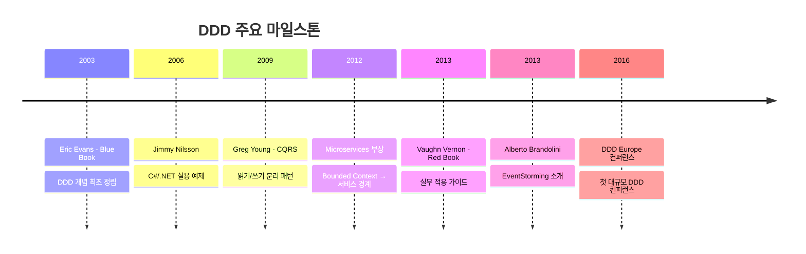
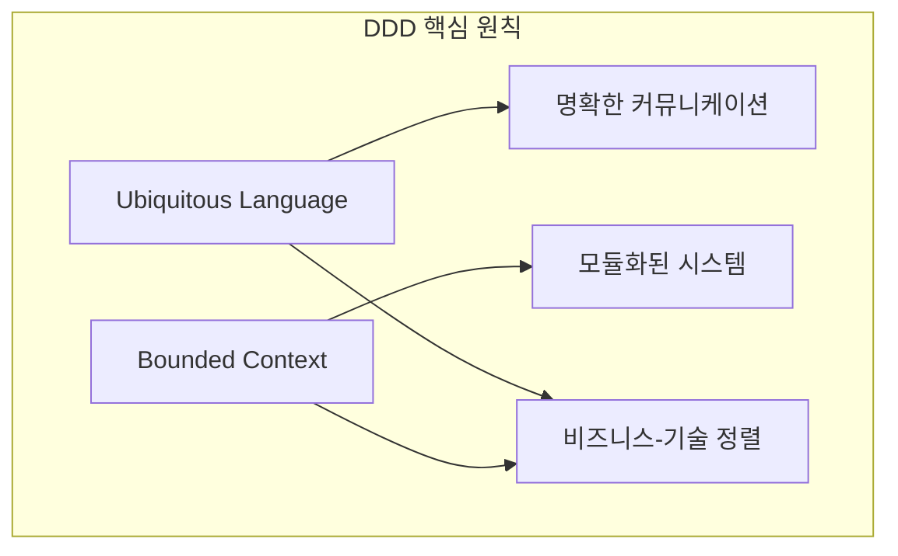
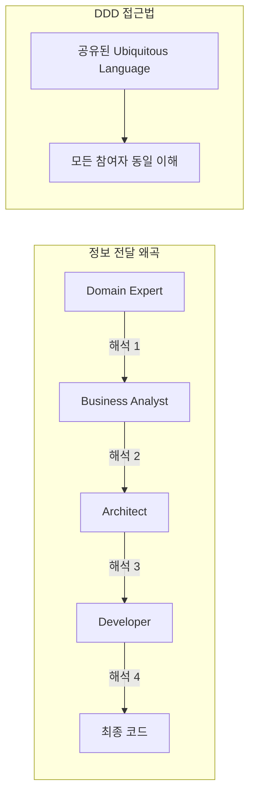
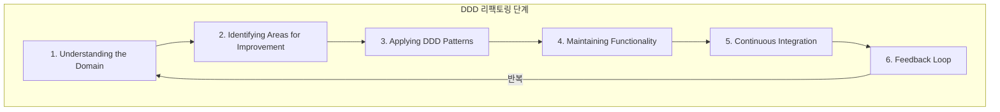
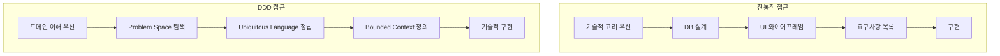
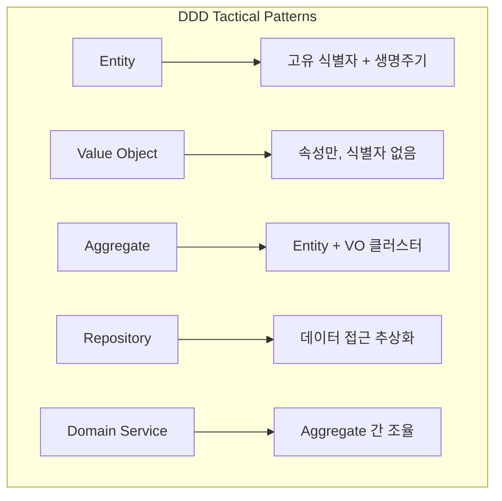
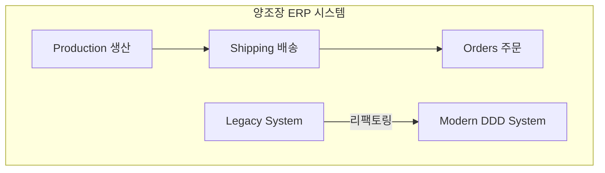

# Chapter 1: Evolution of Domain-Driven Design (도메인 주도 설계의 진화)

## 📌 핵심 요약

> **"DDD는 프레임워크나 라이브러리가 아닌 철학이다. Ubiquitous Language와 Bounded Context를 핵심으로, 기술적 해결책보다 도메인 이해를 우선시하여 비즈니스와 정렬된 소프트웨어를 만든다. 리팩토링은 코드뿐 아니라 도메인 모델 자체를 지속적으로 정제하는 과정이다."**

이 챕터에서는 DDD의 탄생 배경부터 현재까지의 진화 과정을 학습하고, DDD가 문제 해결 접근 방식을 어떻게 변화시키는지 이해한다.

---

## 🎯 학습 목표

이 챕터를 완료하면 다음을 할 수 있다:

- [ ] 소프트웨어 위기(Software Crisis)와 DDD 탄생 배경 이해
- [ ] DDD의 주요 마일스톤과 기여자들 파악
- [ ] Ubiquitous Language와 Bounded Context 개념 설명
- [ ] Essential Complexity와 Accidental Complexity 구분
- [ ] DDD가 기존 개발 방법론과 다른 점 설명
- [ ] 리팩토링에서 DDD의 역할 이해

---

## 📖 본문 정리

### 1.1 소프트웨어 개발 접근법의 진화

#### 소프트웨어 위기 (1960s-1980s)



| 시대 | 문제점 | 결과 |
|------|--------|------|
| 1960s | Code-and-Fix 접근 | 예산 초과, 일정 지연 |
| 1968 | 소프트웨어 위기 인식 | NATO 컨퍼런스, 공학적 접근 시작 |
| 1980-90s | Silver Bullet 추구 | RAD 도구 등장 (Delphi, VB) |

#### 불확실성 원뿔 (Cone of Uncertainty)



> **핵심 통찰**: 프로젝트 초기 추정치는 4배까지 오차가 날 수 있다. 도메인에 대한 깊은 이해만이 더 강력한 모델, 더 정확한 추정을 가능하게 한다.

#### 복잡성의 두 가지 종류 (Fred Brooks)

| 복잡성 유형 | 정의 | 해결 가능성 |
|------------|------|------------|
| **Essential Complexity** | 문제 도메인 자체의 본질적 복잡성 | 제거 불가, 관리만 가능 |
| **Accidental Complexity** | 기술적 선택으로 인한 부수적 복잡성 | 도구/방법론으로 감소 가능 |

---

### 1.2 DDD의 역사 (The Story So Far)

#### 주요 마일스톤



#### 핵심 저서 및 기여자

| 연도 | 저자 | 저서/기여 | 핵심 내용 |
|------|------|----------|----------|
| 2003 | Eric Evans | Blue Book | DDD 개념 정립, E-programs 접근 |
| 2006 | Jimmy Nilsson | Applying DDD with C# | 첫 실용적 구현 예제 |
| 2006 | Marinescu & Avram | DDD Quickly | DDD 핵심 요약 |
| 2009 | Greg Young | CQRS + ES | 명령/쿼리 분리, 이벤트 소싱 |
| 2013 | Vaughn Vernon | Red Book | 실무 구현 가이드 |
| 2013 | Alberto Brandolini | EventStorming | 협업 도메인 모델링 워크샵 |
| 2014 | Millett & Tune | Patterns, Principles | 심층 패턴 탐구 |
| 2019 | Alexey Zimarev | Hands-On DDD .NET | .NET Core 실습 예제 |
| 2021 | Vlad Khononov | Learning DDD | 현대적 DDD 관점 |

---

### 1.3 DDD란 무엇인가?

#### DDD가 아닌 것

```
❌ 프레임워크가 아니다
❌ 라이브러리가 아니다
❌ 설치하는 도구가 아니다
```

#### DDD의 두 가지 핵심 원칙



##### 1. Ubiquitous Language (보편 언어)

| 특징 | 설명 |
|------|------|
| **공유 어휘** | 모든 이해관계자가 사용하는 일관된 용어 |
| **모호성 제거** | 커뮤니케이션에서 해석 차이 최소화 |
| **모델 정확성** | 소프트웨어 모델이 비즈니스 도메인과 일치 |
| **프로그래밍 언어처럼 엄격** | 명확하고 일관된 정의 |

##### 2. Bounded Context (경계 컨텍스트)

| 특징 | 설명 |
|------|------|
| **경계 정의** | 특정 도메인 모델이 적용되는 범위 |
| **독립적 진화** | 각 컨텍스트가 독립적으로 발전 가능 |
| **간섭 방지** | 한 컨텍스트의 변경이 다른 컨텍스트에 영향 없음 |
| **모듈화** | 복잡한 시스템을 관리 가능한 단위로 분리 |

#### Broken Telephone 게임 비유



> **DDD의 목표**: "암묵적인 것을 명시적으로 만들기" (Make the implicit explicit)

---

### 1.4 DDD와 리팩토링

#### 리팩토링의 DDD적 의미

> **"리팩토링은 코드만의 문제가 아니다. 도메인에 대한 이해가 깊어짐에 따라 모델 자체를 정제하는 과정이다."**

#### DDD 리팩토링 6단계



| 단계 | 활동 | 목적 |
|------|------|------|
| **1. 도메인 이해** | 도메인 전문가와 협업 | 정확한 도메인 지식 확보 |
| **2. 개선 영역 식별** | 기술 부채, 모델 불일치 탐지 | 리팩토링 대상 선정 |
| **3. DDD 패턴 적용** | Aggregate, Entity, Value Object 등 | 도메인 모델 명확화 |
| **4. 기능 유지** | 작은 단계로 리팩토링, 자동 테스트 | 기존 기능 보존 |
| **5. 지속적 통합** | 자주 통합하여 문제 조기 발견 | 안정성 확보 |
| **6. 피드백 루프** | 도메인 전문가와 변경 검토 | 지속적 모델 정제 |

---

### 1.5 DDD가 문제 접근을 바꾸는 방법

#### 전통적 접근 vs DDD 접근



| 측면 | 전통적 접근 | DDD 접근 |
|------|------------|---------|
| **시작점** | 기술적 해결책 (DB first) | 도메인 이해 |
| **커뮤니케이션** | 요구사항 목록 전달 | 지속적 협업 |
| **모델** | 기술 중심 | 비즈니스 중심 |
| **변경** | Big Bang 변경 | 점진적 개선 (Baby Steps) |
| **리팩토링** | 코드 개선 | 모델 + 코드 개선 |

#### Tactical Patterns 요약



| 패턴 | 역할 | 특징 |
|------|------|------|
| **Entity** | 고유 식별자를 가진 객체 | 생명주기와 상태 변화 |
| **Value Object** | 속성으로만 정의되는 객체 | 불변(Immutable), 식별자 없음 |
| **Aggregate** | 관련 객체들의 일관성 경계 | 트랜잭션 단위 |
| **Repository** | 영속성 추상화 | 인메모리 컬렉션처럼 동작 |
| **Domain Service** | Aggregate에 속하지 않는 도메인 로직 | Aggregate 간 결합도 감소 |

---

### 1.6 책 전체 예제: 양조장 ERP 시스템



> **학습 목표**: 레거시 시스템에서 시작하여 DDD 패턴을 적용, Big Bang 변경이 아닌 Baby Steps로 점진적 리팩토링

---

## 💡 실무 적용 포인트

### Domain-Driven Design의 핵심 정의

```
Domain = 비즈니스의 주요 활동 영역
Driven = 도메인 이해가 설계를 이끈다
Design = 해결책을 만드는 과정
```

### 리팩토링 with DDD 체크리스트

```
□ 도메인 전문가와 협업하여 Ubiquitous Language 정립
□ 기존 코드에서 도메인 모델 불일치 영역 식별
□ Bounded Context로 시스템 경계 정의
□ 작은 단위로 리팩토링 (Baby Steps)
□ 자동화 테스트로 기능 보존 검증
□ 정기적인 피드백 루프로 모델 정제
```

### DDD 주요 용어 정리

| 용어 | 정의 |
|------|------|
| **Ubiquitous Language** | 모든 이해관계자가 공유하는 일관된 어휘 |
| **Bounded Context** | 특정 모델이 적용되는 명확한 경계 |
| **Essential Complexity** | 도메인 본질에서 오는 피할 수 없는 복잡성 |
| **Accidental Complexity** | 기술적 선택으로 인한 부수적 복잡성 |
| **CQRS** | Command Query Responsibility Segregation |
| **Event Sourcing** | 상태 변화를 이벤트로 저장하는 패턴 |

---

## ✅ 핵심 개념 체크리스트

- [ ] 1960년대 소프트웨어 위기와 Code-and-Fix 문제점
- [ ] 불확실성 원뿔 (Cone of Uncertainty) 개념
- [ ] Essential vs Accidental Complexity 구분
- [ ] Eric Evans Blue Book (2003) - DDD 탄생
- [ ] Greg Young CQRS (2009) - 읽기/쓰기 분리
- [ ] EventStorming (2013) - 협업 모델링 워크샵
- [ ] Ubiquitous Language의 역할과 중요성
- [ ] Bounded Context의 정의와 목적
- [ ] DDD 리팩토링 6단계 프로세스
- [ ] 전통적 접근 vs DDD 접근의 차이점

---

## 🔗 참고 자료

- [Eric Evans - Domain-Driven Design (Blue Book)](https://www.domainlanguage.com/ddd/)
- [Vaughn Vernon - Implementing DDD (Red Book)](https://www.informit.com/store/implementing-domain-driven-design-9780321834577)
- [Lehman's Laws of Software Evolution](https://en.wikipedia.org/wiki/Lehman%27s_laws_of_software_evolution)
- [No Silver Bullet - Fred Brooks](https://en.wikipedia.org/wiki/No_Silver_Bullet)
- [CQRS Documents - Greg Young](https://cqrs.wordpress.com/)
- [EventStorming - Alberto Brandolini](http://ziobrando.blogspot.com/2013/11/introducing-event-storming.html)
- [Repository Pattern - Martin Fowler](https://martinfowler.com/eaaCatalog/repository.html)

---

## 📚 다음 챕터 미리보기

- **Chapter 2**: Understanding Complexity: Problem and Solution Space - Cynefin 프레임워크와 EventStorming을 통한 복잡성 탐색
