# Chapter 2: Understanding Complexity: Problem and Solution Space (복잡성 이해: 문제 공간과 해결 공간)

## 📌 핵심 요약

> **"아인슈타인이 말했듯, 문제 해결에 1시간이 주어진다면 55분은 문제 정의에, 5분만 해결책 찾기에 쓰라. Problem Space에 최대한 오래 머물며 Cynefin 프레임워크, EventStorming, Residuality Theory로 복잡성을 탐색하고, System 1/2 사고와 인지 편향을 이해하여 더 나은 의사결정을 내려라."**

이 챕터에서는 복잡성을 다루는 도구들과 Problem Space vs Solution Space의 중요성, 의사결정 시 인지 편향을 극복하는 방법을 학습한다.

---

## 🎯 학습 목표

이 챕터를 완료하면 다음을 할 수 있다:

- [ ] Cynefin 프레임워크의 5가지 컨텍스트 구분 및 적용
- [ ] Residuality Theory로 시스템 스트레서 분석
- [ ] EventStorming 3가지 포맷 (Big Picture, Process Modeling, Software Design) 활용
- [ ] Problem Space와 Solution Space의 차이 설명
- [ ] Five Orders of Ignorance 개념 이해
- [ ] System 1 vs System 2 사고 방식 구분
- [ ] Anchoring, Confirmation, Availability Heuristic 편향 식별 및 대응

---

## 📖 본문 정리

### 2.1 복잡성 다루기 (Dealing with Complexity)

#### 현대 시스템의 복잡성

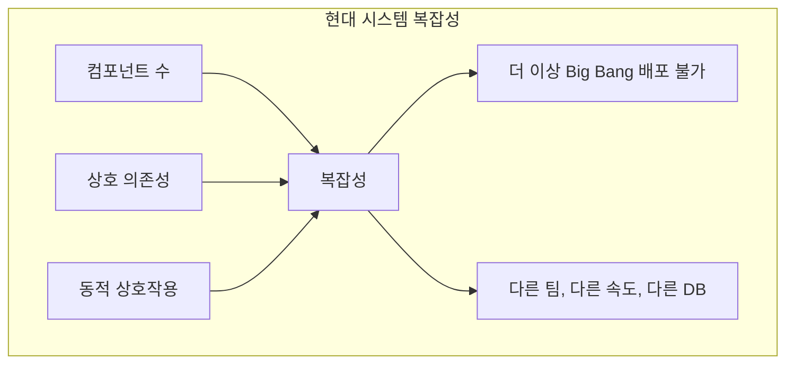

> **90년대**: 애플리케이션 내리고, 업그레이드하고, 다시 올리면 끝
> **현재**: 다양한 팀이 다른 컴포넌트를 다른 속도로 개발, 여러 DB 정합성 유지 필요

#### 복잡성의 두 가지 유형 (복습)

| 복잡성 유형 | 정의 | 해결 방법 |
|------------|------|----------|
| **Essential Complexity** | 문제 도메인 자체의 본질적 복잡성 | 제거 불가, 관리만 가능 |
| **Accidental Complexity** | 잘못된 설계, 비효율적 프로세스로 인한 복잡성 | 반드시 제거해야 함 |

---

### 2.2 Cynefin 프레임워크

#### 개요

- **개발자**: Dave Snowden (1999)
- **발음**: /kəˈnɛvɪn/ (커-네브-인)
- **의미**: 웨일스어로 "서식지(habitat)"
- **목적**: 개인과 조직이 복잡성을 이해하고 탐색하도록 돕는 Sense-making 도구

#### 5가지 컨텍스트

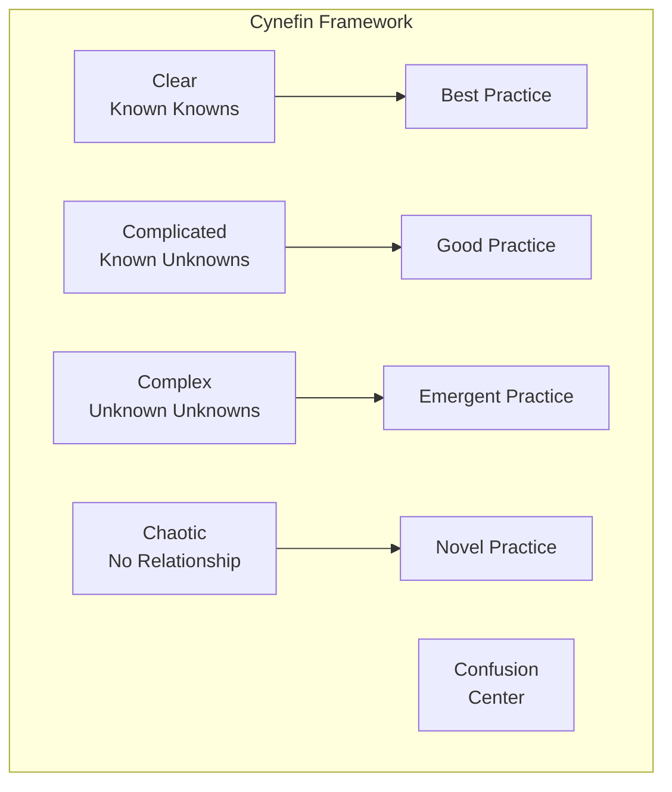

| 컨텍스트 | 특성 | 대응 방식 | DDD 패턴 |
|----------|------|----------|----------|
| **Clear** | Known Knowns, 인과관계 명확 | Sense → Categorize → Respond | Tactical만 |
| **Complicated** | Known Unknowns, 분석 필요 | Sense → Analyze → Respond | Strategic + Tactical |
| **Complex** | Unknown Unknowns, 패턴이 후에 드러남 | Probe → Sense → Respond | Strategic + Explorative |
| **Chaotic** | 인과관계 불명확, 즉각 행동 필요 | Act → Sense → Respond | Explorative만 |
| **Confusion** | 어떤 컨텍스트인지 불명확 | 분류 먼저 필요 | Explorative |

#### 패턴 적용 매트릭스

| 컨텍스트 | Strategic | Tactical | Explorative |
|----------|-----------|----------|-------------|
| Clear | ❌ | ✅ | ❌ |
| Complicated | ✅ | ✅ | ❌ |
| Complex | ✅ | ❌ | ✅ |
| Chaotic | ❌ | ❌ | ✅ |
| Confusion | ❌ | ❌ | ✅ |

#### 실제 사례: Brown's Chicken 사건 (1993)

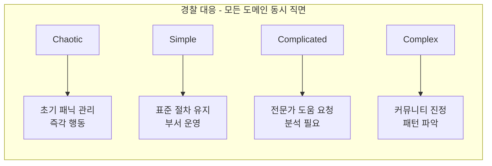

---

### 2.3 Residuality Theory (잔여 이론)

#### 개요

- **제안자**: Barry O'Reilly
- **핵심 개념**: 시스템의 미래는 스트레서(Stressor)에 의해 남겨진 잔여물(Residue)에 의해 결정됨

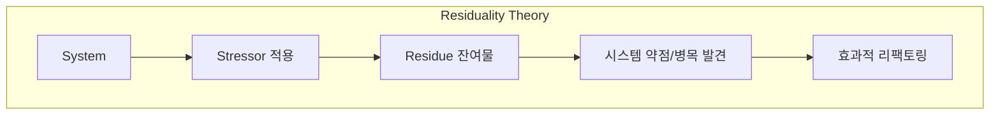

#### Stressor와 리팩토링

| Stressor 예시 | 드러나는 문제 | 리팩토링 방향 |
|--------------|--------------|--------------|
| 사용자 급증 | 성능 병목 | 스케일링 개선 |
| 예상치 못한 동작 | 로직 결함 | 비즈니스 규칙 정제 |
| 네트워크/하드웨어 장애 | 복원력 부족 | 장애 대응 강화 |

#### E-commerce 예시

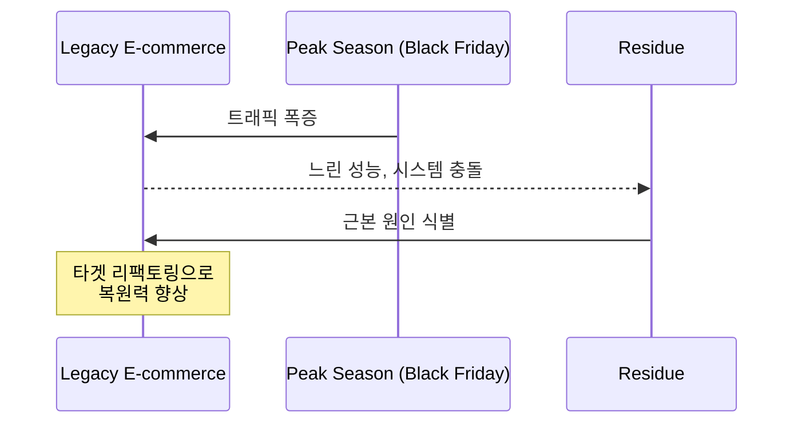

> **핵심**: 레거시 코드, 고착된 프로세스, 확립된 문화 규범 등의 잔여물이 시스템의 현재와 미래 상태에 영향

---

### 2.4 EventStorming

#### 개요

- **창시자**: Alberto Brandolini
- **목적**: 모든 이해관계자가 함께 도메인 모델을 구축하는 협업 워크샵
- **핵심 도구**: 주황색 스티키 노트 (도메인 이벤트)

#### 3가지 포맷

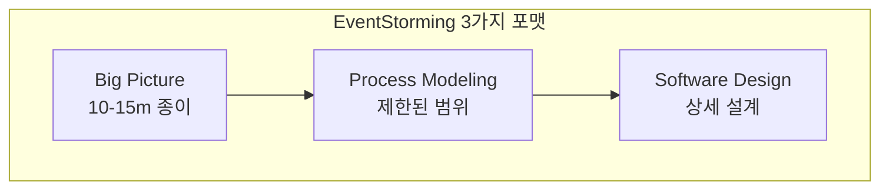

##### 1. Big Picture

| 항목 | 설명 |
|------|------|
| **목적** | 전체 데이터 흐름 파악, 공통 언어 수립 |
| **참여자** | 모든 이해관계자 (비즈니스, 개발자, 기획자) |
| **산출물** | 주요 이벤트와 Pain Points 식별 |
| **규모** | 10-15m 종이 (더 커질 수 있음) |

##### 2. Process Modeling

| 항목 | 설명 |
|------|------|
| **목적** | 특정 프로세스의 상세 모델링 |
| **참여자** | 해당 프로세스 관련 이해관계자 |
| **특징** | UML/BPMN 대신 모두가 이해할 수 있는 도구 사용 |
| **산출물** | Bounded Context 경계 식별 |

##### 3. Software Design

| 항목 | 설명 |
|------|------|
| **목적** | 각 Bounded Context의 상세 설계 |
| **산출물** | Aggregate, Domain Event, Command, Policy, Service 식별 |
| **결과** | 팀을 위한 상세 소프트웨어 구조 |

#### EventStorming Grammar

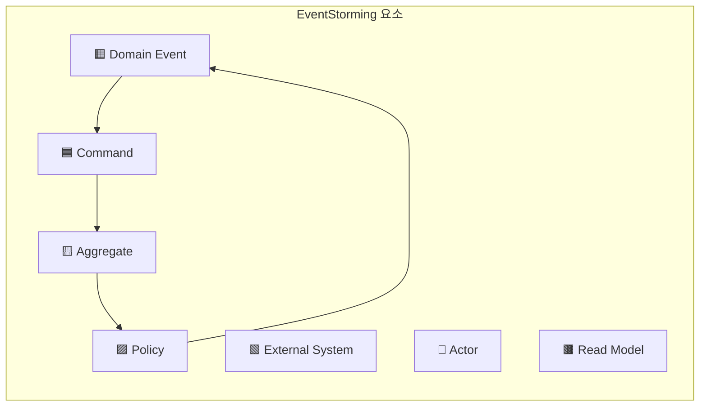

| 요소 | 색상 | 역할 |
|------|------|------|
| **Domain Event** | 🟧 주황 | 도메인에서 발생한 사건 |
| **Command** | 🟦 파랑 | 이벤트를 발생시키는 명령 |
| **Aggregate** | 🟨 노랑 | 일관성 경계 |
| **Policy** | 🟪 보라 | 이벤트에 반응하는 비즈니스 규칙 |
| **External System** | 🟩 분홍 | 외부 시스템 |
| **Read Model** | 🟫 초록 | 조회 모델 |

---

### 2.5 Problem Space vs Solution Space

#### 아인슈타인의 명언

> **"세상을 구할 시간이 1시간 주어진다면, 55분은 문제 정의에, 5분만 해결책 찾기에 쓰겠다."**

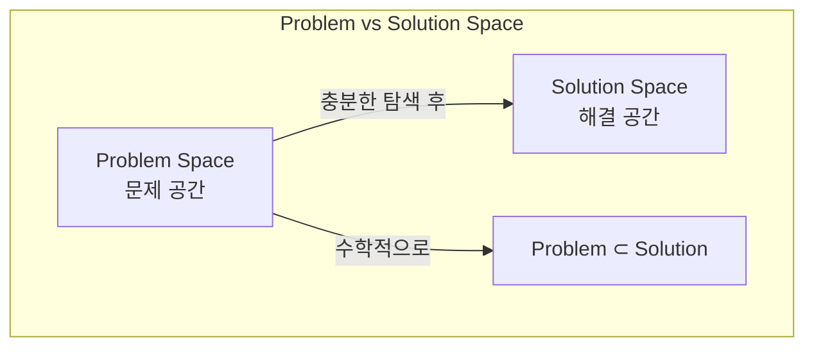

| 공간 | 정의 | 활동 |
|------|------|------|
| **Problem Space** | 애플리케이션이 해결해야 할 모든 문제의 집합 | 도메인 탐색, 이해관계자 협업, 시나리오 분석 |
| **Solution Space** | 각 문제를 해결하는 모든 해결책의 집합 | 설계, 구현, 기술적 결정 |

#### 왜 Problem Space에 오래 머물러야 하는가?

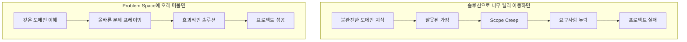

#### Model Exploration Whirlpool (Eric Evans)

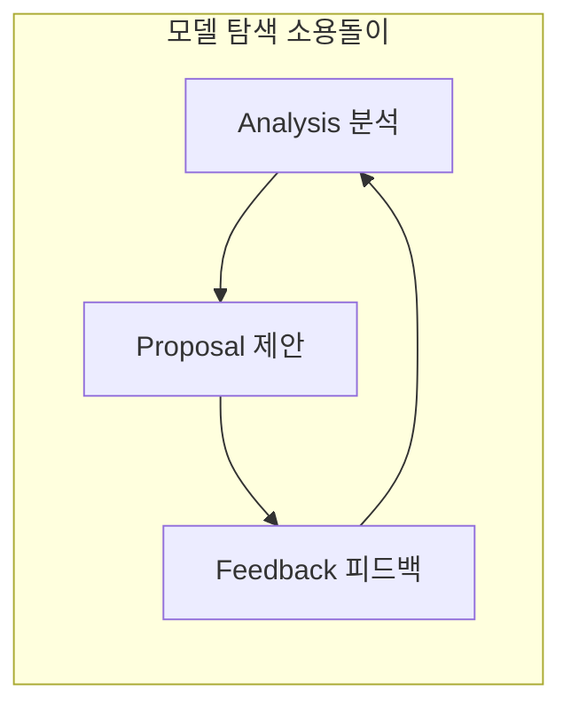

> **Big Front Design의 문제**: 도메인 지식이 가장 적을 때 가장 중요한 결정을 내리게 됨 → "무지를 고정시키는 블록"

---

### 2.6 Deliberate Discovery (Dan North)

#### 핵심 개념

| 용어 | 설명 |
|------|------|
| **Deliberate Discovery** | 무지를 줄이기 위해 능동적으로 지식을 추구 |
| **Learning vs Ignorance** | 무지가 프로젝트 성공의 주요 제약 |
| **Accidental vs Deliberate** | 수동적 우연 학습 vs 의도적 발견 |
| **Non-linear Discovery** | 학습은 불규칙하고 예상치 못한 방식으로 발생 |

#### 권장 사항

```
✅ 작업 추정보다 지식 획득에 집중
✅ 다양한 무지 인식 (기술적, 도메인, 조직적)
✅ 초기에 미지수를 줄이는 의도적 발견 노력
✅ 예상치 못한 문제에 대비
```

---

### 2.7 Five Orders of Ignorance (Phillip Armour)

#### 핵심 논지

> **"소프트웨어 개발의 진정한 산출물은 소프트웨어에 내장된 지식이다."**

#### 5단계 무지

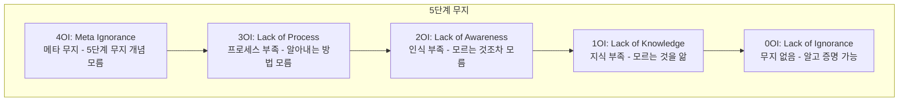

| 단계 | 이름 | 설명 |
|------|------|------|
| **0OI** | 무지 없음 | 알고 있고 증명할 수 있음 |
| **1OI** | 지식 부족 | 모르지만, 무엇을 모르는지 앎 |
| **2OI** | 인식 부족 | 모르는 것조차 모름 (가장 위험) |
| **3OI** | 프로세스 부족 | 알아내는 방법을 모름 |
| **4OI** | 메타 무지 | 이 5단계 개념 자체를 모름 |

#### 무지 간극 연결 팁

```
□ 토론 제어 유지 - 너무 빨리 결론으로 가지 않도록
□ 다양한 솔루션 경청 - 모든 참여자의 제안 포함
□ 주요 솔루션 숨기기 - 솔루션이 자연스럽게 도출되도록 유도
```

---

### 2.8 Deleuzian Walk (들뢰즈적 산책)

#### 개념

- **출처**: Gilles Deleuze, "Difference and Repetition" (1968)
- **비유**: 새로운 길을 처음 걸을 때 vs 여러 번 걸은 후

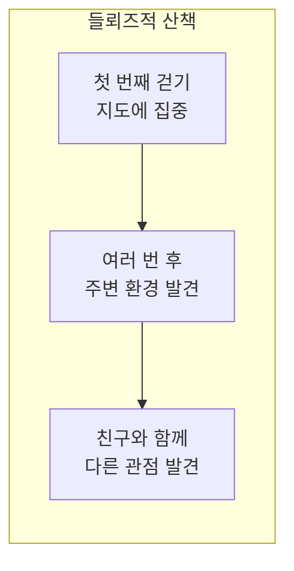

| 학습 방식 | 설명 | 도메인 탐색 적용 |
|----------|------|-----------------|
| **선형 학습** | 지도에서 학습 (객관적, 명확한 정의) | 요구사항 문서 읽기 |
| **측면 학습** | 눈으로 관찰하며 발견 (주관적, 풍부) | 도메인 탐색, EventStorming |

> **핵심**: 도메인은 비즈니스 요구사항에 따라 계속 변화 → 구조를 너무 일찍 고정하면 위험하고 비생산적

---

### 2.9 의사결정과 인지 편향

#### System 1 vs System 2 (Daniel Kahneman)

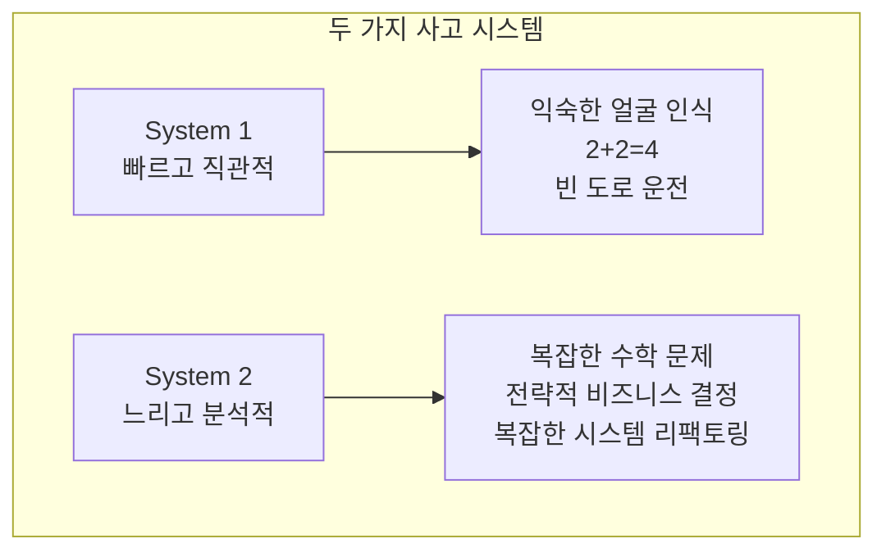

| 시스템 | 특성 | 리팩토링 적용 |
|--------|------|--------------|
| **System 1** | 자동적, 빠름, 노력 적음 | 코드 스멜 인식, 간단한 메서드 추출 |
| **System 2** | 의도적, 느림, 노력 필요 | 대규모 재구조화, 리팩토링 계획, 편향 완화 |

#### 리팩토링에서 System 1 & 2 활용

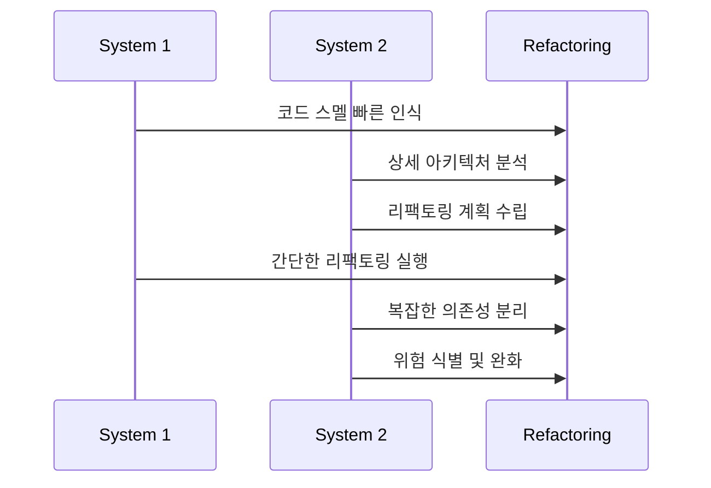

#### 주요 인지 편향과 대응

##### 1. Anchoring Bias (앵커링 편향)

| 설명 | 대응 방법 |
|------|----------|
| 첫 번째 정보에 과도하게 의존 | 여러 솔루션 브레인스토밍 |
| 첫 솔루션/설계에 고착 | 의사결정 매트릭스 사용 |
| | "냉각 기간" 설정 |

##### 2. Confirmation Bias (확증 편향)

| 설명 | 대응 방법 |
|------|----------|
| 기존 생각을 확인하는 정보만 탐색 | 도전 문화 조성 (Devil's Advocate) |
| 비판적 피드백 무시 | 다양한 역할/전문성 참여 |
| | 정적 분석기, 자동 테스트로 객관적 피드백 |

##### 3. Availability Heuristic (가용성 휴리스틱)

| 설명 | 대응 방법 |
|------|----------|
| 최근/생생한 사건에 과도한 가중치 | 과거 데이터 기반 분석 |
| 비행기 추락 vs 자동차 사고 | 리팩토링 로그 유지 |
| | 구조화된 회고 수행 |

---

### 2.10 실전 예제: 레거시 시스템 리팩토링

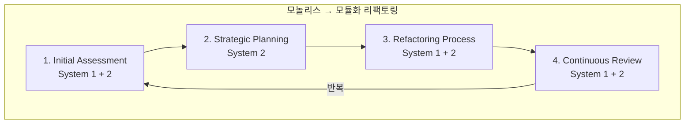

| 단계 | System 1 활용 | System 2 활용 |
|------|--------------|--------------|
| **Initial Assessment** | 명백한 코드 스멜 인식 | 아키텍처, 의존성 상세 분석 |
| **Strategic Planning** | - | 모놀리스를 Bounded Context로 분해 계획 |
| **Refactoring** | 간단한 코드 정리, 리네이밍 | 새 인터페이스 정의, 의존성 분리 |
| **Continuous Review** | Quick Win 식별 | 새로운 도전/요구사항 대응 |

---

## 💡 실무 적용 포인트

### 복잡성 탐색 도구 요약

| 도구 | 목적 | 사용 시점 |
|------|------|----------|
| **Cynefin** | 상황 분류 및 대응 전략 결정 | 프로젝트 초기, 문제 분류 시 |
| **Residuality Theory** | 스트레서로 시스템 약점 발견 | 레거시 시스템 분석 시 |
| **EventStorming** | 협업 도메인 모델링 | 도메인 탐색, 리팩토링 계획 시 |
| **Deliberate Discovery** | 능동적 무지 감소 | 프로젝트 전 기간 |

### Problem Space 체크리스트

```
□ 솔루션으로 너무 빨리 이동하지 않기
□ 모든 이해관계자와 협업하여 문제 정의
□ EventStorming으로 도메인 탐색
□ 다양한 관점 수집 및 통합
□ Model Exploration Whirlpool 반복
□ 2OI (인식 부족) 영역 식별 노력
```

### 인지 편향 대응 전략

```
□ Anchoring → 여러 대안 탐색, 냉각 기간
□ Confirmation → Devil's Advocate, 다양한 전문성
□ Availability → 과거 데이터 분석, 회고
□ System 2 의도적 활성화 → 복잡한 결정에 시간 투자
```

---

## ✅ 핵심 개념 체크리스트

- [ ] Essential vs Accidental Complexity 구분
- [ ] Cynefin 5가지 컨텍스트와 대응 방식
- [ ] Cynefin 컨텍스트별 DDD 패턴 적용 매트릭스
- [ ] Residuality Theory와 Stressor 개념
- [ ] EventStorming 3가지 포맷 (Big Picture, Process, Software Design)
- [ ] Problem Space vs Solution Space 차이
- [ ] Model Exploration Whirlpool 개념
- [ ] Deliberate Discovery 핵심 원칙
- [ ] Five Orders of Ignorance (특히 2OI)
- [ ] Deleuzian Walk - 선형 vs 측면 학습
- [ ] System 1 (빠른/직관적) vs System 2 (느린/분석적)
- [ ] 3가지 인지 편향과 대응 방법

---

## 🔗 참고 자료

- [Cynefin Framework - Wikipedia](https://en.wikipedia.org/wiki/Cynefin_framework)
- [A Leader's Framework for Decision Making - Snowden & Boone](https://strategicleadership.com.au/wp-content/uploads/2017/06/A-Leader%E2%80%99s-Framework-for-Decision-Making-HBR-Nov-2007.pdf)
- [Residuality Theory - O'Reilly NDC Oslo 2023](https://www.youtube.com/watch?v=0wcUG2EV-7E)
- [EventStorming.com](https://www.eventstorming.com/)
- [Introducing Deliberate Discovery - Dan North](https://dannorth.net/introducing-deliberate-discovery/)
- [The Five Orders of Ignorance - Phillip Armour](https://cacm.acm.org/opinion/the-five-orders-of-ignorance/)
- Thinking, Fast and Slow - Daniel Kahneman

---

## 📚 다음 챕터 미리보기

- **Chapter 3**: Strategic Patterns - Context Mapping과 전략적 패턴으로 도메인 내 컨텍스트 식별 및 관계 관리
