# Chapter 3: Strategic Patterns (전략적 패턴)

## 📌 핵심 요약

> **"유비쿼터스 언어(Ubiquitous Language)를 통해 모호성을 제거하고, Bounded Context로 대규모 모델을 분할하며, Context Mapping을 통해 컨텍스트 간 관계와 통신 패턴을 정의한다. 이를 통해 복잡한 시스템을 모듈화하고 확장 가능하며 유지보수하기 쉬운 구조로 리팩토링할 수 있다."**

이 챕터에서는 DDD의 전략적 패턴을 학습하고, 도메인을 효과적으로 분할하는 방법을 다룬다.

---

## 🎯 학습 목표

이 챕터를 완료하면 다음을 할 수 있다:

- [ ] 유비쿼터스 언어의 중요성과 전화 게임(Telephone Game) 문제 이해
- [ ] Bounded Context 정의 및 경계 식별 방법 습득
- [ ] Context Mapping 기법으로 컨텍스트 관계 시각화
- [ ] 서브도메인 유형(Core, Supporting, Generic) 분류
- [ ] 7가지 통신 패턴 적용 시나리오 파악
- [ ] 완전한 Context Map 작성 능력 확보

---

## 📖 본문 정리

### 3.1 용어의 명확한 정의 - 문제의 절반을 해결

#### 전화 게임(Telephone Game) 문제

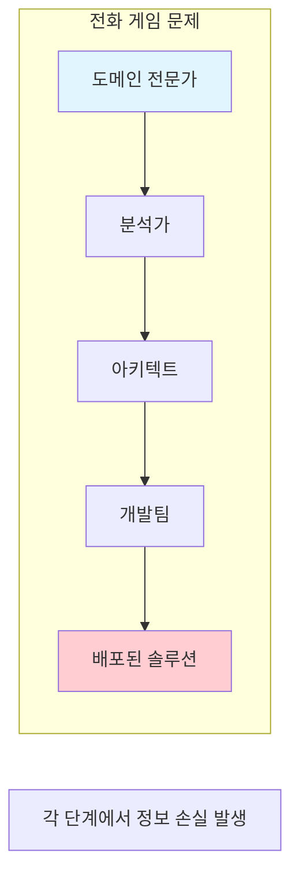

**문제점**:
- 비즈니스 전문가 → 기술 팀으로 전달 시 언어 변환 필요
- 각 단계마다 해석이 달라지고 정보가 손실됨
- 최종 결과물이 원래 요구사항과 다를 수 있음

#### 잘못된 해결책: 직접 대화

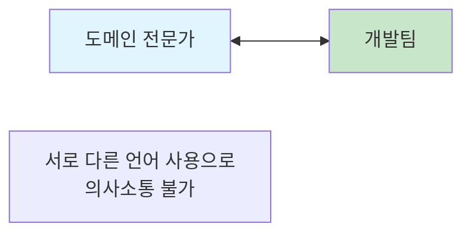

**문제점**: 비즈니스 언어와 기술 언어가 달라 상호 이해 불가

#### 올바른 해결책: 유비쿼터스 언어

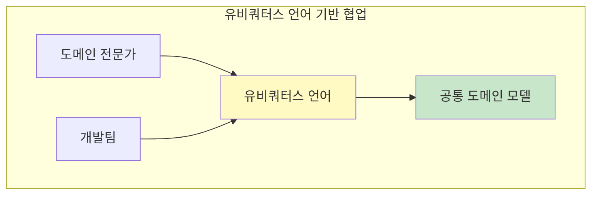

**Evans의 원칙**:

> "모델 기반 언어를 일상적으로 사용하고, 그것이 자연스럽게 흐를 때까지 만족하지 마라. 그래야 완전하고 이해 가능한 모델에 도달할 수 있다."

| 역할 | 책임 |
|------|------|
| **도메인 전문가** | 어색하거나 부적절한 용어/구조에 이의 제기 |
| **개발자** | 설계를 방해하는 모호성이나 불일치 감시 |

#### 모델 정렬의 중요성

**잘못된 모델 (하나의 거대한 Customer 모델)**:
```
Customer {
    invoiceData      // 청구 데이터
    personalData     // 개인 데이터
    deliveryAddress  // 배송 주소
    headquarters     // 본사 주소
    ...
}
```

**문제점**:
- 물류 영역 수정 시 → 판매, 구매 영역도 변경 필요
- 강한 결합으로 인한 변경 공포
- 새로운 기능 추가 시 전체 시스템 영향

**해결책**: 비즈니스 문제에 맞춘 여러 개의 작은 모델

---

### 3.2 Bounded Context란?

#### 정의

**Bounded Context**는 DDD의 핵심 패턴으로, 대규모 모델을 작은 모델들로 분할할 수 있게 해주는 전략적 패턴이다.

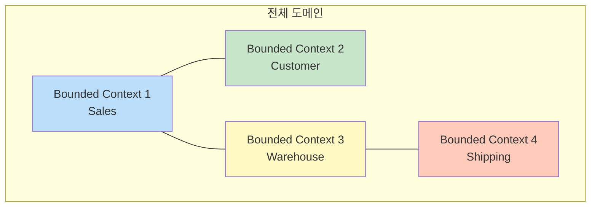

#### 경계 식별 방법

**1. Pivotal Events (중요 이벤트)**

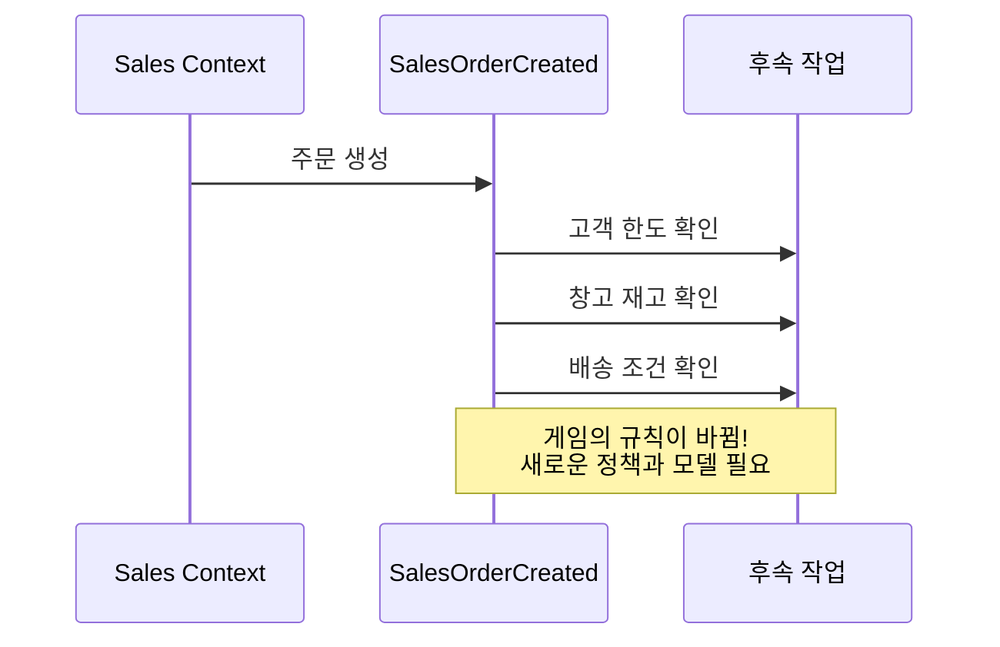

**Pivotal Event의 특성**:
- 프로세스 흐름을 변경하는 이벤트
- 새로운 정책과 처리가 필요해지는 시점
- 다른 Bounded Context로 이동하는 신호

**2. Human Behaviors (인간 행동)**

| 컨텍스트 | 관련 인력 | 행동 특성 |
|----------|-----------|-----------|
| Payment | 결제 담당자 | 금융 규정 준수, 정산 |
| Logistics | 물류 담당자 | 배송 최적화, 재고 관리 |
| Sales | 영업 담당자 | 고객 관계, 주문 처리 |

**핵심 원칙**:
- 모델이 비즈니스 흐름을 더 이상 매핑하지 못할 때 → 경계 밖으로 이동
- 리팩토링 시 첫 번째 작업: 다른 Bounded Context에 속한 객체 간 결합 제거

---

### 3.3 도메인을 의미 있는 경계로 분할

#### 비즈니스 도메인 vs 서브도메인

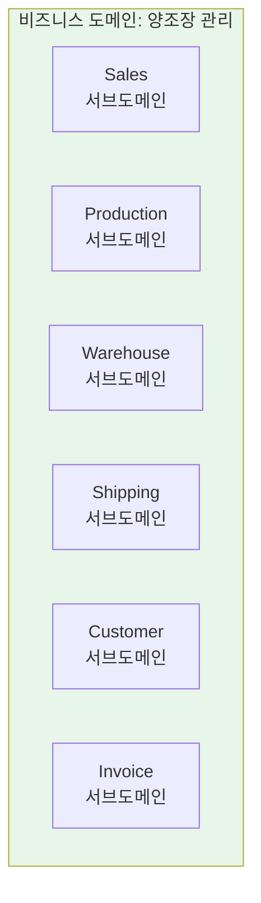

**중요한 개념**:
- **비즈니스 도메인**: 회사의 주요 활동 영역 (예: 양조장 관리)
- **서브도메인**: 도메인의 특정 측면에 집중하는 작은 부분
- 비즈니스 도메인 ≠ 소프트웨어 애플리케이션

#### 톱니바퀴 비유

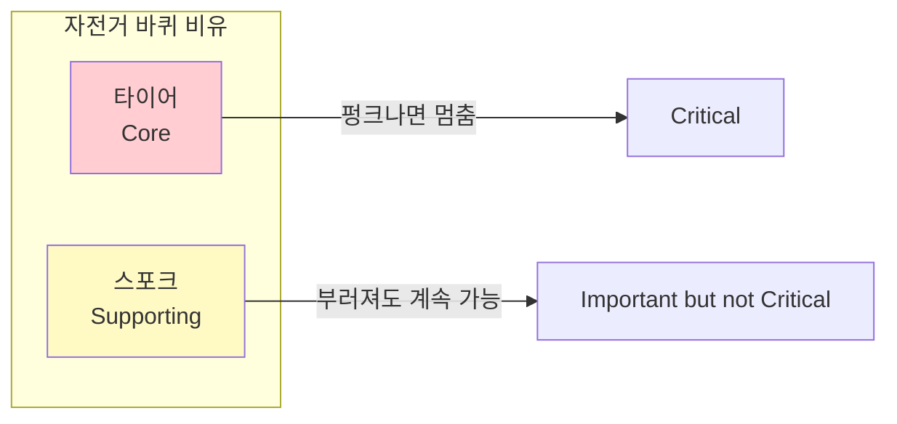

**양조장 예시**:
- **생산 부서** (타이어): 최고의 맥주 생산 - 핵심
- **창고 시스템** (스포크): 재고 관리 - 중요하지만 핵심은 아님

#### Gall's Law

> "작동하는 복잡한 시스템은 항상 작동하는 단순한 시스템에서 진화한 것이다. 처음부터 복잡하게 설계된 시스템은 절대 작동하지 않으며, 작동하게 만들 수도 없다. 작동하는 단순한 시스템에서 다시 시작해야 한다."

**Joshua Kerievsky (Refactoring To Patterns 저자)**:

> "코드 설계를 지속적으로 개선하면 작업하기가 점점 더 쉬워진다. 이는 일반적으로 일어나는 일과 대조적이다: 적은 리팩토링과 새 기능 추가에 대한 많은 관심."

---

### 3.4 Context Mapping

#### 정의

**Context Mapping**은 시스템 내 Bounded Context 간의 관계와 상호작용을 시각화하고 이해하는 기법이다.

#### Context Mapping 단계

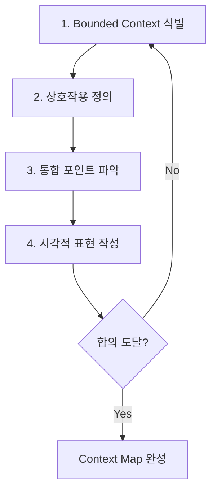

| 단계 | 활동 | 산출물 |
|------|------|--------|
| 1단계 | Bounded Context 식별 | 명확한 경계와 도메인 모델 |
| 2단계 | 상호작용 정의 | 의존성, 데이터/서비스 공유 여부 |
| 3단계 | 통합 포인트 파악 | 통신/통합 필요 지점 |
| 4단계 | 시각적 표현 | 정보 흐름과 의존성 다이어그램 |

#### 양조장 ERP Context Map 예시

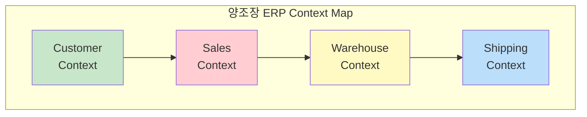

---

### 3.5 서브도메인 유형

#### 세 가지 유형

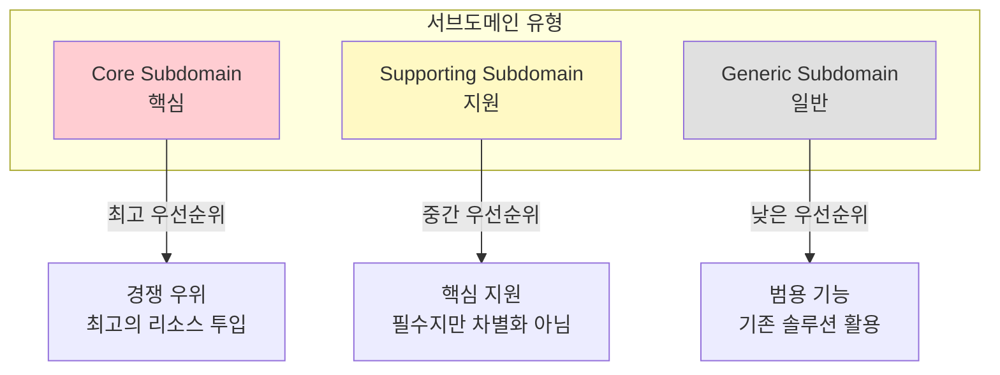

#### 상세 비교

| 유형 | 정의 | 특성 | 예시 (양조장 ERP) |
|------|------|------|-------------------|
| **Core** | 비즈니스의 심장 | 고유 가치 제안, 경쟁 우위, 가장 복잡 | Sales System |
| **Supporting** | 핵심 지원 | 중요하지만 주 경쟁력은 아님 | Customer Service |
| **Generic** | 범용 기능 | 많은 비즈니스에 공통, 혁신 불필요 | Invoice System |

#### 팀 구성 전략

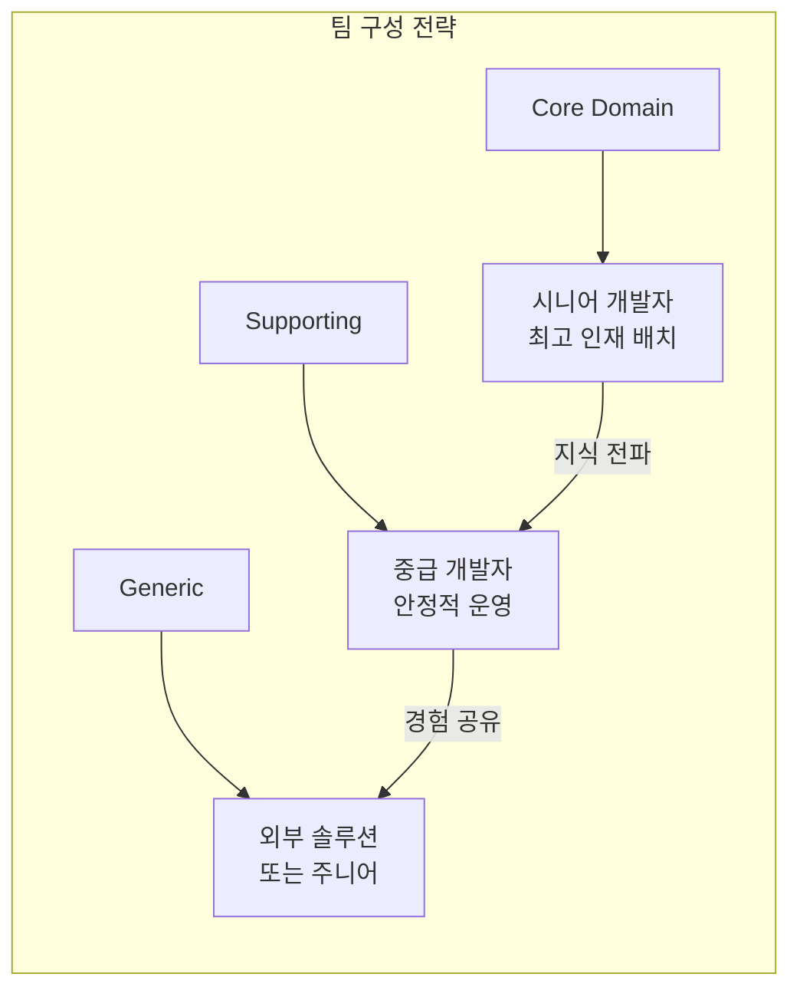

#### 서브도메인은 변한다

> **중요**: 시간이 지나면서 도메인 지식이 향상되고 비즈니스 흐름이 변화한다. Bounded Context의 중요도나 유형도 그에 따라 변할 수 있다.

---

### 3.6 Bounded Context 간 통신 패턴

#### 올바른 통신의 중요성

| 효과 | 설명 |
|------|------|
| **일관성 유지** | 시스템 전체에서 데이터와 동작의 일관성 보장 |
| **유연성 향상** | 시스템을 깨뜨리지 않고 독립적 진화 가능 |
| **결합도 감소** | 관리와 리팩토링이 용이한 최소 의존성 |
| **명확성 개선** | 명확한 상호작용 패턴으로 이해와 유지보수 용이 |

#### 7가지 통신 패턴

---

##### 1. Shared Kernel (공유 커널)

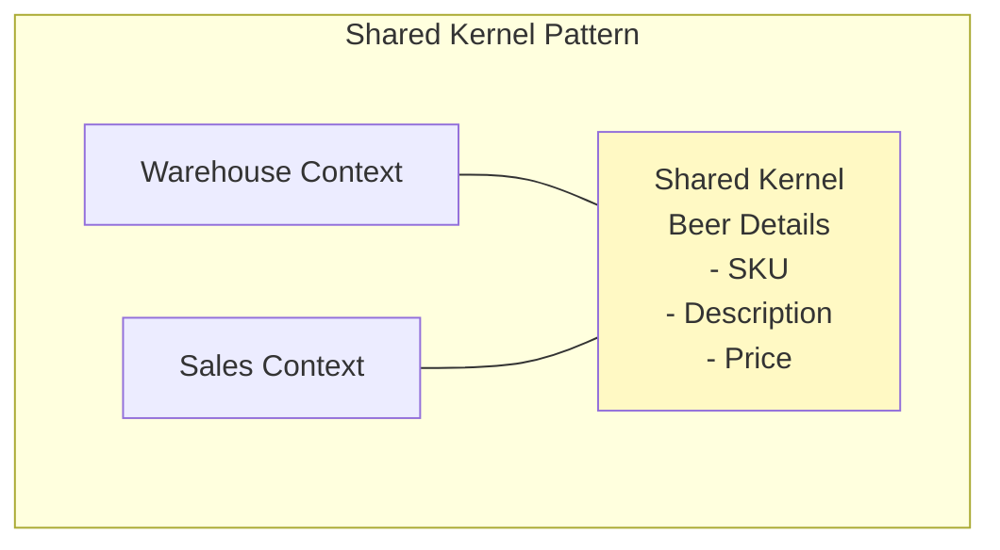

**정의**: 두 개 이상의 Bounded Context가 도메인 모델의 일부를 공유

**사용 시나리오**:
- 컨텍스트 간 강한 상호의존성
- 특정 측면에 대한 공통 이해 필요

**예시**:
- Warehouse: 재고 수준, 맥주 상세, 창고 위치 관리
- Sales: 고객 주문, 주문 처리, 이행 관리
- 공유: 맥주 SKU, 설명, 가격

---

##### 2. Customer-Supplier (고객-공급자)

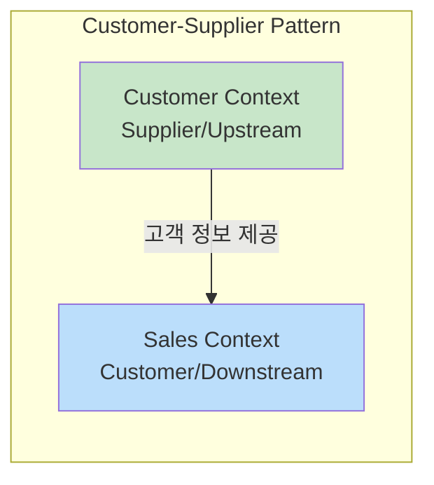

**정의**: 명확한 업스트림-다운스트림 관계 수립

**역할**:
- **Supplier (Upstream)**: 서비스/데이터 제공, 신뢰성 보장 책임
- **Customer (Downstream)**: 제공된 서비스에 의존

**예시**:
- Customer Context: 한도(plafond), 특별 분류 관리
- Sales Context: 주문, 결제 처리 관리
- 관계: Customer → Sales로 정확한 고객 정보 적시 제공

---

##### 3. Conformist (순응자)

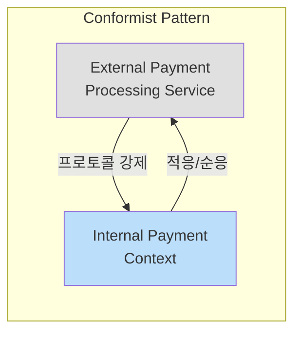

**정의**: 다운스트림 컨텍스트가 업스트림의 모델과 프로토콜을 그대로 채택

**사용 시나리오**:
- 업스트림 컨텍스트에 대한 통제력이 거의 없을 때
- 외부 시스템과의 통합

**예시**:
- 외부 결제 처리 서비스: 데이터 형식, 상호작용 프로토콜 지정
- 내부 결제 컨텍스트: 외부 서비스 요구사항에 순응

---

##### 4. Anticorruption Layer (ACL, 부패 방지 계층)

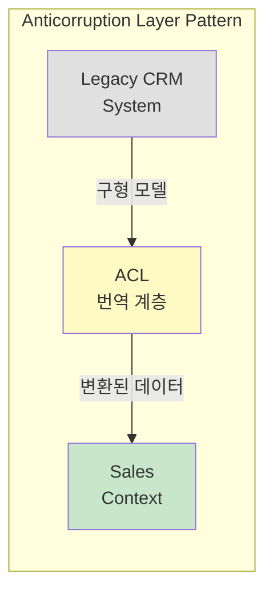

**정의**: 두 Bounded Context 모델 간 번역/적응 계층 도입

**목적**: 다운스트림 컨텍스트가 업스트림 모델에 오염되지 않도록 보호

**예시**:
- Legacy CRM: 고객 관계, 과거 데이터, 영업 상호작용 관리
- Sales Context: 현재 영업 프로세스, 고객 상호작용, 주문 관리
- ACL: CRM 데이터를 Sales 컨텍스트 형식/구조로 변환

---

##### 5. Open Host Service (OHS, 개방형 호스트 서비스)

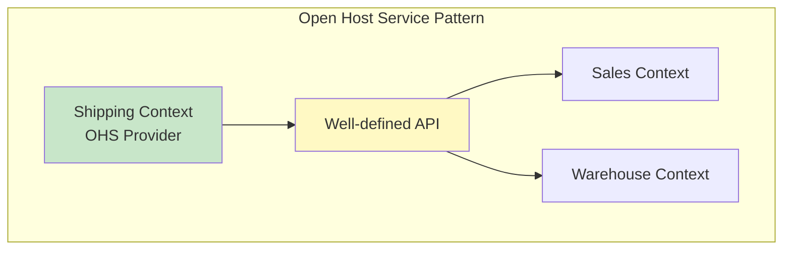

**정의**: 잘 정의된 서비스 인터페이스를 통해 기능 노출

**특징**:
- 느슨한 결합 촉진
- 명확한 계약 정의
- 다른 컨텍스트가 긴밀한 결합 없이 상호작용 가능

**예시**:
- Shipping Context: 배송료, 운송사, 추적 정보 관리
- Sales: 주문 이행을 위한 배송 서비스 요청
- Warehouse: 재고 이동/보충을 위한 배송 정보 요청

---

##### 6. Published Language (발행된 언어)

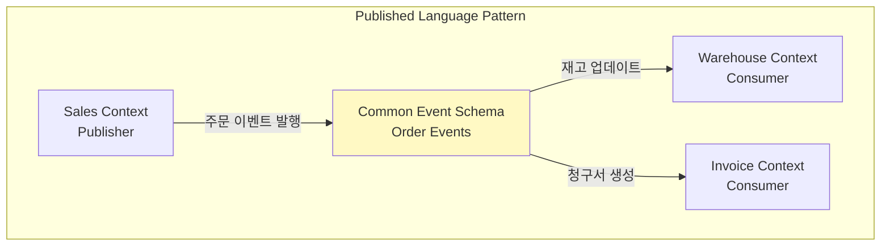

**정의**: 여러 Bounded Context가 통신에 사용하는 공유 언어(공통 용어, 데이터 구조) 정의

**효과**:
- 오해 감소
- 통합 복잡성 감소

**예시**:
- Sales: 새 주문 시 주문 이벤트 발행
- Warehouse: 주문 이벤트 소비 → 재고 수준 업데이트
- Invoice: 주문 이벤트 소비 → 청구서 생성
- Published Language: 모든 서비스가 올바르게 해석할 수 있는 주문 이벤트 스키마

---

##### 7. Separate Ways (분리된 길)

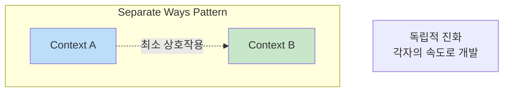

**정의**: 최소한의 상호작용을 가진 컨텍스트를 명시적으로 분리

**특징**:
- 결합도 감소
- 더 민첩하고 반응적인 개발 사이클
- 각 컨텍스트가 자체 속도와 방향으로 진화

**사용 시나리오**:
- 두 컨텍스트가 독립적으로 진화해야 할 때
- 상호 의존성이 거의 없을 때

---

### 3.7 완전한 Context Map

#### 양조장 ERP 최종 Context Map

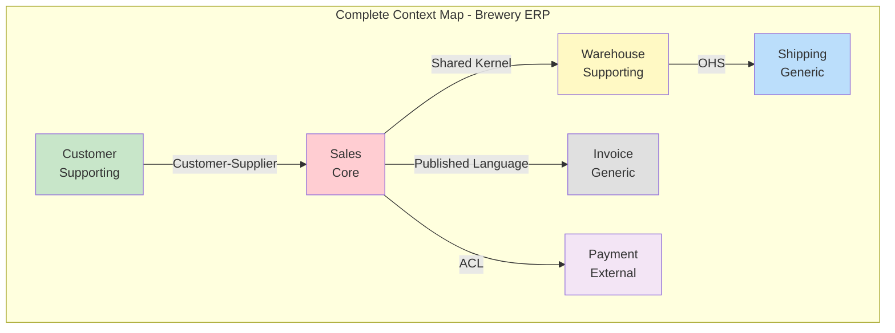

#### 패턴 선택 가이드

| 상황 | 권장 패턴 |
|------|-----------|
| 강한 상호의존성, 공통 이해 필요 | Shared Kernel |
| 명확한 공급자-소비자 관계 | Customer-Supplier |
| 외부 시스템, 통제력 없음 | Conformist |
| 레거시 시스템 통합 | ACL |
| 명확한 서비스 인터페이스 필요 | OHS |
| 이벤트 기반 통신 | Published Language |
| 최소 상호작용, 독립 진화 | Separate Ways |

---

## 💡 실무 적용 포인트

### Context Map 작성 프로세스

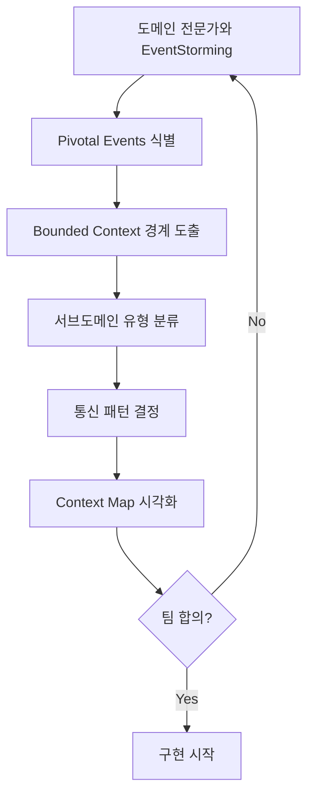

### 리팩토링 시 적용 순서

| 순서 | 활동 | 목표 |
|------|------|------|
| 1 | 유비쿼터스 언어 정립 | 팀 전체 공통 용어 확보 |
| 2 | Bounded Context 식별 | 경계와 책임 명확화 |
| 3 | 서브도메인 유형 분류 | 리소스 우선순위 결정 |
| 4 | Context Mapping | 관계와 통신 패턴 정의 |
| 5 | 결합 제거 | 컨텍스트 간 의존성 분리 |
| 6 | 점진적 리팩토링 | 단순한 시스템에서 시작 |

### 서브도메인 변화 관리

```mermaid
timeline
    title 서브도메인 진화 예시
    초기 : Generic (외부 결제 시스템)
    성장기 : Supporting (내부 결제 로직 추가)
    성숙기 : Core (결제가 경쟁 우위가 됨)
```

### 모듈러 모놀리스 vs 마이크로서비스

> **중요**: 도메인을 여러 서브도메인으로 분할한다고 해서 반드시 여러 자율 서비스를 만들 필요는 없다. 구현은 모듈러 모놀리스 또는 마이크로서비스 기반 솔루션 형태일 수 있다. 중요한 것은 Bounded Context가 자체 포함되어 있고 여러 서비스나 모듈에 걸쳐 있지 않아야 한다는 것이다.

---

## ✅ 핵심 개념 체크리스트

### 유비쿼터스 언어
- [ ] 전화 게임 문제와 해결책 이해
- [ ] 도메인 모델과 코드베이스 언어 정렬
- [ ] 비즈니스-기술 팀 간 모호성 제거

### Bounded Context
- [ ] 정의와 목적 이해
- [ ] Pivotal Events로 경계 식별
- [ ] Human Behaviors로 경계 확인

### 서브도메인 유형
- [ ] Core: 비즈니스 심장, 경쟁 우위
- [ ] Supporting: 핵심 지원, 필수 기능
- [ ] Generic: 범용, 기존 솔루션 활용

### 통신 패턴
- [ ] Shared Kernel: 모델 일부 공유
- [ ] Customer-Supplier: 업스트림-다운스트림 관계
- [ ] Conformist: 업스트림 모델 채택
- [ ] ACL: 번역/적응 계층
- [ ] OHS: 서비스 인터페이스 노출
- [ ] Published Language: 공유 이벤트 스키마
- [ ] Separate Ways: 독립적 진화

---

## 🔗 참고 자료

- [Eric Evans - Domain-Driven Design Reference](https://www.domainlanguage.com/ddd/reference/)
- [Context Mapping Pattern](https://www.infoq.com/articles/ddd-contextmapping/)
- [Bounded Context Canvas](https://github.com/ddd-crew/bounded-context-canvas)
- [Team Topologies](https://teamtopologies.com/)
- [Gall's Law](https://en.wikipedia.org/wiki/John_Gall_(author)#Gall's_law)

---

## 📚 다음 챕터 미리보기

- **Chapter 4**: Tactical Patterns (전술적 패턴) - 전략적 패턴을 구현하기 위한 실용적 도구와 기법
