# Chapter 4: Tactical Patterns (전술적 패턴)

## 📌 핵심 요약

> **"전략적 패턴이 도메인을 서브도메인으로 분할하는 경계를 식별한다면, 전술적 패턴은 각 Bounded Context 내부의 구성 요소를 식별한다. Entity, Value Object, Aggregate, Repository, Factory, Service, Module, 그리고 Event를 통해 비즈니스 로직을 풍부한 도메인 모델로 구현한다."**

이 챕터에서는 DDD의 전술적 패턴을 학습하고, 코드 레벨에서 도메인 모델을 구현하는 방법을 다룬다.

---

## 🎯 학습 목표

이 챕터를 완료하면 다음을 할 수 있다:

- [ ] Entity와 Value Object의 차이점 이해 및 구현
- [ ] Aggregate와 Aggregate Root의 역할 파악
- [ ] Repository 패턴으로 데이터 접근 추상화
- [ ] Factory 패턴으로 유효한 객체 생성 보장
- [ ] Domain Service와 Application Service 구분
- [ ] Module로 도메인 모델 조직화
- [ ] Domain Event와 Integration Event 구분 및 활용

---

## 📖 본문 정리

### 4.1 전술적 패턴의 목적

#### 전략적 패턴 vs 전술적 패턴

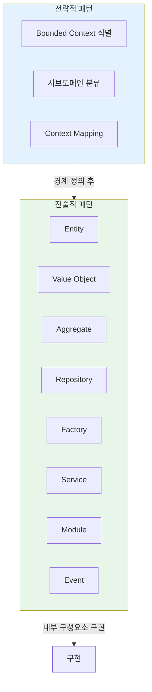

#### 서브도메인 유형별 접근 방식

| 서브도메인 유형 | 접근 방식 | 모델 특성 |
|----------------|-----------|-----------|
| **Generic** | CRUD로 충분 | 테이블 매핑 모델, ORM 활용 |
| **Supporting** | 적절한 패턴 적용 | 필요에 따라 선택적 적용 |
| **Core** | 전술적 패턴 필수 | 풍부한 도메인 모델 (Rich Domain Model) |

#### Anemic Domain vs Rich Domain Model

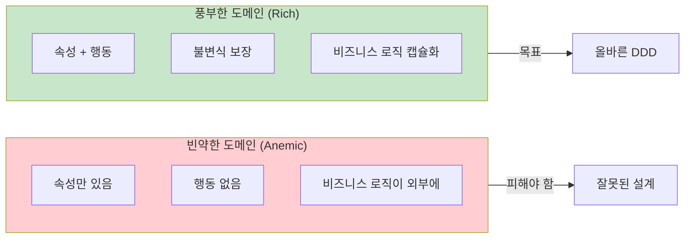

#### 양조장 ERP Sales Order 예시

Core 서브도메인(Sales)에서 새로운 판매 주문 생성 시 충족해야 할 제약조건:

1. **고객 신용 확인**: 주문 생성 가능한 충분한 신용 한도
2. **재고 확인**: 창고에서 맥주 가용성 또는 적절한 보충 가능성
3. **배송 주소 검증**: 유효하고 배송 가능 지역 내

---

### 4.2 Entity (엔티티)

#### 정의

**Entity**는 고유한 식별자(Identity)에 의해 정의되는 객체이다. 다른 속성이 동일하더라도 ID가 다르면 다른 엔티티이다.

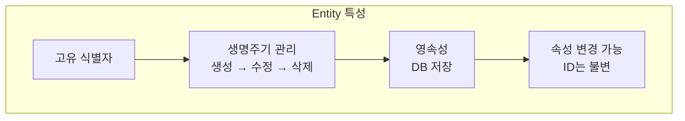

#### 코드 예시: SalesOrderRow

```csharp
public class SalesOrderRow : Entity
{
    internal BeerId _beerId;
    internal BeerName _beerName;
    internal Quantity _quantity;
    internal Price _beerPrice;

    protected SalesOrderRow()
    {
    }
}
```

**핵심 포인트**:

| 특성 | 설명 |
|------|------|
| **Entity 상속** | 기본 클래스로부터 ID 등 공통 속성 상속 |
| **커스텀 타입 사용** | `int`, `decimal` 대신 `BeerId`, `BeerName` 등 유비쿼터스 언어 반영 |
| **internal 접근자** | 네임스페이스 내부에서만 값 변경 가능 - 캡슐화 |

#### 외부 접근 방식

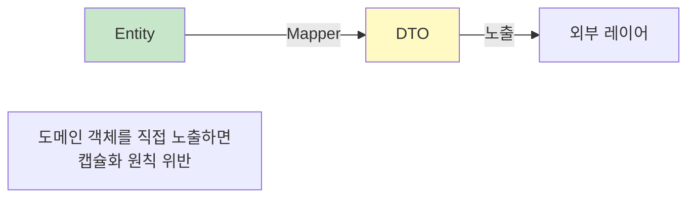

---

### 4.3 Value Object (값 객체)

#### 정의

**Value Object**는 고유 식별자 없이 속성에 의해 정의되는 객체이다. 모든 속성이 동일하면 같은 값 객체로 간주한다.

#### Entity vs Value Object

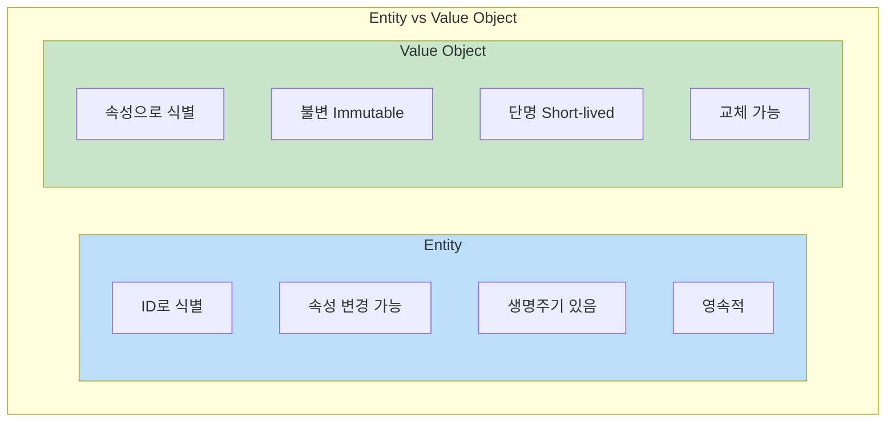

| 특성 | Entity | Value Object |
|------|--------|--------------|
| **식별** | 고유 ID | 속성 집합 |
| **동등성** | ID 비교 | 모든 속성 비교 |
| **변경** | 속성 수정 가능 | 불변, 새 객체 생성 |
| **예시** | Customer, Order | Address, Price, Quantity |

#### 코드 예시: Price

```csharp
public class Price(decimal value, string currency) : ValueObject
{
    public readonly decimal Value = value;
    public readonly string Currency = currency
        ?? throw new NotImplementedException(nameof(currency));

    protected override IEnumerable<object> GetEqualityComponents()
    {
        yield return Value;
        yield return Currency;
    }
}
```

**핵심 포인트**:

- **readonly**: 불변성 보장
- **GetEqualityComponents**: 동등성 비교를 위한 속성 반환
- **ID 없음**: 식별자가 아닌 속성으로만 정의

#### 컨텍스트에 따른 선택

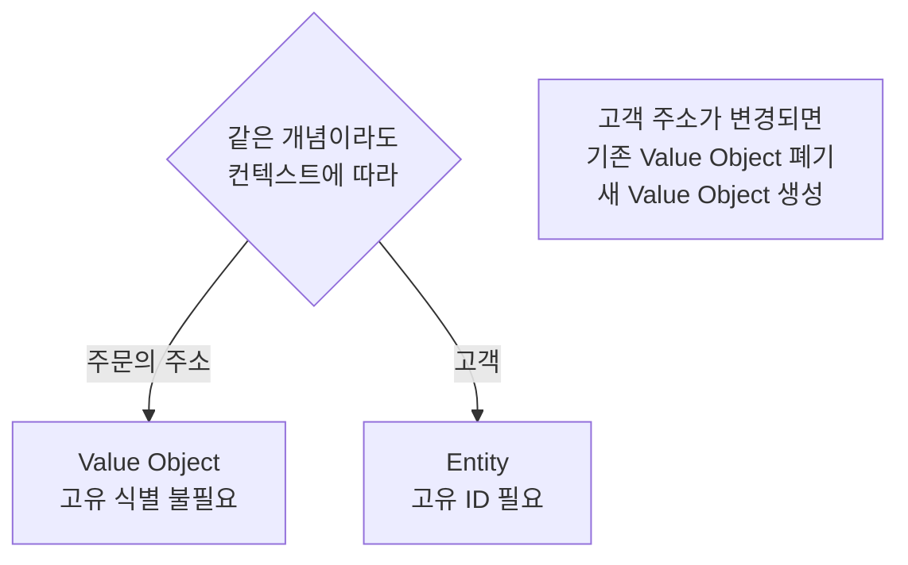

---

### 4.4 Aggregate (집합체)

#### 정의

**Aggregate**는 Entity와 Value Object의 논리적 그룹으로, 데이터 변경을 위해 단일 단위로 취급된다.

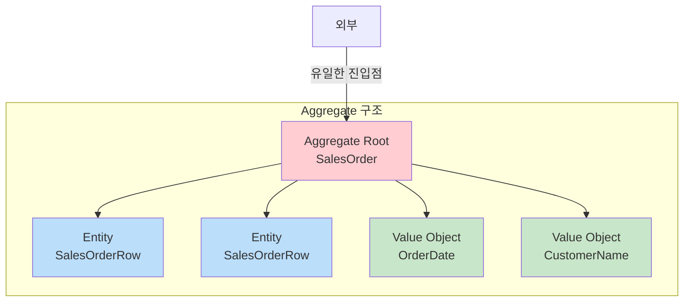

#### Aggregate의 핵심 원칙

| 원칙 | 설명 |
|------|------|
| **Aggregate Root** | 외부에서 접근 가능한 유일한 Entity |
| **일관성 경계** | 단일 트랜잭션 내에서 모든 변경 |
| **불변식 보장** | 비즈니스 규칙과 제약 조건 강제 |
| **캡슐화** | 내부 구조와 로직 숨김 |

#### Aggregate 간 참조 규칙

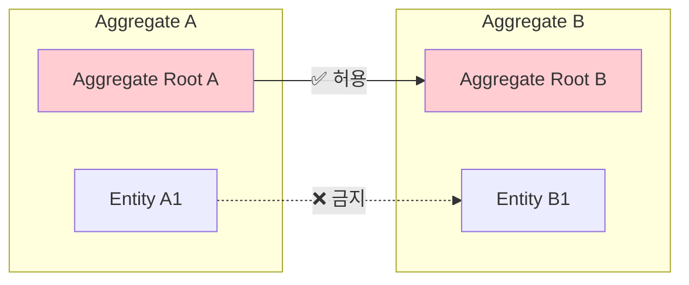

> **규칙**: Aggregate 내 Entity는 다른 Aggregate의 Root에만 연결 가능. Root가 아닌 Entity 간 직접 연결 금지!

#### 코드 예시: SalesOrder Aggregate

```csharp
public class SalesOrder : AggregateRoot
{
    internal SalesOrderNumber _salesOrderNumber;
    internal OrderDate _orderDate;
    internal CustomerId _customerId;
    internal CustomerName _customerName;
    internal IEnumerable<SalesOrderRow> _rows;

    protected SalesOrder()
    {
    }

    internal static SalesOrder CreateSalesOrder(
        SalesOrderId salesOrderId,
        Guid correlationId,
        SalesOrderNumber salesOrderNumber,
        OrderDate orderDate,
        CustomerId customerId,
        CustomerName customerName,
        IEnumerable<SalesOrderRowJson> rows)
    {
        return new SalesOrder(
            salesOrderId, correlationId, salesOrderNumber,
            orderDate, customerId, customerName, rows);
    }

    private SalesOrder(
        SalesOrderId salesOrderId,
        Guid correlationId,
        SalesOrderNumber salesOrderNumber,
        OrderDate orderDate,
        CustomerId customerId,
        CustomerName customerName,
        IEnumerable<SalesOrderRowJson> rows)
    {
        // Check SalesOrder invariants (불변식 검증)
    }
}
```

**핵심 포인트**:

- `AggregateRoot` 상속: 진입점임을 명시
- `CreateSalesOrder`: 팩토리 메서드로 생성
- `private` 생성자: 외부에서 직접 생성 불가
- 불변식 검증: 생성 시점부터 일관성 보장

---

### 4.5 Repository (리포지토리)

#### 정의

**Repository** 패턴은 도메인 모델과 데이터 매핑 레이어 사이의 중재자 역할을 한다.

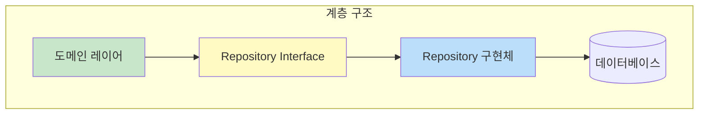

#### 인터페이스 예시

```csharp
public interface ISalesOrderRepository
{
    SalesOrder GetById(Guid id);
    IEnumerable<SalesOrder> GetAll();
    void Add(SalesOrder salesOrder);
    void Update(SalesOrder salesOrder);
    void Remove(SalesOrder salesOrder);
}
```

#### Repository 패턴의 이점

| 이점 | 설명 |
|------|------|
| **디커플링** | 도메인 로직과 데이터 접근 분리 |
| **테스트 용이성** | Mock/Stub으로 쉽게 대체 가능 |
| **유지보수성** | 데이터 접근 로직 중앙화 |
| **일관성** | 단일 진실 공급원 (Single Source of Truth) |

#### Unit of Work 패턴

> **Unit of Work**: 비즈니스 트랜잭션에 영향받는 객체 목록을 관리하고, 변경 사항 저장과 동시성 문제 해결을 조율하는 패턴

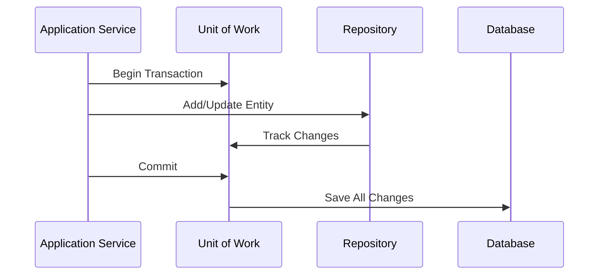

---

### 4.6 Factory (팩토리)

#### 정의

**Factory** 패턴은 Aggregate 생성 로직을 캡슐화하고, 생성된 객체가 항상 유효한 상태임을 보장하는 생성 패턴이다.

#### Factory의 이점

| 이점 | 설명 |
|------|------|
| **비즈니스 규칙 강제** | 객체 생성 시 검증 로직 일원화 |
| **변경 격리** | 생성 로직 변경 시 Factory만 수정 |
| **복잡성 추상화** | 의존성 설정, 상태 초기화 숨김 |
| **테스트 용이성** | Mock/Stub으로 대체 가능 |

#### Factory 사용 원칙

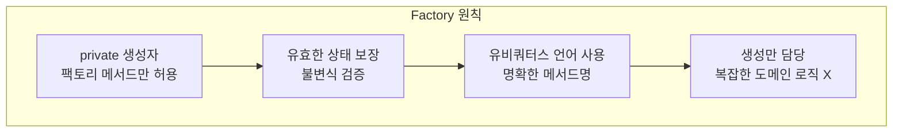

---

### 4.7 Services (서비스)

#### Domain Service vs Application Service

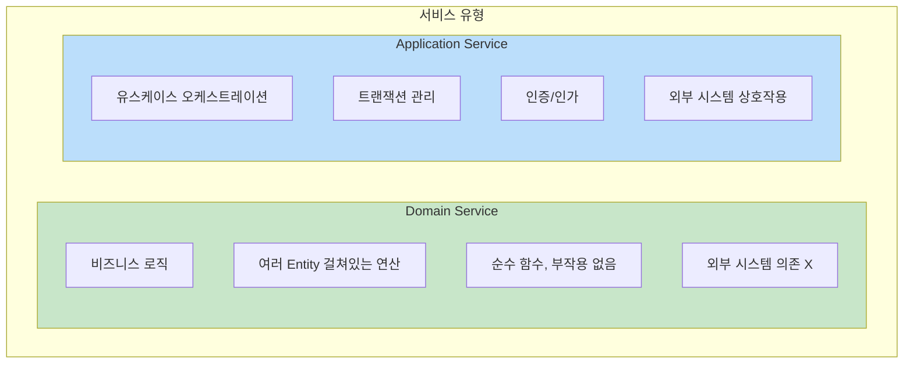

#### Domain Service 예시: PricingService

```csharp
public class PricingService
{
    private readonly TaxCalculator _taxCalculator;
    private readonly DiscountService _discountService;

    public PricingService(TaxCalculator taxCalculator, DiscountService discountService)
    {
        _taxCalculator = taxCalculator;
        _discountService = discountService;
    }

    public decimal CalculateTotalPrice(SalesOrder order)
    {
        decimal totalPrice = 0;

        // 각 행의 가격 합산
        foreach (var row in order.Rows)
        {
            totalPrice += row.Quantity * row.Price;
        }

        // 할인 적용
        totalPrice -= _discountService.CalculateDiscount(order);

        // 세금 계산 및 추가
        totalPrice += _taxCalculator.CalculateTax(totalPrice);

        return totalPrice;
    }
}
```

#### TaxCalculator

```csharp
public class TaxCalculator
{
    private readonly decimal _taxRate;

    public TaxCalculator(decimal taxRate)
    {
        _taxRate = taxRate;
    }

    public decimal CalculateTax(decimal amount)
    {
        return amount * _taxRate;
    }
}
```

#### DiscountService

```csharp
public class DiscountService
{
    public decimal CalculateDiscount(SalesOrder order)
    {
        if (order.Discount == null)
        {
            return 0;
        }

        var result = // ... 할인 계산 로직 ...
        return result;
    }
}
```

#### Application Service 예시: SalesOrderService

```csharp
public class SalesOrderService
{
    private readonly ISalesOrderRepository _salesOrderRepository;
    private readonly PricingService _pricingService;
    private readonly WarehouseService _warehouseService;

    public SalesOrderService(
        ISalesOrderRepository salesOrderRepository,
        PricingService pricingService,
        WarehouseService warehouseService)
    {
        _salesOrderRepository = salesOrderRepository;
        _pricingService = pricingService;
        _warehouseService = warehouseService;
    }

    public SalesOrder CreateSalesOrder(SalesOrderDto orderDto)
    {
        // 1. 주문 상세 검증 및 도메인 Entity 생성
        SalesOrder order = new SalesOrder(orderDto);

        // 2. 제품 가용성 확인
        _warehouseService.CheckAvailability(order);

        // 3. 총 가격 계산
        decimal totalPrice = _pricingService.CalculateTotalPrice(order);
        order.SetTotalPrice(totalPrice);

        // 4. 데이터베이스에 저장
        _salesOrderRepository.Save(order);

        return order;
    }
}
```

#### 서비스 비교 요약

| 특성 | Domain Service | Application Service |
|------|----------------|---------------------|
| **위치** | 도메인 레이어 | 애플리케이션 레이어 |
| **역할** | 비즈니스 로직 캡슐화 | 유스케이스 조율 |
| **부작용** | 없음 (순수 함수) | 있음 (DB, 외부 시스템) |
| **예시** | PricingService, TaxCalculator | SalesOrderService |

---

### 4.8 Modules (모듈)

#### 정의

**Module**은 관련된 개념과 기능을 그룹화하여 시스템의 복잡성을 관리하는 방법이다.

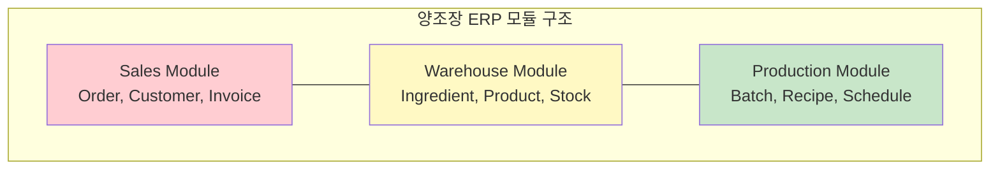

#### Module의 이점

| 이점 | 설명 |
|------|------|
| **유지보수성 향상** | 한 모듈 변경이 다른 모듈에 영향 최소화 |
| **확장성 강화** | 독립적 개발, 배포, 확장 가능 |
| **협업 촉진** | 팀별 병렬 작업 가능 |
| **비즈니스 정렬** | 비즈니스 도메인 구조 반영 |

#### 리팩토링에서의 Module 활용

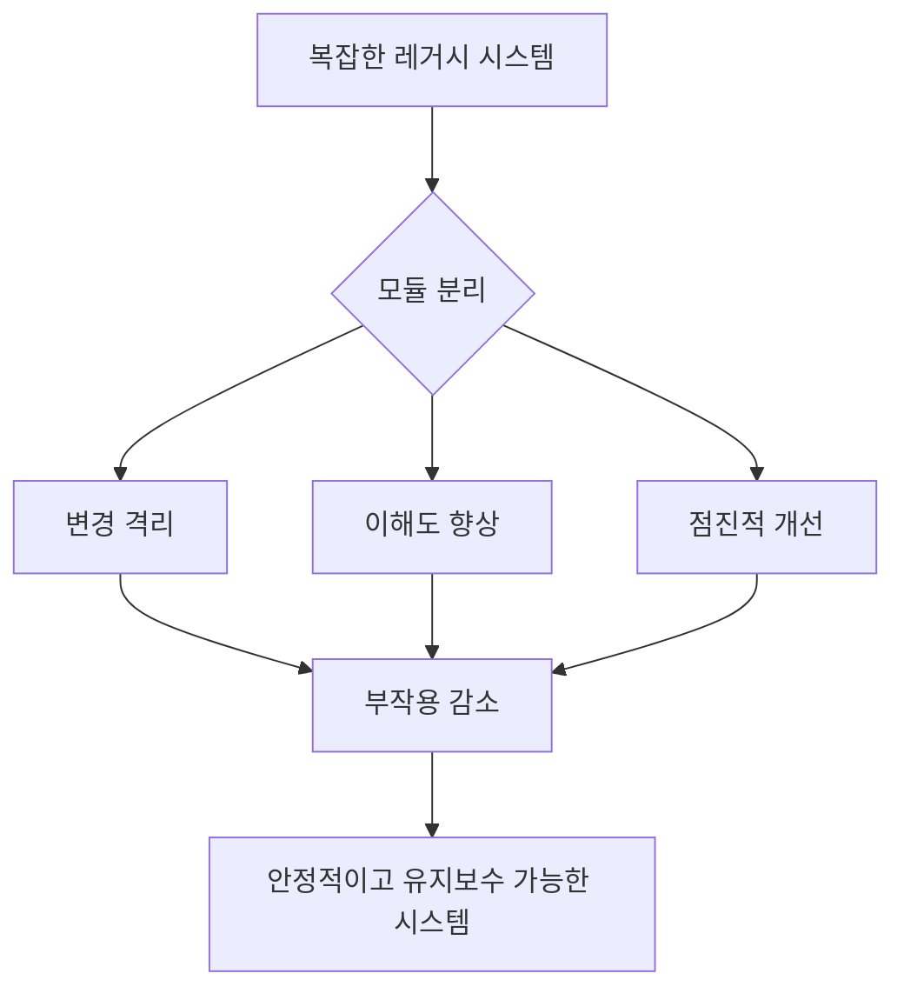

---

### 4.9 Domain Events와 Integration Events

#### Events의 정의

**Event**는 시스템 내에서 중요한 일이 발생했음을 알리는 통지이다. 상태 변경 또는 의미 있는 행동의 발생을 나타낸다.

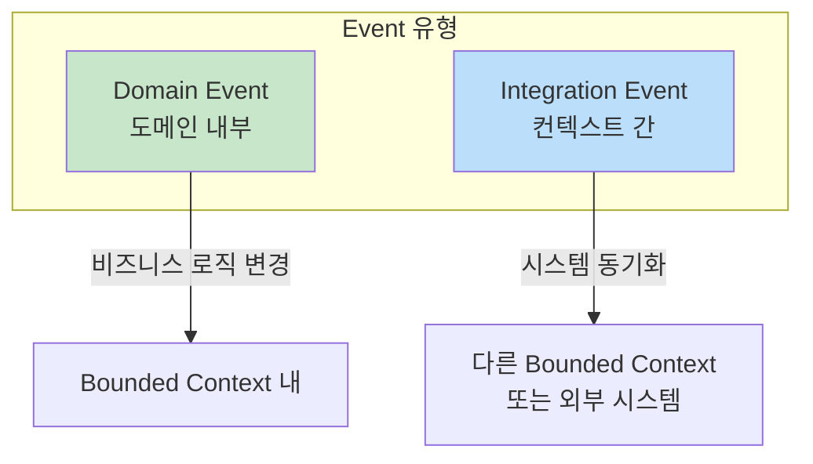

#### Event의 중요성 (현대 애플리케이션)

| 특성 | 설명 |
|------|------|
| **수평적 확장** | 서비스별 독립적 이벤트 처리 |
| **탄력성** | 일부 컴포넌트 불가용 시에도 동작 지속 |
| **유연성** | 기존 시스템 변경 없이 새 기능 추가 |
| **디커플링** | 송신자-수신자 분리로 모듈화 향상 |

#### Domain Event 예시

```csharp
public sealed class SalesOrderCreated(
    SalesOrderId aggregateId,
    Guid commitId,
    SalesOrderNumber salesOrderNumber,
    OrderDate orderDate,
    CustomerId customerId,
    CustomerName customerName,
    IEnumerable<SalesOrderRow> rows)
    : DomainEvent(aggregateId, commitId)
{
    public readonly SalesOrderId SalesOrderId = aggregateId;
    public readonly SalesOrderNumber SalesOrderNumber = salesOrderNumber;
    public readonly OrderDate OrderDate = orderDate;
    public readonly CustomerId CustomerId = customerId;
    public readonly CustomerName CustomerName = customerName;
    public readonly IEnumerable<SalesOrderRow> Rows = rows;
}
```

```csharp
public class BeerAvailabilityUpdated(
    BeerId aggregateId,
    Guid commitId,
    BeerName beerName,
    Quantity quantity)
    : DomainEvent(aggregateId, commitId)
{
    public readonly BeerId BeerId = aggregateId;
    public readonly BeerName BeerName = beerName;
    public readonly Quantity Quantity = quantity;
}
```

#### Domain Event 특성

- **비즈니스 관련성**: 도메인 전문가에게 의미 있는 발생 사건
- **불변성**: 생성 후 변경 불가 (역사적 기록)
- **자기 설명적**: 추가 컨텍스트 없이도 이해 가능
- **과거 시제**: 이미 발생한 일을 나타냄

#### Domain Event vs Integration Event

| 특성 | Domain Event | Integration Event |
|------|--------------|-------------------|
| **범위** | 단일 Bounded Context | Bounded Context 간 |
| **목적** | 비즈니스 로직 처리 | 시스템 동기화 |
| **소비자** | 같은 컨텍스트 내 핸들러 | 다른 서비스/시스템 |
| **변경 영향** | 로컬 | 전체 시스템 |

> **중요**: Domain Event와 Integration Event가 동일해 보여도 분리해야 한다! 유비쿼터스 언어가 변경되면 Domain Event는 변경되지만 Integration Event는 그대로일 수 있다.

#### 양조장 애플리케이션 Event 흐름

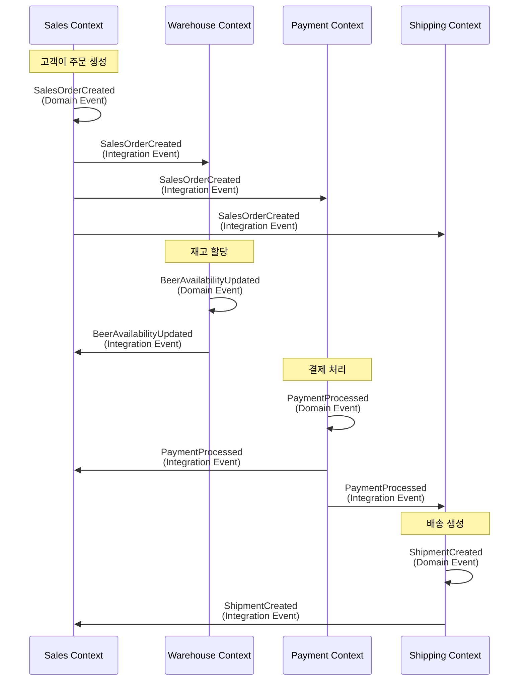

#### Bounded Context별 Domain Events

| Context | Domain Event | 역할 |
|---------|--------------|------|
| **Sales** | SalesOrderCreated | 주문 이행 프로세스 시작 |
| **Warehouse** | BeerAvailabilityUpdated | 재고 관리, 예약 확인 |
| **Payment** | PaymentProcessed | 결제 상태 추적 |
| **Shipping** | ShipmentCreated | 배송 관리, 발송 처리 |

---

## 💡 실무 적용 포인트

### 전술적 패턴 선택 가이드

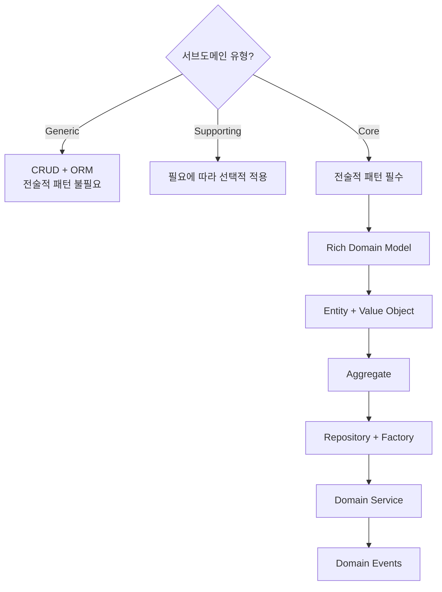

### 패턴별 책임 요약

| 패턴 | 책임 | 주의사항 |
|------|------|----------|
| **Entity** | 식별자로 구별, 생명주기 관리 | 속성만 있는 빈약한 도메인 피하기 |
| **Value Object** | 속성으로 정의, 불변 | 수정 시 새 객체 생성 |
| **Aggregate** | 일관성 경계, 트랜잭션 단위 | 너무 크거나 작지 않게 |
| **Repository** | 데이터 접근 추상화 | Aggregate 단위로 관리 |
| **Factory** | 유효한 객체 생성 보장 | 생성 로직만 담당 |
| **Domain Service** | 여러 Entity 걸친 비즈니스 로직 | 부작용 없는 순수 함수 |
| **Application Service** | 유스케이스 조율 | 도메인 로직 포함 X |
| **Module** | 관련 개념 그룹화 | 높은 응집도, 낮은 결합도 |
| **Domain Event** | 도메인 내 상태 변경 알림 | Integration Event와 분리 |
| **Integration Event** | 컨텍스트 간 동기화 | 느슨한 결합 유지 |

### GitHub 저장소

예제 애플리케이션 코드:
- URL: https://github.com/PacktPublishing/Domain-driven-Refactoring/branches

---

## ✅ 핵심 개념 체크리스트

### Entity & Value Object
- [ ] Entity는 ID로 식별, Value Object는 속성으로 식별
- [ ] Value Object는 불변 (immutable)
- [ ] 컨텍스트에 따라 같은 개념도 다르게 모델링

### Aggregate
- [ ] Aggregate Root가 유일한 진입점
- [ ] 일관성 경계 내 단일 트랜잭션
- [ ] 다른 Aggregate의 Root에만 참조 가능

### Repository & Factory
- [ ] Repository는 Aggregate 단위로 관리
- [ ] Factory는 유효한 상태 보장
- [ ] Unit of Work로 트랜잭션 관리

### Services
- [ ] Domain Service: 비즈니스 로직, 순수 함수
- [ ] Application Service: 유스케이스 조율, 부작용 허용

### Events
- [ ] Domain Event: 도메인 내 상태 변경
- [ ] Integration Event: 컨텍스트 간 통신
- [ ] 과거 시제, 불변, 자기 설명적

---

## 🔗 참고 자료

- [Muflone Library](https://github.com/CQRS-Muflone/Muflone) - DDD 지원 라이브러리
- [Domain-Driven Refactoring GitHub](https://github.com/PacktPublishing/Domain-driven-Refactoring/branches)
- [Eric Evans - Domain-Driven Design](https://www.domainlanguage.com/ddd/)
- [Martin Fowler - Aggregate](https://martinfowler.com/bliki/DDD_Aggregate.html)
- [Vaughn Vernon - Implementing Domain-Driven Design](https://www.oreilly.com/library/view/implementing-domain-driven-design/9780133039900/)

---

## 📚 다음 챕터 미리보기

- **Chapter 5**: Introducing Refactoring Principles - 리팩토링의 원칙과 DDD가 어떻게 도움이 되는지
- Part 1 완료! Part 2에서 본격적인 리팩토링 시작
