# Chapter 5: Introducing Refactoring Principles (리팩토링 원칙 소개)

## 📌 핵심 요약

> **"리팩토링은 단순히 코드를 깔끔하게 만드는 것이 아니라, 비즈니스 요구사항에 더 잘 맞추고, 유지보수성을 높이며, 미래 변경에 탄력적으로 만드는 것이다. 행동하기 전에 이해하고, 테스트라는 안전망을 구축하고, 설계 원칙을 적용하여 점진적으로 개선한다."**

이 챕터에서는 DDD 맥락에서의 리팩토링 원칙과 안전한 변경을 위한 기반을 학습한다.

---

## 🎯 학습 목표

이 챕터를 완료하면 다음을 할 수 있다:

- [ ] 리팩토링 전 코드베이스 분석의 중요성 이해
- [ ] 강한 결합(Tight Coupling)의 문제점 식별
- [ ] 테스트 피라미드와 안전망 구축 방법 습득
- [ ] CI/CD와 관측 가능성(Observability)의 역할 파악
- [ ] SOLID 원칙과 Strategy 패턴 적용
- [ ] 모놀리스에서 모듈러 아키텍처로의 전환 준비

---

## 📖 본문 정리

### 5.1 행동하기 전에 이해하기 (Understanding Before Acting)

#### 레거시 코드의 문제점

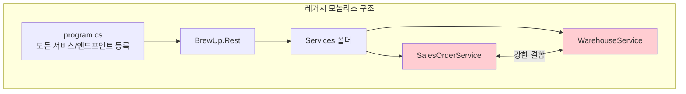

**주요 문제점**:

| 문제 | 설명 | 영향 |
|------|------|------|
| **중앙 집중 등록** | 모든 서비스가 program.cs에 등록 | 수정 시 진입점 변경 필요 |
| **강한 결합** | Sales ↔ Warehouse 직접 의존 | 독립적 배포 불가 |
| **파사드 위치** | REST 프로젝트에 서비스 배치 | 분리 시 대규모 수정 필요 |

#### 강한 결합 예시 코드

```csharp
public async Task CreateSalesOrderAsync(
    SalesOrderId salesOrderId,
    SalesOrderNumber salesOrderNumber,
    OrderDate orderDate,
    CustomerId customerId,
    CustomerName customerName,
    IEnumerable<SalesOrderRowJson> rows,
    CancellationToken cancellationToken)
{
    List<SalesOrderRowJson> beersAvailable = new();

    foreach (var row in rows)
    {
        // ⚠️ Sales 서비스가 Warehouse 리포지토리 직접 접근
        var availability = await warehouseRepository
            .GetByIdAsync<Shared.Entities.Availability>(
                row.BeerId.ToString(), cancellationToken);

        if (availability != null)
            beersAvailable.Add(row);
    }

    var aggregate = SalesOrder.CreateSalesOrder(
        salesOrderId, salesOrderNumber, orderDate,
        customerId, customerName, beersAvailable);

    await saleRepository.InsertAsync(
        aggregate.MapToSharedDto(), cancellationToken);
}
```

**문제점 분석**:
- `SalesOrderService`가 `warehouseRepository` 직접 주입받음
- Warehouse의 DB 스키마 변경 시 Sales 컨텍스트 영향
- 두 서비스를 별도 API로 분리 불가능

#### 변경의 파급 효과 (Ripple Effect)

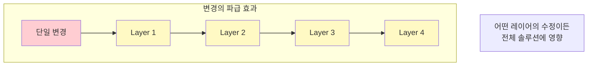

> **두려움의 제약**: 코드베이스를 완전히 이해하는 사람이 없어서, 회귀(regression)나 버그 도입의 두려움이 필요한 변경을 막는 제약이 된다.

#### Gall's Law (갈의 법칙)

> "작동하는 복잡한 시스템은 항상 작동하는 단순한 시스템에서 진화한 것이다. 처음부터 복잡하게 설계된 시스템은 절대 작동하지 않으며, 작동하게 만들 수도 없다."

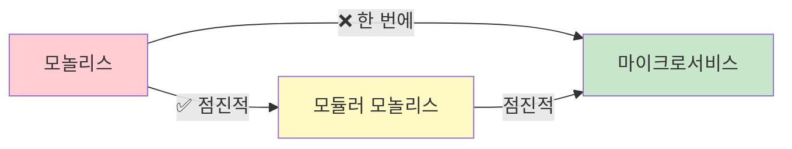

#### 모듈러 아키텍처

**정의**: 시스템을 독립적으로 개발, 테스트, 유지보수할 수 있는 작은 컴포넌트(모듈)로 분해하는 아키텍처

**결합 vs 응집**:

| 개념 | 정의 | 목표 |
|------|------|------|
| **결합 (Coupling)** | 모듈 간 상호의존성 정도 | 낮추기 |
| **응집 (Cohesion)** | 모듈 내 요소들의 관련성 정도 | 높이기 |

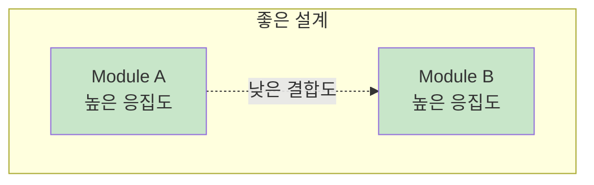

#### Consumer-Driven Contracts (CDC)

**정의**: 서비스 제공자와 소비자 간의 상호작용 방식을 명시하는 계약

**특징**:
- 버전 관리 및 검증으로 하위 호환성 보장
- 서비스가 소비자 방해 없이 독립적 진화 가능
- 안전하고 점진적인 변경 지원

#### 점진적 변경 (Incremental Change)

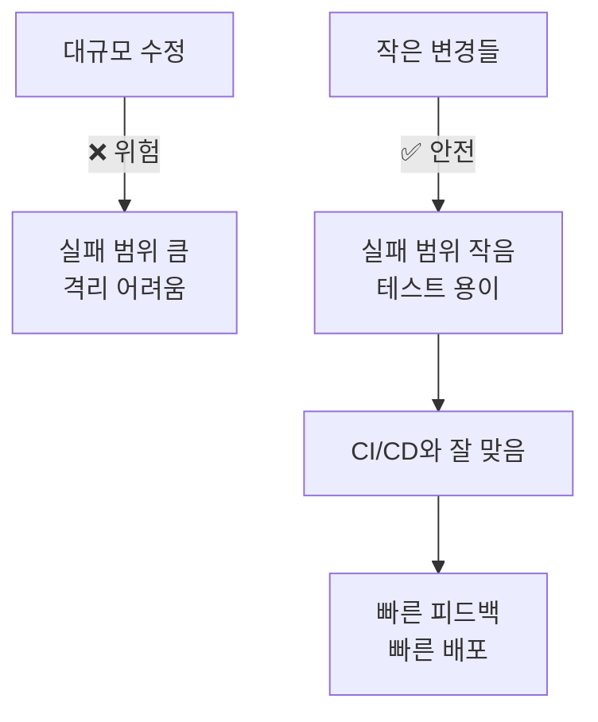

#### 자동화된 테스트

**리팩토링 전 필수**: 수정이 기존 기능을 깨뜨리지 않음을 보장

| 테스트 유형 | 우선순위 | 목적 |
|------------|----------|------|
| **E2E 테스트** | 높음 | 외부 동작 보존 확인 |
| **통합 테스트** | 중간 | 모듈 간 상호작용 검증 |
| **단위 테스트** | 기본 | 개별 컴포넌트 검증 |

#### CI/CD와 관측 가능성 (Observability)

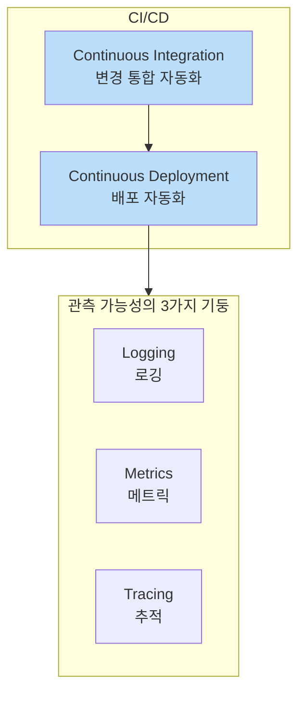

**관측 가능성의 중요성**:
- 실시간 시스템 건강 상태 및 성능 모니터링
- 변경으로 인한 문제 빠르게 감지 및 대응
- 향후 변경을 위한 시스템 동작 인사이트 제공

#### 코드 복잡성 vs 경험

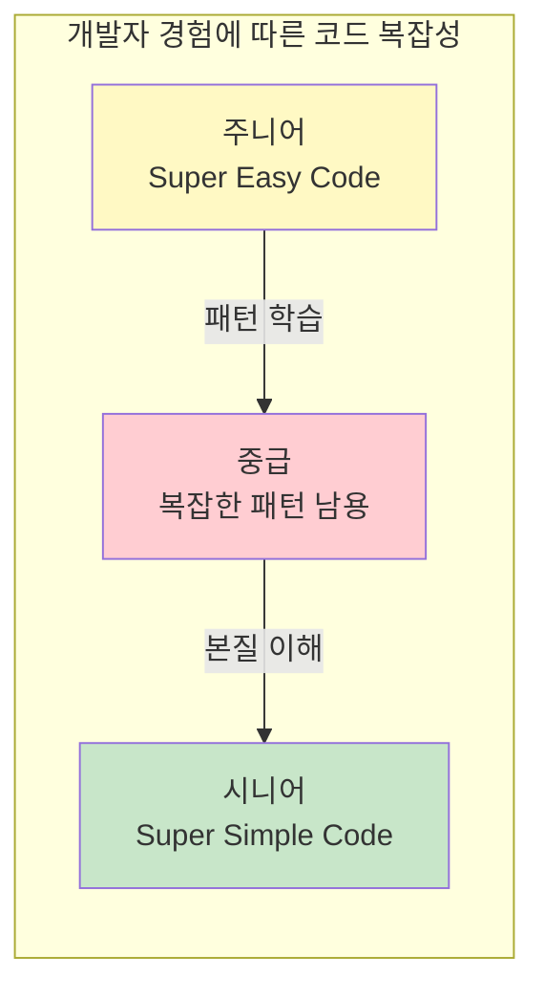

> **Neal Ford**: "개발자들은 불꽃에 끌리는 나방처럼 복잡성에 끌리며, 종종 같은 결과를 맞는다."

**Easy Code vs Simple Code**:

| Easy Code | Simple Code |
|-----------|-------------|
| 그냥 작동함 | 잘 구조화됨 |
| 유지보수 어려움 | 유지보수 용이 |
| 읽기 어려움 | 읽기 쉬움 |
| 확장 어려움 | 단순함 유지하며 확장 |

---

### 5.2 안전한 변경의 기둥 (The Pillars of Safe Change)

#### 초기 솔루션 구조

```
BrewUp (Legacy)
├── BrewUp.Rest
│   └── Services/
│       ├── SalesOrderService ← WarehouseService 의존
│       └── WarehouseService
├── BrewUp.Domain
│   └── Services/
│       ├── SalesOrderService
│       └── WarehouseService
└── BrewUp.DomainModel
    └── Services/
        ├── Sales services
        └── Warehouse services (같은 폴더에!)
```

**문제점**: 모든 것이 공통 프로젝트의 특정 폴더에 섞여 있음

#### 강한 결합 코드 예시

```csharp
public sealed class SalesOrderService(
    [FromKeyedServices("sale")] IRepository saleRepository,
    [FromKeyedServices("warehouse")] IRepository warehouseRepository  // ⚠️ 직접 의존
) : ISalesOrderService
{
    public async Task CreateSalesOrderAsync(...)
    {
        List<SalesOrderRowJson> beersAvailable = new();

        foreach (var row in rows)
        {
            // ⚠️ Warehouse 컨텍스트에 직접 접근
            var availability = await warehouseRepository
                .GetByIdAsync<Entities.Warehouses.Availability>(
                    row.BeerId.ToString(), cancellationToken);

            if (availability != null)
                beersAvailable.Add(row);
        }

        var aggregate = SalesOrder.CreateSalesOrder(...);
        await saleRepository.InsertAsync(aggregate.MapToReadModel(), cancellationToken);
    }
}
```

#### 테스트의 역할

**테스트의 본질**: 시스템이 기대대로 동작하는지 확인하는 코드

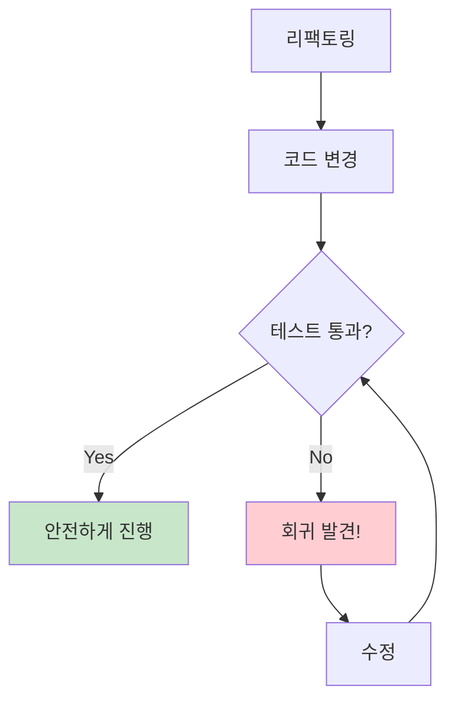

> **테스트 = 첫 번째 방어선**: 변경에 대한 자신감 부여. 문제 발생 시 테스트가 잡아줌.

#### 테스트 피라미드

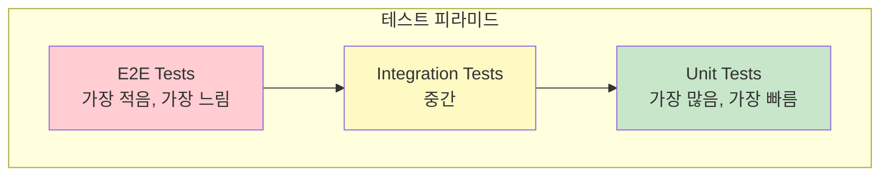

#### 테스트 유형별 특성

| 테스트 유형 | 범위 | 속도 | 수량 | 목적 |
|------------|------|------|------|------|
| **Unit** | 함수/메서드 | 빠름 | 많음 | 기본 빌딩 블록 검증 |
| **Integration** | 모듈 간 상호작용 | 중간 | 중간 | 통합 포인트 검증 |
| **E2E** | 전체 시스템 | 느림 | 적음 | 사용자 시나리오 검증 |
| **Acceptance** | 비즈니스 요구사항 | 느림 | 적음 | 비즈니스 결과 검증 |

#### 테스트 피라미드 규칙

1. **다양한 세분화 수준의 테스트 작성**
2. **상위 레벨 테스트는 하위 레벨보다 현저히 적게**

#### 단위 테스트 예시

```csharp
public class SalesOrderServiceTests
{
    [Fact]
    public void ProcessOrder_ShouldReserveInventory()
    {
        // Arrange
        var warehouseServiceMock = new Mock<IWarehouseService>();
        var salesOrderService = new SalesOrderService(warehouseServiceMock.Object);
        var order = new Order { BeerId = 1, Quantity = 10 };

        // Act
        salesOrderService.ProcessOrder(order);

        // Assert
        warehouseServiceMock.Verify(
            ws => ws.ReserveInventory(order.BeerId, order.Quantity),
            Times.Once);
    }
}
```

> **Mock 라이브러리**: 실제 객체의 동작을 시뮬레이션하여 특정 코드 부분을 격리 테스트. 예: [Moq](https://github.com/devlooped/moq)

#### 통합 테스트 예시

```csharp
[Fact]
public async Task Can_Create_SalesOrder()
{
    DateTime now = DateTime.UtcNow;

    SalesOrderJson body = new(
        Guid.NewGuid().ToString(),
        $"{now.Year:0000}{now.Month:00}{now.Day:00}-{now.Hour:00}{now.Minute:00}",
        Guid.NewGuid(),
        "Customer",
        now,
        new List<SalesOrderRowJson>
        {
            new()
            {
                BeerId = Guid.NewGuid(),
                BeerName = "BrewUp IPA",
                Quantity = new(10, "Lt"),
                Price = new(5, "EUR")
            }
        });

    var stringJson = JsonSerializer.Serialize(body);
    var httpContent = new StringContent(stringJson, Encoding.UTF8, "application/json");

    // HTTP 호출 에뮬레이션 (내부 동작은 신경 쓰지 않음)
    var postResult = await integrationFixture.Client.PostAsync("/v1/sales", httpContent);

    Assert.Equal(HttpStatusCode.Created, postResult.StatusCode);
}
```

**핵심**: 내부 동작이 아닌 결과(외부 동작)가 변하지 않는지 확인

---

### 5.3 더 깨끗하고 유지보수 가능한 코드를 향해

#### 목표 아키텍처

```
BrewUp (리팩토링 후)
├── 01.Presentation/
│   └── BrewUp.Rest
├── 02.Application/
│   ├── BrewUp.Sales.Application
│   └── BrewUp.Warehouses.Application
├── 03.Domain/
│   ├── BrewUp.Sales.Domain
│   └── BrewUp.Warehouses.Domain
├── 04.ReadModel/
│   ├── BrewUp.Sales.ReadModel
│   └── BrewUp.Warehouses.ReadModel
├── 05.Infrastructure/
│   └── BrewUp.Infrastructure
└── 06.Modules/
    ├── Sales (Bounded Context)
    └── Warehouses (Bounded Context)
```

**특징**:
- 숫자 접두사로 레이어 수준 명확히 표시
- Onion Architecture 패턴 반영
- Bounded Context별 모듈 분리
- CQRS 구조 (Domain = Commands, ReadModel = Queries)

#### CQRS (Command Query Responsibility Segregation)

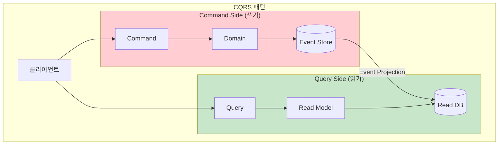

**CQRS+ES (Event Sourcing)**:
- **Commands**: `BrewUp.Sales.Domain`, `BrewUp.Warehouses.Domain`
- **Queries**: `BrewUp.Sales.ReadModel`, `BrewUp.Warehouses.ReadModel`

> **주의**: CQRS+ES로 한 번에 리팩토링하지 말고, 작은 단계로 진행

---

### 5.4 설계 원칙

#### Single Responsibility Principle (SRP, 단일 책임 원칙)

**정의**: 클래스나 모듈은 변경해야 할 이유가 하나만 있어야 한다.

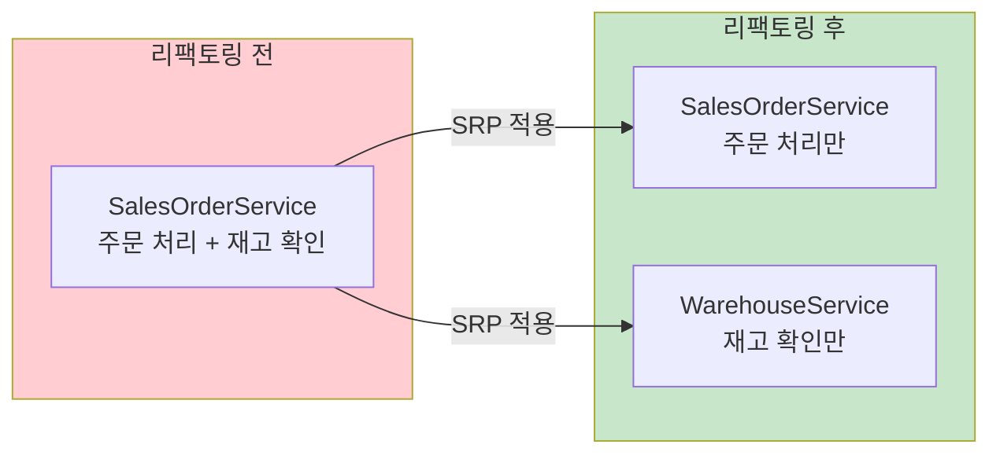

**리팩토링 후 코드**:

```csharp
public class SalesOrderService
{
    private readonly IWarehouseService _warehouseService;

    public SalesOrderService(IWarehouseService warehouseService)
    {
        _warehouseService = warehouseService;
    }

    public void ProcessOrder(Order order)
    {
        if (_warehouseService.IsBeerAvailable(order.BeerId, order.Quantity))
        {
            // 주문 처리
        }
        else
        {
            // 재고 부족 처리
        }
    }
}

public interface IWarehouseService
{
    bool IsBeerAvailable(int beerId, int quantity);
}

public class WarehouseService : IWarehouseService
{
    public bool IsBeerAvailable(int beerId, int quantity)
    {
        // 창고에서 가용성 확인
        return true;
    }
}
```

#### Open/Closed Principle (OCP, 개방/폐쇄 원칙)

**정의**: 소프트웨어 엔티티는 확장에는 열려있고, 수정에는 닫혀있어야 한다.

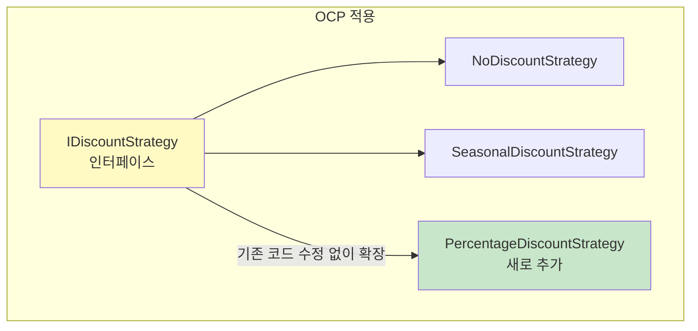

**코드 예시**:

```csharp
public interface IDiscountStrategy
{
    decimal CalculateDiscount(Order order);
}

public class NoDiscountStrategy : IDiscountStrategy
{
    public decimal CalculateDiscount(Order order) => 0;
}

public class SeasonalDiscountStrategy : IDiscountStrategy
{
    public decimal CalculateDiscount(Order order)
    {
        // 시즌 할인 로직
        return 10;
    }
}

public class SalesOrderService
{
    private readonly IWarehouseService _warehouseService;
    private readonly IDiscountStrategy _discountStrategy;

    public SalesOrderService(
        IWarehouseService warehouseService,
        IDiscountStrategy discountStrategy)
    {
        _warehouseService = warehouseService;
        _discountStrategy = discountStrategy;
    }

    public void ProcessOrder(Order order)
    {
        if (_warehouseService.IsBeerAvailable(order.BeerId, order.Quantity))
        {
            decimal discount = _discountStrategy.CalculateDiscount(order);
            // 할인 적용 후 주문 처리
        }
    }
}
```

#### Dependency Inversion Principle (DIP, 의존성 역전 원칙)

**정의**: 상위 레벨 모듈은 하위 레벨 모듈에 의존해서는 안 된다. 둘 다 추상화에 의존해야 한다.

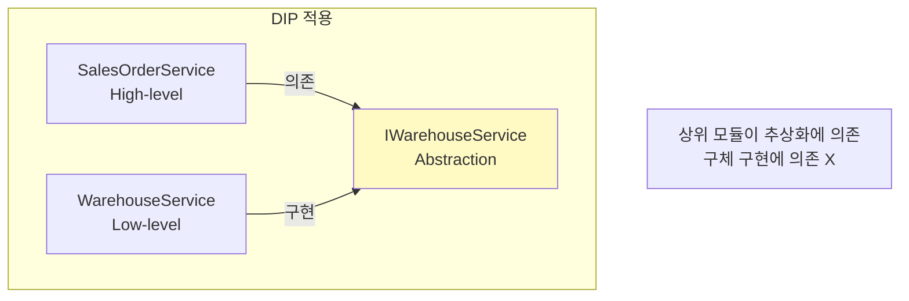

**이점**:
- 구체 구현에서 디커플링
- 테스트 시 Mock 클래스 주입 가능
- 유연한 확장 가능

#### Strategy Pattern (전략 패턴)

**정의**: 알고리즘 군을 정의하고, 각각을 캡슐화하며, 상호 교환 가능하게 만든다.

```csharp
public interface IDiscountStrategy
{
    decimal CalculateDiscount(Order order);
}

public class NoDiscountStrategy : IDiscountStrategy
{
    public decimal CalculateDiscount(Order order) => 0;
}

public class PercentageDiscountStrategy : IDiscountStrategy
{
    private readonly decimal _percentage;

    public PercentageDiscountStrategy(decimal percentage)
    {
        _percentage = percentage;
    }

    public decimal CalculateDiscount(Order order)
    {
        return order.TotalAmount * _percentage;
    }
}
```

**장점**:
- 새로운 전략 추가 시 기존 코드 수정 불필요
- 런타임에 전략 교체 가능
- 테스트 용이

---

## 💡 실무 적용 포인트

### 리팩토링 전 체크리스트

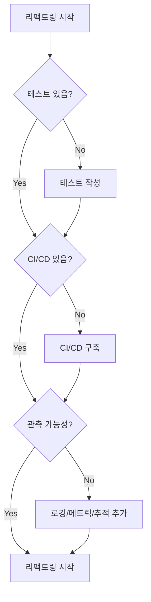

### 점진적 리팩토링 단계

| 단계 | 활동 | 목표 |
|------|------|------|
| 1 | E2E 테스트 작성 | 외부 동작 보존 보장 |
| 2 | 단위/통합 테스트 추가 | 안전망 강화 |
| 3 | CI/CD 파이프라인 구축 | 자동화된 빌드/테스트/배포 |
| 4 | 관측 가능성 추가 | 실시간 모니터링 |
| 5 | 모듈 경계 식별 | Bounded Context 기반 |
| 6 | 결합 제거 | 인터페이스 도입 |
| 7 | 모듈러 아키텍처 전환 | 독립적 모듈 |
| 8 | CQRS 적용 (선택) | 읽기/쓰기 분리 |

### 설계 원칙 적용 요약

| 원칙 | 적용 시점 | 효과 |
|------|----------|------|
| **SRP** | 클래스가 여러 이유로 변경될 때 | 이해, 테스트, 유지보수 용이 |
| **OCP** | 새 기능 추가 시 기존 코드 수정 필요할 때 | 확장 용이, 안정성 보존 |
| **DIP** | 구체 구현에 직접 의존할 때 | 디커플링, 테스트 용이 |
| **Strategy** | 여러 알고리즘을 교체해야 할 때 | 확장 가능, 런타임 교체 |

### GitHub 저장소

- 이 챕터 코드: https://github.com/PacktPublishing/Domain-driven-Refactoring/tree/01-monolith_legacy

---

## ✅ 핵심 개념 체크리스트

### 행동하기 전에 이해하기
- [ ] 강한 결합의 문제점 식별
- [ ] 변경의 파급 효과 이해
- [ ] Gall's Law: 점진적 전환의 중요성
- [ ] 결합 vs 응집 구분
- [ ] Consumer-Driven Contracts 개념

### 안전한 변경의 기둥
- [ ] 테스트 피라미드 이해 (Unit < Integration < E2E)
- [ ] 테스트 = 안전망 역할
- [ ] CI/CD 파이프라인의 중요성
- [ ] 관측 가능성의 3가지 기둥 (Logging, Metrics, Tracing)

### 설계 원칙
- [ ] SRP: 단일 책임 원칙
- [ ] OCP: 개방/폐쇄 원칙
- [ ] DIP: 의존성 역전 원칙
- [ ] Strategy Pattern: 알고리즘 캡슐화

### 목표 아키텍처
- [ ] 모듈러 모놀리스 구조
- [ ] CQRS 패턴 이해
- [ ] Bounded Context별 모듈 분리

---

## 🔗 참고 자료

- [Domain-driven Refactoring GitHub](https://github.com/PacktPublishing/Domain-driven-Refactoring/tree/01-monolith_legacy)
- [Moq - Mock Library](https://github.com/devlooped/moq)
- [Neal Ford - The Productive Programmer](https://www.oreilly.com/library/view/the-productive-programmer/9780596519780/)
- [Martin Fowler - CQRS](https://martinfowler.com/bliki/CQRS.html)
- [SOLID Principles](https://en.wikipedia.org/wiki/SOLID)

---

## 📚 다음 챕터 미리보기

- **Chapter 6**: Transitioning from Chaos - 모놀리식 코드베이스를 잘 조직된 모듈러 모놀리스로 리팩토링 시작
