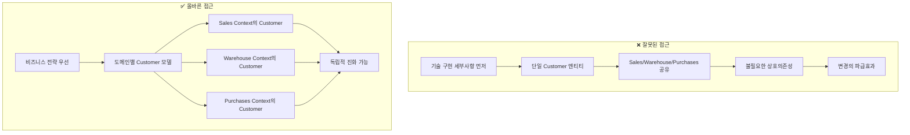
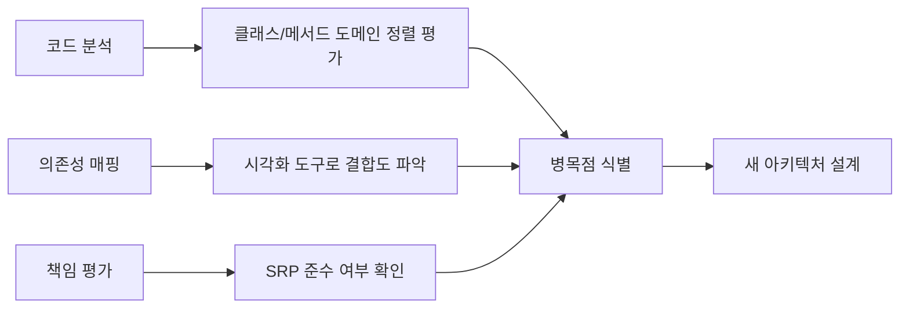
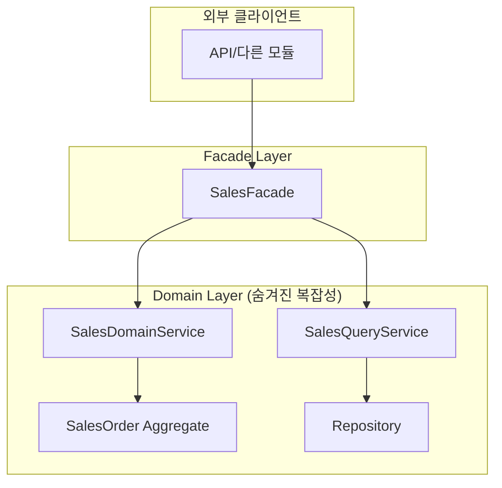
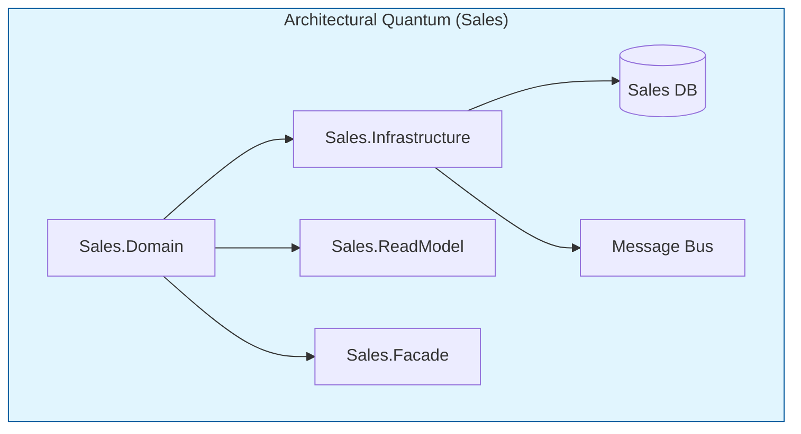
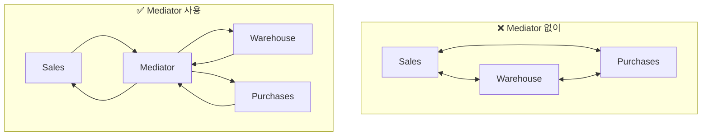
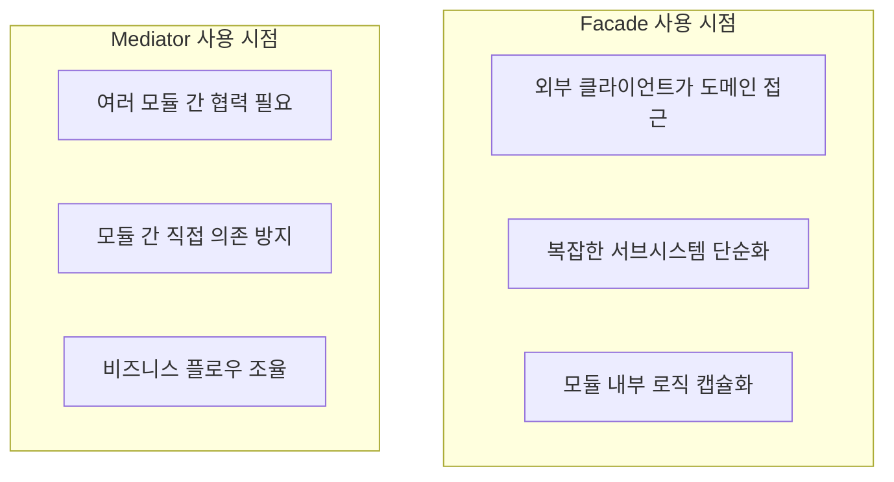
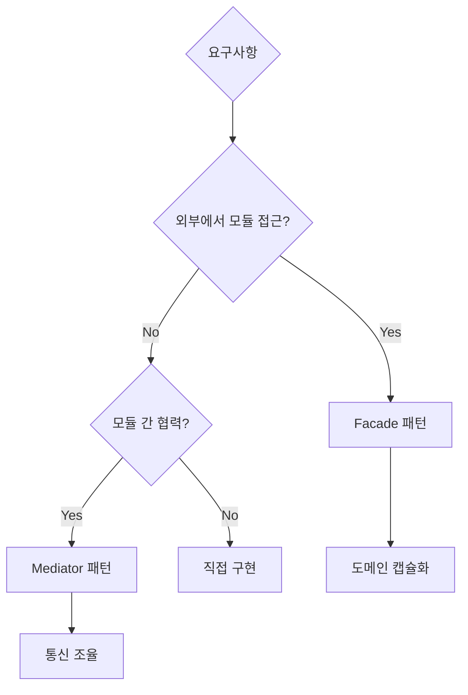

# Chapter 6: Transitioning from Chaos (혼돈에서 벗어나기)

## 📌 핵심 요약

> **"모놀리식 코드베이스를 DDD 원칙을 적용하여 모듈러 모놀리스로 리팩토링한다. Facade 패턴으로 도메인을 캡슐화하고, Mediator 패턴으로 모듈 간 통신을 조율하며, Fitness Function으로 아키텍처 무결성을 자동 검증한다."**

이 챕터에서는 강결합된 모놀리식 아키텍처를 체계적인 모듈러 모놀리스로 전환하는 실전 기법을 학습한다.

---

## 🎯 학습 목표

이 챕터를 완료하면 다음을 할 수 있다:

- [ ] 모놀리식 애플리케이션에서 핵심 비즈니스 도메인 식별
- [ ] 명확한 도메인 경계를 사용하여 강결합 서비스 분리
- [ ] DDD 원칙을 적용한 모놀리식 코드베이스 리팩토링
- [ ] Facade 패턴으로 상호작용 단순화 및 의존성 감소
- [ ] Mediator 패턴으로 모듈 간 통신 조율
- [ ] 명확한 인터페이스와 책임을 가진 모듈러 아키텍처 구축
- [ ] Fitness Function으로 아키텍처 무결성 자동 검증

---

## 📖 본문 정리

### 6.1 핵심 도메인 식별 (Identifying Core Domains)

#### 흔한 실수: 기술 구현에 집중



| 접근 방식 | 결과 | 유지보수성 |
|-----------|------|------------|
| **단일 Customer** | 한 컨텍스트 변경이 다른 컨텍스트에 영향 | ❌ 낮음 |
| **도메인별 Customer** | 각 영역의 특정 요구사항 반영 | ✅ 높음 |

#### 비즈니스 환경 이해를 위한 질문

1. **시스템의 주요 기능은 무엇인가?** - 핵심 역량 파악
2. **가장 중요한 비즈니스 프로세스는?** - 우선순위 설정
3. **컴포넌트들이 어떻게 상호작용하는가?** - 의존성 파악

#### 주요 도메인 예시 (Brewery ERP)

| 도메인 | 책임 |
|--------|------|
| **Sales** | 고객 주문, 가격, 프로모션 관리 |
| **Inventory** | 재고 수준 추적, 창고 운영 관리 |
| **Shipping** | 배송 조율, 물류 처리 |

---

### 6.2 현재 코드베이스 매핑

#### 분석 가이드라인



#### 문제 발견 예시

```csharp
// ❌ SalesOrderService가 재고 수준도 직접 업데이트
// → 도메인 경계 위반!
public class SalesOrderService
{
    private readonly IRepository _saleRepository;
    private readonly IRepository _warehouseRepository;  // 다른 도메인 의존!

    public void CreateOrder(Order order)
    {
        _saleRepository.Save(order);
        _warehouseRepository.UpdateStock(order.Items);  // 경계 침범
    }
}
```

---

### 6.3 명확한 인터페이스 확립

#### 물리적 분리 vs 논리적 분리

| 분리 유형 | 방법 | 효과 |
|-----------|------|------|
| **물리적 분리** | 도메인별 별도 디렉토리/네임스페이스 | 코드 조직화 |
| **논리적 분리** | 모듈 내 클래스가 해당 도메인만 담당 | 책임 분리 |

#### 리팩토링 전후 프로젝트 구조

```
📁 리팩토링 전 (01-monolith_legacy)
├── BrewUp.DomainModel/
│   ├── SalesOrder.cs
│   └── Availability.cs
└── BrewUp.Infrastructure/
    ├── SalesOrderRepository.cs
    └── AvailabilityRepository.cs

📁 리팩토링 후 (02-monolith_with_cqrs)
├── Modules/
│   ├── Sales/
│   │   ├── BrewUp.Sales.Domain/
│   │   ├── BrewUp.Sales.Infrastructure/
│   │   ├── BrewUp.Sales.ReadModel/
│   │   └── BrewUp.Sales.Facade/
│   └── Warehouses/
│       ├── BrewUp.Warehouses.Domain/
│       ├── BrewUp.Warehouses.Infrastructure/
│       ├── BrewUp.Warehouses.ReadModel/
│       └── BrewUp.Warehouses.Facade/
└── Mediator/
    └── BrewUp.Mediator/
```

---

### 6.4 Facade 패턴 구현

#### Facade 패턴이란?



> **Facade 패턴**: 복잡한 서브시스템에 단순화된 인터페이스를 제공하는 구조적 디자인 패턴. 클라이언트가 다루어야 할 복잡성을 줄이고, 서브시스템 컴포넌트의 세부사항을 단일 인터페이스 뒤에 추상화한다.

#### SalesFacade 구현

```csharp
public sealed class SalesFacade(
    ISalesDomainService salesDomainService,
    ISalesQueryService salesQueryService) : ISalesFacade
{
    // ✅ 주문 생성 - 내부 도메인 로직 캡슐화
    public async Task<string> CreateOrderAsync(
        SalesOrderJson body,
        CancellationToken cancellationToken)
    {
        if (body.SalesOrderId.Equals(string.Empty))
            body = body with { SalesOrderId = Guid.NewGuid().ToString() };

        await salesDomainService.CreateSalesOrderAsync(
            new SalesOrderId(new Guid(body.SalesOrderId)),
            new SalesOrderNumber(body.SalesOrderNumber),
            new OrderDate(body.OrderDate),
            new CustomerId(body.CustomerId),
            new CustomerName(body.CustomerName),
            body.Rows,
            cancellationToken);

        return body.SalesOrderId;
    }

    // ✅ 주문 조회 - Query 서비스 캡슐화
    public async Task<PagedResult<SalesOrderJson>> GetOrdersAsync(
        CancellationToken cancellationToken)
    {
        return await salesQueryService.GetSalesOrdersAsync(0, 30, cancellationToken);
    }
}
```

#### 모듈 등록 Helper

```csharp
public static class SalesHelper
{
    // 도메인 서비스 등록
    public static IServiceCollection AddSales(this IServiceCollection services)
    {
        services.AddFluentValidationAutoValidation();
        services.AddScoped<ISalesFacade, SalesFacade>();
        services.AddScoped<ISalesDomainService, SalesDomainService>();
        services.AddScoped<ISalesQueryService, SalesQueryService>();
        services.AddScoped<IQueries<SalesOrder>, SalesOrderQueries>();
        return services;
    }

    // 인프라스트럭처 등록
    public static IServiceCollection AddSalesInfrastructure(
        this IServiceCollection services)
    {
        services.AddSalesMongoDb();
        return services;
    }
}
```

---

### 6.5 모듈 자동 발견 시스템

#### IModule 인터페이스

```csharp
public interface IModule
{
    bool IsEnabled { get; }      // 모듈 활성화 여부
    int Order { get; }           // 로딩 순서

    IServiceCollection Register(WebApplicationBuilder builder);
    WebApplication Configure(WebApplication app);
}
```

#### ModuleExtensions - 리플렉션 기반 자동 발견

```csharp
public static class ModuleExtensions
{
    private static readonly IList<IModule> RegisteredModules = new List<IModule>();

    public static WebApplicationBuilder RegisterModules(
        this WebApplicationBuilder builder)
    {
        var modules = DiscoverModules()
            .Where(m => m.IsEnabled)
            .OrderBy(m => m.Order);

        foreach (var module in modules)
        {
            module.Register(builder);
            RegisteredModules.Add(module);
        }
        return builder;
    }

    public static WebApplication ConfigureModules(this WebApplication app)
    {
        foreach (var module in RegisteredModules)
            module.Configure(app);
        return app;
    }

    // 🔮 리플렉션으로 IModule 구현체 자동 발견
    private static IEnumerable<IModule> DiscoverModules()
    {
        return typeof(IModule).Assembly
            .GetTypes()
            .Where(p => p.IsClass && p.IsAssignableTo(typeof(IModule)))
            .Select(Activator.CreateInstance)
            .Cast<IModule>();
    }
}
```

#### 깔끔해진 Program.cs

```csharp
using BrewUp.Rest.Modules;

var builder = WebApplication.CreateBuilder(args);
builder.RegisterModules();  // ✅ 모든 모듈 자동 등록

var app = builder.Build();
app.ConfigureModules();     // ✅ 모든 모듈 자동 설정
app.Run();
```

---

### 6.6 Architectural Quantum 개념



> **Architectural Quantum**: 소프트웨어 아키텍처 내에서 가장 작은 응집력 있고 자율적인 단위. 각 퀀텀은 명확한 경계, 책임을 가지며 독립적으로 운영된다. DDD에서 퀀텀은 종종 Bounded Context에 매핑된다.

| 특성 | 설명 |
|------|------|
| **응집력** | 관련 기능이 함께 그룹화 |
| **자율성** | 독립적으로 배포/확장 가능 |
| **캡슐화** | 내부 구현 세부사항 숨김 |
| **인프라 포함** | DB, 메시지 버스 등 운영 요소 포함 |

---

### 6.7 Mediator 패턴으로 모듈러 모놀리스 구축

#### Mediator 패턴이란?



> **Mediator 패턴**: 컴포넌트 간 직접 통신을 제거하여 디커플링을 장려한다. 컴포넌트들은 Mediator를 통해 통신하며, Mediator가 상호작용을 조율한다.

#### BrewUpMediator 구현

```csharp
public class BrewUpMediator(
    ISalesFacade salesFacade,
    IWarehousesFacade warehouseFacade) : IBrewUpMediator
{
    public async Task<string> CreateOrderAsync(
        SalesOrderJson body,
        CancellationToken cancellationToken)
    {
        // 1️⃣ Warehouse에서 재고 확인
        List<BeerAvailabilityJson> availabilities = new();
        foreach (var row in body.Rows)
        {
            var availability = await warehouseFacade.GetAvailabilityAsync(
                row.BeerId, cancellationToken);
            if (availability.TotalRecords > 0)
                availabilities.Add(availability.Results.First());
        }

        // 2️⃣ 판매 가능한 항목 필터링
        List<SalesOrderRowJson> rowsForSale = (
            from row in body.Rows
            let beerAvailability = availabilities
                .Find(a => a.BeerId == row.BeerId.ToString())
            where beerAvailability != null
                && beerAvailability.Availability.Available >= row.Quantity.Value
            select row
        ).ToList();

        if (rowsForSale.Count == 0)
            return "No beer available for sale";

        // 3️⃣ Sales로 주문 생성 위임
        body = body with { Rows = rowsForSale };
        return await salesFacade.CreateOrderAsync(body, cancellationToken);
    }
}
```

---

### 6.8 Facade vs Mediator 비교

| 측면 | Facade | Mediator |
|------|--------|----------|
| **목적** | 클라이언트를 위해 복잡성을 숨겨 인터페이스 단순화 | 컴포넌트 간 통신을 중앙화하고 제어 |
| **디커플링** | 클라이언트를 서브시스템 복잡성으로부터 분리 | 컴포넌트 간 통신을 중재하여 분리 |
| **상호작용** | 단방향 추상화; 컴포넌트 간 상호작용 제어 안 함 | 양방향 상호작용; 통신 흐름 제어 |
| **DDD 사용처** | Application Layer에서 도메인 서비스/API 접근 단순화 | Domain Layer에서 Aggregate, 도메인 객체, 모듈 간 상호작용 조율 |



---

### 6.9 테스팅과 안정화

#### E2E 테스트 (리팩토링 전 안전망)

```csharp
[Fact]
public async Task Can_Create_SalesOrder()
{
    DateTime now = DateTime.UtcNow;
    SalesOrderJson body = new(
        Guid.NewGuid().ToString(),
        $"{now.Year:0000}{now.Month:00}{now.Day:00}-{now.Hour:00}{now.Minute:00}",
        Guid.NewGuid(),
        "Customer",
        now,
        new List<SalesOrderRowJson>
        {
            new()
            {
                BeerId = Guid.NewGuid(),
                BeerName = "BrewUp IPA",
                Quantity = new(10, "Lt"),
                Price = new(5, "EUR")
            }
        });

    var stringJson = JsonSerializer.Serialize(body);
    var httpContent = new StringContent(stringJson, Encoding.UTF8, "application/json");

    var postResult = await integrationFixture.Client.PostAsync("/v1/sales", httpContent);

    Assert.Equal(HttpStatusCode.Created, postResult.StatusCode);
}
```

---

### 6.10 Fitness Function으로 아키텍처 보호

#### Fitness Function이란?

> **Fitness Function**: 아키텍처가 의도한 목표와 얼마나 잘 정렬되어 있는지 측정하는 테스트. TDD에서 기능을 검증하는 테스트를 작성하듯이, 아키텍처 목표 준수를 측정하는 테스트를 작성한다.

#### 도구

| 언어 | 라이브러리 | URL |
|------|------------|-----|
| **Java** | ArchUnit | https://www.archunit.org/ |
| **.NET** | NetArchTest | https://github.com/BenMorris/NetArchTest |

#### Sales 모듈 격리 검증

```csharp
[Fact]
public void Should_SalesArchitecture_BeCompliant()
{
    var types = Types.InAssembly(typeof(SalesFacade).Assembly);

    // ❌ Sales가 의존하면 안 되는 어셈블리 목록
    var forbiddenAssemblies = new List<string>
    {
        "BrewUp.Warehouses.Domain",
        "BrewUp.Warehouses.Infrastructures",
        "BrewUp.Warehouses.ReadModel",
        "BrewUp.Warehouses.SharedKernel"
    };

    var result = types
        .ShouldNot()
        .HaveDependencyOnAny(forbiddenAssemblies.ToArray())
        .GetResult()
        .IsSuccessful;

    Assert.True(result);
}
```

#### REST Layer 독립성 검증

```csharp
[Fact]
public void Should_BrewUpArchitecture_BeCompliant()
{
    var types = Types.InAssembly(typeof(Program).Assembly);

    // REST는 Facade만 의존해야 함, 내부 프로젝트 의존 금지
    var forbiddenAssemblies = new List<string>
    {
        "BrewUp.Sales.Domain",
        "BrewUp.Sales.Infrastructures",
        "BrewUp.Sales.ReadModel",
        "BrewUp.Sales.SharedKernel",
        "BrewUp.Warehouses.Domain",
        "BrewUp.Warehouses.Infrastructures",
        "BrewUp.Warehouses.ReadModel",
        "BrewUp.Warehouses.SharedKernel"
    };

    var result = types
        .ShouldNot()
        .HaveDependencyOnAny(forbiddenAssemblies.ToArray())
        .GetResult()
        .IsSuccessful;

    Assert.True(result);
}
```

---

## 💡 실무 적용 포인트

### 리팩토링 단계별 체크리스트

```
Phase 1: 분석
□ 핵심 비즈니스 도메인 식별
□ 현재 코드베이스 의존성 매핑
□ Bounded Context 정의
□ 도메인 전문가와 협업 (EventStorming)

Phase 2: 물리적 분리
□ 도메인별 프로젝트 폴더 생성
□ 클래스/인터페이스 이동
□ 네임스페이스 업데이트
□ 인프라스트럭처 프로젝트 분리

Phase 3: Facade 구현
□ 각 모듈에 Facade 인터페이스 정의
□ 도메인 로직 캡슐화
□ Helper 클래스로 DI 등록
□ IModule 인터페이스 구현

Phase 4: Mediator 구현
□ 모듈 간 협력 시나리오 식별
□ Mediator 인터페이스 정의
□ 비즈니스 플로우 조율 로직 구현
□ API 엔드포인트 연결

Phase 5: 테스팅
□ E2E 테스트 작성/검증
□ Fitness Function 구현
□ CI/CD 파이프라인에 통합
□ 아키텍처 규칙 문서화
```

### 패턴 선택 가이드



### 아키텍처 무결성 유지 전략

| 수준 | 도구 | 검증 대상 |
|------|------|-----------|
| **단위** | xUnit/NUnit | 비즈니스 로직 |
| **통합** | E2E 테스트 | API 동작 |
| **아키텍처** | NetArchTest/ArchUnit | 의존성 규칙 |
| **지속적** | CI/CD 파이프라인 | 모든 수준 자동 실행 |

---

## ✅ 핵심 개념 체크리스트

- [ ] 비즈니스 전략 우선 접근법 이해
- [ ] 도메인별 엔티티 분리의 필요성 인식
- [ ] 물리적 분리 vs 논리적 분리 구분
- [ ] Facade 패턴으로 도메인 캡슐화
- [ ] IModule 인터페이스로 모듈 자동 발견
- [ ] Architectural Quantum 개념 이해
- [ ] Mediator 패턴으로 모듈 간 통신 조율
- [ ] Facade vs Mediator 사용 시점 구분
- [ ] Fitness Function으로 아키텍처 규칙 자동 검증
- [ ] NetArchTest 사용법 숙지

---

## 🔗 참고 자료

- [GitHub: 02-monolith_with_cqrs](https://github.com/PacktPublishing/Domain-driven-Refactoring/tree/02-monolith_with_cqrs)
- [NetArchTest](https://github.com/BenMorris/NetArchTest)
- [ArchUnit](https://www.archunit.org/)
- [Fundamentals of Software Architecture](https://www.oreilly.com/library/view/fundamentals-of-software/9781492043447/) - Mark Richards, Neal Ford
- [Building Evolutionary Architectures](https://www.oreilly.com/library/view/building-evolutionary-architectures/9781491986356/) - Neal Ford, Rebecca Parsons, Patrick Kua

---

## 📚 다음 챕터 미리보기

- **Chapter 7**: Command Query Responsibility Segregation (CQRS)와 이벤트 통합 구현

