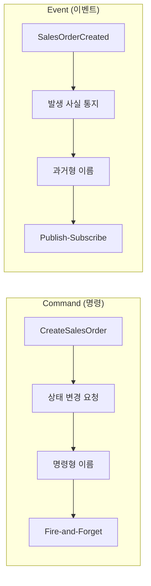
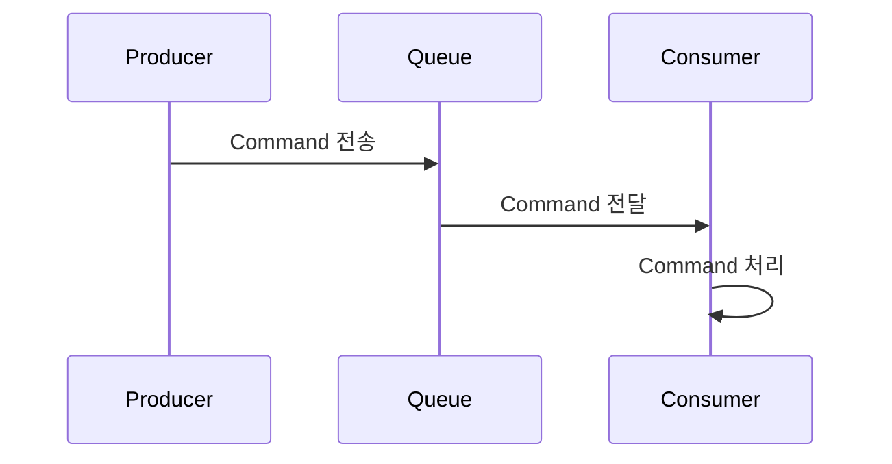
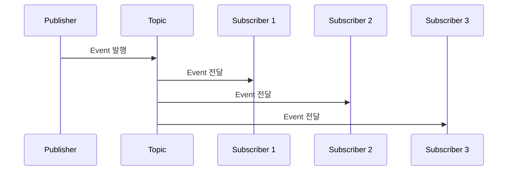
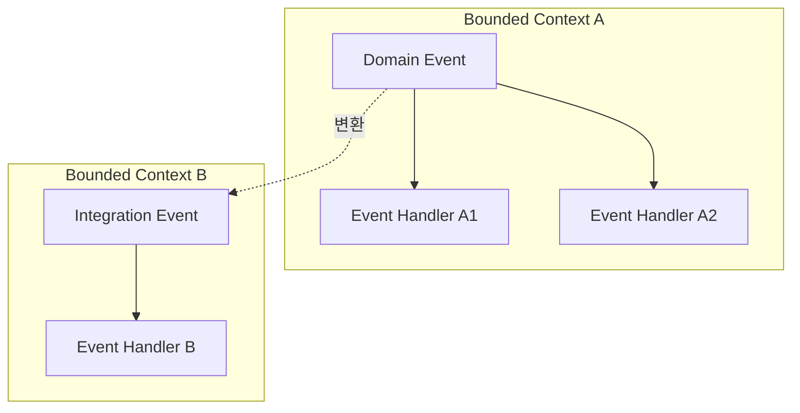
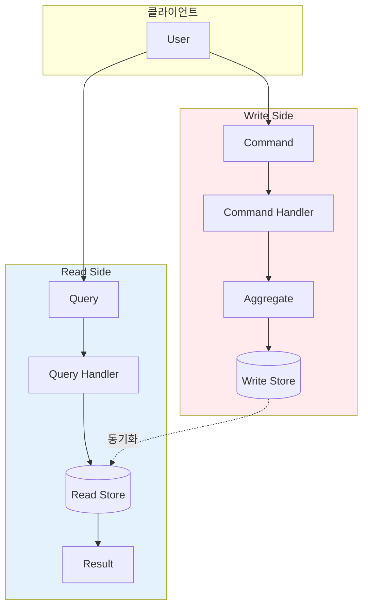
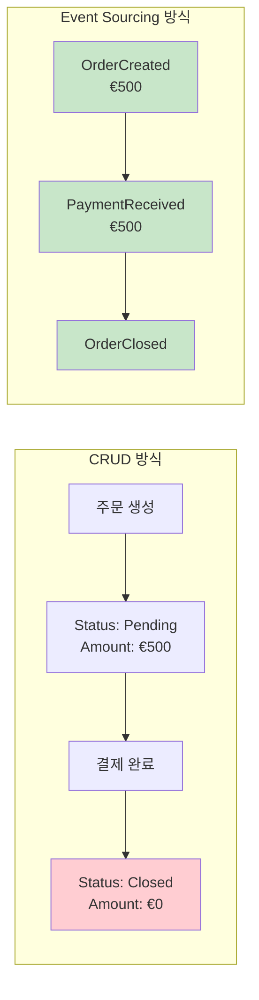
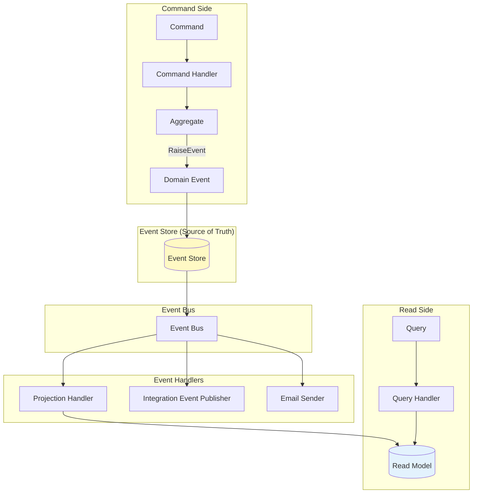
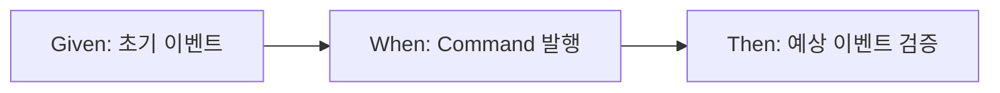

# Chapter 7: Integrating Events with CQRS (이벤트와 CQRS 통합)

## 📌 핵심 요약

> **"CQRS 패턴을 통해 읽기와 쓰기 모델을 분리하고, Event Sourcing으로 상태 변경의 전체 이력을 캡처한다. Command는 명령형(CreateOrder)으로, Event는 과거형(OrderCreated)으로 명명하여 비즈니스 의도를 명확히 표현한다."**

이 챕터에서는 CQRS 아키텍처에 이벤트 기반 메커니즘을 통합하는 방법을 학습한다.

---

## 🎯 학습 목표

이 챕터를 완료하면 다음을 할 수 있다:

- [ ] 동기식에서 비동기식 통신으로 전환 시 이점과 트레이드오프 이해
- [ ] Command와 Event의 차이점 및 적절한 메시지 처리 패턴 적용
- [ ] CQRS 원칙과 읽기/쓰기 모델 분리의 성능/확장성 이점 이해
- [ ] 다양한 동기화 전략 (Direct DB, Polling, Materialized Views 등) 비교
- [ ] Event Sourcing으로 상태 변경 이력 캡처 및 재생
- [ ] Domain Event vs Integration Event 구분
- [ ] Specification Testing으로 이벤트 기반 시스템 테스트

---

## 📖 본문 정리

### 7.1 모듈러 모놀리스에서 메시지의 역할

#### 이벤트 기반 vs 직접 통신 비교

| 측면 | Event-Driven | Direct Communication |
|------|--------------|----------------------|
| **통신 방식** | 비동기, 느슨한 결합 | 동기, 강한 결합 |
| **확장성** | 높은 확장성 | 저지연 실시간에 최적화 용이 |
| **일관성** | Eventual Consistency | 즉각 일관성 (강결합) |
| **장애 허용** | 더 탄력적, 장애 격리 | 실시간 피드백, 연쇄 장애 위험 |
| **복잡성** | 인프라 및 eventual consistency 복잡 | 구현 단순, 확장 시 복잡 |

---

### 7.2 Command vs Event



| 구분 | Command | Event |
|------|---------|-------|
| **목적** | Aggregate 상태 변경 | 발생 사실 통지 |
| **이름 형식** | **명령형** (CreateOrder, UpdateStock) | **과거형** (OrderCreated, StockUpdated) |
| **패턴** | Producer-Consumer | Publish-Subscribe |
| **예시** | 사용자 액션, 비즈니스 요청 | 주문 완료, 결제 승인 |

#### Command 예시

```csharp
// ✅ 명령형 이름: "주문을 생성하라"
public class CreateSalesOrder(
    SalesOrderId aggregateId,
    Guid commitId,
    SalesOrderNumber salesOrderNumber,
    OrderDate orderDate,
    CustomerId customerId,
    CustomerName customerName,
    IEnumerable<SalesOrderRowDto> rows)
    : Command(aggregateId, commitId)
{
    public readonly SalesOrderId SalesOrderId = aggregateId;
    public readonly SalesOrderNumber SalesOrderNumber = salesOrderNumber;
    public readonly OrderDate OrderDate = orderDate;
    public readonly CustomerId CustomerId = customerId;
    public readonly CustomerName CustomerName = customerName;
    public readonly IEnumerable<SalesOrderRowDto> Rows = rows;
}
```

#### Event 예시

```csharp
// ✅ 과거형 이름: "주문이 생성되었다"
public sealed class SalesOrderCreated(
    SalesOrderId aggregateId,
    Guid commitId,
    SalesOrderNumber salesOrderNumber,
    OrderDate orderDate,
    CustomerId customerId,
    CustomerName customerName,
    IEnumerable<SalesOrderRowDto> rows)
    : DomainEvent(aggregateId, commitId)
{
    public readonly SalesOrderId SalesOrderId = aggregateId;
    public readonly SalesOrderNumber SalesOrderNumber = salesOrderNumber;
    public readonly OrderDate OrderDate = orderDate;
    public readonly CustomerId CustomerId = customerId;
    public readonly CustomerName CustomerName = customerName;
    public readonly IEnumerable<SalesOrderRowDto> Rows = rows;
}
```

---

### 7.3 메시징 패턴

#### Producer-Consumer 패턴 (Command용)



> Command는 특정 컴포넌트로 전송되어 해당 액션이 수행되도록 보장

#### Publish-Subscribe 패턴 (Event용)



> Event는 발행되면 관심 있는 여러 컴포넌트가 독립적으로 구독하고 반응

---

### 7.4 Domain Event vs Integration Event



| 구분 | Domain Event | Integration Event |
|------|--------------|-------------------|
| **범위** | 단일 Bounded Context 내부 | Bounded Context 간 또는 시스템 간 |
| **목적** | 비즈니스 작업의 의미 캡처 | 컨텍스트 간 정보 공유 |
| **데이터** | 내부 도메인 모델 포함 가능 | 최소 필수 데이터만 포함 |
| **결합도** | 내부 로직과 밀접 | 느슨한 결합 유지 |

> **Domain Event**: Bounded Context 경계 내에서 의미 있는 비즈니스 이벤트
> **Integration Event**: 다른 Bounded Context나 시스템과 통신하기 위한 이벤트

---

### 7.5 CQRS (Command Query Responsibility Segregation)

#### CQRS 아키텍처



#### 핵심 개념

| 모델 | 책임 | 최적화 방향 |
|------|------|-------------|
| **Command Model (Write)** | 상태 변경 처리 (Create, Update, Delete) | 일관성, 정규화 |
| **Query Model (Read)** | 데이터 조회 | 성능, 비정규화 |

> **중요**: 두 개의 별도 DB 인스턴스가 필요한 것은 아님. 하나의 DB 서버에 두 개의 스키마로 구성 가능

---

### 7.6 읽기/쓰기 모델 동기화 전략

| 방법 | 장점 | 단점 |
|------|------|------|
| **Direct DB Sync** | 즉각 일관성, 구현 단순 | 성능 오버헤드, 복잡한 에러 핸들링 |
| **Database Polling** | 느슨한 결합, 낮은 복잡성 | 데이터 지연, 폴링 빈도에 따른 DB 부하 |
| **Materialized Views** | 읽기 최적화, 동기화 단순화 | 갱신 지연, 잦은 갱신 시 DB 부하 |
| **Shared Database** | 동기화 불필요, 쿼리 최적화 | 디커플링 부족, CQRS 이점 감소 |
| **Database Triggers** | 자동 동기화, 일관된 상태 | DB 의존성, 디버깅 어려움 |

#### 리팩토링 초기 단계: Shared Database 선택

```
📁 02-monolith_with_cqrs
├── Modules/
│   ├── Sales/
│   │   ├── BrewUp.Sales.Domain/
│   │   ├── BrewUp.Sales.ReadModel/     ← 새로 추가
│   │   │   ├── Dtos/
│   │   │   │   ├── SalesOrder.cs
│   │   │   │   └── SalesOrderRow.cs
│   │   │   └── Services/
│   │   └── BrewUp.Sales.Infrastructure/
│   └── Warehouses/
│       ├── BrewUp.Warehouses.Domain/
│       ├── BrewUp.Warehouses.ReadModel/ ← 새로 추가
│       │   └── Dtos/
│       │       └── Availability.cs
│       └── BrewUp.Warehouses.Infrastructure/
└── BrewUp.Shared.ReadModel/
    └── DtoBase.cs
```

#### Read Model DTO 예시

```csharp
public class Availability : DtoBase
{
    public string BeerId { get; private set; } = string.Empty;
    public string BeerName { get; private set; } = string.Empty;
    public Quantity Quantity { get; private set; } = new(0, string.Empty);

    protected Availability() { }

    public static Availability Create(BeerId beerId, BeerName beerName, Quantity quantity)
    {
        return new Availability(beerId.Value.ToString(), beerName.Value, quantity);
    }

    private Availability(string beerId, string beerName, Quantity quantity)
    {
        Id = beerId;
        BeerId = beerId;
        BeerName = beerName;
        Quantity = quantity;
    }

    public BeerAvailabilityJson ToJson() =>
        new(Id, BeerName, new Shared.CustomTypes.Availability(0, Quantity.Value, Quantity.UnitOfMeasure));
}
```

---

### 7.7 Event Sourcing으로 상태 변경 캡처

#### CRUD vs Event Sourcing 비교



| 측면 | CRUD | Event Sourcing |
|------|------|----------------|
| **저장 내용** | 현재 상태만 | 모든 상태 변경 이력 |
| **비유** | 사진 (snapshot) | 영화 (movie) |
| **추적성** | ❌ 제한적 | ✅ 완전한 이력 |
| **감사** | ❌ 어려움 | ✅ 자연스러움 |
| **상태 재구성** | ❌ 불가 | ✅ 이벤트 리플레이 |

#### Event Sourcing 이점

1. **추적성 (Traceability)**: 변경 시퀀스 추적, 현재 상태에 도달한 과정 이해
2. **감사성 (Auditability)**: 모든 변경 검증 및 정당화 가능
3. **유연성**: 상태 재구성, 새로운 프로젝션 생성 가능

---

### 7.8 CQRS + Event Sourcing 아키텍처



> **Event Store**가 시스템의 **Source of Truth**가 됨. 모든 도메인 이벤트를 저장하고, 이를 리플레이하여 Read Model 재구성 또는 새로운 프로젝션 생성 가능

---

### 7.9 Muflone 라이브러리 소개

> **Muflone**: .NET 프로젝트에서 CQRS 패턴 구현을 단순화하는 오픈소스 라이브러리
> GitHub: https://github.com/CQRS-Muflone/Muflone

#### AggregateRoot 클래스 핵심

```csharp
public abstract class AggregateRoot : IAggregate, IEquatable<IAggregate>
{
    // 아직 영속화되지 않은 도메인 이벤트 목록
    private readonly ICollection<object> _uncommittedEvents = new LinkedList<object>();

    public IDomainId Id { get; protected set; } = default!;
    public int Version { get; protected set; }

    // 이벤트 적용 (상태 변경)
    void IAggregate.ApplyEvent(object @event)
    {
        RegisteredRoutes.Dispatch(@event);
        Version++;
    }

    ICollection IAggregate.GetUncommittedEvents() => (ICollection)_uncommittedEvents;
    void IAggregate.ClearUncommittedEvents() => _uncommittedEvents.Clear();

    // 🔑 이벤트 발생 메서드
    protected void RaiseEvent(object @event)
    {
        ((IAggregate)this).ApplyEvent(@event);
        _uncommittedEvents.Add(@event);
    }
}
```

#### IRepository 인터페이스

```csharp
public interface IRepository : IDisposable
{
    // Aggregate 로드 (이벤트 스트림에서 재구성)
    Task<TAggregate?> GetByIdAsync<TAggregate>(
        IDomainId id,
        CancellationToken cancellationToken = default)
        where TAggregate : class, IAggregate;

    Task<TAggregate?> GetByIdAsync<TAggregate>(
        IDomainId id,
        long version,
        CancellationToken cancellationToken = default)
        where TAggregate : class, IAggregate;

    // Aggregate 저장 (이벤트 영속화)
    Task SaveAsync(
        IAggregate aggregate,
        Guid commitId,
        Action<IDictionary<string, object>> updateHeaders,
        CancellationToken cancellationToken = default);

    Task SaveAsync(
        IAggregate aggregate,
        Guid commitId,
        CancellationToken cancellationToken = default);
}
```

> **주의**: Repository는 `Save`와 `GetById`만 노출. 쿼리 실행은 지원하지 않음 (Write Model 전용)

---

### 7.10 Event Sourcing 구현 예시

#### SalesOrder Aggregate

```csharp
public class SalesOrder : AggregateRoot
{
    internal SalesOrderNumber _salesOrderNumber;
    internal OrderDate _orderDate;
    internal CustomerId _customerId;
    internal CustomerName _customerName;
    internal IEnumerable<SalesOrderRow> _rows;

    protected SalesOrder() { }

    // 🏭 Factory Method (정적 생성자)
    internal static SalesOrder CreateSalesOrder(
        SalesOrderId salesOrderId,
        Guid correlationId,
        SalesOrderNumber salesOrderNumber,
        OrderDate orderDate,
        CustomerId customerId,
        CustomerName customerName,
        IEnumerable<SalesOrderRowDto> rows)
    {
        // 불변조건 검증
        return new SalesOrder(salesOrderId, correlationId, salesOrderNumber,
            orderDate, customerId, customerName, rows);
    }

    private SalesOrder(SalesOrderId salesOrderId, Guid correlationId,
        SalesOrderNumber salesOrderNumber, OrderDate orderDate,
        CustomerId customerId, CustomerName customerName,
        IEnumerable<SalesOrderRowDto> rows)
    {
        // 🔥 이벤트 발생
        RaiseEvent(new SalesOrderCreated(salesOrderId, correlationId,
            salesOrderNumber, orderDate, customerId, customerName, rows));
    }

    // 📥 이벤트 적용 (상태 업데이트)
    private void Apply(SalesOrderCreated @event)
    {
        Id = @event.SalesOrderId;
        _salesOrderNumber = @event.SalesOrderNumber;
        _orderDate = @event.OrderDate;
        _customerId = @event.CustomerId;
        _customerName = @event.CustomerName;
        _rows = @event.Rows.MapToDomainRows();
    }
}
```

#### Command Handler

```csharp
public sealed class CreateSalesOrderCommandHandler
    : CommandHandlerAsync<CreateSalesOrder>
{
    public CreateSalesOrderCommandHandler(
        IRepository repository,
        ILoggerFactory loggerFactory)
        : base(repository, loggerFactory)
    {
    }

    public override async Task HandleAsync(
        CreateSalesOrder command,
        CancellationToken cancellationToken = default)
    {
        // 1️⃣ Aggregate Factory 호출 → RaiseEvent 발생
        var aggregate = SalesOrder.CreateSalesOrder(
            command.SalesOrderId,
            command.MessageId,
            command.SalesOrderNumber,
            command.OrderDate,
            command.CustomerId,
            command.CustomerName,
            command.Rows);

        // 2️⃣ UncommittedEvents를 Event Store에 저장
        await Repository.SaveAsync(aggregate, Guid.NewGuid());
    }
}
```

#### Event Handler (Read Model 업데이트)

```csharp
public sealed class SalesOrderCreatedEventHandlerAsync(
    ILoggerFactory loggerFactory,
    ISalesOrderService salesOrderService)
    : DomainEventHandlerAsync<SalesOrderCreated>(loggerFactory)
{
    public override async Task HandleAsync(
        SalesOrderCreated @event,
        CancellationToken cancellationToken = new())
    {
        try
        {
            // Read Model (Projection) 업데이트
            await salesOrderService.CreateSalesOrderAsync(
                @event.SalesOrderId,
                @event.SalesOrderNumber,
                @event.CustomerId,
                @event.CustomerName,
                @event.OrderDate,
                @event.Rows,
                cancellationToken);
        }
        catch (Exception ex)
        {
            Logger.LogError(ex, "Error handling sales order created event");
            throw;
        }
    }
}
```

---

### 7.11 Aggregate Factory 사용 이점

| 이점 | 설명 |
|------|------|
| **비즈니스 규칙 캡슐화** | 생성 시 검증 로직 일관 적용 |
| **의도 명확성** | 생성이 단순 인스턴스화가 아닌 도메인 액션임을 강조 |
| **제어된 인스턴스화** | 내부 불변조건 존중 보장 |
| **유연성** | 생성 로직 변경 시 한 곳만 수정 |

---

### 7.12 Specification Testing

#### Specification Test란?

> Unit Test가 개별 메서드나 클래스에 집중하는 반면, **Specification Test**는 Aggregate의 전체 수명주기를 시뮬레이션하여 테스트



#### 테스트 예시 1: SalesOrder 생성

```csharp
public sealed class CreateSalesOrderSuccessfully
    : CommandSpecification<CreateSalesOrder>
{
    private readonly SalesOrderId _salesOrderId = new(Guid.NewGuid());
    private readonly SalesOrderNumber _salesOrderNumber = new("20240315-1500");
    private readonly OrderDate _orderDate = new(DateTime.UtcNow);
    private readonly Guid _correlationId = Guid.NewGuid();
    private readonly CustomerId _customerId = new(Guid.NewGuid());
    private readonly CustomerName _customerName = new("Muflone");
    private readonly IEnumerable<SalesOrderRowDto> _rows = Enumerable.Empty<SalesOrderRowDto>();

    // 🔹 Given: 초기 상태 (새 생성이므로 없음)
    protected override IEnumerable<DomainEvent> Given()
    {
        yield break;  // 빈 목록
    }

    // 🔹 When: 실행할 Command
    protected override CreateSalesOrder When()
    {
        return new CreateSalesOrder(_salesOrderId, _correlationId,
            _salesOrderNumber, _orderDate, _customerId, _customerName, _rows);
    }

    // 🔹 Handler: Command 처리자
    protected override ICommandHandlerAsync<CreateSalesOrder> OnHandler()
    {
        return new CreateSalesOrderCommandHandler(Repository, new NullLoggerFactory());
    }

    // 🔹 Expect: 예상되는 이벤트
    protected override IEnumerable<DomainEvent> Expect()
    {
        yield return new SalesOrderCreated(_salesOrderId, _correlationId,
            _salesOrderNumber, _orderDate, _customerId, _customerName, _rows);
    }
}
```

#### 테스트 예시 2: Availability 업데이트 (기존 상태 존재)

```csharp
public class UpdateAvailabilityDueToProductionOrderAfterAggregateCreation
    : CommandSpecification<UpdateAvailabilityDueToProductionOrder>
{
    private readonly BeerId _beerId = new(Guid.NewGuid());
    private readonly BeerName _beerName = new("Muflone IPA");
    private readonly Quantity _quantity = new(100, "Lt");
    private readonly Quantity _newQuantity = new(200, "Lt");
    private readonly Guid _correlationId = Guid.NewGuid();

    // 🔹 Given: 이미 100Lt 상태로 설정된 Aggregate
    protected override IEnumerable<DomainEvent> Given()
    {
        yield return new AvailabilityUpdatedDueToProductionOrder(
            _beerId, _correlationId, _beerName, _quantity);
    }

    // 🔹 When: 100Lt 추가 요청
    protected override UpdateAvailabilityDueToProductionOrder When()
    {
        return new UpdateAvailabilityDueToProductionOrder(
            _beerId, _correlationId, _beerName, _quantity);
    }

    protected override ICommandHandlerAsync<UpdateAvailabilityDueToProductionOrder> OnHandler()
    {
        return new UpdateAvailabilityDueToProductionOrderCommandHandler(
            Repository, new NullLoggerFactory());
    }

    // 🔹 Expect: 결과는 200Lt
    protected override IEnumerable<DomainEvent> Expect()
    {
        yield return new AvailabilityUpdatedDueToProductionOrder(
            _beerId, _correlationId, _beerName, _newQuantity);
    }
}
```

---

## 💡 실무 적용 포인트

### CQRS + Event Sourcing 도입 체크리스트

```
Phase 1: CQRS 준비
□ Read Model 프로젝트 분리 (BrewUp.*.ReadModel)
□ DTO 클래스 생성 (Domain Entity와 분리)
□ Query Service 구현
□ 동기화 전략 선택 (초기: Shared Database 권장)

Phase 2: Event Sourcing 도입
□ Command 클래스 정의 (명령형 이름)
□ Event 클래스 정의 (과거형 이름)
□ Aggregate에 RaiseEvent/Apply 패턴 적용
□ Command Handler 구현
□ Event Handler 구현 (Read Model 업데이트)

Phase 3: 인프라 구성
□ Event Store 선택 (EventStoreDB, MongoDB 등)
□ Message Broker 설정 (RabbitMQ 등)
□ Muflone 또는 유사 라이브러리 도입

Phase 4: 테스팅
□ Specification Test 작성 (Given-When-Expect)
□ 기존 E2E 테스트 유지
□ Fitness Function 검증
```

### 이름 규칙 요약

| 유형 | 규칙 | 예시 |
|------|------|------|
| **Command** | 명령형 (동사 원형) | `CreateSalesOrder`, `UpdateStock` |
| **Domain Event** | 과거형 | `SalesOrderCreated`, `StockUpdated` |
| **Integration Event** | 과거형 + 컨텍스트 명시 | `SalesOrderCreatedIntegrationEvent` |

### RabbitMQ 참고

> **RabbitMQ**: 큐를 통해 메시지를 보내고 받아 애플리케이션 간 통신을 용이하게 하는 인기 있는 오픈소스 메시지 브로커
> https://www.rabbitmq.com

---

## ✅ 핵심 개념 체크리스트

- [ ] Command vs Event 차이 이해 (명령형 vs 과거형)
- [ ] Producer-Consumer vs Publish-Subscribe 패턴 구분
- [ ] Domain Event vs Integration Event 구분
- [ ] CQRS의 Read/Write 모델 분리 원칙
- [ ] 동기화 전략별 장단점 파악
- [ ] Event Sourcing의 이점 (추적성, 감사성, 유연성)
- [ ] AggregateRoot의 RaiseEvent/Apply 패턴
- [ ] Repository의 역할 (GetById, Save만 제공)
- [ ] Specification Testing의 Given-When-Expect 패턴
- [ ] Muflone 라이브러리 활용

---

## 🔗 참고 자료

- [GitHub: 02-monolith_with_cqrs](https://github.com/PacktPublishing/Domain-driven-Refactoring/tree/02-monolith_with_cqrs)
- [GitHub: 03-monolith_with_cqrs_and_event_sourcing](https://github.com/PacktPublishing/Domain-driven-Refactoring/tree/03-monolith_with_cqrs_and_event_sourcing)
- [Muflone Library](https://github.com/CQRS-Muflone/Muflone)
- [RabbitMQ](https://www.rabbitmq.com)
- [EventStoreDB](https://www.eventstore.com/)

---

## 📚 다음 챕터 미리보기

- **Chapter 8**: 데이터베이스 리팩토링 전략 - 모듈러 아키텍처에 맞는 DB 구조 재설계

