# Chapter 8: Refactoring the Database (데이터베이스 리팩토링)

## 핵심 요약

> **"모듈형 서비스로 전환할 때 데이터베이스 리팩토링은 필수다. Expand/Contract 패턴으로 스키마를 점진적으로 마이그레이션하고, 이벤트 기반 데이터 동기화를 통해 컨텍스트 간 데이터 일관성을 유지한다. Blue-Green 배포와 Feature Flag로 안전한 롤아웃을 보장한다."**

이 챕터에서는 모놀리식 데이터베이스를 모듈별로 분리하는 전략과 패턴을 학습한다.

---

## 학습 목표

이 챕터를 완료하면 다음을 할 수 있다:

- [ ] 진화적 데이터베이스 개발 원칙 이해
- [ ] 테이블 소유권 패턴 3가지 구분 및 적용
- [ ] Expand/Contract 패턴으로 스키마 마이그레이션
- [ ] 저장 프로시저 추출 및 분리
- [ ] 이벤트 기반 데이터 동기화 구현
- [ ] 분산 데이터 접근 패턴 선택 및 적용
- [ ] Blue-Green 배포 및 Feature Flag 전략

---

## 본문 정리

### 8.1 왜 데이터베이스 리팩토링이 필요한가?

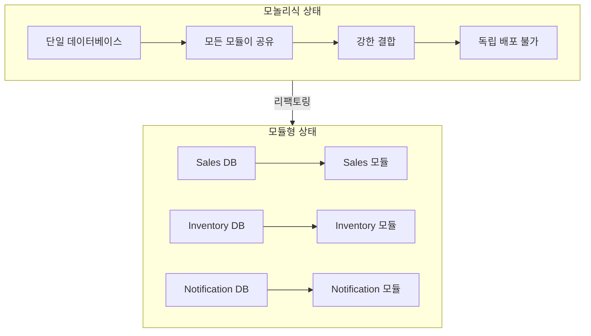

| 문제점 | 설명 |
|--------|------|
| **결합도** | 모든 모듈이 동일 스키마에 의존 |
| **배포** | 스키마 변경 시 전체 시스템 영향 |
| **확장성** | 특정 모듈만 스케일 아웃 불가 |
| **자율성** | 팀별 독립적 DB 진화 불가 |

---

### 8.2 진화적 데이터베이스 개발 (Evolutionary Database Development)

**참고**: Pramod Sadalage & Scott Ambler의 "Database Refactoring" (2006)

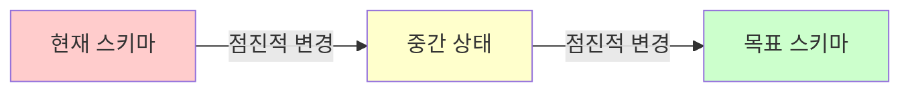

**핵심 원칙**:
1. **점진적 변경**: 빅뱅 마이그레이션 대신 작은 단계로
2. **하위 호환성**: 이전 버전 애플리케이션도 동작 보장
3. **자동화된 테스트**: 모든 변경에 대한 검증
4. **되돌릴 수 있는 변경**: 롤백 가능한 설계

---

### 8.3 테이블 소유권 패턴

#### 8.3.1 공통 테이블 소유권 (Common Table Ownership)

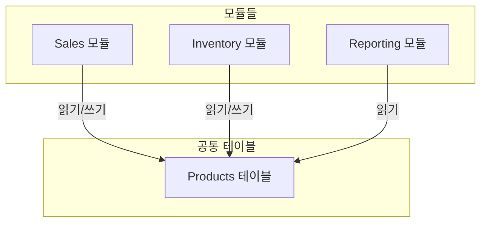

**특징**:
- 여러 모듈이 동일 테이블 공유
- 가장 결합도가 높은 패턴
- 마이그레이션 초기 단계에서 임시로 사용

**문제점**:
```sql
-- Sales 모듈이 컬럼 추가
ALTER TABLE Products ADD COLUMN discount_rate DECIMAL(5,2);

-- Inventory 모듈은 이 변경을 모름 → 잠재적 충돌
```

#### 8.3.2 단일 테이블 소유권 (Single Table Ownership)

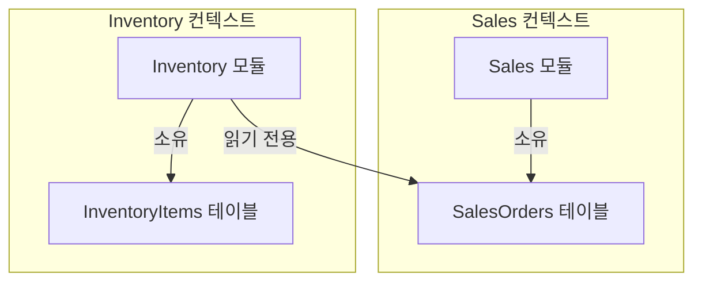

**특징**:
- 각 테이블은 하나의 모듈만 소유
- 다른 모듈은 읽기 전용 접근만 허용
- **권장 패턴** - 명확한 소유권

**구현 예시**:
```csharp
// Sales 모듈 - SalesOrder 테이블 소유
public class SalesOrderRepository : ISalesOrderRepository
{
    public void Create(SalesOrder order) { /* 쓰기 가능 */ }
    public void Update(SalesOrder order) { /* 쓰기 가능 */ }
}

// Inventory 모듈 - SalesOrder 읽기 전용
public class SalesOrderReadOnlyRepository
{
    public SalesOrder GetById(Guid id) { /* 읽기만 가능 */ }
}
```

#### 8.3.3 공동 테이블 소유권 (Joint Table Ownership)

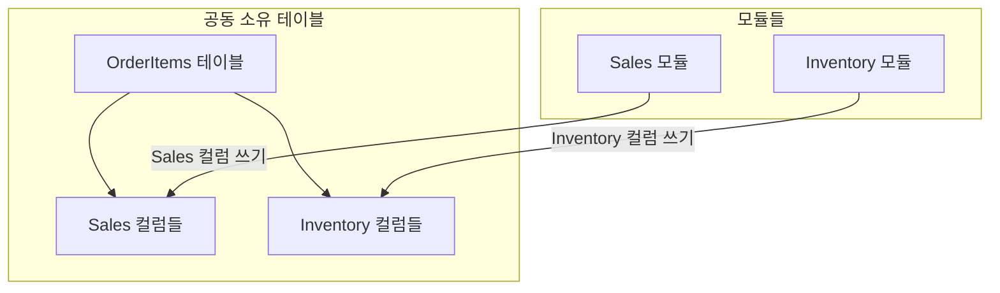

**특징**:
- 테이블을 논리적으로 분할
- 각 모듈이 자신의 컬럼만 수정
- 명확한 컬럼 소유권 정의 필요

**구현 시 주의점**:
```sql
-- 명확한 컬럼 소유권 정의
-- Sales 소유: order_id, customer_id, total_amount, created_at
-- Inventory 소유: reserved_quantity, warehouse_id, shipment_status

-- Sales 모듈은 Inventory 컬럼 수정 금지
-- Inventory 모듈은 Sales 컬럼 수정 금지
```

---

### 8.4 Expand/Contract 패턴

**목적**: 하위 호환성을 유지하면서 스키마 점진적 변경

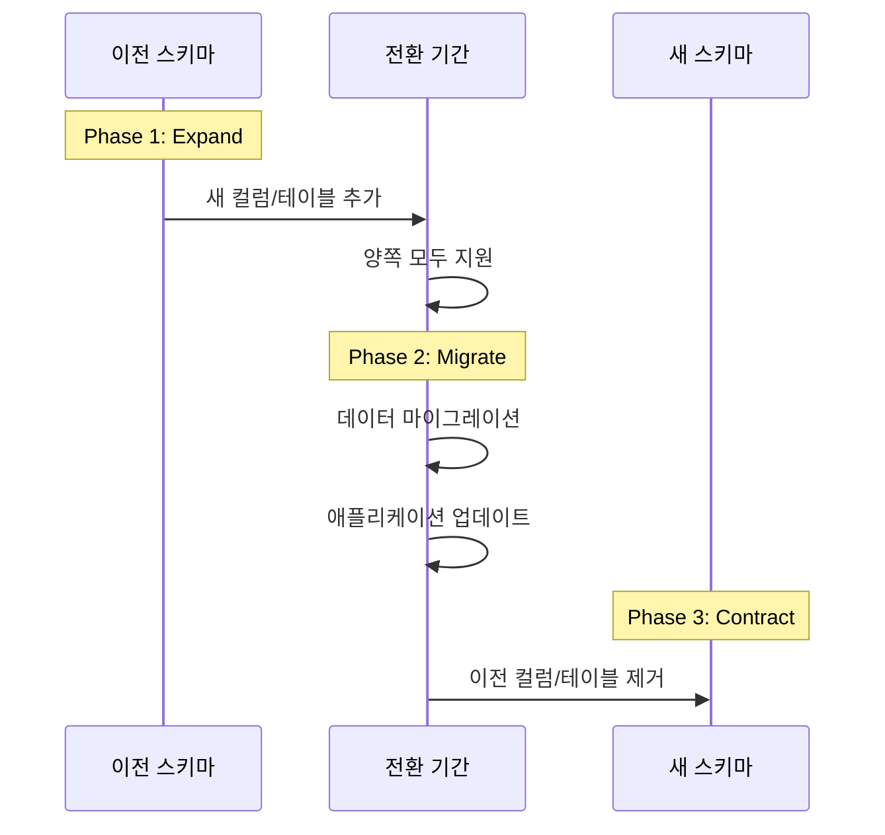

#### 단계별 예시: 컬럼명 변경

**Phase 1: Expand (확장)**
```sql
-- 새 컬럼 추가 (이전 컬럼 유지)
ALTER TABLE Customers ADD COLUMN full_name VARCHAR(200);

-- 트리거로 양방향 동기화
CREATE TRIGGER sync_customer_name
AFTER INSERT OR UPDATE ON Customers
FOR EACH ROW
BEGIN
    UPDATE Customers
    SET full_name = CONCAT(first_name, ' ', last_name)
    WHERE id = NEW.id;
END;
```

**Phase 2: Migrate (마이그레이션)**
```sql
-- 기존 데이터 마이그레이션
UPDATE Customers
SET full_name = CONCAT(first_name, ' ', last_name)
WHERE full_name IS NULL;
```

```csharp
// 애플리케이션 코드 업데이트
public class Customer
{
    // 이전 속성 (deprecated)
    [Obsolete("Use FullName instead")]
    public string FirstName { get; set; }

    [Obsolete("Use FullName instead")]
    public string LastName { get; set; }

    // 새 속성
    public string FullName { get; set; }
}
```

**Phase 3: Contract (축소)**
```sql
-- 모든 애플리케이션이 새 컬럼 사용 확인 후
ALTER TABLE Customers DROP COLUMN first_name;
ALTER TABLE Customers DROP COLUMN last_name;
DROP TRIGGER sync_customer_name;
```

---

### 8.5 저장 프로시저 추출

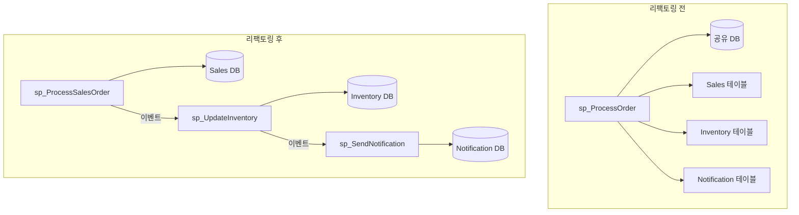

**추출 단계**:

1. **분석**: 프로시저의 책임 식별
2. **분리**: 단일 책임 원칙에 따라 분할
3. **이벤트 연결**: 프로시저 간 이벤트 기반 통신
4. **테스트**: 각 프로시저 독립 테스트
5. **마이그레이션**: 호출부 점진적 업데이트

```sql
-- 이전: 하나의 프로시저가 모든 것 처리
CREATE PROCEDURE sp_ProcessOrder
    @OrderId UNIQUEIDENTIFIER
AS
BEGIN
    -- Sales 로직
    UPDATE SalesOrders SET status = 'Processing' WHERE id = @OrderId;

    -- Inventory 로직
    UPDATE Inventory SET quantity = quantity - 1 WHERE product_id = @ProductId;

    -- Notification 로직
    INSERT INTO Notifications (order_id, message) VALUES (@OrderId, 'Order processed');
END

-- 이후: 책임별 분리
CREATE PROCEDURE sp_ProcessSalesOrder @OrderId UNIQUEIDENTIFIER AS
BEGIN
    UPDATE SalesOrders SET status = 'Processing' WHERE id = @OrderId;
    -- 이벤트 발행: OrderProcessed
END

CREATE PROCEDURE sp_ReserveInventory @ProductId UNIQUEIDENTIFIER, @Quantity INT AS
BEGIN
    UPDATE Inventory SET quantity = quantity - @Quantity WHERE product_id = @ProductId;
    -- 이벤트 발행: InventoryReserved
END
```

---

### 8.6 이벤트 기반 데이터 동기화

#### 8.6.1 Integration Event를 통한 동기화

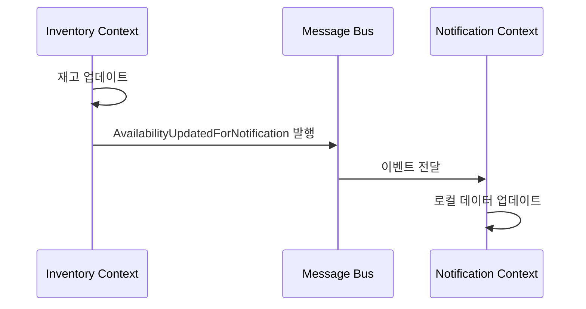

**Integration Event 정의**:
```csharp
// Inventory 컨텍스트에서 발행
public record AvailabilityUpdatedForNotification(
    Guid ProductId,
    string ProductName,
    int AvailableQuantity,
    DateTime UpdatedAt
);

// Notification 컨텍스트에서 처리
public class AvailabilityUpdatedHandler
    : IIntegrationEventHandler<AvailabilityUpdatedForNotification>
{
    private readonly INotificationRepository _repository;

    public async Task Handle(AvailabilityUpdatedForNotification @event)
    {
        // 로컬 캐시/테이블 업데이트
        await _repository.UpdateProductAvailability(
            @event.ProductId,
            @event.ProductName,
            @event.AvailableQuantity
        );
    }
}
```

#### 8.6.2 ACL (Anti-Corruption Layer)을 통한 변환

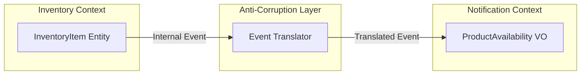

```csharp
// ACL: Inventory 도메인 모델 → Notification 도메인 모델 변환
public class InventoryToNotificationTranslator
{
    public AvailabilityUpdatedForNotification Translate(
        InventoryItemUpdated internalEvent)
    {
        // Inventory의 내부 모델을 Notification이 이해하는 형태로 변환
        return new AvailabilityUpdatedForNotification(
            ProductId: internalEvent.ItemId,
            ProductName: internalEvent.ItemDescription, // 필드명 매핑
            AvailableQuantity: internalEvent.StockLevel,
            UpdatedAt: DateTime.UtcNow
        );
    }
}
```

---

### 8.7 분산 데이터 접근 패턴

#### 8.7.1 복제된 캐싱 (Replicated Caching)

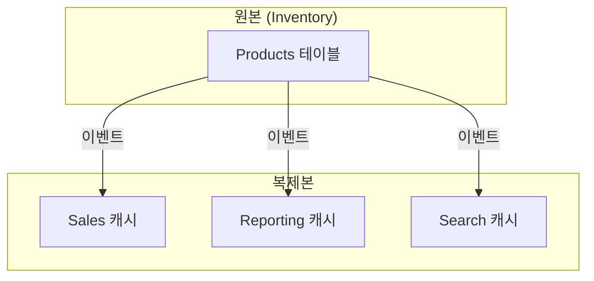

**특징**:
- 각 컨텍스트가 필요한 데이터의 로컬 복사본 유지
- 최종 일관성 (Eventual Consistency) 허용
- 읽기 성능 최적화

**구현**:
```csharp
public class ProductCacheUpdater
{
    private readonly IDistributedCache _cache;

    public async Task Handle(ProductUpdated @event)
    {
        var cacheKey = $"product:{@event.ProductId}";
        var cachedProduct = new CachedProduct
        {
            Id = @event.ProductId,
            Name = @event.Name,
            Price = @event.Price,
            LastUpdated = DateTime.UtcNow
        };

        await _cache.SetAsync(cacheKey, cachedProduct,
            new DistributedCacheEntryOptions
            {
                AbsoluteExpirationRelativeToNow = TimeSpan.FromHours(1)
            });
    }
}
```

#### 8.7.2 동기 서비스 간 통신 (Synchronous Interservice)

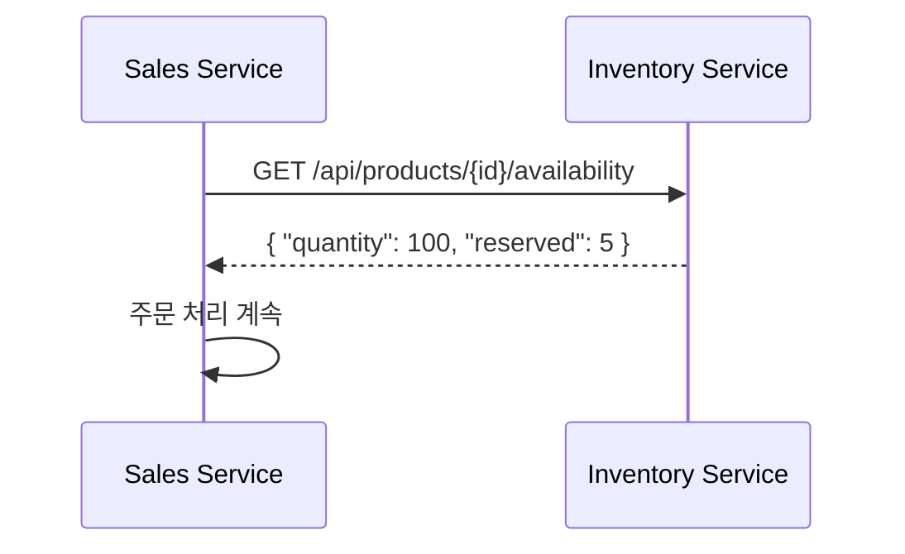

**장점**: 항상 최신 데이터
**단점**: 네트워크 지연, 서비스 의존성

```csharp
public class InventoryClient : IInventoryClient
{
    private readonly HttpClient _httpClient;

    public async Task<ProductAvailability> GetAvailability(Guid productId)
    {
        var response = await _httpClient.GetAsync(
            $"/api/products/{productId}/availability");

        response.EnsureSuccessStatusCode();
        return await response.Content.ReadFromJsonAsync<ProductAvailability>();
    }
}
```

#### 8.7.3 컬럼 스키마 복제 (Column Schema Replication)

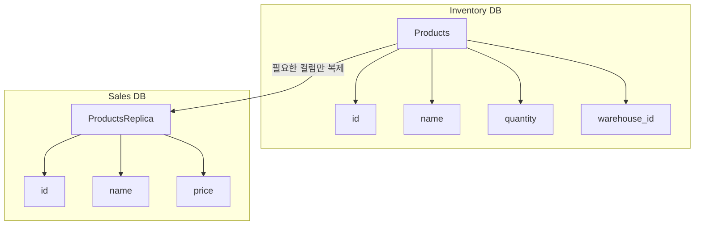

**특징**:
- 전체 테이블이 아닌 필요한 컬럼만 복제
- 스토리지 효율성
- 컨텍스트별 필요한 뷰 제공

---

### 8.8 테스팅 전략

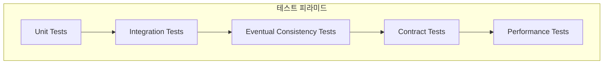

#### 8.8.1 단위 테스트 (Unit Tests)

```csharp
[Fact]
public void ShouldCreateMigrationScript()
{
    // Arrange
    var migration = new AddFullNameColumnMigration();

    // Act
    var script = migration.GenerateUpScript();

    // Assert
    script.Should().Contain("ALTER TABLE Customers ADD COLUMN full_name");
}
```

#### 8.8.2 통합 테스트 (Integration Tests)

```csharp
[Fact]
public async Task ShouldMigrateDataCorrectly()
{
    // Arrange
    using var db = new TestDatabaseFixture();
    await db.SeedData(new Customer { FirstName = "John", LastName = "Doe" });

    // Act
    await db.ApplyMigration<MergeNameColumnsMigration>();

    // Assert
    var customer = await db.Query<Customer>("SELECT * FROM Customers WHERE id = @Id");
    customer.FullName.Should().Be("John Doe");
}
```

#### 8.8.3 최종 일관성 테스트 (Eventual Consistency Tests)

```csharp
[Fact]
public async Task ShouldSynchronizeDataEventually()
{
    // Arrange
    var product = new Product { Id = Guid.NewGuid(), Name = "Widget" };

    // Act
    await _inventoryService.UpdateProduct(product);

    // Assert - 폴링으로 최종 일관성 확인
    await AssertEventually(async () =>
    {
        var cachedProduct = await _salesCache.GetProduct(product.Id);
        cachedProduct.Should().NotBeNull();
        cachedProduct.Name.Should().Be("Widget");
    }, timeout: TimeSpan.FromSeconds(30));
}
```

#### 8.8.4 계약 테스트 (Contract Tests)

```csharp
[Fact]
public void IntegrationEventShouldMatchContract()
{
    // Arrange
    var @event = new AvailabilityUpdatedForNotification(
        Guid.NewGuid(), "Product", 100, DateTime.UtcNow);

    // Act
    var json = JsonSerializer.Serialize(@event);

    // Assert - 스키마 검증
    var schema = JsonSchema.FromFile("contracts/availability-updated.json");
    schema.Validate(json).IsValid.Should().BeTrue();
}
```

---

### 8.9 배포 전략

#### 8.9.1 Blue-Green 배포

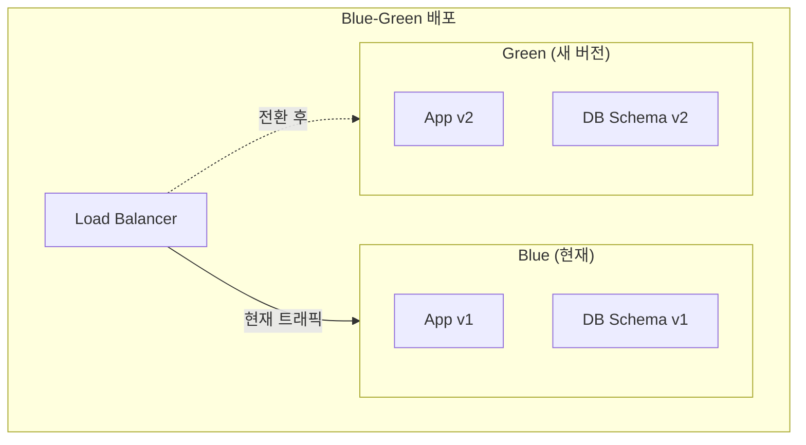

**단계**:
1. Green 환경에 새 스키마 적용
2. 데이터 마이그레이션 및 동기화
3. Green 환경 테스트
4. 트래픽 전환
5. Blue 환경 정리

#### 8.9.2 Expand/Contract + Feature Flag

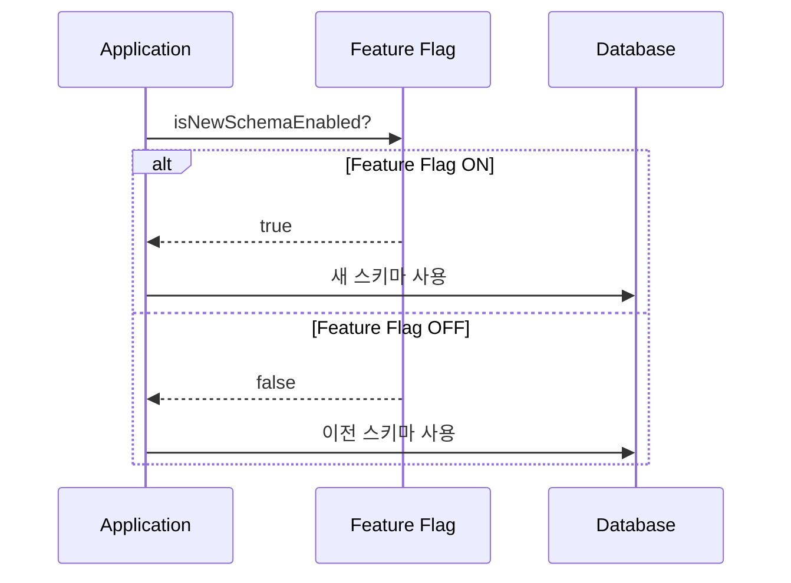

```csharp
public class CustomerRepository
{
    private readonly IFeatureManager _features;

    public async Task<Customer> GetById(Guid id)
    {
        if (await _features.IsEnabledAsync("UseNewCustomerSchema"))
        {
            // 새 스키마: full_name 컬럼 사용
            return await _db.QueryFirstAsync<Customer>(
                "SELECT id, full_name AS Name FROM Customers WHERE id = @Id",
                new { Id = id });
        }
        else
        {
            // 이전 스키마: first_name, last_name 컬럼 사용
            return await _db.QueryFirstAsync<Customer>(
                @"SELECT id, CONCAT(first_name, ' ', last_name) AS Name
                  FROM Customers WHERE id = @Id",
                new { Id = id });
        }
    }
}
```

---

## 실무 적용 포인트

### 데이터베이스 리팩토링 체크리스트

```
□ 현재 상태 분석
  ├── 테이블별 소유권 매핑
  ├── 크로스 컨텍스트 쿼리 식별
  ├── 저장 프로시저 의존성 분석
  └── 트리거 및 제약조건 파악

□ 목표 아키텍처 설계
  ├── 컨텍스트별 테이블 할당
  ├── 공유 데이터 동기화 전략
  └── Integration Event 설계

□ 마이그레이션 계획
  ├── Expand/Contract 단계 정의
  ├── 롤백 계획 수립
  └── 테스트 시나리오 작성

□ 배포 전략
  ├── Blue-Green vs Feature Flag 선택
  ├── 모니터링 설정
  └── 성능 기준선 설정
```

### 패턴 선택 가이드

| 상황 | 권장 패턴 |
|------|-----------|
| 초기 분리 단계 | Common Table Ownership (임시) |
| 명확한 도메인 경계 | Single Table Ownership |
| 테이블 공유 불가피 | Joint Table Ownership |
| 스키마 변경 | Expand/Contract |
| 데이터 동기화 | Event-Based Synchronization |
| 읽기 성능 중요 | Replicated Caching |

### 위험 요소 및 대응

| 위험 | 대응 방안 |
|------|-----------|
| 데이터 불일치 | Eventual Consistency 테스트 자동화 |
| 마이그레이션 실패 | 롤백 스크립트 사전 준비 |
| 성능 저하 | 성능 테스트 기준선 설정 |
| 서비스 중단 | Blue-Green 배포로 무중단 전환 |

---

## 핵심 개념 체크리스트

- [ ] 진화적 데이터베이스 개발 4원칙 이해
- [ ] Common/Single/Joint Table Ownership 구분
- [ ] Expand/Contract 3단계 (확장→마이그레이션→축소)
- [ ] 저장 프로시저 추출 및 이벤트 기반 분리
- [ ] Integration Event를 통한 데이터 동기화
- [ ] ACL로 컨텍스트 간 모델 변환
- [ ] Replicated Caching vs Synchronous Interservice 트레이드오프
- [ ] Blue-Green 배포와 Feature Flag 조합
- [ ] 최종 일관성 테스트 및 계약 테스트

---

## 참고 자료

- Pramod Sadalage & Scott Ambler, "Refactoring Databases" (2006)
- Martin Fowler, "Evolutionary Database Design"
- Sam Newman, "Building Microservices" - Chapter on Database Decomposition
- Expand/Contract Pattern: https://www.martinfowler.com/bliki/ParallelChange.html

---

## 다음 챕터 미리보기

- **Chapter 9**: DDD Patterns for CI/CD - 지속적 통합/배포 환경에서의 DDD 패턴 적용
