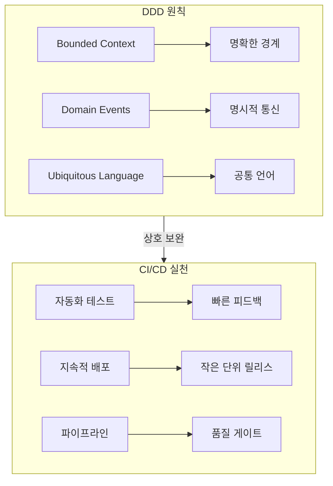
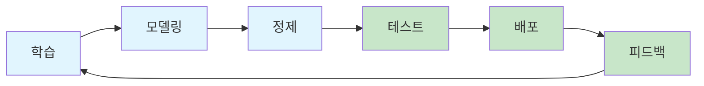
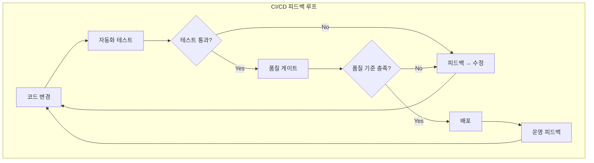
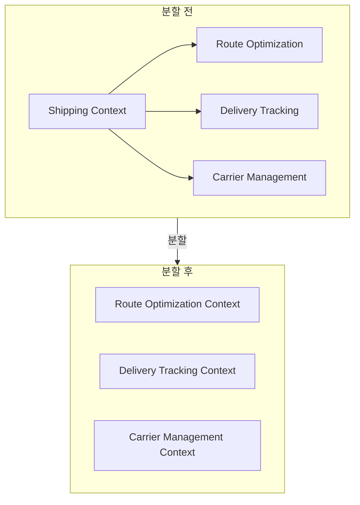
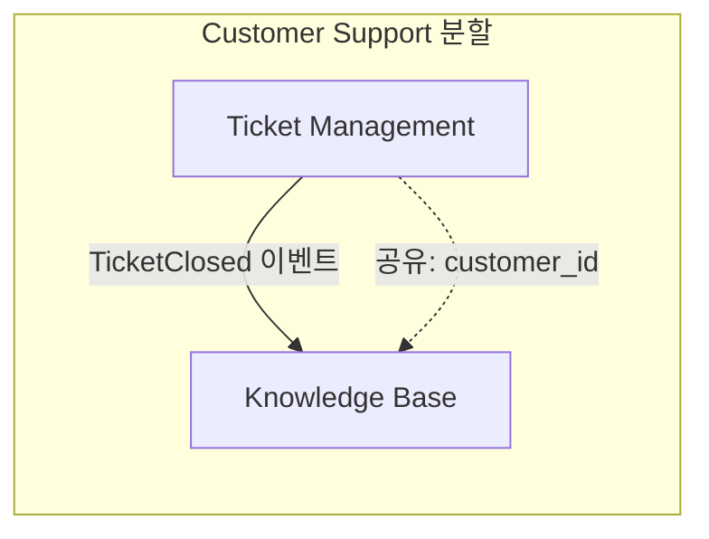
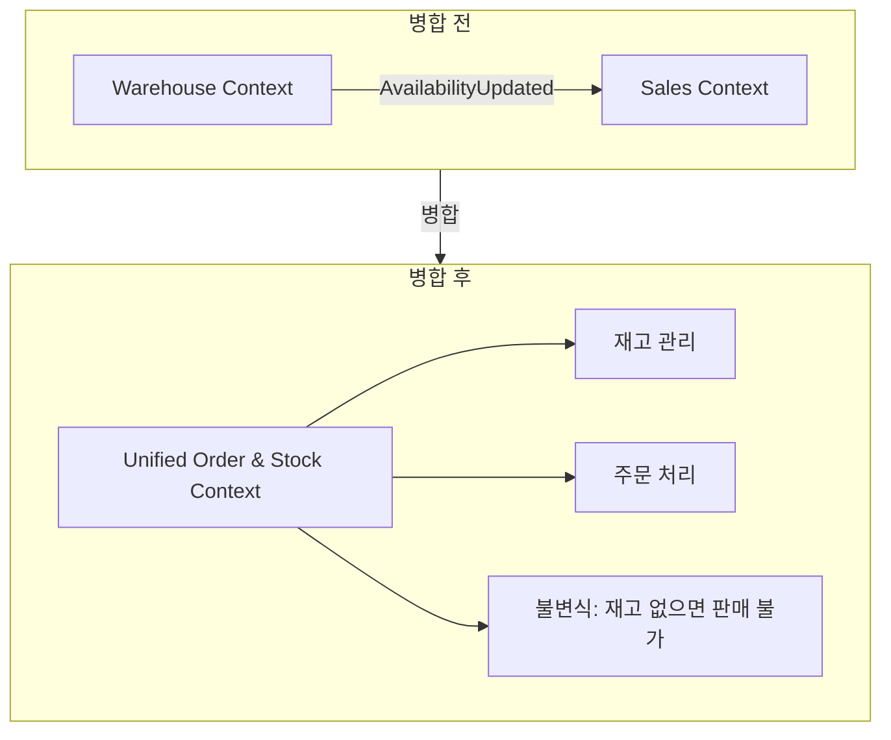
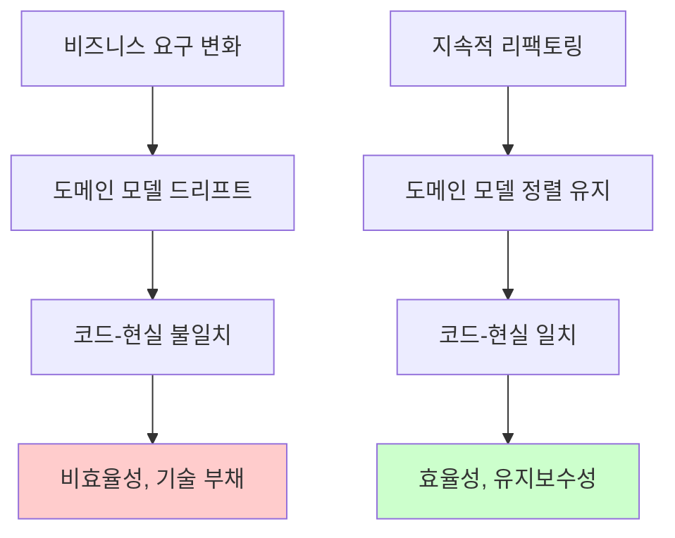
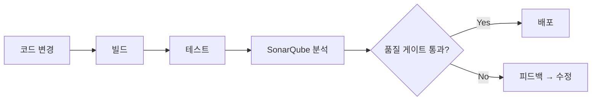

# Chapter 9: DDD Patterns for CI/CD (CI/CD를 위한 DDD 패턴)

## 핵심 요약

> **"DDD와 CI/CD는 상호 보완적이다. Bounded Context의 명확한 경계는 독립적인 테스트와 배포를 가능하게 하고, CI/CD의 빠른 피드백 루프는 도메인 모델의 지속적인 개선을 지원한다. 자동화와 도구(SonarQube, GitLab CI/CD, GitHub Actions)를 활용하여 코드 품질을 유지하면서 비즈니스 요구사항에 맞춘 시스템을 지속적으로 발전시킬 수 있다."**

이 챕터에서는 DDD 원칙과 CI/CD 파이프라인을 통합하여 지속적인 리팩토링을 실현하는 방법을 학습한다.

---

## 학습 목표

이 챕터를 완료하면 다음을 할 수 있다:

- [ ] DDD와 CI/CD의 시너지 이해
- [ ] Bounded Context 분할(Splitting) 패턴 적용
- [ ] Bounded Context 병합(Merging) 패턴 적용
- [ ] 지속적 리팩토링(Continuous Refactoring) 실천
- [ ] SonarQube를 활용한 코드 품질 관리
- [ ] GitLab CI/CD 및 GitHub Actions 파이프라인 구성

---

## 본문 정리

### 9.1 DDD와 CI/CD의 통합

#### 왜 DDD가 CI/CD에 유익한가?



| DDD 원칙 | CI/CD 이점 |
|----------|------------|
| **Bounded Context** | 독립적인 테스트/배포, 변경 격리 |
| **Domain Events** | 예측 가능한 시스템 동작, 간편한 디버깅 |
| **Ubiquitous Language** | 의미 있는 테스트, 신뢰할 수 있는 파이프라인 |
| **지속적 모델 개선** | 점진적 배포, 기술 부채 감소 |

#### Whirlpool Process와 CI/CD



- **DDD (파랑)**: 도메인 이해 → 모델링 → 정제
- **CI/CD (초록)**: 테스트 → 배포 → 피드백
- **공통점**: 반복적, 점진적 개선

---

### 9.2 피드백 루프 구축



**피드백 루프의 목적**:
1. **기술적 정확성**: 코드가 올바르게 동작하는지 검증
2. **도메인 정합성**: 비즈니스 요구사항과 일치하는지 확인
3. **빠른 오류 발견**: 문제를 조기에 식별하고 수정

---

### 9.3 Bounded Context 분할 (Splitting)

#### 9.3.1 Domain Decomposition (도메인 분해)



**분할 단계**:

1. **현재 컨텍스트 이해**
   - 도메인 전문가와 협업
   - EventStorming으로 책임, 워크플로우, 데이터 흐름 매핑

2. **서브도메인 식별**
   - Core, Supporting, Generic 서브도메인 구분
   - 독립적으로 동작하는 영역 찾기

3. **자연스러운 경계 발견**
   - 불변식(Invariant)이 지역화된 영역
   - 팀 소유권, 사용자 역할, 외부 의존성 기준

4. **의존성 계획**
   - 분할된 컨텍스트 간 통신 방식 결정
   - Domain Event, API, 비동기 메시징 선택

**리팩토링 단계**:
```
1. 관련 Aggregate를 작은 클러스터로 격리
2. Domain Event를 도입하여 컨텍스트 간 명확한 통신 정의
3. 의존 코드를 점진적으로 리팩토링하여 새 경계 준수
```

#### 9.3.2 Context Mapping (컨텍스트 매핑)



**매핑 단계**:

1. **기존 관계 식별**: 분할 대상과 상호작용하는 컨텍스트 파악
2. **관계 매핑**: Shared Kernel, Partnership, Upstream/Downstream 등
3. **새 컨텍스트 분석**: 각 컨텍스트를 맵에 표시
4. **상호작용 패턴 재정의**:
   - Shared Kernel → Published Language (느슨한 결합)
   - Conformist → Partnership (더 많은 자율성)
5. **도메인 전문가 검증**: 새 경계가 비즈니스 요구와 일치하는지 확인

**분할 시 Best Practices**:
- ACL (Anti-Corruption Layer)로 전환 기간 동안 통신 관리
- 잘 정의된 Domain Event 또는 API로 통신
- 통합 테스트로 효과적인 통신 검증

---

### 9.4 Bounded Context 병합 (Merging)

#### 병합이 필요한 상황

| 상황 | 설명 |
|------|------|
| **모델 중복** | 두 컨텍스트의 도메인 모델이 상당 부분 겹침 |
| **과도한 통합 오버헤드** | 컨텍스트 간 상호작용이 너무 빈번함 |
| **비즈니스 전략 변경** | 운영 통합, 팀 책임 재정의 등 |

#### 병합 프로세스



**병합 단계**:

1. **현재 상태 분석**
   - 각 컨텍스트의 책임, 도메인 모델, 워크플로우 파악
   - 중복과 불필요한 부분 식별
   - 도메인 전문가와 협업하여 공유 개념 발견

2. **통합 컨텍스트 정의**
   - 공유 엔티티와 개념을 통합하는 단일 도메인 모델 생성
   - 중복 제거
   - 응집력 유지 (모놀리스가 되지 않도록 주의)

3. **점진적 전환**
   - 공유 Domain Event를 브릿지로 활용
   - 엔티티와 비즈니스 규칙을 점진적으로 마이그레이션
   - 각 단계가 통합 모델과 일치하는지 확인

4. **관계 재정의**
   - 업스트림/다운스트림 의존성 조정
   - 외부 시스템과의 상호작용 계획

5. **검증**
   - 광범위한 테스트
   - 도메인 전문가와 협업하여 비즈니스 기대 충족 확인

---

### 9.5 지속적 리팩토링 (Continuous Refactoring)

#### 왜 지속적 리팩토링이 중요한가?



#### 지속적 리팩토링의 핵심 요소

1. **Ubiquitous Language 유지**
   - 도메인 전문가와의 소통을 통해 공유 언어 발전
   - 코드가 업데이트된 언어를 반영하도록 리팩토링

2. **자동화로 안전한 반복 지원**
   - 자동화된 테스트 (비즈니스 로직 중심)
   - 린터, 정적 분석기, 의존성 스캐너

3. **협업**
   - 도메인 전문가와 함께 개선 영역 식별
   - 복잡한 워크플로우 단순화, 중복 개념 통합

4. **Bounded Context 경계 검토**
   - 정기적으로 경계 관련성 확인
   - 비즈니스 역량에 맞게 범위 재정의

**예시: 중복 이벤트 통합**
```csharp
// 리팩토링 전: 유사한 두 이벤트
public record OrderPlaced(Guid OrderId, DateTime PlacedAt);
public record OrderInitiated(Guid OrderId, DateTime InitiatedAt);

// 리팩토링 후: 통합된 단일 이벤트
public record OrderCreated(Guid OrderId, DateTime CreatedAt);
```

---

### 9.6 자동화 및 도구

#### 9.6.1 CI/CD 플랫폼 비교

| 플랫폼 | 특징 |
|--------|------|
| **GitLab CI/CD** | 통합 CI/CD, YAML 설정, 셀프 호스팅 가능 |
| **GitHub Actions** | 워크플로우 기반, 마켓플레이스 액션 |
| **Azure DevOps** | 엔터프라이즈 기능, Azure 통합 |
| **Bitbucket Pipelines** | Atlassian 생태계 통합 |
| **AWS CodePipeline** | AWS 서비스 네이티브 통합 |

#### 9.6.2 SonarQube로 코드 품질 관리



**SonarQube 주요 기능**:
- **정적 코드 분석**: 버그, 취약점, 코드 스멜 감지
- **품질 게이트**: 배포 전 품질 기준 강제
- **다국어 지원**: Java, Python, JavaScript, C# 등 25개 이상 언어
- **보안 분석**: SQL Injection, XSS 등 취약점 탐지
- **커버리지 임계값**: 테스트 커버리지 최소 기준 설정 (예: 80%)

#### 9.6.3 GitLab CI/CD 예시

```yaml
stages:
  - cleanup
  - build
  - test
  - sonarqube
  - deploy

cleanup:
  stage: cleanup
  script:
    - docker system prune --all --force
  tags:
    - shell

build:
  stage: build
  image: mcr.microsoft.com/dotnet/sdk:9.0
  script:
    - dotnet build
  tags:
    - docker

test:
  stage: test
  script:
    - dotnet test --collect:"XPlat Code Coverage;Format=opencover" --results-directory TestResults
  artifacts:
    paths:
      - TestResults/
      - TestResults/**/*.trx
      - TestResults/**/coverage.opencover.xml
  tags:
    - docker

sonarqube-check:
  stage: sonarqube
  image: mcr.microsoft.com/dotnet/sdk:9.0
  variables:
    SONAR_USER_HOME: "${CI_PROJECT_DIR}/.sonar"
    GIT_DEPTH: "0"
  cache:
    key: "${CI_JOB_NAME}"
    paths:
      - .sonar/cache
  script:
    - "apt-get update"
    - "apt-get install --yes default-jdk"
    - "dotnet tool install --global dotnet-sonarscanner"
    - "export PATH=\"$PATH:$HOME/.dotnet/tools\""
    - "dotnet sonarscanner begin /k:\"project-key\" /d:sonar.login=\"$SONAR_TOKEN\" /d:sonar.host.url=\"$SONAR_HOST_URL\" /d:sonar.cs.opencover.reportsPaths=\"TestResults/**/coverage.opencover.xml\""
    - "dotnet build"
    - "dotnet sonarscanner end /d:sonar.login=\"$SONAR_TOKEN\""
  allow_failure: true
  tags:
    - docker

deploy:
  stage: deploy
  script:
    - echo "Deploying to production..."
  tags:
    - deploy
```

**파이프라인 흐름**:
1. **cleanup**: Docker 환경 정리
2. **build**: 솔루션 빌드
3. **test**: 테스트 실행 및 커버리지 수집
4. **sonarqube**: 코드 품질 분석
5. **deploy**: 스테이징/프로덕션 배포

#### 9.6.4 GitHub Actions 예시

```yaml
name: 🚀 BrewUp.Rest deploy pipeline

on:
  workflow_dispatch:
  push:
    paths:
      - './**'
    branches:
      - develop
    tags:
      - '*'

env:
  SOLUTION_PATH: ./BrewUp.Rest.sln
  DOCKERFILE_PATH: ./BrewUp.Rest/Dockerfile
  IMAGE_NAME: ${{ github.repository }}-BrewUp

jobs:
  build_and_test:
    name: 🛠 Build and Test
    runs-on: ubuntu-latest
    steps:
      - name: 🚚 Get latest code
        uses: actions/checkout@v4
      - name: 🔧 Setup .NET Core
        uses: actions/setup-dotnet@v4
      - name: 📥 Restore dependencies
        run: dotnet restore ${{ env.SOLUTION_PATH }}
      - name: 🔨 Build
        run: dotnet build ${{ env.SOLUTION_PATH }}
      - name: 🧪 Run tests
        run: dotnet test ${{ env.SOLUTION_PATH }}

  build_and_push_staging_image:
    name: 🐳 Build and push Docker image
    runs-on: ubuntu-latest
    needs: build_and_test
    if: startsWith(github.ref, 'refs/heads/develop')
    steps:
      - name: 🚚 Get latest code
        uses: actions/checkout@v4
      - name: 🔑 Login to GitHub Container Registry
        uses: docker/login-action@v3
        with:
          registry: ghcr.io
          username: ${{ github.actor }}
          password: ${{ secrets.REGISTRY_HUB_SECRET }}
      - name: 📤 Build and push image
        uses: docker/build-push-action@v6
        with:
          context: ./
          file: ${{ env.DOCKERFILE_PATH }}
          platforms: linux/amd64
          push: true
          tags: ghcr.io/${{ env.IMAGE_NAME }}:develop

  deploy_staging:
    name: 🚀 Deploy to Staging
    runs-on: ubuntu-latest
    needs: build_and_push_staging_image
    steps:
      - name: 🌊 Deploy to cloud provider
        run: echo "Deploying to staging..."

  notify_on_failure:
    name: ❗⚠ Notify on failure
    runs-on: ubuntu-latest
    needs: [build_and_test, build_and_push_staging_image, deploy_staging]
    if: failure()
    steps:
      - name: 📫 Send Notification
        run: echo "Pipeline failed!"
```

---

## 실무 적용 포인트

### DDD + CI/CD 통합 체크리스트

```
□ Bounded Context 설계
  ├── 독립적으로 테스트 가능한 경계 정의
  ├── Domain Event로 컨텍스트 간 통신
  └── ACL로 외부 의존성 격리

□ CI/CD 파이프라인
  ├── 빌드 → 테스트 → 품질 분석 → 배포 단계
  ├── SonarQube로 코드 품질 게이트 설정
  └── 테스트 커버리지 임계값 설정 (예: 80%)

□ 지속적 리팩토링
  ├── 기능 개발과 함께 리팩토링
  ├── Ubiquitous Language 업데이트 반영
  └── Bounded Context 경계 정기 검토

□ 자동화
  ├── 자동화된 테스트 (Unit, Integration, Contract)
  ├── 정적 분석 도구 통합
  └── 배포 실패 알림 설정
```

### Bounded Context 분할 vs 병합 결정 가이드

| 상황 | 권장 액션 |
|------|-----------|
| 컨텍스트가 너무 커서 관리 어려움 | **분할** |
| 서로 다른 팀이 동일 컨텍스트에서 충돌 | **분할** |
| 컨텍스트 간 상호작용이 과도함 | **병합** 고려 |
| 도메인 모델 중복이 많음 | **병합** 고려 |
| 비즈니스 운영 통합 | **병합** 고려 |

### 지속적 리팩토링 실천 원칙

| 원칙 | 설명 |
|------|------|
| **작은 단위** | 큰 변경보다 작고 점진적인 조정 |
| **비즈니스 우선순위** | 가장 가치 있는 개선에 집중 |
| **피드백 통합** | 도메인 전문가 인사이트 즉시 반영 |
| **안전망 유지** | 자동화된 테스트로 리팩토링 검증 |

---

## 핵심 개념 체크리스트

- [ ] DDD가 CI/CD에 제공하는 이점 (Bounded Context, Domain Events, Ubiquitous Language)
- [ ] 피드백 루프의 기술적 + 도메인적 검증 역할
- [ ] Domain Decomposition으로 컨텍스트 분할
- [ ] Context Mapping으로 관계 시각화 및 재정의
- [ ] 컨텍스트 병합 시 점진적 전환 전략
- [ ] 지속적 리팩토링의 일상화
- [ ] SonarQube 품질 게이트 및 커버리지 임계값
- [ ] GitLab CI/CD 및 GitHub Actions 파이프라인 구성

---

## 참고 자료

- Kent Beck, "Extreme Programming Explained" (2000)
- Jez Humble & David Farley, "Continuous Delivery" (2010)
- SonarQube 공식 문서: https://www.sonarsource.com
- GitLab CI/CD 문서: https://docs.gitlab.com/ee/ci/
- GitHub Actions 문서: https://docs.github.com/en/actions

---

## 다음 챕터 미리보기

- **Chapter 10**: Transition to Microservices - 모놀리스에서 마이크로서비스로의 전환 시점과 방법
