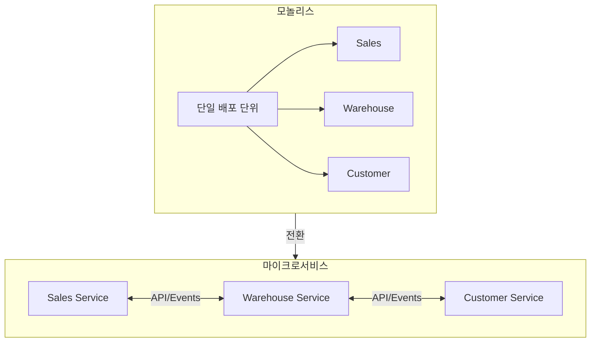
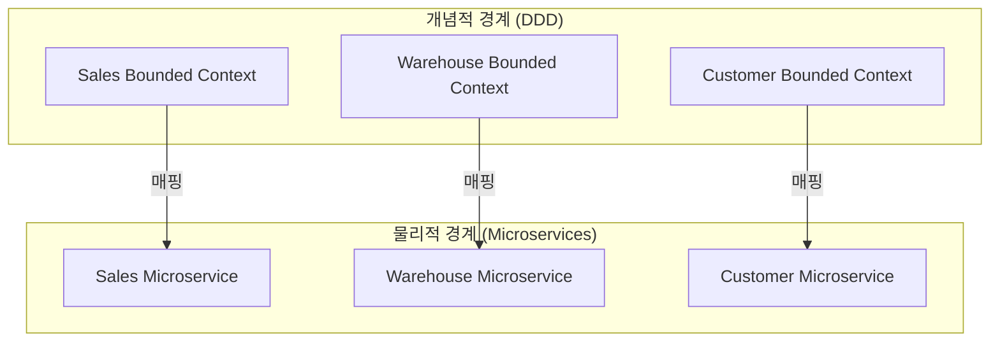
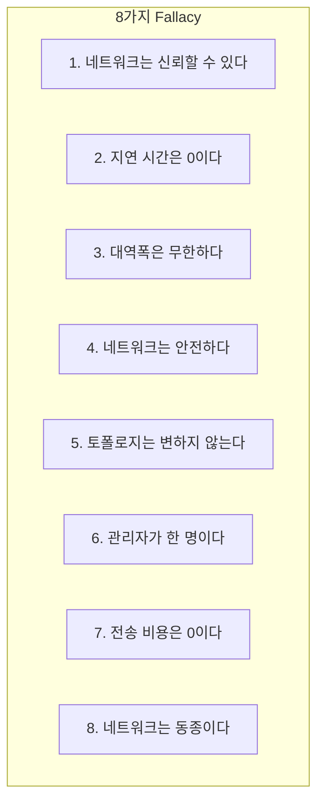
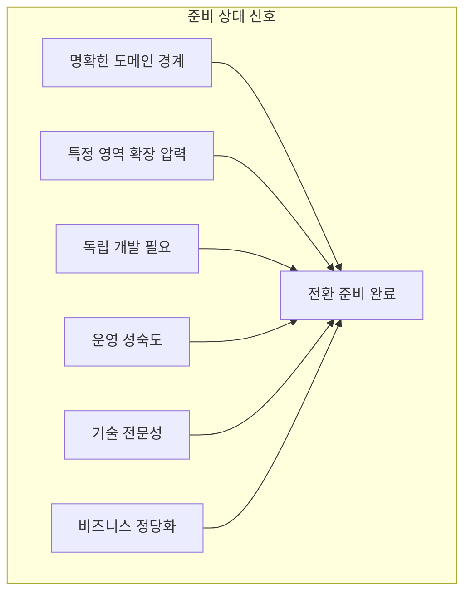
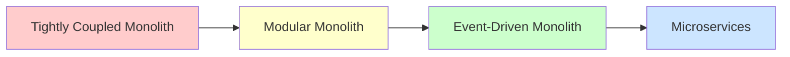
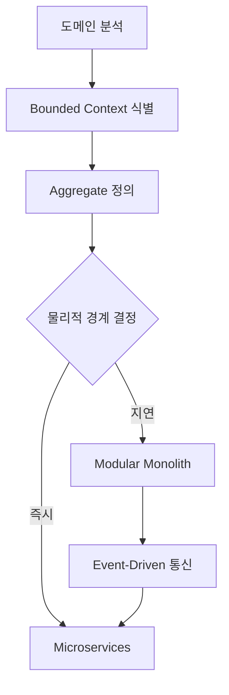

# Chapter 10: When and Why You Should Transition to Microservices (마이크로서비스로의 전환 시점과 이유)

## 핵심 요약

> **"마이크로서비스 전환은 트렌드가 아닌 비즈니스 필요에 의해 결정되어야 한다. Bounded Context는 자연스러운 마이크로서비스 경계가 되며, Modular Monolith는 전환을 위한 최적의 기반이다. Mediator 패턴에서 Event-Driven 통신으로 점진적으로 전환하고, 분산 시스템의 8가지 Fallacy를 인식하여 대비해야 한다."**

이 챕터에서는 모놀리스에서 마이크로서비스로의 전환 시점, 이유, 그리고 전략을 학습한다.

---

## 학습 목표

이 챕터를 완료하면 다음을 할 수 있다:

- [ ] 모놀리스 vs 마이크로서비스 아키텍처 특성 비교
- [ ] Bounded Context와 마이크로서비스의 관계 이해
- [ ] 마이크로서비스 전환 준비 상태 평가
- [ ] 분산 시스템의 Fallacy(오류) 인식
- [ ] Mediator에서 Event-Driven으로의 점진적 전환
- [ ] 마이크로서비스 전환의 비용-이점 분석

---

## 본문 정리

### 10.1 마이크로서비스 아키텍처 개요



**마이크로서비스의 핵심 이점**:
- **개선된 확장성**: 각 서비스를 독립적으로 스케일링
- **향상된 복원력**: 한 서비스의 실패가 전체 시스템에 영향 주지 않음
- **빠른 개발 주기**: 팀이 독립적으로 개발, 배포, 반복

---

### 10.2 모놀리스 vs 마이크로서비스 비교

| 측면 | 모놀리스 | 마이크로서비스 |
|------|----------|----------------|
| **개발** | 단일 코드베이스, 초기 개발 단순 | 팀 독립 개발, 빠른 반복 |
| **배포** | 단일 배포 단위, 전체 재배포 필요 | 서비스별 독립 배포 |
| **확장성** | 수직 확장 (Vertical Scaling) | 수평 확장 (Horizontal Scaling) |
| **복원력** | 한 컴포넌트 실패 → 전체 다운 | 실패가 개별 서비스에 격리 |
| **복잡도** | 초기 설계/관리 단순 | 높은 운영 복잡도 |
| **팀 자율성** | 긴밀한 조율 필요, 병목 발생 | 팀별 독립 작업 가능 |
| **기술 유연성** | 단일 기술 스택 | 서비스별 최적 기술 선택 |
| **성능** | 네트워크 오버헤드 없음 | 서비스 간 네트워크 지연 |
| **유지보수** | 코드베이스 성장 시 어려움 | 작고 집중된 코드베이스 |
| **초기 비용** | 낮은 초기 비용 | 도구/인프라 투자 필요 |

---

### 10.3 DDD와 마이크로서비스의 관계

#### Bounded Context = 마이크로서비스 경계



**핵심 원칙**:
> **하나의 마이크로서비스에 여러 Bounded Context를 포함할 수 있지만, 하나의 Bounded Context를 여러 마이크로서비스로 분할해서는 안 된다!**

| 경계 유형 | 정의 | 목적 |
|-----------|------|------|
| **Bounded Context** | 의미적 경계 (Semantic Boundary) | 개념적 명확성, 도메인 언어 일관성 |
| **Microservice** | 물리적 경계 (Physical Boundary) | 배포/운영 독립성 |

#### Martin Fowler의 마이크로서비스 특성과 DDD 정렬

| 마이크로서비스 특성 | DDD 연결 |
|---------------------|----------|
| **비즈니스 역량 중심 조직** | Ubiquitous Language - 특정 비즈니스 문제를 위한 수직적 언어 |
| **분산된 거버넌스** | 비즈니스 목적에 맞는 모델 - 모든 문제에 하나의 기술이 아님 |
| **분산된 데이터 관리** | Bounded Context 내 Private Persistence - 언어 일관성 유지 |
| **진화적 설계** | Whirlpool 접근법 - 도메인 지식과 함께 시스템 성장 |

---

### 10.4 분산 시스템의 Fallacy (오류)

#### 8가지 분산 컴퓨팅 Fallacy (1994-1997)



| Fallacy | 잘못된 가정 | 현실 |
|---------|-------------|------|
| **네트워크 신뢰성** | 네트워크는 항상 작동 | 실패와 중단 발생 |
| **지연 시간 0** | 메시지가 즉시 도착 | 네트워크 지연 존재 |
| **무한 대역폭** | 무제한 네트워크 용량 | 혼잡, 속도 제한 존재 |
| **네트워크 보안** | 네트워크는 본질적으로 안전 | 취약점과 위협 존재 |
| **고정 토폴로지** | 네트워크 구조 불변 | 노드 추가/제거 발생 |
| **단일 관리자** | 하나의 권한이 관리 | 분산된 소유권 |
| **전송 비용 0** | 데이터 전송 무비용 | 대역폭, 지연 비용 존재 |
| **동종 네트워크** | 모든 시스템 동일 | HW/SW 차이 존재 |

#### Udi Dahan의 추가 Fallacy (현대)

| Fallacy | 설명 |
|---------|------|
| **시스템은 일관적이다** | 모든 노드가 동시에 같은 데이터를 볼 것이라 가정 → 실제로는 Eventual Consistency |
| **시스템은 예측 가능하다** | 모든 조건에서 예측 가능한 동작 가정 → 부하, 실패, 지연에 따라 변동 |

#### 추가 현대 Fallacy

| Fallacy | 설명 |
|---------|------|
| **시스템은 무한 리소스** | CPU, 메모리, 스토리지 무제한 가정 |
| **확장은 쉽다** | 수평/수직 확장이 원활하다 가정 |
| **실패는 드물다** | HW/SW/네트워크 실패가 드물다 가정 |
| **시간은 일관적이다** | 분산 시스템 간 시계 동기화 가정 |

---

### 10.5 마이크로서비스 전환 준비 상태 평가

#### 준비 상태 신호



| 신호 | 설명 |
|------|------|
| **명확한 도메인 경계** | DDD 원칙에 기반한 도메인/서브도메인 정의 완료 |
| **확장 압력** | 시스템 특정 부분에 수요 집중, 다른 부분은 아님 |
| **독립 개발 필요** | 모놀리스 코드베이스의 상호의존성으로 팀이 차단됨 |
| **운영 성숙도** | CI/CD, 모니터링, 자동화 테스트 투자 완료 |
| **기술 전문성** | Eventual Consistency, 네트워크 지연, 서비스 실패 처리 능력 |
| **비즈니스 정당화** | 트렌드가 아닌 측정 가능한 비즈니스 필요에 의한 결정 |

---

### 10.6 Modular Monolith가 기반인 이유



| 단계 | 설명 | 이점 |
|------|------|------|
| **Modular Monolith** | 단일 배포 단위 내 명확한 경계 | 전환 용이, 테스트/배포 단순화 |
| **Event-Driven** | Mediator → Event 기반 통신 | 느슨한 결합, 서비스 추출 용이 |
| **Microservices** | 독립 배포 가능한 서비스 | 확장성, 자율성, 복원력 |

#### Mediator 패턴의 한계

```csharp
// Mediator 패턴 - 중앙 집중식 의존성
public class BrewUpMediator : IBrewUpMediator
{
    private readonly ISalesFacade _salesFacade;
    private readonly IWarehousesFacade _warehouseFacade;

    public async Task<string> CreateOrderAsync(SalesOrderJson body, CancellationToken ct)
    {
        // Warehouse에서 가용성 확인
        foreach (var row in body.Rows)
        {
            var availability = await _warehouseFacade.GetAvailabilityAsync(row.BeerId, ct);
            // ...
        }
        // Sales에 주문 생성
        return await _salesFacade.CreateOrderAsync(body, ct);
    }
}
```

**문제점**:
- 모든 모듈이 Mediator에 의존 → 중앙 집중 의존성
- 서비스 추출 시 상당한 코드 재작성 필요

#### Event-Driven 통신으로 전환

```csharp
// Warehouse Context - Integration Event 발행
public class AvailabilityUpdatedForIntegrationEventHandler
    : DomainEventHandlerBase<AvailabilityUpdatedDueToProductionOrder>
{
    public override async Task HandleAsync(
        AvailabilityUpdatedDueToProductionOrder @event,
        CancellationToken ct)
    {
        var integrationEvent = new AvailabilityUpdatedForNotification(
            @event.BeerId, correlationId, @event.BeerName, @event.Quantity);

        await _eventBus.PublishAsync(integrationEvent, ct);
    }
}

// Sales Context ACL - Integration Event 수신
public class AvailabilityUpdatedForNotificationEventHandler
    : IntegrationEventHandlerAsync<AvailabilityUpdatedForNotification>
{
    public override async Task HandleAsync(
        AvailabilityUpdatedForNotification @event,
        CancellationToken ct)
    {
        var command = new UpdateAvailabilityDueToWarehousesNotification(
            @event.BeerId, correlationId, @event.BeerName, @event.Quantity);

        await _serviceBus.SendAsync(command, ct);
    }
}
```

**이점**:
- 느슨한 결합: 모듈 간 직접 의존성 없음
- 확장성: 비동기 통신으로 높은 처리량
- 서비스 추출 용이: 동일한 메시징 인프라 재사용

---

### 10.7 아키텍처 특성 비교

| 특성 | Modular Architecture | Microservices Architecture |
|------|---------------------|---------------------------|
| **파티션 유형** | 기술적 (Technical) | 도메인 (Domain) |
| **Quantum 수** | 1개 | 1개 ~ 다수 |
| **배포성** | ⭐⭐⭐ | ⭐⭐⭐⭐ |
| **탄력성** | ⭐ | ⭐⭐⭐⭐⭐ |
| **진화성** | ⭐⭐⭐ | ⭐⭐⭐⭐⭐ |
| **장애 허용** | ⭐ | ⭐⭐⭐⭐ |
| **모듈성** | ⭐⭐⭐ | ⭐⭐⭐⭐⭐ |
| **전체 비용** | ⭐⭐⭐⭐⭐ | ⭐ |
| **성능** | ⭐⭐⭐ | ⭐⭐ |
| **신뢰성** | ⭐⭐⭐ | ⭐⭐⭐⭐ |
| **확장성** | ⭐ | ⭐⭐⭐⭐⭐ |
| **단순성** | ⭐⭐⭐⭐ | ⭐ |
| **테스트성** | ⭐⭐⭐ | ⭐⭐⭐⭐ |

---

### 10.8 전환 전략 요약



**단계별 접근**:
1. **도메인 분석**: 가장 중요한 첫 단계
2. **Bounded Context 식별**: 명확한 경계 정의
3. **Modular Monolith 구축**: Mediator 패턴으로 시작
4. **Event-Driven 전환**: Mediator → Event 기반 통신
5. **마이크로서비스 추출**: 독립 솔루션으로 분리

---

## 실무 적용 포인트

### 전환 결정 체크리스트

```
□ 전환 전 확인
  ├── 명확한 도메인 경계가 정의되어 있는가?
  ├── 특정 영역에 확장 압력이 있는가?
  ├── 팀이 모놀리스 의존성으로 차단되고 있는가?
  ├── DevOps 성숙도 (CI/CD, 모니터링, 자동화 테스트)?
  └── 분산 시스템 설계 전문성이 있는가?

□ 기술적 준비
  ├── Modular Monolith로 리팩토링 완료
  ├── Event-Driven 통신 구현
  ├── Fitness Functions로 경계 검증
  └── 통합 테스트 자동화

□ 조직적 준비
  ├── 팀 자율성 지원 구조
  ├── 분산 시스템 운영 역량
  └── 비즈니스 정당화 (트렌드가 아닌 필요)
```

### 도메인 관심사 → 아키텍처 특성 매핑

| 도메인 관심사 | 필요한 아키텍처 특성 |
|---------------|---------------------|
| **인수합병** | 상호운용성, 확장성, 적응성, 확장성 |
| **출시 시간 단축** | 민첩성, 테스트성, 배포성 |
| **사용자 만족** | 성능, 가용성, 장애 허용, 보안 |
| **경쟁 우위** | 민첩성, 확장성, 가용성, 장애 허용 |
| **시간 및 예산** | 단순성, 실현 가능성 |

### 왜 전환해야 하는가? (소프트웨어 아키텍처 제2법칙)

> **"How보다 Why가 더 중요하다."**

**전환하지 말아야 할 이유**:
- 트렌드를 따르기 위해
- 이력서에 추가하기 위해
- 기술적 흥미 때문에

**전환해야 할 이유**:
- 특정 서비스의 독립적 확장 필요
- 팀 자율성과 빠른 배포 주기 필요
- 장애 격리와 시스템 복원력 필요
- 측정 가능한 비즈니스 가치

---

## 핵심 개념 체크리스트

- [ ] 모놀리스 vs 마이크로서비스의 10가지 비교 측면 이해
- [ ] Bounded Context = 의미적 경계, Microservice = 물리적 경계
- [ ] "BC를 여러 MS로 분할하지 말 것" 원칙
- [ ] 분산 컴퓨팅 8가지 Fallacy + Udi Dahan 2가지 추가
- [ ] 마이크로서비스 전환 준비 상태 6가지 신호
- [ ] Modular Monolith → Event-Driven → Microservices 점진적 경로
- [ ] Mediator 패턴의 한계와 Event-Driven 통신의 이점
- [ ] 도메인 관심사를 아키텍처 특성으로 매핑

---

## 참고 자료

- Martin Fowler & James Lewis, "Microservices" (2014): https://martinfowler.com/articles/microservices.html
- Mark Richards & Neil Ford, "Fundamentals of Software Architecture" (2020)
- L. Peter Deutsch, "Fallacies of Distributed Computing" (1994)
- Melvin Conway, "Conway's Law" (1968): https://martinfowler.com/bliki/ConwaysLaw.html
- Fred Brooks, "No Silver Bullet" (1986)

---

## 다음 챕터 미리보기

- **Chapter 11**: Dealing with Events and Their Evolution - 이벤트 소싱 시스템에서 이벤트 버전 관리
