# Chapter 11: Dealing with Events and Their Evolution (이벤트와 그 진화 다루기)

## 📌 핵심 요약

> **"이벤트 소싱 시스템에서 이벤트는 불변(Immutable)이지만, 비즈니스 요구사항은 변한다. Simple Versioning, Upcasting, Weak Schema, Content Negotiation, Copy-Replace 등의 전략을 통해 이벤트 진화를 효과적으로 관리하고, 시스템의 장기적 유지보수성을 확보해야 한다."**

이 챕터에서는 이벤트 소싱 시스템에서 이벤트 버전 관리 전략과 진화 패턴을 학습한다.

---

## 🎯 학습 목표

이 챕터를 완료하면 다음을 할 수 있다:

- [ ] CQRS와 Event Sourcing의 핵심 개념과 차이점 이해
- [ ] Event Sourcing과 Event Streaming의 구분
- [ ] Simple Event Versioning 기법 구현
- [ ] Upcasting을 통한 이벤트 변환 처리
- [ ] Weak Schema를 활용한 유연한 이벤트 구조
- [ ] Content Negotiation으로 생산자-소비자 협상
- [ ] Copy-Replace 전략의 적용 시점 판단

---

## 📖 본문 정리

### 11.1 CQRS, Event Sourcing, Event Streaming

#### CQRS (Command Query Responsibility Segregation)

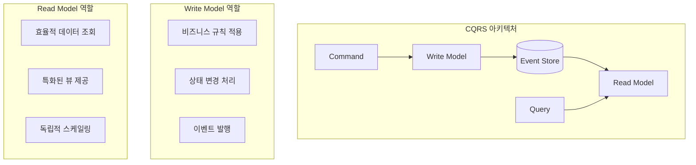

| 구분 | Command | Query |
|------|---------|-------|
| **목적** | 상태 변경 | 데이터 조회 |
| **예시** | CreateSalesOrder | GetSalesOrders |
| **특징** | 비즈니스 규칙 적용 | 효율적 반환 최적화 |
| **스케일링** | 쓰기 부하에 맞춤 | 읽기 부하에 맞춤 |

#### Event Sourcing vs Event Streaming

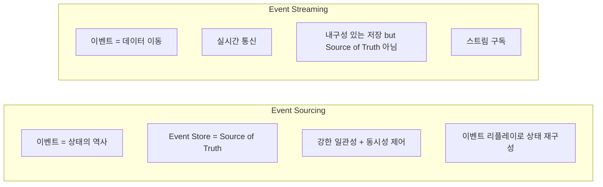

| 특성 | Event Sourcing | Event Streaming |
|------|---------------|-----------------|
| **목적** | 상태 재구성의 원천 | 시스템 간 데이터 이동 |
| **저장소 역할** | Source of Truth | 내결함성을 위한 저장 |
| **일관성** | 강한 일관성, 동시성 보장 | 일관성 보장 없음 |
| **이벤트 읽기** | 전체 이벤트 직접 읽기 | 스트림 구독 |
| **전역 순서** | 보장됨 | 보장 안됨 |

#### Event Sourcing 워크플로우

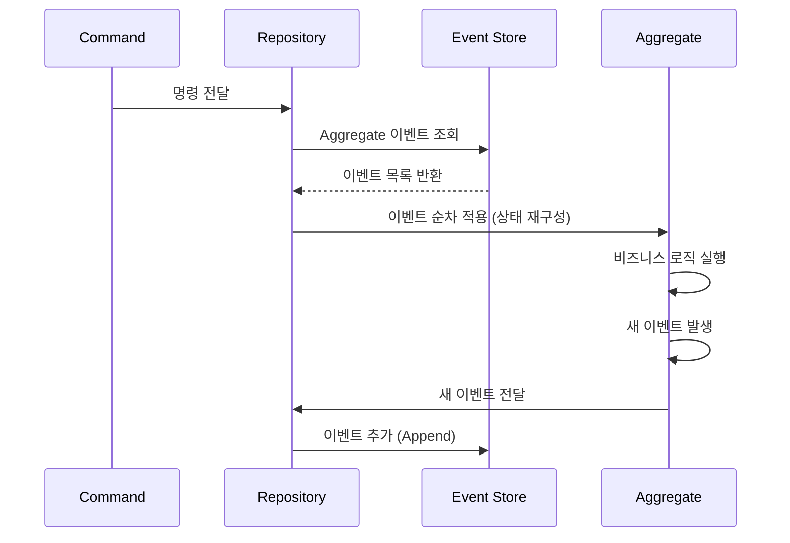

---

### 11.2 이벤트 수명: 진화가 중요한 이유

#### 이벤트 불변성의 원칙

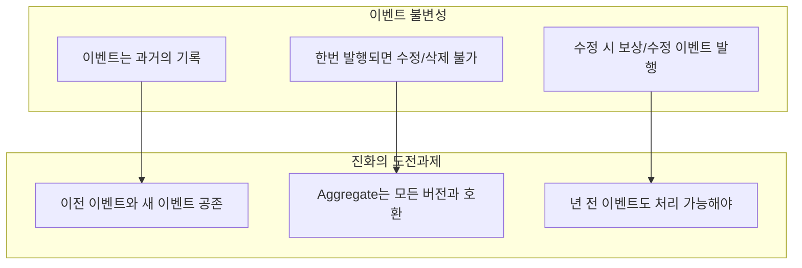

#### 버전 관리 vs 새 이벤트

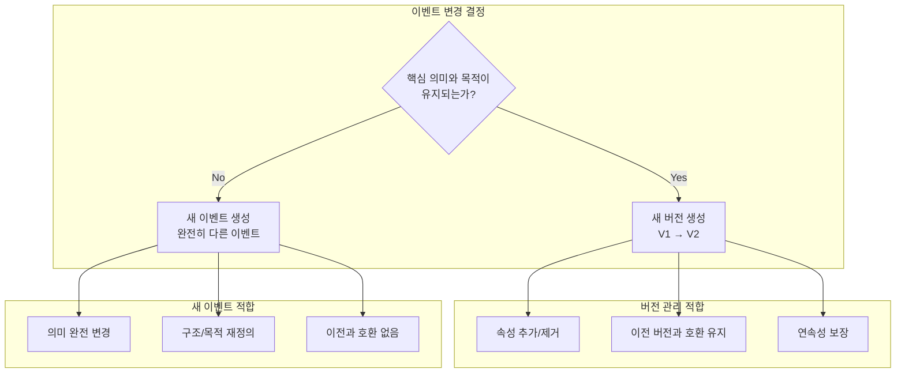

**Greg Young의 원칙:**
> "새 버전의 이벤트는 이전 버전에서 변환 가능해야 한다. 그렇지 않다면, 그것은 새 버전이 아니라 새 이벤트다."

---

### 11.3 CQRS+ES 도입: 기술적/문화적 도전

#### 선택적 적용 전략

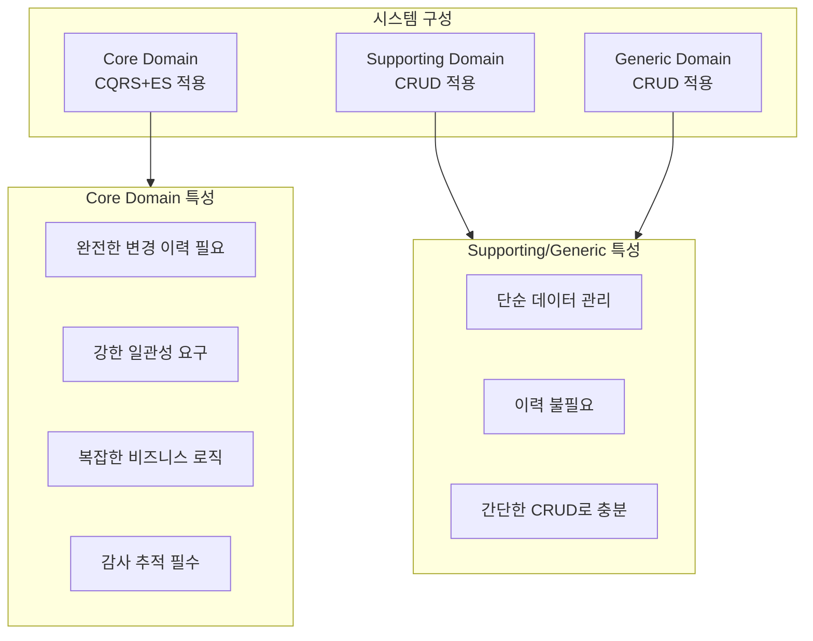

#### 팀 상황별 3가지 시나리오

| 시나리오 | 상황 | 대응 |
|----------|------|------|
| **1. 성공하는 팀** | 현재 아키텍처로 잘 운영 중 | 변경 불필요 |
| **2. 개선 필요 팀** | 문제 인식하지만 동기 부족 | 문화적 변화 필요, 학습 문화 조성 |
| **3. 변화 시도 팀** | 변화 의지 있으나 경험 부족 | 멘토링, 프로토타이핑, 안전한 실험 환경 |

**핵심 원칙: Start Simple - Grow Big**

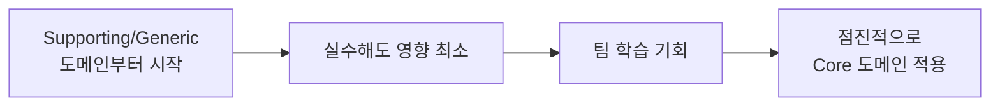

---

### 11.4 이벤트 버전 관리 전략

#### 전략 1: Simple Event Versioning

**기본 이벤트 (V1)**
```csharp
public sealed class SalesOrderCreated(
    SalesOrderId aggregateId, Guid commitId,
    SalesOrderNumber salesOrderNumber,
    OrderDate orderDate, CustomerId customerId,
    CustomerName customerName,
    IEnumerable<SalesOrderRowDto> rows)
    : DomainEvent(aggregateId, commitId)
{
    public readonly SalesOrderId SalesOrderId = aggregateId;
    public readonly SalesOrderNumber SalesOrderNumber = salesOrderNumber;
    public readonly OrderDate OrderDate = orderDate;
    public readonly CustomerId CustomerId = customerId;
    public readonly CustomerName CustomerName = customerName;
    public readonly IEnumerable<SalesOrderRowDto> Rows = rows;
}
```

**새 버전 이벤트 (V2) - IsReseller 속성 추가**
```csharp
public sealed class SalesOrderCreated_V2(
    SalesOrderId aggregateId, Guid commitId,
    SalesOrderNumber salesOrderNumber,
    OrderDate orderDate, CustomerId customerId,
    CustomerName customerName,
    IEnumerable<SalesOrderRowDto> rows,
    bool isReseller)  // 새 속성 추가
    : DomainEvent(aggregateId, commitId)
{
    // ... 기존 속성들
    public readonly bool IsReseller = isReseller;
}
```

**Aggregate에서 두 버전 모두 처리**
```csharp
// V1 이벤트 처리 - 기본값 적용
private void Apply(SalesOrderCreated @event)
{
    Id = @event.SalesOrderId;
    _salesOrderNumber = @event.SalesOrderNumber;
    _orderDate = @event.OrderDate;
    _customerId = @event.CustomerId;
    _customerName = @event.CustomerName;
    _rows = @event.Rows.MapToDomainRows();
    _isReseller = false; // V1에 없는 속성은 기본값
}

// V2 이벤트 처리
private void Apply(SalesOrderCreated_V2 @event)
{
    Id = @event.SalesOrderId;
    _salesOrderNumber = @event.SalesOrderNumber;
    _orderDate = @event.OrderDate;
    _customerId = @event.CustomerId;
    _customerName = @event.CustomerName;
    _rows = @event.Rows.MapToDomainRows();
    _isReseller = @event.IsReseller; // 실제 값 사용
}
```

**장단점:**

| 장점 | 단점 |
|------|------|
| 구현이 단순함 | Apply 메서드 급증 (V19까지 가면?) |
| 명시적 버전 관리 | 코드 가독성 저하 |
| 이해하기 쉬움 | 유지보수 어려움 |

---

#### 전략 2: Upcasting

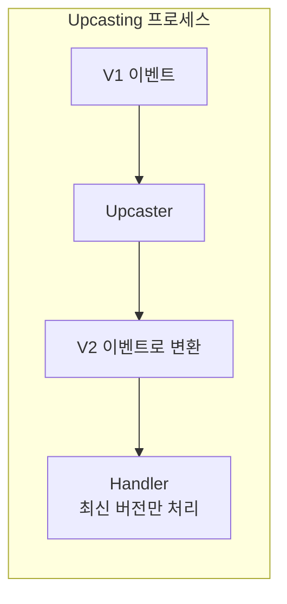

**Upcaster 구현**
```csharp
public class EventUpcaster
{
    public DomainEvent Upcast(DomainEvent oldEvent)
    {
        return oldEvent switch
        {
            SalesOrderCreated v1 => new SalesOrderCreated_V2
            {
                Id = v1.Id,
                SalesOrderNumber = v1.SalesOrderNumber,
                OrderDate = v1.OrderDate,
                CustomerId = v1.CustomerId,
                CustomerName = v1.CustomerName,
                Rows = v1.Rows,
                IsReseller = false // 새 필드 기본값
            },
            _ => throw new NotSupportedException(
                $"Unknown event type: {oldEvent.EventType}")
        };
    }
}
```

**EventProcessor에서 활용**
```csharp
public class EventProcessor
{
    private readonly EventUpcaster _upcaster = new();

    public void ProcessEvent(IEvent evt)
    {
        // 필요시 최신 버전으로 변환
        var upcastedEvent = evt.Version < 2
            ? _upcaster.Upcast(evt)
            : evt;

        // 최신 버전 핸들러만 유지
        Handle((SalesOrderCreated_V2)upcastedEvent);
    }

    private void Handle(SalesOrderCreated_V2 evt)
    {
        Console.WriteLine($"Processing: {evt.Id}");
        // 이벤트 처리...
    }
}
```

**장단점:**

| 장점 | 단점 |
|------|------|
| 핸들러 단순화 (최신 버전만) | 분산 시스템에서 복잡성 |
| Aggregate 코드 깔끔 | 동시 배포 시 버전 불일치 |
| 중앙집중 변환 로직 | 테스트 복잡도 증가 |

---

#### 전략 3: Weak Schema

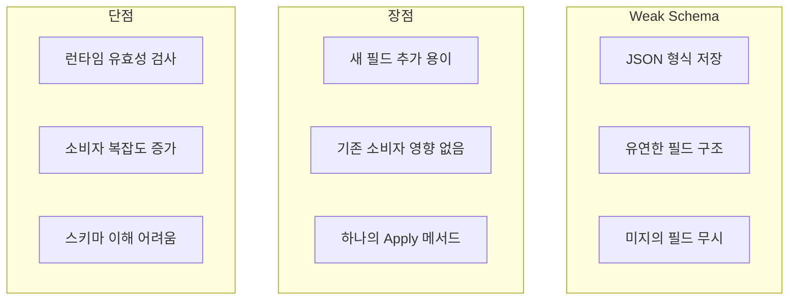

**JSON 이벤트 예시**
```json
{
    "id": 10,
    "salesOrderNumber": "2025.12",
    "orderDate": "2025-01-09",
    "customerId": 12345,
    "customerName": "John Doe",
    "rows": [{"row-1"}, {"row-2"}],
    "isReseller": false,
    "version": 2
}
```

**Best Practice:**
- 메타데이터에 버전 식별자 포함
- 누락된 필드에 기본값 처리
- 예상치 못한 필드는 무시

---

#### 전략 4: Content Negotiation

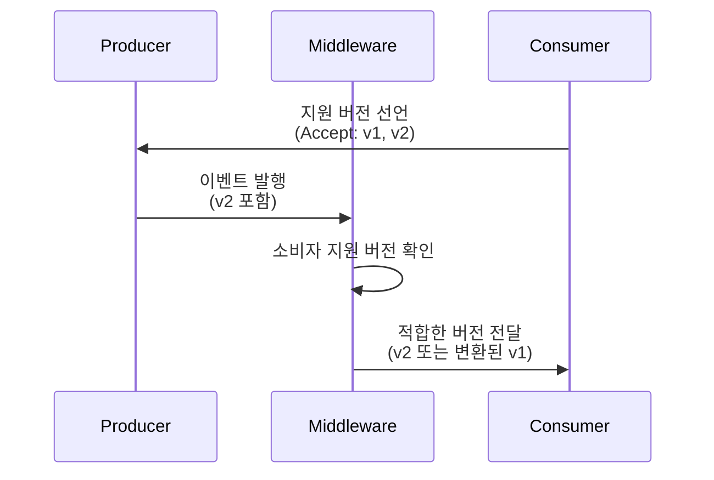

**Atom Feed를 활용한 구현**
```xml
<feed xmlns="http://www.w3.org/2005/Atom">
  <title>SalesOrder events</title>
  <updated>2025-01-09T12:00:00Z</updated>

  <!-- V1 이벤트 -->
  <entry>
    <id>urn:uuid:1234-5678-91011</id>
    <title>SalesOrderCreated</title>
    <content type="application/vnd.brewup.event.salesorder+json;version=1">
      {
        "id": 10,
        "salesOrderNumber": "2025.12",
        "orderDate": "2025-01-09",
        "customerId": 12345,
        "customerName": "John Doe",
        "rows": [{"row-1"}, {"row-2"}]
      }
    </content>
    <link rel="schema"
          href="https://schemas.brewup.com/salesorder/v1.json"/>
  </entry>

  <!-- V2 이벤트 -->
  <entry>
    <id>urn:uuid:1234-5678-91012</id>
    <title>SalesOrderCreated</title>
    <content type="application/vnd.brewup.event.salesorder+json;version=2">
      {
        "id": 10,
        "salesOrderNumber": "2025.12",
        "orderDate": "2025-01-09",
        "customerId": 12345,
        "customerName": "John Doe",
        "rows": [{"row-1"}, {"row-2"}],
        "isReseller": false
      }
    </content>
    <link rel="schema"
          href="https://schemas.brewup.com/salesorder/v2.json"/>
  </entry>
</feed>
```

**장점:**
- 이전 소비자도 이해하는 버전 처리
- 스키마 불일치 위험 감소
- 독립적 스키마 진화
- 이벤트 목록 불변 → 캐싱 가능

---

#### 전략 5: Copy-Replace (Nuclear Option)

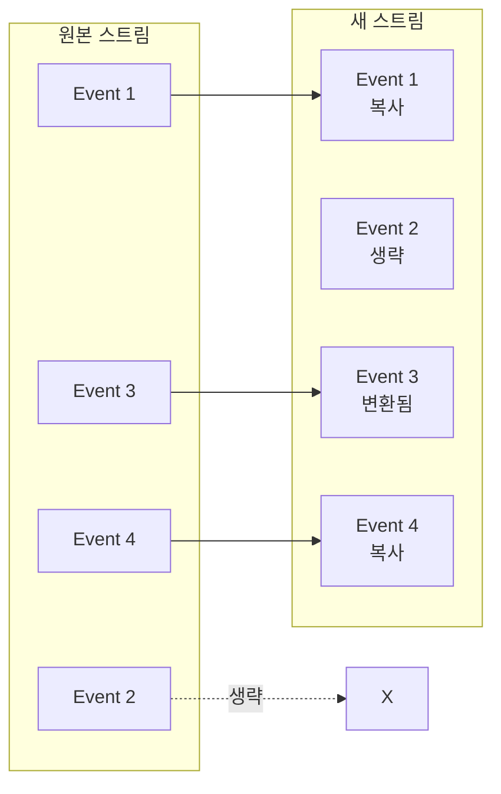

**Greg Young의 표현:**
> "버전 관리의 핵 옵션 (Nuclear Option)"

**고려사항:**

| 문제 | 해결책 |
|------|--------|
| 라이브 시스템에서 적용 | 시스템 다운타임 필요 |
| 이벤트/스트림 ID 변경 | 이전 ID와 새 ID 함께 저장 |
| 대용량 이벤트 (90GB) | 8시간+ 다운타임 감수 |
| 덜 침습적 대안 | Truncate Before 사용 (EventStoreDB 지원) |

**Truncate Before 활용:**
```
용도: 특정 이벤트 이전의 모든 이벤트 삭제
예시: 연말 고객 잔액 스냅샷 생성 후 이전 이벤트 삭제
장점: 새 스트림 복사 없이 포인터만 이동
```

---

### 11.5 전략 비교 매트릭스

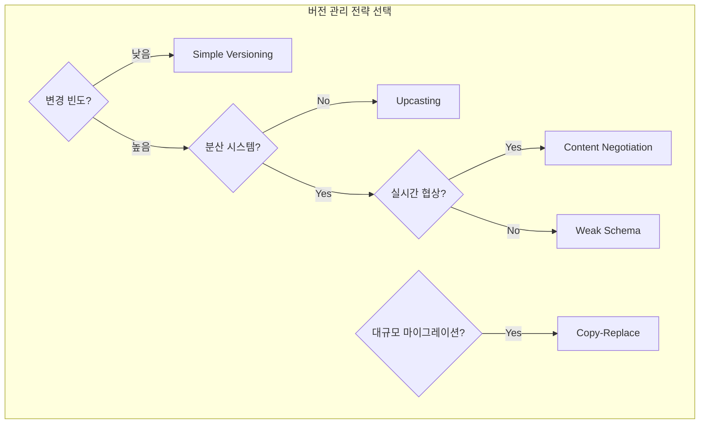

| 전략 | 복잡도 | 적합한 상황 | 주의점 |
|------|--------|------------|--------|
| **Simple Versioning** | 낮음 | 버전 변경 적음 | Apply 메서드 증가 |
| **Upcasting** | 중간 | 단일 서비스 | 분산 시스템 복잡 |
| **Weak Schema** | 중간 | 유연성 필요 | 런타임 검증 필요 |
| **Content Negotiation** | 높음 | 다양한 소비자 | 인프라 복잡 |
| **Copy-Replace** | 매우 높음 | 대규모 재구성 | 다운타임 필수 |

---

## 💡 실무 적용 포인트

### 이벤트 버전 관리 체크리스트

```
□ 이벤트 설계 원칙
  ├── 이벤트는 불변 (수정 시 보상 이벤트)
  ├── 메타데이터에 버전 포함
  ├── 변환 가능 여부로 버전 vs 새 이벤트 결정
  └── 모든 이전 버전 호환 유지

□ 전략 선택 기준
  ├── 팀 경험 수준
  ├── 시스템 분산 정도
  ├── 예상 변경 빈도
  └── 허용 가능한 복잡도

□ 테스트 필수 항목
  ├── 전체 이벤트 스트림 리플레이
  ├── Upcaster 정확성 검증
  ├── 기본값 처리 로직
  └── 소비자 호환성
```

### CQRS+ES 도입 결정 프레임워크

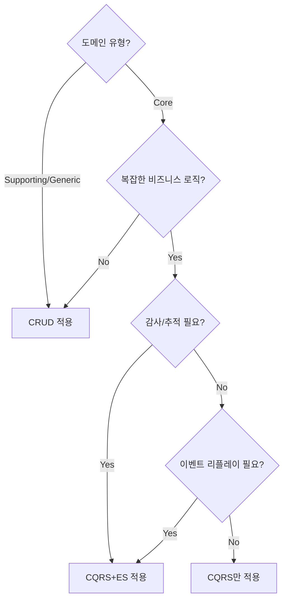

### 핵심 질문

> **"전체 이벤트 스트림을 처음부터 리플레이해야 한다면 어떻게 될까?"**
>
> 언젠가는 반드시 필요하게 된다. 그때 가정이 틀렸다는 것을 깨닫기엔 이미 늦다.

---

## ✅ 핵심 개념 체크리스트

- [ ] CQRS: Command와 Query의 책임 분리
- [ ] Event Sourcing: 상태를 이벤트 시퀀스로 저장
- [ ] Event Streaming ≠ Event Sourcing 구분
- [ ] 이벤트 불변성과 보상 이벤트 패턴
- [ ] 버전 관리 vs 새 이벤트 생성 결정 기준
- [ ] Simple Versioning: 버전별 Apply 메서드
- [ ] Upcasting: 이전 버전을 최신으로 변환
- [ ] Weak Schema: JSON 유연한 구조
- [ ] Content Negotiation: 생산자-소비자 협상
- [ ] Copy-Replace: 대규모 마이그레이션 전략
- [ ] Truncate Before: 스냅샷 기반 정리

---

## 🔗 참고 자료

- [Greg Young - Versioning in an Event Sourced System](https://leanpub.com/esversioning/read)
- [GitHub: Domain-driven-Refactoring (03-monolith_with_cqrs_and_event_sourcing branch)](https://github.com/PacktPublishing/Domain-driven-Refactoring/tree/03-monolith_with_cqrs_and_event_sourcing)
- [Atom Syndication Format](https://www.w3.org/2005/Atom)

---

## 📚 다음 챕터 미리보기

- **Chapter 12**: Orchestrating Complexity - Saga와 Process Manager를 통한 분산 워크플로우 관리
