# Chapter 12: Orchestrating Complexity (복잡성 오케스트레이션)

## 📌 핵심 요약

> **"분산 시스템에서 비즈니스 프로세스를 관리하려면 2PC의 한계를 인식하고, Saga 패턴을 통해 Choreography(탈중앙화 이벤트 기반)와 Orchestration(중앙 조정자 기반) 중 적합한 방식을 선택해야 한다. 보상 트랜잭션, Durable Execution, Event-Sourced Saga를 통해 장애 복구와 일관성을 확보한다."**

이 챕터에서는 분산 환경에서 비즈니스 프로세스를 오케스트레이션하는 고급 기법을 학습한다.

---

## 🎯 학습 목표

이 챕터를 완료하면 다음을 할 수 있다:

- [ ] 2PC의 한계와 대안적 트랜잭션 패턴의 필요성 이해
- [ ] Choreography와 Orchestration의 차이점과 적용 시점 판단
- [ ] Saga 패턴의 8가지 유형 (Ford & Richards 매트릭스)
- [ ] 보상 트랜잭션으로 장애 처리 및 일관성 유지
- [ ] Process Manager와 Saga의 구분
- [ ] Durable Execution과 Event-Sourced Saga 설계

---

## 📖 본문 정리

### 12.1 분산 트랜잭션의 복잡성

#### 전통적인 접근: 단일 코드 → 분산 시스템

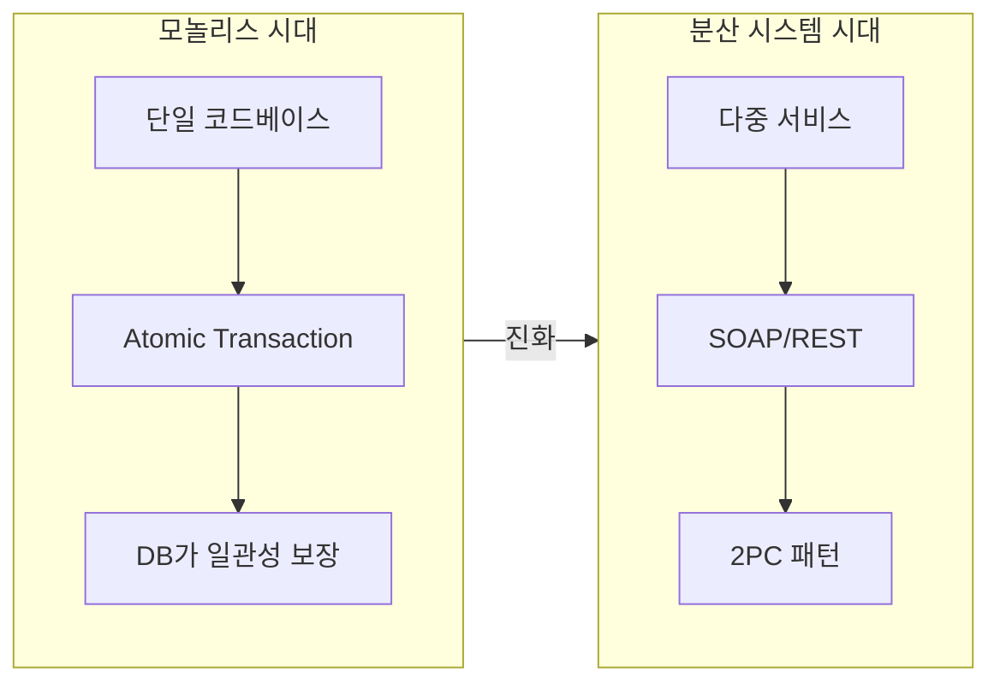

---

### 12.2 Two-Phase Commit (2PC)

#### 2PC 프로토콜

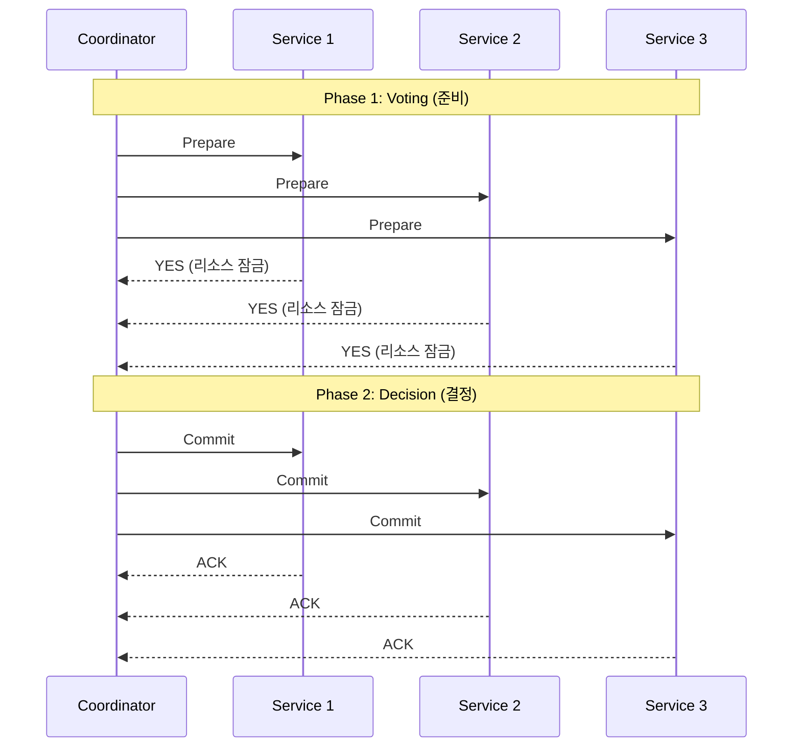

#### 2PC의 5가지 한계

| 문제점 | 설명 |
|--------|------|
| **Blocking** | 참여자가 Coordinator 결정 대기 중 리소스 잠금 유지 |
| **Single Point of Failure** | Coordinator 장애 시 전체 프로세스 중단 |
| **Fault Tolerance 부족** | 대규모 분산 환경에서 신뢰성 문제 |
| **Performance Overhead** | 다중 통신 라운드로 네트워크 지연 |
| **Scalability 문제** | 참여자 증가 시 실패 확률 증가 |

---

### 12.3 Saga 패턴

#### Saga의 핵심 개념

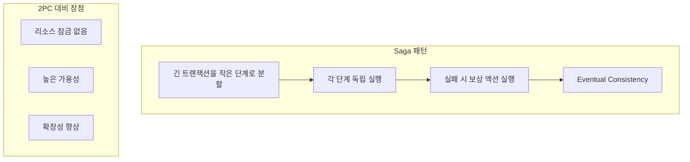

#### 3가지 주요 힘 (Three Forces)

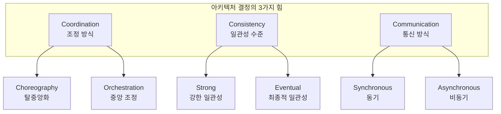

#### Ford & Richards의 Saga 매트릭스

| 패턴 이름 | 통신 | 일관성 | 조정 | 결합도 |
|-----------|------|--------|------|--------|
| **Epic Saga** | Sync | Atomic | Orchestrated | Very High |
| **Phone Tag Saga** | Sync | Atomic | Choreographed | High |
| **Fairy Tale Saga** | Sync | Eventual | Orchestrated | High |
| **Time Travel Saga** | Sync | Eventual | Choreographed | Medium |
| **Fantasy Fiction Saga** | Async | Atomic | Orchestrated | High |
| **Horror Story Saga** | Async | Atomic | Choreographed | Medium |
| **Parallel Saga** | Async | Eventual | Orchestrated | Low |
| **Anthology Saga** | Async | Eventual | Choreographed | Very Low |

---

### 12.4 Choreography (안무)

#### 이벤트 기반 탈중앙화 워크플로우

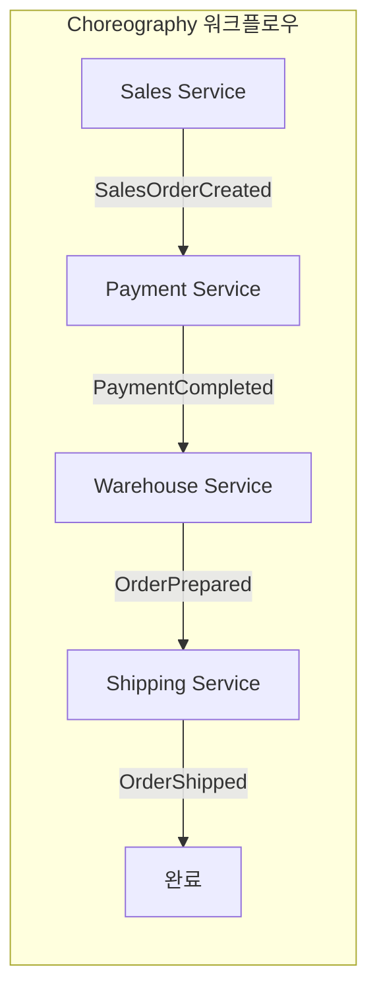

#### 실패 시 보상 흐름

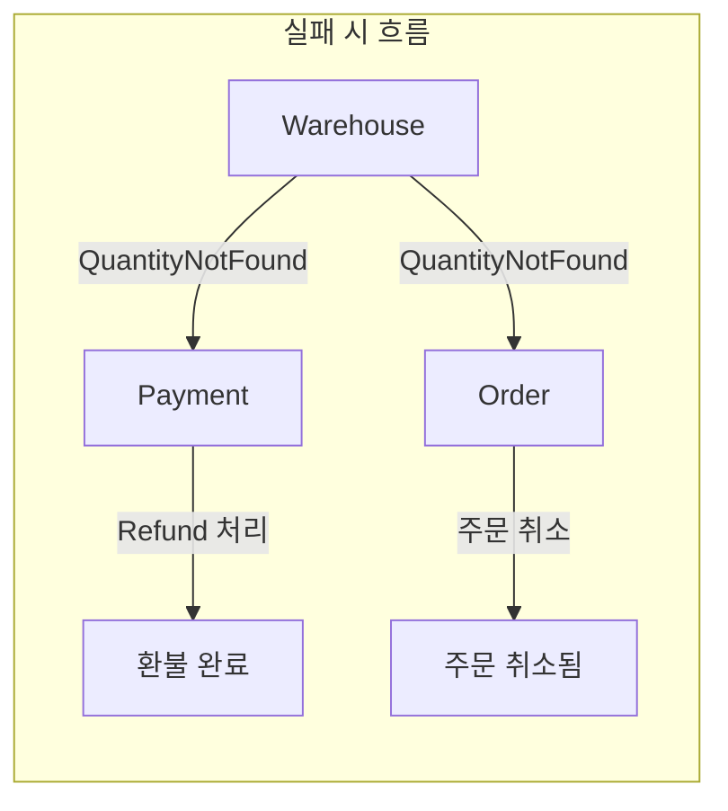

#### Choreography 장단점

| 장점 | 단점 |
|------|------|
| 느슨한 결합, 높은 독립성 | 전체 흐름 추적 어려움 |
| 확장성과 유연성 | 디버깅/모니터링 복잡 |
| 단일 실패 지점 없음 | 이벤트 미처리 시 연쇄 장애 |
| 새 서비스 추가 용이 | 서비스/실패 조건 증가 시 복잡도 급증 |

---

### 12.5 Orchestration (오케스트레이션)

#### 중앙 조정자 기반 워크플로우

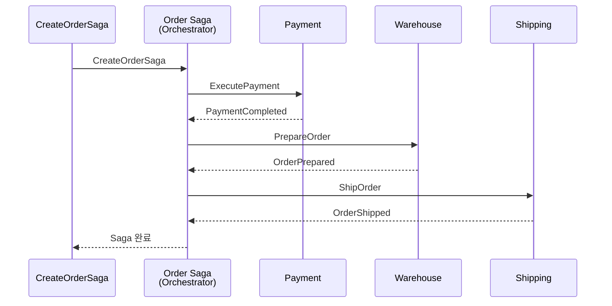

#### 실패 시 보상 흐름 (Orchestrated)

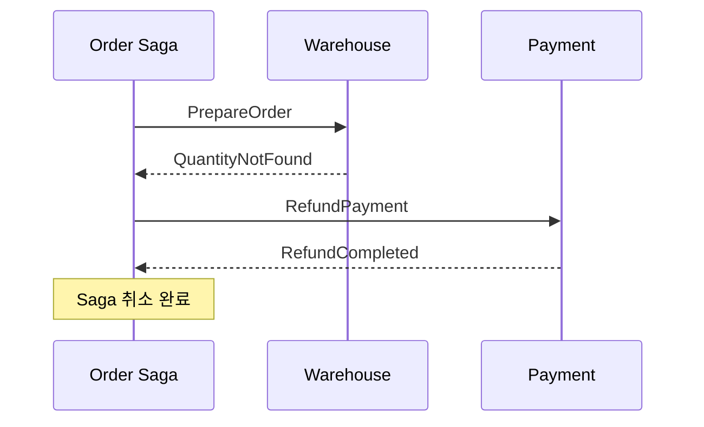

#### Orchestration 장단점

| 장점 | 단점 |
|------|------|
| 명확한 흐름 제어 | 긴밀한 결합 |
| 모니터링/추적 용이 | 단일 실패 지점 (Orchestrator) |
| 보상 처리 단순화 | 확장성 병목 가능 |
| 상태 머신처럼 테스트 가능 | 별도 영속 저장소 필요 |

#### 버전 관리 고려사항

> **예시**: 30년 주택담보대출 프로세스
> - 고객이 오늘 대출 시작 → 몇 년 후 은행 규칙 변경
> - 기존 프로세스는 변경 없이 유지
> - 새 규칙은 새 버전의 Orchestrator로 처리

---

### 12.6 Choreography vs Orchestration 선택 가이드

| 시나리오 | Choreography | Orchestration |
|----------|:------------:|:-------------:|
| 서비스 간 느슨한 결합 필요 | ✅ | ❌ |
| 명시적 실행 순서 제어 필요 | ❌ | ✅ |
| 동적 확장, 최소 의존성 | ✅ | ❌ |
| 관찰성/모니터링 중요 | ❌ | ✅ |
| 보상 트랜잭션 복잡 | ❌ | ✅ |

**하이브리드 접근법:**
```
예: 이커머스 주문 시스템
├── Choreography: 결제 검증, 재고 예약 (독립적 운영)
└── Orchestration: 반품/환불 프로세스 (복잡한 보상)
```

---

### 12.7 Process Manager vs Saga

#### Process Manager 워크플로우

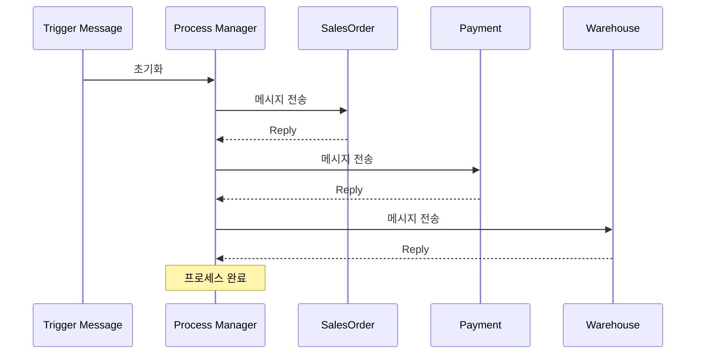

#### 핵심 차이점

| 특성 | Saga | Process Manager |
|------|------|-----------------|
| **제어 방식** | 이벤트 기반, 탈중앙화 | 중앙집중, 명시적 제어 |
| **상태 관리** | 각 서비스가 독립 관리 | PM이 전역 상태 추적 |
| **결합도** | 느슨한 결합 | 긴밀한 결합 |
| **실패 지점** | 분산 | 단일 (PM 자체) |
| **복잡도** | 추적 어려움 | 워크플로우 명확 |
| **적합성** | 마이크로서비스 | 복잡한 분기 로직 |

#### 2PC, Saga, Process Manager 관계

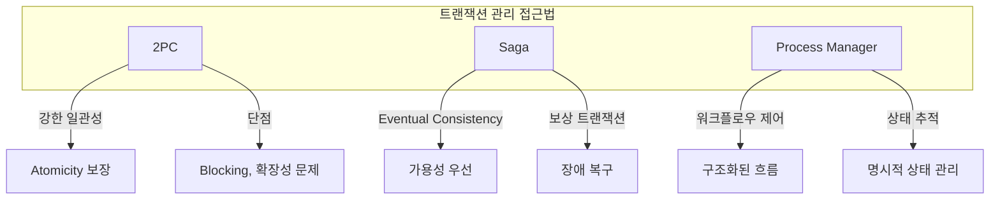

---

### 12.8 오류 처리 및 트랜잭션 복구

#### 실패 유형

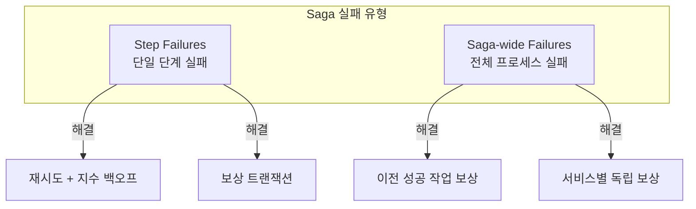

#### 복구 전략

| 전략 | 설명 | 예시 |
|------|------|------|
| **Forward Recovery** | 롤백 대신 대안 시도 | 기본 배송사 실패 → 대체 배송사 |
| **Backward Recovery** | 보상 트랜잭션으로 되돌림 | 결제 성공 → 재고 없음 → 환불 |
| **Partial Completion** | 일부만 성공 허용 | 항공 예약 성공, 호텔 실패 → 항공만 진행 |

#### 보상 트랜잭션 원칙

```
1. Immediate Compensation: 실패 시 즉시 보상
2. Deferred Compensation: 최종 결정까지 보상 지연
3. Idempotency: 여러 번 실행해도 동일 결과 보장
```

---

### 12.9 Durable Execution

#### Durable Execution의 4가지 요소

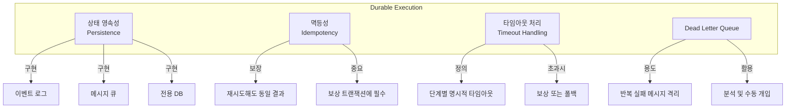

---

### 12.10 Event-Sourced Sagas

#### 이벤트 소싱 기반 Saga

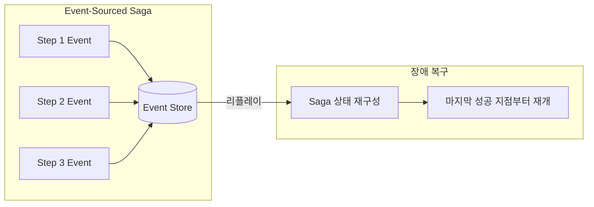

**장점:**
- 가변 상태 저장 대신 이벤트 시퀀스로 상태 유도
- 정밀한 복구 메커니즘
- CQRS와 자연스러운 통합
- Saga 진행 상황 효율적 쿼리

**참고:** Jonathan Oliver - [CQRS Sagas with Event Sourcing](https://blog.jonathanoliver.com/cqrs-sagas-with-event-sourcing-part-i-of-ii/)

---

## 💡 실무 적용 포인트

### Saga 설계 체크리스트

```
□ 패턴 선택
  ├── 비즈니스 요구사항 분석
  ├── 3가지 힘 평가 (Coordination, Consistency, Communication)
  ├── 결합도 허용 수준 결정
  └── Ford & Richards 매트릭스 참조

□ Choreography 적용 시
  ├── 이벤트 스키마 표준화
  ├── 이벤트 미처리 감지 메커니즘
  ├── 분산 추적 (Distributed Tracing) 도입
  └── 연쇄 장애 방지 패턴

□ Orchestration 적용 시
  ├── Orchestrator 고가용성 설계
  ├── 상태 영속화 전략
  ├── 버전 관리 (기존 프로세스 유지)
  └── 모니터링/로깅 체계

□ 오류 처리
  ├── 모든 단계에 보상 액션 정의
  ├── 멱등성 보장
  ├── 타임아웃 설정
  ├── Dead Letter Queue 구성
  └── Forward/Backward 복구 전략

□ Durable Execution
  ├── 상태 영속화 (Event Log/MQ/DB)
  ├── 재시작 후 복구 테스트
  ├── Poison Message 처리
  └── Event-Sourced Saga 고려
```

### 선택 결정 트리

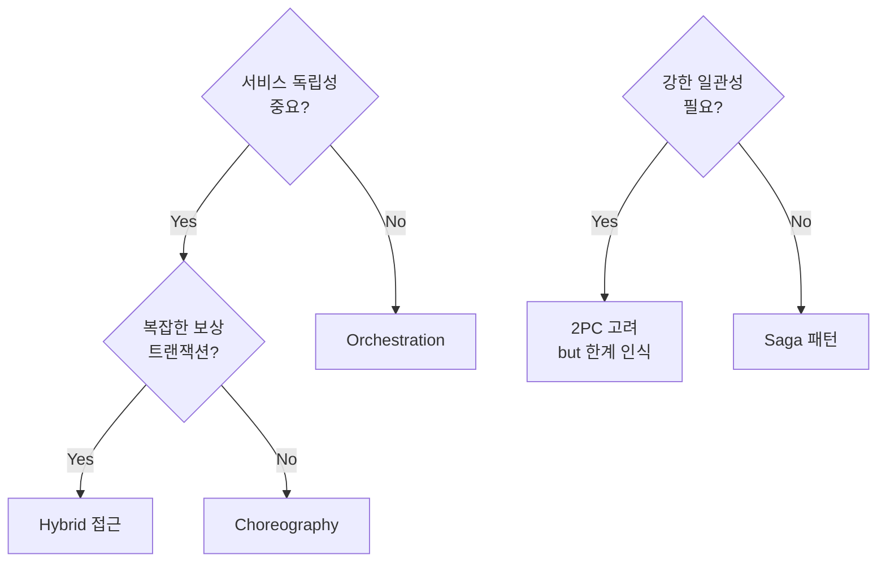

---

## ✅ 핵심 개념 체크리스트

- [ ] 2PC의 5가지 한계 (Blocking, SPOF, Fault Tolerance, Performance, Scalability)
- [ ] Saga 패턴: Eventual Consistency 기반 분산 트랜잭션
- [ ] 3가지 힘: Coordination, Consistency, Communication
- [ ] 8가지 Saga 유형 (Epic, Phone Tag, Fairy Tale 등)
- [ ] Choreography: 탈중앙화, 이벤트 기반, 느슨한 결합
- [ ] Orchestration: 중앙 조정자, 명시적 제어, 상태 머신
- [ ] Process Manager vs Saga: 중앙집중 vs 탈중앙화
- [ ] 보상 트랜잭션: Immediate, Deferred, Idempotent
- [ ] Forward vs Backward Recovery
- [ ] Durable Execution: 상태 영속성, 멱등성, 타임아웃, DLQ
- [ ] Event-Sourced Sagas: 이벤트 시퀀스로 상태 유도

---

## 🔗 참고 자료

- [Software Architecture: The Hard Parts - Neal Ford & Mark Richards](https://www.oreilly.com/library/view/software-architecture-the/9781492086888/)
- [Jonathan Oliver - CQRS Sagas with Event Sourcing](https://blog.jonathanoliver.com/cqrs-sagas-with-event-sourcing-part-i-of-ii/)
- [Microservices Patterns - Chris Richardson](https://microservices.io/patterns/data/saga.html)

---

## 📚 책 전체 마무리

> **"12개 챕터를 통해 DDD 리팩토링의 복잡성을 탐색했다 - 혼돈에서 시작하여, 패턴을 인식하고, 더 유연하고 모듈화된 시스템을 구축했다. 이제 도전은 당신의 것이다: 이 원칙들을 당신의 컨텍스트에 적용하고, 실험하고, 계속 개선하라. 코드는 변하지만, 그 뒤에 있는 사고방식이 진정한 차이를 만든다."**

### 전체 챕터 요약

| Part | Chapter | 핵심 주제 |
|------|---------|-----------|
| **Part 1** | 1-4 | DDD 기초: 진화, 복잡성, 전략적/전술적 패턴 |
| **Part 2** | 5-9 | 리팩토링: 원칙, 혼돈 탈출, CQRS, DB, CI/CD |
| **Part 3** | 10-12 | 마이크로서비스: 전환, 이벤트 진화, 오케스트레이션 |
